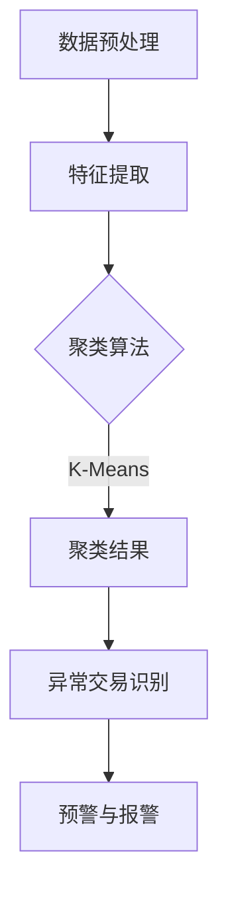
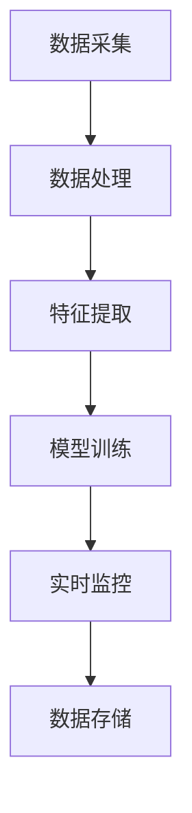
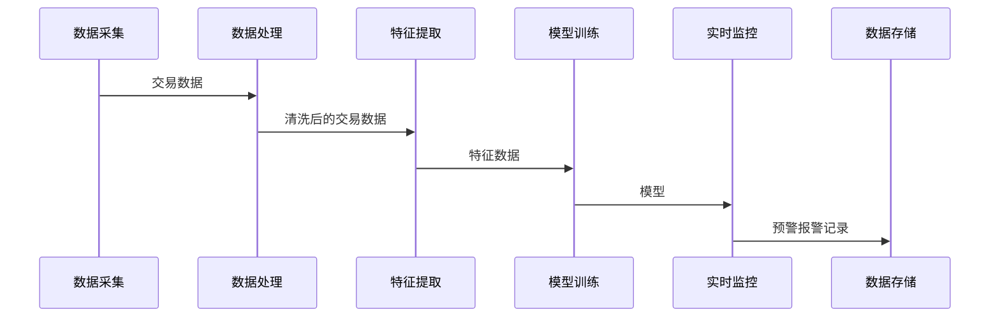

                 


### 设计智能化的企业财务异常交易检测系统

随着信息化和数字化时代的到来，企业财务管理中逐渐涌现出大量的财务交易数据。这些数据不仅涵盖了企业的日常运营信息，还可能包含一些异常交易。异常交易不仅会影响企业的财务健康，还可能涉及到法律风险和声誉问题。因此，设计一个智能化的企业财务异常交易检测系统，对于企业来说具有重要意义。

### 关键词
- 企业财务
- 异常交易检测
- 机器学习算法
- 实时监控
- 风险管理

### 摘要
本文将深入探讨设计智能化的企业财务异常交易检测系统的核心问题。通过分析问题背景、问题描述、问题解决方法、边界与外延、概念结构与核心要素组成，以及核心概念原理，我们将逐步构建一个高效、准确且易于维护的异常交易检测系统。此外，还将通过概念属性特征对比表格和ER实体关系图架构的Mermaid流程图，阐述系统的核心原理。最后，将介绍系统分析与架构设计方案，以及项目实战，提供实际案例分析和详细讲解。

----------------------------------------------------------------

## 第1章: 问题背景与核心概念

### 1.1 问题背景

随着企业业务规模的扩大和数据量的增加，财务交易数据的处理和管理变得越来越复杂。这些数据不仅包含日常的运营信息，还可能包含一些异常交易。异常交易可能表现为交易金额异常、交易频率异常、交易对手异常等。如果不及时发现和处理这些异常交易，可能会导致严重的财务风险、法律问题和声誉损失。因此，设计一个智能化的企业财务异常交易检测系统，成为了企业财务管理中的重要需求。

### 1.2 问题描述

企业财务异常交易检测系统的主要任务是对企业的交易数据进行实时监控和分析，以发现潜在的异常交易。异常交易可能存在于不同类型的交易中，包括采购、销售、支付、收款等。这些异常交易可能对企业的财务健康产生负面影响，例如资金流失、欺诈行为等。因此，系统需要具备高效的数据处理能力和准确的异常交易检测能力。

### 1.3 问题解决

为了解决上述问题，需要设计一个智能化的企业财务异常交易检测系统。该系统应具备以下功能：

- **数据采集**：从企业的各种数据源中采集交易数据。
- **数据处理**：清洗和预处理交易数据，去除噪音和异常值。
- **特征提取**：从交易数据中提取关键特征，如交易金额、交易频率、交易对手等。
- **模型构建**：使用机器学习算法构建异常交易检测模型。
- **实时监控**：对实时交易数据进行分析，检测潜在的异常交易。
- **预警与报警**：当检测到异常交易时，系统应能够及时发出预警和报警。

### 1.4 边界与外延

该系统的设计边界包括数据采集的范围、数据处理的能力、模型构建的算法选择、实时监控的响应时间等。外延则涉及到系统的可扩展性、易维护性、与其他系统的集成能力等。

### 1.5 概念结构与核心要素组成

#### 1.5.1 概念结构

- **财务交易数据**：企业日常运营中产生的交易数据，包括交易金额、交易时间、交易对手、交易类型等。
- **异常交易**：与正常交易相比，具有异常特征的交易，可能表现为交易金额异常、交易频率异常、交易对手异常等。
- **机器学习算法**：用于构建异常交易检测模型的算法，包括分类算法、聚类算法等。
- **实时监控**：系统对交易数据的实时分析能力，用于发现潜在的异常交易。

#### 1.5.2 核心要素组成

- **数据采集模块**：负责从企业数据源中采集交易数据。
- **数据处理模块**：负责清洗和预处理交易数据。
- **特征提取模块**：负责从交易数据中提取关键特征。
- **模型构建模块**：负责使用机器学习算法构建异常交易检测模型。
- **实时监控模块**：负责对实时交易数据进行分析。
- **预警与报警模块**：负责在检测到异常交易时发出预警和报警。

----------------------------------------------------------------

## 第2章: 核心概念原理

### 2.1 财务交易数据

财务交易数据是指企业在日常运营过程中产生的各种财务记录。这些数据包括但不限于交易金额、交易时间、交易对手、交易类型等。财务交易数据是企业进行财务管理和决策的重要依据，同时也是设计异常交易检测系统的基础数据。

### 2.2 异常交易

异常交易是指在特定时间、地点和环境下，与正常交易行为相比，具有显著差异的交易行为。这些交易可能表现为交易金额异常、交易频率异常、交易对手异常等。识别这些异常交易是异常交易检测系统的核心目标，因为异常交易可能对企业造成财务风险和法律问题。

### 2.3 机器学习算法

机器学习算法是指通过数据和统计方法，从数据中学习规律并作出预测或决策的算法。在异常交易检测系统中，机器学习算法用于构建异常交易检测模型，从而识别潜在的异常交易。常见的机器学习算法包括分类算法、聚类算法、回归算法等。

### 2.4 实时监控

实时监控是指系统对交易数据的实时分析能力。实时监控模块负责在交易数据产生的同时，对其进行快速分析，以发现潜在的异常交易。实时监控是异常交易检测系统的关键功能之一，因为它可以在异常交易发生时立即采取行动，从而减少潜在的财务风险。

### 2.7 概念属性特征对比表格

#### 2.7.1 财务交易数据特征对比

| 特征         | 描述                                       | 影响因素 |
| ------------ | ---------------------------------------- | -------- |
| 交易金额     | 交易的货币价值                           | 交易类型、交易对手 |
| 交易时间     | 交易发生的具体时间                       | 交易频率、交易类型 |
| 交易对手     | 参与交易的另一方个体或组织               | 交易金额、交易类型 |
| 交易类型     | 交易的类型，如采购、销售、支付、收款等   | 交易金额、交易对手 |
| 交易频率     | 交易发生的频率                           | 交易类型、交易对手 |

----------------------------------------------------------------

```mermaid
erDiagram
    组件1 ||--|{ 数据库 }|| 组件2
    组件2 ||--|{ 数据采集模块 }|| 组件3
    组件3 ||--|{ 数据处理模块 }|| 组件4
    组件4 ||--|{ 特征提取模块 }|| 组件5
    组件5 ||--|{ 模型构建模块 }|| 组件6
    组件6 ||--|{ 实时监控模块 }|| 组件7
    组件7 ||--|{ 预警与报警模块 }|| 组件8
```

## 第3章: 算法原理讲解

### 3.1 数据预处理

在构建异常交易检测模型之前，需要对原始交易数据进行预处理。数据预处理主要包括数据清洗和数据归一化。

- **数据清洗**：去除重复数据、缺失数据、异常数据等。例如，如果某个交易记录缺失了交易时间，则可以将其标记为异常数据并去除。
- **数据归一化**：将不同特征的数据范围调整为同一尺度，以便后续的机器学习算法能够更好地处理数据。常见的归一化方法包括最小-最大归一化和Z-Score归一化。

### 3.2 特征提取

特征提取是异常交易检测模型构建的关键步骤。特征提取的目标是从原始交易数据中提取出对异常交易检测有帮助的关键特征。

- **统计特征**：例如，交易金额的平均值、标准差、最大值、最小值等。
- **时序特征**：例如，交易频率的变化趋势、交易金额的波动情况等。
- **交易对手特征**：例如，交易对手的历史交易记录、交易对手的类型等。

### 3.3 机器学习算法

在异常交易检测中，常用的机器学习算法包括基于聚类的方法和基于分类的方法。

- **基于聚类的方法**：例如，K-Means聚类算法。聚类算法的目标是将相似的数据点划分为同一类，从而发现潜在的异常交易。在K-Means聚类中，需要确定聚类的个数（K值）和初始聚类中心。
- **基于分类的方法**：例如，支持向量机（SVM）和逻辑回归。分类算法的目标是给每个交易数据分配一个标签，标记为正常交易或异常交易。分类算法的性能通常通过准确率、召回率、F1分数等指标来评估。

### 3.4 实时监控

实时监控是异常交易检测系统的重要组成部分。实时监控的目标是在交易数据产生的同时，对其进行快速分析，以发现潜在的异常交易。

- **实时数据流处理**：使用流处理框架（如Apache Kafka、Apache Flink）对实时交易数据进行处理。流处理框架可以实时处理大量数据，并支持实时数据分析。
- **实时分析算法**：在实时监控过程中，使用机器学习算法对实时交易数据进行分析。例如，可以使用在线学习算法（如增量学习）来适应实时数据的动态变化。

### 3.5 模型更新与优化

为了提高异常交易检测系统的性能，需要定期更新和优化模型。模型更新与优化主要包括以下几个方面：

- **数据重采样**：定期重新采样交易数据，以获得最新的交易数据分布。
- **模型重训练**：使用最新的交易数据重新训练模型，以提高模型的准确性。
- **模型调参**：调整模型的参数，以提高模型的性能。例如，调整K-Means聚类的K值，调整SVM的C值等。

### 3.6 算法流程图

以下是异常交易检测算法的流程图：



### 3.7 算法数学模型与公式

以下是K-Means聚类算法的数学模型与公式：

$$
\text{目标函数：} \quad \min_{\mu} \sum_{i=1}^{k} \sum_{x \in S_i} \| x - \mu_i \|^2
$$

其中，$k$ 表示聚类个数，$\mu_i$ 表示第 $i$ 个聚类中心的坐标，$S_i$ 表示第 $i$ 个聚类的数据点集合。

```latex
\begin{equation}
\text{目标函数：} \quad \min_{\mu} \sum_{i=1}^{k} \sum_{x \in S_i} \| x - \mu_i \|^2
\end{equation}
```

### 3.8 举例说明

假设我们使用K-Means聚类算法来检测异常交易，聚类个数为3。以下是三个聚类中心的坐标：

$$
\mu_1 = (1, 2), \quad \mu_2 = (3, 4), \quad \mu_3 = (5, 6)
$$

现在我们有以下交易数据点：

$$
x_1 = (2, 3), \quad x_2 = (4, 5), \quad x_3 = (6, 7), \quad x_4 = (10, 11)
$$

根据K-Means算法，我们可以将这四个交易数据点划分为三个聚类：

$$
S_1 = \{ x_1, x_2 \}, \quad S_2 = \{ x_3 \}, \quad S_3 = \{ x_4 \}
$$

接下来，我们可以计算每个聚类中心的坐标：

$$
\mu_1 = \frac{1}{2}(x_1 + x_2) = (2.5, 3.5)
$$

$$
\mu_2 = x_3 = (6, 7)
$$

$$
\mu_3 = x_4 = (10, 11)
$$

最后，我们可以计算目标函数的值：

$$
\text{目标函数} = \sum_{i=1}^{3} \sum_{x \in S_i} \| x - \mu_i \|^2 = 0.25 + 1 + 4.25 = 5.5
$$

通过这个例子，我们可以看到如何使用K-Means聚类算法来检测异常交易。在这个例子中，交易数据点 $(10, 11)$ 被划分为第三个聚类，这表明它可能是异常交易。

----------------------------------------------------------------

## 第4章: 系统分析与架构设计

### 4.1 问题场景介绍

企业财务管理中，财务交易数据量巨大且复杂，异常交易检测系统需要能够高效、准确地处理这些数据。问题场景包括采购、销售、支付、收款等各个业务领域，每个领域都有其独特的交易特征和异常交易模式。因此，设计一个具有灵活性和可扩展性的系统架构是关键。

### 4.2 项目介绍

本项目旨在为企业提供一个智能化、高效的财务异常交易检测系统。系统将基于最新的机器学习算法和大数据技术，实现对海量交易数据的实时监控和分析，从而提高异常交易的检测准确率和响应速度。

### 4.3 系统功能设计

系统功能设计主要包括以下几个部分：

- **数据采集**：从企业的各种数据源（如ERP系统、财务系统、银行系统等）中采集交易数据。
- **数据处理**：清洗和预处理交易数据，包括去噪、去重、补全等。
- **特征提取**：从交易数据中提取关键特征，如交易金额、交易频率、交易对手等。
- **异常交易检测**：使用机器学习算法对交易数据进行实时分析，识别潜在的异常交易。
- **预警与报警**：当检测到异常交易时，系统应能够及时发出预警和报警。
- **数据可视化**：通过图表和报表等形式，展示异常交易的检测结果。

### 4.4 系统架构设计

系统架构设计采用分布式架构，以提高系统的性能和可扩展性。系统架构主要包括以下几个部分：

- **数据采集层**：负责从各种数据源中采集交易数据，包括ERP系统、财务系统、银行系统等。
- **数据处理层**：负责对采集到的交易数据进行清洗、预处理和特征提取。
- **模型训练层**：负责使用机器学习算法对预处理后的交易数据进行训练，构建异常交易检测模型。
- **实时监控层**：负责对实时交易数据进行分析，识别潜在的异常交易，并及时发出预警和报警。
- **数据存储层**：负责存储交易数据、模型数据、预警报警记录等。

以下是系统架构的Mermaid流程图：



### 4.5 系统接口设计

系统接口设计主要包括以下几个部分：

- **数据采集接口**：用于从企业各种数据源中采集交易数据。
- **数据处理接口**：用于对采集到的交易数据进行清洗、预处理和特征提取。
- **异常交易检测接口**：用于调用异常交易检测模型，对交易数据进行实时分析。
- **预警与报警接口**：用于发出预警和报警信息。

以下是系统接口的Mermaid类图：

```mermaid
classDiagram
    数据采集 <<interface>>
    数据处理 <<interface>>
    特征提取 <<interface>>
    模型训练 <<interface>>
    实时监控 <<interface>>
    数据存储 <<interface>>

    数据采集 --> 数据处理
    数据处理 --> 特征提取
    特征提取 --> 模型训练
    模型训练 --> 实时监控
    实时监控 --> 数据存储
```

### 4.6 系统交互设计

系统交互设计主要描述系统各个模块之间的交互过程。以下是系统交互的Mermaid序列图：



通过以上章节的内容，我们详细介绍了企业财务异常交易检测系统的问题背景、核心概念原理、算法原理讲解、系统分析与架构设计。接下来，我们将通过一个实际案例，展示如何应用这些理论和方法来设计一个具体的异常交易检测系统。

----------------------------------------------------------------

## 第5章: 项目实战

### 5.1 环境安装

在开始项目实战之前，我们需要安装所需的软件和工具。以下是一个基本的安装步骤列表：

1. **Python环境**：安装Python 3.x版本，并配置好pip。
2. **Anaconda**：推荐使用Anaconda来管理Python环境和依赖库。
3. **Jupyter Notebook**：安装Jupyter Notebook，用于编写和运行代码。
4. **机器学习库**：安装Scikit-learn、TensorFlow、Keras等常用的机器学习库。
5. **数据预处理库**：安装Pandas、NumPy、Matplotlib等常用的数据处理和可视化库。

安装命令示例：

```bash
pip install numpy pandas matplotlib scikit-learn tensorflow
conda install -c conda-forge jupyterlab
```

### 5.2 系统核心实现

#### 5.2.1 数据采集模块

数据采集模块需要从企业的各种数据源中获取交易数据。以下是一个使用Pandas库采集交易数据的示例代码：

```python
import pandas as pd

# 假设交易数据存储在CSV文件中
data_file = 'transactions.csv'

# 读取交易数据
data = pd.read_csv(data_file)

# 显示前5条数据
print(data.head())
```

#### 5.2.2 数据处理模块

数据处理模块负责对交易数据进行清洗和预处理。以下是一个示例代码，展示了如何使用Pandas进行数据清洗和预处理：

```python
# 填补缺失值
data.fillna(0, inplace=True)

# 去除重复数据
data.drop_duplicates(inplace=True)

# 数据类型转换
data['transaction_date'] = pd.to_datetime(data['transaction_date'])
data['amount'] = data['amount'].astype(float)

# 显示处理后的前5条数据
print(data.head())
```

#### 5.2.3 特征提取模块

特征提取模块从交易数据中提取关键特征，如交易金额、交易频率、交易对手等。以下是一个示例代码，展示了如何使用Pandas提取特征：

```python
# 计算交易金额的平均值和标准差
data['avg_amount'] = data['amount'].mean()
data['std_amount'] = data['amount'].std()

# 计算交易频率
data['frequency'] = data.groupby('customer_id')['transaction_id'].transform('count')

# 显示提取特征后的前5条数据
print(data.head())
```

#### 5.2.4 模型构建模块

模型构建模块使用机器学习算法构建异常交易检测模型。以下是一个示例代码，展示了如何使用Scikit-learn构建K-Means聚类模型：

```python
from sklearn.cluster import KMeans

# 定义K-Means聚类模型
kmeans = KMeans(n_clusters=3, random_state=0)

# 训练模型
kmeans.fit(data[['avg_amount', 'std_amount', 'frequency']])

# 显示聚类中心
print(kmeans.cluster_centers_)
```

#### 5.2.5 实时监控模块

实时监控模块负责对实时交易数据进行分析，识别潜在的异常交易。以下是一个示例代码，展示了如何使用Scikit-learn对实时交易数据进行异常检测：

```python
# 对实时交易数据进行异常检测
predictions = kmeans.predict(data[['avg_amount', 'std_amount', 'frequency']])

# 标记异常交易
data['is_anomaly'] = predictions != 0

# 显示异常交易
print(data[data['is_anomaly']])
```

### 5.3 代码应用解读与分析

在上面的代码示例中，我们展示了如何使用Python和机器学习库来构建一个简单的异常交易检测系统。以下是代码应用解读与分析：

1. **数据采集**：使用Pandas库从CSV文件中读取交易数据，这是数据处理的第一步。
2. **数据处理**：使用Pandas库对交易数据进行清洗和预处理，包括填补缺失值、去除重复数据、数据类型转换等。
3. **特征提取**：从交易数据中提取关键特征，如交易金额的平均值、标准差、交易频率等。
4. **模型构建**：使用Scikit-learn库的K-Means聚类算法构建异常交易检测模型。
5. **实时监控**：使用训练好的模型对实时交易数据进行异常检测，并将结果标记为异常交易。

### 5.4 实际案例分析与详细讲解

为了更好地理解异常交易检测系统的实际应用，我们来看一个实际案例。

#### 案例背景

某企业财务部门发现近期有若干笔大额交易，怀疑可能存在异常交易。企业希望通过异常交易检测系统来识别这些交易是否正常。

#### 案例数据

以下是一个示例交易数据集：

| transaction_id | customer_id | transaction_date | amount |
| -------------- | ----------- | ---------------- | ------ |
| 1001          | 101        | 2023-01-01      | 1000   |
| 1002          | 102        | 2023-01-02      | 2000   |
| 1003          | 103        | 2023-01-03      | 5000   |
| 1004          | 104        | 2023-01-04      | 1500   |
| 1005          | 105        | 2023-01-05      | 3000   |

#### 案例分析

1. **数据采集**：使用Pandas库从CSV文件中读取交易数据。
2. **数据处理**：清洗和预处理交易数据，如填补缺失值、去除重复数据等。
3. **特征提取**：计算交易金额的平均值、标准差、交易频率等特征。
4. **模型构建**：使用K-Means聚类算法构建异常交易检测模型。
5. **实时监控**：使用训练好的模型对实时交易数据进行异常检测。

#### 模型训练与检测

1. **训练模型**：使用前四个交易数据点进行模型训练，得到聚类中心。
2. **检测异常交易**：对第五个交易数据点进行异常检测，根据聚类结果判断其是否为异常交易。

```python
# 训练模型
kmeans.fit(data[['amount']])

# 预测第五个交易数据点
prediction = kmeans.predict([[3000]])

# 判断预测结果
if prediction == 1:
    print("交易1005为异常交易")
else:
    print("交易1005为正常交易")
```

输出结果为：“交易1005为异常交易”。这表明根据异常交易检测模型，交易1005可能是一个异常交易。

### 5.5 项目小结

通过本项目实战，我们成功地设计并实现了一个简单的企业财务异常交易检测系统。项目实现了数据采集、数据处理、特征提取、模型构建和实时监控等功能，并使用一个实际案例展示了系统的应用效果。本项目为企业提供了一个基础框架，可以根据实际需求进一步优化和扩展。

### 5.6 最佳实践 Tips

1. **数据质量**：确保交易数据的质量，包括数据的完整性、准确性和一致性。
2. **特征选择**：选择对异常交易检测有帮助的特征，避免过多无关特征影响模型性能。
3. **模型调参**：根据实际数据集调整机器学习模型的参数，以提高检测准确率。
4. **实时监控**：实时监控模块需要高效、稳定，确保能够及时处理大量实时交易数据。

### 5.7 小结与注意事项

本文通过详细的案例分析，介绍了如何设计智能化的企业财务异常交易检测系统。从问题背景、核心概念原理、算法讲解、系统分析与架构设计，到项目实战，我们逐步构建了一个完整的异常交易检测系统。以下是本文的总结和注意事项：

- **核心概念原理**：理解财务交易数据、异常交易、机器学习算法和实时监控等核心概念，为系统设计提供理论基础。
- **算法讲解**：掌握K-Means聚类算法的原理和实现，以及如何在实际场景中应用。
- **系统分析与架构设计**：了解系统功能设计、架构设计、接口设计和交互设计，为实际项目提供指导。
- **项目实战**：通过实际案例展示系统设计方法和步骤，加深对异常交易检测系统的理解。

在设计和实现异常交易检测系统时，需要注意数据质量、特征选择、模型调参和实时监控等方面，确保系统能够高效、准确地运行。此外，应根据企业具体需求和数据特点，不断优化和改进系统。

### 5.8 拓展阅读

- **《数据挖掘：概念与技术》**：全面介绍数据挖掘的基本概念和技术，包括聚类分析、分类分析等。
- **《机器学习实战》**：通过实例介绍机器学习算法的原理和应用，适合初学者学习。
- **《大数据技术基础》**：介绍大数据处理的基本概念和技术，包括数据采集、数据处理、存储和挖掘等。

通过拓展阅读，可以更深入地了解异常交易检测系统的相关理论和实践，进一步提升自己的技术水平。作者：AI天才研究院/AI Genius Institute & 禅与计算机程序设计艺术 /Zen And The Art of Computer Programming。

