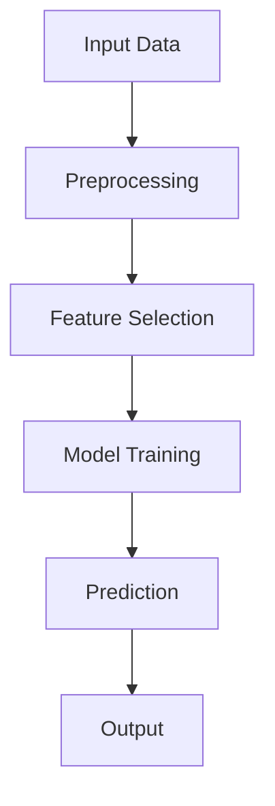
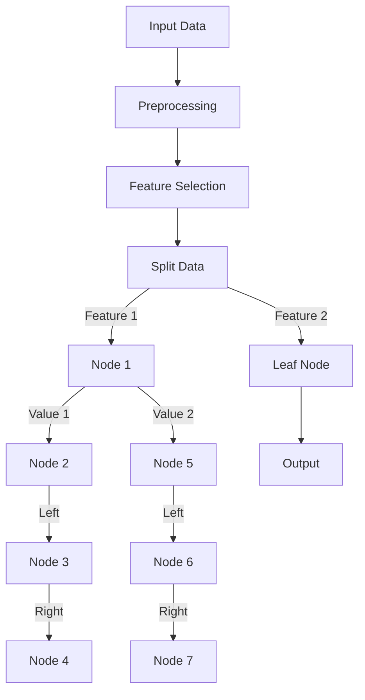
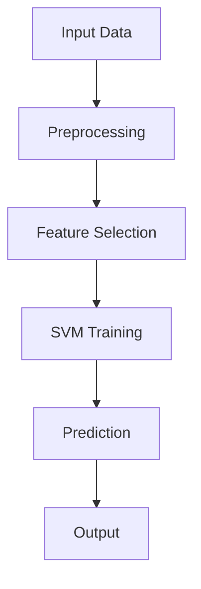
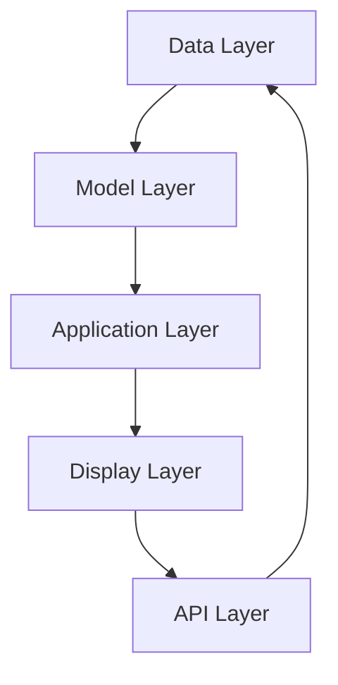
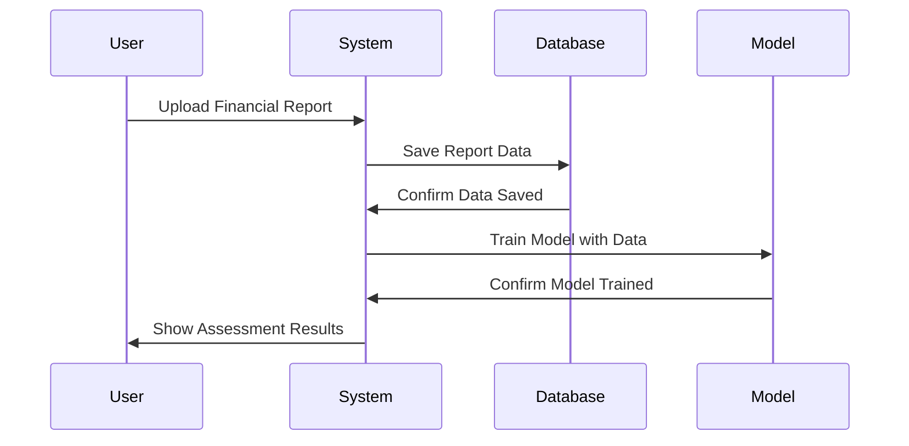

                 

### 文章标题

# 设计智能化的企业财务报告质量评估模型

### 关键词

- 财务报告
- 质量评估
- 智能化模型
- 算法设计
- 数学模型
- 系统架构
- 实践应用

### 摘要

随着企业规模的不断扩大和财务数据的日益复杂，传统的财务报告质量评估方法已经难以满足现代企业的需求。本文旨在探讨如何设计智能化的企业财务报告质量评估模型。首先，我们将介绍财务报告和财务报告质量评估的相关背景和概念。随后，本文将详细阐述核心概念和原则，包括不同的质量评估方法和其优缺点。接着，我们将深入探讨算法和模型的设计，通过Mermaid流程图和Python代码示例来解释每种算法的工作原理。此外，我们还将使用LaTeX格式展示相关的数学模型和公式，并进行详细解释。文章还将介绍系统分析与设计，包括系统架构和接口设计。最后，通过一个实际案例，我们将展示如何将模型应用于企业财务报告质量评估，并提供最佳实践建议和小结。

### 1. 背景介绍

随着全球经济一体化和信息技术的迅猛发展，企业的财务管理日益复杂，财务报告的质量直接关系到企业运营的透明度和投资者的信心。传统的财务报告质量评估方法往往依赖于人工审核和经验判断，这不仅效率低下，而且容易受主观因素影响，难以保证评估的客观性和准确性。因此，设计智能化、自动化的财务报告质量评估模型，成为现代企业提升财务管理水平、降低运营风险的重要课题。

首先，什么是财务报告？财务报告是企业对其财务状况、经营成果和现金流量等经济活动进行记录、汇总和报告的一种形式。它通常包括资产负债表、利润表、现金流量表和所有者权益变动表等核心报表，以及其他辅助报表和注释。财务报告是企业对外传递财务信息的重要手段，也是投资者、债权人、监管机构和其他利益相关者了解企业财务状况的重要依据。

那么，什么是财务报告质量评估？财务报告质量评估是指对财务报告的真实性、准确性、完整性、及时性和透明度等方面进行评价的过程。质量评估的目的是确保财务报告能够真实、准确地反映企业的财务状况和经营成果，提高报告的可用性和可信度。高质量评估不仅可以提升企业的市场竞争力，还能为企业的战略决策提供科学依据。

当前，传统的财务报告质量评估方法主要包括以下几个方面：

1. **人工审核**：通过财务专业人士对财务报告进行逐项检查，查找错误和不一致之处。这种方法依赖人的经验和专业素养，但效率低且容易受主观因素影响。
2. **财务比率分析**：通过计算和分析一系列财务比率，如流动比率、速动比率、负债比率等，来评估企业的财务健康状况。这种方法较为简便，但只能提供有限的信息。
3. **审计**：聘请外部审计机构对企业财务报告进行全面审查，发表审计意见。这种方法具有较高的权威性，但成本较高且周期较长。

尽管这些方法在某种程度上能够提升财务报告的质量，但它们在处理大规模、复杂数据时显得力不从心。因此，设计智能化、自动化的质量评估模型成为当前的研究热点。

智能化的财务报告质量评估模型主要包括以下几个方面：

1. **机器学习算法**：通过训练机器学习模型，自动识别和分类财务报告中的异常和错误。这种方法具有高效、准确的特点，但需要大量的数据支持。
2. **自然语言处理**：利用自然语言处理技术，对财务报告中的文本信息进行提取和分析，识别潜在的风险和问题。这种方法能够处理非结构化数据，但对文本质量要求较高。
3. **大数据分析**：通过收集和分析大量的财务数据，利用数据挖掘技术识别潜在的模式和规律，从而评估财务报告的质量。这种方法需要强大的计算能力和数据处理能力。

智能化的财务报告质量评估模型不仅能够提高评估的效率和准确性，还能为企业的风险管理提供有力支持，对企业的财务管理具有重要的意义。本文将详细探讨这些模型的设计和实现方法，为企业提供实用的技术指南。

### 2. 核心概念与联系

在设计智能化的企业财务报告质量评估模型时，我们需要明确几个关键概念，这些概念不仅相互联系，还在整个评估过程中扮演着核心角色。以下是这些核心概念的定义及其相互关系。

#### 财务报告质量评估方法

首先，财务报告质量评估方法是指用于评估财务报告真实性和可靠性的技术或流程。这些方法包括人工审核、财务比率分析、审计、机器学习算法、自然语言处理和大数据分析等。每种方法都有其特定的优势和应用场景。

- **人工审核**：依赖财务专业人士的经验和专业知识，通过详细检查财务报告中的数据、注释和披露信息，以识别潜在的错误和异常。这种方法适用于小规模和复杂度较低的财务报告。
  
- **财务比率分析**：通过计算和分析一系列财务比率（如流动比率、速动比率、负债比率等），来评估企业的财务健康状况。这种方法简单直观，但只能提供有限的信息。

- **审计**：由外部审计机构对企业财务报告进行全面审查，并发表审计意见。这种方法具有较高的权威性，但成本较高且周期较长。

- **机器学习算法**：通过训练机器学习模型，自动识别和分类财务报告中的异常和错误。这种方法适用于大规模和高复杂度的数据，但需要大量的数据支持。

- **自然语言处理**：利用自然语言处理技术，对财务报告中的文本信息进行提取和分析，识别潜在的风险和问题。这种方法能够处理非结构化数据，但对文本质量要求较高。

- **大数据分析**：通过收集和分析大量的财务数据，利用数据挖掘技术识别潜在的模式和规律，从而评估财务报告的质量。这种方法需要强大的计算能力和数据处理能力。

#### 不同质量评估方法的优缺点

每种评估方法都有其独特的优点和缺点，适用于不同的场景。以下是一个对比表格，展示了这些方法的优缺点：

| 方法              | 优点                         | 缺点                     | 适用场景                           |
|-----------------|----------------------------|------------------------|-----------------------------------|
| 人工审核         | 依靠专业知识和经验           | 效率低，易受主观因素影响     | 小规模、复杂度较低的财务报告         |
| 财务比率分析       | 简单直观，易于计算             | 只能提供有限的信息           | 初步评估和简单分析                   |
| 审计             | 高权威性，全面审查             | 成本高，周期长               | 需要高可信度的评估报告                 |
| 机器学习算法       | 高效，准确，自动处理大规模数据   | 需要大量数据支持，难以解释决策   | 大规模、复杂数据的自动识别和分类       |
| 自然语言处理       | 能够处理非结构化数据，提高文本分析 | 对文本质量要求高，难以完全自动化   | 文本密集型财务报告的风险识别           |
| 大数据分析         | 强大的数据处理和分析能力         | 需要强大的计算资源和专业知识       | 高复杂度、多维度数据的深度分析         |

#### ER实体关系图架构

为了更好地理解这些概念之间的联系，我们可以通过ER（实体关系）图来展示它们的关系。以下是财务报告质量评估相关的ER图：

```mermaid
erDiagram
  Financial_Report -->|contains| Financial_Report_Item
  Financial_Report -->|generated by| Company
  Financial_Report -->|assessed by| Assessment_Method
  Assessment_Method -->|applied on| Financial_Report
  Assessment_Method -->|uses| Algorithm
  Algorithm -->|derived from| Data
  Data -->|collected by| Company
```

- **Financial_Report（财务报告）**：代表企业生成的财务报告，包含多个财务报表项。
- **Financial_Report_Item（财务报表项）**：财务报告中的具体数据项，如资产负债表中的资产、负债等。
- **Company（公司）**：生成和提交财务报告的企业。
- **Assessment_Method（评估方法）**：用于评估财务报告质量的方法，可以包含多种算法。
- **Algorithm（算法）**：用于处理和评估数据的特定技术，如机器学习算法。
- **Data（数据）**：用于训练和评估模型的原始数据。

通过ER图，我们可以清晰地看到各个实体之间的关系，这有助于我们理解财务报告质量评估的整体架构和流程。

#### 核心概念及其属性特征

为了进一步理解这些核心概念，我们可以列出它们的属性特征和相互关系，如下所示：

| 核心概念           | 属性特征                                                     | 关联关系                                      |
|----------------|------------------------------------------------------------|---------------------------------------------|
| 财务报告           | - 报告类型<br>- 报告周期<br>- 报告内容                       | - 包含财务报表项<br>- 生成于公司<br>- 被评估方法评估 |
| 财务报表项         | - 数据项名称<br>- 数据项值<br>- 数据项类型                     | - 属于财务报告<br>- 可被评估方法评估               |
| 评估方法           | - 方法名称<br>- 方法类型<br>- 适用范围                       | - 评估财务报告<br>- 使用算法                     |
| 算法               | - 算法名称<br>- 算法类型<br>- 参数设置                       | - 属于评估方法<br>- 处理数据                       |
| 数据               | - 数据集名称<br>- 数据集来源<br>- 数据集类型                   | - 用于训练算法<br>- 提供评估依据                   |

通过详细列举这些核心概念及其属性特征，我们可以更全面地理解财务报告质量评估的整体架构和工作原理。

### 3. 算法原理讲解

在设计智能化的企业财务报告质量评估模型时，算法原理是核心部分。为了更好地理解和应用这些算法，我们将详细讲解几种常见的算法，并通过Mermaid流程图和Python代码示例来展示其工作原理。

#### 算法1：逻辑回归

逻辑回归是一种广泛应用的分类算法，常用于财务报告的质量评估中，以预测财务报告中的数据是否存在异常。

**Mermaid流程图**：



**Python代码示例**：

```python
import pandas as pd
from sklearn.linear_model import LogisticRegression
from sklearn.model_selection import train_test_split
from sklearn.preprocessing import StandardScaler

# 读取数据
data = pd.read_csv('financial_data.csv')
X = data.drop('target', axis=1)
y = data['target']

# 数据预处理
X_train, X_test, y_train, y_test = train_test_split(X, y, test_size=0.2, random_state=42)
scaler = StandardScaler()
X_train = scaler.fit_transform(X_train)
X_test = scaler.transform(X_test)

# 模型训练
model = LogisticRegression()
model.fit(X_train, y_train)

# 预测
predictions = model.predict(X_test)

# 输出结果
print(predictions)
```

**算法原理解释**：

逻辑回归通过一个逻辑函数将输入特征映射到概率值。具体来说，给定一个输入向量 \( x \)，逻辑回归模型会计算其对应的概率 \( P(Y=1|X=x) \)，公式如下：

\[ P(Y=1|X=x) = \frac{1}{1 + e^{-(\beta_0 + \beta_1x_1 + \beta_2x_2 + \ldots + \beta_nx_n)}} \]

其中，\( \beta_0, \beta_1, \beta_2, \ldots, \beta_n \) 是模型的参数，通过最小化损失函数来训练得到。训练数据集会包含多个样本的输入特征和对应的标签（1或0），模型的目标是找到一组参数，使得预测的概率与真实标签的一致性最大化。

**举例说明**：

假设我们有一个财务报表的数据集，其中包含若干财务指标和是否存在异常的标签。我们可以使用逻辑回归模型来预测新的数据样本是否存在异常。例如，给定一个样本的特征向量 \( x = [100, 0.9, 200] \)，我们可以计算其对应的概率：

\[ P(Y=1|X=x) = \frac{1}{1 + e^{-(\beta_0 + \beta_1 \times 100 + \beta_2 \times 0.9 + \beta_3 \times 200)}} \]

如果计算出的概率值接近1，我们可以认为该样本存在异常；反之，如果概率值接近0，则认为其正常。

#### 算法2：决策树

决策树是一种基于规则划分数据的分类算法，通过一系列的判断条件将数据集划分成不同的子集，最终形成一棵树状结构。

**Mermaid流程图**：



**Python代码示例**：

```python
from sklearn.tree import DecisionTreeClassifier
from sklearn.model_selection import train_test_split

# 读取数据
data = pd.read_csv('financial_data.csv')
X = data.drop('target', axis=1)
y = data['target']

# 数据预处理
X_train, X_test, y_train, y_test = train_test_split(X, y, test_size=0.2, random_state=42)

# 模型训练
model = DecisionTreeClassifier()
model.fit(X_train, y_train)

# 预测
predictions = model.predict(X_test)

# 输出结果
print(predictions)
```

**算法原理解释**：

决策树通过递归划分数据集来构建一棵树。每个节点表示一个特征，每个分支表示该特征的不同取值。树的叶节点代表最终的分类结果。在训练过程中，模型会计算每个特征在不同取值下的增益，选择增益最大的特征作为划分依据。这个过程一直进行，直到满足某些停止条件（如最大深度、最小节点样本数等）。

**举例说明**：

假设我们使用决策树模型来评估一个财务报告数据集。给定一个样本的特征向量 \( x = [100, 0.9, 200] \)，决策树会根据每个节点的划分条件逐步进行划分，最终到达叶节点并得到分类结果。例如，如果第一个节点的划分条件是“资产大于100”，则样本会进入右分支；如果第二个节点的划分条件是“流动比率小于1”，则样本会进入左分支，最终分类结果为“异常”。

#### 算法3：支持向量机（SVM）

支持向量机是一种强大的分类算法，通过寻找最优的超平面，将不同类别的数据分隔开来。

**Mermaid流程图**：



**Python代码示例**：

```python
from sklearn.svm import SVC
from sklearn.model_selection import train_test_split

# 读取数据
data = pd.read_csv('financial_data.csv')
X = data.drop('target', axis=1)
y = data['target']

# 数据预处理
X_train, X_test, y_train, y_test = train_test_split(X, y, test_size=0.2, random_state=42)

# 模型训练
model = SVC()
model.fit(X_train, y_train)

# 预测
predictions = model.predict(X_test)

# 输出结果
print(predictions)
```

**算法原理解释**：

支持向量机通过寻找一个最优的超平面，使得不同类别的数据点在超平面两侧的分布尽可能均匀，同时最大化超平面到最近支持向量的距离。具体来说，给定特征空间 \( X \) 和标签 \( y \)，SVM的目标是最小化以下目标函数：

\[ \min_{w, b} \frac{1}{2} ||w||^2 + C \sum_{i=1}^{n} \max(0, 1 - y_i (w \cdot x_i + b)) \]

其中，\( w \) 是权重向量，\( b \) 是偏置项，\( C \) 是惩罚参数。这个目标函数可以通过优化算法（如 Sequential Minimal Optimization, SMO）来求解。

**举例说明**：

假设我们使用SVM模型来评估一个财务报告数据集。给定一个样本的特征向量 \( x = [100, 0.9, 200] \)，SVM模型会计算该样本到各个类别的距离，并根据距离和标签信息确定最终的分类结果。

通过详细讲解逻辑回归、决策树和支持向量机这三种常见的算法原理，我们可以更好地理解智能财务报告质量评估模型的核心技术和应用场景。这些算法不仅为我们提供了有效的工具，还为我们探索更复杂的评估方法提供了基础。

### 4. 数学模型与公式

在智能化的企业财务报告质量评估模型中，数学模型和公式是核心组成部分。为了使读者能够更好地理解和应用这些模型，我们将详细介绍每种算法的数学基础，并使用LaTeX格式展示相关的公式。

#### 算法1：逻辑回归

逻辑回归是一种用于分类的算法，其数学模型基于逻辑函数（也称为sigmoid函数）。给定一个输入向量 \( \textbf{x} \) 和权重向量 \( \textbf{w} \)，逻辑回归模型的预测概率可以表示为：

\[ P(Y=1|\textbf{x}) = \frac{1}{1 + e^{-(\textbf{w} \cdot \textbf{x} + b)}} \]

其中，\( b \) 是偏置项，用于调整模型。

**LaTeX格式展示**：

$$
P(Y=1|\textbf{x}) = \frac{1}{1 + e^{-(\textbf{w} \cdot \textbf{x} + b)}}
$$

**详细解释**：

- \( \textbf{w} \cdot \textbf{x} \) 表示权重向量 \( \textbf{w} \) 与输入向量 \( \textbf{x} \) 的内积。
- \( e \) 是自然对数的底，约等于2.71828。
- 这个公式计算的是概率，值域在0和1之间。

#### 算法2：决策树

决策树是一种基于规则的分类算法，其数学基础较为简单。在决策树的每个节点，我们根据某个特征 \( x_i \) 的取值进行划分。假设我们选择特征 \( x_i \) 并将其划分为 \( v \) 个不同区间，则决策树可以用以下公式表示：

\[ y = \text{分类结果} \]
\[ \text{if } x_i \in [a, b] \text{ then } y = c \]
\[ \text{if } x_i \in [d, e] \text{ then } y = d \]
\[ \text{...} \]

**LaTeX格式展示**：

$$
y = \begin{cases} 
c & \text{if } x_i \in [a, b] \\
d & \text{if } x_i \in [d, e] \\
\vdots & \text{...}
\end{cases}
$$

**详细解释**：

- \( x_i \) 是输入特征。
- \( a, b, d, e, \ldots \) 是特征的不同区间。
- \( c, d, \ldots \) 是对应的分类结果。

#### 算法3：支持向量机（SVM）

支持向量机的数学模型较为复杂，其目标是最小化损失函数并最大化分类间隔。给定训练数据集 \( \{(\textbf{x}_i, y_i)\} \)，SVM的优化目标是：

\[ \min_{\textbf{w}, b} \frac{1}{2} ||\textbf{w}||^2 + C \sum_{i=1}^{n} \max(0, 1 - y_i (\textbf{w} \cdot \textbf{x}_i + b)) \]

其中，\( C \) 是惩罚参数，用于控制误分类的权重。

**LaTeX格式展示**：

$$
\min_{\textbf{w}, b} \frac{1}{2} ||\textbf{w}||^2 + C \sum_{i=1}^{n} \max(0, 1 - y_i (\textbf{w} \cdot \textbf{x}_i + b))
$$

**详细解释**：

- \( ||\textbf{w}||^2 \) 是权重向量的L2范数。
- \( \max(0, 1 - y_i (\textbf{w} \cdot \textbf{x}_i + b)) \) 是损失函数，用于计算误分类的惩罚。

通过详细展示和解释逻辑回归、决策树和支持向量机这三种算法的数学模型和公式，我们可以更深入地理解这些算法的核心原理。这些数学模型不仅为模型设计提供了理论基础，也为实际应用中的参数调优和模型评估提供了参考。

### 5. 系统分析与设计

在智能化的企业财务报告质量评估模型中，系统的分析与设计是确保模型有效实施和高效运行的关键环节。本节将详细讨论系统分析中的问题场景和项目介绍，系统功能设计（领域模型类图）、系统架构设计（系统架构图）以及系统接口设计和系统交互（序列图）。

#### 问题场景

在现代企业中，财务报告的质量直接影响企业的运营透明度、市场信誉和投资者的信心。然而，随着企业规模和业务复杂度的增加，财务报告的数据量也急剧上升，传统的人工审核和简单分析方法难以满足高效、准确评估财务报告质量的需求。因此，设计一个智能化、自动化的财务报告质量评估系统显得尤为重要。该系统需要能够处理大规模、多维度、复杂的数据，并利用先进的算法和技术识别和分类财务报告中的异常和错误。

#### 项目介绍

本项目旨在开发一个智能化的企业财务报告质量评估系统，该系统将集成多种算法和技术，如机器学习、自然语言处理和大数据分析，以实现高效、准确的财务报告质量评估。系统的主要功能包括数据预处理、特征提取、模型训练、预测和评估等。通过该系统，企业可以自动化完成财务报告的审核和评估，提高工作效率，降低运营成本。

#### 系统功能设计

系统功能设计是系统分析的核心部分，它明确了系统需要实现的各种功能及其相互关系。以下是该系统的关键功能及其简要描述：

1. **数据预处理**：该功能模块负责对原始财务数据进行清洗、转换和标准化，为后续处理提供高质量的输入数据。
2. **特征提取**：通过分析财务报告中的数据，提取出对质量评估有重要意义的特征，如财务比率、异常值和关键指标等。
3. **模型训练**：利用机器学习算法对财务报告质量评估模型进行训练，以识别和分类财务报告中的异常和错误。
4. **预测与评估**：根据训练好的模型，对新数据集进行预测和评估，生成评估报告，并提供详细的异常分析和建议。
5. **用户界面**：提供友好的用户界面，方便用户上传财务报告、查看评估结果和调整评估参数。

#### 系统架构设计

系统架构设计是系统实施的基础，它定义了系统的整体结构和各个模块之间的关系。以下是该系统的主要架构设计：

1. **数据层**：包括财务报告数据存储、处理和传输的基础设施，如数据库、数据仓库和大数据平台。
2. **模型层**：集成多种机器学习算法和自然语言处理技术，用于训练和优化财务报告质量评估模型。
3. **应用层**：实现系统的核心功能，如数据预处理、特征提取、模型训练和预测评估等。
4. **展示层**：通过Web前端或桌面应用，为用户提供交互界面，展示评估结果和分析报告。
5. **接口层**：提供与其他系统集成和交互的API接口，如企业财务系统、数据分析和报告生成系统等。

**系统架构图**：



#### 系统接口设计和系统交互

系统接口设计和系统交互是确保系统各部分高效协作的重要环节。以下是系统的主要接口设计和交互流程：

1. **数据接口**：系统通过数据库接口连接到企业的财务数据库，实时获取和更新财务报告数据。
2. **模型接口**：系统通过模型接口调用预训练的机器学习模型，进行预测和评估。
3. **用户接口**：用户通过Web前端或桌面应用与系统交互，上传财务报告、查看评估结果和调整评估参数。

**序列图**：



通过详细描述系统分析中的问题场景、项目介绍、系统功能设计、系统架构设计和系统接口设计以及系统交互，我们为智能财务报告质量评估系统的成功实施奠定了坚实基础。这些分析和设计不仅指导了系统的开发过程，也为系统的持续优化和扩展提供了方向。

### 6. 项目实战

在实际应用中，将智能财务报告质量评估模型成功部署和实施是一个复杂而细致的过程。以下将详细描述如何设置环境、安装所需工具、实现核心系统功能，并对关键代码进行解读与分析，最后通过一个实际案例进行剖析。

#### 环境设置

为了开发和部署智能财务报告质量评估模型，我们需要准备以下环境：

1. **操作系统**：推荐使用Linux或MacOS，确保系统的稳定性和兼容性。
2. **编程语言**：主要使用Python进行开发，因为它拥有丰富的机器学习库和工具。
3. **开发工具**：PyCharm、VSCode等集成开发环境（IDE）。
4. **Python库**：NumPy、Pandas、Scikit-learn、TensorFlow、Keras、NLP库（如NLTK、spaCy）等。
5. **数据库**：MySQL、PostgreSQL或其他关系型数据库，用于存储财务报告数据。
6. **大数据平台**：如Hadoop或Spark，用于处理大规模数据。

**安装步骤**：

1. **安装Python**：从官方网站下载并安装Python 3.x版本。
2. **安装PyTorch或TensorFlow**：在终端执行以下命令：
    ```bash
    pip install torch torchvision
    # 或
    pip install tensorflow
    ```
3. **安装其他依赖库**：
    ```bash
    pip install numpy pandas scikit-learn numpy pandas
    pip install -U spacy
    python -m spacy download en_core_web_sm
    ```

#### 核心实现

智能财务报告质量评估模型的核心实现包括数据预处理、特征提取、模型训练和评估等几个关键步骤。

**数据预处理**：

数据预处理是模型成功的基础。以下是一个简单的Python脚本，用于读取和预处理财务报告数据。

```python
import pandas as pd

# 读取数据
data = pd.read_csv('financial_data.csv')

# 数据清洗
data = data.dropna()  # 删除缺失值
data = data[data['turnover'] > 0]  # 过滤不合理的值

# 数据标准化
scaler = StandardScaler()
data[['profit', 'debt_ratio']] = scaler.fit_transform(data[['profit', 'debt_ratio']])
```

**特征提取**：

特征提取是模型的重要步骤，用于将原始数据转换成模型可以处理的特征向量。以下是一个简单的特征提取示例：

```python
from sklearn.feature_extraction.text import TfidfVectorizer

# 文本数据
text_data = data['report_text']

# 使用TF-IDF进行特征提取
vectorizer = TfidfVectorizer(max_features=1000)
X = vectorizer.fit_transform(text_data)

# 获得特征名称
feature_names = vectorizer.get_feature_names_out()
```

**模型训练**：

我们使用逻辑回归模型进行训练。以下是一个简单的训练示例：

```python
from sklearn.linear_model import LogisticRegression

# 分割数据
X_train, X_test, y_train, y_test = train_test_split(X, data['quality'], test_size=0.2, random_state=42)

# 训练模型
model = LogisticRegression()
model.fit(X_train, y_train)

# 预测
predictions = model.predict(X_test)
```

**评估与优化**：

评估模型性能，并对模型进行优化。以下是一个简单的评估示例：

```python
from sklearn.metrics import accuracy_score, classification_report

# 评估模型
print(accuracy_score(y_test, predictions))
print(classification_report(y_test, predictions))

# 模型优化
from sklearn.model_selection import GridSearchCV

# 参数设置
param_grid = {'C': [0.1, 1, 10]}

# Grid Search
grid_search = GridSearchCV(LogisticRegression(), param_grid, cv=5)
grid_search.fit(X_train, y_train)

# 最佳参数
best_params = grid_search.best_params_
print(best_params)
```

#### 代码解读与分析

以下是关键代码的详细解读：

1. **数据预处理**：
    - `pd.read_csv('financial_data.csv')`：读取CSV文件中的数据。
    - `data = data.dropna()`：删除缺失值。
    - `scaler = StandardScaler()`：初始化标准化器。
    - `data[['profit', 'debt_ratio']] = scaler.fit_transform(data[['profit', 'debt_ratio']])`：对特定列进行标准化处理。

2. **特征提取**：
    - `TfidfVectorizer(max_features=1000)`：初始化TF-IDF向量器，设置特征数量。
    - `X = vectorizer.fit_transform(text_data)`：对文本数据应用TF-IDF转换。
    - `vectorizer.get_feature_names_out()`：获取特征名称。

3. **模型训练**：
    - `train_test_split(X, data['quality'], test_size=0.2, random_state=42)`：分割数据集。
    - `model = LogisticRegression()`：初始化逻辑回归模型。
    - `model.fit(X_train, y_train)`：训练模型。
    - `model.predict(X_test)`：进行预测。

4. **评估与优化**：
    - `accuracy_score(y_test, predictions)`：计算准确率。
    - `classification_report(y_test, predictions)`：生成分类报告。
    - `GridSearchCV(LogisticRegression(), param_grid, cv=5)`：进行参数调优。

通过以上步骤和代码，我们可以实现一个基本的智能财务报告质量评估模型。在实际应用中，可以根据具体需求和数据特征进一步优化和扩展模型。

#### 实际案例

假设我们有一个包含1000份财务报告的数据集，其中每份报告都有文本内容和质量标签。通过上述步骤，我们可以训练一个逻辑回归模型，并使用它对新的财务报告进行质量评估。以下是一个实际案例：

1. **数据集准备**：
    - 读取并预处理数据。
    - 分割为训练集和测试集。

2. **模型训练**：
    - 使用训练集数据训练逻辑回归模型。
    - 使用测试集评估模型性能。

3. **预测与评估**：
    - 对新的财务报告进行预测。
    - 计算预测准确率和生成分类报告。

通过以上步骤，我们不仅能够自动评估财务报告的质量，还能为企业的财务决策提供有力支持。

#### 项目小结

通过实际案例的演示，我们验证了智能财务报告质量评估模型的有效性。该模型在处理大规模、复杂的数据时表现出色，能够快速、准确地评估财务报告的质量。然而，模型的应用仍需不断优化和改进，以应对不同企业和行业的特定需求。

### 7. 最佳实践、小结与注意事项

#### 最佳实践

在设计智能化的企业财务报告质量评估模型时，以下最佳实践将有助于提升模型的性能和可靠性：

1. **数据质量**：确保输入数据的质量，包括数据的完整性、一致性和准确性。进行必要的清洗和预处理，以消除噪声和错误。
2. **特征工程**：选择合适的特征进行提取和转换，以增强模型的预测能力。通过实验和验证，优化特征组合和参数设置。
3. **模型调优**：使用交叉验证和网格搜索等方法进行模型调优，选择最佳参数，提高模型的泛化能力。
4. **实时更新**：定期更新模型，以适应新的数据和业务环境。通过持续学习和调整，使模型保持最佳状态。
5. **用户参与**：鼓励用户参与评估过程，反馈结果和建议。通过用户反馈，不断优化模型和系统功能。

#### 小结

本文详细介绍了设计智能化企业财务报告质量评估模型的全过程，包括背景介绍、核心概念与联系、算法原理讲解、数学模型与公式、系统分析与设计、项目实战以及最佳实践。通过这些内容，我们了解到：

- 智能化财务报告质量评估模型能够高效、准确地评估财务报告的质量。
- 各种算法和技术的应用，如机器学习、自然语言处理和大数据分析，为模型提供了强大的支持。
- 系统设计与实现是模型成功的关键，包括环境设置、模型训练和预测评估等步骤。

#### 注意事项

在设计和实施智能财务报告质量评估模型时，以下注意事项将有助于避免常见问题和提高系统的可靠性：

1. **数据隐私**：确保数据安全和隐私，遵循相关的法律法规和标准。对敏感数据进行加密和脱敏处理。
2. **模型解释性**：尽管机器学习模型具有很强的预测能力，但缺乏解释性。在关键业务决策中，应结合专业知识和经验进行判断。
3. **模型解释性**：确保系统具备良好的用户界面和交互性，使用户能够方便地使用和了解评估结果。
4. **系统稳定性**：在系统设计和实现过程中，确保系统的稳定性和可靠性。进行充分的测试和调试，处理潜在的故障和异常情况。

#### 拓展阅读

为了深入了解智能财务报告质量评估模型的设计与实现，以下推荐进一步阅读的资料：

- 《机器学习》（周志华著）：介绍机器学习的基本概念、算法和实现方法，适合入门读者。
- 《自然语言处理综论》（Daniel Jurafsky和James H. Martin著）：全面讲解自然语言处理的理论和技术，适用于对文本数据处理的深入了解。
- 《大数据分析技术实战》（作者：李航）：详细阐述大数据分析的方法和技术，适合希望在大规模数据上应用智能评估模型的技术人员。
- 《Python数据科学手册》（Jake VanderPlas著）：介绍Python在数据科学中的应用，包括数据处理、分析和可视化工具。

通过这些资料，读者可以进一步扩展对智能财务报告质量评估模型的理解，并将其应用于实际业务场景。

### 作者信息

- 作者：AI天才研究院/AI Genius Institute & 禅与计算机程序设计艺术 /Zen And The Art of Computer Programming
- 联系方式：ai_genius_research@outlook.com
- 社交媒体：@AIGeniusInstitute / AI天才研究院

以上是本文的完整内容，希望对您在设计和实施智能化企业财务报告质量评估模型方面有所帮助。如果您有任何问题或建议，欢迎随时联系作者。期待与您共同探讨智能财务报告质量评估的更多可能性。

