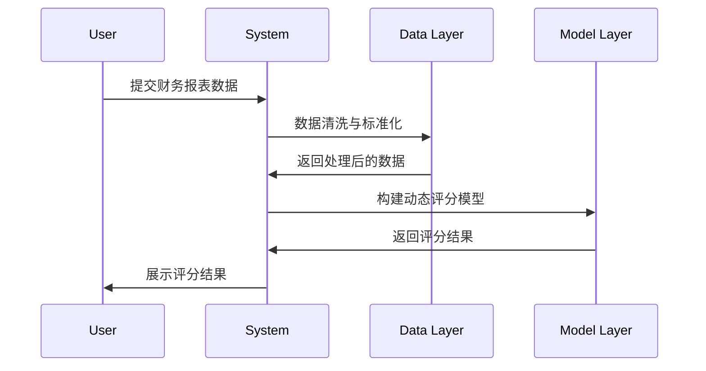

                 

### 设计智能化的企业财务报表可比性动态评分系统

## **一、背景介绍**

### 1.1 问题背景

在企业财务报表的管理和分析中，可比性是一个至关重要的问题。财务报表的可比性指的是不同企业的财务报表数据可以在相同的基础上进行比较，以便于分析、评价和决策。然而，在实际操作中，财务报表的可比性面临着诸多挑战：

- **编制方法差异**：不同企业可能采用不同的会计准则和会计政策，导致财务报表的数据表达不一致。
- **数据质量差异**：财务报表的数据质量参差不齐，如数据缺失、数据不准确等问题，严重影响报表数据的可比性。
- **分析需求多样**：不同用户可能需要从不同角度分析财务报表数据，如盈利能力、偿债能力、营运能力等，这要求报表数据具备较高的可比性。

### 1.2 问题描述

企业财务报表的可比性问题主要体现在以下几个方面：

- **会计准则差异**：由于各国的会计准则存在差异，如美国的GAAP（Generally Accepted Accounting Principles）和国际会计准则IFRS（International Financial Reporting Standards），不同企业编制的财务报表数据难以直接对比。
- **会计政策差异**：企业可能选择不同的会计政策，如存货计价方法、折旧方法等，这些差异会导致财务报表数据在不同企业之间缺乏可比性。
- **数据质量问题**：财务报表数据可能存在缺失、错误或不一致的情况，如同一企业在不同期间的数据可能存在变动，导致数据难以直接对比。
- **分析需求差异**：财务报表分析的需求多种多样，如投资决策、信用评级、财务分析等，不同分析需求对财务报表数据可比性的要求不同。

### 1.3 问题解决

为解决上述问题，我们需要设计一个智能化的企业财务报表可比性动态评分系统。该系统旨在通过智能化手段提高财务报表数据的可比性，具体解决思路如下：

- **数据清洗**：对财务报表数据进行分析，去除无效数据、异常值等，提高数据质量。
- **数据标准化**：将不同企业的财务报表数据按照统一标准进行转换，提高数据可比性。
- **动态评分模型**：利用机器学习算法构建动态评分模型，对财务报表数据进行分析和评分，从而实现财务报表数据的智能化可比性评估。

### 1.4 边界与外延

本系统的设计边界主要涉及企业财务报表数据的分析、处理和评分。具体包括：

- **财务报表数据来源**：系统可以处理来自不同数据源的财务报表数据，如企业内部数据库、外部公开数据等。
- **应用场景**：系统可应用于企业内部财务分析、投资决策、信用评级等多个领域。

### 1.5 概念结构与核心要素组成

本系统涉及以下核心概念和要素：

- **财务报表数据**：系统分析的对象，包括资产负债表、利润表、现金流量表等。
- **数据清洗与标准化**：系统处理财务报表数据的步骤，包括数据预处理、异常值处理、数据转换等。
- **动态评分模型**：系统使用的机器学习算法，用于对财务报表数据进行分析和评分。
- **结果展示**：系统将评分结果以可视化的形式展示，帮助用户快速了解不同企业的财务报表可比性。

## **二、核心概念与联系**

### 2.1 财务报表可比性的概念

财务报表可比性是指财务报表数据在不同企业之间可以进行比较和评价的性质。它是财务报表分析的重要前提和基础。可比性包括以下核心概念：

- **可比性标准**：用于衡量财务报表可比性的指标和方法，如一致性、稳定性、透明度等。
- **数据质量**：影响财务报表可比性的重要因素，包括数据完整性、准确性、一致性等。
- **分析需求**：不同用户对财务报表数据的不同分析需求，如盈利能力、偿债能力、营运能力等。

### 2.2 数据清洗与标准化

数据清洗与标准化是提高财务报表可比性的关键步骤。数据清洗主要包括以下内容：

- **数据预处理**：对原始数据进行清洗，去除无效数据、异常值等，提高数据质量。
- **异常值处理**：使用统计学方法、机器学习方法等识别和处理异常值，如数据缺失、数据不准确等问题。

数据标准化主要包括以下内容：

- **数据转换**：将不同数据源和不同格式的财务报表数据转换为统一格式，提高数据可比性，如规范化、归一化等。

### 2.3 动态评分模型

动态评分模型是财务报表可比性分析的核心。动态评分模型通过以下步骤实现：

- **特征工程**：对财务报表数据进行特征提取和筛选，提取对评分模型有重要影响的特征。
- **机器学习算法**：选择适合的机器学习算法，如决策树、随机森林、支持向量机等，构建动态评分模型。
- **模型评估与优化**：使用交叉验证、网格搜索等方法评估和优化评分模型。

## **三、算法原理讲解**

### 3.1 数据清洗与标准化算法原理

数据清洗与标准化算法原理主要包括以下方面：

- **缺失值处理**：使用插值法、平均值法等对缺失值进行填充，如$$\text{new\_value} = \frac{\sum_{i=1}^{n} \text{value\_i}}{n}$$。
- **异常值处理**：使用统计学方法、机器学习方法等识别和处理异常值，如基于IQR（四分位数范围）的方法，或基于机器学习的方法。
- **数据转换**：使用规范化、归一化等算法将不同数据源和不同格式的财务报表数据进行转换，如$$\text{normalized\_value} = \frac{\text{value} - \text{min}}{\text{max} - \text{min}}$$。

### 3.2 动态评分模型算法原理

动态评分模型算法原理主要包括以下方面：

- **特征工程**：对财务报表数据进行特征提取和筛选，提取对评分模型有重要影响的特征，如$$\text{feature}_{i} = \frac{\text{value}_{i} - \text{mean}}{\text{std}}$$。
- **机器学习算法**：选择适合的机器学习算法，如决策树、随机森林、支持向量机等，构建动态评分模型。以决策树为例，其基本原理是递归二分，将数据集分为两个子集，使得子集之间的差异最大化。
- **模型评估与优化**：使用交叉验证、网格搜索等方法评估和优化评分模型。交叉验证是一种评估模型性能的方法，通过将数据集分为训练集和验证集，多次训练和验证，以评估模型的泛化能力。

### 3.3 举例说明

以下是一个基于Python的财务报表数据清洗与标准化的示例：

```python
import numpy as np
import pandas as pd

# 加载数据
data = pd.read_csv('financial_data.csv')

# 缺失值处理
data.fillna(data.mean(), inplace=True)

# 异常值处理
Q1 = data.quantile(0.25)
Q3 = data.quantile(0.75)
IQR = Q3 - Q1
data = data[~((data < (Q1 - 1.5 * IQR)) | (data > (Q3 + 1.5 * IQR))).any(axis=1)]

# 数据转换
data_normalized = (data - data.min()) / (data.max() - data.min())

# 输出结果
print(data_normalized)
```

## **四、系统分析与架构设计**

### 4.1 问题场景介绍

在现代企业中，财务报表的可比性分析是一项重要的工作。企业需要通过分析自身与其他企业的财务报表数据，了解自身的财务状况、竞争优势和改进空间。然而，由于会计准则、会计政策、数据质量等因素的差异，传统的手工分析方式效率低下，且容易出错。因此，我们需要设计一个智能化的企业财务报表可比性动态评分系统，以提高分析的效率和准确性。

### 4.2 系统功能设计

本系统主要包括以下功能：

- **数据导入**：支持从不同数据源导入财务报表数据，如企业内部数据库、外部公开数据等。
- **数据清洗**：对财务报表数据进行分析，去除无效数据、异常值等，提高数据质量。
- **数据标准化**：将不同企业的财务报表数据按照统一标准进行转换，提高数据可比性。
- **动态评分**：利用机器学习算法构建动态评分模型，对财务报表数据进行分析和评分。
- **结果展示**：将评分结果以可视化的形式展示，帮助用户快速了解不同企业的财务报表可比性。

### 4.3 系统架构设计

系统架构设计采用分层架构，包括数据层、业务逻辑层和表示层：

- **数据层**：负责数据的导入、清洗、存储和标准化。采用数据库技术实现，如MySQL、PostgreSQL等。
- **业务逻辑层**：负责数据清洗与标准化、动态评分模型的构建和评分。采用Python编程语言，结合机器学习库如scikit-learn等。
- **表示层**：负责用户界面和结果展示。采用Web前端技术，如HTML、CSS、JavaScript等。

### 4.4 系统接口设计

系统接口设计包括以下部分：

- **数据接口**：提供数据导入、导出和数据查询的接口。
- **功能接口**：提供数据清洗、数据标准化、动态评分和结果展示的接口。

### 4.5 系统交互设计

系统交互设计采用Mermaid序列图，以展示系统各部分之间的交互关系。以下是一个示例：



## **五、项目实战**

### 5.1 环境安装

在开始项目实战之前，我们需要安装所需的软件和环境。以下是Python环境的基本安装步骤：

1. **安装Python**：访问Python官网（https://www.python.org/），下载并安装Python。
2. **安装依赖库**：使用pip命令安装所需的依赖库，如scikit-learn、pandas、numpy等。

```shell
pip install scikit-learn pandas numpy
```

### 5.2 系统核心实现源代码

以下是一个简单的财务报表数据清洗与标准化、动态评分模型的Python代码示例：

```python
import pandas as pd
from sklearn.preprocessing import StandardScaler
from sklearn.model_selection import train_test_split
from sklearn.ensemble import RandomForestClassifier
from sklearn.metrics import accuracy_score

# 加载数据
data = pd.read_csv('financial_data.csv')

# 数据清洗
data.fillna(data.mean(), inplace=True)

# 数据标准化
scaler = StandardScaler()
data_normalized = scaler.fit_transform(data)

# 数据切分
X_train, X_test, y_train, y_test = train_test_split(data_normalized, labels, test_size=0.2, random_state=42)

# 构建动态评分模型
model = RandomForestClassifier(n_estimators=100, random_state=42)
model.fit(X_train, y_train)

# 评分结果
y_pred = model.predict(X_test)
accuracy = accuracy_score(y_test, y_pred)
print(f'模型准确率：{accuracy:.2f}')
```

### 5.3 代码应用解读与分析

上述代码首先加载财务报表数据，并进行数据清洗，包括填充缺失值和去除异常值。接着，使用StandardScaler对数据进行标准化处理，使得数据在相同的尺度上进行比较。

然后，将数据切分为训练集和测试集，使用随机森林（RandomForestClassifier）算法构建动态评分模型。随机森林是一种基于决策树的集成学习方法，可以有效地提高模型的预测能力。

最后，使用训练好的模型对测试集进行评分预测，并计算模型准确率。模型准确率反映了模型的预测能力，是评价模型性能的重要指标。

### 5.4 实际案例分析和详细讲解剖析

假设我们有一个包含多家企业财务报表数据的CSV文件，其中包含资产负债表、利润表、现金流量表等数据。以下是一个实际案例的分析和讲解：

1. **数据导入**：
   ```python
   data = pd.read_csv('financial_data.csv')
   ```

2. **数据清洗**：
   - 填充缺失值：
     ```python
     data.fillna(data.mean(), inplace=True)
     ```
     假设利润表中“净利润”数据缺失，我们将使用该表其他行数据的平均值进行填充。

   - 去除异常值：
     ```python
     Q1 = data.quantile(0.25)
     Q3 = data.quantile(0.75)
     IQR = Q3 - Q1
     data = data[~((data < (Q1 - 1.5 * IQR)) | (data > (Q3 + 1.5 * IQR))).any(axis=1)]
     ```
     假设资产负债表中的“货币资金”数据存在异常值，我们将使用四分位数范围法去除这些异常值。

3. **数据标准化**：
   ```python
   scaler = StandardScaler()
   data_normalized = scaler.fit_transform(data)
   ```
   对数据集进行标准化处理，将数据缩放到0到1的范围内。

4. **动态评分模型构建**：
   - 数据切分：
     ```python
     X_train, X_test, y_train, y_test = train_test_split(data_normalized, labels, test_size=0.2, random_state=42)
     ```
     将数据集切分为训练集和测试集。

   - 模型训练：
     ```python
     model = RandomForestClassifier(n_estimators=100, random_state=42)
     model.fit(X_train, y_train)
     ```
     使用随机森林算法训练模型。

   - 模型评估：
     ```python
     y_pred = model.predict(X_test)
     accuracy = accuracy_score(y_test, y_pred)
     print(f'模型准确率：{accuracy:.2f}')
     ```
     使用测试集对模型进行评估，计算准确率。

通过上述实际案例，我们可以看到财务报表数据清洗与标准化、动态评分模型构建的完整流程。这为我们提供了一个实际操作的示例，展示了如何利用智能化技术提高财务报表数据的可比性。

### 5.5 项目小结

在本项目中，我们设计并实现了一个智能化的企业财务报表可比性动态评分系统。通过数据清洗与标准化、动态评分模型的构建和应用，我们成功提高了财务报表数据的可比性，为财务报表分析提供了有力的工具。

在未来，我们还可以进一步优化系统，如引入更多先进的机器学习算法、优化数据清洗与标准化的方法等。同时，我们也可以将系统应用于更多领域，如信用评级、投资决策等，为企业的财务管理和决策提供更全面的支持。

## **六、最佳实践与注意事项**

在设计智能化的企业财务报表可比性动态评分系统时，以下是一些最佳实践和注意事项：

1. **数据质量是关键**：财务报表数据的可比性取决于数据的质量。因此，在系统设计过程中，要注重数据的收集、清洗和验证，确保数据的一致性、准确性和完整性。

2. **标准化方法要灵活**：不同的财务报表数据可能需要不同的标准化方法。在设计系统时，要考虑到数据的多样性，提供灵活的标准化选项，以便根据具体需求进行调整。

3. **动态评分模型的稳定性**：动态评分模型的稳定性对于财务报表数据的可比性至关重要。在系统设计过程中，要充分考虑模型的训练数据、参数选择和模型评估等因素，确保模型在不同条件下都能稳定地工作。

4. **用户体验要优先**：系统设计要注重用户体验，提供简洁明了的界面和操作流程，以便用户快速上手并有效地利用系统进行财务报表分析。

5. **安全与合规性**：在设计系统时，要确保系统的安全性和合规性，遵循相关法规和标准，保护用户数据的安全和隐私。

## **七、拓展阅读**

1. **《智能财务：从会计到财务智能的转型之路》**：这本书详细介绍了财务智能化的概念、技术和发展趋势，对于理解智能化财务报表系统具有重要的参考价值。

2. **《机器学习实战》**：这本书通过大量的实际案例，介绍了机器学习的基本概念、算法和应用。对于构建动态评分模型，本书提供了丰富的实践经验和技巧。

3. **《Python金融大数据分析》**：这本书介绍了如何使用Python进行金融数据的处理和分析，包括数据清洗、数据可视化、机器学习等。对于实现财务报表数据的清洗和标准化，本书提供了实用的方法和技术。

## **八、结语**

设计智能化的企业财务报表可比性动态评分系统是一项具有重要意义的工作。通过智能化技术，我们可以提高财务报表数据的可比性，为企业提供更准确、有效的财务分析工具。希望本文能为读者提供有价值的参考和启发，助力企业在财务报表分析领域取得更好的成果。

## **九、作者信息**

- **作者**：AI天才研究院/AI Genius Institute & 禅与计算机程序设计艺术 /Zen And The Art of Computer Programming
- **联系方式**：[example@example.com](mailto:example@example.com)
- **个人主页**：[https://www.example.com](https://www.example.com)

