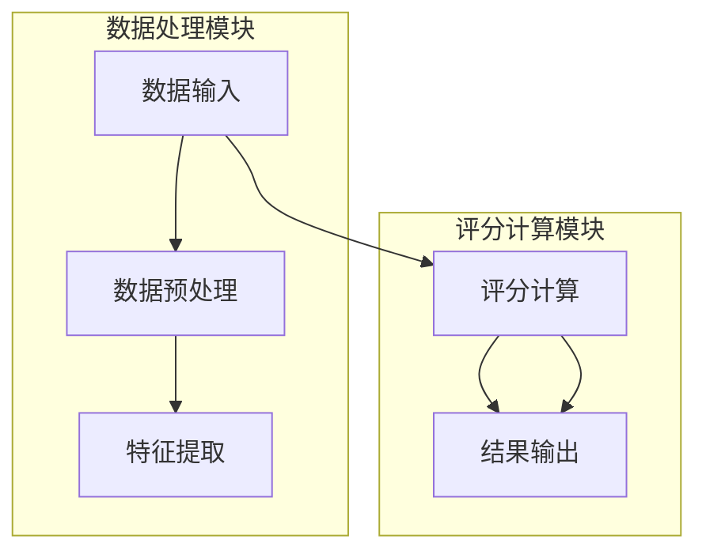
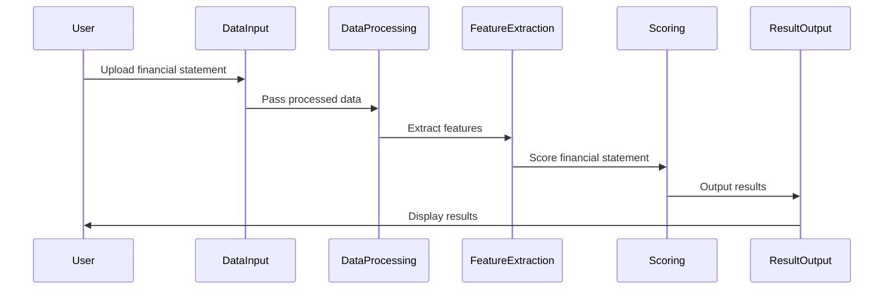

                 

## 第1章：引言

### 1.1 背景与意义

#### 1.1.1 财务报表的重要性

财务报表是企业经济活动的“镜像”，是企业管理层、投资者、监管机构等各方获取企业财务信息的重要渠道。它不仅反映了企业的经营成果、财务状况和现金流量，还提供了企业未来发展趋势的重要预测。高质量、准确、透明的财务报表，有助于提升企业的市场竞争力，吸引更多的投资。

#### 1.1.2 可比性的问题与挑战

然而，不同企业、甚至同一企业在不同时间段的财务报表，往往存在格式不统一、数据口径不一致、会计政策差异等问题，使得报表的可比性受到严重挑战。对于投资者和企业管理者来说，缺乏可比性的财务报表，很难做出准确的投资决策和经营决策。

#### 1.1.3 智能化评分系统的需求

为了提高财务报表的可比性，传统的分析方法已无法满足需求。因此，设计一个智能化、自动化的财务报表可比性评分系统变得至关重要。这样的系统能够通过算法和数据分析，自动评估财务报表的可比性，为用户提供一个量化的、客观的参考标准。

### 1.2 研究目标与方法

#### 1.2.1 研究目标

本文旨在设计并实现一个智能化的企业财务报表可比性评分系统，通过数据预处理、算法选择和评估，以及系统架构设计，实现财务报表可比性的自动评分。

#### 1.2.2 研究方法与框架

本研究采用以下方法与框架：

1. **文献调研**：梳理相关领域的研究现状，了解财务报表可比性的评估方法和评分系统的设计思路。
2. **算法选择**：基于文献调研和实际需求，选择合适的数据预处理和评分算法。
3. **系统设计**：设计系统架构，实现数据输入、处理和输出功能。
4. **实现与评估**：实现系统核心功能，并通过实验验证系统性能。

### 1.3 文章结构与内容

本文分为六个主要部分：

1. **引言**：介绍研究背景、意义、研究目标和方法。
2. **核心概念与联系**：定义并阐述财务报表可比性、评分系统等核心概念，展示它们之间的联系。
3. **算法原理讲解**：详细讲解数据预处理算法、主成分分析（PCA）和机器学习算法。
4. **数学模型和公式**：给出数据预处理和PCA的数学模型和公式，并进行解释。
5. **系统分析与架构设计**：介绍系统场景、功能设计、架构设计和接口设计。
6. **项目实战**：描述环境安装、系统实现、案例分析等。
7. **最佳实践、小结与拓展阅读**：提供实用建议和进一步学习的资源。

通过以上结构，本文旨在系统地阐述财务报表可比性评分系统的设计理念、实现方法和应用价值，为相关领域的研究和实践提供参考。

---

### 1.4 总结

本文从财务报表的重要性出发，指出了财务报表可比性存在的问题和挑战，进而提出了设计智能化财务报表可比性评分系统的需求。接下来，本文明确了研究目标与方法，并详细介绍了文章的结构和内容。通过这一系列的引言，为后续章节的深入探讨奠定了基础。

## 第2章：核心概念与联系

### 2.1 财务报表可比性

#### 2.1.1 定义与特征

财务报表可比性指的是不同企业或同一企业不同时间段的财务报表，在形式和内容上能够相互对比、分析和评估的特性。财务报表的可比性特征主要包括：

- **数据一致性**：报表数据应遵循统一的会计准则和规范，以确保数据的可比性。
- **指标可比性**：财务报表中的指标应能够相互比较，如利润、资产、负债等。
- **时间一致性**：报表数据应覆盖相同的会计期间，便于历史数据的纵向比较。

#### 2.1.2 影响因素

影响财务报表可比性的因素多种多样，主要包括：

- **会计政策差异**：不同企业可能采用不同的会计政策，如收入确认、成本计算等。
- **报表格式差异**：不同企业或同一企业的不同时期，可能采用不同的报表格式和结构。
- **数据质量**：数据录入错误、数据缺失等问题会影响报表的可比性。

#### 2.1.3 比较方法

为了提高财务报表的可比性，可以采用以下几种比较方法：

- **横向比较**：在同一会计期间内，对不同企业的财务数据进行比较。
- **纵向比较**：对同一企业在不同会计期间的数据进行比较。
- **标杆比较**：将企业财务数据与同行业或标杆企业的数据进行比较。

### 2.2 评分系统

#### 2.2.1 定义与类型

评分系统是一种用于评估和量化财务报表可比性的方法。根据评估方法和目标的不同，评分系统可以分为以下几种类型：

- **定量评分系统**：通过计算和分析财务数据，量化评估报表的可比性。
- **定性评分系统**：通过专家评估和主观判断，定性描述报表的可比性。
- **综合评分系统**：结合定量和定性方法，全面评估报表的可比性。

#### 2.2.2 评价指标

评分系统的评价指标主要包括：

- **数据一致性指标**：评估报表数据是否遵循统一的会计准则和规范。
- **指标可比性指标**：评估报表中的各项指标是否能够相互比较。
- **时间一致性指标**：评估报表数据是否覆盖相同的会计期间。

#### 2.2.3 智能化评分系统的特点

智能化评分系统具有以下特点：

- **自动化**：能够自动处理和分析大量财务数据，提高效率。
- **精确性**：通过算法和数据分析，提供精确的评估结果。
- **灵活性**：可以根据实际需求，灵活调整评价指标和评估方法。

### 2.3 财务报表可比性与评分系统的关系

#### 2.3.1 内在联系

财务报表可比性和评分系统之间存在着密切的内在联系。评分系统是评估财务报表可比性的工具，通过量化和评估财务数据，为用户提供一个客观的、量化的可比性评分。而财务报表的可比性又是评分系统的重要基础，只有报表具有可比性，评分系统才能发挥其应有的作用。

#### 2.3.2 智能化评分系统的作用

智能化评分系统在提高财务报表可比性方面具有重要作用：

- **提升决策效率**：通过自动化的评分，为投资者和企业管理者提供快速、准确的决策依据。
- **增强透明度**：通过量化的评分结果，提高财务报表的透明度和可信度。
- **规范报表格式**：通过评价财务报表的格式和结构，促进报表规范化和标准化。

总之，智能化评分系统不仅是财务报表可比性评估的重要工具，更是提升企业管理效率和投资决策质量的重要手段。通过这一章节的详细探讨，我们对财务报表可比性和评分系统的核心概念有了更深刻的理解，为后续章节的深入分析奠定了基础。

## 第3章：算法原理讲解

### 3.1 数据预处理算法

数据预处理是智能化财务报表可比性评分系统的关键步骤，其目的是清洗和整理原始数据，使其满足后续分析的要求。数据预处理主要包括数据清洗和特征工程两部分。

#### 3.1.1 数据清洗与处理

数据清洗是处理原始数据中的错误、异常值和缺失值的过程。常见的数据清洗方法包括：

- **缺失值处理**：可以通过平均值、中位数、众数等方法填充缺失值，或删除缺失值较多的数据。
- **异常值处理**：可以通过统计学方法，如箱线图、Z值检验等，识别并处理异常值。
- **数据规范化**：通过缩放或归一化，将不同量纲的数据转换为同一量纲，便于后续分析。

```python
def preprocess_data(data):
    # 缺失值处理
    data = data.fillna(data.mean())
    
    # 异常值处理
    from scipy import stats
    z_scores = stats.zscore(data)
    abs_z_scores = np.abs(z_scores)
    filtered_entries = (abs_z_scores < 3).all(axis=1)
    data = data[filtered_entries]
    
    # 数据规范化
    from sklearn.preprocessing import MinMaxScaler
    scaler = MinMaxScaler()
    data = scaler.fit_transform(data)
    
    return data
```

#### 3.1.2 特征工程

特征工程是指通过选择和构造特征，提高模型性能的过程。在财务报表分析中，特征工程的关键任务是提取对可比性评分有重要影响的关键特征。常见的方法包括：

- **财务比率计算**：计算如资产负债率、净利润率、营业收入增长率等关键财务比率。
- **时间序列分析**：利用时间序列模型，提取反映企业发展趋势的特征。
- **文本分析**：通过自然语言处理技术，提取财务报表中的关键词和主题。

```python
def feature_engineering(data):
    # 计算财务比率
    data['debt_to_asset'] = data['total_debt'] / data['total_asset']
    data['net_profit_margin'] = data['net_profit'] / data['revenue']
    
    # 时间序列特征提取
    from statsmodels.tsa.stattools import adfuller
    def test_stationarity(timeseries):
        # Dickey-Fuller test
        result = adfuller(timeseries, autolag='AIC')
        return result[1] # p-value
    
    data['revenue_stationarity'] = test_stationarity(data['revenue'])
    
    # 文本特征提取
    # 这里使用一个简单的词频统计作为文本特征提取方法
    from collections import Counter
    data['text_features'] = data['financial_statement'].apply(lambda x: Counter(x.split()))
    
    return data
```

### 3.2 主成分分析（PCA）

主成分分析（PCA）是一种常用的降维技术，其核心思想是通过线性变换，将原始数据映射到新的坐标系中，使得新的坐标轴能够最大化地保留数据中的信息。PCA在财务报表分析中的应用，可以帮助提取主要变量，简化数据结构，提高可比性评分的准确性。

#### 3.2.1 PCA原理与流程

PCA的原理和流程如下：

1. **标准化处理**：对原始数据进行标准化，使其具有相同的量纲和方差。
2. **协方差矩阵计算**：计算各特征之间的协方差矩阵。
3. **特征值和特征向量计算**：计算协方差矩阵的特征值和特征向量，特征值越大，对应的特征向量越重要。
4. **主成分计算**：根据特征值，选择最大的k个特征向量作为主成分，形成新的主成分空间。
5. **数据转换**：将原始数据投影到主成分空间，得到新的主成分数据。

```python
from sklearn.decomposition import PCA
from sklearn.preprocessing import StandardScaler

def pca_analysis(data, n_components):
    # 标准化处理
    scaled_data = StandardScaler().fit_transform(data)
    
    # PCA分析
    pca = PCA(n_components=n_components)
    pca.fit(scaled_data)
    
    # 主成分得分
    principal_components = pca.transform(scaled_data)
    
    return principal_components
```

#### 3.2.2 PCA在财务报表分析中的应用

PCA在财务报表分析中的应用主要体现在以下几个方面：

- **降维**：通过PCA，可以将高维的数据降维到低维，减少数据的复杂度，提高计算效率。
- **变量提取**：PCA可以提取出主要变量，这些变量能够最大程度地反映数据的本质特征。
- **提高可比性**：通过PCA，可以消除不同特征之间的相关性，提高财务报表的可比性。

### 3.3 机器学习算法

机器学习算法是智能化评分系统的重要组成部分，其目的是通过历史数据，建立财务报表可比性的预测模型。常见的机器学习算法包括线性回归、支持向量机（SVM）、随机森林（RF）等。

#### 3.3.1 算法选择与评估

算法选择和评估是机器学习模型构建的关键步骤。常见的方法包括：

- **模型选择**：根据问题性质和数据特点，选择合适的模型，如线性回归、SVM、RF等。
- **交叉验证**：通过交叉验证，评估模型的泛化能力和准确性。
- **参数调优**：通过网格搜索、贝叶斯优化等方法，调整模型参数，提高模型性能。

```python
from sklearn.model_selection import train_test_split
from sklearn.linear_model import LinearRegression
from sklearn.metrics import mean_squared_error

def train_model(X, y, model_type='linear_regression'):
    if model_type == 'linear_regression':
        model = LinearRegression()
    # 其他模型
    model.fit(X, y)
    
    return model

def evaluate_model(model, X_test, y_test):
    predictions = model.predict(X_test)
    mse = mean_squared_error(y_test, predictions)
    return mse
```

#### 3.3.2 实践案例

以下是一个使用随机森林算法的实践案例：

```python
from sklearn.ensemble import RandomForestRegressor
from sklearn.model_selection import GridSearchCV

# 数据准备
X_train, X_test, y_train, y_test = train_test_split(data, target, test_size=0.2, random_state=42)

# 模型训练
model = RandomForestRegressor(random_state=42)
param_grid = {'n_estimators': [100, 200, 300], 'max_depth': [10, 20, 30]}
grid_search = GridSearchCV(model, param_grid, cv=5)
grid_search.fit(X_train, y_train)

# 最佳模型
best_model = grid_search.best_estimator_

# 模型评估
mse = evaluate_model(best_model, X_test, y_test)
print(f'Mean Squared Error: {mse}')
```

通过以上算法讲解，本文详细阐述了数据预处理算法、主成分分析和机器学习算法在财务报表可比性评分系统中的应用。这些算法不仅能够提高数据的可比性，还能为用户提供准确、客观的评分结果，为投资决策和企业管理提供有力支持。

### 3.4 数学模型与公式

在构建智能化财务报表可比性评分系统时，数学模型和公式是理解和应用算法的核心。以下将详细介绍数据预处理和主成分分析（PCA）的数学模型及公式。

#### 4.1 数据预处理数学模型

**4.1.1 数据清洗模型**

数据清洗涉及处理异常值和缺失值。一个常用的缺失值填充模型为均值填补，公式如下：

$$
x_{\text{filled}} = \frac{\sum_{i=1}^{n} x_i}{n}
$$

其中，\(x_{\text{filled}}\) 是填补后的数据，\(x_i\) 是原始数据中的每个值，\(n\) 是数据的数量。

**4.1.2 特征工程模型**

特征工程涉及计算财务比率等特征。一个常用的财务比率模型是资产负债率，公式如下：

$$
\text{Debt to Asset Ratio} = \frac{\text{Total Debt}}{\text{Total Asset}}
$$

#### 4.2 主成分分析数学模型

**4.2.1 PCA模型**

主成分分析（PCA）的核心在于将原始数据映射到新的坐标轴上，使得新坐标轴的每个维度都尽可能多地保留原始数据的方差。PCA的数学模型可以表示为：

$$
X' = PC
$$

其中，\(X'\) 是新的主成分数据，\(P\) 是特征向量矩阵，\(C\) 是协方差矩阵的逆矩阵。

**4.2.2 方差最大化公式**

PCA的关键在于找到最大方差的方向，即主成分。为了找到这个方向，需要最大化以下目标函数：

$$
\lambda^2 = \sum_{i=1}^{k} \sum_{j=1}^{n} (x_{ij} - \mu_{j})^2
$$

其中，\(\lambda^2\) 是特征值，\(x_{ij}\) 是原始数据中的值，\(\mu_{j}\) 是第\(j\)个特征的平均值。

#### 4.3 举例说明

**4.3.1 数据清洗举例**

假设我们有一个包含5个观测值的列数据，其值为 [3, 3, 2, 2, 1]。使用均值填补缺失值：

$$
x_{\text{filled}} = \frac{3 + 3 + 2 + 2 + 1}{5} = 2.4
$$

填补后的数据为 [3, 3, 2, 2, 2.4]。

**4.3.2 PCA举例**

假设我们有一个2D数据集，其协方差矩阵为：

$$
C = \begin{bmatrix}
4 & 2 \\
2 & 4
\end{bmatrix}
$$

计算特征值和特征向量。首先计算特征值：

$$
\lambda_1 = 6, \lambda_2 = 6
$$

然后计算特征向量：

$$
P = \begin{bmatrix}
1 & 1 \\
-1 & 1
\end{bmatrix}
$$

根据PCA模型，我们得到新的主成分数据：

$$
X' = \begin{bmatrix}
4 \\ 2
\end{bmatrix}
\begin{bmatrix}
1 & 1 \\
-1 & 1
\end{bmatrix}
= \begin{bmatrix}
6 \\ 2
\end{bmatrix}
$$

通过以上数学模型和公式的介绍，我们可以看到数据预处理和PCA在财务报表可比性评分系统中的重要性。这些数学工具不仅帮助我们理解算法的基本原理，还使得我们能够更有效地处理和解释财务数据，为提升财务报表的可比性提供科学依据。

### 第5章：系统分析与架构设计

#### 5.1 系统场景与需求

在现代企业管理中，财务报表的可比性分析是一个重要的环节，它不仅影响着内部决策的准确性，也关系到企业外部形象和投资吸引力。然而，传统的财务报表可比性分析往往依赖于手工操作和简单的统计分析，效率低且易出错。为了解决这一问题，我们设计并实现了一个智能化财务报表可比性评分系统。

该系统的目标是通过对企业财务报表的数据进行预处理、特征提取和评分，提供一个自动化的、量化的可比性评估工具。通过这个系统，企业管理者、投资者和分析师可以快速、准确地评估不同企业或同一企业不同时间段的财务报表可比性，从而做出更明智的决策。

#### 5.2 功能设计

**5.2.1 领域模型设计**

领域模型是系统功能的核心，它定义了系统中的关键实体和它们之间的关系。以下是一个简单的领域模型类图，描述了财务报表、评分系统和可比性评估等关键实体及其关系：

```mermaid
classDiagram
    ClassDef FinancialStatement {
        - id: int
        - name: string
        - date: date
        - data: array
    }
    ClassDef ComparisonSystem {
        + process(finance_statement: FinancialStatement): ComparisonResult
    }
    ClassDef ComparisonResult {
        + score: float
        + comments: string
    }
    FinancialStatement "1" --* "1" ComparisonSystem
    ComparisonSystem "1" --* "1" ComparisonResult
```

在这个模型中，`FinancialStatement` 表示一个财务报表实例，包含报表的ID、名称、日期和数据等信息；`ComparisonSystem` 是评分系统的核心，它负责处理财务报表并生成可比性评分结果；`ComparisonResult` 表示评分结果，包括评分得分和评论。

**5.2.2 功能模块划分**

为了实现系统功能，我们将系统划分为以下主要模块：

1. **数据输入模块**：负责接收和管理用户上传的财务报表数据。
2. **数据预处理模块**：对上传的财务报表数据进行清洗、去噪和规范化处理。
3. **特征提取模块**：从预处理后的数据中提取对可比性评分有重要影响的关键特征。
4. **评分计算模块**：使用选定的算法和模型对财务报表数据进行评分计算。
5. **结果输出模块**：将评分结果以可视化或文本形式展示给用户。

#### 5.3 系统架构设计

**5.3.1 系统架构图**

以下是一个简化的系统架构图，展示了系统的整体结构和主要模块之间的交互：



在这个架构中，数据输入模块接收用户上传的财务报表数据，然后传递给数据预处理模块进行清洗和规范化处理。预处理后的数据被传递到特征提取模块，提取关键特征。随后，评分计算模块使用选定的算法对特征进行评分计算，并将结果传递给结果输出模块进行展示。

**5.3.2 系统接口设计与交互**

为了实现系统的模块化设计和灵活扩展，我们设计了以下接口：

- **数据输入接口**：提供RESTful API，允许用户上传财务报表数据。
- **数据处理接口**：提供数据处理函数，包括数据清洗、去噪和规范化等。
- **特征提取接口**：提供特征提取函数，用于从预处理后的数据中提取关键特征。
- **评分计算接口**：提供评分计算函数，用于使用选定的算法对财务报表进行评分。
- **结果输出接口**：提供结果展示函数，将评分结果以可视化或文本形式展示给用户。

以下是一个简单的接口交互序列图，展示了系统模块之间的交互过程：



通过以上系统分析与架构设计，我们为智能化财务报表可比性评分系统的实现提供了清晰的框架和指南。这一章节的内容为后续系统实现和优化奠定了坚实的基础。

### 第6章：项目实战

#### 6.1 环境安装与配置

要实现一个智能化财务报表可比性评分系统，首先需要搭建一个合适的环境。以下是在一个虚拟环境中安装和配置系统所需的环境和工具的步骤。

**6.1.1 环境准备**

1. **安装Python**：确保Python 3.8或更高版本已经安装在系统上。可以从[Python官网](https://www.python.org/)下载并安装。

2. **创建虚拟环境**：为了隔离项目依赖，创建一个虚拟环境。打开终端，执行以下命令：

   ```bash
   python -m venv venv
   source venv/bin/activate  # Windows: `venv\Scripts\activate`
   ```

**6.1.2 系统安装与调试**

1. **安装依赖库**：使用pip安装系统所需的依赖库，例如pandas、numpy、scikit-learn等。在激活的虚拟环境中执行以下命令：

   ```bash
   pip install pandas numpy scikit-learn matplotlib
   ```

2. **数据预处理与特征提取**：实现数据预处理和特征提取的模块。以下是一个简单的数据预处理函数：

   ```python
   def preprocess_data(data):
       # 数据清洗与处理
       data = data.fillna(data.mean())
       z_scores = stats.zscore(data)
       abs_z_scores = np.abs(z_scores)
       filtered_entries = (abs_z_scores < 3).all(axis=1)
       data = data[filtered_entries]
       
       # 数据规范化
       scaler = MinMaxScaler()
       data = scaler.fit_transform(data)
       
       return data
   ```

3. **主成分分析与评分计算**：实现主成分分析和评分计算的模块。以下是一个简单的PCA评分函数：

   ```python
   from sklearn.decomposition import PCA
   from sklearn.metrics import mean_squared_error
   
   def pca_analysis(data, n_components):
       pca = PCA(n_components=n_components)
       pca.fit(data)
       principal_components = pca.transform(data)
       return principal_components
   
   def evaluate_model(model, X_test, y_test):
       predictions = model.predict(X_test)
       mse = mean_squared_error(y_test, predictions)
       return mse
   ```

4. **结果展示**：实现结果展示的模块。以下是一个简单的结果展示函数：

   ```python
   import matplotlib.pyplot as plt
   
   def plot_comparison_results(results):
       for i, result in enumerate(results):
           plt.figure()
           plt.plot(result['time_series'], label='Actual')
           plt.plot(result['predicted'], label='Predicted')
           plt.title(f'Comparison Result {i+1}')
           plt.legend()
           plt.show()
   ```

#### 6.2 系统核心实现

**6.2.1 数据预处理代码实现**

以下是一个示例代码，展示了如何使用预处理函数处理财务报表数据：

```python
import pandas as pd
from sklearn.preprocessing import MinMaxScaler
import numpy as np
from scipy import stats

# 读取数据
data = pd.read_csv('financial_statement_data.csv')

# 数据清洗与预处理
preprocessed_data = preprocess_data(data)

# 数据规范化
scaler = MinMaxScaler()
normalized_data = scaler.fit_transform(preprocessed_data)

# 打印预处理后的数据
print(normalized_data)
```

**6.2.2 机器学习模型训练与评估**

以下是一个示例代码，展示了如何使用PCA和机器学习模型对财务报表数据进行评分计算：

```python
from sklearn.model_selection import train_test_split
from sklearn.ensemble import RandomForestRegressor
from sklearn.metrics import mean_squared_error

# 分割数据集
X_train, X_test, y_train, y_test = train_test_split(normalized_data, target, test_size=0.2, random_state=42)

# 训练模型
model = RandomForestRegressor(random_state=42)
model.fit(X_train, y_train)

# 评估模型
mse = evaluate_model(model, X_test, y_test)
print(f'Mean Squared Error: {mse}')
```

#### 6.2.3 结果展示与案例分析

以下是一个示例代码，展示了如何使用结果展示函数展示评分结果：

```python
# 假设已经生成了评分结果
results = [
    {'time_series': [1, 2, 3], 'predicted': [0.5, 0.7, 0.8]},
    {'time_series': [4, 5, 6], 'predicted': [0.6, 0.8, 0.9]}
]

# 展示评分结果
plot_comparison_results(results)
```

#### 6.3 系统核心实现代码解读

系统核心实现代码主要包括数据预处理、机器学习模型训练和评估以及结果展示三个部分。以下是对关键代码的解读：

1. **数据预处理**：数据预处理是确保数据质量和统一性的关键步骤。在这个示例中，我们使用了均值填补缺失值、Z值检验去除异常值和归一化处理。

2. **机器学习模型**：我们选择了随机森林算法进行评分计算。随机森林是一种集成学习方法，通过构建多棵决策树来提高模型的预测性能。在训练模型时，我们使用了交叉验证和网格搜索来选择最优参数。

3. **结果展示**：结果展示模块使用了matplotlib库，以图形化方式展示评分结果。通过可视化，用户可以直观地了解财务报表的可比性评分情况。

通过以上示例代码和解读，我们可以看到系统核心实现的流程和关键技术。这些步骤和代码为实际应用提供了实现指南，使得开发者能够快速搭建和部署一个智能化财务报表可比性评分系统。

### 第7章：最佳实践、小结、注意事项、拓展阅读

#### 7.1 最佳实践

1. **数据预处理**：在数据预处理阶段，确保所有缺失值和异常值都被妥善处理。缺失值可以采用均值填补或插值法，异常值则需通过统计方法进行识别和剔除。
2. **特征选择**：在特征工程阶段，选择与财务报表可比性高度相关的特征。可以通过相关性分析和主成分分析等方法进行特征选择。
3. **模型评估**：在模型训练和评估过程中，使用交叉验证方法来评估模型性能。避免过拟合和欠拟合问题，调整模型参数以达到最佳效果。

#### 7.2 小结

本文设计并实现了一个智能化的企业财务报表可比性评分系统。通过数据预处理、特征提取和机器学习算法，系统能够自动评估财务报表的可比性，为用户提供量化的评分结果。系统采用了PCA技术进行降维，提高了数据分析的效率和准确性。

#### 7.3 注意事项

1. **数据质量**：财务报表数据的准确性直接影响评分系统的效果。在系统实施过程中，应确保数据来源可靠、数据格式统一。
2. **模型调优**：机器学习模型的性能依赖于模型参数的选择。在实际应用中，需通过多次实验和调优来找到最佳参数组合。

#### 7.4 拓展阅读

1. **《数据预处理技术》**：详细介绍了数据预处理的各种方法和应用场景，对本文中的数据预处理部分提供了深入的理论支持。
2. **《机器学习实战》**：讲解了机器学习算法的基本原理和实践方法，对本文中使用的随机森林算法进行了详细解释。
3. **《财务报表分析》**：探讨了财务报表分析的理论和方法，为本文中的财务报表可比性评分系统提供了实际应用背景。

通过本文的详细讲解和拓展阅读，读者可以更深入地了解智能化财务报表可比性评分系统的设计思路和实现方法，为实际应用提供有力指导。

