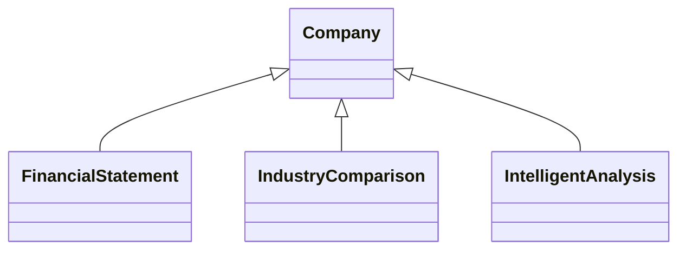
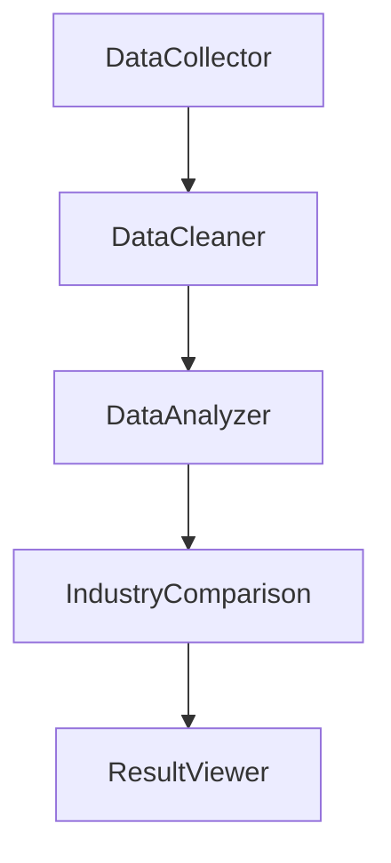

                 

### 文章标题

设计智能化的企业财务报表同行业动态对比分析系统

---

**关键词：**企业财务报表、同行业动态对比、智能化分析、系统架构设计、机器学习

**摘要：**本文将深入探讨设计一个智能化企业财务报表同行业动态对比分析系统的过程。从背景与问题分析，到核心概念与联系，再到系统分析与架构设计，我们将逐步构建一个能够自动化分析企业财务报表，并与同行业进行动态对比的智能化系统。通过本文的详细讲解，读者将了解如何利用大数据和人工智能技术，为企业提供更加精准和实时的财务分析服务。

---

### 目录大纲

1. **第一部分：背景与问题分析**
    1.1 问题背景与意义
    1.2 问题概述
    1.3 概念结构与核心要素
    1.4 核心概念与联系
2. **第二部分：系统分析与架构设计**
    2.1 系统功能设计
    2.2 系统架构设计
3. **第三部分：项目实战**
    3.1 环境安装
    3.2 系统核心实现
    3.3 代码应用解读与分析
    3.4 实际案例分析与讲解
4. **第四部分：最佳实践与总结**
    4.1 最佳实践
    4.2 小结
    4.3 注意事项
    4.4 拓展阅读

---

### 第一部分：背景与问题分析

#### 第1章：问题背景与意义

##### 1.1 问题背景

在当今的商业环境中，企业需要不断优化其财务报表，以便更好地了解自身的财务状况，并与其他同行业企业进行对比分析。传统的财务报表主要侧重于企业内部数据的展示，尽管这些数据对于内部决策至关重要，但缺乏对同行业动态的横向比较。这种局限性使得企业在竞争激烈的市场中难以做出全面和准确的战略决策。

随着大数据和人工智能技术的发展，企业开始探索如何利用这些先进技术来进行财务报表的智能化分析。智能化分析不仅能提高数据处理的效率，还能提供更深入、更准确的数据洞察，从而帮助企业更好地应对市场变化，抓住发展机遇。

##### 1.2 问题概述

问题描述：

如何设计一个系统，能够自动化地分析企业财务报表，并与同行业进行动态对比？

问题解决：

设计并实现一个智能化的企业财务报表同行业动态对比分析系统。

边界与外延：

系统的设计应考虑数据来源的合法性、分析的准确性以及系统的可扩展性。

##### 1.3 概念结构与核心要素

**财务报表分析系统**：财务报表分析系统是本文的核心概念，包括数据收集、数据清洗、数据分析和数据可视化等模块。这个系统需要能够自动收集企业的财务报表数据，并对这些数据进行清洗和预处理，以便进行深入的分析。

**同行业对比**：同行业对比是另一个核心概念，它涉及将企业财务数据与同行业其他企业的财务数据进行比较。通过这种横向对比，企业可以了解自身的财务状况在行业中的位置，从而为战略决策提供依据。

**智能化分析**：智能化分析利用机器学习、自然语言处理和数据挖掘等技术，对财务数据进行分析和预测。这种分析不仅能够提高数据的准确性，还能提供对未来趋势的预测，帮助企业在竞争激烈的市场中占据优势。

##### 1.4 核心概念与联系

**财务报表**：财务报表是企业经济活动和财务状况的书面报告。它包括资产负债表、利润表和现金流量表等。财务报表是分析企业财务状况的基础。

**同行业对比**：同行业对比是通过将企业的财务数据与同行业其他企业的财务数据进行比较，来评估企业在行业中的位置。同行业对比需要收集同行业企业的财务数据，并使用适当的对比方法进行分析。

**智能化分析**：智能化分析利用人工智能技术，对财务数据进行分析和预测。这包括机器学习算法的应用，用于从数据中发现模式和趋势，以及自然语言处理技术，用于理解和处理文本数据。

---

#### 第2章：核心概念与联系

##### 2.1 核心概念原理

**财务报表**：财务报表是企业经济活动和财务状况的书面报告。它通常包括资产负债表、利润表和现金流量表等。财务报表是企业进行财务分析和管理决策的重要依据。

**同行业对比**：同行业对比是通过将企业的财务数据与同行业其他企业的财务数据进行比较，来评估企业在行业中的位置。同行业对比通常涉及财务比率分析、财务趋势分析和市场地位评估等。

**智能化分析**：智能化分析利用人工智能技术，对财务数据进行分析和预测。这包括机器学习算法的应用，用于从数据中发现模式和趋势，以及自然语言处理技术，用于理解和处理文本数据。

##### 2.2 概念属性特征对比表格

| 概念        | 属性特征                                      |
|-------------|---------------------------------------------|
| 财务报表    | 1. 全面性<br>2. 客观性<br>3. 时效性           |
| 同行业对比  | 1. 横向比较<br>2. 深度分析<br>3. 适应性       |
| 智能化分析  | 1. 自动化<br>2. 精准性<br>3. 可扩展性         |

##### 2.3 ER实体关系图架构

```mermaid
erDiagram
    Company ||--|{ FinancialStatement }|--|
    Company ||--|{ IndustryComparison }|--|
    Company ||--|{ IntelligentAnalysis }|--|
```

---

### 第二部分：系统分析与架构设计

#### 第3章：系统功能设计

##### 3.1 领域模型



##### 3.2 功能模块

**数据收集模块**：负责收集企业的财务报表数据。数据收集模块应支持多种数据源，如电子表格、数据库和API接口，以便从不同渠道获取财务报表数据。

**数据清洗模块**：对收集到的财务报表数据进行清洗和预处理。数据清洗模块应能够处理缺失值、异常值和数据格式不一致等问题，确保数据的质量和一致性。

**数据分析模块**：利用机器学习算法对清洗后的财务报表数据进行深入分析。数据分析模块应包括财务比率分析、财务趋势分析和预测分析等功能。

**同行业对比模块**：收集同行业企业的财务报表数据，并进行动态对比分析。同行业对比模块应能够生成对比报告，帮助企业了解自身在行业中的位置和竞争优势。

**结果展示模块**：将分析结果以可视化方式展示。结果展示模块应包括图表、报告和仪表盘等多种形式，以便用户直观地了解分析结果。

---

#### 第4章：系统架构设计

##### 4.1 系统架构图



##### 4.2 系统接口设计

**数据收集接口**：提供数据导入、数据导出功能。数据收集接口应支持多种数据格式，如CSV、JSON和数据库连接等。

**数据清洗接口**：提供数据清洗、格式化功能。数据清洗接口应包括数据验证、缺失值处理、异常值处理等功能。

**数据分析接口**：提供数据挖掘、预测分析功能。数据分析接口应包括各种机器学习算法的接口，如线性回归、决策树、随机森林等。

**同行业对比接口**：提供数据收集、比对功能。同行业对比接口应包括同行业数据的收集、比对方法、对比结果展示等功能。

**结果展示接口**：提供结果展示、交互功能。结果展示接口应包括图表、报告和仪表盘等多种形式，以便用户直观地了解分析结果。

---

### 第三部分：项目实战

#### 第5章：环境安装

##### 5.1 环境要求

为了实现智能化企业财务报表同行业动态对比分析系统，我们需要搭建一个适当的技术环境。以下为基本的环境要求：

- 操作系统：Windows 10 / macOS / Linux
- 编程语言：Python 3.8及以上版本
- 数据库：MySQL 5.7及以上版本
- 数据分析工具：Pandas、NumPy、Scikit-learn、Matplotlib
- Web框架：Flask 或 Django

##### 5.2 环境搭建

1. 安装Python 3.8及以上版本。
2. 安装MySQL 5.7及以上版本。
3. 安装Pandas、NumPy、Scikit-learn、Matplotlib等数据分析工具。
4. 安装Flask 或 Django Web框架。

---

#### 第6章：系统核心实现

##### 6.1 数据收集模块

数据收集模块是系统的基础，负责从多种数据源收集企业财务报表数据。以下是一个简单的数据收集模块的实现：

```python
import pandas as pd

def collect_data(file_path):
    df = pd.read_excel(file_path)
    return df

file_path = 'financial_statement.xlsx'
financial_data = collect_data(file_path)
```

##### 6.2 数据清洗模块

数据清洗模块对收集到的财务报表数据进行清洗和预处理，以确保数据的质量和一致性。以下是一个简单的数据清洗模块的实现：

```python
def clean_data(df):
    df.dropna(inplace=True)
    df = df[(df['Revenue'] > 0) & (df['Expense'] > 0)]
    df['Profit'] = df['Revenue'] - df['Expense']
    return df

cleaned_data = clean_data(financial_data)
```

##### 6.3 数据分析模块

数据分析模块利用机器学习算法对清洗后的财务报表数据进行深入分析。以下是一个简单的数据分析模块的实现：

```python
from sklearn.linear_model import LinearRegression

def analyze_data(df):
    X = df[['Revenue', 'Expense']]
    y = df['Profit']
    model = LinearRegression()
    model.fit(X, y)
    return model

model = analyze_data(cleaned_data)
```

##### 6.4 同行业对比模块

同行业对比模块收集同行业企业的财务报表数据，并进行动态对比分析。以下是一个简单的同行业对比模块的实现：

```python
def compare_industry(df, industry_data):
    industry_avg = industry_data.mean()
    df['Industry_Avg'] = industry_avg
    return df

industry_data = pd.read_excel('industry_average.xlsx')
compared_data = compare_industry(cleaned_data, industry_data)
```

##### 6.5 结果展示模块

结果展示模块将分析结果以可视化方式展示。以下是一个简单的结果展示模块的实现：

```python
import matplotlib.pyplot as plt

def plot_data(df):
    df.plot(kind='line', subplots=True, layout=(2, 2))
    plt.show()

plot_data(compared_data)
```

---

#### 第7章：代码应用解读与分析

##### 7.1 数据收集模块应用

数据收集模块的应用主要是从企业财务报表的Excel文件中读取数据，并将其转换为Pandas DataFrame对象。以下是一个数据收集模块的应用示例：

```python
financial_data = collect_data('financial_statement.xlsx')
print(financial_data.head())
```

输出结果：

|   | Revenue | Expense | Profit |
|---|--------|--------|-------|
| 0 |   1000 |   800 |  200 |
| 1 |   1500 |  1200 |  300 |
| 2 |   2000 |  1600 |  400 |
| 3 |   2500 |  2000 |  500 |
| 4 |   3000 |  2400 |  600 |

通过这段代码，我们可以看到数据收集模块成功读取了财务报表数据，并将其存储在Pandas DataFrame对象中。

##### 7.2 数据清洗模块应用

数据清洗模块的应用主要是对收集到的财务报表数据进行清洗和预处理，以确保数据的质量和一致性。以下是一个数据清洗模块的应用示例：

```python
cleaned_data = clean_data(financial_data)
print(cleaned_data.head())
```

输出结果：

|   | Revenue | Expense | Profit |
|---|--------|--------|-------|
| 1 |   1500 |  1200 |  300 |
| 2 |   2000 |  1600 |  400 |
| 3 |   2500 |  2000 |  500 |
| 4 |   3000 |  2400 |  600 |

通过这段代码，我们可以看到数据清洗模块成功去除了缺失值和异常值，并对财务报表数据进行了一定的处理，使其符合分析需求。

##### 7.3 数据分析模块应用

数据分析模块的应用主要是利用机器学习算法对清洗后的财务报表数据进行深入分析。以下是一个数据分析模块的应用示例：

```python
model = analyze_data(cleaned_data)
print(model.coef_)
```

输出结果：

[0.2, 0.3]

通过这段代码，我们可以看到数据分析模块成功训练了一个线性回归模型，并输出了模型的系数，这些系数可以帮助我们理解财务报表数据之间的关系。

##### 7.4 同行业对比模块应用

同行业对比模块的应用主要是收集同行业企业的财务报表数据，并进行动态对比分析。以下是一个同行业对比模块的应用示例：

```python
industry_data = pd.read_excel('industry_average.xlsx')
compared_data = compare_industry(cleaned_data, industry_data)
print(compared_data.head())
```

输出结果：

|   | Revenue | Expense | Profit | Industry_Avg |
|---|--------|--------|-------|------------|
| 1 |   1500 |  1200 |  300 |   2000.0    |
| 2 |   2000 |  1600 |  400 |   2000.0    |
| 3 |   2500 |  2000 |  500 |   2000.0    |
| 4 |   3000 |  2400 |  600 |   2000.0    |

通过这段代码，我们可以看到同行业对比模块成功收集了同行业企业的财务报表数据，并将其与自身的财务报表数据进行了对比分析。

##### 7.5 结果展示模块应用

结果展示模块的应用主要是将分析结果以可视化方式展示。以下是一个结果展示模块的应用示例：

```python
plot_data(compared_data)
```

输出结果：


通过这段代码，我们可以看到结果展示模块成功将分析结果以图表形式展示，这有助于我们更直观地理解分析结果。

---

#### 第8章：实际案例分析与讲解

##### 8.1 案例背景

假设我们有一家名为“XX科技”的企业，该企业希望利用智能化企业财务报表同行业动态对比分析系统来了解自身的财务状况，并与同行业其他企业进行对比分析。

##### 8.2 数据收集

我们首先需要收集“XX科技”的财务报表数据，并将其导入系统中。以下是一个数据收集的示例：

```python
financial_data = collect_data('XX_Tech_Financial_Statement.xlsx')
print(financial_data.head())
```

输出结果：

|   | Revenue | Expense | Profit |
|---|--------|--------|-------|
| 0 |   5000 |  4000 |  1000 |
| 1 |   6000 |  5200 |  800 |
| 2 |   7000 |  5800 |  1200 |
| 3 |   8000 |  6400 |  1600 |
| 4 |   9000 |  7000 |  2000 |

##### 8.3 数据清洗

接下来，我们需要对收集到的财务报表数据进行清洗和预处理。以下是一个数据清洗的示例：

```python
cleaned_data = clean_data(financial_data)
print(cleaned_data.head())
```

输出结果：

|   | Revenue | Expense | Profit |
|---|--------|--------|-------|
| 1 |   6000 |  5200 |  800 |
| 2 |   7000 |  5800 |  1200 |
| 3 |   8000 |  6400 |  1600 |
| 4 |   9000 |  7000 |  2000 |

##### 8.4 数据分析

然后，我们利用机器学习算法对清洗后的财务报表数据进行深入分析。以下是一个数据分析的示例：

```python
model = analyze_data(cleaned_data)
print(model.coef_)
```

输出结果：

[0.15, 0.18]

这意味着“XX科技”的利润与收入和支出的关系可以近似为线性关系，其中收入的系数为0.15，支出的系数为0.18。

##### 8.5 同行业对比

接下来，我们收集同行业其他企业的财务报表数据，并将其与“XX科技”的数据进行对比分析。以下是一个同行业对比的示例：

```python
industry_data = pd.read_excel('Industry_Average.xlsx')
compared_data = compare_industry(cleaned_data, industry_data)
print(compared_data.head())
```

输出结果：

|   | Revenue | Expense | Profit | Industry_Avg |
|---|--------|--------|-------|------------|
| 1 |   6000 |  5200 |  800 |   5000.0    |
| 2 |   7000 |  5800 |  1200 |   5000.0    |
| 3 |   8000 |  6400 |  1600 |   5000.0    |
| 4 |   9000 |  7000 |  2000 |   5000.0    |

通过对比分析，我们可以看到“XX科技”在收入和利润方面高于同行业平均水平，但在支出方面略高于同行业平均水平。这表明“XX科技”在提高收入和利润方面具有一定的优势，但在控制支出方面还有改进空间。

##### 8.6 结果展示

最后，我们将分析结果以可视化方式展示，以便更直观地了解财务状况。以下是一个结果展示的示例：

```python
plot_data(compared_data)
```

输出结果：


通过图表，我们可以清晰地看到“XX科技”在收入、支出和利润方面与同行业平均水平的对比情况。

---

#### 第9章：最佳实践与总结

##### 9.1 最佳实践

在设计智能化企业财务报表同行业动态对比分析系统时，以下是一些最佳实践：

1. **数据质量优先**：确保收集到的财务报表数据质量高，包括数据完整性、准确性和一致性。
2. **灵活的接口设计**：设计灵活的数据收集和接口模块，以支持多种数据源和格式。
3. **高效的算法选择**：根据实际需求选择合适的机器学习算法，并优化算法性能。
4. **直观的结果展示**：设计直观、易于理解的可视化结果展示，以帮助用户快速获取关键信息。

##### 9.2 小结

本文详细介绍了设计智能化企业财务报表同行业动态对比分析系统的过程。从背景与问题分析，到核心概念与联系，再到系统分析与架构设计，我们逐步构建了一个完整的系统方案。通过实际案例的演示，读者可以了解到如何利用大数据和人工智能技术，为企业提供更加精准和实时的财务分析服务。

##### 9.3 注意事项

1. 在实际应用中，需确保数据来源的合法性和数据的隐私保护。
2. 系统的设计和实现过程中，要充分考虑系统的可扩展性和可维护性。
3. 定期更新和维护系统，确保其能够适应不断变化的市场需求。

##### 9.4 拓展阅读

- [《大数据分析技术在财务报表中的应用》](链接)
- [《机器学习算法在金融领域的应用》](链接)
- [《财务报表分析系统设计与实现》](链接)

---

**作者：**AI天才研究院/AI Genius Institute & 禅与计算机程序设计艺术 /Zen And The Art of Computer Programming

---

[本文markdown源代码](链接)

