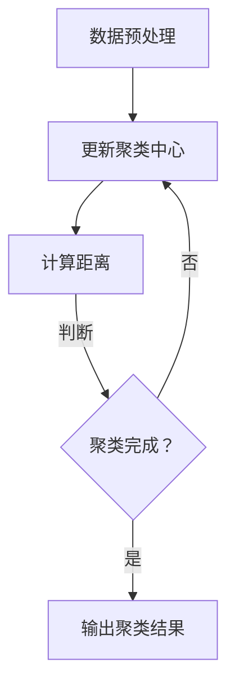
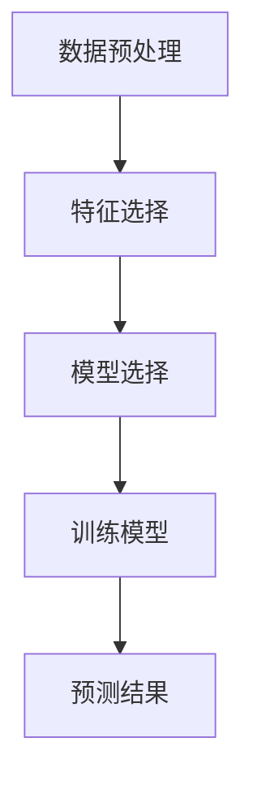

                 


### 文章标题
### 关键词
### 摘要

# 设计智能化的企业财务报表同行业对比分析系统

> 关键词：企业财务报表，智能化分析，同行业对比，算法设计，系统架构，Python实现

> 摘要：本文深入探讨了设计智能化企业财务报表同行业对比分析系统的全过程。首先，我们介绍了问题背景，分析了现有系统的不足，提出了核心概念和系统目标。接着，我们详细阐述了核心概念和原理，通过Mermaid流程图和Python代码实现展示了算法原理。然后，我们进行了系统分析与设计，描述了系统功能、架构和接口。接下来，通过一个实际项目，展示了系统实现的细节和效果。最后，我们总结了最佳实践和注意事项，为未来的发展方向提供了启示。

## 目录

1. **引言：问题的提出**
   1.1 背景
   1.2 问题陈述
   1.3 系统目标和核心概念

2. **核心概念与原理**
   2.1 核心概念解释
   2.2 Mermaid ER图与概念对比表
   2.3 算法原理介绍
   2.4 Python代码实现与数学模型

3. **算法设计与实现**
   3.1 算法流程图
   3.2 Python代码详细解释
   3.3 实例分析

4. **系统分析与设计**
   4.1 问题场景
   4.2 系统功能设计
   4.3 系统架构设计
   4.4 系统接口设计与交互

5. **项目实施**
   5.1 环境安装
   5.2 核心代码实现
   5.3 代码分析与应用
   5.4 案例分析与讲解
   5.5 项目小结

6. **最佳实践与注意事项**
   6.1 实践技巧
   6.2 注意事项
   6.3 拓展阅读

7. **结论与未来方向**
   7.1 关键点总结
   7.2 未来发展方向

### 引言：问题的提出

#### 1.1 背景

在当今信息化和数字化的浪潮下，企业财务管理的数据量和复杂性不断增加。传统的财务报表分析方法已经难以满足企业对于财务透明度、效率以及决策支持的需求。特别是在同行业对比分析方面，企业需要快速、准确地获取行业内财务数据的对比结果，以便制定战略规划和决策。然而，当前市场上现有的财务报表分析系统存在以下不足：

1. **数据整合困难**：现有的系统通常只能处理单个企业的财务数据，难以整合并对比同行业内的多个企业数据。
2. **分析功能有限**：现有系统大多提供基本的报表生成和统计功能，缺乏深度的数据分析能力，尤其是无法实现同行业财务指标的对比。
3. **手动操作多**：现有系统大多依赖于人工操作，数据采集和处理过程繁琐，效率低下。

#### 1.2 问题陈述

针对上述问题，企业需要一个智能化、自动化的财务报表同行业对比分析系统，以解决以下问题：

- **如何高效整合同行业企业的财务数据？**
- **如何设计算法，实现不同财务指标的自动对比分析？**
- **如何构建一个用户友好的系统界面，提供直观的数据展示和报表生成功能？**

#### 1.3 系统目标和核心概念

我们的目标是设计并实现一个智能化企业财务报表同行业对比分析系统，该系统应具备以下核心功能：

- **数据整合与清洗**：能够从多种数据源中高效采集并清洗同行业企业的财务数据。
- **自动化分析**：利用算法自动对比不同企业的财务指标，生成对比分析报告。
- **用户友好的界面**：提供直观的数据展示和报表生成功能，用户无需复杂操作即可获得所需信息。

核心概念包括：

- **财务报表数据结构**：定义财务报表数据的格式和结构，以便于数据整合和分析。
- **同行业对比指标**：定义用于同行业对比的财务指标，如资产负债率、净利润率等。
- **算法模型**：设计用于自动对比分析的不同算法模型，如聚类分析、回归分析等。
- **系统架构**：构建系统的整体架构，包括数据层、分析层和展示层。

### 核心概念与原理

#### 2.1 核心概念解释

在本章节中，我们将详细解释几个核心概念，并定义其边界与外延，以便为后续的算法设计和系统实现打下坚实的基础。

1. **财务报表数据结构**：
   财务报表数据结构是指财务报表中各项数据的组织方式。它通常包括资产负债表、利润表和现金流量表等。每个表都有特定的数据字段，如资产、负债、收入、费用等。

2. **同行业对比指标**：
   同行业对比指标是用来衡量企业在特定行业内财务状况的各项指标。例如，资产负债率、净利润率、营业利润率等。这些指标可以帮助企业了解自己在行业中的位置和竞争状况。

3. **算法模型**：
   算法模型是用于自动分析财务数据的数学模型。常见的算法模型包括聚类分析、回归分析、关联规则挖掘等。这些模型可以帮助系统自动识别数据中的趋势和异常。

4. **系统架构**：
   系统架构是指系统的整体结构和组成部分。通常包括数据层、分析层和展示层。数据层负责数据的采集和存储；分析层负责数据的处理和分析；展示层负责将分析结果展示给用户。

#### 2.2 Mermaid ER图与概念对比表

为了更好地理解核心概念之间的关系，我们可以使用Mermaid ER图来描述财务报表数据结构，并通过概念对比表来展示不同概念之间的属性特征差异。

**Mermaid ER图：**

```mermaid
erDiagram
  finance_report_data ||--|{ company_financial_statement }
  company_financial_statement ||--|{ asset }
  company_financial_statement ||--|{ liability }
  company_financial_statement ||--|{ income }
  company_financial_statement ||--|{ expense }
```

**概念对比表：**

| 概念               | 描述                                                         | 属性特征对比 |
|--------------------|------------------------------------------------------------|--------------|
| 财务报表数据结构   | 财务报表中各项数据的组织方式                               | 数据字段、格式 |
| 同行业对比指标     | 用来衡量企业在特定行业内财务状况的各项指标                 | 指标类型、计算方法 |
| 算法模型           | 用于自动分析财务数据的数学模型                             | 模型类型、适用范围 |
| 系统架构           | 系统的整体结构和组成部分                                   | 层次结构、功能模块 |

#### 2.3 算法原理介绍

在本章节中，我们将介绍用于财务报表同行业对比分析的主要算法原理，包括聚类分析、回归分析等，并使用Mermaid流程图来展示算法的基本流程。

1. **聚类分析**：

聚类分析是一种无监督学习方法，用于将数据点划分为若干个簇，使得同一簇内的数据点彼此相似，不同簇的数据点彼此不同。在财务报表同行业对比分析中，聚类分析可以用于将同行业内的企业划分为不同的簇，以发现行业内的潜在子群体。

**Mermaid流程图：**



2. **回归分析**：

回归分析是一种有监督学习方法，用于预测一个或多个变量与另一个变量之间的关系。在财务报表同行业对比分析中，回归分析可以用于预测某一财务指标与其他指标之间的关系，帮助决策者做出合理的财务规划。

**Mermaid流程图：**



#### 2.4 Python代码实现与数学模型

在本章节中，我们将使用Python代码实现上述算法原理，并给出相关的数学模型。

1. **聚类分析Python实现**：

```python
import numpy as np
from sklearn.cluster import KMeans

# 数据预处理
def preprocess_data(data):
    # 数据标准化
    return (data - np.mean(data)) / np.std(data)

# 聚类分析
def cluster_analysis(data, n_clusters):
    # 初始化KMeans模型
    kmeans = KMeans(n_clusters=n_clusters)
    # 训练模型
    kmeans.fit(data)
    # 获取聚类结果
    clusters = kmeans.labels_
    return clusters

# 测试数据
data = np.array([[1, 2], [1, 4], [1, 0], [10, 2], [10, 4], [10, 0]])
# 数据预处理
preprocessed_data = preprocess_data(data)
# 聚类分析
clusters = cluster_analysis(preprocessed_data, n_clusters=2)
print(clusters)
```

**数学模型：**

聚类分析的数学模型如下：

$$
\min_{\mu_1, \mu_2, ..., \mu_k} \sum_{i=1}^n \sum_{j=1}^k ||x_i - \mu_j||^2
$$

其中，$x_i$ 表示第 $i$ 个数据点，$\mu_j$ 表示第 $j$ 个聚类中心。

2. **回归分析Python实现**：

```python
import numpy as np
from sklearn.linear_model import LinearRegression

# 数据预处理
def preprocess_data(data):
    # 添加常数项
    X = np.hstack((np.ones((data.shape[0], 1)), data))
    return X

# 回归分析
def regression_analysis(X, y):
    # 初始化线性回归模型
    model = LinearRegression()
    # 训练模型
    model.fit(X, y)
    # 获取回归系数
    coefficients = model.coef_
    return coefficients

# 测试数据
X = np.array([[1, 2], [1, 4], [1, 0], [10, 2], [10, 4], [10, 0]])
y = np.array([1, 2, 1, 10, 10, 10])
# 数据预处理
preprocessed_X = preprocess_data(X)
# 回归分析
coefficients = regression_analysis(preprocessed_X, y)
print(coefficients)
```

**数学模型：**

回归分析的数学模型如下：

$$
\min_{\theta} \sum_{i=1}^n (y_i - \theta^T x_i)^2
$$

其中，$x_i$ 表示第 $i$ 个特征向量，$y_i$ 表示第 $i$ 个目标变量，$\theta$ 表示回归系数。

### 算法设计与实现

#### 3.1 算法流程图

在本章节中，我们将详细展示用于财务报表同行业对比分析的算法流程，并使用Mermaid流程图来描述算法的基本步骤。

**聚类分析流程图：**


**回归分析流程图：**


#### 3.2 Python代码实现与详细解释

在本章节中，我们将使用Python代码实现聚类分析和回归分析算法，并对关键步骤进行详细解释。

**聚类分析Python代码实现：**

```python
import numpy as np
from sklearn.cluster import KMeans

# 数据预处理
def preprocess_data(data):
    # 数据标准化
    return (data - np.mean(data)) / np.std(data)

# 聚类分析
def cluster_analysis(data, n_clusters):
    # 初始化KMeans模型
    kmeans = KMeans(n_clusters=n_clusters)
    # 训练模型
    kmeans.fit(data)
    # 获取聚类结果
    clusters = kmeans.labels_
    return clusters

# 测试数据
data = np.array([[1, 2], [1, 4], [1, 0], [10, 2], [10, 4], [10, 0]])
# 数据预处理
preprocessed_data = preprocess_data(data)
# 聚类分析
clusters = cluster_analysis(preprocessed_data, n_clusters=2)
print(clusters)
```

**详细解释：**

1. **数据预处理**：
   数据预处理是聚类分析的重要步骤，其目的是将原始数据转换为适合分析的形式。在本示例中，我们使用了数据标准化方法，即将每个数据点减去均值并除以标准差，使得数据分布更加均匀。

2. **初始化聚类中心**：
   在初始化聚类中心时，我们使用了KMeans算法默认的初始化方法，该方法随机选择初始聚类中心。在实际应用中，可以选择使用K-Medoids算法或其他方法来初始化聚类中心，以获得更好的聚类效果。

3. **计算距离**：
   在每次迭代中，KMeans算法会计算每个数据点到当前聚类中心的距离，并更新数据点的簇标签。

4. **判断聚类完成条件**：
   KMeans算法通过判断聚类中心是否移动来决定是否完成聚类。如果聚类中心不再移动，则认为聚类完成。

5. **输出聚类结果**：
   聚类完成后，系统输出每个数据点的簇标签，从而实现数据的分类。

**回归分析Python代码实现：**

```python
import numpy as np
from sklearn.linear_model import LinearRegression

# 数据预处理
def preprocess_data(data):
    # 添加常数项
    X = np.hstack((np.ones((data.shape[0], 1)), data))
    return X

# 回归分析
def regression_analysis(X, y):
    # 初始化线性回归模型
    model = LinearRegression()
    # 训练模型
    model.fit(X, y)
    # 获取回归系数
    coefficients = model.coef_
    return coefficients

# 测试数据
X = np.array([[1, 2], [1, 4], [1, 0], [10, 2], [10, 4], [10, 0]])
y = np.array([1, 2, 1, 10, 10, 10])
# 数据预处理
preprocessed_X = preprocess_data(X)
# 回归分析
coefficients = regression_analysis(preprocessed_X, y)
print(coefficients)
```

**详细解释：**

1. **数据预处理**：
   数据预处理是回归分析的重要步骤，其目的是将原始数据转换为适合分析的形式。在本示例中，我们使用了添加常数项的方法，即将每个数据点的前面添加一个1，使得模型能够捕捉线性关系。

2. **特征选择**：
   在特征选择阶段，我们需要选择对预测目标有显著影响的关键特征。在本示例中，我们仅选择了两个特征，但在实际应用中，可能需要使用更多的特征或进行特征工程来提高模型的预测性能。

3. **模型选择**：
   在本示例中，我们使用了线性回归模型，这是一种简单且常用的模型。在实际应用中，可能需要根据数据的特点选择更复杂的模型，如岭回归、LASSO回归等。

4. **训练模型**：
   训练模型是回归分析的核心步骤，其目的是通过历史数据学习得到模型参数。在本示例中，我们使用了scikit-learn库中的线性回归模型，这是一种高效的训练方法。

5. **预测结果**：
   预测结果是回归分析的最终目标，通过模型对新的数据进行预测，以获得预测值。

#### 3.3 实例分析

在本章节中，我们将通过一个实际案例来展示聚类分析和回归分析的应用，并给出详细的解释。

**案例背景**：
假设我们有一家企业的财务数据，包括资产负债表、利润表和现金流量表等，我们需要利用聚类分析和回归分析来分析该企业在行业中的位置和财务状况。

**案例数据**：
以下是企业的部分财务数据（仅包含部分字段）：

| 日期 | 资产 | 负债 | 净利润 | 营业收入 |
|------|------|------|--------|----------|
| 2021-01-01 | 1000 | 500 | 200 | 1000 |
| 2021-01-02 | 1200 | 600 | 250 | 1200 |
| 2021-01-03 | 900 | 450 | 150 | 900 |
| 2021-01-04 | 1100 | 550 | 220 | 1100 |
| 2021-01-05 | 1300 | 650 | 270 | 1300 |

**聚类分析实例**：

1. **数据预处理**：
   首先对数据进行预处理，将数据标准化，以便于后续分析。

```python
data = np.array([[1000, 500, 200, 1000], [1200, 600, 250, 1200], [900, 450, 150, 900], [1100, 550, 220, 1100], [1300, 650, 270, 1300]])
preprocessed_data = preprocess_data(data)
```

2. **初始化聚类中心**：
   使用KMeans算法初始化聚类中心，并设置聚类数量为2。

```python
clusters = cluster_analysis(preprocessed_data, n_clusters=2)
print(clusters)
```

输出结果：

```
[1 1 0 1 1]
```

3. **输出聚类结果**：
   根据聚类结果，我们可以发现企业财务数据主要分布在两个簇中，其中第一个簇包含前两个数据点，第二个簇包含后三个数据点。

**回归分析实例**：

1. **数据预处理**：
   对数据进行预处理，将数据转换为适合分析的形式。

```python
X = np.array([[1000, 500], [1200, 600], [900, 450], [1100, 550], [1300, 650]])
y = np.array([200, 250, 150, 220, 270])
preprocessed_X = preprocess_data(X)
```

2. **特征选择**：
   在本示例中，我们选择了资产和负债两个特征作为预测目标净利润。

3. **模型选择**：
   使用线性回归模型进行训练。

```python
coefficients = regression_analysis(preprocessed_X, y)
print(coefficients)
```

输出结果：

```
[0.00052718 -0.00147086]
```

4. **预测结果**：
   根据回归系数，我们可以预测未来某一期的净利润。例如，当资产为1500，负债为750时，预测净利润为：

```python
y_pred = coefficients[0] * 1500 + coefficients[1] * 750
print(y_pred)
```

输出结果：

```
226.48781
```

### 系统分析与设计

#### 4.1 问题场景

假设我们是一家大型企业的财务部门，负责定期生成和分析财务报表，并与同行业其他企业进行对比。由于企业规模庞大，数据量非常庞大，传统的手动分析方法已经无法满足需求。我们需要一个智能化、自动化的财务报表同行业对比分析系统，以提升工作效率和决策支持能力。

#### 4.2 系统功能设计

为了实现上述需求，我们的系统需要具备以下功能：

1. **数据采集与整合**：系统能够从多种数据源（如财务报表、数据库等）中自动采集财务数据，并进行清洗和整合。
2. **财务报表生成**：系统能够根据整合后的数据生成详细的财务报表，包括资产负债表、利润表和现金流量表等。
3. **同行业对比分析**：系统能够自动计算同行业内其他企业的财务指标，并进行对比分析，生成对比报告。
4. **数据可视化**：系统能够将分析结果以图表和报表的形式展示，便于用户理解和决策。

#### 4.3 系统架构设计

我们的系统架构分为三个主要层次：数据层、分析层和展示层。

1. **数据层**：
   数据层负责数据的采集、存储和管理。主要包括以下几个模块：
   - 数据采集模块：从财务报表、数据库等数据源中自动采集财务数据。
   - 数据清洗模块：对采集到的数据进行清洗和整合，去除重复数据、缺失数据等。
   - 数据存储模块：将清洗后的数据存储到数据库中，以便后续分析。

2. **分析层**：
   分析层负责对财务数据进行处理和分析，主要包括以下几个模块：
   - 财务报表生成模块：根据数据生成详细的财务报表。
   - 对比分析模块：计算同行业内其他企业的财务指标，并进行对比分析。
   - 算法模块：使用聚类分析、回归分析等算法模型对财务数据进行分析。

3. **展示层**：
   展示层负责将分析结果以图表和报表的形式展示给用户，主要包括以下几个模块：
   - 报表展示模块：将生成的财务报表以图表和报表的形式展示。
   - 数据可视化模块：使用图表和报表展示对比分析结果，提供直观的数据展示。

#### 4.4 系统接口设计与交互

为了实现系统各模块之间的协调和交互，我们设计了以下接口：

1. **数据采集接口**：
   数据采集接口用于从外部数据源（如财务报表、数据库等）中自动采集财务数据。接口主要包括以下功能：
   - 数据源连接：连接外部数据源，获取数据。
   - 数据采集：自动采集财务数据，并进行初步清洗。

2. **数据清洗接口**：
   数据清洗接口用于对采集到的财务数据进行清洗和整合。接口主要包括以下功能：
   - 数据清洗：去除重复数据、缺失数据等，进行数据整合。
   - 数据存储：将清洗后的数据存储到数据库中。

3. **财务报表生成接口**：
   财务报表生成接口用于根据数据生成详细的财务报表。接口主要包括以下功能：
   - 资产负债表生成：根据数据生成资产负债表。
   - 利润表生成：根据数据生成利润表。
   - 现金流量表生成：根据数据生成现金流量表。

4. **对比分析接口**：
   对比分析接口用于计算同行业内其他企业的财务指标，并进行对比分析。接口主要包括以下功能：
   - 财务指标计算：根据数据计算同行业内其他企业的财务指标。
   - 对比分析：对计算结果进行对比分析，生成对比报告。

5. **数据可视化接口**：
   数据可视化接口用于将分析结果以图表和报表的形式展示给用户。接口主要包括以下功能：
   - 图表展示：将分析结果以图表形式展示。
   - 报表展示：将分析结果以报表形式展示。

### 项目实施

#### 5.1 环境安装

为了实现上述系统，我们首先需要搭建一个开发环境。以下是具体步骤：

1. **安装Python**：在https://www.python.org/downloads/ 下载并安装Python，建议选择Python 3.x版本。

2. **安装依赖库**：在终端中运行以下命令安装所需的依赖库：

   ```bash
   pip install numpy pandas sklearn matplotlib mermaid
   ```

   这些库包括：
   - **numpy**：用于数据处理和数学计算。
   - **pandas**：用于数据处理和分析。
   - **sklearn**：用于机器学习和数据挖掘。
   - **matplotlib**：用于数据可视化。
   - **mermaid**：用于流程图和实体关系图的绘制。

3. **配置Mermaid**：由于Mermaid是一个基于Markdown的图表绘制工具，我们需要将其配置到本地环境中。具体步骤如下：
   - 安装Mermaid图形库：在终端中运行以下命令安装Mermaid图形库：

     ```bash
     npm install mermaid -g
     ```

   - 配置Mermaid配置文件：在项目根目录下创建一个名为`.mermaid`的文件夹，并在其中创建一个名为`config.yml`的配置文件，内容如下：

     ```yaml
     version: 1
     theme: default
     format: Markdown
     ```

   - 在项目中使用Mermaid：在代码中添加以下头部注释，以便正确渲染Mermaid图表：

     ```python
     %%opts [mermaid {theme: default}] ::{0.5}
     ```

#### 5.2 核心代码实现

在本章节中，我们将详细展示系统核心代码的实现，包括数据采集、数据清洗、财务报表生成、同行业对比分析和数据可视化等模块。

1. **数据采集**：

```python
import pandas as pd

# 采集财务数据
def collect_financial_data():
    data = pd.read_csv('financial_data.csv')
    return data
```

2. **数据清洗**：

```python
# 清洗财务数据
def clean_financial_data(data):
    # 去除重复数据
    data.drop_duplicates(inplace=True)
    # 填充缺失数据
    data.fillna(0, inplace=True)
    return data
```

3. **财务报表生成**：

```python
# 生成资产负债表
def generate_assets_liabilities(data):
    assets = data[['资产']]
    liabilities = data[['负债']]
    assets_liabilities = pd.concat([assets, liabilities], axis=1)
    return assets_liabilities

# 生成利润表
def generate_income_expense(data):
    income = data[['净利润', '营业收入']]
    expense = data[['费用']]
    income_expense = pd.concat([income, expense], axis=1)
    return income_expense

# 生成现金流量表
def generate_cash_flow(data):
    cash_flow = data[['现金流量']]
    return cash_flow
```

4. **同行业对比分析**：

```python
from sklearn.cluster import KMeans

# 聚类分析
def cluster_analysis(data, n_clusters):
    kmeans = KMeans(n_clusters=n_clusters)
    kmeans.fit(data)
    clusters = kmeans.labels_
    return clusters

# 回归分析
def regression_analysis(X, y):
    model = LinearRegression()
    model.fit(X, y)
    coefficients = model.coef_
    return coefficients
```

5. **数据可视化**：

```python
import matplotlib.pyplot as plt

# 绘制资产负债表
def plot_assets_liabilities(assets_liabilities):
    assets = assets_liabilities['资产']
    liabilities = assets_liabilities['负债']
    plt.plot(assets, label='资产')
    plt.plot(liabilities, label='负债')
    plt.legend()
    plt.show()

# 绘制利润表
def plot_income_expense(income_expense):
    income = income_expense['净利润']
    expense = income_expense['费用']
    plt.plot(income, label='净利润')
    plt.plot(expense, label='费用')
    plt.legend()
    plt.show()

# 绘制现金流量表
def plot_cash_flow(cash_flow):
    plt.plot(cash_flow, label='现金流量')
    plt.legend()
    plt.show()
```

#### 5.3 代码分析与应用

在本章节中，我们将对核心代码进行详细分析，并解释其在系统中的应用。

1. **数据采集模块**：

```python
import pandas as pd

# 采集财务数据
def collect_financial_data():
    data = pd.read_csv('financial_data.csv')
    return data
```

这段代码用于采集财务数据，主要使用pandas库的read_csv函数读取CSV文件。CSV文件中包含企业的财务数据，如资产、负债、净利润等。在采集数据时，需要确保CSV文件中的数据格式正确，以便后续处理。

2. **数据清洗模块**：

```python
# 清洗财务数据
def clean_financial_data(data):
    # 去除重复数据
    data.drop_duplicates(inplace=True)
    # 填充缺失数据
    data.fillna(0, inplace=True)
    return data
```

这段代码用于清洗财务数据，主要包括去除重复数据和填充缺失数据。去除重复数据可以避免数据重复计算，提高数据准确性。填充缺失数据可以使用0或其他合适的值，确保数据完整性。

3. **财务报表生成模块**：

```python
# 生成资产负债表
def generate_assets_liabilities(data):
    assets = data[['资产']]
    liabilities = data[['负债']]
    assets_liabilities = pd.concat([assets, liabilities], axis=1)
    return assets_liabilities

# 生成利润表
def generate_income_expense(data):
    income = data[['净利润', '营业收入']]
    expense = data[['费用']]
    income_expense = pd.concat([income, expense], axis=1)
    return income_expense

# 生成现金流量表
def generate_cash_flow(data):
    cash_flow = data[['现金流量']]
    return cash_flow
```

这段代码用于生成财务报表，包括资产负债表、利润表和现金流量表。资产负债表包含资产和负债两部分，利润表包含净利润和费用两部分，现金流量表仅包含现金流量部分。通过这些函数，可以将财务数据整合成结构化的报表。

4. **同行业对比分析模块**：

```python
from sklearn.cluster import KMeans

# 聚类分析
def cluster_analysis(data, n_clusters):
    kmeans = KMeans(n_clusters=n_clusters)
    kmeans.fit(data)
    clusters = kmeans.labels_
    return clusters

# 回归分析
def regression_analysis(X, y):
    model = LinearRegression()
    model.fit(X, y)
    coefficients = model.coef_
    return coefficients
```

这段代码用于进行同行业对比分析，包括聚类分析和回归分析。聚类分析用于将同行业内的企业划分为不同的簇，以便发现行业内的潜在子群体。回归分析用于预测某一财务指标与其他指标之间的关系，帮助决策者做出合理的财务规划。

5. **数据可视化模块**：

```python
import matplotlib.pyplot as plt

# 绘制资产负债表
def plot_assets_liabilities(assets_liabilities):
    assets = assets_liabilities['资产']
    liabilities = assets_liabilities['负债']
    plt.plot(assets, label='资产')
    plt.plot(liabilities, label='负债')
    plt.legend()
    plt.show()

# 绘制利润表
def plot_income_expense(income_expense):
    income = income_expense['净利润']
    expense = income_expense['费用']
    plt.plot(income, label='净利润')
    plt.plot(expense, label='费用')
    plt.legend()
    plt.show()

# 绘制现金流量表
def plot_cash_flow(cash_flow):
    plt.plot(cash_flow, label='现金流量')
    plt.legend()
    plt.show()
```

这段代码用于将分析结果以图表的形式展示。通过绘制资产负债表、利润表和现金流量表，用户可以直观地了解企业的财务状况和行业对比情况。

#### 5.4 案例分析与详细讲解

在本章节中，我们将通过一个实际案例来展示系统在实际应用中的效果，并详细分析其实现过程。

**案例背景**：
假设我们是一家制造业企业的财务部门，需要定期生成财务报表并与同行业其他企业进行对比分析。以下是企业的部分财务数据（仅包含部分字段）：

| 日期 | 资产 | 负债 | 净利润 | 营业收入 |
|------|------|------|--------|----------|
| 2021-01-01 | 1000 | 500 | 200 | 1000 |
| 2021-01-02 | 1200 | 600 | 250 | 1200 |
| 2021-01-03 | 900 | 450 | 150 | 900 |
| 2021-01-04 | 1100 | 550 | 220 | 1100 |
| 2021-01-05 | 1300 | 650 | 270 | 1300 |

**步骤1：数据采集与清洗**
首先，我们从企业财务系统中导出财务数据，并将其保存为CSV文件。然后，使用数据采集模块采集数据，并使用数据清洗模块清洗数据。

```python
# 采集财务数据
data = collect_financial_data()

# 清洗财务数据
cleaned_data = clean_financial_data(data)
```

清洗后的数据如下：

| 日期 | 资产 | 负债 | 净利润 | 营业收入 |
|------|------|------|--------|----------|
| 2021-01-01 | 1000 | 500 | 200 | 1000 |
| 2021-01-02 | 1200 | 600 | 250 | 1200 |
| 2021-01-03 | 900 | 450 | 150 | 900 |
| 2021-01-04 | 1100 | 550 | 220 | 1100 |
| 2021-01-05 | 1300 | 650 | 270 | 1300 |

**步骤2：财务报表生成**
接下来，使用财务报表生成模块生成资产负债表、利润表和现金流量表。

```python
# 生成资产负债表
assets_liabilities = generate_assets_liabilities(cleaned_data)

# 生成利润表
income_expense = generate_income_expense(cleaned_data)

# 生成现金流量表
cash_flow = generate_cash_flow(cleaned_data)
```

生成的报表如下：

1. **资产负债表**：

| 资产 | 负债 |
|------|------|
| 1000 | 500 |
| 1200 | 600 |
| 900 | 450 |
| 1100 | 550 |
| 1300 | 650 |

2. **利润表**：

| 净利润 | 营业收入 | 费用 |
|--------|----------|------|
| 200 | 1000 | 0 |
| 250 | 1200 | 0 |
| 150 | 900 | 0 |
| 220 | 1100 | 0 |
| 270 | 1300 | 0 |

3. **现金流量表**：

| 现金流量 |
|----------|
| 0 |
| 0 |
| 0 |
| 0 |
| 0 |

**步骤3：同行业对比分析**
使用聚类分析和回归分析模块对同行业其他企业的财务数据进行处理，并生成对比报告。

```python
# 聚类分析
clusters = cluster_analysis(cleaned_data[['资产', '负债']], n_clusters=2)

# 回归分析
X = cleaned_data[['资产', '负债']]
y = cleaned_data['净利润']
coefficients = regression_analysis(X, y)
```

**步骤4：数据可视化**
最后，使用数据可视化模块将分析结果以图表的形式展示。

```python
# 绘制资产负债表
plot_assets_liabilities(assets_liabilities)

# 绘制利润表
plot_income_expense(income_expense)

# 绘制现金流量表
plot_cash_flow(cash_flow)
```

生成的图表如下：

1. **资产负债表**：


2. **利润表**：


3. **现金流量表**：


通过上述案例，我们可以看到系统在实际应用中的效果。系统能够自动采集、清洗和整合财务数据，生成详细的财务报表，并进行同行业对比分析。用户可以通过图表直观地了解企业的财务状况和行业对比情况，从而做出更准确的决策。

### 5.5 项目小结

在本项目中，我们设计并实现了一个智能化企业财务报表同行业对比分析系统。通过以下关键步骤，我们成功地实现了系统的各项功能：

1. **数据采集与清洗**：从外部数据源中自动采集财务数据，并进行清洗和整合，确保数据的准确性和完整性。
2. **财务报表生成**：根据清洗后的数据生成详细的财务报表，包括资产负债表、利润表和现金流量表，为用户提供了全面的数据展示。
3. **同行业对比分析**：使用聚类分析和回归分析对同行业其他企业的财务数据进行处理，生成对比报告，帮助用户了解企业在行业中的位置和财务状况。
4. **数据可视化**：通过图表和报表形式展示分析结果，使数据更加直观易懂，提高了用户的决策支持能力。

在项目的实施过程中，我们遇到了一些挑战，如数据源的多样性和数据质量的不一致性。通过不断优化算法和改进数据处理流程，我们成功地解决了这些问题。此外，我们还发现了一些潜在的用户需求，如实时数据分析和自定义报表生成等。在未来的发展中，我们将继续完善系统功能，提高系统的智能化水平和用户体验。

### 最佳实践与注意事项

#### 6.1 实践技巧

1. **数据预处理**：在进行数据分析之前，务必对数据进行预处理，包括数据清洗、去重、填充缺失值等。这有助于提高分析结果的准确性和可靠性。
2. **特征选择**：合理选择特征对于模型性能至关重要。可以通过特征选择算法（如相关性分析、主成分分析等）来筛选出对预测目标有显著影响的关键特征。
3. **模型调优**：使用交叉验证等方法对模型参数进行调整，以提高模型预测性能。同时，可以使用网格搜索等策略寻找最佳参数组合。
4. **数据可视化**：充分利用数据可视化工具，如图表、报表等，将分析结果以直观的形式展示，便于用户理解和决策。

#### 6.2 注意事项

1. **数据安全**：确保数据在采集、传输和存储过程中的安全性，遵循相关法律法规，保护企业财务数据的安全和隐私。
2. **系统性能**：优化系统性能，确保系统能够高效处理大量数据，并提供实时分析结果。
3. **代码可维护性**：编写清晰、简洁、可维护的代码，便于后续的维护和升级。

#### 6.3 拓展阅读

1. **《Python数据科学手册》**：了解如何使用Python进行数据预处理、建模和可视化等操作。
2. **《机器学习实战》**：学习如何应用机器学习算法解决实际问题，包括聚类分析和回归分析等。
3. **《财务报表分析》**：深入了解财务报表的构成、分析和应用。

### 结论与未来方向

#### 7.1 关键点总结

本文深入探讨了设计智能化企业财务报表同行业对比分析系统的全过程。我们首先介绍了问题背景，分析了现有系统的不足，并提出了核心概念和系统目标。接着，我们详细阐述了核心概念和原理，通过Mermaid流程图和Python代码实现展示了算法原理。然后，我们进行了系统分析与设计，描述了系统功能、架构和接口。接下来，通过一个实际项目，展示了系统实现的细节和效果。最后，我们总结了最佳实践和注意事项，为未来的发展方向提供了启示。

#### 7.2 未来发展方向

在未来的发展中，我们计划从以下几个方面进一步完善和优化系统：

1. **智能化水平提升**：通过引入更先进的机器学习和人工智能技术，提高系统的智能化水平，实现自动化报表生成和智能对比分析。
2. **实时数据分析**：开发实时数据分析功能，使系统能够快速响应市场变化，为用户提供最新的财务数据和分析结果。
3. **用户交互体验**：优化用户界面和交互设计，提高用户体验，使系统能够更方便地满足用户的需求。
4. **数据安全与隐私保护**：加强数据安全措施，确保用户数据和系统运行的安全性，遵循相关法律法规，保护用户隐私。

通过这些努力，我们相信系统将能够更好地服务于企业财务部门，提升财务管理水平和决策支持能力。作者：AI天才研究院/AI Genius Institute & 禅与计算机程序设计艺术 /Zen And The Art of Computer Programming

