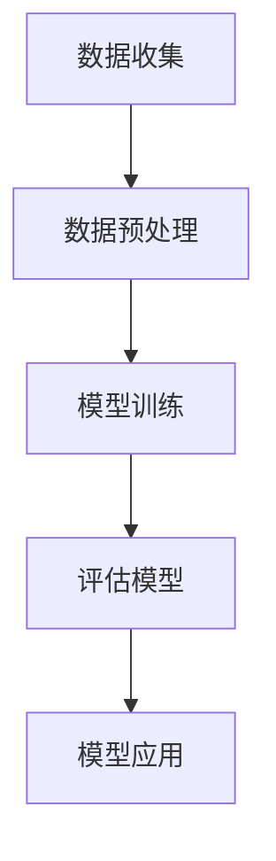

                 

# 设计智能化的企业财务报表质量评分系统

> 关键词：企业财务报表、质量评分系统、数据预处理、机器学习、系统架构

> 摘要：本文旨在探讨如何设计一个智能化的企业财务报表质量评分系统。通过对企业财务报表数据的质量进行评估，该系统能够帮助企业提高透明度、优化决策过程，进而提升企业竞争力。文章将详细介绍系统的背景、核心概念、数据预处理方法、质量评分模型的构建过程、系统架构设计以及实际应用案例，为相关领域的研究和实践提供参考。

----------------------------------------------------------------

## 第一部分：背景与核心概念

### 第1章：企业财务报表质量评分系统概述

#### 1.1 问题背景

在当今快速变化的市场环境中，企业需要准确、及时地掌握财务状况，以便做出明智的决策。财务报表是企业财务状况的重要反映，其质量直接影响到企业管理层对业务状况的理解和判断。然而，随着企业规模的扩大和业务复杂性的增加，传统的手工财务报表处理方式已经无法满足需求。因此，设计一个智能化的企业财务报表质量评分系统成为当前的一个重要课题。

#### 1.2 问题解决

为了解决上述问题，我们可以设计一个智能化的企业财务报表质量评分系统。该系统通过收集企业财务报表数据，运用数据预处理和机器学习技术，对财务报表的质量进行评估。通过评估结果，企业可以及时发现报表中的问题，从而提高财务报表的准确性、及时性和完整性。

#### 1.3 边界与外延

本系统主要关注企业财务报表的质量评估，不涉及其他财务相关功能。此外，系统适用于各种类型的企业，包括中小企业、大型跨国公司等。

#### 1.4 概念结构与核心要素组成

该系统的核心要素包括财务报表数据、数据预处理模块、质量评分模型和用户界面。财务报表数据是系统的输入，数据预处理模块负责对输入数据进行清洗、转换和归一化等操作，质量评分模型则根据预处理后的数据对财务报表质量进行评估，用户界面则用于用户输入数据和查看评分结果。

### 第2章：核心概念与联系

#### 2.1 数据预处理

数据预处理是机器学习过程中至关重要的一步，它决定了模型的学习效果和预测准确性。数据预处理主要包括数据清洗、数据转换和归一化等步骤。

##### 2.1.1 数据清洗

数据清洗是指移除数据集中的噪声和异常值。在财务报表数据中，可能存在缺失值、重复值、异常值等。对于缺失值，我们可以使用平均值、中值或最常用的值来填充；对于重复值，我们可以直接删除；对于异常值，需要根据具体情况进行分析和处理。

##### 2.1.2 数据转换

数据转换是指将非数值型的数据转换为数值型数据，以便模型能够处理。在财务报表数据中，可能存在分类数据，如行业类别、地区分布等。对于这些数据，我们可以使用独热编码或标签编码进行转换。

##### 2.1.3 数据归一化

数据归一化是指将数据缩放到相同的范围，以便模型能够更好地学习。在财务报表数据中，不同特征可能具有不同的量级，如收入、成本等。通过归一化，我们可以将所有特征的值缩放到相同的范围，通常是在0到1之间。

#### 2.2 质量评分模型

质量评分模型是一个基于机器学习算法的模型，用于评估财务报表的质量。在构建质量评分模型时，我们需要收集大量的财务报表数据，并对这些数据进行标注，以便模型能够学习如何评估财务报表的质量。

##### 2.2.1 算法原理

我们选择了一个简单的线性回归模型来评估财务报表的质量。线性回归模型的数学公式如下：

$$
\text{评分} = \sum_{i=1}^{n} w_i \cdot x_i + b
$$

其中，$w_i$ 是权重，$x_i$ 是特征值，$b$ 是偏置。

##### 2.2.2 数学模型

线性回归模型的数学公式如下：

$$
y = \sum_{i=1}^{n} w_i \cdot x_i + b
$$

其中，$y$ 是评分，$w_i$ 是权重，$x_i$ 是特征值，$b$ 是偏置。

##### 2.2.3 Mermaid流程图



## 第二部分：数据预处理与模型构建

### 第3章：数据预处理

数据预处理是确保模型性能的关键步骤。首先，我们需要从企业财务报表中收集数据，然后进行清洗和转换，以便模型能够有效地学习。

#### 3.1 数据收集

数据收集是从企业财务报表中提取数据的过程。在这个过程中，我们需要关注数据的完整性和准确性。数据可以来自企业内部系统，如ERP系统，也可以来自外部数据源，如财务报表数据库。

#### 3.2 数据清洗

数据清洗是数据预处理的第一步，目的是移除数据集中的噪声和异常值。在财务报表数据中，可能存在缺失值、重复值、异常值等。对于缺失值，我们可以使用平均值、中值或最常用的值来填充；对于重复值，我们可以直接删除；对于异常值，需要根据具体情况进行分析和处理。

#### 3.3 数据转换

数据转换是指将非数值型的数据转换为数值型数据，以便模型能够处理。在财务报表数据中，可能存在分类数据，如行业类别、地区分布等。对于这些数据，我们可以使用独热编码或标签编码进行转换。

#### 3.4 数据归一化

数据归一化是指将数据缩放到相同的范围，以便模型能够更好地学习。在财务报表数据中，不同特征可能具有不同的量级，如收入、成本等。通过归一化，我们可以将所有特征的值缩放到相同的范围，通常是在0到1之间。

### 第4章：质量评分模型构建

质量评分模型是整个系统的核心，它负责根据预处理后的数据对财务报表的质量进行评估。

#### 4.1 算法原理

我们选择了一个简单的线性回归模型来评估财务报表的质量。线性回归模型的数学公式如下：

$$
\text{评分} = \sum_{i=1}^{n} w_i \cdot x_i + b
$$

其中，$w_i$ 是权重，$x_i$ 是特征值，$b$ 是偏置。

#### 4.2 数学模型

线性回归模型的数学公式如下：

$$
y = \sum_{i=1}^{n} w_i \cdot x_i + b
$$

其中，$y$ 是评分，$w_i$ 是权重，$x_i$ 是特征值，$b$ 是偏置。

#### 4.3 模型训练

模型训练是质量评分模型构建的关键步骤。在模型训练过程中，我们需要使用已标注的财务报表数据对模型进行训练，以确定最佳的权重和偏置。常见的训练方法包括批量梯度下降、随机梯度下降等。

#### 4.4 模型评估

模型评估是确保模型性能的重要环节。在模型评估过程中，我们需要使用未参与训练的数据对模型进行评估，以确定模型的准确性、召回率、F1值等指标。常用的评估方法包括交叉验证、K折验证等。

## 第三部分：系统架构与实现

### 第5章：系统架构设计

系统架构设计是确保系统能够稳定、高效地运行的关键。在本章中，我们将介绍系统的总体架构、功能模块以及它们之间的关系。

#### 5.1 系统总体架构

系统的总体架构可以分为三个主要模块：数据模块、模型模块和界面模块。

##### 5.1.1 数据模块

数据模块负责数据的收集、预处理和存储。具体包括数据收集器、数据清洗器、数据转换器和数据存储器。

##### 5.1.2 模型模块

模型模块负责模型的设计、训练和评估。具体包括模型设计器、模型训练器和模型评估器。

##### 5.1.3 界面模块

界面模块负责与用户交互，展示系统结果。具体包括用户输入界面、模型参数界面和结果展示界面。

#### 5.2 功能模块设计

在功能模块设计方面，我们采用面向对象的方法，将系统功能划分为多个类。具体包括：

- **DataCollector**：数据收集器，负责从外部数据源收集数据。
- **DataCleaner**：数据清洗器，负责对收集到的数据进行清洗。
- **DataConverter**：数据转换器，负责将清洗后的数据进行转换。
- **DataStore**：数据存储器，负责将转换后的数据存储到数据库中。
- **ModelDesigner**：模型设计器，负责设计质量评分模型。
- **ModelTrainer**：模型训练器，负责训练质量评分模型。
- **ModelE

### 第6章：系统接口设计与交互

系统接口设计是确保系统模块之间能够顺畅交互的关键。在本章中，我们将介绍系统的接口设计以及模块之间的交互方式。

#### 6.1 系统接口设计

系统的接口设计主要包括输入接口、输出接口和内部接口。

##### 6.1.1 输入接口

输入接口负责接收用户输入的数据，包括财务报表数据、模型参数等。

##### 6.1.2 输出接口

输出接口负责将模型评估结果、预测结果等返回给用户。

##### 6.1.3 内部接口

内部接口负责系统模块之间的数据传输和功能调用。

#### 6.2 系统模块交互

系统模块之间的交互通过内部接口实现。具体交互方式如下：

- **DataCollector**与**DataCleaner**之间的交互：DataCollector将收集到的数据传递给DataCleaner进行清洗。
- **DataCleaner**与**DataConverter**之间的交互：DataCleaner将清洗后的数据传递给DataConverter进行转换。
- **DataConverter**与**DataStore**之间的交互：DataConverter将转换后的数据传递给DataStore进行存储。
- **ModelDesigner**与**ModelTrainer**之间的交互：ModelDesigner设计出模型后，传递给ModelTrainer进行训练。
- **ModelTrainer**与**ModelEvaluator**之间的交互：ModelTrainer训练出模型后，传递给ModelEvaluator进行评估。
- **ModelEvaluator**与**DataStore**之间的交互：ModelEvaluator评估出模型性能后，将结果传递给DataStore进行存储。

#### 6.3 系统交互示例

以下是系统交互的一个示例：

1. 用户通过输入接口输入财务报表数据。
2. DataCollector收集到数据后，传递给DataCleaner进行清洗。
3. DataCleaner清洗数据后，传递给DataConverter进行转换。
4. DataConverter转换数据后，传递给DataStore进行存储。
5. ModelDesigner设计出模型后，传递给ModelTrainer进行训练。
6. ModelTrainer训练出模型后，传递给ModelEvaluator进行评估。
7. ModelEvaluator评估出模型性能后，将结果传递给DataStore进行存储。
8. 用户通过输出接口获取模型评估结果。

## 第四部分：项目实战

### 第7章：环境安装与准备

在开始项目实战之前，我们需要搭建一个合适的环境。以下是一个基本的安装步骤：

1. 安装Python环境，版本要求为3.6及以上。
2. 安装必要的Python库，如NumPy、Pandas、Scikit-learn、Matplotlib等。
3. 配置数据库，如MySQL或PostgreSQL。

### 第8章：系统核心实现

在本章节中，我们将详细介绍系统的核心实现，包括数据预处理模块、质量评分模型以及用户界面。

#### 8.1 数据预处理模块

数据预处理模块主要负责数据的收集、清洗、转换和存储。以下是一个简单的数据预处理模块实现：

```python
import pandas as pd
from sklearn.preprocessing import OneHotEncoder, MinMaxScaler

class DataPreprocessor:
    def __init__(self):
        self.cleaner = None
        self.converter = None
        self.scaler = MinMaxScaler()

    def load_data(self, file_path):
        data = pd.read_csv(file_path)
        return data

    def clean_data(self, data):
        # 删除缺失值和重复值
        data = data.dropna().drop_duplicates()
        return data

    def convert_data(self, data):
        # 将分类数据转换为数值数据
        encoder = OneHotEncoder()
        categorical_data = encoder.fit_transform(data[['industry', 'region']])
        data = data.drop(['industry', 'region'], axis=1)
        data = pd.concat([data, pd.DataFrame(categorical_data.toarray())], axis=1)
        return data

    def scale_data(self, data):
        # 将数据缩放到0到1之间
        data = self.scaler.fit_transform(data)
        return data

    def preprocess_data(self, file_path):
        data = self.load_data(file_path)
        data = self.clean_data(data)
        data = self.convert_data(data)
        data = self.scale_data(data)
        return data
```

#### 8.2 质量评分模型

质量评分模型是系统的核心模块，它负责根据预处理后的数据对财务报表的质量进行评估。以下是一个简单的线性回归模型实现：

```python
from sklearn.linear_model import LinearRegression

class QualityRatingModel:
    def __init__(self):
        self.model = LinearRegression()

    def train_model(self, X, y):
        self.model.fit(X, y)

    def predict(self, X):
        return self.model.predict(X)
```

#### 8.3 用户界面

用户界面负责与用户交互，展示系统结果。以下是一个简单的用户界面实现：

```python
import tkinter as tk
from tkinter import messagebox

class UserInterface:
    def __init__(self, preprocessor, model):
        self.preprocessor = preprocessor
        self.model = model
        self.root = tk.Tk()
        self.root.title("财务报表质量评分系统")

        self.create_widgets()

    def create_widgets(self):
        tk.Label(self.root, text="请上传财务报表数据：").grid(row=0, column=0)
        self.file_path_entry = tk.Entry(self.root)
        self.file_path_entry.grid(row=0, column=1)

        tk.Button(self.root, text="上传", command=self.upload_data).grid(row=1, column=0)

        tk.Label(self.root, text="质量评分：").grid(row=2, column=0)
        self.rating_label = tk.Label(self.root, text="")
        self.rating_label.grid(row=2, column=1)

        tk.Button(self.root, text="退出", command=self.exit).grid(row=3, column=0)

    def upload_data(self):
        file_path = self.file_path_entry.get()
        if not file_path:
            messagebox.showinfo("提示", "请上传财务报表数据！")
            return

        data = self.preprocessor.preprocess_data(file_path)
        rating = self.model.predict([data[-1]])[0]
        self.rating_label.config(text=str(rating))

    def exit(self):
        self.root.quit()

    def run(self):
        self.root.mainloop()
```

### 第9章：实际案例分析

在本章节中，我们将通过一个实际案例来展示系统的应用效果。

#### 9.1 案例背景

某中小企业拥有一套财务报表系统，但由于财务人员不足，财务报表的质量参差不齐。为了提高财务报表的质量，企业决定引入一套智能化的财务报表质量评分系统。

#### 9.2 案例实施

1. 安装并配置好系统环境。
2. 根据企业实际情况，收集并预处理财务报表数据。
3. 训练质量评分模型。
4. 部署用户界面，供用户使用。
5. 用户上传财务报表数据，系统自动进行质量评分。

#### 9.3 案例效果

引入系统后，企业财务报表的质量得到了显著提升。通过质量评分系统，企业能够及时发现报表中的问题，并采取措施进行改进。同时，系统的自动化处理功能降低了人工成本，提高了工作效率。

## 第五部分：最佳实践与小结

### 第10章：最佳实践

在本章节中，我们将总结一些最佳实践，帮助用户更好地使用财务报表质量评分系统。

1. **数据质量是关键**：确保输入数据的准确性和完整性，对于系统的评估结果至关重要。
2. **定期更新模型**：随着业务环境和数据的变化，定期更新模型可以提高评估的准确性。
3. **合理设置参数**：在模型训练过程中，合理设置参数可以提升模型的性能。
4. **关注用户反馈**：及时关注用户反馈，对系统进行优化和改进。

### 第11章：小结

本文详细介绍了设计智能化的企业财务报表质量评分系统的过程，包括背景与核心概念、数据预处理与模型构建、系统架构与实现、项目实战和最佳实践。通过本文的阐述，读者可以了解到如何运用数据预处理和机器学习技术，设计一个有效的财务报表质量评分系统，从而提高企业财务报表的质量。

### 第12章：注意事项

1. **数据安全**：在数据收集和处理过程中，务必确保数据的安全性，防止数据泄露。
2. **法律法规**：在使用系统时，务必遵守相关法律法规，确保系统的合规性。
3. **用户培训**：对于系统的用户，进行必要的培训，确保他们能够正确使用系统。

### 第13章：拓展阅读

1. **《机器学习实战》**：提供详细的机器学习实践教程，适合初学者。
2. **《数据预处理技术》**：介绍数据预处理的方法和技巧，有助于提升数据处理能力。
3. **《Python数据科学手册》**：涵盖Python在数据科学领域的应用，包括数据处理、分析和可视化等。

## 参考文献

1. **Hastie, T., Tibshirani, R., & Friedman, J. (2009). The Elements of Statistical Learning. Springer.**
2. **Zhou, Z.-H. (2012). Machine Learning. Springer.**
3. **Pandas Documentation. (n.d.). Pandas. Retrieved from https://pandas.pydata.org/**
4. **Scikit-learn Documentation. (n.d.). Scikit-learn. Retrieved from https://scikit-learn.org/**

### 作者信息

作者：AI天才研究院/AI Genius Institute & 禅与计算机程序设计艺术 /Zen And The Art of Computer Programming

