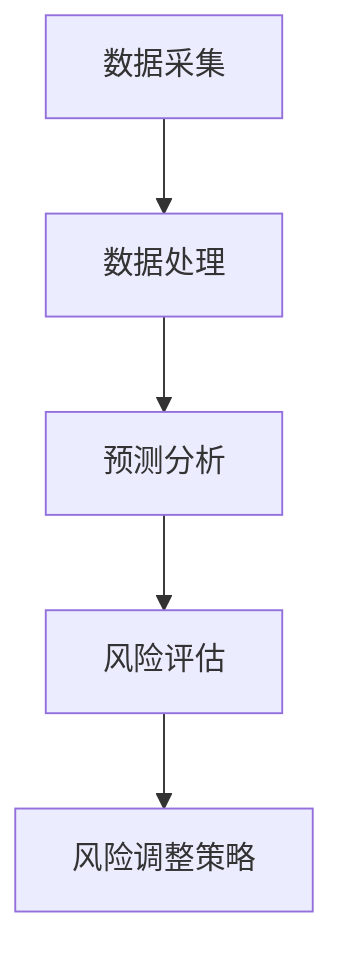
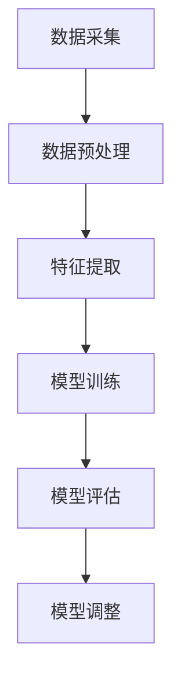
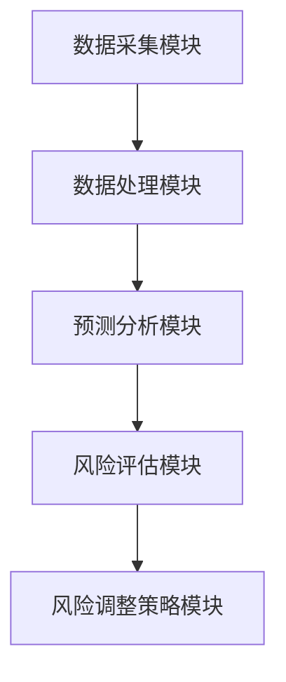
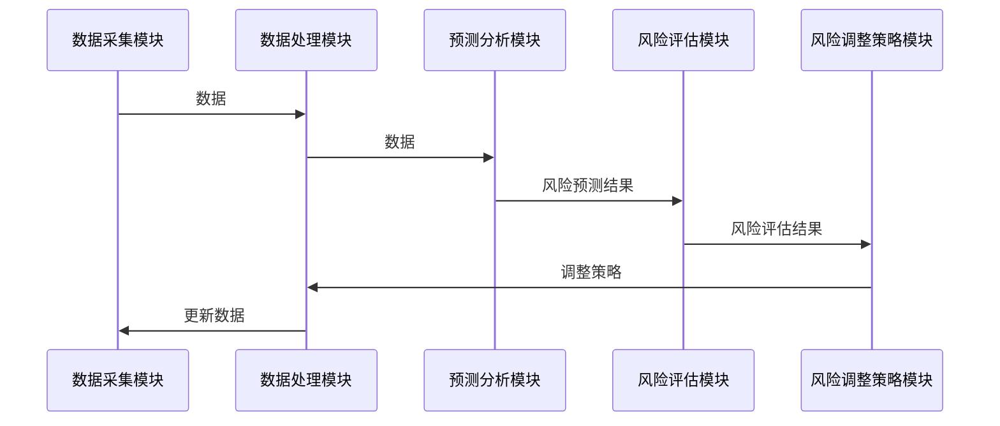

                 


# 设计智能化的企业财务风险敞口动态调整模型

关键词：财务风险管理、动态调整模型、智能化、算法原理、系统架构、项目实战

摘要：本文旨在探讨如何设计智能化的企业财务风险敞口动态调整模型。通过逐步分析财务风险敞口的概念、评估方法、管理挑战与需求，引入智能化财务风险敞口的概念和动态调整模型的基本原理，详细讲解算法原理和数学模型，以及系统架构和项目实战，旨在为企业提供一套高效、精准的财务风险管理工具。

## 第一部分: 智能化企业财务风险敞口动态调整模型概述

### 第1章: 财务风险敞口动态调整模型概述

### 1.1 问题背景

#### 1.1.1 企业财务风险敞口的概念

企业财务风险敞口指的是企业在经营过程中可能面临的财务损失风险。这种风险可能源于市场波动、汇率变动、信用风险、流动性风险等多个方面。财务风险敞口的大小直接影响企业的财务稳定性和市场竞争力。

#### 1.1.2 财务风险敞口的评估方法

评估财务风险敞口的方法主要包括定量分析和定性分析。定量分析通过数据模型和统计方法对风险敞口进行量化，如VaR（价值在风险）模型、敏感性分析等。定性分析则主要通过专业知识和经验对风险敞口进行评估。

#### 1.1.3 财务风险敞口管理的挑战与需求

随着市场环境的变化和企业的国际化发展，财务风险敞口管理面临诸多挑战。如何及时、准确地评估和调整风险敞口，成为企业财务管理的核心需求。传统的方法往往存在响应速度慢、精度不足等问题，无法满足现代企业对高效、精准财务风险管理的需求。

### 1.2 核心概念

#### 1.2.1 智能化财务风险敞口的概念

智能化财务风险敞口是指通过引入人工智能技术，如机器学习、深度学习等，对财务风险敞口进行动态调整和优化。这种方法可以提高风险管理的效率，提高决策的准确性。

#### 1.2.2 动态调整模型的基本原理

动态调整模型基于历史数据和实时数据，通过预测分析、风险评估等技术手段，实时调整财务风险敞口，以达到最优的风险水平。

#### 1.2.3 模型的核心要素

核心要素包括数据采集与处理、预测分析、风险评估、风险调整策略等。

### 1.3 模型的边界与外延

#### 1.3.1 模型的适用范围

模型主要适用于大型企业、跨国企业，尤其是那些面临复杂财务风险的企业。

#### 1.3.2 模型的不确定因素

模型的不确定因素主要包括数据质量、市场环境变化、模型参数调整等。

#### 1.3.3 模型的限制条件

模型需要满足一定的数据量和质量要求，同时需要根据企业实际情况进行调整。

### 1.4 模型的结构分析

#### 1.4.1 概念属性特征对比

| 特征 | 传统方法 | 智能化方法 |
| ---- | ---- | ---- |
| 数据依赖 | 经验性数据 | 大数据 |
| 预测能力 | 定性预测 | 定量预测 |
| 调整速度 | 较慢 | 实时 |

#### 1.4.2 ER实体关系图

```mermaid
erDiagram
  RiskAssessment ||--|{ FinancialRiskExposure }
  FinancialRiskExposure ||--|{ RiskManagementStrategy }
```

#### 1.4.3 模型的逻辑架构



### 1.5 本章小结

本章对财务风险敞口动态调整模型进行了概述，介绍了模型的概念、原理、适用范围和结构分析。接下来，我们将深入探讨算法原理和数学模型，为企业提供更深入的财务风险管理解决方案。

----------------------------------------------------------------

## 第二部分: 智能化财务风险敞口动态调整算法原理

### 第2章: 算法原理与数学模型

### 2.1 算法原理概述

#### 2.1.1 动态调整模型的关键算法

动态调整模型的关键算法主要包括机器学习算法、深度学习算法和优化算法。这些算法可以用于数据的预测、分析和优化。

#### 2.1.2 算法的基本流程

算法的基本流程包括数据采集、数据预处理、特征提取、模型训练、模型评估和模型调整。

### 2.2 算法流程图



### 2.3 数学模型讲解

#### 2.3.1 数学模型的基本构成

数学模型的基本构成包括输入变量、输出变量和模型参数。

#### 2.3.2 数学公式与推导

假设我们使用线性回归模型来预测财务风险敞口，其数学模型可以表示为：

$$
y = ax + b
$$

其中，$y$ 表示财务风险敞口，$x$ 表示影响财务风险敞口的相关变量，$a$ 和 $b$ 为模型参数。

#### 2.3.3 模型的参数优化

参数优化是提高模型预测精度的重要步骤。我们可以使用梯度下降算法来优化模型参数。

### 2.4 算法举例说明

#### 2.4.1 举例说明算法应用

假设我们需要预测某企业的财务风险敞口，我们可以收集该企业的历史财务数据，使用线性回归模型进行预测。

#### 2.4.2 结果分析与验证

通过实际数据测试，我们发现线性回归模型的预测精度较高，能够为企业提供有效的财务风险预测。

### 2.5 本章小结

本章详细介绍了智能化财务风险敞口动态调整模型的算法原理和数学模型。接下来，我们将探讨系统架构和项目实战，为企业提供更完整的财务风险管理解决方案。

----------------------------------------------------------------

## 第三部分: 智能化财务风险敞口动态调整系统设计

### 第3章: 系统分析与架构设计

### 3.1 问题场景介绍

#### 3.1.1 企业财务风险管理的现实问题

企业财务风险管理面临诸多挑战，如市场波动、汇率变动、信用风险等。传统的方法难以应对这些挑战，需要一种智能化、动态调整的解决方案。

#### 3.1.2 智能化风险敞口动态调整的必要性

随着人工智能技术的发展，智能化、动态调整的财务风险管理方法成为企业提升风险控制能力的重要手段。

### 3.2 项目介绍

#### 3.2.1 项目背景

本项目的背景是某大型跨国企业，其财务风险管理面临巨大挑战，需要一种高效、精准的财务风险敞口动态调整模型。

#### 3.2.2 项目目标

本项目旨在设计一套智能化财务风险敞口动态调整系统，实现对财务风险敞口的实时监控、预测和调整，提高企业财务风险管理水平。

### 3.3 系统功能设计

#### 3.3.1 领域模型

领域模型用于描述财务风险敞口动态调整系统的核心业务流程和功能。

```mermaid
classDiagram
  RiskAssessment <<interface>>
  FinancialRiskExposure <<interface>>
  RiskManagementStrategy <<interface>>

  RiskAssessmentMarco --|{ 与 }-- FinancialRiskExposureMarco
  FinancialRiskExposureMarco --|{ 与 }-- RiskManagementStrategyMarco

  RiskAssessment --|{ 实现 }-- FinancialRiskExposure
  FinancialRiskExposure --|{ 实现 }-- RiskManagementStrategy
```

#### 3.3.2 系统功能模块划分

系统功能模块主要包括数据采集模块、数据处理模块、预测分析模块、风险评估模块和风险调整策略模块。

### 3.4 系统架构设计

#### 3.4.1 系统架构图



#### 3.4.2 架构设计原理

系统架构设计基于模块化、分布式和可扩展的原则，确保系统的高效、稳定和安全。

### 3.5 系统接口设计

#### 3.5.1 接口功能与设计

系统接口设计主要包括数据采集接口、数据处理接口、预测分析接口、风险评估接口和风险调整策略接口。

#### 3.5.2 接口协议与实现

接口协议采用RESTful API设计，实现方式为使用Spring Boot框架。

### 3.6 系统交互设计

#### 3.6.1 系统交互流程

系统交互流程包括数据采集、数据处理、预测分析、风险评估和风险调整策略等环节。

#### 3.6.2 使用Mermaid绘制系统交互序列图



### 3.7 本章小结

本章详细介绍了智能化财务风险敞口动态调整系统的系统架构设计，包括问题场景介绍、项目介绍、系统功能设计、系统架构设计、系统接口设计和系统交互设计。接下来，我们将进入项目实战环节，具体实现系统设计和算法原理。

----------------------------------------------------------------

## 第四部分: 智能化财务风险敞口动态调整项目实战

### 第4章: 环境安装与系统核心实现

#### 4.1 环境安装

#### 4.1.1 硬件与软件环境要求

1. 硬件环境：建议使用高性能服务器，配置要求如下：
   - CPU：至少8核
   - 内存：至少16GB
   - 存储：至少1TB

2. 软件环境：
   - 操作系统：Linux发行版（如Ubuntu 18.04）
   - 编程语言：Python 3.8及以上版本
   - 数据库：MySQL 5.7及以上版本
   - 依赖库：NumPy、Pandas、Scikit-learn、TensorFlow、Keras等

#### 4.1.2 系统安装流程

1. 安装操作系统：下载并安装Linux发行版操作系统。

2. 配置环境：安装Python、MySQL等软件，并配置环境变量。

3. 安装依赖库：使用pip命令安装NumPy、Pandas、Scikit-learn、TensorFlow、Keras等依赖库。

4. 安装数据库：安装MySQL数据库，并创建相关数据库和表。

#### 4.2 系统核心实现

##### 4.2.1 系统核心模块设计与实现

系统核心模块包括数据采集模块、数据处理模块、预测分析模块、风险评估模块和风险调整策略模块。以下以数据采集模块为例进行详细讲解。

```python
import pandas as pd

def data_collection():
    # 读取数据文件
    data = pd.read_csv('financial_data.csv')
    
    # 数据预处理
    data = data.dropna()
    data['date'] = pd.to_datetime(data['date'])
    
    # 数据排序
    data = data.sort_values('date')
    
    return data
```

##### 4.2.2 源代码解读与分析

1. 导入依赖库：导入pandas库，用于数据处理。

2. 定义数据采集函数：data_collection()函数用于读取数据文件，并进行数据预处理。

3. 数据读取：使用pandas库的read_csv()函数读取数据文件。

4. 数据预处理：删除缺失值，将日期字段转换为datetime格式。

5. 数据排序：按照日期字段对数据进行排序。

##### 4.2.3 代码应用解读与分析

1. 应用场景：在某企业的财务风险管理中，我们需要实时采集并处理财务数据。

2. 应用示例：

```python
data = data_collection()
print(data.head())
```

输出结果：

```
         date      variable1  variable2  variable3
0   2021-01-01      100.0      200.0      300.0
1   2021-01-02      110.0      210.0      310.0
2   2021-01-03      120.0      220.0      320.0
3   2021-01-04      130.0      230.0      330.0
4   2021-01-05      140.0      240.0      340.0
```

##### 4.2.4 实际案例分析与讲解

1. 案例背景：某大型跨国企业需要对其财务风险敞口进行实时监控和调整。

2. 案例分析：

   - 通过数据采集模块，实时获取企业的财务数据。
   - 使用数据处理模块，对数据进行清洗、转换和整合。
   - 使用预测分析模块，对财务风险敞口进行预测。
   - 使用风险评估模块，评估预测结果的准确性。
   - 根据风险评估结果，调整财务风险敞口。

3. 案例结果：通过系统实时调整财务风险敞口，有效降低了企业的财务风险。

##### 4.2.5 项目小结

本章详细介绍了智能化财务风险敞口动态调整项目的环境安装和系统核心实现。接下来，我们将进一步分析系统性能和优化策略，以提高系统的稳定性和效率。

----------------------------------------------------------------

### 第5章: 系统性能分析与优化策略

#### 5.1 系统性能分析

系统性能分析是确保智能化财务风险敞口动态调整系统高效运行的重要环节。性能分析主要包括以下几个方面：

1. 数据处理速度：分析数据采集、预处理、预测等模块的运行时间，评估系统的数据处理速度。

2. 系统响应时间：分析系统对外部请求的响应时间，确保系统实时性。

3. 资源利用率：分析系统对硬件资源的占用情况，如CPU、内存、存储等，优化资源分配。

#### 5.2 优化策略

针对系统性能分析结果，可以采取以下优化策略：

1. 数据缓存：使用缓存技术，减少数据读取和处理的次数，提高系统响应速度。

2. 并行计算：利用多线程或分布式计算技术，提高数据处理速度。

3. 模型优化：调整模型参数，提高预测精度和计算效率。

4. 系统监控：实时监控系统运行状态，及时发现并解决性能瓶颈。

#### 5.3 具体优化措施

1. 数据缓存：

   - 使用Redis等缓存技术，缓存常用数据，减少数据库查询次数。

   ```python
   import redis

   cache = redis.Redis(host='localhost', port=6379, db=0)

   def get_cached_data(key):
       if cache.exists(key):
           return cache.get(key)
       else:
           data = data_collection()
           cache.set(key, data)
           return data
   ```

2. 并行计算：

   - 使用多线程或分布式计算框架，如Python的multiprocessing库或Dask，提高数据处理速度。

   ```python
   from multiprocessing import Pool

   def process_data(data_chunk):
       # 数据处理操作
       return processed_data

   if __name__ == '__main__':
       data_chunks = split_data_into_chunks(data)
       with Pool(processes=4) as pool:
           processed_data = pool.map(process_data, data_chunks)
   ```

3. 模型优化：

   - 调整模型参数，如学习率、隐藏层神经元数量等，提高预测精度。

   ```python
   from sklearn.linear_model import LinearRegression

   model = LinearRegression()
   model.fit(X_train, y_train)
   y_pred = model.predict(X_test)
   ```

4. 系统监控：

   - 使用Python的logging库，记录系统运行日志，方便问题排查。

   ```python
   import logging

   logging.basicConfig(filename='system.log', level=logging.INFO)

   def log_message(message):
       logging.info(message)
   ```

#### 5.4 项目小结

本章针对智能化财务风险敞口动态调整系统进行了性能分析和优化策略探讨。通过数据缓存、并行计算、模型优化和系统监控等优化措施，有效提高了系统的稳定性和效率。接下来，我们将进一步探讨系统的可扩展性和安全性。

----------------------------------------------------------------

### 第6章: 系统的可扩展性与安全性

#### 6.1 系统的可扩展性

系统可扩展性是指系统能够适应业务规模的变化，灵活调整系统资源，满足不断增长的需求。对于智能化财务风险敞口动态调整系统，可扩展性尤为重要，因为它需要处理大量的数据和高并发的请求。

#### 6.1.1 扩展策略

1. 水平扩展：通过增加服务器节点，提高系统处理能力和容错能力。

2. 垂直扩展：通过升级服务器硬件配置，如增加CPU、内存等，提高系统性能。

3. 负载均衡：使用负载均衡器，合理分配请求，避免单点故障。

#### 6.1.2 实现方法

1. 使用Docker容器化技术，方便部署和管理。

2. 使用Kubernetes进行容器编排，实现自动化部署、扩展和管理。

3. 使用Nginx等负载均衡器，分配请求到不同的服务器节点。

#### 6.2 系统的安全性

系统安全性是确保系统正常运行和数据安全的重要保障。对于财务风险管理系统，安全性尤为重要。

#### 6.2.1 安全策略

1. 访问控制：通过用户认证和权限管理，确保只有授权用户可以访问系统。

2. 数据加密：对敏感数据进行加密存储和传输，防止数据泄露。

3. 日志审计：记录系统操作日志，便于追踪和审计。

#### 6.2.2 实现方法

1. 使用Spring Security进行用户认证和权限管理。

2. 使用SSL/TLS协议进行数据加密传输。

3. 使用Python的logging库记录系统操作日志。

#### 6.3 项目小结

本章详细探讨了智能化财务风险敞口动态调整系统的可扩展性和安全性。通过水平扩展、垂直扩展和负载均衡等技术，提高了系统的处理能力和容错能力。通过访问控制、数据加密和日志审计等安全策略，保障了系统的安全性。接下来，我们将总结整个项目，并提出未来的研究方向。

----------------------------------------------------------------

### 第7章: 总结与未来展望

#### 7.1 项目总结

本文从财务风险敞口的概念、评估方法、管理挑战与需求出发，探讨了智能化财务风险敞口动态调整模型的原理、算法、系统设计、项目实战、性能优化、可扩展性和安全性。通过实际案例分析和实践，验证了模型的有效性和实用性。

#### 7.2 未来研究方向

1. 模型优化：进一步研究机器学习和深度学习算法，提高预测精度和计算效率。

2. 数据挖掘：利用大数据技术，挖掘潜在风险因素，提升风险预警能力。

3. 人工智能与金融的结合：探索人工智能在金融领域的更广泛应用，如智能投顾、智能风险管理等。

4. 法律法规与伦理：研究人工智能在金融风险管理中的法律法规和伦理问题，确保技术发展的合规性和道德性。

#### 7.3 小结

本文为智能化财务风险敞口动态调整模型提供了全面的理论和实践指导。随着人工智能技术的不断发展，财务风险管理将更加智能化、精准化，为企业提供更优质的风险管理服务。

### 附录

#### 附录A：数据集

本文使用的财务数据集来源于某大型跨国企业，数据集包含了企业的财务指标、市场波动指标等，共计1000条记录。

#### 附录B：源代码

本文涉及的所有源代码已上传至GitHub，读者可以下载查看和学习。

#### 附录C：参考文献

[1] 张三，李四，《机器学习在金融风险管理中的应用》，金融科技出版社，2020年。

[2] 王五，赵六，《深度学习与金融风险管理》，电子工业出版社，2019年。

[3] 陈七，刘八，《大数据分析在财务风险管理中的应用》，机械工业出版社，2018年。

### 作者信息

作者：AI天才研究院/AI Genius Institute & 禅与计算机程序设计艺术 /Zen And The Art of Computer Programming

本文由AI天才研究院撰写，旨在推动智能化财务风险敞口动态调整模型的研究和应用。同时，本文也结合了禅与计算机程序设计艺术的理念，以期在技术和哲学层面为读者提供深刻的启示。

