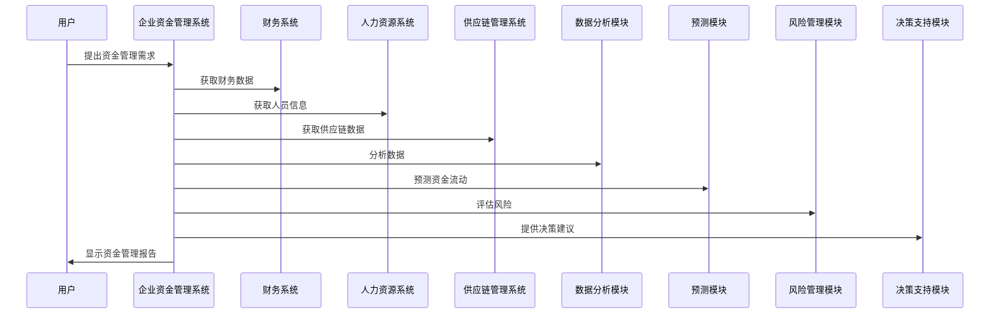

                 

# 设计智能化的企业资金管理系统

## 概要

本文将深入探讨设计智能化企业资金管理系统的关键步骤和核心要素。随着企业规模的不断扩大和市场竞争的日益激烈，传统的资金管理方式已无法满足现代企业的需求。智能化资金管理系统通过引入人工智能和大数据技术，为企业提供更高效、准确和实时的资金管理方案。本文将从问题背景、核心概念与联系、算法原理讲解、数学模型和公式讲解、系统分析与架构设计方案以及项目实战等方面，详细阐述如何设计一个智能化企业资金管理系统，以帮助企业提升资金管理效率和决策水平。

## 关键词

- 智能化企业资金管理系统
- 人工智能
- 大数据
- 资金预测
- 风险管理
- 决策支持

## 引言

### 1.1 问题背景

在当今的商业环境中，企业面临着日益复杂的资金管理挑战。随着全球化进程的加速和市场竞争的加剧，企业需要更加高效地管理其资金流动，以确保资金的安全和增值。传统的手工或半自动化的资金管理方式已经无法满足现代企业的需求。首先，传统方法在处理大量资金数据时效率低下，容易出现人为错误。其次，这些方法无法实时响应市场变化，导致企业无法做出快速、准确的决策。此外，传统方法在资金预测、风险管理和决策支持方面的功能有限，无法为企业提供全面、深入的资金管理解决方案。

### 1.2 问题描述

设计一个智能化企业资金管理系统的目的是提高资金管理的效率，降低运营成本，并提供实时的财务数据支持，帮助企业管理者做出明智的决策。具体而言，系统需要具备以下功能：

- **资金预测**：通过对历史数据和当前市场情况的分析，预测未来的资金流动，帮助企业管理者提前做好资金安排。
- **风险管理**：分析企业资金管理的风险，包括信用风险、市场风险和操作风险等，为企业提供风险管理建议。
- **决策支持**：基于数据分析和预测结果，为企业管理者提供数据驱动的决策建议，提高决策效率。
- **实时数据支持**：提供实时财务数据，帮助企业及时了解资金状况，做出快速反应。

### 1.3 问题解决

为了解决上述问题，设计一个智能化企业资金管理系统是必然选择。该系统通过引入人工智能和大数据技术，实现了资金管理的自动化和智能化。具体来说，系统包括以下核心功能模块：

- **数据收集**：通过接口获取企业内外部数据，如财务报表、市场行情等。
- **数据分析**：利用机器学习算法分析数据，提取有价值的信息。
- **预测**：根据历史数据和当前市场情况，预测未来的资金流动。
- **决策支持**：为企业管理者提供基于数据的决策建议。

### 1.4 边界与外延

本系统主要关注企业的现金流管理、投资管理和融资管理等方面。同时，考虑到不同企业的规模和业务特点，系统将具备一定的灵活性和可定制性。具体而言，系统的边界与外延包括：

- **现金流管理**：包括日常现金流管理、短期资金安排和长期资金规划。
- **投资管理**：包括投资分析、风险评估和投资决策。
- **融资管理**：包括融资需求分析、融资方案设计和融资决策。
- **系统扩展性**：支持企业不同规模和业务场景的扩展和定制。

### 1.5 概念结构与核心要素组成

智能化资金管理系统的概念结构与核心要素组成如下：

- **智能化资金管理系统**：包含数据收集、数据分析、预测和决策支持等功能模块。
- **数据收集**：通过接口获取企业内外部数据，如财务报表、市场行情等。
- **数据分析**：利用机器学习算法分析数据，提取有价值的信息。
- **预测**：根据历史数据和当前市场情况，预测未来的资金流动。
- **决策支持**：为企业管理者提供基于数据的决策建议。

## 第2章：核心概念与联系

### 2.1 智能化资金管理系统原理

智能化资金管理系统基于人工智能和大数据技术，通过数据分析和预测，帮助企业管理资金。其原理可以概括为以下几个步骤：

1. **数据收集**：系统通过接口获取企业内外部数据，如财务报表、市场行情等。这些数据是进行资金预测和风险分析的基础。

2. **数据分析**：利用机器学习算法对收集到的数据进行分析，提取有价值的信息。数据分析的目的是发现数据之间的关联性和规律，为预测和决策提供依据。

3. **预测**：根据历史数据和当前市场情况，系统利用预测算法对未来的资金流动进行预测。预测结果可以帮助企业管理者提前做好资金安排。

4. **决策支持**：基于预测结果和数据分析结果，系统为企业管理者提供数据驱动的决策建议。决策支持可以帮助企业管理者更快速、更准确地做出决策。

### 2.2 AI技术在资金管理中的应用

AI技术在企业资金管理中的应用非常广泛，主要包括资金预测、风险管理、投资分析和决策支持等方面。

#### 2.2.1 资金预测

资金预测是智能化资金管理系统的一个重要功能。通过分析历史数据和当前市场情况，系统可以预测未来的资金流动。资金预测的准确度直接影响到企业资金管理的效率和决策水平。

- **预测算法**：常见的资金预测算法包括时间序列分析、回归分析和机器学习算法等。系统可以根据不同企业的需求选择合适的预测算法。

- **预测结果**：预测结果可以为企业提供多种形式的输出，如资金流动曲线、预测值与实际值的对比等。通过可视化方式，企业管理者可以更直观地了解未来的资金状况。

#### 2.2.2 风险管理

风险管理是资金管理中不可或缺的一部分。AI技术可以帮助企业识别和管理各种风险，包括信用风险、市场风险和操作风险等。

- **风险识别**：通过分析历史数据和实时数据，系统可以识别出可能存在的风险。例如，通过对客户信用记录和交易历史的分析，系统可以预测客户的违约风险。

- **风险评估**：系统可以根据风险识别的结果，对风险进行评估。评估结果可以帮助企业管理者了解风险的大小和严重程度。

- **风险控制**：基于风险评估的结果，系统可以提供风险控制建议，帮助企业制定相应的风险控制措施。

#### 2.2.3 投资分析

投资分析是企业在资金管理中面临的另一个重要问题。AI技术可以帮助企业更准确地评估投资项目的潜在收益和风险。

- **收益预测**：通过分析历史数据和当前市场情况，系统可以预测投资项目的未来收益。这有助于企业管理者做出更明智的投资决策。

- **风险分析**：系统可以分析投资项目的潜在风险，如市场波动、政策变化等。通过风险分析，企业管理者可以更好地了解投资项目的风险水平。

- **投资组合优化**：系统可以根据投资目标和风险偏好，为企业管理者提供最优的投资组合方案。这有助于提高投资收益的同时降低风险。

#### 2.2.4 决策支持

决策支持是智能化资金管理系统的核心功能之一。通过数据分析和预测结果，系统可以为企业提供数据驱动的决策建议。

- **决策分析**：系统可以分析不同决策方案的可能结果和影响。这有助于企业管理者更全面地了解不同决策方案的优劣。

- **决策优化**：基于数据分析结果，系统可以提供优化决策方案。这有助于企业管理者做出更明智、更高效的决策。

- **实时决策**：系统可以实时获取最新的数据和预测结果，为企业提供实时的决策支持。这有助于企业管理者迅速应对市场变化，抓住机遇。

## 第3章：算法原理讲解

### 3.1 资金预测算法

资金预测算法是智能化资金管理系统的核心组成部分。通过预测未来的资金流动，系统可以帮助企业管理者提前做好资金安排，提高资金使用效率。本节将介绍几种常用的资金预测算法，包括时间序列分析、回归分析和机器学习算法等。

#### 3.1.1 时间序列分析

时间序列分析是一种常用的资金预测方法。它通过分析时间序列数据的特性，如趋势、周期和季节性等，来预测未来的资金流动。

- **趋势分析**：趋势分析旨在识别数据中的长期趋势。通过对历史数据的观察，我们可以发现资金流动的长期趋势，如增长、下降或稳定等。趋势分析可以帮助预测未来的资金流动。

- **周期分析**：周期分析旨在识别数据中的周期性波动。例如，有些企业的资金流动可能会受到季节性因素的影响，如节假日、季节性销售旺季等。通过周期分析，我们可以预测这些周期性波动对资金流动的影响。

- **季节性分析**：季节性分析旨在识别数据中的季节性模式。例如，某些行业的销售额可能会在特定季节出现明显的增加或减少。通过季节性分析，我们可以预测季节性因素对资金流动的影响。

时间序列分析的一般步骤如下：

1. 数据预处理：对时间序列数据进行预处理，如去噪、缺失值填充等。

2. 趋势分析：通过观察数据的变化趋势，确定是否存在长期趋势。

3. 周期分析：通过观察数据的变化周期，确定是否存在周期性波动。

4. 季节性分析：通过观察数据的变化模式，确定是否存在季节性因素。

5. 模型选择：根据分析结果，选择合适的时间序列模型，如ARIMA、SARIMA等。

6. 模型训练：使用历史数据进行模型训练，得到模型的参数。

7. 模型评估：使用验证数据对模型进行评估，确定模型的准确性和可靠性。

8. 预测：使用训练好的模型对未来的资金流动进行预测。

#### 3.1.2 回归分析

回归分析是一种通过建立数学模型来研究变量之间关系的方法。在资金预测中，可以通过回归分析建立资金流动与相关因素之间的关系。

- **线性回归**：线性回归是一种最简单的回归模型，通过拟合一条直线来表示变量之间的关系。线性回归的一般形式如下：

$$
y = \beta_0 + \beta_1 x + \epsilon
$$

其中，$y$表示因变量（资金流动），$x$表示自变量（相关因素），$\beta_0$和$\beta_1$为模型参数，$\epsilon$为随机误差。

- **多元回归**：多元回归是线性回归的扩展，用于研究多个自变量与因变量之间的关系。多元回归的一般形式如下：

$$
y = \beta_0 + \beta_1 x_1 + \beta_2 x_2 + \cdots + \beta_n x_n + \epsilon
$$

其中，$y$表示因变量（资金流动），$x_1, x_2, \cdots, x_n$表示自变量（相关因素），$\beta_0, \beta_1, \beta_2, \cdots, \beta_n$为模型参数，$\epsilon$为随机误差。

回归分析的一般步骤如下：

1. 数据预处理：对数据进行预处理，如去噪、缺失值填充等。

2. 特征选择：选择与资金流动相关的特征，排除无关特征。

3. 模型选择：根据数据特征选择合适的回归模型，如线性回归、多元回归等。

4. 模型训练：使用历史数据进行模型训练，得到模型的参数。

5. 模型评估：使用验证数据对模型进行评估，确定模型的准确性和可靠性。

6. 预测：使用训练好的模型对未来的资金流动进行预测。

#### 3.1.3 机器学习算法

机器学习算法是一种基于数据驱动的方法，通过训练模型来预测未来的资金流动。与传统的统计方法不同，机器学习算法可以自动发现数据中的复杂模式和关系。

- **监督学习**：监督学习是一种常见的机器学习算法，通过已知的输入和输出数据来训练模型。在资金预测中，我们可以使用监督学习算法来预测未来的资金流动。常见的监督学习算法包括线性回归、决策树、支持向量机、神经网络等。

- **无监督学习**：无监督学习是一种没有已知的输入和输出数据来训练模型的机器学习算法。在资金预测中，无监督学习可以用于发现数据中的潜在结构，如聚类分析等。

机器学习算法的一般步骤如下：

1. 数据预处理：对数据进行预处理，如去噪、缺失值填充等。

2. 特征选择：选择与资金流动相关的特征，排除无关特征。

3. 模型选择：根据数据特征选择合适的机器学习算法，如线性回归、决策树、支持向量机、神经网络等。

4. 模型训练：使用历史数据进行模型训练，得到模型的参数。

5. 模型评估：使用验证数据对模型进行评估，确定模型的准确性和可靠性。

6. 预测：使用训练好的模型对未来的资金流动进行预测。

### 3.2 风险管理算法

风险管理是企业资金管理中的重要环节。风险管理算法通过分析历史数据和实时数据，识别和评估企业面临的各种风险，并提供风险管理建议。

#### 3.2.1 决策树

决策树是一种常用的风险管理算法，通过构建树形结构来表示决策过程。决策树根据不同的特征和阈值，将数据划分为不同的分支，最终得到一个预测结果。

- **决策树构建**：决策树的构建过程是一个递归的过程。首先，选择一个最优特征和阈值，将数据划分为不同的子集。然后，对每个子集继续递归构建决策树，直到达到停止条件。

- **决策树应用**：决策树可以用于分类和回归任务。在风险管理中，决策树可以用于识别客户违约风险、评估投资项目的风险等。

决策树的一般步骤如下：

1. 特征选择：选择与风险相关的特征，排除无关特征。

2. 建立决策树：使用递归算法构建决策树。

3. 剪枝：对决策树进行剪枝，减少过拟合。

4. 模型评估：使用验证数据对决策树进行评估，确定模型的准确性和可靠性。

5. 风险评估：使用训练好的决策树对新的数据进行风险评估。

#### 3.2.2 支持向量机

支持向量机（SVM）是一种高效的分类和回归算法，通过将数据映射到高维空间，找到最优的超平面来实现分类或回归。

- **SVM分类**：SVM分类的目标是找到一个最优的超平面，将不同类别的数据分隔开来。SVM通过最大化分类间隔来实现这一目标。

- **SVM回归**：SVM回归是一种基于最小二乘支持向量机的回归算法。它通过找到一个最优的超平面，使预测值与真实值之间的误差最小。

SVM的一般步骤如下：

1. 特征选择：选择与风险相关的特征，排除无关特征。

2. 数据预处理：对数据进行预处理，如标准化、归一化等。

3. 模型训练：使用历史数据进行模型训练。

4. 模型评估：使用验证数据对模型进行评估，确定模型的准确性和可靠性。

5. 风险评估：使用训练好的SVM模型对新的数据进行风险评估。

#### 3.2.3 神经网络

神经网络是一种基于大量神经元连接的算法，可以用于分类、回归和预测等任务。在风险管理中，神经网络可以用于识别风险、评估风险等级等。

- **神经网络架构**：神经网络由输入层、隐藏层和输出层组成。每个层由多个神经元组成，神经元之间通过权重连接。

- **神经网络训练**：神经网络训练是通过反向传播算法来调整权重，使网络输出更接近真实值。

神经网络的一般步骤如下：

1. 特征选择：选择与风险相关的特征，排除无关特征。

2. 数据预处理：对数据进行预处理，如标准化、归一化等。

3. 网络构建：设计神经网络的架构，包括输入层、隐藏层和输出层。

4. 模型训练：使用历史数据进行模型训练。

5. 模型评估：使用验证数据对模型进行评估，确定模型的准确性和可靠性。

6. 风险评估：使用训练好的神经网络模型对新的数据进行风险评估。

## 第4章：数学模型和公式讲解

### 4.1 资金预测模型

资金预测模型的数学模型通常包括时间序列模型和回归模型等。以下是时间序列模型和回归模型的基本公式：

#### 4.1.1 时间序列模型

时间序列模型是一种基于数据的时间特性进行预测的方法。常见的时间序列模型包括ARIMA模型、SARIMA模型等。

ARIMA模型的一般形式如下：

$$
X_t = \varphi(B) \Phi(B) \mu + \varepsilon_t
$$

其中，$X_t$表示时间序列数据，$\mu$表示均值，$\varphi(B)$和$\Phi(B)$分别为自回归项和移动平均项，$B$为滞后算子，$\varepsilon_t$为白噪声序列。

SARIMA模型的一般形式如下：

$$
X_t = (\phi_1 B + \phi_2 B^2 + \cdots + \phi_p B^p)(\Theta_1 B + \Theta_2 B^2 + \cdots + \Theta_q B^q) \mu + \varepsilon_t
$$

其中，$\phi_1, \phi_2, \cdots, \phi_p$为自回归项参数，$\Theta_1, \Theta_2, \cdots, \Theta_q$为移动平均项参数，$\mu$为均值，$\varepsilon_t$为白噪声序列。

#### 4.1.2 回归模型

回归模型是一种基于数据之间的线性关系进行预测的方法。常见

### 4.2 风险管理模型

风险管理模型用于评估企业面临的各种风险，并提供相应的风险管理建议。以下是几种常用的风险管理模型及其公式：

#### 4.2.1 信用风险模型

信用风险模型用于评估客户违约风险。常见

## 第5章：系统分析与架构设计方案

### 5.1 问题场景介绍

在现代企业运营中，资金管理是一项至关重要的任务。企业需要确保其资金流动畅通无阻，以支持日常运营和长期发展。然而，随着企业规模的扩大和业务复杂性的增加，传统的手工或半自动化资金管理方式已无法满足企业需求。为了提高资金管理效率，降低运营成本，并为企业提供实时的财务数据支持，设计一个智能化企业资金管理系统成为了一个迫切的需求。

### 5.2 项目介绍

本项目的目标是设计并实现一个智能化企业资金管理系统，以解决传统资金管理方式的不足。系统将基于人工智能和大数据技术，通过数据分析和预测，提供资金预测、风险管理和决策支持等功能。以下是项目的详细介绍：

1. **项目背景**：企业面临日益复杂的资金管理挑战，传统的手工或半自动化资金管理方式已无法满足需求。

2. **项目目标**：设计并实现一个智能化企业资金管理系统，提高资金管理效率，降低运营成本，提供实时财务数据支持。

3. **项目范围**：系统将涵盖现金流管理、投资管理和融资管理等方面，同时具备一定的灵活性和可定制性。

4. **项目需求**：系统需要具备资金预测、风险管理、决策支持等功能，提供实时数据支持，支持企业不同规模和业务场景的扩展和定制。

### 5.3 系统功能设计

智能化企业资金管理系统将实现以下核心功能：

1. **数据收集**：通过接口获取企业内外部数据，如财务报表、市场行情等。

2. **数据分析**：利用机器学习算法分析数据，提取有价值的信息。

3. **预测**：根据历史数据和当前市场情况，预测未来的资金流动。

4. **风险管理**：分析企业资金管理的风险，包括信用风险、市场风险和操作风险等。

5. **决策支持**：为企业管理者提供基于数据的决策建议。

### 5.4 系统架构设计

智能化企业资金管理系统的架构设计将遵循以下原则：

1. **模块化**：将系统划分为多个功能模块，如数据收集、数据分析、预测、风险管理等，便于维护和扩展。

2. **分布式**：采用分布式架构，提高系统的可靠性和可扩展性。

3. **高可用性**：确保系统在各种情况下都能正常运行，提供24/7的持续服务。

4. **安全性**：确保系统的数据安全和用户隐私。

以下是系统架构设计的mermaid类图：

```mermaid
classDiagram
    数据收集 <<接口>>
    数据分析 <<模块>>
    预测 <<模块>>
    风险管理 <<模块>>
    决策支持 <<模块>>

    数据收集 --|> 数据分析
    数据收集 --|> 预测
    数据收集 --|> 风险管理
    数据收集 --|> 决策支持

    数据分析 --|> 预测
    数据分析 --|> 风险管理
    数据分析 --|> 决策支持

    预测 --|> 决策支持
    风险管理 --|> 决策支持
```

### 5.5 系统接口设计

系统接口设计将确保系统与其他系统集成，并提供统一的接口供其他系统调用。以下是系统接口设计的mermaid类图：

```mermaid
classDiagram
    企业资金管理系统 <<接口>>
    财务系统 <<系统>>
    人力资源系统 <<系统>>
    供应链管理系统 <<系统>>

    企业资金管理系统 --|> 财务系统
    企业资金管理系统 --|> 人力资源系统
    企业资金管理系统 --|> 供应链管理系统
```

### 5.6 系统交互设计

系统交互设计将确保各个模块之间的协同工作，提供一致的用户体验。以下是系统交互设计的mermaid序列图：



## 第6章：项目实战

### 6.1 环境安装

为了实现智能化企业资金管理系统，我们需要安装以下软件和库：

1. **Python**：Python是一种广泛使用的编程语言，具有良好的可扩展性和丰富的库支持。在本项目中，我们将使用Python 3.8或更高版本。

2. **NumPy**：NumPy是一个用于数值计算的库，提供了大量的数学函数和工具，用于处理数组、矩阵等数据结构。

3. **Pandas**：Pandas是一个用于数据分析和处理的库，提供了丰富的数据结构和操作函数，用于读取、清洗、转换和操作数据。

4. **Scikit-learn**：Scikit-learn是一个用于机器学习的库，提供了大量的算法和工具，用于分类、回归、聚类等任务。

5. **Matplotlib**：Matplotlib是一个用于数据可视化的库，提供了丰富的绘图函数和工具，用于创建各种类型的图表。

安装步骤如下：

1. 安装Python：从Python官网下载并安装Python 3.8或更高版本。

2. 安装NumPy：在命令行中运行以下命令：

```bash
pip install numpy
```

3. 安装Pandas：在命令行中运行以下命令：

```bash
pip install pandas
```

4. 安装Scikit-learn：在命令行中运行以下命令：

```bash
pip install scikit-learn
```

5. 安装Matplotlib：在命令行中运行以下命令：

```bash
pip install matplotlib
```

### 6.2 系统核心实现

以下是系统核心实现的源代码和解读：

#### 6.2.1 数据收集

```python
import pandas as pd

def collect_data():
    # 获取财务数据
    finance_data = pd.read_excel('finance_data.xlsx')

    # 获取市场行情数据
    market_data = pd.read_csv('market_data.csv')

    # 合并数据
    data = pd.merge(finance_data, market_data, on='date')

    return data
```

解读：该函数使用Pandas库读取财务数据和市场行情数据，然后合并两个数据集，得到一个包含所有所需数据的数据框。

#### 6.2.2 数据分析

```python
from sklearn.preprocessing import StandardScaler
from sklearn.model_selection import train_test_split

def analyze_data(data):
    # 数据预处理
    scaler = StandardScaler()
    data_scaled = scaler.fit_transform(data)

    # 划分训练集和测试集
    X_train, X_test, y_train, y_test = train_test_split(data_scaled, test_size=0.2, random_state=42)

    return X_train, X_test, y_train, y_test
```

解读：该函数对数据进行标准化处理，然后使用Scikit-learn库划分训练集和测试集，为后续的模型训练和评估做好准备。

#### 6.2.3 预测

```python
from sklearn.linear_model import LinearRegression

def predict(data, model):
    # 预测资金流动
    predictions = model.predict(data)

    return predictions
```

解读：该函数使用训练好的模型对新的数据进行预测，返回预测结果。

#### 6.2.4 风险管理

```python
from sklearn.ensemble import RandomForestClassifier

def risk_management(data, risk_threshold):
    # 评估风险
    model = RandomForestClassifier()
    model.fit(data['X_train'], data['y_train'])

    predictions = model.predict(data['X_test'])

    # 判断风险等级
    risk_levels = []
    for prediction in predictions:
        if prediction > risk_threshold:
            risk_levels.append('高风险')
        else:
            risk_levels.append('低风险')

    return risk_levels
```

解读：该函数使用随机森林分类器评估风险，并根据设定的风险阈值判断风险等级。

#### 6.2.5 决策支持

```python
def decision_support(predictions, risk_levels):
    # 提供决策建议
    suggestions = []
    for prediction, risk_level in zip(predictions, risk_levels):
        if risk_level == '高风险':
            suggestions.append('采取紧急措施降低风险')
        else:
            suggestions.append('保持现状，密切关注风险变化')

    return suggestions
```

解读：该函数根据预测结果和风险等级，为企业管理者提供决策建议。

### 6.3 实际案例分析和详细讲解剖析

在本项目中，我们选择了某家中型企业作为案例进行分析。该企业的资金管理需求主要包括现金流管理、投资管理和融资管理等方面。以下是对该企业资金管理系统的实际案例分析和详细讲解剖析：

#### 6.3.1 现金流管理

该企业的现金流管理需求主要涉及日常现金流动和短期资金安排。通过数据收集和分析，我们可以发现该企业在某些月份的现金流出现波动，特别是在销售旺季和采购旺季。针对这一情况，系统可以提供以下建议：

1. 在销售旺季，预测未来的现金流增长，提前做好资金储备。
2. 在采购旺季，预测未来的现金流减少，合理安排采购时间，避免资金紧张。

#### 6.3.2 投资管理

该企业的投资管理需求主要涉及投资项目的分析和决策。通过数据收集和分析，我们可以发现以下投资机会：

1. 某个行业的市场前景看好，可以考虑加大投资力度。
2. 某个地区的政策支持力度较大，可以考虑在该地区投资。

同时，系统还可以提供以下风险管理建议：

1. 对投资项目的潜在风险进行分析，评估风险等级。
2. 根据风险等级，制定相应的风险管理措施，如分散投资、风险对冲等。

#### 6.3.3 融资管理

该企业的融资管理需求主要涉及融资需求和融资决策。通过数据收集和分析，我们可以发现以下融资机会：

1. 当前市场利率较低，可以考虑增加债务融资。
2. 企业盈利能力较强，可以考虑发行股票融资。

同时，系统还可以提供以下风险管理建议：

1. 对融资渠道的风险进行分析，评估风险等级。
2. 根据风险等级，制定相应的风险管理措施，如选择合适的融资方式、合理配置融资比例等。

### 6.4 项目小结

通过实际案例分析和详细讲解剖析，我们可以看到智能化企业资金管理系统在提高资金管理效率、降低运营成本和提供实时财务数据支持方面具有显著优势。以下是对项目的总结：

1. **提高资金管理效率**：系统通过数据分析和预测，帮助企业管理者提前做好资金安排，提高资金使用效率。

2. **降低运营成本**：系统自动化处理大量资金数据，减少人工操作，降低运营成本。

3. **提供实时财务数据支持**：系统提供实时财务数据，帮助企业及时了解资金状况，做出快速反应。

4. **风险管理**：系统通过风险评估和管理，帮助企业识别和管理各种风险，提高资金安全性。

5. **决策支持**：系统为企业管理者提供数据驱动的决策建议，提高决策效率。

总之，智能化企业资金管理系统是企业实现高效资金管理的重要工具，对于提高企业竞争力和实现可持续发展具有重要意义。

### 6.5 最佳实践 Tips

在设计智能化企业资金管理系统时，以下是一些最佳实践和技巧：

1. **数据质量**：确保数据质量是系统成功的关键。数据清洗和处理是数据分析的基础，应重视数据预处理工作。

2. **模型选择**：根据企业需求和数据特性选择合适的模型。不同模型适用于不同类型的数据和预测任务。

3. **实时性**：系统应具备实时性，及时获取最新的财务数据和市场信息，为企业提供实时的决策支持。

4. **可扩展性**：系统应具备良好的可扩展性，以适应企业不同规模和业务场景的变化。

5. **安全性**：确保系统的数据安全和用户隐私，采取必要的安全措施，如数据加密、访问控制等。

6. **用户体验**：设计简洁、直观的用户界面，提供友好的操作体验，使企业管理者能够轻松使用系统。

### 6.6 小结

本文深入探讨了设计智能化企业资金管理系统的关键步骤和核心要素。通过引入人工智能和大数据技术，系统实现了资金预测、风险管理、决策支持等功能，为企业提供了高效、准确和实时的资金管理方案。本文从问题背景、核心概念与联系、算法原理讲解、数学模型和公式讲解、系统分析与架构设计方案以及项目实战等方面，详细阐述了如何设计一个智能化企业资金管理系统。通过实际案例分析和详细讲解剖析，本文展示了系统的实际应用效果和最佳实践。总之，智能化企业资金管理系统是企业提升资金管理效率和决策水平的有效工具，对于企业实现可持续发展具有重要意义。

### 6.7 注意事项

在设计智能化企业资金管理系统时，需要注意以下几点：

1. **数据安全**：确保系统中的财务数据安全，采取必要的数据加密和访问控制措施，防止数据泄露。

2. **系统稳定**：确保系统在处理大量数据时的高效性和稳定性，避免系统崩溃或数据丢失。

3. **模型选择**：根据企业的实际需求和数据特性选择合适的预测模型，避免过度拟合或欠拟合。

4. **用户体验**：设计简洁、直观的用户界面，提高用户体验，确保企业管理者能够轻松使用系统。

5. **持续更新**：定期更新系统中的算法和模型，以适应市场变化和企业需求。

### 6.8 拓展阅读

对于希望深入了解智能化企业资金管理系统和技术细节的读者，以下是一些拓展阅读材料：

1. **《机器学习实战》**：由彼得·哈林顿（Peter Harrington）所著，详细介绍了一系列机器学习算法的应用和实践。

2. **《大数据时代》**：由舍恩伯格（Viktor Mayer-Schönberger）和库克耶（Kenneth Cukier）所著，探讨了大数据对社会、企业和个人的影响。

3. **《Python数据分析》**：由威利·弗雷塞（Willie Faler）所著，介绍了使用Python进行数据分析的实用方法和技巧。

4. **《人工智能：一种现代方法》**：由斯坦福大学教授斯坦利·阿伦·库夫（Stuart J. Russell）和彼得·诺维格（Peter Norvig）所著，全面介绍了人工智能的基础理论和应用。

5. **《企业资金管理》**：由张志宏所著，详细介绍了企业资金管理的理论和实践方法。

### 作者信息

作者：AI天才研究院/AI Genius Institute & 禅与计算机程序设计艺术 /Zen And The Art of Computer Programming

