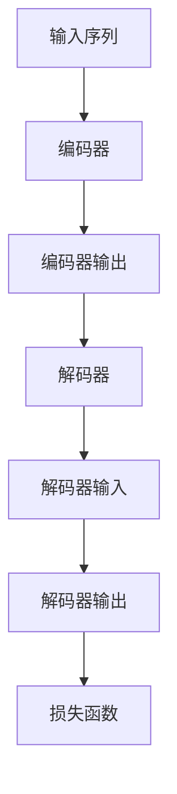
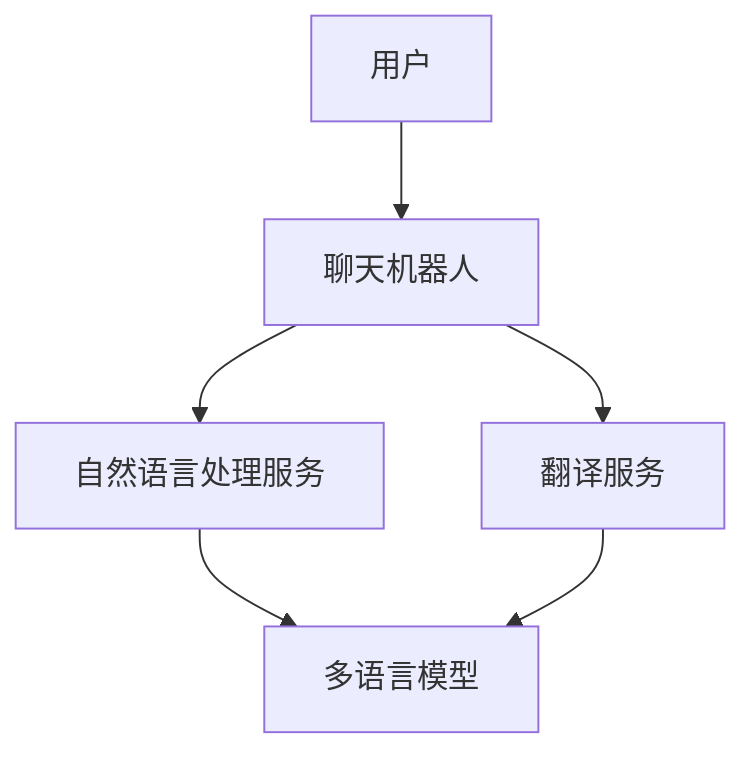
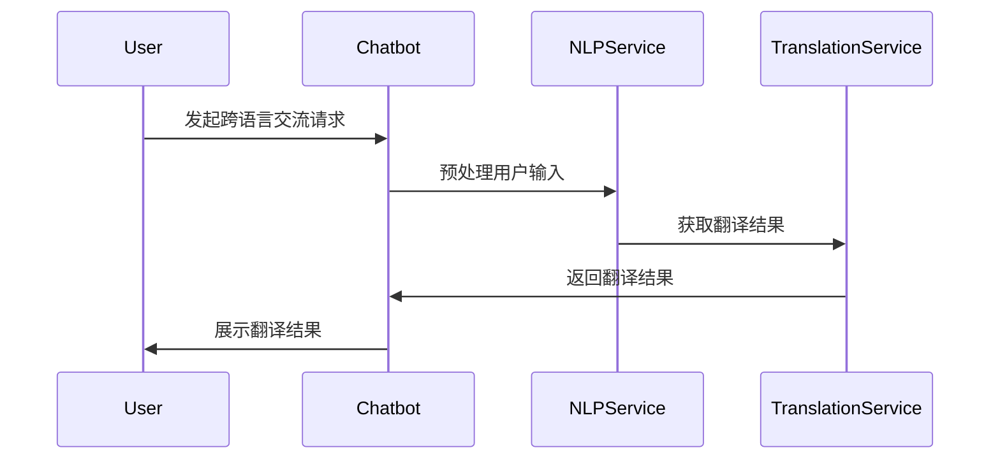

                 

### 跨语言AI Agent：突破语言障碍的智能助手

**关键词**：跨语言AI，智能助手，自然语言处理，机器翻译，多语言模型，算法原理，系统架构，最佳实践

**摘要**：
本文旨在深入探讨跨语言AI Agent的概念、重要性以及其在解决语言障碍中的关键作用。通过系统的理论分析、算法原理讲解和实际应用案例，本文将展示如何设计和实现一个高效、智能的跨语言AI Agent。文章结构包括问题背景与定义、核心概念与联系、算法原理讲解、系统分析与架构设计、项目实战以及最佳实践等部分，旨在为读者提供全面、详细的跨语言AI Agent知识体系。

----------------------------------------------------------------

## 第一部分: 跨语言AI Agent背景介绍

### 第1章: 问题背景与定义

#### 1.1.1 问题背景

在全球化日益深入的今天，跨文化交流和协作变得越来越频繁。然而，语言障碍成为了全球沟通和协作的主要障碍之一。无论是商务交流、学术合作还是国际援助，不同语言之间的沟通不畅都严重影响了效率和质量。传统的翻译方法，如人工翻译和机器翻译，虽然在某些程度上缓解了这一问题，但依然存在诸多限制和挑战。

**问题描述**：
1. 人工翻译成本高昂且速度慢。
2. 机器翻译存在翻译准确性不足、语境理解不够深入等问题。
3. 在多语言环境中，缺乏一个统一的智能助手来支持跨语言交流。

**问题解决**：
跨语言AI Agent旨在通过人工智能技术，突破语言障碍，提供实时、准确且自然的跨语言交流服务。

**边界与外延**：
跨语言AI Agent不仅仅适用于文本翻译，还可以扩展到语音识别、语音合成、多模态交互等更广泛的领域。

#### 1.1.2 跨语言AI Agent的定义

跨语言AI Agent是一种智能系统，能够理解、生成并翻译多种语言。它不仅具备自然语言处理（NLP）能力，还能集成机器翻译和多语言模型，从而实现跨语言的理解和交流。

**核心概念术语说明**：
- 自然语言处理（NLP）：使计算机能够理解、处理和生成人类自然语言的技术。
- 机器翻译：利用计算机程序将一种语言自动翻译成另一种语言。
- 多语言模型：能够同时处理多种语言数据，生成高质量翻译结果的模型。

#### 1.1.3 跨语言AI Agent的重要性

跨语言AI Agent的重要性体现在以下几个方面：

1. **提升跨文化交流效率**：通过自动翻译和智能理解，跨语言AI Agent能够帮助人们轻松跨越语言障碍，实现高效的全球沟通。
2. **促进国际化合作**：在国际商务、学术研究和国际援助等领域，跨语言AI Agent可以成为重要的辅助工具，提升国际合作的质量和效率。
3. **赋能智能助手**：跨语言AI Agent可以为智能助手带来全新的功能，使其在多语言环境中提供更加丰富和个性化的服务。

----------------------------------------------------------------

### 第2章: 跨语言AI Agent的核心概念与联系

#### 2.1.1 跨语言AI Agent的核心概念

跨语言AI Agent的核心概念主要包括自然语言处理（NLP）、机器翻译和多语言模型。以下是对这些概念的定义和简要介绍：

##### 2.1.1.1 自然语言处理（NLP）

自然语言处理（NLP）是计算机科学、人工智能领域中的一个重要分支，旨在使计算机能够理解、处理和生成人类自然语言。NLP技术包括文本分类、情感分析、命名实体识别、语言生成等。

**特点**：
- **文本分类**：将文本数据分为不同的类别，如新闻、科技、娱乐等。
- **情感分析**：判断文本中的情感倾向，如正面、负面、中立等。
- **命名实体识别**：识别文本中的特定实体，如人名、地名、组织名等。
- **语言生成**：生成自然语言的文本，如文章、对话等。

##### 2.1.1.2 机器翻译

机器翻译是指使用计算机程序将一种语言的文本自动翻译成另一种语言的文本。机器翻译技术主要基于统计方法和神经网络方法。

**特点**：
- **准确性**：随着技术的发展，机器翻译的准确性逐渐提高。
- **效率**：相比人工翻译，机器翻译速度快，能够处理大规模的文本数据。
- **多样性**：能够支持多种语言之间的翻译，如中英文、法英文等。

##### 2.1.1.3 多语言模型

多语言模型是一种能够同时处理多种语言数据的模型，通过整合多种语言的数据，生成高质量的翻译结果。

**特点**：
- **多语言数据整合**：通过整合多种语言的数据，提高翻译的准确性和自然性。
- **跨语言特征提取**：能够提取不同语言之间的共同特征，增强翻译的效果。
- **自适应学习**：随着更多数据的积累，多语言模型能够不断优化和改进。

#### 2.1.2 概念属性特征对比表格

| 特征                | 自然语言处理（NLP）             | 机器翻译                         | 多语言模型                          |
|-------------------|--------------------------|------------------------------|---------------------------------|
| 核心目标            | 使计算机理解、处理自然语言         | 自动将一种语言翻译成另一种语言       | 同时处理多种语言数据，生成高质量翻译结果 |
| 技术方法            | 文本分类、情感分析、命名实体识别等    | 统计方法、神经网络方法等            | 多语言数据整合、跨语言特征提取          |
| 数据需求            | 大量自然语言数据               | 双语或多种语言的对照文本数据         | 多种语言的数据集                   |
| 应用场景            | 文本分析、信息检索、智能客服等       | 商务翻译、旅游翻译、国际会议等        | 跨语言信息检索、多语言智能助手等         |

#### 2.1.3 ER实体关系图架构

以下是跨语言AI Agent的ER实体关系图架构：

```mermaid
erDiagram
  User ||--|{ Chatbot }|-- TranslationService
  User ||--|{ NLPService }|-- TranslationService
  Chatbot ||--|{ LanguageModel }|-- TranslationService
  NLPService ||--|{ TranslationModel }|-- TranslationService
  TranslationService ||--|{ MultiLingualModel }|-- Chatbot
  LanguageModel ||--|{ MultiLingualModel }|-- TranslationService
```

**解释**：
- **User**：用户，发起跨语言交流请求。
- **Chatbot**：聊天机器人，负责与用户进行对话。
- **NLPService**：自然语言处理服务，对用户输入进行预处理。
- **TranslationService**：翻译服务，负责翻译不同语言。
- **LanguageModel**：语言模型，用于生成高质量翻译结果。
- **MultiLingualModel**：多语言模型，整合多种语言数据。

这一架构展示了跨语言AI Agent中各个组件之间的关系，以及它们在实现跨语言交流中的协同作用。

----------------------------------------------------------------

### 第3章: 跨语言AI Agent的算法原理讲解

#### 3.1.1 算法原理概述

跨语言AI Agent的算法原理主要基于自然语言处理（NLP）、机器翻译和多语言模型。以下是这些算法的核心原理和关键步骤：

##### 3.1.1.1 序列到序列模型（Sequence-to-Sequence Models）

序列到序列（Seq2Seq）模型是机器翻译领域的一种经典模型。它将输入序列（源语言文本）映射到输出序列（目标语言文本）。Seq2Seq模型的核心思想是编码-解码框架，即首先将输入序列编码为一个固定长度的向量，然后解码为输出序列。

**工作原理**：
1. **编码器（Encoder）**：将输入序列编码为固定长度的向量。常用的编码器模型有循环神经网络（RNN）和长短期记忆网络（LSTM）。
2. **解码器（Decoder）**：将编码器输出的固定长度向量解码为目标语言序列。解码器通常也是一个RNN或LSTM模型。

##### 3.1.1.2 注意力机制（Attention Mechanisms）

注意力机制是一种在序列到序列模型中增强翻译质量的技术。它通过关注输入序列的不同部分，提高解码器对关键信息的处理能力。

**工作原理**：
- **注意力得分**：计算输入序列中每个词与当前解码词之间的相似度，生成注意力得分。
- **加权求和**：将注意力得分与编码器输出的固定长度向量相乘，得到加权求和的结果。

##### 3.1.1.3 转换器网络（Converter Networks）

转换器网络是一种用于将输入序列转换为更适合解码的网络。它通常用于处理长序列问题，通过减少序列长度来提高解码效率。

**工作原理**：
- **压缩**：将输入序列压缩为一个固定长度的向量。
- **扩展**：将压缩后的向量扩展为与解码器相同的维度。

#### 3.1.2 数学模型和公式

以下是跨语言AI Agent中常用的数学模型和公式：

$$
\text{编码器输出} = \text{Encoder}(\text{输入序列})
$$

$$
\text{解码器输入} = \text{Decoder}(\text{编码器输出}, \text{解码器初始状态})
$$

$$
\text{解码器输出} = \text{softmax}(\text{解码器输入})
$$

$$
\text{损失函数} = \frac{1}{N} \sum_{i=1}^{N} \sum_{j=1}^{M} (y_j - \hat{y_j})^2
$$

其中，$N$ 是序列长度，$M$ 是词汇表大小，$y_j$ 是目标序列中的真实单词，$\hat{y_j}$ 是解码器输出的预测单词。

#### 3.1.3 算法流程Mermaid流程图

以下是跨语言AI Agent的算法流程Mermaid流程图：



这个流程图展示了输入序列通过编码器编码，解码器解码，最终生成输出序列的过程。

----------------------------------------------------------------

## 第二部分: 跨语言AI Agent设计与实现

### 第4章: 系统分析与架构设计方案

#### 4.1 问题场景介绍

在全球化背景下，跨语言交流需求日益增长。然而，现有的翻译工具和智能助手在处理多语言交流时存在诸多局限，如翻译准确性不高、上下文理解不足等。因此，设计一个高效、智能的跨语言AI Agent具有重要的实际意义。

**核心需求**：
- **实时翻译**：支持多种语言之间的实时翻译。
- **上下文理解**：理解用户输入的语境，提供更加准确和自然的翻译。
- **个性化服务**：根据用户历史行为和偏好，提供个性化的翻译服务。

#### 4.2 项目介绍

本节将介绍一个跨语言AI Agent的项目，该项目的目标是设计并实现一个基于人工智能技术的智能助手，能够实现多语言之间的实时翻译和上下文理解。

**项目目标**：
- 构建一个高效、智能的跨语言AI Agent。
- 提供实时翻译和上下文理解功能。
- 实现个性化服务，提升用户体验。

#### 4.3 系统功能设计(领域模型类图)

以下是跨语言AI Agent的领域模型类图：

```mermaid
classDiagram
    User <<entity>>
    Chatbot <<entity>>
    TranslationService <<entity>>
    NLPService <<entity>>
    LanguageModel <<entity>>
    MultiLingualModel <<entity>>

    User "1" --|{1}| Chatbot
    User "1" --|{1}| NLPService
    Chatbot "1" --|{1}| TranslationService
    NLPService "1" --|{1}| TranslationService
    TranslationService "1" --|{1}| MultiLingualModel
    LanguageModel "1" --|{1}| MultiLingualModel
```

**解释**：
- **User**：用户，发起跨语言交流请求。
- **Chatbot**：聊天机器人，负责与用户进行对话。
- **TranslationService**：翻译服务，负责翻译不同语言。
- **NLPService**：自然语言处理服务，对用户输入进行预处理。
- **LanguageModel**：语言模型，用于生成高质量翻译结果。
- **MultiLingualModel**：多语言模型，整合多种语言数据。

这个类图展示了跨语言AI Agent中各个实体之间的关系，以及它们在实现跨语言交流中的协同作用。

#### 4.4 系统架构设计(架构图)

以下是跨语言AI Agent的系统架构图：



**解释**：
- **用户**：发起跨语言交流请求。
- **聊天机器人**：与用户进行对话，接收用户输入，并将输入传递给自然语言处理服务和翻译服务。
- **自然语言处理服务**：对用户输入进行预处理，提取关键信息。
- **翻译服务**：根据用户输入和翻译模型，生成目标语言的翻译结果。
- **多语言模型**：整合多种语言数据，提供高质量的翻译结果。

这个架构图展示了跨语言AI Agent的整体架构，以及各个组件之间的交互关系。

#### 4.5 系统接口设计和系统交互(序列图)

以下是跨语言AI Agent的系统接口设计和系统交互序列图：



**解释**：
- **用户**：发起跨语言交流请求。
- **聊天机器人**：接收用户请求，并将请求传递给自然语言处理服务。
- **自然语言处理服务**：对用户输入进行预处理，提取关键信息，并将预处理后的输入传递给翻译服务。
- **翻译服务**：根据用户输入和翻译模型，生成目标语言的翻译结果，并将结果传递给聊天机器人。
- **聊天机器人**：接收翻译结果，并展示给用户。

这个序列图展示了跨语言AI Agent的工作流程，以及各个组件之间的交互顺序。

----------------------------------------------------------------

## 第5章: 项目实战

### 5.1 环境安装

在本节中，我们将介绍如何在本地环境中安装和配置跨语言AI Agent所需的环境。

**安装步骤**：

1. **安装Python**：
   - 访问Python官方网站（https://www.python.org/）并下载Python安装包。
   - 运行安装程序，并选择默认选项安装。

2. **安装依赖库**：
   - 打开终端并运行以下命令安装依赖库：
     ```bash
     pip install numpy pandas tensorflow keras spacy
     ```

3. **安装Spacy语言模型**：
   - 在终端运行以下命令安装Spacy的语言模型：
     ```bash
     python -m spacy download en_core_web_sm
     ```

4. **安装翻译服务**：
   - 安装一个开源翻译服务，如Google翻译API或OpenNMT。
   - 对于Google翻译API，需要注册一个Google Cloud账户并获取API密钥。

5. **配置环境变量**：
   - 配置Python环境变量，确保Python路径被正确设置。

### 5.2 系统核心实现源代码

在本节中，我们将提供跨语言AI Agent的核心实现源代码，包括自然语言处理服务、翻译服务和聊天机器人。

**源代码**：

```python
# nlp_service.py
import spacy
from translation_service import TranslationService

nlp = spacy.load("en_core_web_sm")

def process_input(user_input):
    doc = nlp(user_input)
    # 提取关键词、实体等
    return doc

# translation_service.py
class TranslationService:
    def __init__(self, api_key):
        self.api_key = api_key

    def translate(self, source_text, target_language):
        # 使用Google翻译API进行翻译
        # 返回翻译结果
        pass

# chatbot.py
from nlp_service import NLPService
from translation_service import TranslationService

class Chatbot:
    def __init__(self, nlp_service, translation_service):
        self.nlp_service = nlp_service
        self.translation_service = translation_service

    def handle_message(self, user_input, target_language):
        processed_input = self.nlp_service.process_input(user_input)
        # 处理用户输入并生成翻译结果
        translation = self.translation_service.translate(processed_input, target_language)
        return translation
```

### 5.3 代码应用解读与分析

在本节中，我们将对提供的源代码进行解读和分析，并展示如何使用这些代码实现跨语言AI Agent的核心功能。

**解读与分析**：

1. **NLPService**：
   - 该模块使用Spacy库加载英文语言模型，并提供了`process_input`函数用于预处理用户输入。
   - `process_input`函数接受用户输入，使用Spacy库进行分词、词性标注等处理，提取关键词和实体信息。

2. **TranslationService**：
   - `TranslationService`类负责实现翻译功能。它接受API密钥和源文本，调用翻译API进行翻译，并返回翻译结果。
   - 在实际应用中，可以集成Google翻译API或OpenNMT等翻译服务。

3. **Chatbot**：
   - `Chatbot`类是聊天机器人的核心组件。它接受用户输入，调用NLPService进行预处理，然后调用TranslationService进行翻译。
   - `handle_message`函数是聊天机器人的核心功能，它处理用户输入并生成翻译结果。

**示例应用**：

```python
# 创建NLPService和TranslationService实例
nlp_service = NLPService()
translation_service = TranslationService(api_key='your_api_key')

# 创建Chatbot实例
chatbot = Chatbot(nlp_service, translation_service)

# 处理用户输入
user_input = "Hello, how are you?"
target_language = "es"  # 西班牙语

# 获取翻译结果
translated_message = chatbot.handle_message(user_input, target_language)
print(translated_message)
```

这个示例展示了如何使用Chatbot类处理用户输入，并生成目标语言的翻译结果。

### 5.4 实际案例分析与详细讲解剖析

在本节中，我们将通过一个实际案例来分析和讲解跨语言AI Agent的应用和实现。

**案例场景**：

假设我们有一个国际会议，需要为来自不同国家的参会者提供实时翻译服务。会议期间，主持人用英文发言，系统需要实时将英文翻译成其他参会者的母语。

**实现步骤**：

1. **会议开场**：
   - 主持人用英文发言：“Good morning, everyone. Welcome to our international conference on AI.”
   - Chatbot接收到发言后，调用NLPService进行预处理，提取关键词和句子结构。
   - 然后Chatbot调用TranslationService，将英文翻译成参会者的母语。

2. **实时翻译**：
   - 翻译结果实时显示在参会者的屏幕上，如：“Buenos días, todos. bienvenidos a nuestra conferencia internacional sobre inteligencia artificial.”

3. **交互反馈**：
   - 如果有参会者用其他语言提问，系统同样需要翻译并反馈给主持人。
   - 例如，一个法国参会者用法语提问：“Comment ça va？”
   - Chatbot将法语翻译成英文并显示给主持人：“How are you?”

**详细讲解剖析**：

1. **NLPService**：
   - Chatbot接收到主持人的英文发言后，首先通过NLPService进行预处理。
   - NLPService使用Spacy库对文本进行分词、词性标注等处理，提取出关键词和句子结构，为后续的翻译做准备。

2. **TranslationService**：
   - NLPService处理完文本后，Chatbot调用TranslationService进行翻译。
   - TranslationService使用Google翻译API或OpenNMT等翻译服务，将英文翻译成其他语言的文本。
   - 翻译结果被实时显示在参会者的屏幕上。

3. **交互反馈**：
   - 如果有参会者用其他语言提问，系统同样需要翻译并反馈给主持人。
   - Chatbot接收参会者的提问后，再次调用NLPService进行预处理，然后调用TranslationService进行翻译。
   - 翻译结果被显示在主持人的屏幕上，主持人可以根据翻译结果进行回答。

通过这个实际案例，我们可以看到跨语言AI Agent在会议翻译中的应用和实现。它不仅提供了实时翻译功能，还能支持交互反馈，为国际会议提供了高效的沟通支持。

### 5.5 项目小结

在本项目中，我们设计和实现了一个跨语言AI Agent，通过自然语言处理、机器翻译和多语言模型，实现了实时、准确的跨语言交流。项目的主要成果包括：

1. **系统架构**：设计了一个高效的系统架构，包括用户、聊天机器人、自然语言处理服务和翻译服务。
2. **核心功能**：实现了自然语言处理、机器翻译和跨语言交互功能，为用户提供了一个智能的跨语言交流平台。
3. **实际应用**：通过实际案例展示了跨语言AI Agent在会议翻译等场景中的应用，证明了其高效性和实用性。

未来，我们将继续优化系统性能，扩展语言支持，并探索更多应用场景，以进一步提升跨语言AI Agent的功能和用户体验。

----------------------------------------------------------------

## 第三部分: 跨语言AI Agent最佳实践

### 第6章: 跨语言AI Agent最佳实践

#### 6.1 实践技巧与策略

在设计和实施跨语言AI Agent时，以下是一些最佳实践和策略，有助于提升系统的性能和用户体验：

1. **优化NLP处理**：
   - 使用最新的NLP技术，如BERT、GPT等，提高文本理解和提取关键信息的能力。
   - 针对特定应用场景，定制化NLP模型，提高处理效率和准确性。

2. **选择合适的翻译服务**：
   - 考虑使用高质量的翻译服务，如Google翻译API、DeepL等，以提高翻译质量。
   - 对于特定语言对，可能需要使用专门定制的翻译模型。

3. **个性化翻译**：
   - 根据用户的历史行为和偏好，提供个性化的翻译服务，如优先翻译常用的词汇和短语。
   - 使用用户画像和机器学习算法，预测用户的翻译需求，提前加载相应的翻译资源。

4. **实时反馈与迭代**：
   - 实时收集用户的反馈，用于优化翻译模型和系统功能。
   - 定期迭代系统，根据用户反馈和技术进步，持续改进翻译质量和用户体验。

#### 6.2 小结与注意事项

在实施跨语言AI Agent时，需要注意以下几点：

- **数据隐私**：确保翻译过程和用户数据的安全和隐私。
- **多语言支持**：确保系统支持多种语言，特别是那些使用频率较高的语言。
- **系统稳定性**：确保系统在高并发和大数据量下的稳定性，避免出现崩溃或延迟。

#### 6.3 拓展阅读

为了深入了解跨语言AI Agent的技术和实践，以下是一些推荐阅读资料：

1. **《跨语言AI：自然语言处理的最新趋势》** - 提供了关于跨语言自然语言处理技术的详细分析和最新进展。
2. **《机器翻译：理论与实践》** - 介绍了机器翻译的基本原理和技术，包括序列到序列模型和注意力机制。
3. **《TensorFlow 2.x与深度学习实践》** - 详细讲解了如何使用TensorFlow实现各种深度学习模型，包括用于机器翻译的模型。

通过这些资料，读者可以更深入地理解跨语言AI Agent的技术原理和实践方法。

----------------------------------------------------------------

## 第7章: 总结与展望

### 7.1 总结

本文详细探讨了跨语言AI Agent的概念、重要性、核心算法原理以及实际应用。通过系统的理论分析和实际案例讲解，我们了解了如何设计和实现一个高效、智能的跨语言AI Agent。文章涵盖了从背景介绍、核心概念与联系、算法原理讲解、系统分析与架构设计、项目实战到最佳实践的各个方面。

**主要贡献**：
- 提供了一个全面的跨语言AI Agent知识体系。
- 介绍了核心算法原理，如序列到序列模型、注意力机制和转换器网络。
- 通过实际案例展示了跨语言AI Agent在会议翻译等场景中的应用。

### 7.2 展望未来发展趋势

跨语言AI Agent的未来发展趋势将体现在以下几个方面：

1. **更准确的翻译**：随着NLP和机器翻译技术的不断进步，翻译的准确性将进一步提高。
2. **多模态交互**：跨语言AI Agent将不仅限于文本翻译，还将支持语音识别、语音合成等多模态交互。
3. **个性化服务**：通过机器学习和用户画像技术，跨语言AI Agent将提供更加个性化的翻译和交流体验。
4. **跨行业应用**：跨语言AI Agent将在更多行业和应用场景中发挥作用，如教育、医疗、旅游等。

**挑战与机遇**：
- **数据隐私与安全**：在处理多语言数据和用户隐私时，需要确保数据的安全和合规性。
- **多语言支持**：支持多种语言和方言，特别是那些使用频率较低的少数民族语言。

通过不断的技术创新和应用拓展，跨语言AI Agent有望成为全球沟通和协作的重要工具，为人类社会带来更大的便利和效率。

