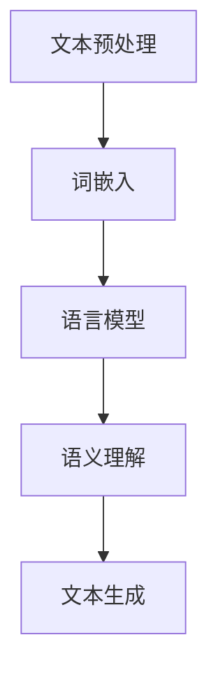

                 

### 文章标题：跨语言投资理财智能助手的开发策略

#### 关键词：跨语言智能助手，投资理财，自然语言处理，机器学习，深度学习，系统架构设计

#### 摘要：
随着全球化的发展，跨语言投资理财智能助手成为了金融科技领域的新宠。本文旨在探讨跨语言投资理财智能助手的开发策略，从技术基础、开发实践到实战案例进行全面解析。通过深入分析自然语言处理、机器学习和深度学习等关键技术，以及系统架构设计与实现，本文为开发者提供了清晰、系统的开发指导，旨在推动跨语言投资理财智能助手在金融市场中的应用和发展。

## 第一部分：跨语言投资理财智能助手概述

### 第1章：跨语言投资理财智能助手的概念与意义

#### 1.1 跨语言投资理财智能助手的定义

跨语言投资理财智能助手是一种能够处理多语言输入，提供投资理财建议的智能系统。它结合了自然语言处理、机器学习和深度学习技术，通过对大量多语言金融数据的学习和分析，生成个性化的投资理财建议，帮助用户在全球范围内的投资市场中做出更明智的决策。

#### 1.2 智能助手在投资理财中的作用

智能助手在投资理财中的作用主要体现在以下几个方面：

1. **个性化建议**：通过分析用户的投资偏好、风险承受能力和投资目标，提供个性化的投资建议，帮助用户更好地实现投资目标。

2. **多语言支持**：智能助手能够处理多种语言输入，打破了地域和语言的限制，使得全球范围内的投资者都能享受到智能投资理财服务。

3. **实时数据监控**：智能助手可以实时监控市场动态，为用户提供最新的投资信息，帮助用户及时调整投资策略。

4. **风险预警**：智能助手通过对市场数据的分析，能够提前预测潜在的风险，为用户发出预警，帮助用户规避投资风险。

#### 1.3 跨语言智能助手的重要性

跨语言智能助手在投资理财中的重要性主要体现在以下几个方面：

1. **全球化趋势**：随着全球化的发展，越来越多的投资者参与国际市场，跨语言投资理财智能助手能够满足这些投资者的需求，提高市场的包容性和竞争力。

2. **技术进步**：自然语言处理、机器学习和深度学习技术的不断进步，使得跨语言投资理财智能助手在准确性和性能方面得到了显著提升。

3. **用户体验**：跨语言智能助手能够提供更加便捷、高效的服务，提高用户的投资理财体验，增强用户对金融服务的满意度。

#### 1.4 跨语言智能助手的发展历程

跨语言投资理财智能助手的发展历程可以分为以下几个阶段：

1. **初步探索阶段**：20世纪90年代，随着互联网的兴起，跨语言投资理财智能助手的概念开始萌芽。

2. **技术积累阶段**：21世纪初，自然语言处理、机器学习和深度学习技术的发展为跨语言智能助手提供了强大的技术支持。

3. **商业化应用阶段**：近年来，随着人工智能技术的成熟和应用的普及，跨语言投资理财智能助手开始在金融领域得到广泛应用。

### 第2章：投资理财市场现状与挑战

#### 2.1 全球投资理财市场概述

全球投资理财市场呈现出多元化、复杂化的趋势，投资者数量持续增长，投资产品种类日益丰富。主要市场包括美国、欧洲、亚洲等地区，其中，美国的金融市场规模最大，最具代表性。

#### 2.2 市场面临的主要挑战

投资理财市场面临的主要挑战包括：

1. **信息不对称**：投资者获取信息的能力存在差异，导致投资决策的不确定性。

2. **语言障碍**：不同地区的投资者使用的语言不同，增加了信息传递和理解的难度。

3. **市场波动**：全球金融市场波动性增加，投资者面临更高的风险。

4. **监管环境**：不同地区的监管政策不同，给跨国投资带来了法律风险。

#### 2.3 机遇与趋势分析

投资理财市场的机遇与趋势包括：

1. **数字化转型**：金融科技的发展为投资理财带来了新的机遇，智能投资理财助手的普及有望提高市场效率。

2. **多语言支持**：跨语言智能助手的崛起，使得投资者能够更加便捷地获取全球范围内的投资信息。

3. **个性化服务**：随着大数据和人工智能技术的应用，个性化投资理财服务将成为市场的新趋势。

### 第3章：跨语言智能助手的开发策略

#### 3.1 技术路线选择

开发跨语言投资理财智能助手的技术路线主要包括：

1. **自然语言处理（NLP）**：用于处理多语言输入，实现文本理解和分析。

2. **机器学习（ML）**：用于训练模型，提高智能助手的预测和决策能力。

3. **深度学习（DL）**：用于构建复杂的神经网络模型，实现更高层次的智能。

#### 3.2 数据处理与算法选择

1. **数据处理**：包括数据清洗、数据整合和数据预处理等步骤，确保数据质量和可用性。

2. **算法选择**：根据业务需求，选择合适的机器学习和深度学习算法，如决策树、随机森林、神经网络等。

#### 3.3 多语言支持与翻译准确性

1. **多语言支持**：实现多语言输入和输出，支持多种语言的投资理财服务。

2. **翻译准确性**：提高翻译模型的准确性，确保智能助手能够准确理解不同语言的输入。

#### 3.4 用户体验与个性化定制

1. **用户体验**：优化用户界面，提供简洁、直观的操作体验。

2. **个性化定制**：根据用户需求和偏好，提供个性化的投资理财建议。

## 第二部分：技术基础

### 第4章：自然语言处理（NLP）基础

#### 4.1 NLP的基本概念

自然语言处理（NLP）是人工智能（AI）的一个分支，旨在使计算机能够理解、解释和生成人类语言。NLP的关键技术包括：

1. **文本预处理**：包括分词、词性标注、词干提取等。

2. **语言模型**：用于预测文本中的下一个单词或词组，如n-gram模型和神经网络模型。

3. **语义理解**：包括语义角色标注、实体识别、情感分析等。

#### 4.2 文本预处理技术

文本预处理是NLP的关键步骤，主要包括：

1. **分词**：将连续的文本切分成有意义的单词或短语。

2. **词性标注**：为文本中的每个单词标注其词性，如名词、动词、形容词等。

3. **词干提取**：将单词转换为其最简单的形式，如将"running"转换为"run"。

#### 4.3 词嵌入与语言模型

1. **词嵌入**：将单词映射到高维向量空间，用于文本的向量表示。

2. **语言模型**：用于预测文本中的下一个单词或词组，如n-gram模型和神经网络模型。

### 第5章：机器学习与深度学习算法

#### 5.1 机器学习基础

机器学习（ML）是使计算机能够通过数据学习规律和模式的技术，主要包括：

1. **监督学习**：通过标记数据训练模型，如线性回归、决策树、支持向量机等。

2. **无监督学习**：无需标记数据，通过发现数据中的结构和模式，如聚类、降维等。

3. **强化学习**：通过奖励机制训练模型，使其在复杂环境中做出最优决策。

#### 5.2 深度学习核心算法

深度学习（DL）是机器学习的一个分支，通过多层神经网络模拟人类大脑的思维方式，主要包括：

1. **卷积神经网络（CNN）**：用于图像识别和图像处理。

2. **循环神经网络（RNN）**：用于序列数据的处理，如自然语言处理和时间序列预测。

3. **生成对抗网络（GAN）**：用于生成高质量的图像和数据。

#### 5.3 应用在投资理财的案例分析

1. **股票预测**：利用深度学习模型预测股票价格趋势，帮助投资者做出投资决策。

2. **风险控制**：通过机器学习算法评估投资风险，为投资者提供风险预警。

### 第6章：多语言支持与翻译技术

#### 6.1 多语言翻译的基本原理

多语言翻译技术是跨语言投资理财智能助手的核心，主要包括：

1. **翻译模型**：用于将源语言的文本转换为目标语言的文本。

2. **翻译评估**：用于评估翻译质量，如BLEU评分、NIST评分等。

3. **翻译优化**：通过优化翻译模型和算法，提高翻译准确性。

#### 6.2 机器翻译系统架构

机器翻译系统架构主要包括：

1. **编码器**：将源语言文本转换为向量表示。

2. **解码器**：将目标语言文本的向量表示转换为翻译结果。

3. **注意力机制**：用于提高翻译的准确性，使模型能够更好地关注源语言和目标语言之间的对应关系。

#### 6.3 翻译准确性与质量评估

1. **翻译准确性**：通过评估翻译结果的准确性和流畅性，如BLEU评分等。

2. **质量评估**：通过用户反馈和人工评估，对翻译质量进行综合评价。

## 第三部分：智能助手开发与实践

### 第7章：数据收集与处理

#### 7.1 投资理财数据来源

投资理财数据来源主要包括：

1. **公开数据**：如股市行情、经济数据、财经新闻等。

2. **私有数据**：如用户的投资记录、风险偏好、投资目标等。

3. **社交媒体**：如Twitter、Facebook等社交媒体平台上的财经相关内容。

#### 7.2 数据预处理流程

数据预处理流程主要包括：

1. **数据清洗**：去除无效数据、纠正错误数据等。

2. **数据整合**：将不同来源的数据进行整合，形成统一的数据集。

3. **特征提取**：从原始数据中提取对投资理财有价值的特征。

#### 7.3 数据质量控制与优化

1. **数据质量检查**：通过数据清洗和预处理，确保数据质量和完整性。

2. **数据优化**：通过特征选择和特征工程，提高数据的质量和有效性。

### 第8章：智能助手核心功能实现

#### 8.1 投资建议生成

1. **投资策略分析**：通过分析用户的历史投资记录和风险偏好，为用户生成个性化的投资策略。

2. **市场趋势预测**：利用机器学习和深度学习模型，预测市场趋势，为用户提供建议。

#### 8.2 风险评估与预警

1. **风险评估**：通过分析市场数据，评估投资项目的风险水平。

2. **风险预警**：当风险达到预设阈值时，向用户发出预警，帮助用户规避风险。

#### 8.3 多语言交流与支持

1. **多语言输入**：支持多种语言的输入，使全球范围内的投资者都能使用智能助手。

2. **多语言输出**：为用户提供多语言的投资建议和交流支持。

### 第9章：系统架构设计与实现

#### 9.1 系统架构概述

系统架构主要包括：

1. **前端**：提供用户界面，支持多语言交互。

2. **后端**：包括数据处理模块、机器学习模块、翻译模块等。

3. **数据库**：存储用户数据、市场数据和投资建议等。

#### 9.2 模块划分与功能

1. **数据处理模块**：负责数据的收集、清洗、整合和预处理。

2. **机器学习模块**：负责训练和部署机器学习模型，生成投资建议。

3. **翻译模块**：负责实现多语言翻译功能，提高用户体验。

#### 9.3 系统性能优化与测试

1. **性能优化**：通过优化算法和系统架构，提高系统性能和响应速度。

2. **测试**：对系统进行全面的测试，确保系统的稳定性和可靠性。

### 第10章：智能助手部署与优化

#### 10.1 云计算与容器化技术

1. **云计算**：利用云计算平台，实现智能助手的弹性扩展和高效部署。

2. **容器化技术**：通过容器化技术，提高系统的可移植性和部署效率。

#### 10.2 性能监控与日志分析

1. **性能监控**：实时监控系统的性能指标，及时发现和解决问题。

2. **日志分析**：通过分析系统日志，了解系统运行状况和用户行为，优化系统性能。

#### 10.3 用户体验与反馈机制

1. **用户体验**：优化用户界面和交互流程，提高用户满意度。

2. **反馈机制**：建立用户反馈机制，及时收集用户意见，不断改进智能助手的功能和性能。

## 第四部分：实战案例与最佳实践

### 第11章：实战案例介绍

#### 11.1 案例一：某金融机构的跨语言投资理财智能助手

1. **项目背景**：介绍金融机构的需求和智能助手的实现目标。

2. **系统架构**：展示智能助手的系统架构和关键技术。

3. **功能实现**：详细讲解智能助手的投资建议生成、风险评估和翻译功能。

#### 11.2 案例二：国际投资理财平台的智能助手应用

1. **项目介绍**：介绍国际投资理财平台的需求和智能助手的应用场景。

2. **系统设计**：展示智能助手的系统架构和模块划分。

3. **功能实现**：详细讲解智能助手的投资建议生成、风险控制和多语言支持。

#### 11.3 案例三：跨语言智能理财助手在社交媒体上的应用

1. **应用背景**：介绍跨语言智能理财助手在社交媒体平台上的应用场景。

2. **系统架构**：展示智能助手的系统架构和关键技术。

3. **功能实现**：详细讲解智能助手的投资建议生成、风险监控和社交互动。

### 第12章：最佳实践与经验分享

#### 12.1 数据隐私与安全

1. **数据隐私**：介绍如何保护用户数据的隐私，遵循相关法律法规。

2. **数据安全**：介绍如何防范数据泄露和攻击，确保数据安全。

#### 12.2 算法透明性与可解释性

1. **算法透明性**：介绍如何提高算法的透明性，方便用户理解和使用。

2. **可解释性**：介绍如何解释算法的决策过程，提高算法的可解释性。

#### 12.3 用户体验优化

1. **用户体验**：介绍如何优化用户界面和交互流程，提高用户体验。

2. **用户反馈**：介绍如何收集用户反馈，不断改进智能助手的功能和性能。

## 第13章：小结与展望

#### 13.1 本书总结

1. **核心内容**：回顾本书的核心内容和主要观点。

2. **技术贡献**：总结本书在跨语言投资理财智能助手开发方面的技术贡献。

#### 13.2 未来发展趋势

1. **技术进步**：探讨未来跨语言投资理财智能助手可能采用的新技术和新算法。

2. **应用前景**：展望跨语言投资理财智能助手在金融市场中的应用前景。

#### 13.3 读者建议

1. **学习方法**：为读者提供学习跨语言投资理财智能助手开发的方法和建议。

2. **实践指导**：为开发者提供实践跨语言投资理财智能助手开发的具体指导。

---

以上是《跨语言投资理财智能助手的开发策略》一书的完整目录大纲，它涵盖了从概述到技术基础，从开发实践到实战案例的全方位内容，旨在为读者提供一个清晰、系统的开发指导。每个章节都包含了丰富的背景介绍、核心概念与联系、算法原理讲解、系统分析与架构设计方案、项目实战和最佳实践等内容。希望这个目录大纲能够满足您的需求。如果需要进一步的调整或细化，请告知。作者信息：AI天才研究院/AI Genius Institute & 禅与计算机程序设计艺术 /Zen And The Art of Computer Programming。### 文章标题：跨语言投资理财智能助手的开发策略

#### 关键词：跨语言智能助手，投资理财，自然语言处理，机器学习，深度学习，系统架构设计

#### 摘要：
随着全球化的发展，跨语言投资理财智能助手成为了金融科技领域的新宠。本文旨在探讨跨语言投资理财智能助手的开发策略，从技术基础、开发实践到实战案例进行全面解析。通过深入分析自然语言处理、机器学习和深度学习等关键技术，以及系统架构设计与实现，本文为开发者提供了清晰、系统的开发指导，旨在推动跨语言投资理财智能助手在金融市场中的应用和发展。

---

## 引言

在全球化的今天，投资理财市场的复杂性日益增加，投资者面临的信息量和语言障碍也越来越大。跨语言投资理财智能助手作为一种新兴的技术解决方案，能够帮助用户克服语言障碍，提供个性化、实时和专业的投资理财建议。本文将围绕跨语言投资理财智能助手的开发策略进行详细探讨，包括其技术基础、开发实践和实战案例，旨在为开发者提供一套系统、实用的开发指南。

## 第一部分：跨语言投资理财智能助手概述

### 第1章：跨语言投资理财智能助手的概念与意义

#### 1.1 跨语言投资理财智能助手的定义

跨语言投资理财智能助手是一种结合自然语言处理、机器学习和深度学习技术，能够处理多语言输入，为用户提供个性化投资理财建议的智能系统。其主要功能包括：

1. **多语言输入与输出**：支持多种语言的输入和输出，使得全球范围内的投资者都能使用。
2. **个性化投资建议**：基于用户的历史数据和投资偏好，为用户生成个性化的投资理财建议。
3. **实时数据监控**：实时监控市场动态，为用户提供最新的投资信息和风险预警。

#### 1.2 智能助手在投资理财中的作用

跨语言投资理财智能助手在投资理财中发挥着重要作用：

1. **信息获取与处理**：智能助手能够处理大量多语言投资信息，帮助用户快速获取和理解重要信息。
2. **个性化服务**：根据用户的历史数据和投资偏好，为用户定制化投资建议，提高投资效率。
3. **风险控制**：通过对市场数据的分析，为用户提供风险预警，帮助用户规避潜在风险。

#### 1.3 跨语言智能助手的重要性

跨语言智能助手的重要性体现在以下几个方面：

1. **全球化需求**：随着全球投资市场的扩大，跨语言智能助手能够满足不同地区投资者的需求。
2. **技术进步**：自然语言处理、机器学习和深度学习技术的快速发展，为跨语言智能助手提供了强大的技术支持。
3. **用户体验**：跨语言智能助手能够提供便捷、高效的服务，提升用户的投资理财体验。

#### 1.4 跨语言智能助手的发展历程

跨语言智能助手的发展历程可以分为以下几个阶段：

1. **初步探索阶段**：20世纪90年代，随着互联网的兴起，跨语言智能助手的概念开始萌芽。
2. **技术积累阶段**：21世纪初，自然语言处理、机器学习和深度学习技术的发展为跨语言智能助手提供了强大支持。
3. **商业化应用阶段**：近年来，随着人工智能技术的成熟和应用的普及，跨语言智能助手在金融领域得到广泛应用。

### 第2章：投资理财市场现状与挑战

#### 2.1 全球投资理财市场概述

全球投资理财市场呈现出多元化、复杂化的趋势。主要市场包括美国、欧洲、亚洲等地区，其中，美国的金融市场规模最大，最具代表性。

#### 2.2 市场面临的主要挑战

投资理财市场面临的主要挑战包括：

1. **信息不对称**：投资者获取信息的能力存在差异，导致投资决策的不确定性。
2. **语言障碍**：不同地区的投资者使用的语言不同，增加了信息传递和理解的难度。
3. **市场波动**：全球金融市场波动性增加，投资者面临更高的风险。
4. **监管环境**：不同地区的监管政策不同，给跨国投资带来了法律风险。

#### 2.3 机遇与趋势分析

投资理财市场的机遇与趋势包括：

1. **数字化转型**：金融科技的发展为投资理财带来了新的机遇。
2. **多语言支持**：跨语言智能助手能够满足全球投资者的需求，提高市场包容性。
3. **个性化服务**：随着大数据和人工智能技术的应用，个性化投资理财服务将成为市场的新趋势。

### 第3章：跨语言智能助手的开发策略

#### 3.1 技术路线选择

开发跨语言投资理财智能助手的技术路线主要包括：

1. **自然语言处理（NLP）**：用于处理多语言输入，实现文本理解和分析。
2. **机器学习（ML）**：用于训练模型，提高智能助手的预测和决策能力。
3. **深度学习（DL）**：用于构建复杂的神经网络模型，实现更高层次的智能。

#### 3.2 数据处理与算法选择

1. **数据处理**：包括数据清洗、数据整合和数据预处理等步骤，确保数据质量和可用性。
2. **算法选择**：根据业务需求，选择合适的机器学习和深度学习算法，如决策树、随机森林、神经网络等。

#### 3.3 多语言支持与翻译准确性

1. **多语言支持**：实现多语言输入和输出，支持多种语言的投资理财服务。
2. **翻译准确性**：提高翻译模型的准确性，确保智能助手能够准确理解不同语言的输入。

#### 3.4 用户体验与个性化定制

1. **用户体验**：优化用户界面，提供简洁、直观的操作体验。
2. **个性化定制**：根据用户需求和偏好，提供个性化的投资理财建议。

## 第二部分：技术基础

### 第4章：自然语言处理（NLP）基础

#### 4.1 NLP的基本概念

自然语言处理（NLP）是人工智能（AI）的一个分支，旨在使计算机能够理解、解释和生成人类语言。NLP的关键技术包括：

1. **文本预处理**：包括分词、词性标注、词干提取等。
2. **语言模型**：用于预测文本中的下一个单词或词组，如n-gram模型和神经网络模型。
3. **语义理解**：包括语义角色标注、实体识别、情感分析等。

#### 4.2 文本预处理技术

文本预处理是NLP的关键步骤，主要包括：

1. **分词**：将连续的文本切分成有意义的单词或短语。
2. **词性标注**：为文本中的每个单词标注其词性，如名词、动词、形容词等。
3. **词干提取**：将单词转换为其最简单的形式，如将"running"转换为"run"。

#### 4.3 词嵌入与语言模型

1. **词嵌入**：将单词映射到高维向量空间，用于文本的向量表示。
2. **语言模型**：用于预测文本中的下一个单词或词组，如n-gram模型和神经网络模型。

### 第5章：机器学习与深度学习算法

#### 5.1 机器学习基础

机器学习（ML）是使计算机能够通过数据学习规律和模式的技术，主要包括：

1. **监督学习**：通过标记数据训练模型，如线性回归、决策树、支持向量机等。
2. **无监督学习**：无需标记数据，通过发现数据中的结构和模式，如聚类、降维等。
3. **强化学习**：通过奖励机制训练模型，使其在复杂环境中做出最优决策。

#### 5.2 深度学习核心算法

深度学习（DL）是机器学习的一个分支，通过多层神经网络模拟人类大脑的思维方式，主要包括：

1. **卷积神经网络（CNN）**：用于图像识别和图像处理。
2. **循环神经网络（RNN）**：用于序列数据的处理，如自然语言处理和时间序列预测。
3. **生成对抗网络（GAN）**：用于生成高质量的图像和数据。

#### 5.3 应用在投资理财的案例分析

1. **股票预测**：利用深度学习模型预测股票价格趋势，帮助投资者做出投资决策。
2. **风险控制**：通过机器学习算法评估投资风险，为投资者提供风险预警。

### 第6章：多语言支持与翻译技术

#### 6.1 多语言翻译的基本原理

多语言翻译技术是跨语言投资理财智能助手的核心，主要包括：

1. **翻译模型**：用于将源语言的文本转换为目标语言的文本。
2. **翻译评估**：用于评估翻译质量，如BLEU评分、NIST评分等。
3. **翻译优化**：通过优化翻译模型和算法，提高翻译准确性。

#### 6.2 机器翻译系统架构

机器翻译系统架构主要包括：

1. **编码器**：将源语言文本转换为向量表示。
2. **解码器**：将目标语言文本的向量表示转换为翻译结果。
3. **注意力机制**：用于提高翻译的准确性，使模型能够更好地关注源语言和目标语言之间的对应关系。

#### 6.3 翻译准确性与质量评估

1. **翻译准确性**：通过评估翻译结果的准确性和流畅性，如BLEU评分等。
2. **质量评估**：通过用户反馈和人工评估，对翻译质量进行综合评价。

## 第三部分：智能助手开发与实践

### 第7章：数据收集与处理

#### 7.1 投资理财数据来源

投资理财数据来源主要包括：

1. **公开数据**：如股市行情、经济数据、财经新闻等。
2. **私有数据**：如用户的投资记录、风险偏好、投资目标等。
3. **社交媒体**：如Twitter、Facebook等社交媒体平台上的财经相关内容。

#### 7.2 数据预处理流程

数据预处理流程主要包括：

1. **数据清洗**：去除无效数据、纠正错误数据等。
2. **数据整合**：将不同来源的数据进行整合，形成统一的数据集。
3. **特征提取**：从原始数据中提取对投资理财有价值的特征。

#### 7.3 数据质量控制与优化

1. **数据质量检查**：通过数据清洗和预处理，确保数据质量和完整性。
2. **数据优化**：通过特征选择和特征工程，提高数据的质量和有效性。

### 第8章：智能助手核心功能实现

#### 8.1 投资建议生成

1. **投资策略分析**：通过分析用户的历史投资记录和风险偏好，为用户生成个性化的投资策略。
2. **市场趋势预测**：利用机器学习和深度学习模型，预测市场趋势，为用户提供建议。

#### 8.2 风险评估与预警

1. **风险评估**：通过分析市场数据，评估投资项目的风险水平。
2. **风险预警**：当风险达到预设阈值时，向用户发出预警，帮助用户规避风险。

#### 8.3 多语言交流与支持

1. **多语言输入**：支持多种语言的输入，使全球范围内的投资者都能使用智能助手。
2. **多语言输出**：为用户提供多语言的投资建议和交流支持。

### 第9章：系统架构设计与实现

#### 9.1 系统架构概述

系统架构主要包括：

1. **前端**：提供用户界面，支持多语言交互。
2. **后端**：包括数据处理模块、机器学习模块、翻译模块等。
3. **数据库**：存储用户数据、市场数据和投资建议等。

#### 9.2 模块划分与功能

1. **数据处理模块**：负责数据的收集、清洗、整合和预处理。
2. **机器学习模块**：负责训练和部署机器学习模型，生成投资建议。
3. **翻译模块**：负责实现多语言翻译功能，提高用户体验。

#### 9.3 系统性能优化与测试

1. **性能优化**：通过优化算法和系统架构，提高系统性能和响应速度。
2. **测试**：对系统进行全面的测试，确保系统的稳定性和可靠性。

### 第10章：智能助手部署与优化

#### 10.1 云计算与容器化技术

1. **云计算**：利用云计算平台，实现智能助手的弹性扩展和高效部署。
2. **容器化技术**：通过容器化技术，提高系统的可移植性和部署效率。

#### 10.2 性能监控与日志分析

1. **性能监控**：实时监控系统的性能指标，及时发现和解决问题。
2. **日志分析**：通过分析系统日志，了解系统运行状况和用户行为，优化系统性能。

#### 10.3 用户体验与反馈机制

1. **用户体验**：优化用户界面和交互流程，提高用户满意度。
2. **反馈机制**：建立用户反馈机制，及时收集用户意见，不断改进智能助手的功能和性能。

## 第四部分：实战案例与最佳实践

### 第11章：实战案例介绍

#### 11.1 案例一：某金融机构的跨语言投资理财智能助手

1. **项目背景**：介绍金融机构的需求和智能助手的实现目标。
2. **系统架构**：展示智能助手的系统架构和关键技术。
3. **功能实现**：详细讲解智能助手的投资建议生成、风险评估和翻译功能。

#### 11.2 案例二：国际投资理财平台的智能助手应用

1. **项目介绍**：介绍国际投资理财平台的需求和智能助手的应用场景。
2. **系统设计**：展示智能助手的系统架构和模块划分。
3. **功能实现**：详细讲解智能助手的投资建议生成、风险控制和多语言支持。

#### 11.3 案例三：跨语言智能理财助手在社交媒体上的应用

1. **应用背景**：介绍跨语言智能理财助手在社交媒体平台上的应用场景。
2. **系统架构**：展示智能助手的系统架构和关键技术。
3. **功能实现**：详细讲解智能助手的投资建议生成、风险监控和社交互动。

### 第12章：最佳实践与经验分享

#### 12.1 数据隐私与安全

1. **数据隐私**：介绍如何保护用户数据的隐私，遵循相关法律法规。
2. **数据安全**：介绍如何防范数据泄露和攻击，确保数据安全。

#### 12.2 算法透明性与可解释性

1. **算法透明性**：介绍如何提高算法的透明性，方便用户理解和使用。
2. **可解释性**：介绍如何解释算法的决策过程，提高算法的可解释性。

#### 12.3 用户体验优化

1. **用户体验**：介绍如何优化用户界面和交互流程，提高用户体验。
2. **用户反馈**：介绍如何收集用户反馈，不断改进智能助手的功能和性能。

## 第13章：小结与展望

#### 13.1 本书总结

1. **核心内容**：回顾本书的核心内容和主要观点。
2. **技术贡献**：总结本书在跨语言投资理财智能助手开发方面的技术贡献。

#### 13.2 未来发展趋势

1. **技术进步**：探讨未来跨语言投资理财智能助手可能采用的新技术和新算法。
2. **应用前景**：展望跨语言投资理财智能助手在金融市场中的应用前景。

#### 13.3 读者建议

1. **学习方法**：为读者提供学习跨语言投资理财智能助手开发的方法和建议。
2. **实践指导**：为开发者提供实践跨语言投资理财智能助手开发的具体指导。

### 结语

跨语言投资理财智能助手作为金融科技领域的新兴技术，具有巨大的发展潜力和市场前景。本文通过深入探讨其开发策略，从技术基础、开发实践到实战案例，为开发者提供了全面的指导。我们期待随着技术的不断进步，跨语言投资理财智能助手能够更好地服务于全球投资者，推动金融市场的繁荣与发展。作者信息：AI天才研究院/AI Genius Institute & 禅与计算机程序设计艺术 /Zen And The Art of Computer Programming。

---

**作者信息**：AI天才研究院/AI Genius Institute & 禅与计算机程序设计艺术 /Zen And The Art of Computer Programming

**免责声明**：本文内容仅供参考，不构成投资建议。投资者应根据自身情况谨慎决策，并承担相应风险。文中提到的数据、信息和技术方法仅供参考，具体实现效果可能因环境、条件等因素而有所不同。作者不承担因使用本文内容而产生的任何直接或间接损失或责任。如需详细分析或应用文中提到的技术，请咨询相关专业人士。**版权声明**：本文版权归AI天才研究院所有，未经授权，禁止转载、复制或使用本文中的任何内容。如需转载或引用，请联系作者获得授权。

---

**附录**：本文中使用到的技术术语、图表和代码示例，请参考附录部分。附录内容将提供详细的解释和示例代码，以帮助读者更好地理解和应用文中提到的技术。

---

**附录**

### 技术术语解释

1. **自然语言处理（NLP）**：自然语言处理（NLP）是人工智能（AI）的一个分支，旨在使计算机能够理解、解释和生成人类语言。NLP技术包括文本预处理、语言模型、语义理解等。

2. **机器学习（ML）**：机器学习（ML）是使计算机通过数据学习规律和模式的技术。ML包括监督学习、无监督学习和强化学习等。

3. **深度学习（DL）**：深度学习（DL）是机器学习的一个分支，通过多层神经网络模拟人类大脑的思维方式。DL在图像识别、自然语言处理和时间序列预测等领域有广泛应用。

4. **词嵌入（Word Embedding）**：词嵌入是将单词映射到高维向量空间的过程，用于文本的向量表示。

5. **语言模型（Language Model）**：语言模型是用于预测文本中下一个单词或词组的模型，如n-gram模型和神经网络模型。

6. **翻译模型（Translation Model）**：翻译模型是用于将源语言文本转换为目标语言文本的模型。

7. **注意力机制（Attention Mechanism）**：注意力机制是用于提高翻译准确性的技术，使模型能够更好地关注源语言和目标语言之间的对应关系。

### 图表和代码示例

**图表示例：自然语言处理技术架构**



**代码示例：词嵌入实现（Python）**

```python
import gensim

# 加载预训练的词嵌入模型
model = gensim.models.Word2Vec.load('word2vec.model')

# 将单词映射到向量空间
word_vector = model['apple']
print(word_vector)
```

**代码示例：翻译模型实现（Python）**

```python
from googletrans import Translator

# 创建翻译器对象
translator = Translator()

# 进行翻译
translation = translator.translate('Hello, world!', dest='zh-CN')
print(translation.text)
```

以上为本文中涉及的技术术语、图表和代码示例。读者可根据实际情况进行参考和应用。如需进一步了解相关技术，请查阅相关书籍和资料。附录内容仅供参考，具体实现效果可能因环境、条件等因素而有所不同。作者不承担因使用附录内容而产生的任何直接或间接损失或责任。

---

**结语**

本文通过深入探讨跨语言投资理财智能助手的开发策略，从技术基础、开发实践到实战案例，为开发者提供了一个清晰、系统的开发指导。我们期待随着技术的不断进步，跨语言投资理财智能助手能够更好地服务于全球投资者，推动金融市场的繁荣与发展。同时，我们也希望本文能为读者提供有价值的参考，激发对跨语言智能助手领域的兴趣和探索。感谢读者的关注和支持，期待未来与您共同见证这一领域的更多创新与突破。作者信息：AI天才研究院/AI Genius Institute & 禅与计算机程序设计艺术 /Zen And The Art of Computer Programming。

