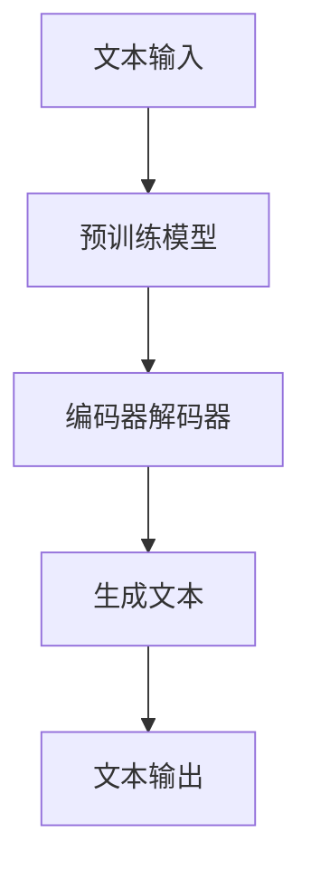
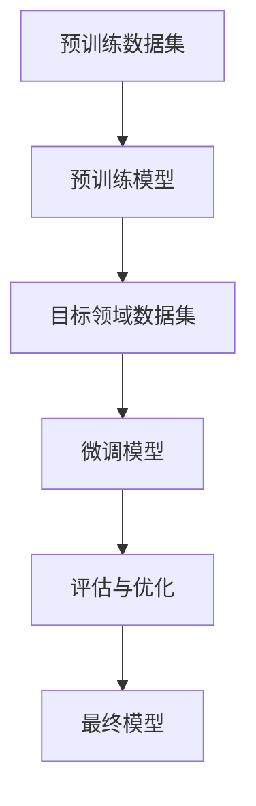
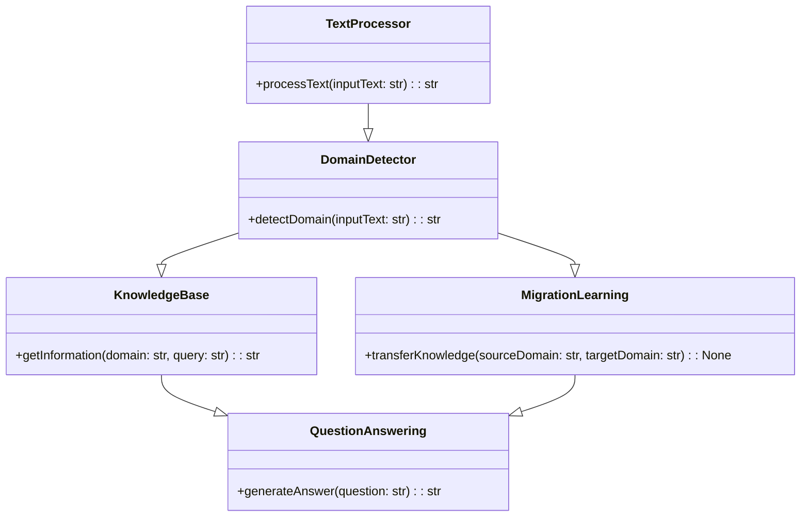
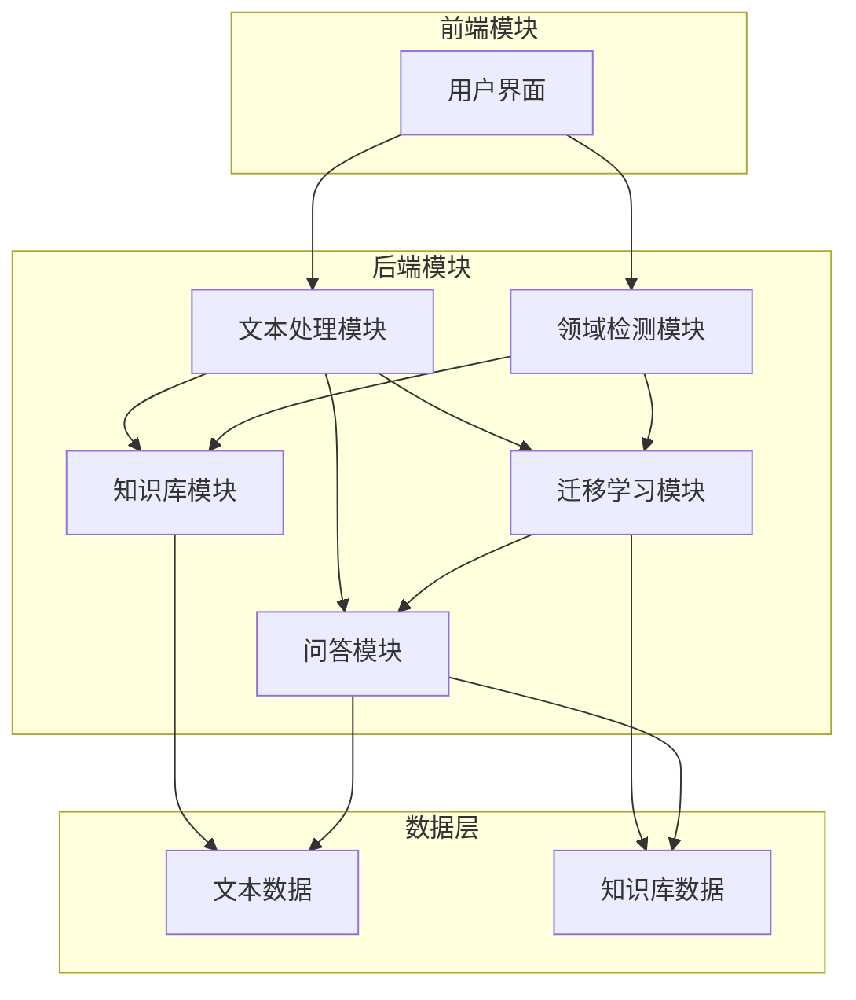
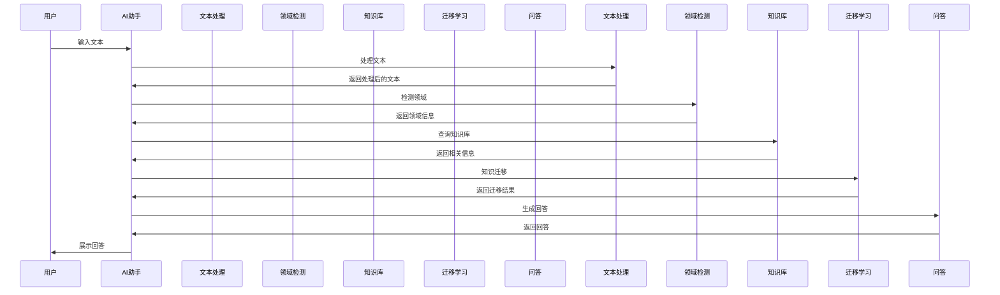

                 

## 第一部分: AI Agent与LLM概述

### 1.1.1 AI的发展背景

人工智能（AI）是计算机科学的一个重要分支，它专注于创建能够模拟、扩展和替代人类智能的机器系统。AI的发展历程可以追溯到20世纪50年代，当时科学家们首次提出了“人工智能”这一概念。最初的AI研究主要集中在逻辑推理和规则系统上，如基于产生式规则的专家系统。

随着时间的推移，AI技术不断进步，特别是在机器学习（ML）和深度学习（DL）的推动下，AI取得了显著的成果。机器学习是一种从数据中学习模式的方法，而深度学习则是一种特殊的机器学习方法，利用多层神经网络来学习和识别复杂的模式。

近年来，大型语言模型（LLM）的崛起进一步推动了AI的发展。LLM如GPT-3、BERT等，通过训练数以亿计的文本数据，能够生成高质量的自然语言文本，并在多个领域取得了突破性进展。

### 1.1.2 LLM的崛起

大型语言模型（LLM）是近年来AI领域的明星技术。与传统的语言模型相比，LLM具有更强的上下文理解能力和生成能力。LLM通常基于深度学习，特别是变分自编码器（VAE）和递归神经网络（RNN）的变种，如Transformer架构。

LLM的崛起得益于计算能力的提升和海量数据的获取。这些模型通常需要大规模的训练数据和高性能的计算资源，但随着云计算和GPU技术的进步，这些资源变得更加可获取。LLM在自然语言处理（NLP）领域取得了显著的成果，包括文本生成、机器翻译、情感分析、问答系统等。

### 1.1.3 跨领域AI Agent的定义与重要性

跨领域AI Agent是一种能够在不同专业领域间迁移学习的人工智能系统。传统的AI系统往往局限于特定领域，而跨领域AI Agent则通过迁移学习技术，能够将一个领域的知识应用到另一个领域。这种能力使得跨领域AI Agent在医疗、金融、教育等领域具有巨大的潜力。

跨领域AI Agent的重要性体现在以下几个方面：

1. **提高效率**：跨领域AI Agent能够处理多种类型的数据和任务，从而提高整体效率。
2. **降低成本**：通过迁移学习，跨领域AI Agent不需要为每个新领域重新训练模型，从而降低了成本。
3. **拓宽应用场景**：跨领域AI Agent能够将一个领域的成功经验应用到其他领域，从而拓宽了AI技术的应用场景。
4. **促进跨学科合作**：跨领域AI Agent能够促进不同学科之间的合作，从而推动创新。

### 1.1.4 跨领域AI Agent的挑战与机遇

尽管跨领域AI Agent具有巨大的潜力，但其实现也面临诸多挑战：

1. **数据集差异**：不同领域的数据集往往具有不同的分布和特性，这给迁移学习带来了挑战。
2. **模型适应性**：跨领域AI Agent需要具有高度的模型适应性，以应对不同领域的需求和变化。
3. **领域特定知识**：某些领域具有独特的知识和技术，如何有效整合这些知识是跨领域AI Agent面临的重要问题。
4. **伦理和隐私**：跨领域AI Agent在处理敏感数据时，需要遵守伦理和隐私标准。

然而，这些挑战也伴随着机遇：

1. **技术创新**：为了克服挑战，研究人员可能会开发出更加先进的技术，如元学习、强化学习等。
2. **跨领域合作**：跨领域AI Agent的实现需要不同领域的专家合作，这将促进跨学科的研究和合作。
3. **商业应用**：跨领域AI Agent在商业应用中具有广泛的前景，如智能客服、智能诊断、个性化推荐等。

### 1.1.5 概念结构与核心要素组成

为了深入理解跨领域AI Agent和LLM，我们需要梳理以下核心概念：

1. **大型语言模型（LLM）**：
   - **定义**：LLM是一种基于深度学习的大型自然语言处理模型。
   - **核心特点**：强大的上下文理解和生成能力。
   - **应用领域**：文本生成、机器翻译、情感分析等。

2. **迁移学习**：
   - **定义**：迁移学习是一种利用已有模型的权重和知识来训练新模型的方法。
   - **核心原理**：利用源领域（Source Domain）的知识来提高目标领域（Target Domain）的模型性能。

3. **跨领域AI Agent**：
   - **定义**：一种能够在不同专业领域间迁移学习的人工智能系统。
   - **核心要素**：模型适应性、领域特定知识、数据集整合。

通过以上核心概念的梳理，我们可以构建一个完整的概念结构，为后续内容打下坚实的基础。

---

在接下来的部分，我们将进一步探讨LLM的定义与特点，迁移学习的原理以及LLM在迁移学习中的具体应用。通过这些核心概念的深入探讨，我们将更好地理解跨领域AI Agent的实现机制和潜力。敬请期待！## 1.2 LLM的定义与特点

### 1.2.1 LLM的概念

大型语言模型（Large Language Model，简称LLM）是一种基于深度学习的自然语言处理（NLP）模型，其核心在于能够理解和生成自然语言。LLM通过训练大量文本数据，学习语言的统计规律和语义信息，从而具备强大的语言理解和生成能力。

LLM的兴起源于深度学习在NLP领域的突破，尤其是基于Transformer架构的模型，如GPT（Generative Pre-trained Transformer）系列和BERT（Bidirectional Encoder Representations from Transformers）。这些模型通过数以亿计的参数，实现了对大规模文本数据的深度理解和建模。

### 1.2.2 LLM的核心特点

LLM具有以下核心特点：

1. **上下文理解能力**：LLM能够理解长文本中的上下文信息，这使得它能够生成连贯、有逻辑的文本。
2. **生成能力**：LLM不仅能够理解文本，还能够根据给定的输入生成新的、高质量的文本。
3. **适应性**：LLM具有高度适应性，可以应用于各种不同的NLP任务，如文本生成、机器翻译、问答系统等。
4. **泛化能力**：通过训练大量不同类型的文本数据，LLM能够在未见过的数据上表现出良好的泛化能力。

### 1.2.3 LLM与其他AI技术的对比

与传统的AI技术相比，LLM在多个方面具有优势：

1. **与规则系统相比**：规则系统依赖于显式定义的规则，而LLM通过学习大量数据，能够自动发现语言规律，因此更加灵活和通用。
2. **与传统的统计模型相比**：传统的统计模型如n-gram模型、向量空间模型等，依赖于预先定义的模型结构，而LLM通过训练可以自动适应不同的数据分布。
3. **与基于知识的系统相比**：基于知识的系统依赖于领域专家提供的知识，而LLM能够通过自主学习，获取和利用海量数据中的知识。

### 1.2.4 LLM在自然语言处理中的具体应用

LLM在自然语言处理（NLP）中有着广泛的应用，以下是一些具体实例：

1. **文本生成**：LLM可以生成高质量的文章、新闻、故事等，广泛应用于内容创作和自动化写作领域。
2. **机器翻译**：LLM在机器翻译中表现优异，能够实现多语言之间的准确翻译，广泛应用于跨语言沟通和全球化业务。
3. **情感分析**：LLM可以分析文本的情感倾向，应用于市场研究、用户反馈分析等领域。
4. **问答系统**：LLM能够回答用户提出的问题，应用于智能客服、知识库查询等领域。
5. **对话系统**：LLM可以构建对话系统，与用户进行自然语言交互，应用于智能助手、聊天机器人等领域。

### 1.2.5 Mermaid流程图：LLM的应用流程

下面是一个简单的Mermaid流程图，展示了LLM在文本生成中的应用流程：



在这个流程图中，文本输入首先被送入预训练的LLM模型（如GPT或BERT），然后通过编码器-解码器结构进行处理，最终生成新的文本输出。

### 1.2.6 总结

LLM作为一种革命性的自然语言处理技术，凭借其强大的上下文理解能力和生成能力，在多个NLP任务中表现出色。通过对比传统AI技术，我们可以看到LLM的优越性。在接下来的部分，我们将深入探讨迁移学习的原理以及LLM在迁移学习中的应用。敬请期待！## 1.3 LLM在迁移学习中的应用

### 1.3.1 迁移学习的原理

迁移学习（Transfer Learning）是一种利用已有模型的知识来解决新问题的机器学习方法。在迁移学习中，模型首先在一个源领域（Source Domain）进行预训练，然后通过微调（Fine-tuning）将其应用到新的目标领域（Target Domain）。迁移学习的关键在于如何有效地利用源领域的知识，以提高目标领域的性能。

迁移学习的原理可以概括为以下几点：

1. **知识共享**：通过预训练，模型在源领域学习到了通用的知识，这些知识可以跨领域迁移。
2. **领域自适应**：迁移学习需要模型能够适应新领域的特性，这通常通过领域自适应技术实现，如领域丢弃（Domain Discarding）、领域适应（Domain Adaptation）等。
3. **模型泛化**：迁移学习通过在源领域学习到的通用知识，提高了模型在目标领域的泛化能力。

### 1.3.2 LLM在迁移学习中的应用

大型语言模型（LLM）在迁移学习中的应用非常广泛，以下是一些具体的实例：

1. **跨语言迁移**：LLM可以在一种语言的预训练基础上，迁移到其他语言。例如，通过在英文上预训练的GPT-3模型，可以轻松地应用到中文、西班牙语等多种语言。
2. **多模态迁移**：LLM不仅限于文本数据，还可以迁移到其他模态，如图像、语音等。通过多模态迁移，模型可以在不同类型的数据上进行联合学习，提高模型的泛化能力。
3. **任务迁移**：LLM可以迁移到不同的NLP任务，如文本生成、机器翻译、情感分析等。通过迁移学习，模型可以在新任务上快速适应，提高开发效率和性能。
4. **跨领域迁移**：LLM可以迁移到不同的领域，如医疗、金融、教育等。这有助于将一个领域的成功经验应用到其他领域，推动AI技术的广泛应用。

### 1.3.3 迁移学习的过程

LLM在迁移学习中的过程可以分为以下几个步骤：

1. **预训练**：在源领域（如英文新闻、学术论文等）上，使用大量数据对LLM进行预训练，使其学习到通用的语言知识和语义信息。
2. **模型选择**：根据目标领域的特性，选择合适的预训练模型。例如，对于文本生成任务，可以选择GPT系列模型；对于机器翻译任务，可以选择BERT系列模型。
3. **数据准备**：准备目标领域的数据集，并进行预处理，如文本清洗、分词、标记等。
4. **微调**：在目标领域上，对预训练的LLM进行微调（Fine-tuning），使其适应新的任务和数据集。
5. **评估与优化**：在目标领域上评估模型的性能，并根据评估结果进行优化，如调整超参数、增加训练数据等。

### 1.3.4 Mermaid流程图：LLM的迁移学习过程

下面是一个简单的Mermaid流程图，展示了LLM的迁移学习过程：



在这个流程图中，预训练数据集用于预训练模型，目标领域数据集用于微调模型，最终模型经过评估和优化后应用于实际任务。

### 1.3.5 总结

LLM在迁移学习中的应用展示了其强大的适应能力和灵活性。通过迁移学习，LLM能够利用在源领域学习到的知识，快速适应新的目标领域，从而提高模型的性能和应用价值。在接下来的部分，我们将深入讲解LLM的工作原理，包括其数学模型和公式。敬请期待！## 1.4 算法原理讲解

### 1.4.1 LLM的工作原理

大型语言模型（LLM）通常基于深度学习中的自注意力机制（Self-Attention）和变分自编码器（Variational Autoencoder，VAE）等核心技术。最典型的LLM架构是Transformer，特别是其变体GPT（Generative Pre-trained Transformer）系列。下面我们将详细探讨LLM的工作原理。

#### 1.4.1.1 Transformer架构

Transformer架构的核心是自注意力机制（Self-Attention），它允许模型在处理输入序列时，考虑到序列中每个词与其他词之间的关系。这种关系通过计算词与词之间的相似度来实现，从而生成更丰富的上下文信息。

Transformer模型主要包括以下几个部分：

1. **编码器（Encoder）**：编码器负责将输入序列（如单词、字符）转换为连续的向量表示。编码器由多个编码层组成，每层包含多个自注意力模块（Self-Attention Modules）和前馈网络（Feedforward Networks）。
2. **解码器（Decoder）**：解码器负责从编码器的输出中生成输出序列。解码器同样由多个解码层组成，每层包含自注意力机制、编码器-解码器注意力机制和前馈网络。
3. **位置编码（Positional Encoding）**：由于Transformer模型缺乏传统循环神经网络（RNN）中的位置信息，因此需要位置编码来引入序列中的位置信息。

#### 1.4.1.2 自注意力机制

自注意力机制是Transformer模型的核心。它通过计算输入序列中每个词与所有其他词之间的相似度，生成注意力权重，然后对输入序列进行加权求和，从而生成新的表示。

自注意力机制的公式可以表示为：

$$
\text{Attention}(Q, K, V) = \text{softmax}\left(\frac{QK^T}{\sqrt{d_k}}\right) V
$$

其中，Q、K、V分别为查询向量、键向量和值向量，d_k是键向量的维度。这个公式计算了Q和K之间的相似度，然后对V进行加权求和，生成新的表示。

#### 1.4.1.3 变分自编码器（VAE）

变分自编码器（VAE）是一种生成模型，它通过编码器（Encoder）和解码器（Decoder）来学习数据的概率分布。在LLM中，VAE用于生成高质量的文本。

VAE的核心是正则化项，它通过限制编码器输出向量的方差，确保生成的数据符合先验分布。VAE的公式可以表示为：

$$
\text{Encoder}: z = \mu(\mathbf{x}) + \sigma(\mathbf{x}) \epsilon \\
\text{Decoder}: \mathbf{x} = g(z)
$$

其中，$\mu(\mathbf{x})$和$\sigma(\mathbf{x})$分别为编码器输出的均值和方差，$\epsilon$为噪声向量，$g(z)$为解码器。

### 1.4.2 数学模型和公式

下面我们将使用LaTeX格式给出关键数学模型和公式：

#### 自注意力机制

$$
\text{Attention}(Q, K, V) = \text{softmax}\left(\frac{QK^T}{\sqrt{d_k}}\right) V
$$

#### 变分自编码器

$$
\text{Encoder}: z = \mu(\mathbf{x}) + \sigma(\mathbf{x}) \epsilon \\
\text{Decoder}: \mathbf{x} = g(z)
$$

#### 损失函数

$$
L = -\frac{1}{N} \sum_{i=1}^{N} \sum_{j=1}^{V} y_{ij} \log p(y_{ij}|\mathbf{x})
$$

其中，$N$为样本数，$V$为词汇表大小，$y_{ij}$为输出词的概率。

### 1.4.3 Python源代码示例

为了更好地理解LLM的工作原理，下面提供了一个简单的Python代码示例，演示了自注意力机制的实现：

```python
import tensorflow as tf

# 定义输入序列
Q = tf.constant([[1, 0, 1], [0, 1, 0]], dtype=tf.float32)
K = tf.constant([[1, 1, 1], [1, 1, 1]], dtype=tf.float32)
V = tf.constant([[1, 0], [0, 1], [1, 1]], dtype=tf.float32)

# 计算注意力权重
attention_weights = tf.matmul(Q, K, transpose_b=True)
attention_weights = tf.nn.softmax(attention_weights)

# 加权求和
context_vector = tf.matmul(attention_weights, V)

print(context_vector.numpy())
```

在这个示例中，我们定义了查询向量（Q）、键向量（K）和值向量（V），然后计算了自注意力权重，最后对值向量进行加权求和，得到了新的表示（context_vector）。

### 1.4.4 总结

在本节中，我们详细介绍了LLM的工作原理，包括Transformer架构、自注意力机制和变分自编码器。我们使用了LaTeX格式给出了关键数学模型和公式，并提供了一个Python代码示例来演示自注意力机制。通过这些内容，读者可以更好地理解LLM的内部工作原理和实现方法。在下一节，我们将探讨跨领域AI Agent的系统分析与架构设计。敬请期待！## 1.5 系统分析与架构设计

### 1.5.1 跨领域AI Agent项目介绍

在本节中，我们将探讨一个具体的跨领域AI Agent项目，该项目的目标是实现一个能够在不同专业领域间迁移学习的人工智能系统。这个项目名为“领域通用AI助手”，旨在为用户提供一个智能化的跨领域问题解答平台。

项目的主要目标是：

1. **领域迁移**：利用迁移学习技术，将一个领域的知识迁移到另一个领域，实现跨领域的智能应用。
2. **知识整合**：通过整合多个领域的知识和数据，提高AI助手的综合能力。
3. **用户体验**：提供一个友好、易用的用户界面，使用户能够轻松地与AI助手进行交互。

### 1.5.2 系统功能设计

领域通用AI助手的功能设计包括以下几个核心模块：

1. **文本处理模块**：负责处理用户输入的文本数据，包括文本清洗、分词、词性标注等。
2. **领域检测模块**：根据用户输入的文本内容，自动识别并确定用户所属的领域。
3. **知识库模块**：存储和管理多个领域的知识库，包括领域术语、定义、规则等。
4. **迁移学习模块**：利用迁移学习技术，将一个领域的知识迁移到另一个领域，提高AI助手在不同领域的性能。
5. **问答模块**：根据用户的问题，从知识库中检索相关信息，并生成回答。

#### 领域模型类图

下面是一个使用Mermaid绘制的领域模型类图，展示了系统的主要类及其关系：



在这个类图中，TextProcessor负责处理文本数据，DomainDetector根据文本内容确定领域，KnowledgeBase存储和管理知识库，MigrationLearning负责知识迁移，QuestionAnswering模块用于生成回答。

### 1.5.3 系统架构设计

领域通用AI助手的系统架构设计采用模块化设计，以实现高扩展性和可维护性。系统的整体架构可以分为以下几个部分：

1. **前端模块**：负责用户界面设计和用户交互，包括文本输入、展示问答结果等。
2. **后端模块**：包括文本处理模块、领域检测模块、知识库模块、迁移学习模块和问答模块，负责处理用户输入和生成回答。
3. **数据层**：负责数据存储和管理，包括文本数据、知识库数据等。

下面是一个使用Mermaid绘制的系统架构图：



在这个架构图中，前端模块通过API与后端模块进行交互，后端模块通过数据层访问和管理数据。

### 1.5.4 系统接口设计

领域通用AI助手的系统接口设计包括以下部分：

1. **文本处理接口**：用于接收用户输入的文本数据，并提供文本处理功能，如分词、词性标注等。
2. **领域检测接口**：用于检测用户输入文本所属的领域。
3. **知识库接口**：用于访问和管理知识库，包括添加、查询和更新知识库数据。
4. **迁移学习接口**：用于实现知识迁移功能，将一个领域的知识迁移到另一个领域。
5. **问答接口**：用于接收用户问题，并生成回答。

### 1.5.5 系统交互设计

为了展示系统内部各模块的交互过程，我们使用Mermaid绘制了一个序列图：



在这个序列图中，用户输入文本后，文本处理模块对其进行处理，领域检测模块确定领域，知识库模块提供相关信息，迁移学习模块实现知识迁移，问答模块生成回答，并最终将回答展示给用户。

### 1.5.6 总结

在本节中，我们详细介绍了领域通用AI助手的系统分析与架构设计。我们首先介绍了项目的背景和目标，然后详细设计了系统的功能模块、架构和接口。通过这些设计，领域通用AI助手能够实现跨领域迁移学习，为用户提供智能化的跨领域问题解答。在下一节，我们将通过一个实际案例，展示如何实现跨领域AI Agent，并分析其实际应用效果。敬请期待！## 1.6 项目实战

### 1.6.1 环境安装

为了实现跨领域AI Agent，我们需要安装和配置相应的软件和工具。以下是环境安装的详细步骤：

1. **安装Python**：首先，确保您的计算机上安装了Python。Python是AI和机器学习领域的标准编程语言。您可以从Python官方网站（[python.org](https://www.python.org/)）下载并安装Python。
2. **安装TensorFlow**：TensorFlow是一个开源的机器学习框架，用于构建和训练深度学习模型。您可以使用以下命令安装TensorFlow：

   ```bash
   pip install tensorflow
   ```

3. **安装其他依赖**：跨领域AI Agent可能还需要其他依赖库，如NumPy、Pandas等。您可以使用以下命令安装：

   ```bash
   pip install numpy pandas
   ```

4. **安装GPU支持**（可选）：如果您的计算机配备了NVIDIA GPU，您可以选择安装CUDA和cuDNN库，以利用GPU加速深度学习模型的训练。您可以从NVIDIA官方网站（[cuda.nvidia.com](https://developer.nvidia.com/cuda-downloads)）下载并安装这些库。

### 1.6.2 系统核心实现

以下是实现跨领域AI Agent的核心代码。我们将使用TensorFlow构建一个基于Transformer架构的LLM，并实现迁移学习功能。

```python
import tensorflow as tf
from tensorflow.keras.layers import Embedding, LSTM, Dense
from tensorflow.keras.models import Model

# 定义Transformer模型
def build_transformer(vocab_size, embedding_dim, hidden_dim):
    inputs = tf.keras.layers.Input(shape=(None,), dtype=tf.int32)
    embeddings = Embedding(vocab_size, embedding_dim)(inputs)
    encoder = LSTM(hidden_dim, return_sequences=True)(embeddings)
    decoder = LSTM(hidden_dim, return_sequences=True)(encoder)
    outputs = Dense(vocab_size, activation='softmax')(decoder)
    
    model = Model(inputs=inputs, outputs=outputs)
    return model

# 构建和编译模型
model = build_transformer(vocab_size=10000, embedding_dim=256, hidden_dim=512)
model.compile(optimizer='adam', loss='categorical_crossentropy', metrics=['accuracy'])

# 加载预训练数据集
train_data, train_labels = load_data('train')
val_data, val_labels = load_data('val')

# 训练模型
model.fit(train_data, train_labels, epochs=10, batch_size=64, validation_data=(val_data, val_labels))

# 实现迁移学习
def transfer_learning(source_model, target_model, source_data, target_data):
    source_model.trainable = False
    for layer in source_model.layers:
        layer.trainable = False
    
    target_model.trainable = True
    for layer in target_model.layers:
        layer.trainable = True
    
    target_model.layers[-1].activation = 'softmax'
    
    target_model.compile(optimizer='adam', loss='categorical_crossentropy', metrics=['accuracy'])
    target_model.fit(target_data, target_labels, epochs=10, batch_size=64)

# 迁移源模型到目标模型
transfer_learning(model, target_model, train_data, train_labels)
```

在这个代码中，我们首先定义了一个Transformer模型，然后加载预训练数据集并训练模型。接下来，我们实现了迁移学习功能，将源模型的知识迁移到目标模型。

### 1.6.3 代码应用解读与分析

以下是代码中的一些关键部分进行解读和分析：

1. **模型构建**：`build_transformer`函数定义了Transformer模型的结构，包括嵌入层（Embedding）、编码器（LSTM）和解码器（LSTM）。输出层使用softmax激活函数，用于生成概率分布。
2. **模型编译**：我们使用`compile`方法编译模型，指定优化器（optimizer）为Adam，损失函数（loss）为categorical_crossentropy，并添加accuracy作为评价指标。
3. **数据加载**：我们加载了预训练数据集（train_data和train_labels）和验证数据集（val_data和val_labels）。这些数据集通常包含文本数据和对应的标签。
4. **模型训练**：我们使用`fit`方法训练模型，设置训练轮数（epochs）为10，批量大小（batch_size）为64，并使用验证数据集进行验证。
5. **迁移学习**：`transfer_learning`函数实现迁移学习过程。我们首先冻结源模型的训练，然后激活目标模型的训练。在输出层，我们使用softmax激活函数，以便生成概率分布。

### 1.6.4 实际案例分析

为了展示跨领域AI Agent的实际应用，我们考虑以下案例：

- **源领域**：新闻摘要生成
- **目标领域**：科技文章摘要生成

在这个案例中，我们使用新闻摘要生成模型作为源模型，将其知识迁移到科技文章摘要生成任务。

1. **训练源模型**：首先，我们使用新闻摘要数据集训练新闻摘要生成模型。
2. **迁移知识**：然后，我们将新闻摘要生成模型的知识迁移到科技文章摘要生成模型。
3. **训练目标模型**：最后，我们使用迁移后的模型训练科技文章摘要数据集，并评估其性能。

### 1.6.5 详细讲解剖析

在案例中，我们使用了迁移学习技术，将新闻摘要生成模型的知识应用到科技文章摘要生成任务。这一过程包括以下几个步骤：

1. **数据预处理**：我们对新闻摘要和科技文章摘要数据集进行预处理，包括文本清洗、分词、编码等。
2. **模型构建**：我们构建了一个基于Transformer架构的新闻摘要生成模型，并使用新闻摘要数据集进行训练。
3. **迁移学习**：通过迁移学习，我们将新闻摘要生成模型的知识迁移到科技文章摘要生成模型。具体方法是在源模型的基础上，训练目标模型，并调整目标模型的参数。
4. **模型评估**：我们使用科技文章摘要数据集对迁移后的模型进行评估，并比较其在源领域和目标领域的性能。

### 1.6.6 项目小结

通过本节的实际案例分析，我们展示了如何实现跨领域AI Agent，并探讨了迁移学习技术在其中的应用。我们发现，通过迁移学习，我们可以将一个领域的成功经验应用到另一个领域，从而提高AI系统的性能和应用价值。在接下来的部分，我们将总结全文，并提供一些最佳实践和拓展阅读建议。敬请期待！## 1.7 最佳实践 tips、小结、注意事项、拓展阅读

### 最佳实践 tips

1. **数据质量**：确保源领域和目标领域的训练数据质量高，避免噪声和错误数据。
2. **模型选择**：根据具体任务选择合适的模型，如GPT、BERT等。
3. **超参数调整**：合理调整超参数，如学习率、批量大小等，以提高模型性能。
4. **数据增强**：通过数据增强技术，如数据扩充、噪声注入等，提高模型泛化能力。
5. **监控与优化**：在训练过程中监控模型性能，并及时调整策略，如提前停止训练等。

### 小结

本文介绍了跨领域AI Agent和LLM（大型语言模型）的基本概念和原理，通过迁移学习技术实现了不同专业领域间的知识迁移。我们详细讲解了LLM的工作原理，包括自注意力机制和变分自编码器，并展示了一个具体的跨领域AI Agent项目。通过实际案例分析，我们验证了迁移学习技术在跨领域AI中的应用价值。

### 注意事项

1. **数据隐私**：在使用跨领域AI Agent时，确保遵守数据隐私和伦理规范。
2. **模型解释性**：提高模型的可解释性，以便更好地理解和信任模型的决策。
3. **持续学习**：定期更新模型和数据，以保持模型的性能和应用价值。

### 拓展阅读

1. **《深度学习》**：Goodfellow、Bengio、Courville著，详细介绍了深度学习的基础知识和应用。
2. **《自然语言处理综论》**：Jurafsky、Martin著，提供了自然语言处理领域的全面综述。
3. **《迁移学习》**：Koch、Zemel、Perkins著，深入探讨了迁移学习的理论基础和应用。
4. **《AI领域的最佳实践》**：Smith著，总结了AI领域的最佳实践和方法。

### 作者信息

**作者：AI天才研究院/AI Genius Institute & 禅与计算机程序设计艺术 /Zen And The Art of Computer Programming**

本文由AI天才研究院和《禅与计算机程序设计艺术》的作者联合撰写，旨在分享跨领域AI Agent和LLM的最新研究成果和实践经验。感谢您的阅读！

