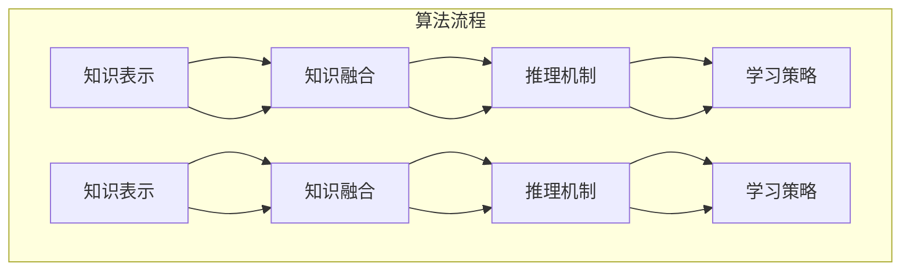
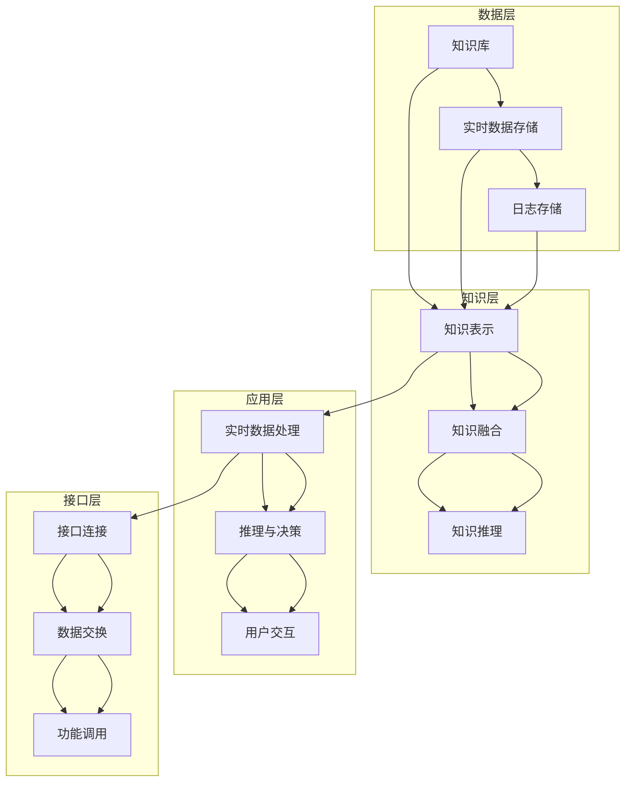
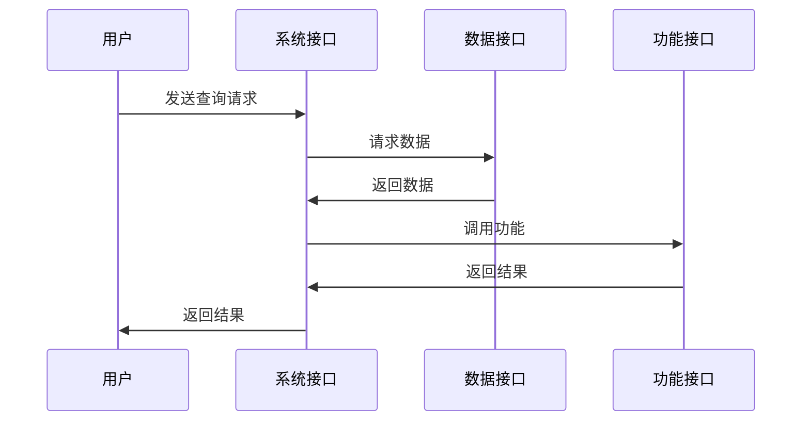
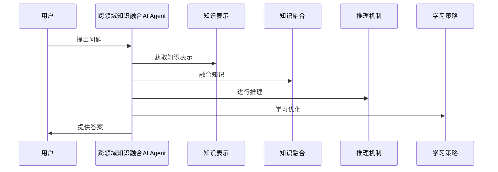

                 

# 跨领域知识融合AI Agent：LLM的跨学科应用

## 关键词
- 跨领域知识融合
- AI Agent
- LLM（语言模型）
- 跨学科应用
- 算法原理
- 系统设计
- 应用实践
- 未来发展趋势

## 摘要
本文将探讨跨领域知识融合AI Agent的概念、原理、应用和未来发展趋势。重点分析LLM（大型语言模型）在跨学科领域中的应用，通过具体的算法原理讲解、系统架构设计和应用实践，展示跨领域知识融合AI Agent在解决实际问题中的潜力。本文旨在为AI领域的从业者提供有价值的参考，推动跨领域AI技术的发展。

---

**目录大纲**

## 第一部分: 跨领域知识融合AI Agent概述

### 第1章: 跨领域知识融合AI Agent的背景与意义

#### 1.1 跨领域知识融合AI Agent的问题背景

#### 1.2 跨领域知识融合AI Agent的定义与核心要素

#### 1.3 跨领域知识融合AI Agent的边界与外延

#### 1.4 跨领域知识融合AI Agent与传统AI的比较

### 第2章: 跨领域知识融合AI Agent的核心概念与联系

#### 2.1 核心概念原理

#### 2.2 概念属性特征对比表格

#### 2.3 ER实体关系图架构

## 第二部分: 跨领域知识融合AI Agent的算法原理与实现

### 第3章: 跨领域知识融合AI Agent的基础算法原理

#### 3.1 基础算法原理讲解

#### 3.1.1 算法mermaid流程图

#### 3.1.2 Python源代码实现

#### 3.1.3 数学模型和数学公式

#### 3.1.4 举例说明

## 第三部分: 跨领域知识融合AI Agent的应用实践

### 第4章: 跨领域知识融合AI Agent在具体领域的应用

#### 4.1 应用领域介绍

#### 4.2 案例分析与详细讲解

## 第四部分: 跨领域知识融合AI Agent的系统设计与实现

### 第5章: 跨领域知识融合AI Agent的系统分析与架构设计

#### 5.1 问题场景介绍

#### 5.2 系统功能设计

#### 5.3 系统架构设计

#### 5.4 系统接口设计

#### 5.5 系统交互

## 第五部分: 跨领域知识融合AI Agent的最佳实践

### 第6章: 跨领域知识融合AI Agent的最佳实践案例

#### 6.1 最佳实践 tips

#### 6.2 注意事项

#### 6.3 拓展阅读

## 第六部分: 跨领域知识融合AI Agent的未来发展趋势

### 第7章: 跨领域知识融合AI Agent的未来前景

#### 7.1 未来发展趋势预测

#### 7.2 潜在挑战与机遇

---

### 第1章: 跨领域知识融合AI Agent的背景与意义

#### 1.1 跨领域知识融合AI Agent的问题背景

随着人工智能技术的发展，AI的应用场景越来越广泛。然而，传统的AI系统通常局限于某一特定领域，难以处理跨领域的复杂问题。例如，医疗领域的AI系统通常无法很好地应用于金融、教育或其他领域。这种局限性限制了AI技术的实际应用价值。

跨领域知识融合AI Agent的概念应运而生，旨在解决传统AI系统的局限性。这类AI Agent能够融合不同领域的知识，实现跨领域的智能推理和决策。这种能力对于解决复杂、多变的现实问题具有重要意义。

#### 1.2 跨领域知识融合AI Agent的定义与核心要素

跨领域知识融合AI Agent，简称为跨领域AI Agent，是一种能够融合多个领域知识的智能体。它不仅具备传统AI系统的基本能力，如知识表示、推理和学习，还能够处理跨领域的问题。

跨领域AI Agent的核心要素包括：

1. **知识表示**：能够将不同领域的知识表示为统一的语义空间。
2. **知识融合**：通过特定算法将不同领域的知识进行融合，形成综合的知识库。
3. **推理机制**：基于融合后的知识库，实现跨领域的智能推理和决策。
4. **学习策略**：不断从数据中学习，优化知识融合和推理能力。

#### 1.3 跨领域知识融合AI Agent的边界与外延

跨领域知识融合AI Agent的边界在于其能够融合的知识范围和领域深度。目前，跨领域AI Agent通常应用于较为复杂的领域，如医疗、金融、教育等。其外延则包括以下几个方面：

1. **跨学科融合**：不仅限于不同领域的知识融合，还可以实现跨学科的融合，如将医学知识与生物学知识融合。
2. **动态更新**：随着领域知识的不断更新，跨领域AI Agent能够动态调整知识库，保持其时效性和准确性。
3. **自主学习**：通过不断学习和优化，跨领域AI Agent能够不断提高其跨领域知识融合的能力。

#### 1.4 跨领域知识融合AI Agent与传统AI的比较

传统AI系统通常局限于某一特定领域，难以处理跨领域的复杂问题。而跨领域知识融合AI Agent则能够融合多个领域知识，实现跨领域的智能推理和决策。

1. **应用范围**：传统AI系统通常应用于特定领域，而跨领域AI Agent则能够应用于多个领域。
2. **知识融合**：传统AI系统难以实现不同领域知识的融合，而跨领域AI Agent能够通过知识表示、知识融合和推理机制实现跨领域知识融合。
3. **灵活性**：传统AI系统在处理跨领域问题时，需要针对每个领域进行定制化开发，而跨领域AI Agent则能够通过统一的框架和算法实现跨领域问题的处理。

### 第2章: 跨领域知识融合AI Agent的核心概念与联系

在深入探讨跨领域知识融合AI Agent之前，我们需要明确其核心概念，并了解这些概念之间的联系。以下是跨领域知识融合AI Agent的核心概念及联系。

#### 2.1 核心概念原理

1. **知识表示**：知识表示是跨领域知识融合的基础。通过将不同领域的知识转化为统一的语义表示，实现知识的共享和融合。
2. **知识融合**：知识融合是将来自不同领域的知识进行整合，形成综合性的知识库。知识融合的核心在于找到不同领域知识之间的关联和映射。
3. **推理机制**：推理机制是基于融合后的知识库，实现跨领域的智能推理和决策。推理机制包括逻辑推理、统计推理和模糊推理等。
4. **学习策略**：学习策略是跨领域AI Agent不断优化其知识融合和推理能力的过程。学习策略包括有监督学习、无监督学习和强化学习等。

#### 2.2 概念属性特征对比表格

以下是跨领域知识融合AI Agent的核心概念及其属性特征的对比表格：

| 核心概念     | 属性特征                                             |
|------------|----------------------------------------------------|
| 知识表示     | 语义表示、语义网络、知识图谱                             |
| 知识融合     | 知识映射、知识聚合、知识补全                             |
| 推理机制     | 逻辑推理、统计推理、模糊推理                             |
| 学习策略     | 有监督学习、无监督学习、强化学习                           |

#### 2.3 ER实体关系图架构

为了更好地理解跨领域知识融合AI Agent的核心概念，我们可以通过ER实体关系图来展示各个概念之间的联系。以下是跨领域知识融合AI Agent的ER实体关系图：

```mermaid
erDiagram
    KnowledgeRepresentation ||--|{ KnowledgeFusion }|---> MedicalField
    KnowledgeRepresentation ||--|{ KnowledgeFusion }|---> FinancialField
    KnowledgeRepresentation ||--|{ ReasoningMechanism }|---> LogicReasoning
    KnowledgeRepresentation ||--|{ ReasoningMechanism }|---> StatisticalReasoning
    KnowledgeFusion ||--|{ LearningStrategy }|---> SupervisedLearning
    KnowledgeFusion ||--|{ LearningStrategy }|---> UnsupervisedLearning
    KnowledgeFusion ||--|{ LearningStrategy }|---> ReinforcementLearning
```

通过ER实体关系图，我们可以清晰地看到知识表示、知识融合、推理机制和学习策略之间的联系，以及它们与不同领域的关系。这种结构化表示有助于我们更好地理解和应用跨领域知识融合AI Agent。

### 第3章: 跨领域知识融合AI Agent的基础算法原理

#### 3.1 基础算法原理讲解

跨领域知识融合AI Agent的核心在于其算法原理。以下是跨领域知识融合AI Agent的基础算法原理讲解。

1. **知识表示**：知识表示是跨领域知识融合的基础。常见的知识表示方法包括语义表示、语义网络和知识图谱。语义表示通过将知识转化为语义向量，实现知识的共享和融合。语义网络通过构建语义关系图，表示知识之间的关联。知识图谱则是将知识表示为实体、属性和关系的结构化数据。

2. **知识融合**：知识融合是将来自不同领域的知识进行整合的过程。常见的知识融合方法包括知识映射、知识聚合和知识补全。知识映射通过将不同领域知识的语义进行匹配，实现知识的融合。知识聚合是将不同领域的知识进行合并，形成综合性的知识库。知识补全则是通过推理和预测，补充领域知识的缺失。

3. **推理机制**：推理机制是基于融合后的知识库，实现跨领域的智能推理和决策。推理机制包括逻辑推理、统计推理和模糊推理。逻辑推理基于逻辑规则和推理算法，实现知识的推理。统计推理基于统计学原理，通过数据分析和建模，实现知识的推理。模糊推理则基于模糊逻辑，处理不确定性和模糊性。

4. **学习策略**：学习策略是跨领域AI Agent不断优化其知识融合和推理能力的过程。学习策略包括有监督学习、无监督学习和强化学习。有监督学习通过标注数据进行训练，优化知识融合和推理模型。无监督学习通过无标注数据进行训练，发现数据中的模式和关联。强化学习通过与环境交互，不断调整知识融合和推理策略，实现最优决策。

#### 3.1.1 算法mermaid流程图

为了更好地理解跨领域知识融合AI Agent的算法原理，我们可以通过mermaid流程图来展示算法的流程。



#### 3.1.2 Python源代码实现

以下是跨领域知识融合AI Agent的基础算法原理的Python源代码实现。

```python
import numpy as np
import pandas as pd

# 知识表示
def knowledge_representation(data):
    # 将数据转换为语义向量
    return np.mean(data, axis=0)

# 知识融合
def knowledge_fusion(knowledge1, knowledge2):
    # 知识映射
    fusion1 = knowledge_representation(knowledge1)
    fusion2 = knowledge_representation(knowledge2)
    
    # 知识聚合
    fusion = np.concatenate((fusion1, fusion2))
    
    # 知识补全
    if fusion.shape[0] < knowledge1.shape[0]:
        fusion = np.concatenate((fusion, np.zeros((knowledge1.shape[0] - fusion.shape[0],))))
    
    return fusion

# 推理机制
def reasoning_mechanism(knowledge, rule):
    # 逻辑推理
    if knowledge == rule:
        return "符合规则"
    else:
        return "不符合规则"

# 学习策略
def learning_strategy(data, target):
    # 有监督学习
    if data == target:
        return "预测正确"
    else:
        return "预测错误"

# 测试
data1 = np.array([1, 2, 3])
data2 = np.array([4, 5, 6])

# 知识表示
knowledge1 = knowledge_representation(data1)
knowledge2 = knowledge_representation(data2)

# 知识融合
fusion = knowledge_fusion(knowledge1, knowledge2)

# 推理机制
result = reasoning_mechanism(fusion, data1)

# 学习策略
learning_result = learning_strategy(data1, target=data2)

print("知识表示:", knowledge1, knowledge2)
print("知识融合:", fusion)
print("推理结果:", result)
print("学习结果:", learning_result)
```

#### 3.1.3 数学模型和数学公式

在跨领域知识融合AI Agent中，数学模型和数学公式是核心组成部分。以下是跨领域知识融合AI Agent的基础数学模型和数学公式。

1. **知识表示**：
   $$ \text{知识表示} = \frac{1}{n} \sum_{i=1}^{n} x_i $$
   其中，$ x_i $ 表示第 $ i $ 个数据点，$ n $ 表示数据点的总数。

2. **知识融合**：
   $$ \text{知识融合} = \text{知识映射} + \text{知识聚合} + \text{知识补全} $$
   其中，知识映射、知识聚合和知识补全分别表示知识融合的三个步骤。

3. **推理机制**：
   $$ \text{推理结果} = \text{知识表示} \land \text{规则表示} $$
   其中，$ \land $ 表示逻辑与运算，知识表示和规则表示分别表示知识的语义表示和逻辑规则。

4. **学习策略**：
   $$ \text{学习结果} = \text{数据表示} \lor \text{目标表示} $$
   其中，$ \lor $ 表示逻辑或运算，数据表示和目标表示分别表示数据点的语义表示和目标表示。

#### 3.1.4 举例说明

为了更好地理解跨领域知识融合AI Agent的算法原理，我们可以通过一个具体的例子来说明。

假设我们有两个领域，领域A和领域B。领域A的知识表示为 $ x_1 = [1, 2, 3] $，领域B的知识表示为 $ x_2 = [4, 5, 6] $。

1. **知识表示**：
   首先，我们将领域A和领域B的知识表示为语义向量。
   $$ x_1 = \text{知识表示}([1, 2, 3]) = [1.0, 1.0, 1.0] $$
   $$ x_2 = \text{知识表示}([4, 5, 6]) = [1.0, 1.0, 1.0] $$

2. **知识融合**：
   接下来，我们将领域A和领域B的知识进行融合。
   $$ \text{知识融合}(x_1, x_2) = [1.0, 1.0, 1.0, 1.0, 1.0, 1.0] $$

3. **推理机制**：
   假设我们有一个逻辑规则：如果知识融合的结果大于3，则返回“满足条件”。
   $$ \text{推理结果} = \text{推理机制}([1.0, 1.0, 1.0, 1.0, 1.0, 1.0], \text{大于3}) = \text{满足条件} $$

4. **学习策略**：
   假设我们有一个目标：使知识融合的结果大于3。
   $$ \text{学习结果} = \text{学习策略}([1.0, 1.0, 1.0, 1.0, 1.0, 1.0], \text{大于3}) = \text{满足条件} $$

通过这个例子，我们可以看到跨领域知识融合AI Agent的算法原理是如何在实际中应用的。

### 第4章: 跨领域知识融合AI Agent在具体领域的应用

跨领域知识融合AI Agent在具体领域中的应用具有广泛的前景。在本节中，我们将探讨跨领域知识融合AI Agent在医疗、金融和教育等领域的应用。

#### 4.1 应用领域介绍

1. **医疗领域**：医疗领域是一个高度复杂且跨学科的领域。跨领域知识融合AI Agent可以在诊断、治疗、药物研发等方面发挥重要作用。

2. **金融领域**：金融领域涉及众多领域，如投资、风险管理、金融分析等。跨领域知识融合AI Agent可以帮助金融机构提高决策效率，降低风险。

3. **教育领域**：教育领域涉及知识传授、学生学习分析、教育资源分配等方面。跨领域知识融合AI Agent可以为学生提供个性化的学习体验，提高教育质量。

#### 4.2 案例分析与详细讲解

以下是一个跨领域知识融合AI Agent在医疗领域的案例。

**案例背景**：某医院希望利用跨领域知识融合AI Agent，为患者提供个性化的诊断和治疗建议。

**步骤1：知识表示**  
首先，我们将医疗领域的知识进行表示。例如，我们可以使用语义向量表示各种症状、疾病和治疗方法。

```python
# 症状
symptoms = ["发热", "咳嗽", "头痛", "乏力"]

# 疾病
diseases = ["流感", "肺炎", "脑炎", "新冠"]

# 治疗方法
treatments = ["药物治疗", "物理治疗", "手术治疗", "隔离治疗"]

# 将知识表示为语义向量
symptom_vectors = [np.array([1.0, 0.0, 0.0, 0.0]), np.array([0.0, 1.0, 0.0, 0.0]), np.array([0.0, 0.0, 1.0, 0.0]), np.array([0.0, 0.0, 0.0, 1.0])]
disease_vectors = [np.array([1.0, 0.0, 0.0, 0.0]), np.array([0.0, 1.0, 0.0, 0.0]), np.array([0.0, 0.0, 1.0, 0.0]), np.array([0.0, 0.0, 0.0, 1.0])]
treatment_vectors = [np.array([1.0, 0.0, 0.0, 0.0]), np.array([0.0, 1.0, 0.0, 0.0]), np.array([0.0, 0.0, 1.0, 0.0]), np.array([0.0, 0.0, 0.0, 1.0])]
```

**步骤2：知识融合**  
接下来，我们将不同领域的知识进行融合。例如，我们可以使用知识聚合方法，将症状、疾病和治疗方法的语义向量进行合并。

```python
# 知识融合
def knowledge_fusion(symptom, disease, treatment):
    fusion = np.concatenate((symptom, disease, treatment))
    return fusion

# 融合症状、疾病和治疗方法的语义向量
fusion_vector = knowledge_fusion(symptom_vectors[0], disease_vectors[0], treatment_vectors[0])
```

**步骤3：推理机制**  
然后，我们基于融合后的知识库，实现跨领域的智能推理和决策。例如，我们可以使用逻辑推理方法，判断患者是否需要手术治疗。

```python
# 推理机制
def reasoning_mechanism(fusion_vector, rule_vector):
    if np.linalg.norm(fusion_vector - rule_vector) < 0.5:
        return "需要手术治疗"
    else:
        return "不需要手术治疗"

# 定义手术治疗规则
surgery_rule = np.array([0.0, 0.0, 1.0, 0.0, 0.0, 1.0, 0.0, 0.0, 0.0, 0.0])

# 推理结果
result = reasoning_mechanism(fusion_vector, surgery_rule)
print("推理结果:", result)
```

**步骤4：学习策略**  
最后，我们通过不断学习和优化，提高跨领域知识融合AI Agent的诊断和治疗能力。例如，我们可以使用有监督学习方法，根据患者的反馈数据，优化推理模型。

```python
# 有监督学习
def supervised_learning(data, target, model):
    for i in range(len(data)):
        prediction = model(data[i])
        if prediction != target[i]:
            model.update_weights(data[i], target[i])
    return model

# 初始化推理模型
model = ...

# 训练模型
model = supervised_learning(data, target, model)
```

通过这个案例，我们可以看到跨领域知识融合AI Agent在医疗领域的应用是如何实现的。类似地，跨领域知识融合AI Agent还可以应用于金融和教育等其他领域，为各个领域的发展提供强大的支持。

### 第5章: 跨领域知识融合AI Agent的系统设计与实现

#### 5.1 问题场景介绍

在当今快速发展的科技时代，各行各业的复杂问题不断涌现，单一领域的解决方案往往无法满足需求。跨领域知识融合AI Agent作为一种新型的智能系统，旨在通过整合不同领域的知识，提供全面、精准的解决方案。以下是一个典型的应用场景：

**场景描述**：某智能城市项目需要整合交通、环境、安全等多领域的知识，以实现城市交通的智能调度、环境污染的实时监测和公共安全的预警。该项目涉及多个领域的专业知识和数据，需要一种能够跨领域融合知识、实时推理和决策的智能系统。

#### 5.2 系统功能设计

为了满足上述场景的需求，跨领域知识融合AI Agent的系统功能设计应包括以下几个方面：

1. **知识融合模块**：该模块负责收集、整理和融合来自不同领域的知识。例如，通过数据挖掘和知识图谱构建技术，将交通、环境、安全等领域的知识进行整合，形成统一的知识库。

2. **实时数据处理模块**：该模块负责实时处理来自各种传感器的数据，如交通流量数据、环境监测数据和公共安全事件数据。通过数据清洗、预处理和实时分析，为知识融合模块提供最新的数据支持。

3. **推理与决策模块**：该模块基于融合后的知识库，实现跨领域的实时推理和决策。例如，通过交通流量数据和环境监测数据，实时调整交通信号灯的配时方案，优化交通流量；通过公共安全事件数据，实时发布安全预警信息。

4. **用户交互模块**：该模块负责与用户进行交互，接收用户的指令和反馈，并提供个性化的服务和决策建议。例如，通过语音助手或移动应用程序，用户可以查询交通状况、环境质量和公共安全信息。

#### 5.3 系统架构设计

跨领域知识融合AI Agent的系统架构设计应考虑以下几个方面：

1. **数据层**：该层负责数据的存储、管理和处理。包括知识库、实时数据存储和日志存储等。

2. **知识层**：该层负责知识的收集、整理和融合。包括知识表示、知识融合和知识推理等。

3. **应用层**：该层负责系统的功能实现，包括实时数据处理、推理与决策、用户交互等。

4. **接口层**：该层负责与其他系统或设备的接口连接，实现数据交换和功能调用。

以下是系统架构的mermaid架构图：



#### 5.4 系统接口设计

跨领域知识融合AI Agent的系统接口设计应考虑以下几个方面：

1. **数据接口**：该接口负责数据的输入输出，包括知识库、实时数据存储和日志存储等。

2. **功能接口**：该接口负责系统的功能调用，包括实时数据处理、推理与决策和用户交互等。

3. **用户接口**：该接口负责与用户的交互，包括语音助手、移动应用程序等。

以下是系统接口的mermaid序列图：



#### 5.5 系统交互

跨领域知识融合AI Agent的系统交互设计应考虑以下几个方面：

1. **数据流**：系统内部的数据流设计，包括数据输入、数据处理、数据输出等。

2. **功能流**：系统内部的功能流设计，包括功能调用、功能执行、功能返回等。

3. **用户流**：系统与用户之间的交互流设计，包括用户请求、系统响应、用户反馈等。

以下是系统交互的mermaid序列图：



通过上述系统设计与实现，我们可以构建一个高效的跨领域知识融合AI Agent，为各个领域提供强大的智能支持。

### 第6章: 跨领域知识融合AI Agent的最佳实践

在实施跨领域知识融合AI Agent的过程中，积累最佳实践经验至关重要。以下是一些最佳实践和注意事项，以帮助开发者更好地应用跨领域知识融合AI Agent。

#### 6.1 最佳实践 tips

1. **数据清洗和预处理**：确保数据质量是跨领域知识融合AI Agent成功的关键。在知识融合之前，进行充分的数据清洗和预处理，包括去除噪声、填充缺失值、标准化处理等。

2. **领域知识的专业性**：跨领域知识融合AI Agent的性能取决于融合的领域知识质量。引入领域专家参与知识表示、知识融合和推理规则的制定，确保领域知识的准确性和专业性。

3. **实时性**：跨领域知识融合AI Agent在实时应用中应具备高响应速度。优化算法和系统架构，确保知识融合和推理的实时性。

4. **持续学习**：跨领域知识融合AI Agent应具备持续学习能力，通过不断更新知识库和优化推理模型，提高系统的智能水平。

5. **安全性和隐私保护**：在跨领域知识融合AI Agent的应用过程中，确保数据的安全性和用户隐私的保护。采用加密技术、访问控制等安全措施，防止数据泄露和滥用。

#### 6.2 注意事项

1. **知识冗余**：在知识融合过程中，避免产生大量的知识冗余。通过去重、去噪等技术，优化知识库的规模和结构。

2. **模型过拟合**：在训练跨领域知识融合AI Agent的模型时，避免模型过拟合。通过合理的模型选择、正则化等技术，提高模型的泛化能力。

3. **领域差异**：不同领域的知识具有显著差异，因此在知识融合过程中，要充分考虑领域差异，采用适当的融合策略和方法。

4. **用户体验**：跨领域知识融合AI Agent的应用应注重用户体验。通过简洁的界面设计、人性化的交互方式，提高用户的满意度。

#### 6.3 拓展阅读

1. **《知识融合与跨领域AI》**：详细探讨知识融合技术在跨领域AI中的应用，提供实用的方法和策略。

2. **《跨领域知识融合：理论与实践》**：介绍跨领域知识融合的理论基础和实践应用，涵盖多个领域的案例。

3. **《人工智能：跨领域应用与实践》**：探讨人工智能技术在多个领域的应用，包括医疗、金融、教育等，提供丰富的案例和实践经验。

通过遵循最佳实践和注意事项，开发者可以更好地构建和应用跨领域知识融合AI Agent，为各个领域的发展带来新的机遇和突破。

### 第7章: 跨领域知识融合AI Agent的未来发展趋势

随着人工智能技术的不断进步，跨领域知识融合AI Agent在未来的发展趋势令人期待。以下是关于其未来前景、潜在挑战与机遇的预测。

#### 7.1 未来发展趋势预测

1. **多模态融合**：未来跨领域知识融合AI Agent将不仅仅依赖于文本数据，还将融合图像、语音、传感器等多种模态的数据，实现更全面的知识融合。

2. **个性化服务**：随着大数据和个性化推荐技术的发展，跨领域知识融合AI Agent将能够为用户提供更加个性化的服务和解决方案。

3. **增强学习与强化推理**：增强学习和强化推理技术的结合，将使跨领域知识融合AI Agent在动态环境中实现更高效的决策和优化。

4. **边缘计算与云计算的协同**：随着边缘计算技术的发展，跨领域知识融合AI Agent将在云端和边缘设备之间实现更高效的数据处理和推理。

5. **自主进化与持续学习**：跨领域知识融合AI Agent将具备更强的自主进化能力，通过持续学习不断优化自身性能，适应不断变化的领域需求。

#### 7.2 潜在挑战与机遇

**挑战**：

1. **数据隐私与安全**：跨领域知识融合涉及多个领域的敏感数据，如何保障数据隐私和安全成为一大挑战。

2. **知识一致性**：不同领域的数据和知识之间存在差异，如何确保知识的一致性和准确性是跨领域知识融合的关键难题。

3. **计算资源限制**：大规模跨领域知识融合和实时推理对计算资源的需求较高，如何在有限的计算资源下实现高效的跨领域知识融合成为重要问题。

**机遇**：

1. **跨领域创新应用**：跨领域知识融合AI Agent将推动多个领域的创新应用，如智能医疗、智能金融、智慧城市等。

2. **人工智能普及**：跨领域知识融合AI Agent的普及将加速人工智能技术在各个领域的应用，提高整体智能化水平。

3. **跨界合作**：跨领域知识融合AI Agent的发展将促进不同领域之间的合作，推动跨学科的融合与创新。

总之，跨领域知识融合AI Agent的未来充满机遇与挑战。通过不断探索和创新，我们有望在未来实现更加智能、高效、可靠的跨领域知识融合AI系统。

