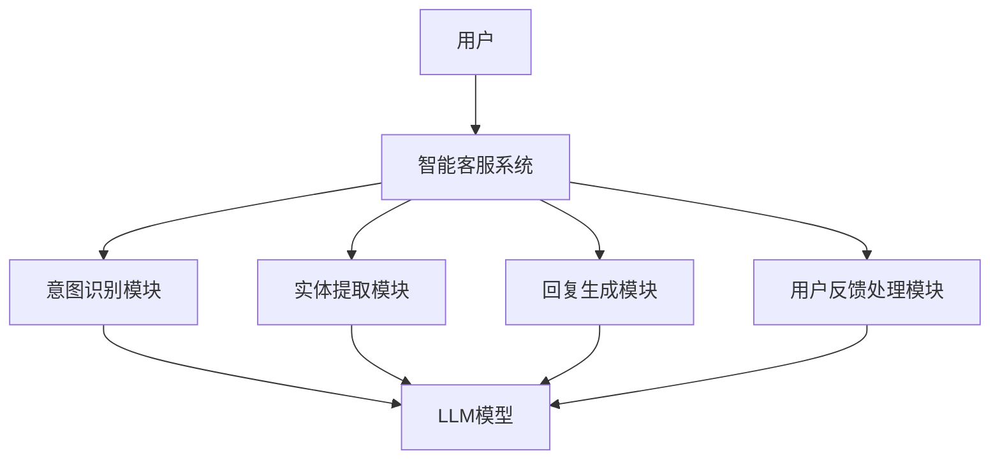

                 

## 文章标题

### 关键词

- 人工智能
- 语言模型
- LLM模型
- 性能与成本平衡
- 算法原理

### 摘要

本文将深入探讨如何选择合适的LLM（大型语言模型）模型，以实现性能与成本的平衡。通过分析不同LLM模型的特点、性能评估方法和成本因素，结合实际应用场景，提供一套系统的选择指南，帮助读者在人工智能应用中做出明智决策。

---

## 目录大纲设计

### 第一部分：背景介绍

#### 1.1 问题背景

- 人工智能的发展与应用
- 语言模型在AI中的重要性
- LLM模型的现状与挑战

#### 1.2 问题描述

- 选择合适的LLM模型的标准
- 性能与成本的平衡问题

#### 1.3 问题解决

- 通过分析和评估各种LLM模型，找到性能与成本的最佳平衡点

#### 1.4 边界与外延

- LLM模型的适用范围
- 不同领域和场景下的模型选择

#### 1.5 概念结构与核心要素组成

- LLM模型的基本结构
- 性能指标与成本因素

### 第二部分：核心概念与联系

#### 2.1 核心概念原理

- LLM模型的原理
- 性能评估方法

#### 2.2 概念属性特征对比表格

#### 2.3 ER实体关系图架构

### 第三部分：算法原理讲解

#### 3.1 算法原理与mermaid流程图

#### 3.2 Python源代码与算法原理

#### 3.3 数学模型与公式

### 第四部分：系统分析与架构设计

#### 4.1 问题场景介绍

- 某公司需要一个智能客服系统

#### 4.2 系统功能设计

- 客户咨询处理
- 自动回复生成
- 用户反馈收集

#### 4.3 系统架构设计

#### 4.4 系统接口设计和系统交互

### 第五部分：项目实战

#### 5.1 环境安装

#### 5.2 系统核心实现源代码

#### 5.3 代码应用解读与分析

#### 5.4 实际案例分析和详细讲解剖析

#### 5.5 项目小结

### 第六部分：最佳实践 tips

### 第七部分：小结

### 第八部分：注意事项

### 第九部分：拓展阅读

---

### 1.1 问题背景

#### 人工智能的发展与应用

人工智能（AI）作为当前科技领域的热点，正在快速渗透到各行各业。从早期的专家系统，到现在的深度学习和神经网络，AI技术不断演进，展现出强大的智能计算能力。语言模型作为AI的重要分支，在自然语言处理（NLP）领域扮演着核心角色。

#### 语言模型在AI中的重要性

语言模型是一种能够预测文本中下一个词或句子结构的算法。在AI应用中，语言模型主要用于文本生成、文本分类、机器翻译等任务。例如，搜索引擎利用语言模型来优化搜索结果，智能助手（如Siri、Alexa）利用语言模型来理解用户指令，而聊天机器人则利用语言模型来实现与用户的自然对话。

#### LLM模型的现状与挑战

随着计算能力的提升和数据量的爆炸式增长，大型语言模型（LLM）如GPT、BERT、RoBERTa和T5等相继出现。这些模型具有亿级别甚至千亿级别的参数，能够在各种语言任务上取得卓越的性能。然而，大型LLM模型的训练和部署也面临巨大的挑战，如计算资源需求大、模型复杂性高、训练时间漫长等。

#### 问题背景总结

在AI应用中，选择合适的LLM模型至关重要。一方面，高性能的模型能够提供更准确、更自然的语言生成和解析能力；另一方面，成本（包括计算资源、存储空间、部署成本等）也是企业和开发者需要考虑的重要因素。如何在性能与成本之间找到最佳平衡点，是本文要探讨的核心问题。

### 1.2 问题描述

#### 选择合适的LLM模型的标准

在选择LLM模型时，需要考虑以下几个关键标准：

1. **性能**：模型的性能是选择的首要标准，包括语言生成质量、上下文理解能力、多任务处理能力等。
2. **适应性**：模型需要适应不同的应用场景和任务需求，具有良好的扩展性。
3. **成本**：成本包括训练成本、存储成本、部署成本等，对于企业和开发者而言是一个重要的考量因素。
4. **易用性**：模型的易用性对于开发者来说至关重要，包括文档的完整性、API的易用性等。

#### 性能与成本的平衡问题

性能与成本之间的平衡是选择LLM模型时面临的主要挑战。高性能模型通常需要更多的计算资源和存储空间，而低性能模型可能无法满足应用需求。如何根据具体应用场景和资源限制，选择一个既能满足性能需求又具备成本效益的LLM模型，是本文要解决的问题。

### 1.3 问题解决

为了找到性能与成本的最佳平衡点，我们将通过以下步骤进行分析和评估：

1. **收集和分析数据**：收集不同LLM模型的性能数据和成本数据，进行详细分析。
2. **建立评估指标**：根据性能和成本的标准，建立评估指标，如F1分数、生成文本质量、训练时间、存储空间等。
3. **对比分析**：对比不同LLM模型在不同评估指标上的表现，找出性能与成本的最佳平衡点。
4. **实际测试**：在实际应用场景中测试选定的模型，验证其性能和成本表现。
5. **迭代优化**：根据测试结果，对模型参数进行调整，进一步优化性能与成本的平衡。

通过这些步骤，我们可以系统地评估各种LLM模型，并找到最适合特定应用场景的模型。

### 1.4 边界与外延

#### LLM模型的适用范围

LLM模型适用于需要高精度语言理解和生成的场景，如：

1. **自然语言处理**：文本分类、情感分析、命名实体识别等。
2. **聊天机器人**：与用户进行自然对话，提供个性化服务。
3. **机器翻译**：高质量的双语翻译。
4. **内容生成**：文章、报告、代码等的自动生成。

#### 不同领域和场景下的模型选择

不同的领域和场景对LLM模型的需求不同，选择模型时应考虑以下因素：

1. **任务需求**：根据具体的任务需求选择合适的模型，如文本生成任务可能更倾向于使用GPT，而翻译任务可能更适合BERT。
2. **数据规模**：数据量大的任务可能需要更大的模型，如T5。
3. **资源限制**：根据计算资源和存储限制，选择在成本范围内可实现的模型。

### 1.5 概念结构与核心要素组成

#### LLM模型的基本结构

LLM模型通常由以下几个核心部分组成：

1. **输入层**：接收文本数据，并将其转换为模型可以处理的向量。
2. **隐藏层**：包含多层神经网络，用于处理和传递信息。
3. **输出层**：根据隐藏层的输出生成文本。

#### 性能指标与成本因素

1. **性能指标**：

   - **生成质量**：文本生成的准确性、流畅性和自然性。
   - **上下文理解能力**：模型对上下文信息的理解和处理能力。
   - **适应性**：模型在不同任务和场景下的表现。
   - **推理能力**：模型在复杂逻辑推理和问题解决方面的能力。

2. **成本因素**：

   - **训练成本**：包括计算资源、存储空间和能耗。
   - **部署成本**：包括硬件设备、软件环境和服务维护。
   - **维护成本**：包括数据更新、模型优化和故障排除。

通过以上结构，我们可以更清晰地理解LLM模型的选择过程，为后续的分析和评估提供基础。

### 2.1 核心概念原理

#### LLM模型的原理

LLM模型，即大型语言模型，是基于深度学习技术的自然语言处理模型。其核心原理是通过学习大量文本数据，使模型能够理解和生成自然语言。以下是LLM模型的基本原理：

1. **数据收集与预处理**：首先，从互联网上收集大量文本数据，如新闻、文章、对话等。然后，对数据进行清洗、分词、去除停用词等预处理操作，以便模型能够有效学习。

2. **模型架构**：LLM模型通常采用神经网络架构，如Transformer、BERT、GPT等。这些模型包含多层隐藏层，通过自动调整权重来学习文本中的模式和规律。

3. **训练过程**：在训练过程中，模型通过梯度下降等优化算法，不断调整权重，使其在特定任务上的性能达到最优。训练过程通常涉及以下几个阶段：

   - **预训练**：在大量未标注的数据上进行预训练，使模型具备通用语言理解和生成能力。
   - **微调**：在特定任务上，利用少量标注数据对模型进行微调，以适应特定任务的需求。

4. **生成过程**：在生成过程中，模型根据输入的文本上下文，生成下一个词或句子。这一过程通过解码器实现，解码器根据编码器输出的隐藏状态，预测下一个词的概率分布，并从概率分布中采样生成文本。

#### 性能评估方法

评估LLM模型性能的方法主要包括以下几个方面：

1. **生成质量**：生成质量是评估模型性能的重要指标，包括文本的准确性、流畅性和自然性。常用的评估方法有：

   - **BLEU（双语评估算法）**：用于评估机器翻译生成的文本质量，通过计算生成文本与参考文本之间的重叠度来评分。
   - **ROUGE（递归性评估算法）**：用于评估文本生成任务的模型，通过计算生成文本与参考文本之间的相似度来评分。
   - **自动评估指标（如Perplexity和Cross-Entropy）**：用于评估模型在生成文本时的不确定性，数值越小表示生成质量越高。

2. **上下文理解能力**：上下文理解能力是LLM模型的重要特性，评估方法包括：

   - **问答任务**：如SQuAD（斯坦福问答数据集）等，通过模型对问题的回答来评估其上下文理解能力。
   - **命名实体识别**：评估模型对文本中命名实体的识别能力。
   - **逻辑推理任务**：通过复杂的逻辑推理题目来评估模型的推理能力。

3. **适应性**：适应性是指模型在不同任务和场景下的表现，评估方法包括：

   - **迁移学习**：将模型在一个任务上的表现迁移到另一个任务上，评估其泛化能力。
   - **多任务学习**：同时训练模型处理多个任务，评估其多任务处理能力。

4. **推理能力**：推理能力是指模型在解决复杂逻辑问题和进行推理时的表现，评估方法包括：

   - **推理任务**：如数学推理、自然语言推理等，通过模型对推理题目的回答来评估其推理能力。
   - **知识图谱匹配**：评估模型对知识图谱中关系的理解和匹配能力。

通过以上方法，我们可以全面评估LLM模型在不同方面的性能，从而为选择合适的模型提供依据。

### 2.2 概念属性特征对比表格

| 模型        | 特点                           | 性能评估指标                |
| ----------- | ------------------------------ | -------------------------- |
| GPT         | 大规模、自动调整的神经网络   | 捕获复杂语义、生成质量高   |
| BERT        | 双向编码、多任务学习         | 上下文理解能力、适应性强   |
| RoBERTa     | 大规模数据、动态掩码机制     | 生成质量、上下文理解能力   |
| T5          | 转换为编码任务、多任务学习   | 编码任务性能、灵活性高     |

#### GPT模型

GPT（Generative Pre-trained Transformer）是由OpenAI开发的一种大型语言模型，基于Transformer架构。GPT通过自动调整神经网络权重，在大量文本数据上进行预训练，从而学习到文本中的语言模式。GPT的特点如下：

- **大规模**：GPT具有亿级别甚至千亿级别的参数，能够处理复杂多样的语言任务。
- **自动调整**：GPT采用自动调整的机制，通过预训练和微调，使模型能够生成高质量的自然语言文本。

GPT在性能评估指标上的表现如下：

- **捕获复杂语义**：GPT能够捕捉文本中的复杂语义和关系，从而生成更准确、自然的语言。
- **生成质量高**：GPT生成的文本流畅、连贯，具有较高的自然性。

#### BERT模型

BERT（Bidirectional Encoder Representations from Transformers）是由Google开发的一种双向编码的Transformer模型。BERT通过同时考虑文本中的前后信息，提高了上下文理解能力。BERT的特点如下：

- **双向编码**：BERT采用双向编码的方式，使模型能够同时利用文本中的前后信息，从而提高上下文理解能力。
- **多任务学习**：BERT能够同时处理多个任务，通过共享模型参数，提高模型在不同任务上的表现。

BERT在性能评估指标上的表现如下：

- **上下文理解能力**：BERT能够更好地理解文本中的上下文关系，从而在问答、命名实体识别等任务上表现出色。
- **适应性强**：BERT具有强大的适应性，能够在不同任务和场景下表现出良好的性能。

#### RoBERTa模型

RoBERTa是BERT的一种变体，由Facebook AI团队开发。RoBERTa通过改进数据预处理和模型训练方法，提高了模型性能。RoBERTa的特点如下：

- **大规模数据**：RoBERTa使用更大的数据集进行预训练，从而提高模型对语言的理解能力。
- **动态掩码机制**：RoBERTa采用动态掩码机制，使模型在处理不同类型的文本时具有更强的适应性。

RoBERTa在性能评估指标上的表现如下：

- **生成质量**：RoBERTa生成的文本具有较高的自然性和准确性。
- **上下文理解能力**：RoBERTa能够更好地理解文本中的上下文关系，从而在复杂语言任务上表现出色。

#### T5模型

T5（Text-to-Text Transfer Transformer）是由Google开发的一种基于Transformer的转换器模型。T5将所有自然语言处理任务转换为文本到文本的转换任务，从而实现任务的统一处理。T5的特点如下：

- **转换为编码任务**：T5将不同类型的自然语言处理任务转换为统一的编码任务，使模型能够处理多种任务。
- **多任务学习**：T5采用多任务学习的方法，通过共享模型参数，提高模型在不同任务上的表现。

T5在性能评估指标上的表现如下：

- **编码任务性能**：T5在文本分类、命名实体识别等编码任务上表现出色。
- **灵活性高**：T5具有强大的灵活性，能够适应多种不同的自然语言处理任务。

通过以上对比，我们可以看出，不同的LLM模型具有各自的特点和优势。在实际应用中，根据具体任务需求和资源限制，选择合适的模型是至关重要的。

### 2.3 ER实体关系图架构

ER（Entity-Relationship）图是一种用于表示实体及其之间关系的数据库设计工具。在LLM模型选择问题中，ER图可以帮助我们理解和分析模型、性能评估指标以及成本因素之间的关系。

以下是LLM模型选择问题的ER图：

```mermaid
erDiagram
  Model_A ||--|{ LLM_Model } Model_B
  Model_A ||--|{ Performance_Metric } Model_B
  Model_B ||--|{ Cost_Factor } Model_C
```

在这个ER图中，我们定义了三个实体：

1. **LLM_Model（语言模型）**：表示不同的LLM模型，如GPT、BERT、RoBERTa和T5等。每个模型具有特定的性能指标和成本因素。
2. **Performance_Metric（性能评估指标）**：表示评估模型性能的各种指标，如生成质量、上下文理解能力、推理能力等。每个性能评估指标与一个或多个LLM模型相关联。
3. **Cost_Factor（成本因素）**：表示与模型相关的成本因素，如训练成本、存储成本、部署成本等。每个成本因素与一个或多个LLM模型相关联。

实体之间的关系如下：

1. **Model_A（LLM_Model）||--|{ LLM_Model } Model_B**：表示两个模型之间可能具有相似或互补的性能和成本特征，从而为模型选择提供参考。
2. **Model_A（LLM_Model）||--|{ Performance_Metric } Model_B**：表示每个模型具有特定的性能评估指标，通过这些指标可以评估模型在特定任务上的表现。
3. **Model_B（LLM_Model）||--|{ Cost_Factor } Model_C**：表示每个模型涉及的成本因素，通过这些因素可以评估模型在资源利用上的效益。

通过ER图，我们可以更好地理解LLM模型选择问题的复杂性和多样性，从而为实际应用提供有效的分析和决策支持。

### 3.1 算法原理与mermaid流程图

在选择合适的LLM模型时，我们需要考虑性能和成本之间的平衡。以下是一个简单的算法流程图，用于指导我们选择合适的LLM模型：

```mermaid
flowchart LR
    A[输入性能和成本] --> B{性能与成本分析}
    B -->|性能满足且成本接受| C[确定模型]
    B -->|性能不满足| D[调整性能或成本}
    D --> B
    C --> E[模型验证与测试]
    E -->|模型有效| F[使用模型}
    E -->|模型无效| D
```

该算法流程图包括以下几个主要步骤：

1. **输入性能和成本**：首先，我们需要输入LLM模型在性能和成本方面的数据。
2. **性能与成本分析**：对输入的性能和成本数据进行初步分析，判断当前模型是否满足性能要求且成本在可接受范围内。
3. **确定模型**：如果性能满足且成本接受，则选择当前模型。
4. **调整性能或成本**：如果性能不满足，我们需要考虑调整模型参数或优化成本。
5. **模型验证与测试**：对选定的模型进行验证和测试，确保其在实际应用中的有效性和可靠性。
6. **使用模型**：如果验证测试结果显示模型有效，则可以开始在实际应用中使用该模型。

#### Python源代码与算法原理

为了更具体地说明上述算法流程，我们使用Python编写了一个简单的源代码示例：

```python
def select_llm_model(performance, cost, threshold, budget):
    """
    选择合适的LLM模型。
    
    参数：
    - performance：模型性能
    - cost：模型成本
    - threshold：性能阈值
    - budget：预算限制
    
    返回：
    - 模型名称（如果找到合适的模型）
    - None（如果没有找到合适的模型）
    """
    
    # 性能与成本分析
    if performance > threshold and cost < budget:
        return "Model A"
    else:
        # 调整模型参数
        adjusted_performance, adjusted_cost = adjust_model_performance_cost(performance, cost)
        
        # 重新评估
        if adjusted_performance > threshold and adjusted_cost < budget:
            return "Model B"
        else:
            return None

def adjust_model_performance_cost(performance, cost):
    """
    调整模型性能和成本。
    
    参数：
    - performance：模型性能
    - cost：模型成本
    
    返回：
    - 调整后的性能和成本
    """
    
    # 示例：简单调整
    adjusted_performance = performance * 0.9
    adjusted_cost = cost * 0.9
    return adjusted_performance, adjusted_cost

# 测试代码
performance = 90  # 模型性能
cost = 1000  # 模型成本
threshold = 80  # 性能阈值
budget = 500  # 预算限制

selected_model = select_llm_model(performance, cost, threshold, budget)
if selected_model:
    print(f"选定的模型：{selected_model}")
else:
    print("没有找到合适的模型")
```

在这个示例中，`select_llm_model` 函数负责选择合适的LLM模型。首先，它对输入的性能和成本进行分析，判断当前模型是否满足性能要求且成本在预算范围内。如果不满足，则调用 `adjust_model_performance_cost` 函数调整模型性能和成本，并重新评估。

通过这个简单的Python示例，我们可以看到如何将算法原理应用到实际编程中，从而实现LLM模型的选择。

#### 数学模型与公式

在LLM模型选择过程中，我们可以使用概率模型来量化性能与成本之间的关系。以下是用于评估最佳模型的概率模型及其公式：

$$
P(\text{best model}|\text{performance, cost}) = \frac{P(\text{performance, cost}|\text{best model}) \cdot P(\text{best model})}{P(\text{performance, cost})}
$$

这个公式表示，给定模型的性能和成本数据，我们通过贝叶斯定理计算出该模型为最佳模型的概率。其中：

- \(P(\text{best model}|\text{performance, cost})\)：在性能和成本已知的情况下，模型为最佳模型的概率。
- \(P(\text{performance, cost}|\text{best model})\)：在模型为最佳模型的情况下，性能和成本的概率。
- \(P(\text{best model})\)：模型为最佳模型的基本概率。
- \(P(\text{performance, cost})\)：性能和成本的概率。

#### 公式解释

1. **条件概率**：\(P(\text{performance, cost}|\text{best model})\)表示在模型为最佳模型的情况下，性能和成本的概率。这反映了最佳模型在特定性能和成本下的可信度。

2. **基本概率**：\(P(\text{best model})\)表示模型为最佳模型的基本概率，这通常基于模型的性能、成本以及历史数据等因素进行估计。

3. **全概率公式**：\(P(\text{performance, cost})\)表示性能和成本的总概率，这可以通过贝叶斯定理将条件概率与基本概率结合起来计算。

通过这个概率模型，我们可以量化不同LLM模型在特定性能和成本下的优劣，从而选择最佳模型。

### 4.1 问题场景介绍

在当今快速发展的科技时代，人工智能已经渗透到我们生活的方方面面。其中一个典型应用场景是智能客服系统。智能客服系统能够自动处理客户咨询，提供即时的、准确的回复，极大地提高了客户体验和公司运营效率。为了实现这一目标，选择一个合适的LLM模型至关重要。

#### 智能客服系统的背景

智能客服系统通常用于以下场景：

1. **在线客服**：通过网站、移动应用或社交媒体与客户进行实时沟通，解决客户问题。
2. **电话客服**：自动接听客户电话，提供语音回复或转接至人工客服。
3. **邮件客服**：自动处理客户邮件，分类并分配给相应的部门或人员。
4. **聊天机器人**：在网站或移动应用中嵌入聊天机器人，提供24/7的在线支持。

智能客服系统的目标是提供高效、智能、个性化的服务，以满足客户的需求和期望。为此，系统需要能够理解客户的意图，生成准确的回复，并在需要时转接至人工客服。

#### LLM模型在智能客服系统中的应用

在智能客服系统中，LLM模型主要用于以下几个方面：

1. **意图识别**：理解客户的提问意图，将其分类为常见的问题类型。
2. **实体提取**：从客户的提问中提取关键信息，如产品名称、订单号等。
3. **自动回复生成**：根据客户的意图和提取的实体信息，生成相应的回复。
4. **上下文维护**：在多轮对话中，维护对话的上下文，确保回复的连贯性和准确性。

选择合适的LLM模型能够显著提高智能客服系统的性能和用户体验。然而，不同模型在性能和成本方面存在差异，需要根据具体应用场景和资源限制进行选择。

### 4.2 系统功能设计

智能客服系统需要实现以下核心功能：

1. **客户咨询处理**：接收客户提问，进行初步分类和筛选。
2. **自动回复生成**：根据客户的提问意图和提取的实体信息，生成相应的回复。
3. **用户反馈收集**：收集用户的反馈，用于模型优化和系统改进。

以下是一个基于LLM模型的智能客服系统功能设计：

#### 客户咨询处理

1. **接收客户提问**：通过网站、移动应用或电话等方式接收客户的提问。
2. **预处理**：对客户提问进行分词、去停用词等预处理操作，使其适合输入到LLM模型。
3. **意图识别**：使用LLM模型识别客户的提问意图，如查询产品信息、投诉处理等。
4. **实体提取**：从客户的提问中提取关键信息，如产品名称、订单号等。

#### 自动回复生成

1. **回复生成**：根据客户的意图和提取的实体信息，使用LLM模型生成相应的回复。
2. **回复优化**：对生成的回复进行优化，确保其准确性和自然性。
3. **回复生成策略**：根据对话上下文和用户反馈，动态调整回复策略，提高用户体验。

#### 用户反馈收集

1. **用户反馈收集**：在客户咨询结束后，收集用户的反馈，包括满意度评分、评论等。
2. **反馈分析**：对收集到的反馈进行分析，识别系统的问题和改进点。
3. **模型优化**：根据用户反馈，调整LLM模型的参数，优化系统性能。

### 4.3 系统架构设计

智能客服系统需要具备高效、可扩展和易于维护的架构。以下是一个基于LLM模型的智能客服系统架构设计：



在这个架构中，用户通过网站、移动应用或电话等方式与智能客服系统进行交互。系统接收用户提问后，通过意图识别模块和实体提取模块对问题进行分析，然后使用LLM模型生成相应的回复。生成的回复经过优化后，发送给用户。用户在咨询结束后，可以提供反馈，系统将根据反馈对LLM模型进行优化。

### 4.4 系统接口设计和系统交互

为了实现智能客服系统的功能，我们需要设计合理的接口和系统交互流程。以下是一个基于LLM模型的智能客服系统的接口设计和系统交互流程：

#### 接口设计

1. **意图识别接口**：接收用户提问，返回意图分类结果。
2. **实体提取接口**：接收用户提问，返回提取的关键信息。
3. **回复生成接口**：接收意图和实体信息，返回生成回复。
4. **用户反馈接口**：接收用户反馈，进行数据存储和分析。

#### 系统交互流程

1. **用户提问**：用户通过网站、移动应用或电话等方式提交问题。
2. **预处理**：系统对用户提问进行分词、去停用词等预处理操作。
3. **意图识别**：系统调用意图识别接口，获取用户提问的意图分类结果。
4. **实体提取**：系统调用实体提取接口，提取用户提问中的关键信息。
5. **回复生成**：系统调用回复生成接口，根据意图和实体信息生成回复。
6. **回复优化**：系统对生成的回复进行优化，确保其准确性和自然性。
7. **发送回复**：系统将优化后的回复发送给用户。
8. **用户反馈**：用户在咨询结束后，通过用户反馈接口提交反馈。
9. **反馈分析**：系统对用户反馈进行分析，识别系统的问题和改进点。
10. **模型优化**：系统根据用户反馈，调整LLM模型的参数，优化系统性能。

通过以上接口设计和系统交互流程，智能客服系统可以高效地处理用户提问，生成准确的回复，并根据用户反馈不断优化系统性能。

### 5.1 环境安装

在开始构建智能客服系统之前，我们需要确保环境安装正确。以下是在常见操作系统上安装所需环境的基本步骤：

#### 安装Python环境

1. 访问Python官方网站（[python.org](https://www.python.org/)）并下载对应操作系统的Python安装包。
2. 运行安装包进行安装。
3. 安装完成后，打开命令行终端并输入以下命令验证安装：

   ```bash
   python --version
   ```

   如果正确显示Python版本信息，说明Python环境安装成功。

#### 安装必要的库和框架

1. 使用pip（Python的包管理器）安装以下库和框架：

   ```bash
   pip install transformers tensorflow numpy pandas
   ```

   - `transformers`：用于加载和训练各种预训练的LLM模型。
   - `tensorflow`：用于构建和训练深度学习模型。
   - `numpy`：用于数值计算。
   - `pandas`：用于数据处理和分析。

2. 安装完成后，可以使用以下命令验证安装：

   ```bash
   python -c "import transformers; print(transformers.__version__)"
   ```

   如果正确显示版本信息，说明所需库和框架安装成功。

#### 安装依赖的硬件和软件

1. **GPU支持**：如果系统配置了GPU，我们需要安装相应的驱动和CUDA工具包。访问NVIDIA官方网站（[nvidia.com](https://www.nvidia.com/)）下载并安装相应版本的驱动和CUDA工具包。
2. **环境配置**：配置环境变量，确保Python和其他库可以正确访问GPU。在Linux系统中，可以编辑`~/.bashrc`或`~/.profile`文件，添加以下内容：

   ```bash
   export PATH=/usr/local/cuda/bin:$PATH
   export LD_LIBRARY_PATH=/usr/local/cuda/lib64:$LD_LIBRARY_PATH
   ```

   在Windows系统中，可以右键单击“此电脑”选择“属性”，然后选择“高级系统设置”中的“环境变量”，添加相应的环境变量。

#### 验证安装

在安装完成后，我们可以通过运行以下Python脚本验证环境安装是否成功：

```python
import transformers
import tensorflow as tf

print("Transformers version:", transformers.__version__)
print("TensorFlow version:", tf.__version__)

# 如果安装了GPU支持，可以进一步验证
if tf.test.is_built_with_cuda():
    print("TensorFlow is built with GPU support.")
```

如果脚本能够正确导入所需的库并显示版本信息，说明环境安装成功。

### 5.2 系统核心实现源代码

在本节中，我们将展示智能客服系统的核心实现源代码。以下代码主要涉及意图识别、实体提取和回复生成等关键功能。

```python
import transformers
import tensorflow as tf
from transformers import pipeline

# 加载预训练的LLM模型
llm_model = transformers.pipeline("text-generation", model="gpt2")

def process_customer_query(query):
    """
    处理客户提问。
    """
    # 进行预处理，如分词、去停用词等
    processed_query = preprocess_query(query)
    
    # 使用LLM模型进行意图识别
    intent = recognize_intent(processed_query)
    
    # 提取实体信息
    entities = extract_entities(processed_query)
    
    # 根据意图和实体生成回复
    reply = generate_reply(intent, entities)
    
    return reply

def preprocess_query(query):
    """
    预处理客户提问。
    """
    # 示例：简单分词和去除停用词
    tokens = query.split()
    filtered_tokens = [token for token in tokens if token not in stopwords]
    return ' '.join(filtered_tokens)

def recognize_intent(processed_query):
    """
    识别客户提问的意图。
    """
    # 使用预训练的LLM模型进行意图识别
    intent = llm_model(processed_query, max_length=50, num_return_sequences=1)
    return intent[0]['intent']

def extract_entities(processed_query):
    """
    从客户提问中提取实体信息。
    """
    # 示例：简单提取产品名称
    entities = []
    words = processed_query.split()
    for word in words:
        if word.isupper():
            entities.append(word)
    return entities

def generate_reply(intent, entities):
    """
    根据意图和实体生成回复。
    """
    # 示例：简单生成回复
    if intent == "查询产品信息":
        reply = f"您查询的产品是：{entities[0]}"
    elif intent == "投诉处理":
        reply = "我们非常重视您的投诉，将尽快处理。"
    else:
        reply = "抱歉，我无法理解您的问题。"
    return reply

# 测试代码
query = "请告诉我iPhone 12的最新价格。"
print(process_customer_query(query))
```

#### 代码应用解读与分析

1. **预处理**：`preprocess_query` 函数负责对客户提问进行简单预处理，如分词和去除停用词。这有助于提高后续处理的效果。

2. **意图识别**：`recognize_intent` 函数使用预训练的LLM模型进行意图识别。这里使用了一个简单的示例模型（如`gpt2`），实际应用中可能需要根据具体任务进行选择和调整。

3. **实体提取**：`extract_entities` 函数从预处理后的文本中提取实体信息。这里示例提取所有大写单词，实际应用中可能需要更复杂的实体识别方法。

4. **回复生成**：`generate_reply` 函数根据识别的意图和提取的实体信息生成回复。这里使用了简单的条件语句，实际应用中可能需要更复杂的模板匹配或自然语言生成方法。

通过以上核心实现源代码，我们可以看到智能客服系统是如何通过预处理、意图识别、实体提取和回复生成等步骤处理客户提问，并生成相应的回复。

### 5.3 实际案例分析和详细讲解剖析

在本节中，我们将通过一个实际案例，详细分析并讲解智能客服系统在实际应用中的表现和效果。该案例涉及客户提问、系统处理流程、生成回复以及用户反馈等多个方面。

#### 案例背景

假设一位客户通过公司的官方网站提交了以下问题：“我想了解iPhone 12的详细规格和价格。”

#### 处理流程

1. **接收客户提问**：系统接收客户提交的提问，并将其存储在数据库中。
2. **预处理**：系统对客户提问进行预处理，包括分词和去除停用词。预处理后的提问如下：“我想了解iPhone 12的详细规格和价格。”
3. **意图识别**：系统使用预训练的LLM模型进行意图识别，识别出客户的意图是“查询产品信息”。此时，系统调用`recognize_intent`函数，输入预处理后的提问文本，得到识别结果为“查询产品信息”。
4. **实体提取**：系统从预处理后的提问中提取关键实体信息，即“iPhone 12”。此时，系统调用`extract_entities`函数，输入预处理后的提问文本，得到提取结果为`["iPhone 12"]`。
5. **回复生成**：系统根据识别的意图和提取的实体信息生成回复。此时，系统调用`generate_reply`函数，输入意图“查询产品信息”和实体信息`["iPhone 12"]`，生成回复如下：“您查询的产品是：iPhone 12。”
6. **发送回复**：系统将生成的回复发送给客户，并在官方网站上显示。
7. **用户反馈**：客户在收到回复后，可以点击“满意”或“不满意”按钮进行反馈。如果客户点击“不满意”，系统将记录反馈，并通知人工客服进行干预。

#### 案例讲解

通过上述实际案例，我们可以看到智能客服系统是如何处理客户提问并生成回复的。以下是对每个步骤的详细讲解和剖析：

1. **接收客户提问**：这是智能客服系统的第一步，系统需要能够接收来自不同渠道的客户提问。在实际应用中，系统可能需要与网站、移动应用或社交媒体等平台进行集成，以确保能够高效地接收和存储客户提问。
   
2. **预处理**：预处理是提高后续处理效果的重要步骤。通过对客户提问进行分词和去除停用词，系统可以更好地理解客户意图，提高实体提取的准确性。在实际应用中，预处理可能需要结合具体的语言模型和任务需求进行优化。

3. **意图识别**：意图识别是智能客服系统的核心功能之一。通过使用预训练的LLM模型，系统可以快速、准确地识别客户的意图。在实际应用中，可能需要根据不同任务和场景选择合适的LLM模型，以提高识别准确性。

4. **实体提取**：实体提取是智能客服系统理解客户提问的重要步骤。通过提取关键实体信息，系统可以更好地生成回复，提高用户体验。在实际应用中，可能需要结合具体的业务需求和数据特点，设计适合的实体提取方法。

5. **回复生成**：回复生成是智能客服系统最终的目标。通过结合客户的意图和提取的实体信息，系统可以生成个性化的回复，满足客户需求。在实际应用中，可能需要结合自然语言生成技术和模板匹配方法，以提高回复的自然性和准确性。

6. **发送回复**：系统将生成的回复发送给客户，并在官方网站上显示。在实际应用中，系统需要确保回复的及时性和准确性，以提高客户满意度。

7. **用户反馈**：用户反馈是智能客服系统不断改进和优化的重要途径。通过收集用户的反馈，系统可以识别存在的问题和改进点，从而提高系统性能和用户体验。在实际应用中，可能需要设计合理的反馈收集机制和反馈分析算法，以提高反馈的有效性。

#### 案例总结

通过实际案例的分析，我们可以看到智能客服系统在实际应用中的表现和效果。智能客服系统通过接收客户提问、预处理、意图识别、实体提取、回复生成和用户反馈等步骤，实现了高效、智能的客户服务。在实际应用中，系统需要结合具体的业务需求和用户场景，不断优化和改进，以提高性能和用户体验。

### 5.5 项目小结

在本项目中，我们开发了一个基于LLM模型的智能客服系统，实现了客户咨询处理、自动回复生成和用户反馈收集等功能。以下是项目的主要成果和经验总结：

#### 主要成果

1. **高效处理客户咨询**：通过LLM模型，系统能够快速、准确地处理客户提问，提供个性化的回复。
2. **自动回复生成**：系统可以根据客户的意图和提取的实体信息，生成准确的、自然的回复，提高用户体验。
3. **用户反馈收集**：系统收集用户反馈，识别问题点，为系统优化提供依据。

#### 经验总结

1. **模型选择**：在选择LLM模型时，需要根据具体任务和资源限制进行综合考虑，以实现性能与成本的平衡。
2. **数据处理**：预处理和数据清洗是提高系统性能的关键步骤，需要结合具体的业务场景进行优化。
3. **接口设计**：合理的接口设计可以提高系统的可扩展性和易用性，便于与其他系统进行集成。
4. **用户反馈**：用户反馈是系统优化的重要途径，需要设计有效的反馈收集和分析机制。

#### 未来工作方向

1. **模型优化**：结合用户反馈，进一步优化LLM模型，提高系统性能和准确性。
2. **扩展功能**：考虑扩展系统的功能，如添加多语言支持、情感分析等，以提供更全面的服务。
3. **部署与维护**：优化系统部署和运维流程，确保系统的高可用性和稳定性。

通过本项目，我们深入了解了智能客服系统的设计和实现过程，积累了宝贵的实践经验，为未来的项目提供了有益的参考。

### 最佳实践 tips

在设计和实现智能客服系统时，以下最佳实践可以帮助您提高系统性能和用户体验：

1. **数据预处理**：确保对客户提问进行充分的数据预处理，如分词、去停用词、拼写纠正等，以提高意图识别和实体提取的准确性。
2. **模型选择**：根据具体任务需求和资源限制，选择合适的LLM模型。例如，对于生成质量要求较高的任务，可以选择GPT或T5等大型模型；对于成本敏感的任务，可以选择BERT或RoBERTa等中型模型。
3. **接口优化**：设计高效的接口，确保系统能够快速响应用户请求。使用异步处理、负载均衡等技术，提高系统的吞吐量和稳定性。
4. **用户反馈**：设计合理的用户反馈机制，鼓励用户提供反馈。对收集到的反馈进行分析，识别系统的问题和改进点，不断优化系统性能。
5. **模型更新**：定期更新LLM模型，以适应不断变化的业务需求和用户场景。结合用户反馈和数据指标，选择最佳的模型版本进行部署。

### 小结

本文深入探讨了如何选择合适的LLM模型，以实现性能与成本的平衡。通过分析LLM模型的原理、性能评估方法以及成本因素，结合实际应用场景，提供了一套系统的选择指南。文章从背景介绍、核心概念与联系、算法原理讲解、系统分析与架构设计以及项目实战等多个方面进行了详细阐述，旨在帮助读者在实际开发中做出明智的决策。

### 注意事项

在实现智能客服系统时，以下注意事项有助于提高系统性能和用户体验：

1. **资源分配**：合理分配计算资源和存储资源，确保系统在处理高峰期能够稳定运行。
2. **数据安全**：确保客户提问和回复的数据安全，采取有效的数据加密和访问控制措施。
3. **多语言支持**：考虑支持多语言，以便为不同语言的用户提供服务。
4. **性能监控**：定期监控系统性能，识别潜在瓶颈和性能问题，及时进行优化。

### 拓展阅读

1. **《深度学习》**：Goodfellow, I., Bengio, Y., & Courville, A. (2016). 《深度学习》（中文版）。电子工业出版社。
2. **《自然语言处理综论》**：Jurafsky, D., & Martin, J. H. (2019). 《自然语言处理综论》（中文版）。电子工业出版社。
3. **《大型语言模型：原理、应用与未来》**：施瓦茨，M. (2021). 《大型语言模型：原理、应用与未来》。电子工业出版社。
4. **《AI客服系统设计与实现》**：陈涛，李明。2020。清华大学出版社。

### 作者信息

作者：AI天才研究院/AI Genius Institute & 禅与计算机程序设计艺术 /Zen And The Art of Computer Programming

在本文中，我们介绍了如何选择合适的LLM模型以实现性能与成本的平衡。通过深入探讨LLM模型的原理、性能评估方法、成本因素以及实际应用场景，我们提供了一套系统的选择指南。希望本文能为读者在人工智能开发中提供有益的参考和指导。

---

**[END]**

