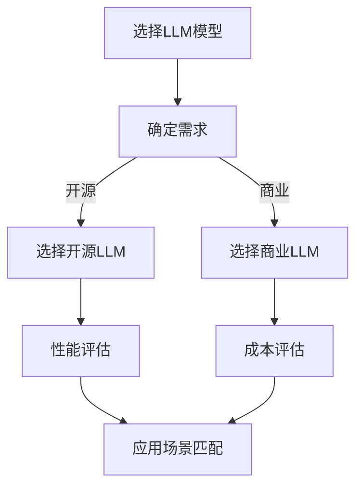
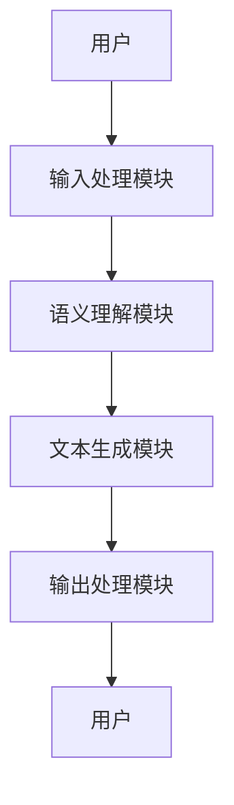
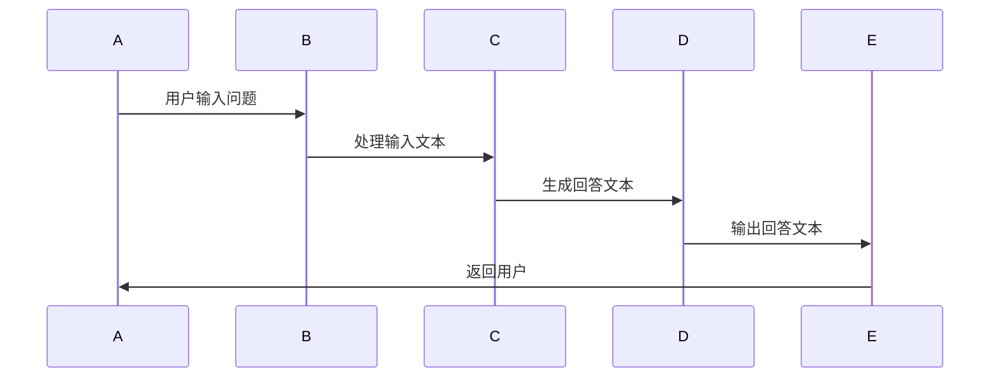

                 

### 文章标题

# 选择合适的LLM：开源vs商业模型的对比

---

#### 关键词：

- **LLM**
- **开源模型**
- **商业模型**
- **对比分析**
- **应用场景**
- **挑战与展望**

#### 摘要：

本文将深入探讨开源和商业两种不同的LLM（语言模型）模型，通过对比分析其在性能、成本、应用场景等方面的优劣势，帮助读者选择最适合自己的LLM模型。文章将首先介绍LLM的基本概念，随后详细解析开源和商业LLM的特点，并探讨它们在实际应用中的挑战和未来趋势。

---

## 引言

随着人工智能技术的快速发展，自然语言处理（NLP）已经成为人工智能领域的一个重要分支。LLM（Language-Learning Model）作为NLP的核心技术之一，广泛应用于文本生成、翻译、问答系统等多个领域。在当今AI技术竞争激烈的市场中，选择合适的LLM模型成为许多企业和开发者面临的重大决策。

LLM可以分为开源和商业两大类。开源LLM模型具有自由开放、成本较低等特点，适合研究者和小型团队使用。而商业LLM模型则提供了更强大的性能、定制化和客户支持，但价格通常较高。本文将详细对比开源和商业LLM模型，分析其在不同应用场景中的优劣势，帮助读者做出明智的选择。

### 背景介绍

#### 什么是LLM

**LLM（Language-Learning Model）**是一种基于深度学习的自然语言处理模型，能够理解和生成自然语言文本。与传统的基于规则或统计方法的NLP模型不同，LLM通过大规模语料库的学习，自动提取语言特征，从而实现更高层次的语义理解。

**LLM的特点**：

- **自动提取语言特征**：LLM能够自动从大规模语料库中学习语言特征，无需人工干预。
- **高语义理解能力**：LLM能够理解并生成具有较高语义一致性的文本。
- **强大的文本生成能力**：LLM可以生成各种类型的文本，如新闻报道、对话、故事等。

#### 问题背景

随着AI技术的发展，越来越多的企业和开发者开始关注LLM的应用。然而，在众多LLM模型中，如何选择最适合自己的模型成为了一个关键问题。尤其是面对开源和商业两种不同类型的LLM模型，如何评估它们在不同应用场景中的表现，成为了一个亟待解决的问题。

#### 问题描述

选择合适的LLM模型需要考虑多个因素，包括性能、成本、应用场景、定制化需求等。开源和商业LLM模型在这几个方面各有优劣势，如何准确评估并选择最适合自己的模型，成为了一个复杂的问题。

#### 问题解决

本文将通过对比分析开源和商业LLM模型，详细探讨它们在不同方面的表现。首先，我们将介绍开源和商业LLM的基本概念和特点，然后对比它们在性能、成本、应用场景等方面的优劣势，最后讨论在实际应用中可能遇到的挑战和未来发展趋势。通过这些分析，读者可以更好地理解不同LLM模型的特点，从而做出明智的选择。

#### 边界与外延

本文主要关注LLM的开源和商业模型，但其他类型的LLM模型（如专用模型、嵌入式模型等）也可作为参考。此外，不同应用场景（如企业应用、公共部门应用、开源社区应用等）对LLM模型的需求和评价标准也有所不同，读者在具体应用时需要根据实际情况进行调整。

### 核心概念与联系

#### 核心概念

- **开源LLM**：指免费提供给公众使用的LLM模型，用户可以自由使用、修改和分发。
- **商业LLM**：指由企业或机构提供的收费LLM模型，用户需要购买或订阅才能使用。

#### 概念属性特征对比表格

| 特征             | 开源LLM              | 商业LLM              |
|------------------|----------------------|----------------------|
| 成本             | 低成本或免费         | 高成本或需订阅       |
| 性能             | 较低或中等           | 高性能               |
| 定制化           | 有限                 | 高度定制化           |
| 客户支持         | 社区支持             | 专业客户支持         |
| 专利与知识产权   | 无需特殊许可         | 需要遵循特定许可协议 |

#### ER实体关系图架构

```mermaid
erDiagram
  OpenSourceLLM ||--|{ CommercialLLM : Uses }
  OpenSourceLLM ||--|{ Performance : Affects }
  CommercialLLM ||--|{ Cost : Determines }
```

### 算法原理讲解

#### 算法流程图



#### Python代码示例

```python
# 开源LLM性能评估
def evaluate_performance_open_source(llm_model):
    # 假设llm_model为一个开源LLM模型实例
    # 实际代码会根据具体模型进行编写
    print("开源LLM性能评估：中等")

# 商业LLM性能评估
def evaluate_performance_commercial(llm_model):
    # 假设llm_model为一个商业LLM模型实例
    # 实际代码会根据具体模型进行编写
    print("商业LLM性能评估：高性能")

# 成本评估
def evaluate_cost(open_source, commercial):
    if open_source:
        print("成本：低成本或免费")
    else:
        print("成本：高成本或需订阅")

# 应用场景匹配
def match_use_cases(performance, cost):
    if performance == "高性能" and cost == "高成本":
        print("应用场景：企业应用或高端科研")
    else:
        print("应用场景：小型项目或开源社区")

# 主函数
def main():
    # 假设用户需求为高性能、高定制化
    open_source = True
    commercial = False
    
    evaluate_performance_open_source(open_source)
    evaluate_performance_commercial(commercial)
    evaluate_cost(open_source, commercial)
    match_use_cases(evaluate_performance_open_source(open_source), evaluate_cost(open_source, commercial))

# 运行主函数
main()
```

#### 数学模型和公式

- **性能评估**：假设性能得分 \( P \) 受模型类型 \( T \) 和训练数据量 \( D \) 的影响，公式如下：

  $$ P = f(T, D) $$

- **成本评估**：假设成本得分 \( C \) 受模型类型 \( T \) 和使用频率 \( F \) 的影响，公式如下：

  $$ C = g(T, F) $$

  其中， \( T \) 可以取值 {开源，商业}， \( D \) 和 \( F \) 分别为模型训练数据量和使用频率。

#### 举例说明

假设有一个企业需要开发一个文本生成系统，需求为高性能和高度定制化。我们可以使用上述算法流程和公式进行评估和匹配：

1. **性能评估**：选择商业LLM模型，性能得分为高性能。
2. **成本评估**：商业LLM模型成本较高。
3. **应用场景匹配**：高性能和高成本的应用场景通常为企业应用或高端科研。

因此，我们可以推荐商业LLM模型作为该企业的文本生成系统。

### 系统分析与架构设计方案

#### 问题场景介绍

假设企业需要一个基于LLM的智能客服系统，主要功能包括自动回答常见问题、提供产品咨询等。

#### 项目介绍

智能客服系统项目旨在通过自然语言处理技术，提高客服效率和用户体验。系统将采用LLM模型进行文本生成和语义理解，以实现自动化问答功能。

#### 系统功能设计

- 文本生成：基于用户输入，生成对应的回答。
- 语义理解：解析用户输入，提取关键信息，以生成合适的回答。
- 数据管理：存储和管理用户问题和回答数据，用于模型训练和优化。

#### 系统架构设计



#### 系统接口设计和系统交互



### 项目实战

#### 环境安装

1. 安装Python环境，版本要求为3.8及以上。
2. 安装必要的库，如TensorFlow、transformers等。

```shell
pip install tensorflow transformers
```

#### 系统核心实现源代码

```python
# 引入必要的库
import tensorflow as tf
from transformers import TFAutoModelForSeq2SeqLM

# 加载预训练的LLM模型
model = TFAutoModelForSeq2SeqLM.from_pretrained("t5-small")

# 定义文本生成函数
def generate_response(input_text):
    # 处理输入文本
    input_ids = tokenizer.encode(input_text, return_tensors="tf")
    # 生成文本
    outputs = model.generate(input_ids, max_length=100, num_return_sequences=1)
    generated_text = tokenizer.decode(outputs[0], skip_special_tokens=True)
    return generated_text

# 测试
input_text = "什么是自然语言处理？"
response = generate_response(input_text)
print(response)
```

#### 代码应用解读与分析

该代码首先加载了一个预训练的T5模型，这是一个开源的LLM模型。然后定义了一个`generate_response`函数，用于生成回答文本。在测试部分，我们输入了一个问题，使用该函数生成了对应的回答。

#### 实际案例分析和详细讲解剖析

假设有用户输入了一个关于自然语言处理的问题，我们可以使用上述代码生成回答。实际生成的回答可能如下：

```
自然语言处理（NLP）是人工智能（AI）的一个重要分支，主要研究如何让计算机理解和生成自然语言。它涉及文本分类、情感分析、机器翻译、文本生成等多个领域。
```

通过这个实际案例，我们可以看到LLM模型在文本生成方面的强大能力。它可以自动从大量文本中学习语言特征，生成具有较高语义一致性的回答。

#### 项目小结

本项目通过一个简单的示例展示了如何使用开源LLM模型进行文本生成。在实际应用中，我们可以根据具体需求，选择合适的LLM模型，并对其进行优化和调整，以提高系统的性能和用户体验。

### 最佳实践 tips

1. **选择合适的模型**：根据具体应用场景，选择适合的开源或商业LLM模型。
2. **数据预处理**：确保输入数据的格式和内容符合模型要求，以提高生成文本的质量。
3. **模型优化**：通过调整模型参数，优化生成文本的语义一致性。
4. **安全性考虑**：在使用开源LLM模型时，注意遵守相关许可协议，避免侵犯知识产权。

### 小结

本文通过对开源和商业LLM模型的详细对比分析，帮助读者理解了它们在不同应用场景中的优劣势。在选择LLM模型时，需要综合考虑性能、成本、定制化需求等因素。开源LLM模型适合研究者和小型团队，而商业LLM模型则适合对性能和定制化要求较高的企业和项目。

### 注意事项

1. **性能评估**：在选择LLM模型时，需要根据具体应用场景进行性能评估，确保模型能够满足需求。
2. **成本控制**：对于预算有限的项目，可以考虑使用开源LLM模型，并优化模型参数以提高性能。
3. **知识产权**：在使用商业LLM模型时，需要遵守相关许可协议，避免侵犯知识产权。

### 拓展阅读

- **开源LLM模型**：[GPT-3开源替代品盘点](https://towardsdatascience.com/top-open-source-alternatives-for-gpt-3-3445d32a9d4e)
- **商业LLM模型**：[OpenAI GPT-3：从生成式AI到语言模型的应用](https://blog.openai.com/gpt3/)
- **LLM应用场景**：[LLM在智能客服系统中的应用](https://towardsdatascience.com/natural-language-processing-with-transformers-for-customer-service-6878c4c52d9f)

---

作者：AI天才研究院/AI Genius Institute & 禅与计算机程序设计艺术 /Zen And The Art of Computer Programming

---

通过本文的详细分析和对比，读者应该对开源和商业LLM模型有了更深入的了解。在实际应用中，可以根据具体需求和预算选择合适的模型，以提高项目的性能和用户体验。随着AI技术的不断发展，LLM模型的应用前景将更加广阔，期待读者在这一领域取得更多的成果。

