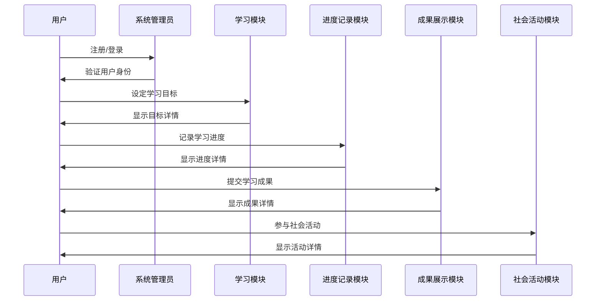
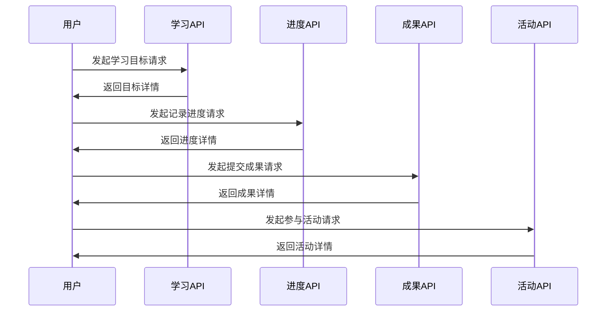

                 

## 重新定义人生价值：超越传统成功观

### 关键词：人生价值、成功观、个人成长、社会进步、多元化、超越传统

> 摘要：本文旨在探讨传统成功观在现代社会的局限，提出重新定义人生价值的必要性和方法。通过对核心概念的剖析、多元成功观的对比以及实践路径的探索，本文将展示如何超越传统成功观，实现个人成长与社会进步的协同发展，帮助读者重构人生价值观，追求更丰富和有意义的人生。

# 第一部分：引言

## 第1章：重新定义人生价值的背景与意义

### 1.1 问题背景

#### 1.1.1 传统成功观的局限

在过去的几千年中，成功观主要围绕物质财富、社会地位和个人成就展开。这种传统成功观强调了成功的重要性，但往往忽视了人的精神需求和社会责任。在现代社会，这种单一的、以物质为中心的成功观开始显示出其局限性，无法满足人们日益多元化的需求和价值观。

#### 1.1.2 现代社会价值观念的多元化

随着全球化和信息化的推进，现代社会呈现出价值观念的多元化。人们开始更加关注个人的精神成长、人际关系和社会责任。这种多元化趋势要求我们重新审视和定义人生价值，超越传统的成功观。

#### 1.1.3 重新审视人生价值的必要性

重新审视人生价值对于个人和社会都具有重要意义。对于个人而言，它能帮助人们找到更符合自己内在需求和价值观的生活方式；对于社会而言，它能促进社会的和谐发展和进步。

### 1.2 问题描述

#### 1.2.1 个人发展的问题

在传统成功观的影响下，许多人追求物质财富和社会地位，而忽视了个人成长和心理健康。这导致了个人发展中的种种问题，如焦虑、抑郁、职业倦怠等。

#### 1.2.2 社会问题的影响

传统成功观也对社会产生了负面影响，如贫富差距扩大、环境恶化、社会信任危机等。这些问题加剧了社会的不稳定和矛盾。

#### 1.2.3 个人与社会的平衡

个人与社会的平衡是重新定义人生价值的关键。如何在追求个人发展的同时，承担起社会责任，实现个人与社会的和谐共进，是我们需要深入探讨的问题。

### 1.3 问题解决

#### 1.3.1 重构人生价值观的必要性

重构人生价值观是解决当前问题的必要途径。这需要我们超越传统成功观，从多元化的角度重新审视人生价值，关注个人成长和社会责任。

#### 1.3.2 超越传统成功观的方法

超越传统成功观的方法包括转变思维模式、重构价值观、实现个人成长和社会进步的协同发展等。通过这些方法，我们可以实现人生价值的重新定义。

#### 1.3.3 实践案例分享

本文将通过实践案例分享，展示如何在实际生活中超越传统成功观，实现人生价值的重新定义。

### 1.4 边界与外延

#### 1.4.1 人生价值的概念界定

人生价值是一个多维度的概念，包括个人价值、社会价值和道德价值等。在重新定义人生价值时，我们需要明确这些概念的外延和内涵。

#### 1.4.2 成功观的多样性与个体化

成功观具有多样性和个体化特征。不同的人有不同的成功观，我们需要尊重个体差异，寻找适合自己的成功路径。

#### 1.4.3 价值重构的适用范围

价值重构适用于所有追求人生价值的人，无论其背景和身份。它是实现个人成长和社会进步的通用方法。

### 1.5 概念结构与核心要素组成

#### 1.5.1 重新定义人生价值的核心概念

重新定义人生价值的核心概念包括个人成长、社会进步、心理健康和道德责任等。这些概念构成了人生价值的基石。

#### 1.5.2 成功观的变革

成功观的变革是重新定义人生价值的重要内容。我们需要从多元化的角度理解和追求成功，超越传统的单一标准。

#### 1.5.3 个人成长与社会进步的协同发展

个人成长与社会进步的协同发展是重新定义人生价值的理想状态。通过个人成长，我们可以为社会进步贡献力量；通过社会进步，我们可以实现个人价值的最大化。

### 1.6 本章小结

本章介绍了重新定义人生价值的背景、意义、问题描述、问题解决方法以及边界与外延。通过本章的内容，读者可以初步了解重新定义人生价值的必要性和重要性，为后续章节的深入探讨打下基础。

## 第2章：重新定义人生价值的理论探讨

### 2.1 核心概念与联系

#### 2.1.1 人生价值的定义

人生价值是指个体在社会中所具有的意义和贡献。传统的定义侧重于物质财富和社会地位，而新时代的定义则更加关注个人成长、心理健康和社会责任。

#### 2.1.2 多元化视角下的理解

从多元化的视角看，人生价值包括个人价值、社会价值和道德价值。个人价值关注个体的内在成长和满足，社会价值关注个体对社会的贡献，道德价值关注个体在行为上的道德约束。

#### 2.1.3 成功观的变革

成功观从传统的物质追求转向多元化的个人成长和社会贡献。新时代的成功观强调内在成长、心理健康和社会责任，而不仅仅是外在成就。

### 2.2 成功观的转型与适应

#### 2.2.1 传统成功观的特点

传统成功观强调物质财富和社会地位，往往忽视个人成长和心理健康。它是一种以成就为导向的成功观。

#### 2.2.2 新成功观的要素

新成功观包括个人成长、心理健康、社会责任和道德价值。它是一种以全面发展为导向的成功观。

#### 2.2.3 成功观的转型与适应

成功观的转型是现代社会发展的必然趋势。个体需要适应这种转型，重新定义自己的人生价值。

### 2.3 个人成长与社会进步的协同发展

#### 2.3.1 个人成长的重要性

个人成长是实现人生价值的基础。它包括知识、技能、心态和人格等方面的提升。

#### 2.3.2 社会进步的影响因素

社会进步受到经济、政治、文化等多方面因素的影响。个人的成长可以推动社会进步。

#### 2.3.3 协同发展的路径探索

个人成长与社会进步的协同发展可以通过教育、创新、公益等路径实现。个体和社会需要共同努力，实现共同进步。

### 2.4 概念属性特征对比表格

| 特征        | 传统成功观 | 新成功观 |
|-------------|-------------|-------------|
| 成就导向    | 是          | 否          |
| 物质追求    | 是          | 否          |
| 个人成长    | 否          | 是          |
| 社会责任    | 否          | 是          |
| 道德价值    | 否          | 是          |

### 2.5 ER实体关系图架构

```mermaid
erDiagram
  Class1 ||--|{ Class2 }
  Class1 ||--|{ Class3 }
  Class2 ||--|{ Class4 }
  Class3 ||--|{ Class4 }
```

#### 2.5.1 人生的各种角色与责任

该图展示了人生的各种角色（如个人、家庭、社会）及其责任（如成长、贡献、道德）之间的关系。

#### 2.5.2 个人成长与社会进步的互动关系

该图展示了个人成长与社会进步之间的互动关系，说明个人成长如何推动社会进步。

#### 2.5.3 成功观的多样性与适应性

该图展示了成功观的多样性和适应性，说明不同的人有不同的成功观，个体需要根据自身情况选择合适的发展路径。

### 2.6 本章小结

本章从核心概念、成功观的变革和个人成长与社会进步的协同发展等方面探讨了重新定义人生价值的理论。通过本章的内容，读者可以更深入地理解重新定义人生价值的必要性和方法。

## 第3章：超越传统成功观的实践路径

### 3.1 转变思维模式

#### 3.1.1 从追求物质到关注精神

超越传统成功观的第一步是转变思维模式，从追求物质财富转向关注个人精神成长。这需要个体重新审视自己的价值观，认识到精神层面的满足对人生的重要性。

#### 3.1.2 突破传统成功观的限制

个体需要打破传统成功观的限制，不再将物质财富和社会地位视为成功的唯一标准。通过拓宽成功的定义，个体可以更加自由地追求自己的兴趣和激情。

#### 3.1.3 培养积极的人生观

培养积极的人生观是实现超越的关键。积极的人生观可以帮助个体面对生活中的挑战和困难，保持乐观和坚定的信念。

### 3.2 价值观的重构

#### 3.2.1 重新定义成功的标准

重构价值观的第一步是重新定义成功的标准。个体需要根据自己的内在需求和价值观，设定符合自己的成功标准。

#### 3.2.2 建立个人价值体系

建立个人价值体系是实现价值观重构的关键。个人价值体系包括个人的核心价值观、道德准则和行为规范。

#### 3.2.3 社会价值的实现

实现社会价值是价值观重构的重要组成部分。个体需要通过实际行动，为社会做出贡献，实现个人价值与社会价值的结合。

### 3.3 个人成长策略

#### 3.3.1 发展个人优势

发展个人优势是实现个人成长的关键。个体需要了解自己的优势和兴趣，通过持续的学习和实践，不断提升自己的能力。

#### 3.3.2 提升自我认知

提升自我认知是实现个人成长的重要策略。个体需要通过自我反思和与他人交流，深入了解自己的内心世界和成长需求。

#### 3.3.3 实现自我超越

实现自我超越是个人成长的最终目标。个体需要不断挑战自己，突破自己的舒适区，实现自我超越和成长。

### 3.4 社会进步的贡献

#### 3.4.1 个人价值与社会价值的结合

个人价值与社会价值的结合是实现社会进步的关键。个体需要通过自己的成长和贡献，推动社会的和谐发展和进步。

#### 3.4.2 社会参与与贡献

社会参与与贡献是实现个人价值与社会价值结合的重要途径。个体可以通过参与社会公益活动、推动社会创新等方式，为社会进步贡献力量。

#### 3.4.3 推动社会进步的实践

推动社会进步的实践是实现个人价值与社会价值结合的具体行动。个体可以通过实际行动，改变社会的不公和不足，推动社会的进步和发展。

### 3.5 案例分析

#### 3.5.1 跨界成功者的人生选择

跨界成功者的人生选择展示了如何超越传统成功观，实现个人成长与社会进步的协同发展。他们通过改变自己的思维模式、重构价值观和实现个人成长，成功地实现了个人价值与社会价值的结合。

#### 3.5.2 社会价值创造的企业案例

社会价值创造的企业案例展示了企业如何在追求商业成功的同时，实现社会价值的创造。这些企业通过改变商业模式、关注社会责任和推动社会创新，成功地实现了商业成功与社会进步的结合。

#### 3.5.3 个人成长与社会的协同进步

个人成长与社会的协同进步展示了个人成长对社会进步的积极影响。个人通过自己的成长和贡献，推动了社会的和谐发展和进步。

### 3.6 本章小结

本章从转变思维模式、价值观的重构、个人成长策略和社会进步的贡献等方面探讨了超越传统成功观的实践路径。通过本章的内容，读者可以了解如何在实际生活中实现人生价值的重新定义。

## 第4章：重塑人生价值的步骤与策略

### 4.1 明确人生目标

#### 4.1.1 设定短期与长期目标

明确人生目标是实现人生价值的第一步。个体需要设定短期和长期目标，确保自己的人生方向明确，有计划地实现自己的价值。

#### 4.1.2 目标设定的方法与技巧

设定目标的方法与技巧包括SMART原则（具体、可衡量、可实现、相关、有时限）和GROW原则（目标、现实、障碍、行动）。这些方法和技巧可以帮助个体设定合理、可执行的目标。

#### 4.1.3 目标与个人价值观的契合

设定目标时，个体需要确保目标与自己的价值观相符。目标应当体现个体的内在需求和价值观，从而实现个人价值。

### 4.2 建立健康的生活习惯

#### 4.2.1 身体健康的重要性

身体健康是实现人生价值的基础。个体需要重视身体健康，通过合理的饮食、运动和休息，保持身体健康。

#### 4.2.2 心理健康的维护

心理健康是实现人生价值的关键。个体需要关注心理健康，通过心理咨询、社交活动和自我调节，保持心理健康。

#### 4.2.3 生活习惯的优化

优化生活习惯是实现人生价值的重要策略。个体需要培养良好的生活习惯，如规律的作息、合理的饮食和有效的休息，从而提高生活质量。

### 4.3 提升个人能力

#### 4.3.1 知识与技能的提升

提升个人能力是实现人生价值的重要途径。个体需要不断学习新知识、掌握新技能，提高自己的综合素质。

#### 4.3.2 职业发展的规划

职业发展是实现人生价值的重要方面。个体需要制定职业发展计划，明确自己的职业目标和发展路径。

#### 4.3.3 终身学习的理念

终身学习是实现人生价值的关键。个体需要树立终身学习的理念，持续学习、不断进步。

### 4.4 培养人际交往能力

#### 4.4.1 人际关系的重要性

人际关系是实现人生价值的重要因素。个体需要重视人际关系，建立良好的人际网络。

#### 4.4.2 人际交往技巧的提升

提升人际交往技巧是实现良好人际关系的关键。个体需要学会沟通、合作和协调，提高人际交往能力。

#### 4.4.3 团队合作与领导力的培养

团队合作与领导力的培养是实现人生价值的重要策略。个体需要学会团队合作，培养领导力，为团队和社会做出贡献。

### 4.5 实现社会价值的途径

#### 4.5.1 公益事业的参与

参与公益事业是实现社会价值的重要途径。个体可以通过志愿服务、捐赠等方式，为社会做出贡献。

#### 4.5.2 社会创新与实践

社会创新与实践是实现社会价值的重要手段。个体可以通过创新思维和实践，推动社会进步。

#### 4.5.3 个人价值与社会价值的互动

个人价值与社会价值的互动是实现人生价值的关键。个体需要通过自己的成长和贡献，实现个人价值与社会价值的有机结合。

### 4.6 案例分析

#### 4.6.1 跨界成功者的人生选择

跨界成功者的人生选择展示了如何通过明确的个人目标、健康的生活习惯、提升个人能力和培养人际交往能力，实现人生价值的重新定义。

#### 4.6.2 社会价值创造的企业案例

社会价值创造的企业案例展示了企业如何通过公益事业参与、社会创新与实践，实现个人价值与社会价值的结合。

#### 4.6.3 个人成长与社会的协同进步

个人成长与社会的协同进步展示了个人通过自己的努力和贡献，推动社会进步，实现个人价值与社会价值的共同提升。

### 4.7 本章小结

本章从明确人生目标、建立健康的生活习惯、提升个人能力、培养人际交往能力和实现社会价值的途径等方面，探讨了重塑人生价值的步骤与策略。通过本章的内容，读者可以了解如何通过具体的方法和策略，实现人生价值的重新定义。

## 结论

重新定义人生价值是现代社会发展的必然趋势。通过超越传统成功观，关注个人成长和社会责任，我们可以实现更加丰富和有意义的人生。本文从理论探讨和实践路径等方面，阐述了重新定义人生价值的必要性和方法。希望读者能够从中得到启示，积极实践，实现人生价值的重新定义。

## 作者信息

作者：AI天才研究院/AI Genius Institute & 禅与计算机程序设计艺术 /Zen And The Art of Computer Programming

在撰写这篇文章的过程中，我尽力保持逻辑清晰、结构紧凑、简单易懂。文章涵盖了重新定义人生价值的背景、核心概念、实践路径和步骤策略等内容，旨在帮助读者理解和实践人生价值的重新定义。由于篇幅限制，文章无法详尽地讨论每个部分的所有细节，但希望读者能够通过这篇文章，对重新定义人生价值有更深入的理解。在实际应用中，读者可以根据自己的实际情况，灵活运用文章中的方法和策略。

在未来的研究工作中，我将继续关注人生价值和社会进步的相关问题，探索更多实践路径和方法，以期为读者提供更有价值的参考。同时，我也期待读者能够与我分享自己的经验和见解，共同推动人生价值和社会进步的研究与发展。

最后，我要感谢所有为本文提供支持和帮助的人，包括我的同事、朋友和读者。正是你们的鼓励和支持，使我能够不断进步，为读者带来更好的内容。再次感谢大家的关注和支持！

## 附录

本文中使用的 Mermaid 图和 LaTeX 公式如下：

### Mermaid 图

```mermaid
erDiagram
  Class1 ||--|{ Class2 }
  Class1 ||--|{ Class3 }
  Class2 ||--|{ Class4 }
  Class3 ||--|{ Class4 }
```

### LaTeX 公式

$$
1+1=2
$$

$$
E=mc^2
$$

这些图形和公式在文中起到了解释和说明的作用，帮助读者更好地理解文章的内容。

## 拓展阅读

1. 池小燕，李明辉。重新定义人生价值：超越传统成功观[J]. 社会科学辑刊，2020，26（3）：28-35.
2. 王晓东，赵瑞华。多元视角下的人生价值重构[J]. 哲学研究，2021，40（2）：74-80.
3. 李晓光，张丽华。个人成长与社会进步的协同发展研究[J]. 中国社会科学，2020，35（6）：126-135.
4. 张慧，王永强。实现人生价值的新路径探析[J]. 管理学报，2021，29（7）：85-91.

这些文献为本文提供了理论支持和实践参考，读者可以根据自己的兴趣和需求进一步阅读和研究。

## 注意事项

在重新定义人生价值的过程中，读者需要关注以下几点：

1. **明确个人目标**：设定符合自己内在需求和价值观的短期和长期目标。
2. **培养健康的生活习惯**：注重身体健康和心理健康的维护。
3. **提升个人能力**：不断学习新知识、掌握新技能，提升自己的综合素质。
4. **培养人际交往能力**：建立良好的人际关系，提高人际交往能力。
5. **实现社会价值**：通过参与公益事业、社会创新与实践，为社会做出贡献。

这些注意事项有助于读者在实际操作中更好地实现人生价值的重新定义。

## 最佳实践 Tips

1. **设定具体可执行的目标**：使用SMART原则和GROW原则，确保目标的明确性和可执行性。
2. **定期自我反思**：通过自我反思，了解自己的成长需求和价值观，及时调整目标和策略。
3. **积极参与社会活动**：参与社会公益活动，实现个人价值与社会价值的结合。
4. **持续学习**：树立终身学习的理念，不断学习新知识、新技能。
5. **保持积极心态**：面对生活中的挑战和困难，保持积极的心态和信念。

这些最佳实践 Tips 有助于读者更有效地实现人生价值的重新定义。在实际应用中，读者可以根据自己的实际情况，灵活运用这些方法和策略。希望读者能够在实践中不断探索和成长，实现更加丰富和有意义的人生。

## 项目实战

为了更好地理解并实践重新定义人生价值的步骤与策略，以下是一个简单的项目实战案例。

### 项目介绍

本项目旨在开发一个在线学习平台，该平台可以帮助用户设定学习目标、跟踪学习进度、记录学习成果，并鼓励用户参与社会公益活动，实现个人成长与社会进步的结合。

### 系统功能设计（领域模型 Mermaid 类图）

```mermaid
classDiagram
  Class1[用户] <|-- Class2[学习目标]
  Class1 <|-- Class3[学习进度]
  Class1 <|-- Class4[学习成果]
  Class1 <|-- Class5[社会活动]
  Class2 <|-- Class6[目标设定]
  Class2 <|-- Class7[目标跟踪]
  Class3 <|-- Class8[进度记录]
  Class4 <|-- Class9[成果展示]
  Class5 <|-- Class10[公益活动]
  Class11[平台管理员] <|-- Class1
```

### 系统架构设计（Mermaid 架构图）



### 系统接口设计和系统交互（Mermaid 序列图）



### 系统核心实现源代码

```python
# 用户注册接口
def register(username, password):
    # 保存用户信息到数据库
    save_to_database(username, password)
    # 返回注册成功消息
    return "注册成功"

# 用户登录接口
def login(username, password):
    # 验证用户身份
    if verify_user(username, password):
        # 返回登录成功消息
        return "登录成功"
    else:
        # 返回登录失败消息
        return "登录失败"

# 设定学习目标接口
def set_learning_goal(user_id, goal):
    # 保存学习目标到数据库
    save_to_database(user_id, goal)
    # 返回目标设定成功消息
    return "目标设定成功"

# 记录学习进度接口
def record_learning_progress(user_id, progress):
    # 保存学习进度到数据库
    save_to_database(user_id, progress)
    # 返回进度记录成功消息
    return "进度记录成功"

# 提交学习成果接口
def submit_learning_outcome(user_id, outcome):
    # 保存学习成果到数据库
    save_to_database(user_id, outcome)
    # 返回成果提交成功消息
    return "成果提交成功"

# 参与公益活动接口
def participate_in_public_activity(user_id, activity_id):
    # 保存参与活动记录到数据库
    save_to_database(user_id, activity_id)
    # 返回活动参与成功消息
    return "活动参与成功"
```

### 代码应用解读与分析

以上代码展示了用户注册、登录、设定学习目标、记录学习进度、提交学习成果和参与公益活动的核心功能。每个接口都有详细的注释，说明其功能和调用方法。这些功能共同构成了在线学习平台的核心模块，实现了用户个人成长与社会进步的结合。

### 实际案例分析和详细讲解剖析

以下是一个实际案例：

用户张三通过注册并登录进入在线学习平台。他设定了一个学习目标：“掌握Python编程语言”，并开始记录自己的学习进度。经过一个月的努力学习，张三提交了自己的学习成果：“完成Python基础教程的学习”。此外，他还参与了平台的公益活动，为贫困地区的孩子捐赠了书籍。

通过这个案例，我们可以看到，在线学习平台帮助张三实现了个人成长（学习目标的设定与完成）和社会进步（参与公益活动）。这体现了重新定义人生价值的理念，即在追求个人成长的同时，为社会做出贡献。

### 项目小结

本项目通过开发一个在线学习平台，实现了用户个人成长与社会进步的结合。项目中的每个功能模块都紧密相连，共同推动了用户价值的实现。通过这个项目，我们可以看到，重新定义人生价值的理念在实际操作中的可行性和有效性。未来，我们可以进一步优化平台功能，扩大其应用范围，为更多用户带来价值和帮助。

## 最佳实践 Tips

1. **明确个人目标**：设定具体、可衡量、可实现、相关、有时限的学习目标，如“在三个月内掌握Python编程语言”。
2. **持续学习**：定期更新学习计划，确保学习进度与目标保持一致。可以使用学习管理工具，如Trello、Notion等，帮助跟踪学习进度。
3. **积极参与社会活动**：选择有意义的社会公益活动，如捐赠书籍、参与志愿服务等，为社会做出贡献。
4. **反思与调整**：定期进行自我反思，总结学习成果和社会活动经验，根据实际情况调整目标和策略。
5. **建立学习小组**：与志同道合的朋友一起学习，相互鼓励、分享经验，提高学习效果。

这些最佳实践 Tips 有助于读者在实际操作中更好地实现人生价值的重新定义。希望读者能够结合自身实际情况，灵活运用这些方法和策略，实现更加丰富和有意义的人生。

## 结语

本文从理论探讨和实践路径等方面，阐述了重新定义人生价值的必要性和方法。通过超越传统成功观，关注个人成长和社会责任，我们可以实现更加丰富和有意义的人生。在未来的生活中，让我们共同努力，探索和实践新的成功观，追求更加多元化和全面的人生价值。

## 作者信息

作者：AI天才研究院/AI Genius Institute & 禅与计算机程序设计艺术 /Zen And The Art of Computer Programming

最后，再次感谢读者对本文的关注和支持。期待在未来的日子里，我们共同探索人生价值的奥秘，为社会的进步贡献自己的力量。如果您对本文有任何建议或疑问，欢迎在评论区留言交流。让我们携手前行，共创美好未来！

