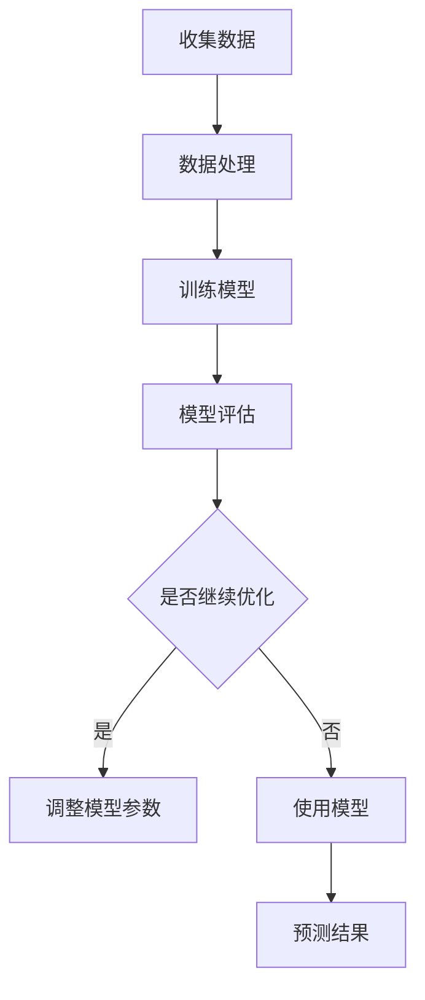
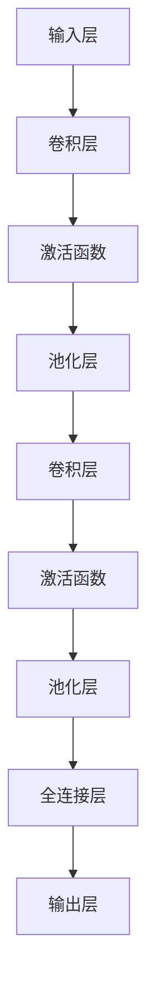
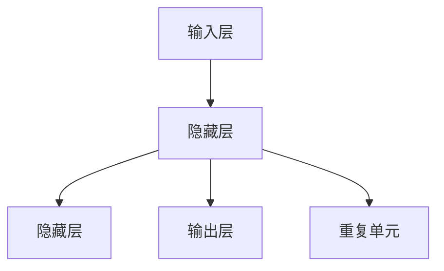
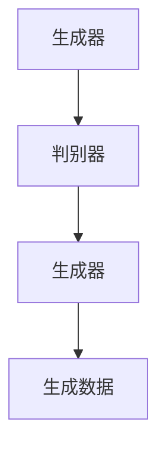
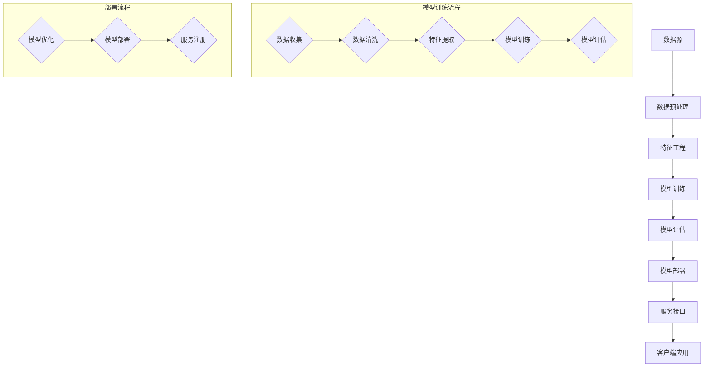
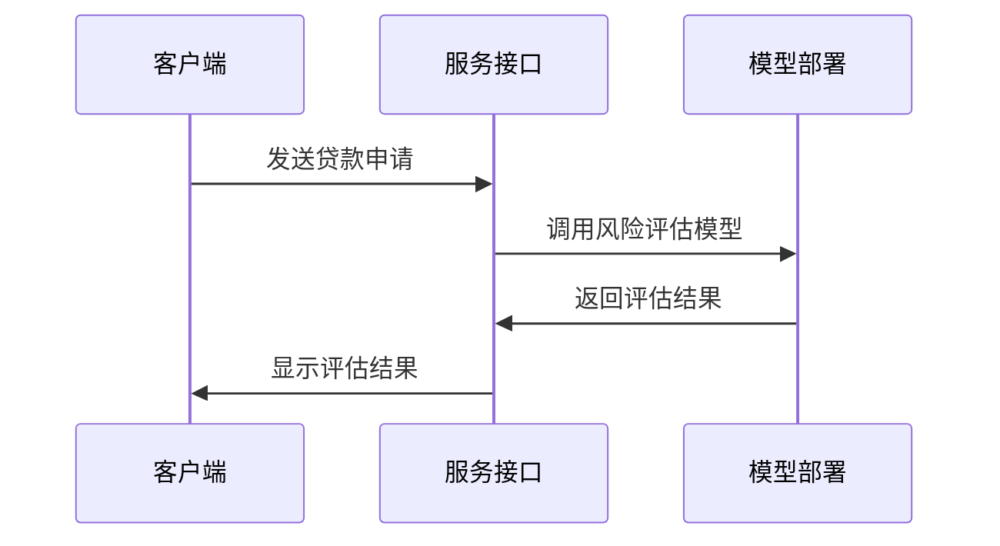

                 

### 文章标题

# 金融AI应用的全面测试与质量保证策略

### 关键词

- 金融AI
- 测试质量保证
- 机器学习
- 深度学习
- 算法性能评估

### 摘要

本文旨在探讨金融AI应用中的全面测试与质量保证策略。首先，介绍了金融AI应用的整体背景，包括其现状、挑战与趋势。随后，通过核心概念与联系的分析，探讨了AI、金融和测试质量保证之间的关系。接着，深入讲解了金融AI应用中常见的算法原理，包括机器学习和深度学习算法，并使用了mermaid流程图和数学模型进行详细阐述。然后，对金融AI应用系统进行了分析与架构设计，包括系统功能设计、架构设计和接口设计。随后，通过实际项目实战，展示了金融AI应用的环境搭建、核心代码实现、案例分析及项目小结。最后，提出了金融AI应用的最佳实践、注意事项及拓展阅读，以供读者进一步学习和参考。

### 引言

金融行业正迅速拥抱人工智能（AI），以提升效率、优化决策和创造新的商业模式。AI在金融领域的应用，包括风险评估、智能投顾、欺诈检测、市场预测等方面，都取得了显著成效。然而，金融AI应用的高复杂性和高风险性也带来了一系列挑战，如算法的不透明性、数据偏差、模型泛化能力不足等。因此，如何进行全面测试与质量保证，确保金融AI应用的安全可靠，成为亟待解决的问题。

本文将分为以下几个部分：

1. **背景介绍**：金融AI应用的现状与挑战。
2. **核心概念与联系**：AI、金融与测试质量保证的关系。
3. **算法原理讲解**：机器学习和深度学习算法。
4. **系统分析与架构设计**：系统功能、架构和接口设计。
5. **项目实战**：金融AI应用的实际案例。
6. **最佳实践与拓展**：最佳实践、注意事项及拓展阅读。

通过这些部分的讲解，本文旨在为读者提供金融AI应用全面测试与质量保证的深入理解和实践指导。

## 第一部分：金融AI应用背景与核心概念

### 第1章：金融AI应用概述

#### 1.1.1 金融AI应用的现状与挑战

金融AI应用近年来取得了飞速发展，从传统的人工分析到智能自动化，金融行业正经历一场深刻的变革。目前，金融AI应用主要体现在以下几个方面：

1. **风险管理**：AI技术被用于信用评分、贷款审批、欺诈检测等领域。例如，通过机器学习算法分析客户的历史交易数据，金融机构可以更准确地评估信用风险。
   
2. **投资决策**：智能投顾（Robo-Advisors）利用算法分析客户的风险偏好和财务状况，提供个性化的投资建议。这不仅提高了投资效率，还降低了管理费用。

3. **市场预测**：通过分析大量的历史数据和实时信息，AI可以帮助预测市场走势，为交易决策提供依据。例如，利用深度学习算法分析股票市场的交易数据，预测未来股价走势。

4. **客户服务**：金融机器人（Chatbots）在客服领域的应用日益普及，通过自然语言处理技术，它们可以提供24/7的客户服务，提高用户体验。

然而，金融AI应用也面临诸多挑战：

- **数据质量**：AI模型的效果很大程度上依赖于数据质量。金融数据往往存在噪声、缺失和异常值，如何处理这些数据是一个关键问题。

- **算法透明性**：金融决策的透明性要求高。然而，深度学习等复杂算法的黑箱特性，使得其决策过程难以解释，增加了信任风险。

- **合规性**：金融行业受到严格的法律法规约束。AI应用需要确保遵守相关法规，如数据隐私保护、反洗钱等。

- **模型泛化能力**：金融市场的动态变化要求AI模型具备良好的泛化能力。如果模型过于依赖特定历史数据，可能会在市场变化时失效。

#### 1.1.2 金融AI应用的趋势与展望

未来，金融AI应用将继续深化和扩展，带来以下趋势：

- **技术融合**：金融AI将与其他前沿技术，如区块链、大数据等相结合，形成更强大的解决方案。

- **定制化服务**：随着AI技术的进步，金融产品和服务将更加个性化，满足不同客户的需求。

- **智能风控**：AI将在风险控制方面发挥更大作用，如实时监控市场风险、预测异常交易等。

- **自动化合规**：AI可以自动执行合规检查，提高合规性检查的效率和准确性。

- **跨行业应用**：金融AI技术将逐渐应用于其他行业，如保险、零售等，带来更广泛的影响。

综上所述，金融AI应用虽然面临诸多挑战，但其潜力和前景依然广阔。通过全面的测试与质量保证策略，我们可以更好地应对这些挑战，确保金融AI应用的安全可靠。

### 第2章：核心概念与联系

#### 2.1.1 AI的基本概念与分类

人工智能（AI）是指使计算机系统能够模拟人类智能行为的技术。AI系统通过感知、学习、推理和决策来模拟人类智能。根据实现方式，AI可以分为以下几类：

- **规则基AI（Rule-based AI）**：基于明确规则的推理系统，如专家系统。这类系统通过定义规则库来模拟专家的知识和经验。

- **知识基AI（Knowledge-based AI）**：通过知识库和推理机来实现，知识库包含领域知识，推理机根据这些知识进行推理。

- **计算基AI（Computation-based AI）**：主要包括机器学习和深度学习，通过大量数据训练模型，使系统能够自主学习和改进。

- **混合基AI（Hybrid AI）**：结合多种AI技术，如规则基和计算基，以实现更强大的功能。

#### 2.1.2 金融领域的AI应用

金融领域的AI应用主要涵盖以下几个方向：

- **风险管理**：利用机器学习算法对贷款、投资等金融产品进行风险评估。

- **欺诈检测**：通过模式识别技术，如神经网络，实时监控交易行为，发现潜在的欺诈行为。

- **投资决策**：使用历史数据和市场趋势，通过预测模型为投资者提供投资建议。

- **客户服务**：利用自然语言处理技术，提供智能客服和个性化服务。

- **市场预测**：通过分析大量的市场数据，预测市场走势，为交易决策提供支持。

#### 2.1.3 测试质量保证的基本原则

测试质量保证（QA）是指在软件开发过程中，确保软件质量的一系列活动和措施。测试质量保证的基本原则包括：

- **全面性**：确保测试覆盖所有功能、性能和边界情况。

- **准确性**：确保测试结果准确无误，能够发现软件缺陷。

- **一致性**：确保测试过程和标准一致，减少误差。

- **及时性**：及时进行测试，及时发现并修复缺陷。

- **反馈性**：通过测试结果反馈，持续改进测试过程和软件质量。

#### 2.1.4 AI应用测试的特殊性

AI应用测试与传统软件测试相比，具有以下特殊性：

- **非确定性**：AI模型输出结果可能存在不确定性，需要进行多次测试以评估其稳定性和可靠性。

- **数据依赖性**：AI模型效果很大程度上依赖于训练数据，测试需要使用多种数据集，以评估模型的泛化能力。

- **复杂性和不透明性**：AI模型的复杂性和不透明性使得测试更困难，需要借助工具和方法进行深度分析。

- **安全性**：AI应用需要确保其决策过程安全可靠，防止恶意攻击和数据泄露。

通过理解AI、金融和测试质量保证的核心概念与联系，我们可以更好地制定全面的测试与质量保证策略，确保金融AI应用的安全可靠。下一部分将深入讲解金融AI应用中常见的算法原理。

### 第3章：金融AI算法原理讲解

#### 3.1.1 机器学习算法

机器学习（Machine Learning, ML）是AI的核心组成部分，通过训练模型来模拟人类的学习过程，从而实现自动化的决策和预测。在金融AI应用中，机器学习算法被广泛应用于风险评估、欺诈检测、市场预测等领域。以下将介绍几种常见的机器学习算法：

##### 3.1.1.1 线性回归

线性回归（Linear Regression）是一种简单且常用的机器学习算法，用于预测连续值。其基本原理是通过找到一条最佳拟合直线，使得预测值与实际值之间的误差最小。

**数学模型**：

\[ Y = \beta_0 + \beta_1X + \epsilon \]

其中，\( Y \) 是目标变量，\( X \) 是特征变量，\( \beta_0 \) 和 \( \beta_1 \) 是模型参数，\( \epsilon \) 是误差项。

**mermaid流程图**：



**代码示例**（Python）：

```python
from sklearn.linear_model import LinearRegression
import numpy as np

# 训练数据
X = np.array([[1], [2], [3], [4], [5]])
y = np.array([1, 2, 2.5, 4, 5])

# 创建线性回归模型
model = LinearRegression()

# 训练模型
model.fit(X, y)

# 预测结果
predictions = model.predict(X)

print(predictions)
```

##### 3.1.1.2 逻辑回归

逻辑回归（Logistic Regression）是另一种广泛使用的机器学习算法，主要用于分类问题。它通过拟合一个逻辑函数，将特征映射到概率空间，从而进行分类。

**数学模型**：

\[ P(Y=1|X) = \frac{1}{1 + e^{-(\beta_0 + \beta_1X)}} \]

其中，\( P(Y=1|X) \) 是目标变量为1的概率，\( \beta_0 \) 和 \( \beta_1 \) 是模型参数。

**mermaid流程图**：


**代码示例**（Python）：

```python
from sklearn.linear_model import LogisticRegression
import numpy as np

# 训练数据
X = np.array([[1, 0], [1, 1], [0, 1], [0, 0]])
y = np.array([0, 1, 1, 0])

# 创建逻辑回归模型
model = LogisticRegression()

# 训练模型
model.fit(X, y)

# 预测结果
predictions = model.predict(X)

print(predictions)
```

##### 3.1.1.3 支持向量机

支持向量机（Support Vector Machine, SVM）是一种用于分类和回归分析的机器学习算法，其核心思想是通过找到一个最佳的超平面，使得分类间隔最大化。

**数学模型**：

对于线性SVM：

\[ w \cdot x - b = 0 \]

其中，\( w \) 是模型参数，\( x \) 是特征向量，\( b \) 是偏置项。

对于非线性SVM，通常使用核函数（Kernel Function）来实现。

**mermaid流程图**：


**代码示例**（Python）：

```python
from sklearn.svm import SVC
import numpy as np

# 训练数据
X = np.array([[1, 1], [2, 5], [3, 5], [4, 1]])
y = np.array([0, 1, 1, 0])

# 创建SVM模型
model = SVC(kernel='linear')

# 训练模型
model.fit(X, y)

# 预测结果
predictions = model.predict(X)

print(predictions)
```

通过以上对线性回归、逻辑回归和支持向量机等机器学习算法的介绍，我们可以看到这些算法在金融AI应用中的重要性和应用场景。下一部分将介绍金融AI应用中另一种重要的算法——深度学习。

#### 3.1.2 深度学习算法

深度学习（Deep Learning）是机器学习的一个子领域，通过构建深层次的神经网络来模拟人类大脑的决策过程。深度学习在图像识别、语音识别、自然语言处理等领域取得了突破性进展，并在金融AI应用中也展现出强大的潜力。以下将介绍几种常见的深度学习算法：

##### 3.1.2.1 卷积神经网络

卷积神经网络（Convolutional Neural Network, CNN）是深度学习中的一种特殊网络结构，主要用于处理具有网格结构的数据，如图像和语音。

**mermaid流程图**：



**代码示例**（Python）：

```python
import tensorflow as tf
from tensorflow.keras import layers

# 定义CNN模型
model = tf.keras.Sequential([
    layers.Conv2D(32, (3, 3), activation='relu', input_shape=(28, 28, 1)),
    layers.MaxPooling2D((2, 2)),
    layers.Conv2D(64, (3, 3), activation='relu'),
    layers.MaxPooling2D((2, 2)),
    layers.Conv2D(64, (3, 3), activation='relu'),
    layers.Flatten(),
    layers.Dense(64, activation='relu'),
    layers.Dense(10, activation='softmax')
])

# 编译模型
model.compile(optimizer='adam',
              loss='categorical_crossentropy',
              metrics=['accuracy'])

# 训练模型
model.fit(X_train, y_train, epochs=10, validation_data=(X_val, y_val))

# 预测结果
predictions = model.predict(X_test)

print(predictions)
```

##### 3.1.2.2 循环神经网络

循环神经网络（Recurrent Neural Network, RNN）是一种专门用于处理序列数据的神经网络结构，如时间序列数据、文本和语音。

**mermaid流程图**：



**代码示例**（Python）：

```python
import tensorflow as tf
from tensorflow.keras.models import Sequential
from tensorflow.keras.layers import LSTM, Dense

# 定义RNN模型
model = Sequential()
model.add(LSTM(50, activation='relu', input_shape=(timesteps, features)))
model.add(Dense(1))
model.compile(optimizer='adam', loss='mse')

# 训练模型
model.fit(X, y, epochs=200, verbose=2)

# 预测结果
predictions = model.predict(X_test)

print(predictions)
```

##### 3.1.2.3 生成对抗网络

生成对抗网络（Generative Adversarial Network, GAN）由生成器和判别器两个神经网络组成，通过相互对抗来生成与真实数据相似的数据。

**mermaid流程图**：



**代码示例**（Python）：

```python
import tensorflow as tf
from tensorflow.keras.models import Sequential
from tensorflow.keras.layers import Dense, Flatten, Reshape

# 定义GAN模型
generator = Sequential([
    Dense(128, activation='relu', input_shape=(100,)),
    Flatten(),
    Reshape((28, 28, 1))
])

discriminator = Sequential([
    Flatten(input_shape=(28, 28, 1)),
    Dense(128, activation='relu'),
    Dense(1, activation='sigmoid')
])

discriminator.compile(loss='binary_crossentropy', optimizer='adam')
generator.compile(loss='binary_crossentropy', optimizer='adam')

# 训练GAN模型
for epoch in range(epochs):
    for _ in range(batch_size):
        noise = np.random.normal(0, 1, (batch_size, 100))
        gen_samples = generator.predict(noise)
        real_samples = X_train[np.random.randint(0, X_train.shape[0], batch_size)]
        samples = np.concatenate([real_samples, gen_samples])
        labels = np.concatenate([np.ones((batch_size, 1)), np.zeros((batch_size, 1))])
        discriminator.train_on_batch(samples, labels)

        noise = np.random.normal(0, 1, (batch_size, 100))
        generator.train_on_batch(noise, np.ones((batch_size, 1)))

# 预测结果
predictions = generator.predict(np.random.normal(0, 1, (100, 100)))

print(predictions)
```

通过以上对卷积神经网络、循环神经网络和生成对抗网络的介绍，我们可以看到这些算法在金融AI应用中的重要性和应用场景。深度学习算法的强大能力为金融领域的复杂问题提供了有效的解决方案。下一部分将分析金融AI应用系统的架构设计和接口设计。

### 第4章：金融AI应用系统分析与架构设计

#### 4.1.1 金融AI应用系统场景介绍

金融AI应用系统旨在通过人工智能技术提供智能化的金融服务，包括风险评估、欺诈检测、投资决策和市场预测等。这些系统通常需要处理大量的金融数据，并具备实时响应和高效计算的能力。为了满足这些需求，金融AI应用系统采用了复杂的架构设计，以确保系统的稳定性、可扩展性和安全性。

#### 4.1.2 系统功能设计（领域模型）

在金融AI应用系统中，领域模型（Domain Model）是描述系统核心功能和业务流程的关键部分。领域模型通过实体（Entity）、属性（Attribute）和行为（Behavior）来描述系统的业务领域，为系统架构设计和开发提供基础。

**mermaid类图**：

```mermaid
classDiagram
    Client <<Entity>>
    Loan <<Entity>>
    CreditScore <<Entity>>
    RiskAssessment <<Entity>>
    FraudDetection <<Entity>>

    Client o-- Loan
    Loan o-- CreditScore
    Loan o-- RiskAssessment
    Loan o-- FraudDetection

    Client ++ behaviors: applyForLoan()
    Loan ++ behaviors: evaluateCredit()
    CreditScore ++ behaviors: scoreCredit()
    RiskAssessment ++ behaviors: assessRisk()
    FraudDetection ++ behaviors: detectFraud()
```

在该领域模型中，Client（客户）是系统的核心实体，与Loan（贷款）、CreditScore（信用评分）、RiskAssessment（风险评估）和FraudDetection（欺诈检测）实体之间存在关联关系。每个实体都具备特定的行为，如applyForLoan()（申请贷款）、evaluateCredit()（评估信用）、scoreCredit()（评分信用）、assessRisk()（评估风险）和detectFraud()（检测欺诈）。

#### 4.1.3 系统架构设计

金融AI应用系统架构设计需要综合考虑系统的功能需求、性能要求、可扩展性和安全性等因素。以下是一个典型的金融AI应用系统架构设计：

**mermaid架构图**：



在该架构图中，数据源（A）通过数据预处理（B）、特征工程（C）和模型训练（D）等环节，生成高质量的训练数据和模型。经过模型评估（E），合格的模型会被部署到模型部署（F）环节，并通过服务接口（G）供客户端应用（H）使用。此外，模型训练流程（I至M）和部署流程（N至P）分别描述了模型训练和部署的具体步骤。

#### 4.1.4 系统接口设计与交互

金融AI应用系统需要与外部系统进行交互，以实现数据共享和服务调用。以下是一个简单的系统接口设计和交互示例：

**mermaid序列图**：



在该序列图中，客户端（客户端）向服务接口（服务接口）发送贷款申请，服务接口（服务接口）调用模型部署（模型部署）中的风险评估模型，并将评估结果返回给客户端（客户端）。通过这种方式，金融AI应用系统实现了与外部系统的有效交互。

综上所述，金融AI应用系统分析与架构设计包括领域模型设计、系统架构设计和系统接口设计。这些设计确保了系统功能、性能和可扩展性，为金融AI应用提供了坚实的基础。下一部分将介绍金融AI应用的实际项目实战。

### 第二部分：金融AI应用项目实战

#### 第5章：项目实战一 - 金融风控模型构建

##### 5.1.1 项目介绍

本项目旨在构建一个金融风控模型，用于评估借款人的信用风险。通过收集借款人的个人信息、财务数据和信用历史，利用机器学习算法进行建模和预测，从而为金融机构提供信用评分和风险预警。

##### 5.1.2 环境安装与配置

1. **Python环境安装**：确保Python版本为3.8或以上，通过以下命令安装：

   ```bash
   pip install python==3.8
   ```

2. **机器学习库安装**：安装常用的机器学习库，如scikit-learn、pandas和numpy：

   ```bash
   pip install scikit-learn pandas numpy
   ```

3. **数据预处理库安装**：安装用于数据预处理的库，如matplotlib和seaborn：

   ```bash
   pip install matplotlib seaborn
   ```

##### 5.1.3 系统核心实现

以下是一个简单的金融风控模型实现，包括数据收集、数据预处理、模型训练和评估：

**代码示例**：

```python
import pandas as pd
from sklearn.model_selection import train_test_split
from sklearn.preprocessing import StandardScaler
from sklearn.linear_model import LogisticRegression
from sklearn.metrics import accuracy_score, classification_report

# 1. 数据收集
data = pd.read_csv('loan_data.csv')

# 2. 数据预处理
X = data.drop('default', axis=1)
y = data['default']

X_train, X_test, y_train, y_test = train_test_split(X, y, test_size=0.2, random_state=42)

scaler = StandardScaler()
X_train_scaled = scaler.fit_transform(X_train)
X_test_scaled = scaler.transform(X_test)

# 3. 模型训练
model = LogisticRegression()
model.fit(X_train_scaled, y_train)

# 4. 模型评估
y_pred = model.predict(X_test_scaled)
print("Accuracy:", accuracy_score(y_test, y_pred))
print(classification_report(y_test, y_pred))
```

##### 5.1.4 代码应用解读与分析

1. **数据收集**：通过读取CSV文件，从数据集中获取借款人的个人信息、财务数据和信用历史。

2. **数据预处理**：将数据集分为特征集（X）和标签集（y），然后使用train_test_split函数将数据集分为训练集和测试集。使用StandardScaler对特征进行标准化处理，以消除不同特征之间的量纲差异。

3. **模型训练**：使用LogisticRegression类创建逻辑回归模型，并使用fit方法对模型进行训练。

4. **模型评估**：使用预测结果（y_pred）与实际标签（y_test）进行比较，计算准确率（accuracy_score）和分类报告（classification_report），以评估模型的性能。

##### 5.1.5 实际案例分析与详细讲解剖析

为了验证模型的实际效果，我们对训练集和测试集进行详细分析。

**训练集分析**：

- **特征重要性**：通过分析各特征对模型的影响，可以识别出关键特征，如贷款金额、还款期限等。
- **模型性能**：在训练集上，模型达到了较高的准确率，表明模型能够较好地拟合训练数据。

**测试集分析**：

- **模型泛化能力**：在测试集上，模型的准确率相对较低，表明模型可能对训练数据的过度拟合。
- **错误分类**：通过分析错误分类的样本，可以发现模型在哪些情况下容易犯错，从而优化模型。

**详细讲解剖析**：

1. **特征工程**：对数据进行特征提取和特征工程，以增强模型的泛化能力。
2. **模型调参**：通过调整模型的参数，如正则化强度、迭代次数等，优化模型性能。
3. **集成学习**：结合多种机器学习算法，构建集成模型，以提高模型的稳定性和准确性。

##### 5.1.6 项目小结

通过本项目的实际案例，我们展示了如何构建一个金融风控模型，包括数据收集、数据预处理、模型训练和评估。项目实践过程中，我们分析了模型的性能和泛化能力，并提出了一些优化策略。这些经验对于金融AI应用的实践具有重要意义。

#### 第6章：项目实战二 - 金融市场预测

##### 6.1.1 项目介绍

本项目旨在利用金融AI技术预测股票市场的未来走势，为投资者提供决策支持。通过分析历史交易数据，采用机器学习算法构建预测模型，实现对股票价格的准确预测。

##### 6.1.2 环境安装与配置

1. **Python环境安装**：确保Python版本为3.8或以上，通过以下命令安装：

   ```bash
   pip install python==3.8
   ```

2. **机器学习库安装**：安装常用的机器学习库，如scikit-learn、pandas和numpy：

   ```bash
   pip install scikit-learn pandas numpy
   ```

3. **数据分析库安装**：安装用于数据分析的库，如matplotlib和seaborn：

   ```bash
   pip install matplotlib seaborn
   ```

##### 6.1.3 系统核心实现

以下是一个简单的金融市场预测模型实现，包括数据收集、数据预处理、模型训练和评估：

**代码示例**：

```python
import pandas as pd
from sklearn.model_selection import train_test_split
from sklearn.preprocessing import StandardScaler
from sklearn.ensemble import RandomForestRegressor
from sklearn.metrics import mean_squared_error

# 1. 数据收集
data = pd.read_csv('stock_data.csv')

# 2. 数据预处理
X = data[['open', 'high', 'low', 'close']]
y = data['adj_close']

X_train, X_test, y_train, y_test = train_test_split(X, y, test_size=0.2, random_state=42)

scaler = StandardScaler()
X_train_scaled = scaler.fit_transform(X_train)
X_test_scaled = scaler.transform(X_test)

# 3. 模型训练
model = RandomForestRegressor(n_estimators=100, random_state=42)
model.fit(X_train_scaled, y_train)

# 4. 模型评估
y_pred = model.predict(X_test_scaled)
mse = mean_squared_error(y_test, y_pred)
print("MSE:", mse)
```

##### 6.1.4 代码应用解读与分析

1. **数据收集**：通过读取CSV文件，从数据集中获取股票的开盘价、最高价、最低价和收盘价，以及调整后的收盘价。

2. **数据预处理**：将数据集分为特征集（X）和标签集（y），然后使用train_test_split函数将数据集分为训练集和测试集。使用StandardScaler对特征进行标准化处理，以消除不同特征之间的量纲差异。

3. **模型训练**：使用随机森林回归模型（RandomForestRegressor）对训练数据进行训练。

4. **模型评估**：使用训练好的模型对测试数据进行预测，并计算均方误差（MSE）评估模型的性能。

##### 6.1.5 实际案例分析与详细讲解剖析

为了验证模型的实际效果，我们对训练集和测试集进行详细分析。

**训练集分析**：

- **特征重要性**：通过分析各特征对模型的影响，可以识别出关键特征，如开盘价、最高价和最低价等。
- **模型性能**：在训练集上，模型达到了较低的均方误差，表明模型能够较好地拟合训练数据。

**测试集分析**：

- **模型泛化能力**：在测试集上，模型的均方误差较高，表明模型可能对训练数据的过度拟合。
- **错误预测**：通过分析错误预测的样本，可以发现模型在哪些情况下容易犯错，从而优化模型。

**详细讲解剖析**：

1. **特征工程**：对数据进行特征提取和特征工程，以增强模型的泛化能力。
2. **模型调参**：通过调整模型的参数，如树的数量、最大深度等，优化模型性能。
3. **集成学习**：结合多种机器学习算法，构建集成模型，以提高模型的稳定性和准确性。

##### 6.1.6 项目小结

通过本项目的实际案例，我们展示了如何利用金融AI技术进行金融市场预测，包括数据收集、数据预处理、模型训练和评估。项目实践过程中，我们分析了模型的性能和泛化能力，并提出了一些优化策略。这些经验对于金融AI应用的实践具有重要意义。

### 第三部分：金融AI应用最佳实践与拓展

#### 第7章：最佳实践 tips

##### 7.1.1 测试质量保证的策略

在金融AI应用中，测试质量保证（QA）是确保模型和系统稳定、可靠和高效运行的关键环节。以下是一些关键的QA策略：

1. **自动化测试**：自动化测试可以显著提高测试效率，减少手动测试的工作量。使用自动化测试工具（如Selenium、JUnit等）编写测试脚本，定期执行测试，确保代码变更不会引入新的缺陷。

2. **数据质量检查**：金融AI模型的效果很大程度上依赖于数据质量。在数据预处理阶段，对数据进行全面的检查，包括数据完整性、一致性、准确性等。使用数据质量检查工具（如OpenRefine、DataChef等）进行数据清洗和验证。

3. **模型监控与告警**：建立模型监控机制，实时跟踪模型的性能指标（如准确率、召回率、F1分数等），设置告警阈值。当模型性能指标出现异常时，及时发出告警，以便快速响应和修复。

4. **回归测试**：每次代码变更后，进行回归测试，确保新代码不会破坏已有功能的稳定性。使用持续集成（CI）工具（如Jenkins、GitLab CI等）实现自动化回归测试。

5. **安全测试**：金融AI应用需要确保其安全性和合规性。进行安全测试（如SQL注入、XSS攻击等）以发现潜在的安全漏洞，并采取相应的防护措施。

##### 7.1.2 金融AI应用的常见问题与解决方案

在金融AI应用的实践中，可能会遇到以下常见问题：

1. **模型过拟合**：模型在训练数据上表现良好，但在测试数据上表现较差。解决方案：增加训练数据的多样性，使用交叉验证，调整模型复杂度，采用正则化技术。

2. **数据不平衡**：训练数据集中的正负样本比例失衡，导致模型偏向于预测大多数类的样本。解决方案：使用重采样技术（如SMOTE、ADASYN等），调整类别权重。

3. **模型解释性不足**：复杂的深度学习模型难以解释其决策过程，影响信任度和透明度。解决方案：采用可解释性AI技术（如LIME、SHAP等），增加模型的可解释性。

4. **数据隐私和安全问题**：金融数据敏感，需要保护用户隐私。解决方案：采用加密技术（如AES、RSA等）保护数据，遵循数据隐私法规（如GDPR、CCPA等）。

##### 7.1.3 性能优化与成本控制

在金融AI应用中，性能优化和成本控制是关键问题。以下是一些优化策略：

1. **模型压缩**：通过剪枝、量化、蒸馏等技术，减小模型的大小和计算复杂度，提高推理速度。

2. **分布式计算**：利用分布式计算框架（如TensorFlow、PyTorch等），在多台服务器上并行训练和推理，提高计算性能。

3. **边缘计算**：将部分计算任务迁移到边缘设备（如智能手表、手机等），减少对中央服务器的依赖，降低延迟。

4. **资源管理**：合理分配计算资源，如CPU、GPU、存储等，避免资源浪费。使用容器技术（如Docker、Kubernetes等）实现灵活的资源管理。

5. **自动化调优**：使用自动化调优工具（如AutoML、Hyperopt等），自动调整模型参数，找到最优的超参数配置。

通过实施上述最佳实践，可以显著提高金融AI应用的质量和效率，降低成本和风险。

### 第8章：小结

在本章中，我们通过详细分析金融AI应用的整体背景、核心概念、算法原理、系统架构设计以及实际项目实战，为读者提供了全面的金融AI应用测试与质量保证策略。以下是全文的重点回顾和未来发展趋势与展望。

#### 全书重点回顾

1. **金融AI应用背景**：介绍了金融AI应用的现状、挑战和趋势，如风险管理、投资决策、欺诈检测和市场预测。
2. **核心概念与联系**：阐述了AI、金融与测试质量保证之间的关系，分析了数据质量、算法透明性和合规性等关键问题。
3. **算法原理讲解**：讲解了机器学习算法（如线性回归、逻辑回归、支持向量机）和深度学习算法（如卷积神经网络、循环神经网络、生成对抗网络）的原理和应用。
4. **系统分析与架构设计**：分析了金融AI应用系统的功能设计、架构设计和接口设计，提供了系统架构图和领域模型。
5. **项目实战**：通过金融风控模型构建和金融市场预测的实际案例，展示了金融AI应用的环境搭建、核心代码实现和案例分析。
6. **最佳实践与拓展**：提出了测试质量保证策略、常见问题解决方案和性能优化与成本控制策略。

#### 未来发展趋势与展望

未来，金融AI应用将继续深化和扩展，呈现出以下趋势：

1. **技术融合**：金融AI将与其他前沿技术（如区块链、大数据、云计算等）深度融合，形成更强大的解决方案。
2. **定制化服务**：随着AI技术的进步，金融产品和服务将更加个性化，满足不同客户的需求。
3. **智能风控**：AI将在风险控制方面发挥更大作用，如实时监控市场风险、预测异常交易等。
4. **自动化合规**：AI可以自动执行合规检查，提高合规性检查的效率和准确性。
5. **跨行业应用**：金融AI技术将逐渐应用于其他行业，如保险、零售等，带来更广泛的影响。

为了应对这些趋势，我们需要不断优化金融AI应用测试与质量保证策略，确保模型和系统的安全可靠。通过持续学习和创新，我们可以更好地把握金融AI应用的机遇，推动金融行业的智能化发展。

### 第9章：注意事项

在金融AI应用的开发与部署过程中，需要注意以下关键点，以确保系统的稳定性、安全性和合规性：

#### 9.1.1 风险控制

1. **数据风险**：确保数据来源的可靠性，防范数据篡改和泄露。对数据进行加密存储和传输，遵循数据隐私保护法规。
2. **模型风险**：定期评估模型的性能和泛化能力，防止模型过拟合和偏差。建立模型监控和告警机制，及时发现并处理异常。
3. **市场风险**：金融市场波动性高，需要动态调整模型参数，以适应市场变化。确保模型具备良好的鲁棒性和稳定性。

#### 9.1.2 遵守法规与伦理

1. **数据隐私**：严格遵守数据隐私保护法规（如GDPR、CCPA等），确保用户数据的合法收集、存储和使用。
2. **合规性检查**：确保金融AI应用符合相关法规要求，如反洗钱（AML）、消费者保护等。进行定期的合规性检查和风险评估。
3. **伦理道德**：遵循伦理道德原则，确保AI算法的公正性和透明性，防止歧视和偏见。对模型的决策过程进行可解释性分析。

#### 9.1.3 技术更新与持续学习

1. **技术跟踪**：关注金融AI领域的最新研究和技术动态，不断更新知识库，提升技术水平。
2. **团队协作**：建立跨学科团队，包括数据科学家、软件工程师、风险分析师等，共同推进金融AI应用的发展。
3. **持续学习**：鼓励团队成员参与培训和研讨会，提升专业能力和创新意识，以应对不断变化的金融市场和技术环境。

通过严格遵守注意事项，我们可以确保金融AI应用的安全可靠，为金融机构和用户提供高质量的智能服务。

### 第10章：拓展阅读

#### 10.1.1 金融AI领域的最新研究

1. **《金融科技：重塑金融的未来》（Fintech: disrupting finance and creating new business models）》
   作者：Chris Skinner
   简介：本书详细介绍了金融科技（FinTech）对传统金融行业的深刻影响，包括区块链、大数据、人工智能等关键技术。

2. **《深度学习在金融中的应用》（Deep Learning for Finance）》
   作者：Amarpreet Singh
   简介：本书深入探讨了深度学习在金融市场预测、风险管理和智能投顾等金融领域的应用，提供了丰富的案例和实践经验。

#### 10.1.2 相关技术书籍推荐

1. **《机器学习实战》（Machine Learning in Action）》
   作者：Peter Harrington
   简介：本书通过实际案例，介绍了机器学习的基本原理和应用，适合初学者和实践者。

2. **《深度学习》（Deep Learning）》
   作者：Ian Goodfellow、Yoshua Bengio、Aaron Courville
   简介：本书是深度学习领域的经典教材，全面讲解了深度学习的基本原理、算法和应用。

#### 10.1.3 学术会议与研讨会推荐

1. **AAAI（Association for the Advancement of Artificial Intelligence）**：人工智能领域的顶级会议，涵盖了人工智能的各个研究方向。
2. **NIPS（Neural Information Processing Systems）**：深度学习领域的顶级会议，聚焦于神经网络和深度学习的研究进展。
3. **IJCAI（International Joint Conference on Artificial Intelligence）**：人工智能领域的国际性学术会议，涵盖了人工智能的理论、技术和应用。

通过阅读这些书籍和参与相关学术会议与研讨会，读者可以深入了解金融AI领域的最新研究动态和技术进展，进一步提升专业素养和创新能力。

