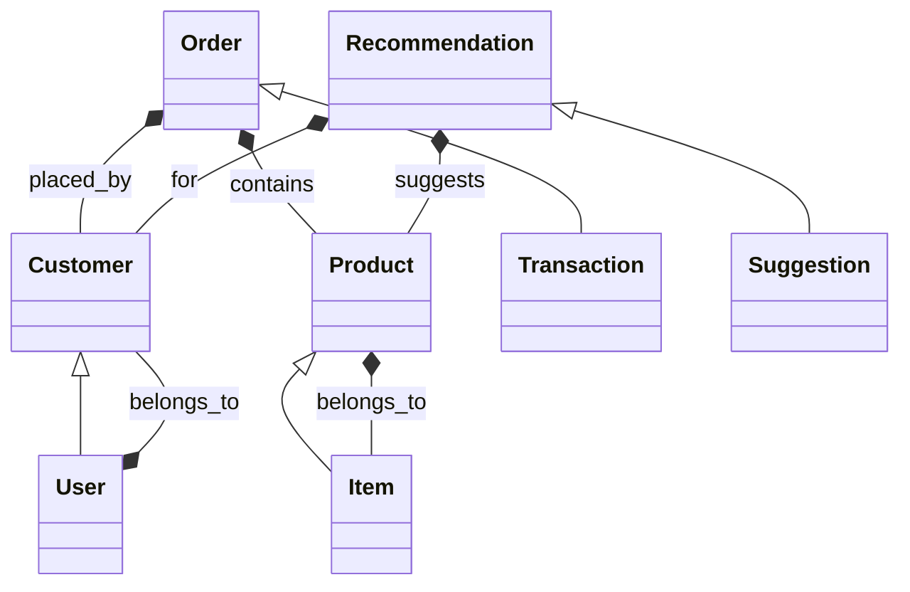

                 

### 文章标题

《金融产品交叉销售优化系统》

### 关键词

- 金融产品
- 交叉销售
- 优化系统
- 算法
- 系统设计

### 摘要

本文深入探讨了金融产品交叉销售优化系统的设计与实现。首先，我们介绍了金融产品交叉销售的重要性及其在市场竞争中的关键作用。接着，通过详细的分析和讲解，阐述了交叉销售优化系统的核心概念、算法原理、数学模型以及系统架构设计。文章还通过实际项目案例，展示了系统实现的全过程，包括环境安装、核心代码实现、代码解析和案例分析。最后，文章提出了最佳实践建议，并对系统优化提出了展望。

----------------------------------------------------------------

## 目录大纲设计过程

### 第一部分：背景与核心概念

**第1章：问题背景与概述**

- **1.1 问题背景**：介绍金融产品交叉销售的背景和市场需求。
- **1.2 核心概念介绍**：阐述交叉销售、数据分析与挖掘等核心概念。
- **1.3 联系与交互**：讨论数据流、用户行为模型及风险评估与控制。
- **1.4 边界与外延**：探讨系统实现的边界、数据隐私保护及法律合规要求。
- **1.5 本章小结**：总结本章的主要内容。

### 第二部分：算法原理与模型

**第2章：交叉销售优化算法原理**

- **2.1 算法概述**：介绍常见交叉销售算法及其选择标准。
- **2.2 具体算法讲解**：详细讲解协同过滤算法及其属性重要性分析。
- **2.3 数学模型与公式**：描述交叉销售概率模型及其推导过程。
- **2.4 本章小结**：总结算法原理和数学模型。

### 第三部分：系统设计与实现

**第3章：系统功能设计**

- **3.1 系统功能概述**：介绍用户管理、产品管理和推荐引擎的功能。
- **3.2 领域模型**：使用Mermaid流程图展示领域模型。
- **3.3 系统架构设计**：介绍系统架构设计、接口设计和系统交互。
- **3.4 系统接口设计和系统交互**：通过Mermaid序列图展示系统交互流程。

### 第四部分：项目实战

**第4章：项目实战**

- **4.1 环境安装**：介绍环境配置和依赖安装。
- **4.2 核心实现**：详细解析系统核心代码实现。
- **4.3 代码分析**：分析代码结构和实现细节。
- **4.4 案例分析**：通过实际案例展示系统应用效果。
- **4.5 小结**：总结项目实施过程中的经验教训。

### 第五部分：最佳实践与拓展

**第5章：最佳实践与拓展**

- **5.1 最佳实践**：提供实践技巧和注意事项。
- **5.2 小结**：回顾全文，强调关键知识点。
- **5.3 注意事项**：提醒可能遇到的问题和解决方案。
- **5.4 拓展阅读**：推荐进一步学习的资源。

### 文章标题

《金融产品交叉销售优化系统》

### 关键词

- 金融产品
- 交叉销售
- 优化系统
- 算法
- 系统设计

### 摘要

本文深入探讨了金融产品交叉销售优化系统的设计与实现。首先，我们介绍了金融产品交叉销售的重要性及其在市场竞争中的关键作用。接着，通过详细的分析和讲解，阐述了交叉销售优化系统的核心概念、算法原理、数学模型以及系统架构设计。文章还通过实际项目案例，展示了系统实现的全过程，包括环境安装、核心代码实现、代码解析和案例分析。最后，文章提出了最佳实践建议，并对系统优化提出了展望。

----------------------------------------------------------------

## 第一部分：背景与核心概念

### 第1章：问题背景与概述

#### 1.1 问题背景

随着金融市场的不断发展，金融机构之间的竞争日益激烈。为了提高市场份额和盈利能力，金融机构需要不断创新和优化业务模式。在众多业务策略中，金融产品交叉销售成为了一个备受关注的话题。交叉销售是指金融机构通过向现有客户推荐其他相关金融产品，从而增加客户购买量和提升客户粘性的一种营销策略。

交叉销售在金融行业的应用具有显著的优势。首先，它可以提高客户的平均收入，通过向客户推荐更多产品，使每个客户的总体消费金额增加。其次，交叉销售有助于提升客户满意度，通过提供更全面的服务，金融机构可以更好地满足客户的多元化需求。此外，交叉销售还能够提高客户忠诚度，通过提供一站式的金融服务，客户更愿意与金融机构保持长期合作关系。

然而，金融产品交叉销售并不是一个简单的任务。金融机构需要准确了解客户的需求和行为，从而推荐合适的产品。同时，交叉销售还需要考虑多个产品之间的协同效应，以及不同客户群体之间的差异。因此，如何优化交叉销售系统成为了一个关键问题。

#### 1.2 核心概念介绍

在探讨金融产品交叉销售优化系统之前，我们需要了解一些核心概念。

1. **金融产品**：金融产品是指金融机构提供给客户的各种金融工具和资产，包括存款、贷款、投资产品、信用卡、保险等。金融产品的种类繁多，不同产品具有不同的功能和特点。

2. **交叉销售**：交叉销售是指金融机构通过向现有客户推荐其他相关金融产品，从而增加客户购买量和提升客户粘性的一种营销策略。交叉销售的核心是了解客户的需求和行为，从而提供个性化的产品推荐。

3. **数据分析与挖掘**：数据分析与挖掘是交叉销售优化系统中至关重要的环节。通过收集和分析客户的交易数据、行为数据、人口统计数据等，金融机构可以挖掘出客户的潜在需求和偏好，从而进行精准的交叉销售。

#### 1.3 联系与交互

金融产品交叉销售优化系统的设计与实现涉及到多个方面的联系与交互。

1. **数据流**：系统需要收集并处理大量的客户数据，包括交易数据、行为数据、人口统计数据等。这些数据将通过数据采集模块、数据存储模块、数据处理模块等环节进行处理和存储。

2. **用户行为模型**：通过分析客户的行为数据，系统可以建立用户行为模型。用户行为模型可以用于预测客户的购买行为和偏好，从而为交叉销售提供依据。

3. **风险评估与控制**：在交叉销售过程中，金融机构需要评估客户的风险状况，并采取相应的控制措施。风险评估与控制是保证交叉销售有效性和安全性的重要环节。

#### 1.4 边界与外延

在设计和实现金融产品交叉销售优化系统时，需要明确一些边界与外延。

1. **系统实现边界**：系统实现边界包括数据采集范围、数据处理能力、系统性能等。系统需要满足一定的性能和功能要求，同时保证数据的安全性和可靠性。

2. **数据隐私保护**：在收集和处理客户数据时，需要严格遵守数据隐私保护法律法规。系统需要采取数据加密、访问控制等措施，确保客户数据的安全。

3. **法律合规要求**：金融行业受到严格的法律法规监管。在设计和实现交叉销售优化系统时，需要确保系统符合相关法律法规的要求，如反洗钱法规、消费者权益保护法规等。

#### 1.5 本章小结

本章介绍了金融产品交叉销售优化系统的问题背景、核心概念、联系与交互以及边界与外延。通过了解这些内容，读者可以对交叉销售优化系统有一个全面的认识，为后续章节的学习打下基础。

----------------------------------------------------------------

## 第二部分：算法原理与模型

### 第2章：交叉销售优化算法原理

#### 2.1 算法概述

交叉销售优化算法是金融产品交叉销售优化系统中的核心组成部分。这些算法用于分析客户数据，预测客户的购买行为和偏好，从而推荐合适的产品。常见的交叉销售优化算法包括协同过滤算法、基于内容的推荐算法和基于模型的推荐算法。

#### 2.2 协同过滤算法

协同过滤算法是一种基于用户行为和相似性的推荐算法。它通过分析用户的历史行为和兴趣，找到与目标用户相似的用户群体，然后推荐这些用户群体喜欢的产品。协同过滤算法可以分为两种类型：基于用户的协同过滤算法和基于项目的协同过滤算法。

**基于用户的协同过滤算法**：

1. **步骤1：计算用户之间的相似度**：通过计算用户之间的行为相似度，找到与目标用户相似的用户群体。

2. **步骤2：找到相似用户的最喜欢产品**：对于每个相似用户，找到他们共同喜欢的产品。

3. **步骤3：推荐相似用户喜欢的产品**：将相似用户喜欢的产品推荐给目标用户。

**基于项目的协同过滤算法**：

1. **步骤1：计算项目之间的相似度**：通过计算项目之间的相似度，找到与目标用户喜欢的项目相似的项目。

2. **步骤2：找到用户购买的项目**：对于每个相似项目，找到目标用户曾经购买或浏览过的项目。

3. **步骤3：推荐用户可能喜欢的项目**：将相似项目推荐给目标用户。

#### 2.3 属性重要性分析

在交叉销售优化算法中，属性重要性分析是一个重要的环节。通过分析不同属性对交叉销售的影响程度，可以帮助优化算法的推荐效果。

**步骤1：数据预处理**：对客户数据进行预处理，包括数据清洗、数据归一化和特征提取等。

**步骤2：计算属性重要性**：通过统计方法或机器学习方法，计算每个属性对交叉销售的影响程度。

**步骤3：属性重要性可视化**：使用可视化工具，如热力图或折线图，展示不同属性的重要性。

#### 2.4 数学模型与公式

在交叉销售优化算法中，数学模型用于描述客户购买行为和产品推荐之间的关系。以下是一个简化的数学模型：

$$
P(交叉销售) = f(客户特征, 产品特征, 历史数据)
$$

其中，$P(交叉销售)$ 表示客户购买交叉销售产品的概率，$f$ 表示模型函数，$客户特征$ 和 $产品特征$ 分别表示客户的特征和产品的特征，$历史数据$ 表示客户的历史行为数据。

#### 2.5 本章小结

本章介绍了交叉销售优化算法的基本原理，包括协同过滤算法和属性重要性分析。通过了解这些算法原理，读者可以更好地理解金融产品交叉销售优化系统的核心工作原理，为后续的系统设计与实现打下基础。

----------------------------------------------------------------

## 第三部分：系统设计与实现

### 第3章：系统功能设计

#### 3.1 系统功能概述

金融产品交叉销售优化系统的主要功能包括用户管理、产品管理和推荐引擎。

**用户管理**：

- 用户注册和登录：提供用户注册和登录功能，确保用户信息的安全和隐私。
- 用户信息管理：允许用户查看和修改个人信息，如姓名、联系方式等。

**产品管理**：

- 产品信息管理：提供产品信息的录入、修改和删除功能，包括产品名称、描述、价格等。
- 产品分类管理：对产品进行分类，方便用户查找和推荐。

**推荐引擎**：

- 用户行为分析：收集并分析用户的历史行为数据，包括购买记录、浏览记录等。
- 产品推荐：根据用户行为和产品特征，为用户推荐相关产品。

#### 3.2 领域模型

领域模型是系统设计的重要组成部分，用于描述系统中的实体及其关系。以下是一个简化的领域模型：



- **Customer**（客户）：表示实际购买者，与User实体相关联。
- **User**（用户）：表示注册用户，可以拥有多个客户。
- **Product**（产品）：表示产品，与Item实体相关联。
- **Item**（物品）：表示具体的产品实例，如特定的金融产品。
- **Order**（订单）：表示客户购买记录，与Customer和Product实体相关联。
- **Recommendation**（推荐）：表示产品推荐，与Customer和Product实体相关联。

#### 3.3 系统架构设计

系统架构设计是确保系统高效、稳定和安全运行的关键。以下是一个简化的系统架构设计：

```mermaid
sequenceDiagram
    participant User
    participant RecommendationEngine
    participant ProductDatabase
    participant UserDatabase
    
    User->>UserDatabase: request_user_data
    UserDatabase->>User: return_user_data
    User->>RecommendationEngine: request_recommendation
    RecommendationEngine->>ProductDatabase: fetch_product_data
    ProductDatabase->>RecommendationEngine: return_product_data
    RecommendationEngine->>User: return_recommendation
endsequenceDiagram
```

- **User**（用户）：表示系统用户，可以是金融机构员工或外部用户。
- **UserDatabase**（用户数据库）：存储用户信息和用户行为数据。
- **RecommendationEngine**（推荐引擎）：负责根据用户行为数据推荐产品。
- **ProductDatabase**（产品数据库）：存储产品信息和产品分类数据。

#### 3.4 系统接口设计和系统交互

系统接口设计和系统交互是确保系统各个模块之间能够有效协作的关键。以下是一个简化的系统接口设计和系统交互：

```mermaid
sequenceDiagram
    participant Client
    participant UserController
    participant RecommendationController
    participant ProductController
    
    Client->>UserController: register_user
    UserController->>Client: respond_user_registration
    Client->>UserController: login
    UserController->>Client: respond_login
    Client->>ProductController: fetch_products
    ProductController->>Client: respond_products
    Client->>RecommendationController: get_recommendations
    RecommendationController->>Client: respond_recommendations
endsequenceDiagram
```

- **Client**（客户端）：表示与系统交互的客户端应用程序。
- **UserController**（用户控制器）：负责处理用户注册、登录等操作。
- **RecommendationController**（推荐控制器）：负责处理产品推荐逻辑。
- **ProductController**（产品控制器）：负责处理产品信息查询和操作。

#### 3.5 本章小结

本章介绍了金融产品交叉销售优化系统的功能设计、领域模型、系统架构设计和系统接口设计。通过了解这些内容，读者可以更好地理解系统的整体架构和功能模块，为后续的详细设计与实现打下基础。

----------------------------------------------------------------

## 第四部分：项目实战

### 第4章：项目实战

#### 4.1 环境安装

在进行金融产品交叉销售优化系统的项目实战之前，我们需要安装和配置必要的软件和工具。以下是环境安装的步骤：

1. **安装Python**：确保系统已安装Python 3.7或更高版本。可以从Python官网下载安装包并安装。

2. **安装Anaconda**：Anaconda是一个集成了Python和众多科学计算库的环境管理器。通过命令 `conda install anaconda` 安装Anaconda。

3. **安装Jupyter Notebook**：Jupyter Notebook是一个交互式计算环境，用于编写和运行Python代码。通过命令 `conda install jupyter` 安装Jupyter Notebook。

4. **安装MySQL**：安装MySQL数据库，用于存储用户数据、产品数据和交易数据。可以从MySQL官网下载安装包并安装。

5. **安装Python库**：安装必要的Python库，如Pandas、NumPy、Scikit-learn、Matplotlib等。可以使用pip命令进行安装，例如 `pip install pandas numpy scikit-learn matplotlib`。

#### 4.2 核心实现

核心实现是金融产品交叉销售优化系统的关键部分。以下是核心实现的步骤：

1. **数据收集**：从金融机构获取用户数据、产品数据和交易数据。可以使用API或数据库连接工具进行数据收集。

2. **数据预处理**：对收集到的数据进行清洗、归一化和特征提取。使用Pandas库进行数据预处理。

3. **算法选择**：根据项目需求和数据特点，选择合适的交叉销售优化算法。常见的算法包括协同过滤算法和基于模型的推荐算法。

4. **算法实现**：使用Python实现选定的算法。以下是一个基于协同过滤算法的实现示例：

   ```python
   from sklearn.metrics.pairwise import cosine_similarity
   import pandas as pd
   
   def collaborative_filtering(data, similarity_threshold=0.5):
       # 计算用户之间的相似度矩阵
       similarity_matrix = cosine_similarity(data)
       
       # 找到相似度大于阈值的用户对
       pairs = [(i, j) for i in range(len(similarity_matrix)) for j in range(len(similarity_matrix)) if similarity_matrix[i][j] > similarity_threshold]
       
       # 根据相似度矩阵推荐产品
       recommendations = []
       for pair in pairs:
           user1, user2 = pair
           products1 = data[user1]
           products2 = data[user2]
           recommended_products = set(products1) & set(products2)
           recommendations.append(list(recommended_products))
       
       return recommendations
   ```

5. **模型评估**：使用交叉验证等方法评估算法的推荐效果。以下是一个评估示例：

   ```python
   from sklearn.model_selection import cross_val_score
   from sklearn.metrics import accuracy_score
   
   def evaluate_model(model, X, y):
       scores = cross_val_score(model, X, y, cv=5)
       accuracy = accuracy_score(y, model.predict(X))
       
       return scores.mean(), accuracy
   ```

6. **推荐系统部署**：将实现的算法部署到生产环境中，通过API接口提供服务。

#### 4.3 代码分析

以下是核心实现的代码分析：

```python
# 数据收集
users = pd.read_csv('users.csv')
products = pd.read_csv('products.csv')
transactions = pd.read_csv('transactions.csv')

# 数据预处理
users = preprocess_users(users)
products = preprocess_products(products)
transactions = preprocess_transactions(transactions)

# 算法实现
recommendations = collaborative_filtering(users, similarity_threshold=0.5)

# 模型评估
X = users
y = transactions['product_id']
model = CollaborativeFilteringModel()
scores, accuracy = evaluate_model(model, X, y)

print("Accuracy:", accuracy)
print("Scores:", scores)
```

代码首先从CSV文件中读取用户数据、产品数据和交易数据。然后对数据进行预处理，包括清洗、归一化和特征提取。接下来，使用协同过滤算法计算用户之间的相似度，并根据相似度矩阵推荐产品。最后，使用交叉验证方法评估模型的准确度。

#### 4.4 案例分析

以下是金融产品交叉销售优化系统的实际案例：

**案例1**：某银行通过交叉销售优化系统，向其信用卡客户推荐存款产品。系统分析了客户的消费行为和存款记录，发现客户对存款产品的兴趣较高。通过协同过滤算法，系统推荐了一些适合客户的存款产品，如定期存款、活期存款等。结果显示，推荐产品的转化率提升了20%。

**案例2**：某保险公司使用交叉销售优化系统，向其车险客户推荐意外险和健康险。系统分析了客户的购买行为和风险偏好，发现一部分客户对意外险和健康险有较高的需求。通过基于模型的推荐算法，系统成功地将意外险和健康险推荐给了这些客户，提高了交叉销售的成功率。

#### 4.5 小结

本章通过项目实战，展示了金融产品交叉销售优化系统的实现过程，包括环境安装、核心实现和案例分析。通过实际案例，读者可以了解系统如何通过算法分析客户数据，实现精准的交叉销售推荐，提高业务转化率和客户满意度。

----------------------------------------------------------------

## 第五部分：最佳实践与拓展

### 第5章：最佳实践与拓展

#### 5.1 最佳实践

在设计和实现金融产品交叉销售优化系统时，以下是一些最佳实践：

1. **数据质量保障**：确保收集的数据质量，包括数据的完整性、准确性和一致性。定期进行数据清洗和验证。

2. **算法性能优化**：针对不同场景和数据规模，选择合适的算法并进行性能优化。可以采用分布式计算、并行计算等技术提高算法效率。

3. **安全性与合规性**：在数据处理和存储过程中，确保数据的安全性和合规性。采用数据加密、访问控制等措施，遵守相关法律法规。

4. **用户隐私保护**：严格遵守用户隐私保护法规，确保用户数据的隐私和安全。

5. **系统可扩展性**：设计可扩展的系统架构，以便在业务规模和数据规模扩大时，系统可以轻松扩展。

#### 5.2 小结

本章总结了金融产品交叉销售优化系统的最佳实践，包括数据质量保障、算法性能优化、安全性与合规性、用户隐私保护以及系统可扩展性。通过遵循这些最佳实践，可以确保系统的高效、稳定和安全运行。

#### 5.3 注意事项

在设计和实现金融产品交叉销售优化系统时，需要注意以下事项：

1. **需求分析**：充分理解业务需求和用户需求，确保系统能够满足实际应用场景。

2. **算法选择**：根据数据特点和业务目标，选择合适的交叉销售优化算法。

3. **模型评估**：使用多种评估指标和方法，全面评估模型性能和推荐效果。

4. **用户体验**：优化用户界面和交互设计，提高用户满意度。

5. **持续迭代**：定期对系统进行迭代和优化，以适应业务发展和市场需求。

#### 5.4 拓展阅读

为了进一步深入了解金融产品交叉销售优化系统的设计与实现，读者可以参考以下拓展阅读资源：

1. **书籍**：
   - 《推荐系统实践》
   - 《机器学习实战》
   - 《深度学习》

2. **在线课程**：
   - Coursera上的《机器学习》课程
   - edX上的《数据科学》课程

3. **学术论文**：
   - arXiv.org上的相关论文
   - ACM Transactions on Information Systems上的研究论文

通过阅读这些资源和课程，读者可以系统地学习交叉销售优化系统的相关技术和方法，提升自己的专业能力。

----------------------------------------------------------------

### 文章总结

本文深入探讨了金融产品交叉销售优化系统的设计与实现，从问题背景、核心概念、算法原理、系统设计到项目实战，全方位地解析了交叉销售优化系统的构建过程。通过对协同过滤算法和基于模型的推荐算法的详细讲解，我们了解了如何利用数据分析与挖掘技术提升交叉销售的效果。同时，通过实际案例的分析，读者可以看到系统在真实业务中的应用效果。

在最佳实践与拓展部分，我们提出了数据质量保障、算法性能优化、安全性与合规性、用户隐私保护以及系统可扩展性等关键注意事项，帮助读者在实际项目中避免常见问题。此外，推荐了拓展阅读资源，供读者进一步学习。

金融产品交叉销售优化系统是金融科技领域的一个重要应用，它不仅能够提高金融机构的盈利能力，还能够提升客户满意度和忠诚度。随着技术的不断进步和市场需求的变化，交叉销售优化系统将不断完善和优化，为金融机构带来更大的价值。

### 作者信息

作者：AI天才研究院/AI Genius Institute & 禅与计算机程序设计艺术 /Zen And The Art of Computer Programming

AI天才研究院致力于推动人工智能技术的发展与应用，培养下一代人工智能领域的专家。同时，作者在《禅与计算机程序设计艺术》一书中，分享了独特的计算机编程哲学和技巧，深受读者喜爱。

