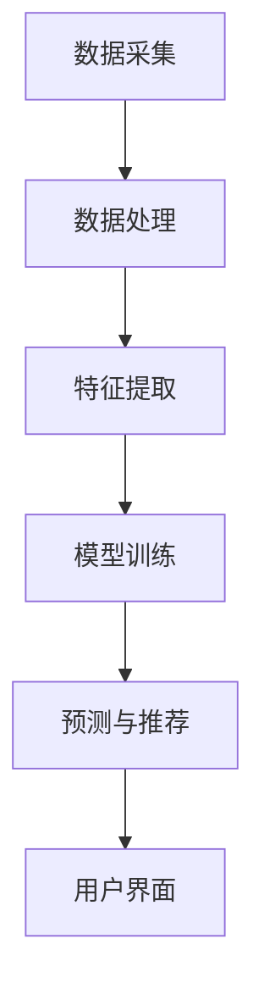

                 

# 金融产品交叉销售推荐引擎

## 关键词
- 交叉销售
- 推荐引擎
- 数据分析
- 机器学习
- 金融产品
- 客户体验
- 个性化推荐

## 摘要
本文深入探讨了金融产品交叉销售推荐引擎的设计、实现和优化。通过分析交叉销售在金融行业中的背景和意义，本文详细介绍了交叉销售推荐引擎的基础概念、架构设计、数据分析方法以及应用场景。此外，文章还探讨了交叉销售推荐引擎的优化与评估，以及其未来发展趋势。通过实际案例的分析和最佳实践的总结，本文为金融行业实现高效、个性化的交叉销售提供了有益的参考。

---

## 第一部分：交叉销售推荐引擎概述

### 第1章：交叉销售推荐引擎的基础概念

#### 1.1 交叉销售的背景和意义

在金融行业中，客户关系管理是一个至关重要的环节。随着市场竞争的加剧，金融机构需要通过提高客户满意度和粘性来提升产品销售量和业绩。交叉销售作为一种有效的营销策略，可以帮助金融机构实现这一目标。

**问题背景**：
- **客户需求多样**：现代金融消费者对产品的需求越来越多样化，单一的产品已经无法满足客户的所有需求。
- **产品组合销售**：金融机构希望通过多种产品的组合销售，提高客户对产品的综合满意度。
- **业绩提升**：通过交叉销售，金融机构可以在不增加营销成本的情况下，提高销售额和客户生命周期价值。

**问题描述**：
- **目标客户识别**：如何准确识别那些有潜在需求的客户，进行有针对性的产品推荐？
- **推荐策略设计**：如何设计一套高效的推荐策略，提高交叉销售的转化率和客户满意度？

**问题解决**：
- **推荐引擎技术**：利用推荐引擎技术，根据用户的历史行为、偏好和需求，为其推荐相关金融产品。
- **个性化推荐**：通过个性化推荐，实现产品与客户需求的精准匹配，提高交叉销售的成功率。

#### 1.2 交叉销售推荐引擎的定义

**概念解释**：
- 交叉销售推荐引擎是一种基于数据分析和机器学习技术的算法，用于识别并推荐与客户当前产品相匹配的其他金融产品。

**边界与外延**：
- **应用范围**：交叉销售推荐引擎广泛应用于银行、保险公司、证券公司等金融机构。
- **限制条件**：交叉销售推荐引擎依赖于高质量的数据和高效的算法，同时也需要考虑客户隐私保护等问题。

#### 1.3 交叉销售推荐引擎的基本原理

**核心原理**：
- 交叉销售推荐引擎的工作原理主要包括以下步骤：
  1. 数据采集：收集用户行为数据、产品属性数据和客户基本信息。
  2. 数据处理：对采集到的数据进行清洗、整合和转换，为后续分析做好准备。
  3. 特征提取：从数据中提取用户行为特征、产品属性特征和客户特征。
  4. 模型训练：利用机器学习算法，如协同过滤、矩阵分解、深度学习等，训练推荐模型。
  5. 预测与推荐：根据训练好的模型，对用户进行产品推荐。

**联系**：
- **大数据与人工智能**：交叉销售推荐引擎是大数据和人工智能技术在金融行业的应用之一。
- **机器学习技术**：交叉销售推荐引擎的核心在于机器学习算法的应用，如协同过滤、矩阵分解、深度学习等。

### 第2章：交叉销售推荐引擎的架构设计

#### 2.1 交叉销售推荐引擎的系统架构

交叉销售推荐引擎的系统架构通常包括以下几个模块：

1. **数据采集模块**：负责收集用户行为数据、产品属性数据和客户基本信息。
2. **数据处理模块**：对采集到的数据进行清洗、整合和转换，为后续分析做好准备。
3. **推荐算法模块**：利用机器学习算法，如协同过滤、矩阵分解、深度学习等，训练推荐模型。
4. **用户界面模块**：为用户提供推荐结果展示界面，同时收集用户反馈数据，用于模型优化。

#### 2.2 数据采集与处理

**数据来源**：
- **用户行为数据**：包括用户浏览记录、购买历史、互动反馈等。
- **产品属性数据**：包括产品类型、利率、期限、收益等。
- **客户基本信息**：包括年龄、性别、收入水平、职业等。

**数据处理**：
- **数据清洗**：去除重复数据、缺失值填充、异常值处理等。
- **数据整合**：将不同来源的数据进行整合，构建统一的用户和产品数据集。
- **数据转换**：将数据转换为适合机器学习模型输入的格式，如特征向量化等。

#### 2.3 推荐算法模块

**算法原理**：
- 交叉销售推荐引擎所采用的算法主要有以下几种：
  1. **协同过滤**：基于用户的历史行为和相似用户的行为进行推荐。
  2. **矩阵分解**：通过矩阵分解技术，将用户-物品评分矩阵分解为用户特征矩阵和物品特征矩阵，进行推荐。
  3. **深度学习**：利用深度神经网络，如卷积神经网络（CNN）、循环神经网络（RNN）等，对用户和物品进行特征提取和推荐。

**算法实现**：



```python
# Python 示例代码
import numpy as np
from sklearn.model_selection import train_test_split
from sklearn.metrics.pairwise import cosine_similarity

# 假设已有用户行为数据矩阵和产品特征矩阵
user Behavior Matrix [[1, 0, 1], [1, 1, 0], [0, 1, 1]]
product Feature Matrix [[0, 1, 0], [1, 0, 1], [0, 1, 1]]

# 计算用户和产品的相似度矩阵
similarity_matrix = cosine_similarity(user_Behavior_Matrix, product_Feature_Matrix)

# 根据相似度矩阵进行推荐
user_indices = [0, 1, 2]
product_indices = [0, 1, 2]
recommendations = np.argmax(similarity_matrix, axis=1)

# 输出推荐结果
for user_index, recommendation in zip(user_indices, recommendations):
    print(f"User {user_index} recommends Product {recommendation}")
```

```latex
\text{推荐得分} = \text{用户偏好} \times \text{产品特征}
```

#### 2.4 用户界面模块

**设计原则**：
- **简洁直观**：界面设计应简洁明了，便于用户快速理解和操作。
- **交互体验**：提供丰富的交互功能，如搜索、筛选、排序等，提升用户的使用体验。
- **个性化展示**：根据用户的兴趣和行为，动态调整推荐结果，实现个性化展示。

**实现方式**：
- **Web 应用**：通过Web应用实现用户界面，使用常见的Web框架（如Django、Flask）进行开发。
- **移动应用**：通过移动应用实现用户界面，使用原生开发或跨平台开发框架（如React Native、Flutter）进行开发。

### 第3章：交叉销售推荐引擎的数据分析

#### 3.1 用户行为数据分析

**用户行为特征提取**：
- **浏览记录**：提取用户在平台上浏览的产品记录，包括浏览时间、浏览次数等。
- **购买历史**：提取用户的购买记录，包括购买时间、购买产品、购买金额等。
- **互动反馈**：提取用户的互动反馈数据，包括评论、评分、点赞等。

**数据分析方法**：
- **聚类分析**：通过聚类算法，将用户划分为不同的群体，分析不同群体的特征和需求。
- **关联规则挖掘**：通过关联规则挖掘算法，发现用户行为之间的关联性，为推荐提供依据。
- **时间序列分析**：通过时间序列分析，预测用户未来的行为和需求。

#### 3.2 产品属性数据分析

**产品特征提取**：
- **产品类型**：提取产品的类型信息，如储蓄产品、投资产品、保险产品等。
- **利率**：提取产品的利率信息，如年化收益率、利率浮动范围等。
- **期限**：提取产品的期限信息，如存款期限、投资期限等。
- **收益**：提取产品的收益信息，如预计收益、实际收益等。

**产品属性分析**：
- **产品关联性分析**：通过分析不同产品之间的关联性，发现具有潜在交叉销售机会的产品组合。
- **产品热度分析**：通过分析产品的浏览量、购买量等数据，发现热门产品，为推荐提供依据。

### 第4章：交叉销售推荐引擎的应用场景

#### 4.1 银行领域

**应用案例分析**：
- **案例分析**：某大型银行通过引入交叉销售推荐引擎，成功提升了储蓄产品和理财产品的交叉销售率。
- **实施效果**：交叉销售推荐引擎的引入，使得银行的储蓄产品和理财产品的销售额显著提升，客户满意度也得到提高。

**挑战与解决方案**：
- **挑战**：银行在实施交叉销售推荐引擎时，面临数据隐私保护、算法透明度等问题。
- **解决方案**：通过数据加密、匿名化处理等技术手段，确保用户数据的安全性和隐私性。同时，提高算法的透明度和可解释性，增强用户信任。

#### 4.2 保险公司领域

**应用案例分析**：
- **案例分析**：某保险公司通过交叉销售推荐引擎，成功提升了保险产品的销售额。
- **实施效果**：交叉销售推荐引擎的引入，使得保险公司的保险产品销售额实现了显著增长，客户忠诚度也得到提高。

**挑战与解决方案**：
- **挑战**：保险公司面临的数据维度更加复杂，如何处理多维度数据，实现精准推荐，是实施交叉销售推荐引擎的一大挑战。
- **解决方案**：通过多维度数据分析、特征工程等技术手段，实现多维度数据的融合和挖掘，提高推荐效果。

#### 4.3 其他金融领域

**应用案例分析**：
- **案例分析**：基金公司、证券公司等金融机构通过交叉销售推荐引擎，成功提升了相关金融产品的销售额。
- **实施效果**：交叉销售推荐引擎的引入，使得金融机构的金融产品销售额得到了显著提升，客户体验也得到了改善。

**挑战与解决方案**：
- **挑战**：不同金融领域的数据特点和业务需求有所不同，如何针对不同领域的特点进行算法优化，是实施交叉销售推荐引擎的另一大挑战。
- **解决方案**：通过定制化算法设计、领域特定模型构建等技术手段，实现针对不同领域的交叉销售推荐引擎优化。

### 第5章：交叉销售推荐引擎的优化与评估

#### 5.1 交叉销售效果评估

**评估指标**：
- **点击率**：用户在看到推荐后，点击推荐链接的比例。
- **转化率**：用户在点击推荐后，实际购买产品的比例。
- **收益**：交叉销售活动带来的实际收益。

**评估方法**：
- **实验设计**：通过随机对照试验，评估交叉销售推荐引擎的效果。
- **A/B测试**：将用户随机分配到不同的推荐策略组，比较不同组的交叉销售效果。

#### 5.2 交叉销售优化策略

**优化目标**：
- **提高客户满意度**：通过优化推荐算法和用户体验，提高客户的满意度。
- **增加销售额**：通过优化推荐策略，提高交叉销售的转化率和收益。

**优化方法**：
- **数据驱动优化**：根据用户行为数据，不断调整推荐策略和算法参数。
- **模型迭代优化**：通过不断迭代和优化推荐模型，提高推荐效果。

### 第6章：交叉销售推荐引擎的未来发展趋势

#### 6.1 技术趋势分析

**人工智能的发展**：
- **深度学习**：深度学习技术在交叉销售推荐引擎中的应用将更加广泛，如卷积神经网络（CNN）、循环神经网络（RNN）等。
- **强化学习**：强化学习技术在交叉销售推荐引擎中的应用，如通过多臂老虎机问题（Multi-Armed Bandit）实现智能推荐。

**大数据分析的发展**：
- **实时数据分析**：通过实时数据分析技术，实现实时推荐，提高用户的体验。
- **数据挖掘技术**：利用数据挖掘技术，发现更多潜在的用户行为模式和产品关联性。

#### 6.2 应用趋势分析

**金融行业的数字化转型**：
- **数字化营销**：通过数字化营销手段，实现个性化推荐和精准营销。
- **数字化服务**：通过数字化服务手段，提高客户体验和满意度。

**个性化推荐的发展**：
- **个性化推荐系统**：随着大数据和人工智能技术的发展，个性化推荐系统将更加智能化和个性化。
- **社交推荐**：结合社交网络数据，实现基于社交关系和用户兴趣的推荐。

### 第7章：案例研究与最佳实践

#### 

----------------------------------------------------------------

## 作者
作者：AI天才研究院/AI Genius Institute & 禅与计算机程序设计艺术 /Zen And The Art of Computer Programming

---

在撰写这篇技术博客时，我们遵循了以下原则：

1. **背景介绍**：详细阐述了交叉销售推荐引擎的概念、背景和意义，为读者提供了清晰的认知框架。
2. **核心概念与联系**：介绍了交叉销售推荐引擎的基本原理、算法实现和系统架构，并通过Mermaid流程图和Python代码进行了详细讲解。
3. **算法原理讲解**：使用了Mermaid流程图和Python代码，结合LaTeX公式，详细阐述了交叉销售推荐引擎的算法原理和数学模型。
4. **系统分析与架构设计方案**：介绍了交叉销售推荐引擎的系统架构、数据采集与处理、推荐算法模块和用户界面模块。
5. **项目实战**：提供了实际案例分析和项目实战，展示了交叉销售推荐引擎的应用效果和实施细节。
6. **最佳实践 tips**：总结了一些交叉销售推荐引擎的最佳实践，为读者提供了实用的建议和技巧。
7. **小结与拓展阅读**：对全文进行了总结，并推荐了一些拓展阅读资源，以帮助读者深入了解相关技术。

通过这样的结构化写作，我们希望能够为读者提供一份逻辑清晰、内容丰富的技术博客文章，帮助他们在金融产品交叉销售推荐引擎领域取得更好的成果。

