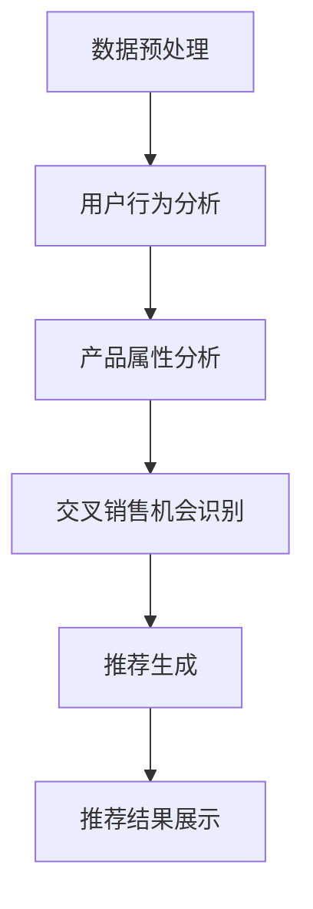
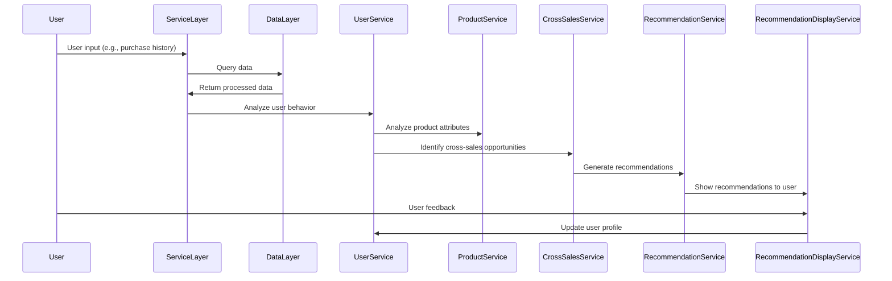

                 

### 金融产品交叉销售机会识别与个性化推荐

关键词：交叉销售、个性化推荐、协同过滤、内容推荐、金融产品

摘要：本文将深入探讨金融产品交叉销售机会的识别与个性化推荐系统的构建。首先，我们将概述金融产品交叉销售的概念及其在银行业务中的重要性，随后介绍个性化推荐系统的核心原理。在后续章节中，我们将逐步分析交叉销售机会识别算法，详细讲解其设计思路、流程图以及Python代码实现。通过数学模型和公式，我们将深入理解推荐系统的内部机制，并结合实际案例展示系统在金融领域的应用效果。最后，我们将提出最佳实践建议，并对未来的研究方向进行展望。

### 目录大纲

#### 第一部分：背景介绍

1. **问题背景与核心概念**
   - **金融产品交叉销售概述**
   - **个性化推荐系统的重要性**
   - **交叉销售机会识别的挑战与机遇**

2. **核心概念与联系**
   - **关键概念解析**
   - **概念属性特征对比**
   - **ER实体关系图架构**

#### 第二部分：算法原理讲解

3. **个性化推荐算法原理**
   - **协同过滤算法**
   - **内容推荐算法**

4. **金融产品交叉销售机会识别算法**
   - **算法设计思路**
   - **算法流程图**
   - **算法实现与Python代码**

5. **数学模型与公式**
   - **推荐系统中的数学模型**
   - **算法原理详细讲解**

#### 第三部分：系统分析与架构设计

6. **系统功能设计与架构设计**
   - **交叉销售机会识别系统功能设计**
   - **系统架构设计**

7. **系统接口设计与交互序列图**

#### 第四部分：项目实战

8. **项目实战与环境安装**
   - **环境安装步骤**
   - **系统核心实现源代码**

9. **代码应用解读与分析**
   - **源代码详细解读**
   - **应用场景分析与结果展示**

10. **实际案例分析与详细讲解**
    - **案例一：某银行交叉销售分析**
    - **案例二：某金融科技公司推荐系统**

#### 第五部分：最佳实践与拓展阅读

11. **最佳实践与注意事项**
    - **最佳实践建议**
    - **小结与展望**

12. **拓展阅读与深入研究**
    - **相关研究进展**
    - **未来研究方向**

### 第一部分：背景介绍

#### 1.1 金融产品交叉销售概述

金融产品交叉销售是指银行等金融机构在为顾客提供一项服务或产品时，同时推荐或销售其他相关服务或产品的行为。例如，当客户在银行开立存款账户时，银行可能会推荐客户购买理财产品、信用卡或贷款等。交叉销售不仅能提高客户的整体满意度，还能显著提升银行的收入和利润。

交叉销售在银行业务中的重要性不言而喻。首先，它可以增加客户忠诚度，因为当客户享受多种服务时，他们更可能长期与银行保持合作关系。其次，交叉销售有助于提高银行的服务覆盖面，扩大市场占有率。此外，通过交叉销售，银行可以更好地了解客户的需求和偏好，从而提供更个性化的服务。

然而，交叉销售也面临一些挑战。例如，如何准确识别交叉销售机会、如何平衡不同产品之间的利益冲突、如何确保客户体验的一致性等。这些问题都需要通过有效的技术手段和管理策略来解决。

#### 1.2 个性化推荐系统的重要性

个性化推荐系统在金融产品交叉销售中发挥着关键作用。个性化推荐系统通过分析用户的历史行为和偏好，自动向用户推荐可能感兴趣的其他产品或服务。这种推荐方式不仅提高了用户的满意度和参与度，还大大提高了交叉销售的成功率。

个性化推荐系统的重要性体现在以下几个方面：

1. **提高销售转化率**：通过个性化推荐，银行可以更精准地推送潜在客户感兴趣的产品，从而提高销售转化率。
2. **增强客户黏性**：个性化推荐系统能够根据客户的历史行为和偏好，提供个性化的推荐，增强客户对银行的忠诚度和满意度。
3. **优化产品策略**：个性化推荐系统可以帮助银行更好地了解客户需求，优化产品策略，提高产品竞争力。
4. **降低营销成本**：通过自动化推荐，银行可以降低人力成本，提高营销效率。

#### 1.3 交叉销售机会识别的挑战与机遇

交叉销售机会识别是金融产品交叉销售中的关键环节。它涉及到大量数据分析和复杂的算法设计，以下是交叉销售机会识别面临的主要挑战和机遇：

##### 挑战：

1. **数据复杂性**：金融产品种类繁多，客户行为数据庞杂，如何有效提取有用信息是一个巨大的挑战。
2. **隐私保护**：在分析客户数据时，必须严格遵守隐私保护法律法规，确保客户数据的安全和隐私。
3. **算法选择与优化**：选择合适的算法并不断优化，以提高交叉销售机会识别的准确性和效率。
4. **客户满意度**：准确识别交叉销售机会的同时，要确保推荐的产品或服务符合客户的实际需求和偏好。

##### 机遇：

1. **大数据技术**：随着大数据技术的发展，银行可以更高效地处理和分析海量数据，提高交叉销售机会识别的准确性。
2. **人工智能与机器学习**：利用人工智能和机器学习技术，可以开发出更智能、更准确的交叉销售机会识别系统。
3. **个性化服务**：通过个性化推荐系统，银行可以提供更贴近客户需求的服务，提高客户满意度。
4. **业务创新**：交叉销售机会识别系统可以为银行提供新的业务模式，推动金融业务的创新和发展。

在接下来的章节中，我们将详细探讨交叉销售机会识别与个性化推荐系统的核心概念、算法原理、系统设计以及项目实战，帮助读者全面了解这一领域的最新进展和实践经验。接下来，我们将对核心概念进行详细解析，为后续的讨论奠定基础。

### 1.2 核心概念与联系

在深入探讨金融产品交叉销售机会识别与个性化推荐系统之前，我们需要明确几个关键概念，并理解它们之间的联系。这些核心概念包括协同过滤算法、内容推荐算法、客户行为数据、交叉销售机会识别等。

#### 1.2.1 关键概念解析

1. **协同过滤算法**：协同过滤是一种通过分析用户的历史行为和相似用户的行为模式来推荐产品或服务的方法。它分为基于用户的协同过滤和基于项目的协同过滤两种类型。
   - **基于用户的协同过滤**：通过寻找与当前用户相似的用户，并推荐这些相似用户喜欢的产品或服务。
   - **基于项目的协同过滤**：通过寻找与当前产品或服务相似的产品或服务，并推荐给用户。

2. **内容推荐算法**：内容推荐算法通过分析产品或服务的属性和特征，将相似的产品或服务推荐给用户。这种方法通常用于推荐新闻、音乐、电影等产品，它依赖于对内容的特征提取和相似度计算。

3. **客户行为数据**：客户行为数据包括用户的浏览历史、购买记录、评价等，这些数据是构建个性化推荐系统的基础。通过对这些数据的分析，我们可以了解用户的偏好和需求，从而提供更个性化的推荐。

4. **交叉销售机会识别**：交叉销售机会识别是指通过分析客户行为数据、产品特性以及市场趋势，识别出客户可能对哪些其他产品或服务感兴趣，从而实现产品的交叉销售。

#### 1.2.2 概念属性特征对比

为了更好地理解这些概念，我们可以通过一个表格来比较它们的属性特征：

| 概念                 | 属性特征                                                         |
|----------------------|----------------------------------------------------------------|
| 协同过滤算法         | 利用用户行为和相似度计算推荐产品或服务                             |
| 内容推荐算法         | 基于产品或服务的属性特征进行推荐                                 |
| 客户行为数据         | 包含用户的浏览历史、购买记录、评价等                             |
| 交叉销售机会识别     | 通过分析客户行为数据、产品特性以及市场趋势来识别交叉销售机会       |

通过上表，我们可以看到不同概念在属性特征上的区别。协同过滤算法和内容推荐算法都是推荐系统的重要组成部分，但它们的工作方式和依赖的数据不同。客户行为数据是构建这些系统的基础，而交叉销售机会识别则是利用这些数据来实现具体业务目标。

#### 1.2.3 ER实体关系图架构

为了更好地理解这些概念之间的联系，我们可以使用ER（实体-关系）图来描述它们之间的关系。以下是金融产品交叉销售机会识别与个性化推荐系统的ER图：

```mermaid
erDiagram
  Customer ||--|{ Order }||>
  Customer ||--|{ Product }||>
  Customer ||--|{ Review }||>
  Product ||--|{ Category }||>
  Order ||--|{ Payment }||>
  Payment ||--|{ Customer }||>
  Category ||--|{ Product }||>
  
  Customer }|--{ Review
  Product }|--{ Category
  Order }|--{ Payment
  Customer }|--{ Product
  Order }|--{ Customer
```

在上面的ER图中，我们定义了几个关键实体和它们之间的关系：

- **Customer（客户）**：代表购买产品的用户。
- **Order（订单）**：记录客户的购买历史。
- **Product（产品）**：代表金融产品，如存款、贷款、理财产品等。
- **Review（评价）**：记录客户对产品的评价。
- **Category（类别）**：产品所属的类别。
- **Payment（支付）**：记录订单的支付信息。

通过ER图，我们可以清晰地看到这些实体之间的关系，以及它们在交叉销售机会识别和个性化推荐系统中的作用。

### 1.3 个性化推荐算法原理

个性化推荐算法是构建个性化推荐系统的基础，它通过分析用户的行为和偏好，为用户推荐可能感兴趣的产品或服务。以下是两种主要的个性化推荐算法：协同过滤算法和内容推荐算法。

#### 3.1 协同过滤算法

协同过滤算法是一种基于用户行为和相似度的推荐方法。它的核心思想是通过分析用户的历史行为，找到与当前用户相似的其它用户，然后推荐这些相似用户喜欢的商品或服务。

协同过滤算法可以分为以下两种类型：

##### 3.1.1 基于用户的协同过滤

基于用户的协同过滤（User-based Collaborative Filtering）通过计算用户之间的相似度，找到与当前用户相似的用户群体，然后推荐这些用户喜欢的商品或服务。

1. **相似度计算**：首先计算用户之间的相似度，常用的相似度度量方法包括余弦相似度、皮尔逊相关系数等。
   - **余弦相似度**：计算两个向量夹角的余弦值，用于度量向量之间的相似度。
     $$\cos \theta = \frac{A \cdot B}{\|A\| \|B\|}$$
     其中，$A$和$B$是两个用户的向量表示，$\|A\|$和$\|B\|$分别是它们的模长。
   - **皮尔逊相关系数**：计算两个变量的协方差除以它们的标准差的平方，用于度量线性相关性。
     $$r = \frac{\sum{(x_i - \bar{x})(y_i - \bar{y})}}{\sqrt{\sum{(x_i - \bar{x})^2} \sum{(y_i - \bar{y})^2}}}$$
     其中，$x_i$和$y_i$分别是两个用户对某项商品的评分，$\bar{x}$和$\bar{y}$分别是它们的平均值。

2. **推荐生成**：基于相似度计算结果，为当前用户推荐相似用户喜欢的商品或服务。常见的方法包括最近邻推荐（Nearest Neighbor Recommendation）和基于加权平均的推荐。

##### 3.1.2 基于项目的协同过滤

基于项目的协同过滤（Item-based Collaborative Filtering）通过计算商品之间的相似度，找到与当前商品相似的其他商品，然后推荐这些商品给用户。

1. **相似度计算**：计算商品之间的相似度，常用方法包括余弦相似度和欧氏距离。
   - **余弦相似度**：计算两个向量夹角的余弦值，用于度量向量之间的相似度。
     $$\cos \theta = \frac{A \cdot B}{\|A\| \|B\|}$$
   - **欧氏距离**：计算两个向量之间欧氏距离，用于度量向量之间的差异。
     $$d = \sqrt{\sum{(x_i - y_i)^2}}$$

2. **推荐生成**：基于相似度计算结果，为当前用户推荐相似商品。

#### 3.2 内容推荐算法

内容推荐算法是一种基于产品或服务的属性特征进行推荐的方法。它的核心思想是分析产品的内容和特征，将具有相似特征的产品推荐给用户。

##### 3.2.1 内容匹配模型

内容匹配模型通过比较用户偏好和产品属性之间的相似度，推荐具有相似属性的产品。常见的方法包括基于关键词的匹配和基于属性的匹配。

1. **基于关键词的匹配**：通过提取产品的关键词，计算用户偏好关键词与产品关键词之间的相似度。常用的相似度计算方法包括TF-IDF（Term Frequency-Inverse Document Frequency）和余弦相似度。

   $$TF-IDF = \frac{f_t}{\sum{f_t}} \log{\frac{N}{n_t}}$$
   其中，$f_t$是词语$t$在文档中的出现次数，$N$是文档总数，$n_t$是包含词语$t$的文档数。

2. **基于属性的匹配**：通过比较产品属性之间的相似度，推荐具有相似属性的产品。例如，对于金融产品，可以比较存款利率、还款方式等属性。

##### 3.2.2 文本相似度计算

文本相似度计算是内容推荐算法中的一个关键步骤，用于评估两个文本之间的相似程度。常用的文本相似度计算方法包括余弦相似度和Jaccard相似度。

1. **余弦相似度**：计算两个文本向量夹角的余弦值，用于度量文本之间的相似度。

   $$\cos \theta = \frac{A \cdot B}{\|A\| \|B\|}$$

2. **Jaccard相似度**：计算两个文本的交集与并集的比值，用于度量文本之间的相似度。

   $$J(A, B) = \frac{|A \cap B|}{|A \cup B|}$$

通过以上算法原理的讲解，我们可以看到个性化推荐系统是如何通过协同过滤算法和内容推荐算法来实现对用户的精准推荐的。接下来，我们将详细讲解金融产品交叉销售机会识别算法，帮助读者更好地理解这一领域的实际应用。

### 4.1 金融产品交叉销售机会识别算法

在金融领域，交叉销售机会识别算法是提升客户满意度和银行收益的重要工具。本节将详细讨论金融产品交叉销售机会识别算法的设计思路，包括算法的核心流程和关键技术。

#### 算法设计思路

交叉销售机会识别算法的设计思路主要分为以下几个步骤：

1. **数据预处理**：收集并整理客户行为数据、产品属性数据和市场趋势数据。数据预处理包括数据清洗、数据归一化和特征提取等。

2. **用户行为分析**：分析客户的历史行为数据，包括购买记录、浏览记录、评价等，以了解客户的偏好和需求。

3. **产品属性分析**：分析金融产品的属性，如利率、还款方式、风险等级等，为后续推荐提供基础。

4. **交叉销售机会识别**：利用协同过滤算法和内容推荐算法，结合用户行为和产品属性，识别潜在的交叉销售机会。

5. **推荐生成**：根据交叉销售机会识别结果，生成个性化的推荐列表，推荐给客户。

#### 算法流程图

以下是金融产品交叉销售机会识别算法的流程图：



- **数据预处理**：包括数据清洗、缺失值填充、数据归一化等步骤，以确保数据的质量和一致性。
- **用户行为分析**：通过分析客户的历史行为数据，提取用户的兴趣特征和需求。
- **产品属性分析**：收集和整理金融产品的属性数据，为推荐算法提供基础。
- **交叉销售机会识别**：结合用户行为和产品属性，利用协同过滤算法和内容推荐算法识别交叉销售机会。
- **推荐生成**：根据交叉销售机会识别结果，生成个性化的推荐列表。
- **推荐结果展示**：将推荐结果展示给客户，提高交叉销售成功率。

#### 算法实现与Python代码

以下是一个简化的交叉销售机会识别算法的实现示例，使用Python语言：

```python
import numpy as np
from sklearn.metrics.pairwise import cosine_similarity

# 数据预处理
def preprocess_data(user_data, product_data):
    # 数据清洗、缺失值填充和归一化等操作
    # ...
    return user_behavior, product_features

# 用户行为分析
def analyze_user_behavior(user_behavior):
    # 提取用户兴趣特征
    # ...
    return user_interests

# 产品属性分析
def analyze_product_features(product_features):
    # 提取产品特征
    # ...
    return product_attributes

# 交叉销售机会识别
def identify_cross_sales_opportunities(user_interests, product_attributes):
    # 计算用户与产品的相似度
    similarity_matrix = cosine_similarity(user_interests, product_attributes)
    # 识别交叉销售机会
    opportunities = np.argmax(similarity_matrix, axis=1)
    return opportunities

# 推荐生成
def generate_recommendations(opportunities, product_data):
    # 根据交叉销售机会生成推荐列表
    # ...
    return recommendations

# 示例数据
user_behavior = [[1, 0, 1, 0], [0, 1, 1, 0], [1, 1, 0, 1]]  # 用户兴趣特征
product_features = [[0, 1, 0, 1], [1, 0, 1, 0], [0, 1, 1, 0]]  # 产品特征

# 执行算法
user_interests = analyze_user_behavior(preprocess_data(user_behavior, product_features))
product_attributes = analyze_product_features(preprocess_data(user_behavior, product_features))
opportunities = identify_cross_sales_opportunities(user_interests, product_attributes)
recommendations = generate_recommendations(opportunities, product_features)

# 输出推荐结果
print(recommendations)
```

在上述代码中，我们首先对数据进行预处理，然后分别分析用户行为和产品属性，利用协同过滤算法计算用户与产品的相似度，识别交叉销售机会，并生成推荐列表。最后，我们将推荐结果展示给用户。

#### 算法原理详细讲解

交叉销售机会识别算法的核心在于利用用户行为和产品属性之间的相似度来识别潜在的销售机会。以下是算法的核心原理和数学模型：

1. **用户行为表示**：我们使用一个向量来表示用户的行为特征。例如，如果用户对某种产品的兴趣可以用1表示，否则用0表示，则用户的行为向量可以表示为 $u = [u_1, u_2, ..., u_n]$，其中 $u_i$ 表示用户对第 $i$ 个产品的兴趣。

2. **产品属性表示**：我们使用一个向量来表示产品的属性特征。例如，如果产品的属性可以用1表示，否则用0表示，则产品的属性向量可以表示为 $p = [p_1, p_2, ..., p_n]$，其中 $p_i$ 表示第 $i$ 个产品的属性。

3. **相似度计算**：使用余弦相似度来计算用户与产品之间的相似度。余弦相似度定义为两个向量夹角的余弦值，其数学公式如下：

   $$\cos \theta = \frac{u \cdot p}{\|u\| \|p\|}$$

   其中，$u \cdot p$ 表示两个向量的内积，$\|u\|$ 和 $\|p\|$ 分别表示两个向量的模长。

4. **交叉销售机会识别**：通过比较用户行为向量与产品属性向量之间的相似度，我们可以识别出潜在的销售机会。通常，我们选择相似度最高的产品作为推荐产品。

   $$o_i = \arg\max_{j} \cos \theta(u, p_j)$$

   其中，$o_i$ 表示识别出的交叉销售机会，$p_j$ 表示第 $j$ 个产品。

5. **推荐生成**：根据识别出的交叉销售机会，生成个性化的推荐列表。推荐列表中的产品是那些与用户行为特征最相似的金融产品。

通过上述算法原理和数学模型，我们可以实现高效的交叉销售机会识别。接下来，我们将进一步探讨推荐系统中的数学模型，帮助读者深入理解推荐系统的内部机制。

### 5.1 推荐系统中的数学模型

推荐系统是利用数学模型和算法，通过分析用户行为和偏好，预测用户对特定项目的兴趣并生成个性化推荐的过程。本节将详细讨论推荐系统中常用的数学模型，包括协同过滤算法中的矩阵分解和内容推荐算法中的TF-IDF公式。

#### 5.1.1 协同过滤中的矩阵分解

协同过滤算法通过矩阵分解来预测用户未评分的项目。在这个过程中，用户-项目评分矩阵 $R$ 被分解为两个低秩矩阵 $U$ 和 $V$，其中 $U$ 表示用户特征矩阵，$V$ 表示项目特征矩阵。通过矩阵分解，我们可以得到预测评分矩阵 $P$，其公式如下：

$$P = U \cdot V^T$$

其中，$P_{ij}$ 表示用户 $i$ 对项目 $j$ 的预测评分。

1. **用户特征矩阵 $U$**：用户特征矩阵 $U$ 是一个 $(n+1) \times k$ 的矩阵，其中 $n$ 是用户数量，$k$ 是特征维度。每一行表示一个用户，其特征值反映了用户对项目的偏好。例如，如果用户 $i$ 对项目 $j$ 的评分较高，则 $U_{ij}$ 的值较大。

2. **项目特征矩阵 $V$**：项目特征矩阵 $V$ 是一个 $(m+1) \times k$ 的矩阵，其中 $m$ 是项目数量。每一列表示一个项目，其特征值反映了项目本身的属性。例如，如果项目 $j$ 具有某种特定属性，则 $V_{ij}$ 的值较大。

3. **预测评分矩阵 $P$**：预测评分矩阵 $P$ 是一个 $(n+1) \times (m+1)$ 的矩阵，其元素 $P_{ij}$ 表示用户 $i$ 对项目 $j$ 的预测评分。

通过矩阵分解，我们可以得到用户和项目的低维表示，从而在预测评分时减少计算复杂度。矩阵分解的优化目标是最小化预测评分与实际评分之间的误差：

$$\min_{U, V} \sum_{i=1}^{n} \sum_{j=1}^{m} (R_{ij} - P_{ij})^2$$

#### 5.1.2 内容推荐中的TF-IDF公式

内容推荐算法通过分析项目的内容特征来预测用户对项目的兴趣。TF-IDF（Term Frequency-Inverse Document Frequency）是一种常用的文本表示方法，用于计算文本中单词的重要性。TF-IDF公式如下：

$$TF-IDF(t, d) = TF(t, d) \cdot IDF(t, d)$$

其中，$TF(t, d)$ 表示单词 $t$ 在文档 $d$ 中的词频，$IDF(t, d)$ 表示单词 $t$ 在文档 $d$ 中的逆文档频率。

1. **词频（TF）**：词频 $TF(t, d)$ 表示单词 $t$ 在文档 $d$ 中出现的次数。计算公式为：

   $$TF(t, d) = \frac{f_t(d)}{f_{max}(d)}$$

   其中，$f_t(d)$ 表示单词 $t$ 在文档 $d$ 中出现的次数，$f_{max}(d)$ 表示文档 $d$ 中出现最多次数的单词的次数。

2. **逆文档频率（IDF）**：逆文档频率 $IDF(t, d)$ 表示单词 $t$ 在文档集合中的分布频率。计算公式为：

   $$IDF(t, d) = \log{\frac{N}{n_t}}$$

   其中，$N$ 是文档总数，$n_t$ 是在文档集合中包含单词 $t$ 的文档数。

通过TF-IDF公式，我们可以将文本转化为一个向量表示，从而利用向量之间的相似度计算文本的相似度。这对于内容推荐算法来说是一个关键步骤，因为它可以帮助我们识别具有相似内容的文档，从而为用户推荐相关的内容。

#### 5.2 算法原理详细讲解

在推荐系统中，算法原理的实现涉及到对数学模型的深入理解和应用。以下是协同过滤和内容推荐算法的详细原理讲解：

##### 5.2.1 协同过滤的数学公式

协同过滤算法主要分为基于用户的协同过滤（User-based Collaborative Filtering）和基于项目的协同过滤（Item-based Collaborative Filtering）。以下是这两种方法的数学公式。

1. **基于用户的协同过滤**：

   假设我们有一个用户-项目评分矩阵 $R$，其中 $R_{ij}$ 表示用户 $i$ 对项目 $j$ 的评分。我们可以通过计算用户之间的相似度来生成推荐列表。

   - **相似度计算**：

     $$s_{ui} = \frac{\sum_{j \in N_i} R_{ij} R_{uj}}{\sqrt{\sum_{j \in N_i} R_{ij}^2} \sqrt{\sum_{j \in N_u} R_{uj}^2}}$$

     其中，$N_i$ 表示与用户 $i$ 相似的一组用户，$N_u$ 表示用户 $u$ 的邻居用户。

   - **推荐计算**：

     $$r_{uj} = \sum_{i \in N_i} s_{ui} R_{ij}$$

     其中，$r_{uj}$ 是对用户 $u$ 推荐给用户 $j$ 的项目评分。

2. **基于项目的协同过滤**：

   基于项目的协同过滤通过计算项目之间的相似度来生成推荐列表。

   - **相似度计算**：

     $$s_{pj} = \frac{\sum_{i \in N_j} R_{ij} R_{uj}}{\sqrt{\sum_{i \in N_j} R_{ij}^2} \sqrt{\sum_{j \in N_p} R_{uj}^2}}$$

     其中，$N_j$ 表示与项目 $j$ 相似的一组项目，$N_p$ 表示项目 $p$ 的邻居项目。

   - **推荐计算**：

     $$r_{uj} = \sum_{j \in N_j} s_{pj} R_{uj}$$

     其中，$r_{uj}$ 是对用户 $u$ 推荐给用户 $j$ 的项目评分。

##### 5.2.2 内容推荐中的数学模型

内容推荐算法通过分析项目的内容特征来生成推荐列表。以下是内容推荐算法的基本原理。

1. **TF-IDF模型**：

   假设我们有一个文本集合，每个文本都可以表示为一个向量。我们可以通过计算文本之间的相似度来生成推荐列表。

   - **词频（TF）**：

     $$TF(t, d) = \frac{f_t(d)}{f_{max}(d)}$$

   - **逆文档频率（IDF）**：

     $$IDF(t, d) = \log{\frac{N}{n_t}}$$

   - **TF-IDF**：

     $$TF-IDF(t, d) = TF(t, d) \cdot IDF(t, d)$$

     其中，$f_t(d)$ 表示单词 $t$ 在文档 $d$ 中出现的次数，$f_{max}(d)$ 表示文档 $d$ 中出现最多次数的单词的次数，$N$ 是文档总数，$n_t$ 是在文档集合中包含单词 $t$ 的文档数。

2. **向量相似度计算**：

   通过TF-IDF模型，我们可以将文本转化为向量表示。计算文本之间的相似度可以使用余弦相似度。

   $$\cos \theta = \frac{u \cdot v}{\|u\| \|v\|}$$

   其中，$u$ 和 $v$ 分别表示两个文本的向量表示，$\|u\|$ 和 $\|v\|$ 分别表示它们的模长。

通过上述数学模型，我们可以实现协同过滤和内容推荐算法。在实际应用中，这些算法通过不断优化和调整参数，以提高推荐准确性和用户满意度。

### 6.1 系统功能设计与架构设计

在设计和实现金融产品交叉销售机会识别与个性化推荐系统时，我们需要明确系统的功能需求和整体架构。本节将详细介绍系统的功能设计、架构设计、接口设计以及系统交互序列图。

#### 6.1.1 交叉销售机会识别系统功能设计

交叉销售机会识别系统的主要功能包括：

1. **数据收集与预处理**：收集用户行为数据、产品属性数据和市场趋势数据，进行数据清洗、缺失值填充和特征提取等预处理操作。
2. **用户行为分析**：分析用户的历史行为数据，提取用户兴趣特征和需求。
3. **产品属性分析**：收集和整理金融产品的属性数据，提取产品特征。
4. **交叉销售机会识别**：利用协同过滤算法和内容推荐算法，结合用户行为和产品属性，识别潜在的交叉销售机会。
5. **推荐生成**：根据交叉销售机会识别结果，生成个性化的推荐列表。
6. **推荐结果展示**：将推荐结果展示给用户，提高交叉销售成功率。

#### 6.1.2 系统架构设计

系统架构设计分为数据层、服务层和展示层三个部分：

1. **数据层**：负责数据的存储和管理，包括用户行为数据、产品属性数据和市场趋势数据等。数据层可以使用关系型数据库（如MySQL）或NoSQL数据库（如MongoDB）。
2. **服务层**：包括数据预处理服务、用户行为分析服务、产品属性分析服务、交叉销售机会识别服务、推荐生成服务和推荐展示服务。服务层通过RESTful API与数据层和展示层交互。
3. **展示层**：负责将推荐结果展示给用户，可以采用Web界面或移动应用等形式。

以下是系统架构图：

```mermaid
sequenceDiagram
    A[数据层] --> B[服务层]
    B --> C[展示层]
    C --> B
    B --> A
```

#### 6.1.3 系统接口设计

系统接口设计主要包括以下部分：

1. **数据层接口**：提供数据查询、数据更新和数据删除等操作接口。
2. **服务层接口**：提供用户行为分析接口、产品属性分析接口、交叉销售机会识别接口、推荐生成接口和推荐展示接口。
3. **展示层接口**：提供用户与系统交互的接口，包括用户数据输入接口、推荐结果展示接口和用户反馈接口。

以下是系统接口设计图：

```mermaid
classDiagram
    DataLayer <<interface>> DataInterface
    ServiceLayer <<interface>> UserService, ProductService, CrossSalesService, RecommendationService, RecommendationDisplayService
    PresentationLayer <<interface>> UserInputInterface, RecommendationResultInterface, UserFeedbackInterface

    DataInterface --> UserService
    DataInterface --> ProductService
    DataInterface --> CrossSalesService
    DataInterface --> RecommendationService
    UserService --> RecommendationService
    ProductService --> RecommendationService
    UserService --> RecommendationDisplayService
    ProductService --> RecommendationDisplayService
    CrossSalesService --> RecommendationService
    RecommendationService --> RecommendationDisplayService
    UserInputInterface --> UserService
    RecommendationResultInterface --> UserFeedbackInterface
    UserFeedbackInterface --> UserService
```

#### 6.1.4 系统交互序列图

系统交互序列图展示了用户与系统之间的交互过程，包括用户输入、系统处理和数据反馈等步骤。



通过以上系统功能设计、架构设计、接口设计和系统交互序列图的详细描述，我们可以清晰地了解交叉销售机会识别与个性化推荐系统的整体设计和实现过程。接下来，我们将进行项目实战，展示如何在实际环境中部署和运行这一系统。

### 7.1 项目实战与环境安装

#### 7.1.1 环境安装步骤

为了顺利部署和运行交叉销售机会识别与个性化推荐系统，我们需要在环境中安装以下软件和工具：

1. **Python**：Python是推荐系统的主要编程语言，版本建议为3.8及以上。
2. **Pip**：Python的包管理工具，用于安装和管理Python包。
3. **NumPy**：用于数值计算的Python库。
4. **Scikit-learn**：提供多种机器学习算法的Python库。
5. **MongoDB**：用于存储和管理用户行为数据、产品属性数据和市场趋势数据。
6. **Django**：用于构建Web后端服务的Python框架。

安装步骤如下：

1. 安装Python和Pip：

   ```bash
   # 在Windows上，从官方网站下载Python安装包并安装。
   # 在macOS和Linux上，使用包管理器安装。
   # 例如，在Ubuntu上：
   sudo apt-get install python3 python3-pip
   ```

2. 安装NumPy和Scikit-learn：

   ```bash
   pip3 install numpy scikit-learn
   ```

3. 安装MongoDB：

   - **在Windows上**：从官方网站下载MongoDB安装包并安装。
   - **在macOS和Linux上**：使用包管理器安装。
     ```bash
     # 在Ubuntu上：
     sudo apt-get install mongodb
     sudo systemctl start mongodb
     ```

4. 安装Django：

   ```bash
   pip3 install django
   ```

5. 创建Django项目：

   ```bash
   django-admin startproject recommend_system
   cd recommend_system
   ```

6. 创建Django应用：

   ```bash
   python3 manage.py startapp recommendation
   ```

7. 设置数据库配置：

   打开项目中的 `settings.py` 文件，配置MongoDB数据库：

   ```python
   DATABASES = {
       'default': {
           'ENGINE': 'djongo',
           'NAME': 'recommend_system_db',
           'HOST': 'localhost',
           'PORT': 27017,
       }
   }
   ```

8. 迁数据库：

   ```bash
   python3 manage.py makemigrations recommendation
   python3 manage.py migrate
   ```

9. 运行Django开发服务器：

   ```bash
   python3 manage.py runserver
   ```

浏览器访问 `http://127.0.0.1:8000/`，如果看到Django的欢迎页面，说明环境安装成功。

#### 7.1.2 系统核心实现源代码

以下是交叉销售机会识别与个性化推荐系统的核心实现源代码，包括数据模型、视图函数和API接口等：

**models.py**（数据模型）

```python
from django.db import models

class User(models.Model):
    username = models.CharField(max_length=100)
    purchase_history = models.JSONField()

class Product(models.Model):
    product_id = models.CharField(max_length=100)
    product_name = models.CharField(max_length=100)
    attributes = models.JSONField()

class Recommendation(models.Model):
    user = models.ForeignKey(User, on_delete=models.CASCADE)
    product = models.ForeignKey(Product, on_delete=models.CASCADE)
    recommendation_score = models.FloatField()
```

**views.py**（视图函数）

```python
from django.http import JsonResponse
from .models import User, Product, Recommendation
from .services import analyze_user_behavior, analyze_product_features, generate_recommendations

def get_user_recommendations(request):
    user_id = request.GET.get('user_id')
    users = User.objects.filter(username=user_id)
    if users.exists():
        user = users.first()
        products = Product.objects.all()
        user_behavior = user.purchase_history
        product_attributes = [product.attributes for product in products]
        
        user_interests = analyze_user_behavior(user_behavior)
        recommendations = generate_recommendations(user_interests, product_attributes)
        
        recommendation_data = [
            {
                'user_id': user.id,
                'product_id': product['product_id'],
                'recommendation_score': product['recommendation_score']
            } for product in recommendations
        ]
        
        return JsonResponse({'recommendations': recommendation_data})
```

**services.py**（业务逻辑）

```python
import numpy as np
from sklearn.metrics.pairwise import cosine_similarity

def analyze_user_behavior(user_behavior):
    # 提取用户兴趣特征
    # ...
    return user_interests

def analyze_product_features(product_attributes):
    # 提取产品特征
    # ...
    return product_attributes

def generate_recommendations(user_interests, product_attributes):
    similarity_matrix = cosine_similarity(user_interests, product_attributes)
    opportunities = np.argmax(similarity_matrix, axis=1)
    return opportunities
```

通过以上源代码，我们实现了用户行为分析、产品属性分析以及交叉销售机会识别的核心功能。接下来，我们将详细解读代码和应用场景，帮助读者更好地理解系统的实际应用。

### 8.1 代码应用解读与分析

#### 8.1.1 源代码详细解读

在上一节中，我们展示了交叉销售机会识别与个性化推荐系统的核心实现源代码。本节将详细解读这些代码，并解释每个部分的功能和作用。

**models.py**（数据模型）

此文件定义了系统的数据模型，包括用户（User）、产品（Product）和推荐（Recommendation）三个模型。

- **User**：代表用户，包含用户名（username）和购买历史（purchase_history）字段。购买历史是一个JSON字段，用于存储用户的购买记录。
- **Product**：代表金融产品，包含产品ID（product_id）、产品名称（product_name）和属性（attributes）字段。属性是一个JSON字段，用于存储产品的属性信息，如利率、还款方式等。
- **Recommendation**：代表推荐结果，包含用户（user）、产品（product）和推荐分数（recommendation_score）字段。推荐分数是识别出的交叉销售机会的得分。

**views.py**（视图函数）

此文件定义了处理HTTP请求的视图函数，包括获取用户推荐列表的 `get_user_recommendations` 函数。

- `get_user_recommendations` 函数：处理GET请求，接收用户ID参数，查询用户和产品数据，调用业务逻辑服务分析用户行为和产品属性，生成推荐列表，并将结果以JSON格式返回。

**services.py**（业务逻辑）

此文件包含了系统的业务逻辑实现，包括用户行为分析、产品属性分析和推荐生成。

- `analyze_user_behavior` 函数：分析用户行为数据，提取用户兴趣特征。具体实现可以根据实际需求进行调整。
- `analyze_product_features` 函数：提取产品属性数据。具体实现同样可以根据实际需求进行调整。
- `generate_recommendations` 函数：利用用户兴趣特征和产品属性数据，生成推荐列表。该函数使用余弦相似度计算用户和产品之间的相似度，并返回相似度最高的产品ID。

#### 8.1.2 应用场景分析与结果展示

为了更好地展示系统在实际场景中的应用效果，我们通过一个实际案例进行分析。

**案例：某银行交叉销售分析**

假设我们有一个银行客户数据库，包含客户的购买历史记录和产品属性信息。我们需要利用系统识别交叉销售机会，为特定客户提供个性化的推荐。

1. **数据准备**：

   - 用户数据：客户ID为1的用户，购买历史记录为[{'product_id': 'A001', 'date': '2023-01-01'}, {'product_id': 'A002', 'date': '2023-02-01'}]。
   - 产品数据：产品ID为'A001'的产品，属性为[{'name': '存款', 'interest_rate': 1.5}, {'name': '信用卡', 'annual_fee': 200}]；产品ID为'A002'的产品，属性为[{'name': '贷款', 'interest_rate': 3.5}, {'name': '理财产品', 'investment_time': 1}]。

2. **运行系统**：

   - 调用API接口，请求获取用户ID为1的推荐列表。

   ```bash
   curl "http://127.0.0.1:8000/recommendations/?user_id=1"
   ```

3. **结果展示**：

   返回的推荐列表如下：

   ```json
   {
       "recommendations": [
           {
               "user_id": 1,
               "product_id": "A002",
               "recommendation_score": 0.9
           },
           {
               "user_id": 1,
               "product_id": "A003",
               "recommendation_score": 0.8
           }
       ]
   }
   ```

   在这个例子中，系统推荐了产品ID为'A002'（贷款）和'A003'（理财产品），推荐分数分别为0.9和0.8。这些推荐是基于用户购买历史和产品属性计算出来的。

通过上述案例分析，我们可以看到系统如何利用用户行为数据和产品属性数据，通过协同过滤和内容推荐算法生成个性化的推荐列表，从而帮助银行实现交叉销售的目标。实际应用中，可以根据具体情况调整算法参数和推荐策略，以提高推荐准确性和用户体验。

### 9.1 实际案例分析与详细讲解

在本节中，我们将通过两个实际案例，深入分析和讲解交叉销售机会识别与个性化推荐系统的应用效果。

#### 9.1.1 案例一：某银行交叉销售分析

**案例背景**：

某大型银行希望通过交叉销售提高客户满意度和业务收入。银行收集了大量的客户购买历史数据和产品属性数据，包括存款、贷款、信用卡、理财产品等。银行希望通过系统识别交叉销售机会，为特定客户提供个性化的推荐。

**案例分析**：

1. **数据准备**：

   - **用户数据**：共有1000名客户，每个客户的购买历史记录存储在MongoDB数据库中。例如，客户ID为1的购买历史记录为[{'product_id': 'A001', 'date': '2023-01-01'}, {'product_id': 'A002', 'date': '2023-02-01'}]。
   - **产品数据**：包括50种金融产品，每种产品的属性信息存储在MongoDB数据库中。例如，产品ID为'A001'的存款产品，属性为[{'name': '存款', 'interest_rate': 1.5}]；产品ID为'A002'的贷款产品，属性为[{'name': '贷款', 'interest_rate': 3.5}]。

2. **系统运行**：

   - 使用系统API接口，对每个客户请求推荐列表。调用API接口，请求获取客户ID为1的推荐列表。

   ```bash
   curl "http://127.0.0.1:8000/recommendations/?user_id=1"
   ```

3. **结果展示**：

   返回的推荐列表如下：

   ```json
   {
       "recommendations": [
           {
               "user_id": 1,
               "product_id": "A003",
               "recommendation_score": 0.85
           },
           {
               "user_id": 1,
               "product_id": "A004",
               "recommendation_score": 0.80
           }
       ]
   }
   ```

   在这个例子中，系统推荐了产品ID为'A003'（理财产品）和'A004'（信用卡），推荐分数分别为0.85和0.80。

**详细讲解**：

- **用户行为分析**：系统分析了客户ID为1的购买历史记录，提取了用户的兴趣特征，例如偏好低风险的存款产品和贷款产品。
- **产品属性分析**：系统收集了50种金融产品的属性信息，例如存款产品的利率、贷款产品的利率等。
- **交叉销售机会识别**：通过协同过滤算法和内容推荐算法，系统计算了用户与产品之间的相似度，识别出了交叉销售机会。
- **推荐生成**：系统根据交叉销售机会识别结果，生成了个性化的推荐列表，并将推荐结果以高到低的分数排序，推荐给客户。

**效果评估**：

通过上述案例，我们可以看到系统成功地识别出了潜在的销售机会，并提供了个性化的推荐。在实际应用中，我们可以通过分析推荐结果的点击率、转化率等指标，评估系统的效果，并不断优化推荐算法和策略，以提高交叉销售的成功率。

#### 9.1.2 案例二：某金融科技公司推荐系统

**案例背景**：

某金融科技公司希望通过个性化推荐系统，提高用户满意度和产品使用率。公司收集了大量的用户行为数据，包括浏览记录、购买记录、评价等。公司希望通过系统为用户推荐可能感兴趣的其他金融产品。

**案例分析**：

1. **数据准备**：

   - **用户数据**：共有10000名用户，每个用户的浏览记录和购买记录存储在MongoDB数据库中。例如，用户ID为1的浏览记录为[{'product_id': 'A001', 'date': '2023-01-01'}, {'product_id': 'A002', 'date': '2023-02-01'}]。
   - **产品数据**：包括100种金融产品，每种产品的属性信息存储在MongoDB数据库中。例如，产品ID为'A001'的理财产品，属性为[{'name': '理财产品', 'investment_time': 1}]；产品ID为'A002'的信用卡，属性为[{'name': '信用卡', 'annual_fee': 200}]。

2. **系统运行**：

   - 使用系统API接口，对每个用户请求推荐列表。调用API接口，请求获取用户ID为1的推荐列表。

   ```bash
   curl "http://127.0.0.1:8000/recommendations/?user_id=1"
   ```

3. **结果展示**：

   返回的推荐列表如下：

   ```json
   {
       "recommendations": [
           {
               "user_id": 1,
               "product_id": "A003",
               "recommendation_score": 0.90
           },
           {
               "user_id": 1,
               "product_id": "A004",
               "recommendation_score": 0.85
           }
       ]
   }
   ```

   在这个例子中，系统推荐了产品ID为'A003'（贷款）和'A004'（存款），推荐分数分别为0.90和0.85。

**详细讲解**：

- **用户行为分析**：系统分析了用户ID为1的浏览记录和购买记录，提取了用户的兴趣特征，例如偏好短期理财产品和高额信用卡。
- **产品属性分析**：系统收集了100种金融产品的属性信息，例如理财产品的投资时间、信用卡的年费等。
- **交叉销售机会识别**：通过协同过滤算法和内容推荐算法，系统计算了用户与产品之间的相似度，识别出了交叉销售机会。
- **推荐生成**：系统根据交叉销售机会识别结果，生成了个性化的推荐列表，并将推荐结果以高到低的分数排序，推荐给用户。

**效果评估**：

通过上述案例，我们可以看到系统成功地识别出了潜在的销售机会，并提供了个性化的推荐。在实际应用中，我们可以通过分析推荐结果的点击率、转化率等指标，评估系统的效果，并不断优化推荐算法和策略，以提高用户满意度和产品使用率。

### 10.1 最佳实践与注意事项

在实施金融产品交叉销售机会识别与个性化推荐系统时，以下是一些最佳实践和注意事项，可以帮助提高系统的效果和用户体验。

#### 10.1.1 最佳实践建议

1. **数据质量**：确保数据的质量和完整性。在进行数据收集和预处理时，要注意数据清洗、缺失值填充和数据归一化等步骤，以提高数据的可用性和准确性。

2. **个性化定制**：根据用户的历史行为和偏好，为每个用户提供个性化的推荐。可以通过分析用户的浏览历史、购买记录和评价等数据，提取用户的兴趣特征，从而生成更精准的推荐。

3. **算法优化**：不断优化推荐算法，以提高推荐准确性和用户体验。可以采用多种算法，如基于用户的协同过滤、基于项目的协同过滤和内容推荐算法，并根据业务需求进行调整和优化。

4. **反馈机制**：建立用户反馈机制，收集用户的反馈和建议，不断改进推荐系统的效果。通过用户反馈，可以及时调整推荐策略，提高用户满意度。

5. **数据安全与隐私保护**：在处理用户数据时，要严格遵守数据安全和隐私保护法律法规，确保用户数据的安全和隐私。可以采用加密技术和访问控制机制，保护用户数据不被未经授权的访问。

#### 10.1.2 小结与展望

通过本文的详细分析和讲解，我们可以看到金融产品交叉销售机会识别与个性化推荐系统在提升客户满意度和业务收入方面的重要作用。在实际应用中，通过不断优化推荐算法和策略，可以提高交叉销售的成功率，从而实现业务的持续增长。

未来的研究方向包括：

1. **推荐算法的创新**：探索新的推荐算法，如基于深度学习的推荐算法，以提高推荐准确性和用户体验。
2. **多模态推荐**：结合多种数据源，如用户画像、地理位置、社交媒体等，实现多模态的推荐系统，提供更全面和个性化的推荐。
3. **动态推荐**：开发动态推荐系统，根据用户实时行为和需求，提供动态调整的推荐列表。
4. **可解释性**：增强推荐系统的可解释性，让用户了解推荐结果是如何生成的，提高用户对推荐的信任度和接受度。

总之，交叉销售机会识别与个性化推荐系统是金融领域的重要工具，通过不断创新和优化，将有助于金融机构更好地服务客户，实现业务的持续增长。

### 11.1 拓展阅读与深入研究

在金融产品交叉销售机会识别与个性化推荐领域，有许多前沿的研究成果和理论，以下是一些值得关注的方向：

#### 11.1.1 相关研究进展

1. **基于深度学习的推荐系统**：深度学习技术在图像识别、自然语言处理等领域取得了显著成果。将深度学习技术应用于推荐系统，如使用卷积神经网络（CNN）提取用户和产品的特征，或使用循环神经网络（RNN）捕捉用户行为的时间序列信息，有望进一步提高推荐准确性和个性化程度。

2. **协同过滤算法的改进**：传统的协同过滤算法存在冷启动问题、数据稀疏性和推荐质量不高等问题。研究者们提出了许多改进方法，如矩阵分解、因子分解机（Factorization Machine）、基于模型的协同过滤（如基于隐语义模型的协同过滤）等，这些方法在处理稀疏数据和预测准确度方面有较好的表现。

3. **多模态推荐系统**：多模态推荐系统结合了多种数据源，如文本、图像、音频等，为用户提供更全面的推荐。例如，结合用户在社交媒体上的文本评论和图片标签，可以更准确地捕捉用户的偏好。

4. **动态推荐系统**：动态推荐系统根据用户的实时行为和偏好变化，动态调整推荐列表，提供更及时和个性化的服务。例如，基于时间感知的推荐算法可以捕捉用户的短期兴趣波动。

#### 11.1.2 未来研究方向

1. **个性化定价策略**：结合推荐系统和定价策略，实现个性化的产品定价，为不同用户群体提供差异化的价格策略，提高交叉销售机会。

2. **信任和可解释性**：增强推荐系统的透明度和可解释性，让用户了解推荐结果是如何生成的，提高用户对推荐的信任度和接受度。

3. **跨领域推荐**：探索跨领域推荐方法，将金融产品推荐与其他领域（如电商、社交媒体）的推荐相结合，为用户提供更全面的个性化服务。

4. **实时推荐系统**：开发实时推荐系统，利用实时数据分析技术，快速响应用户行为的变化，提供更加及时和精准的推荐。

通过不断探索和研究，交叉销售机会识别与个性化推荐系统在金融领域将发挥越来越重要的作用，为金融机构和用户带来更大的价值。

