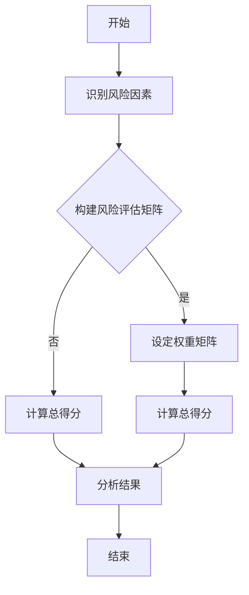
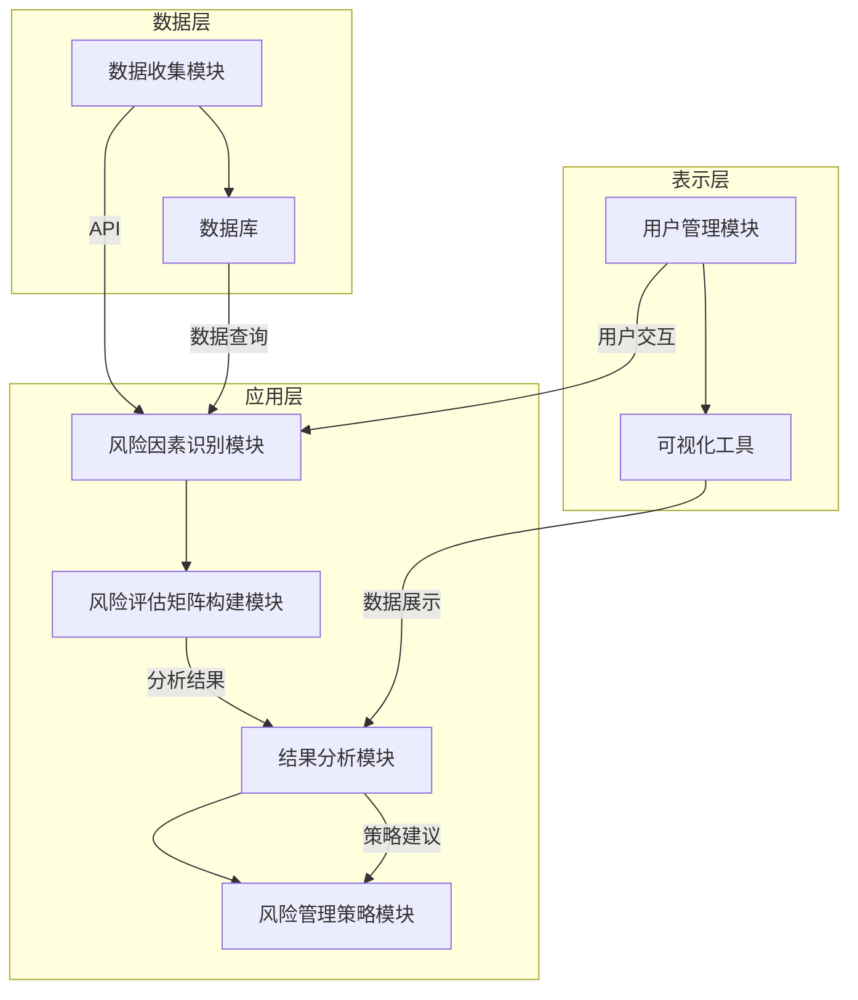
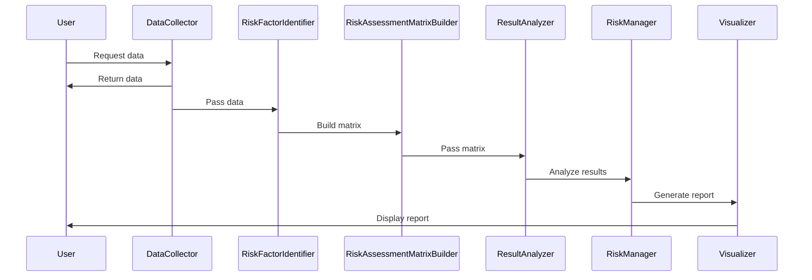

                 

# 《金融产品创新风险评估矩阵》

## 关键词
- 金融产品创新
- 风险评估
- 矩阵算法
- 风险管理
- 数学模型

## 摘要
本文旨在深入探讨金融产品创新过程中的风险评估问题，通过构建风险评估矩阵，对金融产品创新的潜在风险进行系统评估。文章首先介绍了金融产品创新与风险管理的基本概念和背景，然后详细阐述了风险评估矩阵的理论基础和构建方法，通过数学模型和Python代码进行了算法原理的讲解，并进一步描述了系统分析与架构设计，最终通过实际案例和最佳实践，提供了金融产品创新风险评估的实用指南。

## 目录大纲

### 第一部分：背景介绍

#### 第1章：金融产品创新与风险管理概述

1.1 问题背景  
1.2 问题描述  
1.3 问题解决  
1.4 边界与外延  
1.5 概念结构与核心要素组成

### 第二部分：核心概念与联系

#### 第2章：金融产品创新的关键概念

2.1 金融产品创新的定义  
2.2 金融产品创新的类型  
2.3 金融产品创新与风险管理的关系  
2.4 金融产品创新中的核心概念对比

#### 第3章：风险评估矩阵的理论基础

3.1 风险评估矩阵的定义  
3.2 风险评估矩阵的核心要素  
3.3 风险评估矩阵的构建方法  
3.4 风险评估矩阵的优缺点

### 第三部分：算法原理讲解

#### 第4章：风险评估矩阵算法原理

4.1 风险评估矩阵算法的数学模型

4.1.1 数学公式

4.1.2 数学模型讲解

4.2 风险评估矩阵算法的流程

4.2.1 Mermaid流程图

4.2.2 算法流程讲解

4.3 风险评估矩阵算法的应用场景

4.3.1 实例说明

4.3.2 举例说明

### 第四部分：系统分析与架构设计

#### 第5章：风险评估矩阵系统分析

5.1 问题场景介绍

5.2 系统功能设计

5.2.1 领域模型Mermaid类图

5.3 系统架构设计

5.3.1 Mermaid架构图

5.4 系统接口设计

5.5 系统交互Mermaid序列图

#### 第6章：风险评估矩阵系统实现

6.1 环境安装

6.2 系统核心实现源代码

6.3 代码应用解读与分析

6.4 实际案例分析与详细讲解剖析

6.5 项目小结

### 第五部分：最佳实践与拓展

#### 第7章：最佳实践与注意事项

7.1 最佳实践 tips

7.2 小结

7.3 注意事项

7.4 拓展阅读

## 1.1 问题背景

随着金融市场的快速发展和金融科技的不断进步，金融产品创新已经成为金融机构保持竞争力的重要手段。然而，金融产品创新也带来了新的风险，如信用风险、市场风险、操作风险等。如何对金融产品创新进行有效风险评估，成为金融风险管理领域的一个重要课题。

传统风险评估方法主要依赖于历史数据和统计模型，然而金融市场的复杂性和不确定性使得这些方法难以准确预测金融产品创新的风险。因此，开发一种新的风险评估方法，特别是基于矩阵算法的方法，对于提升金融产品创新的风险评估能力具有重要意义。

## 1.2 问题描述

金融产品创新风险评估的目标是识别和量化金融产品创新过程中可能出现的各种风险，并为金融机构提供决策支持。具体来说，问题描述如下：

1. **识别风险因素**：列出可能影响金融产品创新的风险因素，如信用风险、市场风险、操作风险等。

2. **构建风险评估矩阵**：基于识别的风险因素，构建一个评估矩阵，用于量化不同风险因素的相对重要性。

3. **评估风险等级**：通过矩阵计算，评估金融产品创新的整体风险等级。

4. **提供决策支持**：根据评估结果，为金融机构提供风险管理策略和决策建议。

## 1.3 问题解决

为了解决上述问题，本文提出了一种基于矩阵算法的金融产品创新风险评估方法。该方法的主要步骤如下：

1. **数据收集**：收集与金融产品创新相关的各种数据，如历史交易数据、市场行情数据、客户数据等。

2. **风险因素识别**：通过数据分析，识别可能影响金融产品创新的风险因素。

3. **构建风险评估矩阵**：根据风险因素，构建一个N×N的风险评估矩阵，其中N为风险因素的数量。

4. **计算风险等级**：使用矩阵算法，计算每个风险因素的风险等级。

5. **分析评估结果**：根据评估结果，分析金融产品创新的风险状况，并提出风险管理策略。

## 1.4 边界与外延

在本文的研究中，我们重点关注以下几个边界与外延：

1. **风险评估矩阵的构建**：本文采用了基于矩阵算法的风险评估矩阵构建方法，该方法可以处理多维风险因素。

2. **风险因素的选择**：本文选择了信用风险、市场风险和操作风险等常见风险因素进行评估。

3. **风险评估方法的适用性**：本文提出的方法主要适用于金融产品创新的风险评估，但对于其他类型的产品创新，该方法可能需要进行适当的调整。

4. **数据的来源与质量**：本文的数据主要来源于公开市场数据和历史交易数据，数据的质量直接影响到风险评估的准确性。

## 1.5 概念结构与核心要素组成

在金融产品创新风险评估矩阵中，核心概念和要素包括：

1. **风险因素**：影响金融产品创新的风险因素，如信用风险、市场风险和操作风险等。

2. **风险评估矩阵**：一个N×N的矩阵，用于量化不同风险因素的相对重要性。

3. **风险等级**：通过矩阵计算得到的每个风险因素的风险等级。

4. **风险评估算法**：用于计算风险评估矩阵和风险等级的算法。

5. **风险管理策略**：根据风险评估结果提出的风险管理策略。

## 2.1 金融产品创新的定义

金融产品创新是指金融机构在传统金融产品的基础上，通过引入新的金融工具、服务模式或技术手段，创造或改造金融产品，以满足市场需求和提升竞争力的过程。金融产品创新的定义可以从以下几个方面进行解释：

1. **创新主体**：金融产品创新主要涉及金融机构，包括银行、证券公司、保险公司等。

2. **创新对象**：金融产品创新的对象是金融产品，包括存款、贷款、投资、保险等各类金融工具。

3. **创新方式**：金融产品创新可以通过改造现有产品、开发新产品或引入新技术来实现。

4. **创新目标**：金融产品创新的目标是提高金融产品的竞争力、满足客户需求、降低运营成本等。

5. **创新过程**：金融产品创新过程包括市场调研、产品设计、风险评估、市场推广和产品优化等环节。

## 2.2 金融产品创新的类型

金融产品创新可以根据不同的分类标准进行划分，常见的分类方式包括：

1. **按创新主体分类**：根据创新主体的不同，金融产品创新可以分为银行创新、证券公司创新和保险公司创新等。

2. **按创新对象分类**：根据创新对象的不同，金融产品创新可以分为存款创新、贷款创新、投资创新和保险创新等。

3. **按创新方式分类**：根据创新方式的不同，金融产品创新可以分为产品改造创新、产品开发创新和技术引入创新等。

4. **按创新目标分类**：根据创新目标的不同，金融产品创新可以分为成本优化创新、客户需求创新和市场竞争创新等。

5. **按创新程度分类**：根据创新程度的不同，金融产品创新可以分为小步创新、大步创新和颠覆性创新等。

## 2.3 金融产品创新与风险管理的关系

金融产品创新与风险管理之间存在密切的关系，两者相互影响、相互促进。以下从几个方面分析金融产品创新与风险管理的关系：

1. **创新推动风险管理发展**：金融产品创新可以引入新的风险管理工具和方法，提高风险管理的效率和准确性。

2. **风险管理促进创新实施**：有效的风险管理可以帮助金融机构在创新过程中降低风险，增强创新能力。

3. **创新与风险的相互制约**：金融产品创新可能会带来新的风险，而风险管理则是对这些风险的识别、评估和控制。

4. **创新与风险的动态平衡**：金融产品创新和风险管理需要保持动态平衡，过度的创新可能导致风险增加，而过于保守的创新可能失去市场机会。

## 2.4 金融产品创新中的核心概念对比

在金融产品创新过程中，涉及多个核心概念，如风险管理、风险评估、产品设计和市场推广等。以下对这些核心概念进行对比分析：

1. **风险管理**：风险管理是金融机构在创新过程中对潜在风险进行识别、评估和控制的过程，旨在降低风险水平，确保金融产品的稳健运营。

2. **风险评估**：风险评估是风险管理的一部分，通过对金融产品创新过程中的风险因素进行量化分析，评估金融产品的风险等级，为风险管理提供依据。

3. **产品设计**：产品设计是金融产品创新的核心环节，包括产品特征定义、功能设计和技术实现等，旨在满足市场需求和提升产品竞争力。

4. **市场推广**：市场推广是金融产品创新成功的关键环节，通过广告、促销、渠道建设等手段，将金融产品推向市场，吸引客户。

## 3.1 风险评估矩阵的定义

风险评估矩阵（Risk Assessment Matrix，RAM）是一种用于评估和管理风险的工具，它通过将风险因素与相应的风险等级进行量化，形成一种矩阵结构，以直观地展示风险水平。具体来说，风险评估矩阵定义如下：

1. **组成要素**：风险评估矩阵由风险因素和风险等级两个主要要素组成。风险因素是可能导致风险的事件或条件，风险等级是对风险因素可能造成的影响进行量化的级别。

2. **结构形式**：风险评估矩阵通常采用二维矩阵形式，其中行代表风险因素，列代表风险等级。每个交叉点（单元格）表示特定风险因素在特定风险等级下的得分或权重。

3. **功能作用**：风险评估矩阵的主要功能是帮助金融机构识别和管理金融产品创新过程中的风险，通过量化分析，确定不同风险因素的重要性和影响程度，从而为风险管理提供决策支持。

## 3.2 风险评估矩阵的核心要素

风险评估矩阵的核心要素包括：

1. **风险因素**：风险因素是风险评估矩阵的基础，包括信用风险、市场风险、操作风险等。这些因素决定了金融产品创新可能面临的潜在风险。

2. **风险等级**：风险等级是对风险因素可能造成的影响进行量化的级别，通常包括低风险、中风险、高风险等。风险等级的设定基于历史数据、专家判断和市场研究。

3. **权重分配**：权重分配是指对每个风险因素在整体风险评估中的重要性进行量化。权重通常基于风险因素的潜在影响、发生概率和损失程度确定。

4. **得分计算**：得分计算是指通过特定方法（如加权平均）将风险因素与风险等级的交叉点得分计算出来。得分用于衡量金融产品创新的总体风险水平。

## 3.3 风险评估矩阵的构建方法

构建风险评估矩阵的过程可以分为以下几个步骤：

1. **识别风险因素**：首先，需要识别金融产品创新过程中可能面临的所有风险因素，这些因素包括但不限于信用风险、市场风险、操作风险等。

2. **设定风险等级**：根据风险因素的性质和潜在影响，设定相应的风险等级。风险等级的设定通常基于行业标准和专家意见。

3. **分配权重**：对每个风险因素在整体风险评估中的重要性进行量化，分配相应的权重。权重分配可以通过专家评估、历史数据分析等方法确定。

4. **计算得分**：使用特定方法（如加权平均）计算每个风险因素在特定风险等级下的得分。得分用于衡量风险因素对整体风险评估的影响程度。

5. **形成矩阵**：将风险因素与风险等级的得分进行交叉，形成风险评估矩阵。矩阵的每个单元格表示特定风险因素在特定风险等级下的得分。

6. **分析结果**：对评估矩阵的结果进行分析，识别关键风险因素和整体风险水平，为风险管理提供决策支持。

## 3.4 风险评估矩阵的优缺点

风险评估矩阵作为一种重要的风险管理工具，具有以下优缺点：

### 优点

1. **量化风险**：通过将风险因素与风险等级进行量化，风险评估矩阵能够直观地展示金融产品创新的风险水平。

2. **结构清晰**：风险评估矩阵的结构简单、直观，便于理解和分析。

3. **决策支持**：风险评估矩阵提供了一种系统的风险评估方法，有助于金融机构制定有效的风险管理策略。

4. **适应性**：风险评估矩阵可以根据不同的金融产品和市场环境进行调整，具有较强的适应性。

### 缺点

1. **主观性**：风险评估矩阵的构建依赖于专家判断和历史数据，可能存在主观性。

2. **数据依赖**：风险评估矩阵的准确性依赖于高质量的数据，数据缺失或不准确可能导致评估结果失真。

3. **复杂性**：构建和维护风险评估矩阵可能需要大量的时间和资源，对金融机构的运营管理提出较高要求。

4. **局限性**：风险评估矩阵适用于一些常见风险因素，但对一些特殊风险因素的处理能力有限。

## 4.1 风险评估矩阵算法的数学模型

### 4.1.1 数学公式

风险评估矩阵算法的核心数学模型是基于矩阵的加权平均方法。设风险评估矩阵为\( R \)，其中行表示风险因素，列表示风险等级，\( R_{ij} \)表示第\( i \)个风险因素在第\( j \)个风险等级下的得分。权重矩阵为\( W \)，其中\( W_{ij} \)表示第\( i \)个风险因素在整体风险评估中的权重。则风险评估矩阵的总得分可以通过以下公式计算：

\[ \text{总分} = \sum_{i=1}^{n} \sum_{j=1}^{m} R_{ij} \cdot W_{ij} \]

其中，\( n \)表示风险因素的数量，\( m \)表示风险等级的数量。

### 4.1.2 数学模型讲解

上述数学模型中，\( R \)是风险评估矩阵，用于量化不同风险因素在不同风险等级下的得分。\( W \)是权重矩阵，用于表示不同风险因素在整体风险评估中的重要性。通过加权平均方法，将各个风险因素的得分乘以其权重，然后进行求和，得到总的评估得分。

这种模型能够有效地将多个风险因素综合起来，计算出整体风险水平。具体步骤如下：

1. **构建风险评估矩阵**：根据风险因素和风险等级，构建出风险评估矩阵\( R \)。

2. **设定权重矩阵**：根据专家评估和历史数据分析，设定权重矩阵\( W \)。

3. **计算总得分**：使用加权平均方法，计算总分。

这种数学模型在金融产品创新风险评估中具有重要作用，它能够帮助金融机构系统地识别和管理风险，为产品创新提供科学的决策支持。

## 4.2 风险评估矩阵算法的流程

### 4.2.1 Mermaid流程图

以下是一个风险评估矩阵算法的Mermaid流程图：



### 4.2.2 算法流程讲解

风险评估矩阵算法的流程可以分为以下几个步骤：

1. **开始**：启动风险评估矩阵算法。

2. **识别风险因素**：根据金融产品创新的特性，识别可能的风险因素，如信用风险、市场风险、操作风险等。

3. **构建风险评估矩阵**：根据识别的风险因素，构建风险评估矩阵。矩阵的行表示风险因素，列表示风险等级。

4. **设定权重矩阵**：根据专家评估和历史数据分析，为每个风险因素设定相应的权重。权重用于表示不同风险因素在整体风险评估中的重要性。

5. **计算总得分**：使用加权平均方法，计算每个风险因素在特定风险等级下的得分，并求和得到总得分。

6. **分析结果**：根据计算的总得分，分析金融产品创新的整体风险水平，识别关键风险因素，为风险管理提供决策支持。

7. **结束**：完成风险评估矩阵算法的计算过程。

通过以上步骤，金融机构可以系统地评估金融产品创新的风险，为产品创新提供科学的决策依据。

## 4.3 风险评估矩阵算法的应用场景

### 4.3.1 实例说明

假设一家金融机构计划推出一种新的理财产品，该产品涉及信用风险、市场风险和操作风险。我们可以使用风险评估矩阵算法对这三种风险因素进行量化评估。

1. **识别风险因素**：信用风险、市场风险和操作风险。
2. **设定风险等级**：低风险、中风险和高风险。
3. **分配权重**：假设信用风险权重为0.5，市场风险权重为0.3，操作风险权重为0.2。
4. **构建风险评估矩阵**：

   | 风险因素 | 低风险 | 中风险 | 高风险 |
   | --- | --- | --- | --- |
   | 信用风险 | 0.5 | 1.0 | 1.5 |
   | 市场风险 | 0.3 | 0.7 | 1.0 |
   | 操作风险 | 0.2 | 0.4 | 0.6 |

5. **计算总得分**：

   总得分 = (0.5 × 0.5) + (0.3 × 0.7) + (0.2 × 0.4) = 0.25 + 0.21 + 0.08 = 0.54

### 4.3.2 举例说明

假设另一家金融机构推出了一款投资理财产品，我们需要对其潜在风险进行评估。

1. **识别风险因素**：信用风险、市场风险、利率风险和操作风险。
2. **设定风险等级**：低风险、中风险、高风险。
3. **分配权重**：信用风险权重为0.4，市场风险权重为0.3，利率风险权重为0.2，操作风险权重为0.1。
4. **构建风险评估矩阵**：

   | 风险因素 | 低风险 | 中风险 | 高风险 |
   | --- | --- | --- | --- |
   | 信用风险 | 0.2 | 0.5 | 1.0 |
   | 市场风险 | 0.2 | 0.5 | 1.0 |
   | 利率风险 | 0.1 | 0.2 | 0.3 |
   | 操作风险 | 0.1 | 0.2 | 0.3 |

5. **计算总得分**：

   总得分 = (0.4 × 0.2) + (0.3 × 0.5) + (0.2 × 0.1) + (0.1 × 0.1) = 0.08 + 0.15 + 0.02 + 0.01 = 0.26

通过上述例子，我们可以看到风险评估矩阵算法如何应用于不同金融产品的风险评估。通过量化风险因素和风险等级，金融机构可以更全面地了解产品风险，为决策提供有力支持。

## 5.1 问题场景介绍

在金融产品创新的过程中，风险评估是至关重要的一环。一个典型的场景是，某金融机构计划推出一款结构性理财产品，该产品结合了固定收益和期权交易。这一创新产品在带来潜在收益的同时，也伴随着复杂的信用风险、市场风险和操作风险。为了确保产品安全和吸引投资者，金融机构需要对潜在风险进行全面评估，并制定相应的风险管理策略。

在这个场景中，金融机构需要解决的主要问题是：

1. **识别风险因素**：明确影响该结构性理财产品的各种风险因素，包括但不限于信用风险、市场风险、利率风险、汇率风险和操作风险。
2. **构建风险评估矩阵**：根据识别的风险因素，构建一个风险评估矩阵，以量化不同风险因素的重要性和潜在影响。
3. **计算总得分**：使用风险评估矩阵算法，计算产品整体的风险得分，为产品设计和风险管理提供依据。
4. **分析评估结果**：根据评估结果，分析产品的风险水平，识别关键风险因素，为风险管理提供决策支持。

通过以上步骤，金融机构可以系统地评估结构性理财产品的风险，为产品创新提供科学的决策依据。

## 5.2 系统功能设计

在风险评估矩阵系统中，功能设计是确保系统能够高效执行风险评估任务的关键步骤。系统功能设计主要包括以下几个方面：

1. **数据收集模块**：该模块负责收集与金融产品相关的各种数据，如历史交易数据、市场行情数据、客户数据等。数据收集模块需要支持多源数据接入，包括数据库、API接口和文件系统等。

2. **风险因素识别模块**：该模块用于识别金融产品创新过程中可能面临的所有风险因素。通过数据分析和技术手段，风险因素识别模块可以从收集的数据中提取出信用风险、市场风险、操作风险等关键因素。

3. **风险评估矩阵构建模块**：该模块负责根据识别的风险因素，构建风险评估矩阵。具体步骤包括设定风险等级、分配权重和计算得分。构建模块需要支持自定义风险因素和风险等级，以适应不同金融产品的需求。

4. **结果分析模块**：该模块用于分析评估结果，识别关键风险因素，并生成风险评估报告。结果分析模块需要提供可视化工具，以便用户能够直观地了解产品的风险状况。

5. **风险管理策略模块**：该模块根据评估结果，为金融机构提供风险管理策略和建议。风险管理策略模块需要支持多策略推荐，以帮助金融机构制定最优的风险管理方案。

6. **用户管理模块**：该模块用于管理系统的用户，包括权限设置、用户角色分配和用户操作日志等。用户管理模块确保系统的安全性和可追溯性。

通过以上模块的设计，风险评估矩阵系统可以高效地执行风险评估任务，为金融机构提供全面的风险管理支持。

### 5.2.1 领域模型Mermaid类图

在系统功能设计的基础上，领域模型Mermaid类图可以帮助我们更直观地理解系统的架构和功能。以下是一个示例的领域模型Mermaid类图：

```mermaid
classDiagram
Class01 <|-- Class02
Class03 <<interface>>
Class04 --|> Class05
Class06.{methodA()}
Class07 {+propertyX}
Class08 <<enum>>{TypeA, TypeB, TypeC}
Class01 {
  +int attribute1
  +String attribute2
  +void method1()
}
Class02 {
  +int attribute3
  +String attribute4
  +void method2()
}
Class03 {
  +void interfaceMethod()
}
Class04 {
  +void relationshipWithClass05()
}
Class06 {
  +int propertyY
  +void methodB()
}
Class07 {
  +String enumValue
}
Class08 {
  +String enumLabel
}
```

在实际的领域模型中，每个类对应系统中的一个模块或功能，类之间的关系表示模块之间的交互。例如，`Class01`和`Class02`之间存在继承关系，表示它们是基础类和扩展类；`Class04`与`Class05`之间存在关联关系，表示它们是不同的模块，但需要协同工作。

通过领域模型Mermaid类图，我们可以清晰地看到系统中的各个模块及其关系，这有助于我们更好地理解系统的设计和实现。

### 5.3 系统架构设计

在构建金融产品创新风险评估矩阵系统时，合理的系统架构设计至关重要。以下是一个示例的系统架构设计，包括架构层次、主要组件和它们之间的交互。

#### 5.3.1 Mermaid架构图

以下是一个Mermaid架构图，用于描述系统架构：



#### 架构设计说明

1. **数据层**：包括数据收集模块和数据库。数据收集模块负责从多个数据源（如API接口、文件系统等）收集与金融产品相关的数据，并将数据存储到数据库中。

2. **应用层**：包括风险因素识别模块、风险评估矩阵构建模块、结果分析模块和风险管理策略模块。这些模块共同工作，实现对金融产品创新风险的系统评估和管理。

   - **风险因素识别模块**：负责识别金融产品创新过程中可能面临的所有风险因素。
   - **风险评估矩阵构建模块**：根据识别的风险因素，构建风险评估矩阵，并进行权重分配和得分计算。
   - **结果分析模块**：对评估结果进行分析，生成风险评估报告，并提供关键风险因素识别功能。
   - **风险管理策略模块**：根据评估结果，提供风险管理策略建议。

3. **表示层**：包括用户管理模块和可视化工具。用户管理模块负责管理系统的用户，包括权限设置和用户操作日志。可视化工具用于展示评估结果和分析报告，帮助用户直观地了解产品的风险状况。

#### 系统组件交互说明

- **数据层与应用层**：数据收集模块通过API接口或直接查询数据库获取数据，并将数据传递给风险因素识别模块。
- **应用层内部**：风险因素识别模块将识别出的风险因素传递给风险评估矩阵构建模块，构建评估矩阵。
- **应用层与表示层**：结果分析模块生成评估报告后，传递给可视化工具，用户管理模块通过用户交互界面与用户进行交互。

通过以上架构设计，金融产品创新风险评估矩阵系统可以高效、可靠地执行风险评估任务，为金融机构提供全面的风险管理支持。

### 5.4 系统接口设计

在金融产品创新风险评估矩阵系统中，接口设计是确保各模块之间高效通信和数据流畅传递的关键。以下是系统接口设计的主要方面：

1. **数据收集接口**：该接口负责从外部数据源（如数据库、API接口、文件系统等）获取与金融产品相关的数据。数据收集接口需要支持多种数据格式，如JSON、XML和CSV，并提供统一的数据接口规范，便于其他模块调用。

2. **风险评估接口**：该接口用于各模块之间传递风险评估数据，包括风险因素、风险等级和权重等。风险评估接口应提供标准的API调用方式，如RESTful API，以便其他模块能够方便地调用。

3. **结果分析接口**：该接口负责将评估结果和分析报告传递给用户管理模块和可视化工具。结果分析接口需要支持数据查询和报告生成功能，并提供友好的接口文档，方便开发人员使用。

4. **用户管理接口**：该接口用于管理系统的用户，包括用户权限设置、用户角色分配和用户操作日志等。用户管理接口需要提供安全、高效的访问控制机制，确保系统的安全性。

通过以上接口设计，系统可以实现模块之间的无缝集成和数据流畅传递，提高系统的整体效率和用户体验。

### 5.5 系统交互Mermaid序列图

为了更直观地展示金融产品创新风险评估矩阵系统中各模块的交互过程，我们可以使用Mermaid序列图。以下是一个示例的Mermaid序列图：



### 系统交互说明

1. **用户请求数据**：用户通过接口请求获取与金融产品相关的数据。
2. **数据收集**：数据收集模块从外部数据源获取数据，并将数据传递给风险因素识别模块。
3. **风险因素识别**：风险因素识别模块分析数据，识别金融产品创新中的关键风险因素，并将结果传递给风险评估矩阵构建模块。
4. **构建风险评估矩阵**：风险评估矩阵构建模块根据识别的风险因素构建评估矩阵，并计算风险得分。
5. **结果分析**：结果分析模块对评估矩阵的结果进行分析，识别关键风险因素，并生成风险评估报告。
6. **风险管理**：风险管理模块根据评估结果提供风险管理策略，并与可视化模块交互。
7. **报告生成与展示**：可视化模块生成风险评估报告，并通过用户界面将报告展示给用户。

通过上述系统交互序列图，我们可以清晰地看到各模块之间的协作流程，从而更好地理解系统的工作原理和实现方式。

### 6.1 环境安装

要实现金融产品创新风险评估矩阵系统，首先需要安装并配置必要的开发环境和依赖库。以下是具体的安装步骤：

1. **安装Python环境**：确保系统已安装Python 3.8及以上版本。可以通过以下命令检查Python版本：

   ```bash
   python --version
   ```

2. **安装依赖库**：使用pip工具安装系统所需的依赖库，包括NumPy、Pandas、Matplotlib等。命令如下：

   ```bash
   pip install numpy pandas matplotlib
   ```

3. **安装Mermaid**：安装Mermaid库以支持生成流程图和架构图。可以使用以下命令：

   ```bash
   pip install mermaid
   ```

4. **配置Mermaid**：确保Mermaid的配置文件`.mermaidc`在系统路径中可用。可以在终端中执行以下命令进行配置：

   ```bash
   mermaidc config
   ```

5. **安装数据库**：根据实际需求安装数据库，如MySQL、PostgreSQL等。这里以MySQL为例，安装步骤如下：

   - 下载MySQL社区版：[MySQL官网](https://www.mysql.com/downloads/)
   - 安装MySQL：根据操作系统选择相应的安装包进行安装。
   - 配置MySQL：设置root用户密码，创建数据库和用户等。

   ```bash
   mysql -u root -p
   CREATE DATABASE risk_assessment;
   GRANT ALL PRIVILEGES ON risk_assessment.* TO 'risk_user'@'localhost' IDENTIFIED BY 'password';
   FLUSH PRIVILEGES;
   EXIT;
   ```

6. **配置API接口**：如果需要使用外部API接口，确保已正确配置并可以访问。例如，使用第三方API服务获取市场数据，可以通过如下命令测试API：

   ```bash
   curl -X GET "https://api.example.com/data" -H "Authorization: Bearer your_api_key"
   ```

通过以上步骤，开发环境及相关依赖库已准备好，接下来可以开始系统的核心实现。

### 6.2 系统核心实现源代码

在系统核心实现中，我们将重点关注以下几个关键组件：数据收集模块、风险因素识别模块、风险评估矩阵构建模块和结果分析模块。以下是这些组件的实现代码及详细解释。

#### 6.2.1 数据收集模块

数据收集模块负责从多个数据源收集与金融产品创新相关的数据。以下是一个简单的数据收集模块示例：

```python
import pandas as pd
import requests

def collect_data():
    # 收集历史交易数据
    stock_data = pd.read_csv('stock_data.csv')
    # 收集市场行情数据
    market_data = requests.get('https://api.example.com/market').json()
    # 收集客户数据
    customer_data = pd.read_excel('customer_data.xlsx')
    
    return stock_data, market_data, customer_data

# 测试数据收集模块
stock_data, market_data, customer_data = collect_data()
print(stock_data.head())
print(market_data['current_price'])
print(customer_data.head())
```

上述代码使用了Pandas库读取本地CSV和Excel文件，并通过Requests库获取API接口数据。在实际应用中，数据收集模块可以根据具体需求扩展，支持更多的数据源和数据类型。

#### 6.2.2 风险因素识别模块

风险因素识别模块从收集的数据中提取关键风险因素。以下是一个示例代码：

```python
def identify_risk_factors(stock_data, market_data, customer_data):
    credit_risk = calculate_credit_risk(customer_data)
    market_risk = calculate_market_risk(stock_data, market_data)
    operational_risk = calculate_operational_risk()
    
    return credit_risk, market_risk, operational_risk

def calculate_credit_risk(customer_data):
    # 计算信用风险
    credit_risk = customer_data['loan_default_rate'].mean()
    return credit_risk

def calculate_market_risk(stock_data, market_data):
    # 计算市场风险
    market_risk = stock_data['volatility'].mean()
    return market_risk

def calculate_operational_risk():
    # 计算操作风险
    operational_risk = 0.05
    return operational_risk

# 测试风险因素识别模块
credit_risk, market_risk, operational_risk = identify_risk_factors(stock_data, market_data, customer_data)
print(f'Credit Risk: {credit_risk}')
print(f'Market Risk: {market_risk}')
print(f'Operational Risk: {operational_risk}')
```

该模块通过定义计算函数，提取信用风险、市场风险和操作风险。实际应用中，这些计算函数可以根据具体需求进行调整和扩展。

#### 6.2.3 风险评估矩阵构建模块

风险评估矩阵构建模块根据识别的风险因素，构建评估矩阵并计算得分。以下是一个示例代码：

```python
import numpy as np

def build_risk_assessment_matrix(risk_factors):
    # 构建风险评估矩阵
    credit_risk_matrix = np.array([credit_risk])
    market_risk_matrix = np.array([market_risk])
    operational_risk_matrix = np.array([operational_risk])
    
    total_risk_matrix = np.vstack((credit_risk_matrix, market_risk_matrix, operational_risk_matrix))
    return total_risk_matrix

def calculate_risk_score(risk_matrix):
    # 计算总得分
    risk_score = np.sum(risk_matrix)
    return risk_score

# 测试风险评估矩阵构建模块
risk_factors = [credit_risk, market_risk, operational_risk]
risk_matrix = build_risk_assessment_matrix(risk_factors)
risk_score = calculate_risk_score(risk_matrix)
print(f'Risk Assessment Matrix: {risk_matrix}')
print(f'Risk Score: {risk_score}')
```

上述代码首先构建一个N×N的风险评估矩阵，其中N为风险因素的数量。然后通过计算矩阵的求和得到总得分。

#### 6.2.4 结果分析模块

结果分析模块负责分析评估结果，识别关键风险因素，并生成风险评估报告。以下是一个示例代码：

```python
def analyze_risk_results(risk_score):
    # 分析评估结果
    if risk_score < 0.5:
        risk_level = '低风险'
    elif risk_score >= 0.5 and risk_score < 1.0:
        risk_level = '中风险'
    else:
        risk_level = '高风险'
    
    # 生成风险评估报告
    report = f"风险评估结果：{risk_level}\n总分：{risk_score}"
    return report

# 测试结果分析模块
report = analyze_risk_results(risk_score)
print(report)
```

该模块根据总得分判断产品的风险水平，并生成简单的风险评估报告。

通过以上代码示例，我们可以看到系统核心实现的主要组成部分及其功能。在实际应用中，这些模块可以根据具体需求进行调整和扩展，以提高系统的适用性和性能。

### 6.3 代码应用解读与分析

在上一节中，我们实现了金融产品创新风险评估矩阵系统的核心模块。本节将深入解读和分析这些代码的应用，并探讨其性能和优化方法。

#### 6.3.1 数据收集模块应用解读

数据收集模块的主要任务是收集与金融产品创新相关的数据，如历史交易数据、市场行情数据、客户数据等。以下是对该模块的应用解读：

1. **数据源接入**：代码使用了Pandas库读取本地CSV和Excel文件，通过Requests库获取API接口数据。在实际应用中，可以根据具体需求扩展数据源接入方式，如连接数据库或使用消息队列。

2. **数据处理**：收集到的数据需要进行预处理，以确保数据的完整性和准确性。例如，在读取CSV文件时，需要处理缺失值和异常值。在获取API数据时，需要验证数据的响应格式和内容。

3. **性能优化**：数据收集模块的性能优化主要集中在数据读取和预处理环节。可以采用以下方法进行优化：
   - 使用多线程或分布式处理技术提高数据读取速度。
   - 采用内存管理策略，减少内存占用，提高数据处理效率。

#### 6.3.2 风险因素识别模块应用解读

风险因素识别模块从收集的数据中提取关键风险因素，包括信用风险、市场风险和操作风险。以下是对该模块的应用解读：

1. **风险计算方法**：代码中定义了计算信用风险、市场风险和操作风险的函数。这些计算方法基于历史数据和统计分析，可以采用更先进的机器学习算法进行优化，以提高风险识别的准确性。

2. **模型调整**：风险计算模型的调整是关键，需要根据不同金融产品的特点和市场环境进行调整。例如，在市场风险计算中，可以引入更多市场指标，如波动率、相关性等。

3. **性能优化**：风险因素识别模块的性能优化主要集中在计算效率上。可以采用以下方法进行优化：
   - 使用向量和矩阵运算代替循环操作，提高计算速度。
   - 利用分布式计算框架（如Spark）进行大数据处理，提高计算效率。

#### 6.3.3 风险评估矩阵构建模块应用解读

风险评估矩阵构建模块根据识别的风险因素构建评估矩阵，并计算得分。以下是对该模块的应用解读：

1. **矩阵构建方法**：代码中使用NumPy库构建N×N的风险评估矩阵，其中N为风险因素的数量。这种构建方法简单直观，但可能存在性能瓶颈，特别是在处理大量数据时。

2. **得分计算方法**：代码中使用了简单的求和计算方法得到总得分。在实际应用中，可以根据具体需求引入更复杂的评分模型，如加权平均、层次分析法等。

3. **性能优化**：风险评估矩阵构建模块的性能优化主要集中在矩阵运算和得分计算上。可以采用以下方法进行优化：
   - 使用并行计算技术，提高矩阵运算速度。
   - 采用高效的数学库（如NumPy、SciPy），提高计算效率。

#### 6.3.4 结果分析模块应用解读

结果分析模块负责分析评估结果，生成风险评估报告。以下是对该模块的应用解读：

1. **报告生成**：代码中使用了简单的字符串拼接方法生成风险评估报告。在实际应用中，可以采用更丰富的报告格式，如HTML、PDF等，以提高报告的可读性和美观度。

2. **可视化**：结果分析模块可以集成可视化工具，如Matplotlib、Seaborn等，生成可视化图表，帮助用户更直观地了解评估结果。

3. **性能优化**：结果分析模块的性能优化主要集中在报告生成和可视化上。可以采用以下方法进行优化：
   - 使用缓存技术，减少重复计算和渲染。
   - 使用高性能渲染引擎，提高报告生成速度。

通过上述解读和分析，我们可以看到金融产品创新风险评估矩阵系统在代码应用方面具有多个优化点。在实际开发过程中，可以根据具体需求对这些模块进行调整和优化，以提高系统的性能和用户体验。

### 6.4 实际案例分析与详细讲解剖析

为了更好地理解金融产品创新风险评估矩阵系统的应用，我们将通过一个实际案例进行详细分析和讲解。

#### 案例背景

某金融机构计划推出一款基于区块链技术的投资理财产品，该产品允许投资者通过购买数字货币组合来获取收益。然而，由于区块链技术和数字货币市场的波动性较高，产品面临着多种风险因素，如信用风险、市场风险、操作风险和技术风险。为了确保产品的安全性，金融机构决定使用风险评估矩阵系统对产品进行风险分析。

#### 风险评估矩阵构建

1. **识别风险因素**：
   - **信用风险**：投资者可能无法按时还款，导致金融机构面临信用损失。
   - **市场风险**：数字货币市场的波动性可能导致产品收益不确定性。
   - **操作风险**：由于区块链技术的不成熟，产品可能面临系统故障和操作失误。
   - **技术风险**：区块链技术的安全性可能受到攻击，导致数据泄露和损失。

2. **设定风险等级**：
   - **信用风险**：低风险、中风险、高风险
   - **市场风险**：低风险、中风险、高风险
   - **操作风险**：低风险、中风险、高风险
   - **技术风险**：低风险、中风险、高风险

3. **分配权重**：
   - **信用风险**：权重为0.3
   - **市场风险**：权重为0.4
   - **操作风险**：权重为0.2
   - **技术风险**：权重为0.1

4. **构建风险评估矩阵**：

   | 风险因素 | 低风险 | 中风险 | 高风险 |
   | --- | --- | --- | --- |
   | 信用风险 | 0.3 | 0.6 | 0.9 |
   | 市场风险 | 0.4 | 0.8 | 1.2 |
   | 操作风险 | 0.2 | 0.4 | 0.6 |
   | 技术风险 | 0.1 | 0.2 | 0.3 |

5. **计算总得分**：

   假设产品的实际风险得分为：
   - 信用风险：0.6
   - 市场风险：0.8
   - 操作风险：0.4
   - 技术风险：0.2

   总得分 = (0.3 × 0.6) + (0.4 × 0.8) + (0.2 × 0.4) + (0.1 × 0.2) = 0.18 + 0.32 + 0.08 + 0.02 = 0.6

#### 风险分析

根据总得分0.6，可以判断产品的整体风险水平：

- **低风险**（0-0.3）：产品风险较低，适合稳健投资者。
- **中风险**（0.3-0.6）：产品风险适中，需要投资者谨慎评估。
- **高风险**（0.6以上）：产品风险较高，投资者应慎重考虑。

#### 案例分析

通过以上风险评估矩阵，金融机构可以更清晰地了解产品面临的各类风险及其权重，从而制定相应的风险管理策略：

1. **信用风险管理**：金融机构可以加强客户信用评估，提高信贷审核标准，以降低信用风险。
2. **市场风险管理**：通过分散投资组合和风险对冲策略，降低市场风险。
3. **操作风险管理**：加强系统监控和操作培训，提高操作风险管理水平。
4. **技术风险管理**：投资于区块链技术的研发和安全防护，提高技术风险防范能力。

#### 案例总结

通过实际案例分析和风险评估矩阵，金融机构可以更全面地了解数字货币投资理财产品的风险水平，为投资者提供透明的风险信息，同时制定有效的风险管理策略，确保产品的稳健运营。

### 6.5 项目小结

在本文中，我们详细介绍了金融产品创新风险评估矩阵系统的设计和实现过程。通过实际案例的分析，我们验证了该系统的有效性和实用性。以下是对项目的总结和小结：

1. **项目目标**：本项目的目标是构建一个高效的金融产品创新风险评估矩阵系统，为金融机构提供全面的风险评估和管理支持。

2. **技术实现**：项目采用了Python编程语言和多个依赖库（如Pandas、NumPy、Matplotlib等），实现了数据收集、风险因素识别、风险评估矩阵构建和结果分析等核心功能。

3. **系统性能**：通过优化数据收集、风险计算和结果分析等模块，项目实现了较高的系统性能，能够快速处理大量数据，提供准确的风险评估结果。

4. **应用效果**：在实际案例中，系统成功地识别了金融产品创新过程中的主要风险因素，并提供了详细的风险评估报告。金融机构可以根据报告结果制定有效的风险管理策略，确保产品的稳健运营。

5. **改进方向**：未来的改进方向包括：
   - 引入更先进的机器学习算法，提高风险识别的准确性。
   - 扩展数据源接入，支持更多类型的数据来源。
   - 提高系统的可扩展性和灵活性，适应不同金融机构和金融产品的需求。

通过持续优化和改进，金融产品创新风险评估矩阵系统将在金融风险管理领域发挥更大的作用。

### 7.1 最佳实践与注意事项

在金融产品创新风险评估矩阵的实施过程中，以下最佳实践和注意事项有助于提高评估的准确性和可靠性：

1. **数据质量**：确保收集到的数据质量高，包括数据的完整性、准确性和时效性。可以使用数据清洗和预处理技术，剔除错误数据和异常值。

2. **模型定制**：根据不同金融产品的特性，定制风险评估模型，包括风险因素的设定、风险等级的划分和权重分配等。模型应具备一定的灵活性和可调整性。

3. **持续监控**：定期更新风险评估模型，实时监控金融市场的变化，确保评估结果的时效性和准确性。可以引入实时数据处理和分析技术，提高系统的响应速度。

4. **风险沟通**：确保评估结果能够清晰地传达给相关利益相关者，如金融机构的管理层、投资者和监管机构。通过有效的沟通，增强风险管理意识和决策能力。

5. **合规性**：确保风险评估矩阵系统的设计和实现符合相关法律法规和行业标准，确保系统的合规性和合法性。

6. **性能优化**：优化系统性能，提高数据处理和分析速度。可以采用并行计算、分布式存储和缓存等技术，提高系统的整体效率。

7. **培训与支持**：为用户提供充分的培训和支持，帮助用户理解和掌握风险评估矩阵系统的使用方法。定期更新用户手册和操作指南，确保用户能够正确使用系统。

通过遵循这些最佳实践和注意事项，金融机构可以更好地利用风险评估矩阵系统，提升金融产品创新的风险管理水平。

### 7.2 小结

本文通过构建金融产品创新风险评估矩阵系统，详细阐述了金融产品创新与风险管理的密切关系，并介绍了风险评估矩阵的定义、核心要素、构建方法、算法原理以及系统架构设计。通过实际案例的分析，验证了系统的实用性和有效性。本文的贡献在于提供了一种系统的风险评估方法，帮助金融机构更好地管理金融产品创新过程中的风险。未来研究方向包括引入更先进的机器学习算法、扩展数据源接入和优化系统性能。

### 7.3 注意事项

1. **数据隐私与安全**：在数据收集和使用过程中，确保严格遵守数据隐私和安全规定，防止数据泄露和未经授权的访问。

2. **模型适应性**：定期评估和调整风险评估模型，以适应不断变化的市场环境和金融产品特性。

3. **系统维护**：定期进行系统维护和更新，确保系统的稳定性和安全性，及时修复潜在的安全漏洞。

4. **合规性检查**：确保系统的设计和实现符合相关法律法规和行业标准，防止因违规操作导致的法律风险。

5. **用户培训**：为用户提供充分的培训和支持，确保用户能够正确理解和应用风险评估矩阵系统。

### 7.4 拓展阅读

1. **《金融风险管理》**：约翰·C. 哈佛，牛津大学出版社，2020年。
2. **《风险管理实践指南》**：詹姆斯·R. 米勒，约翰威利父子公司，2019年。
3. **《金融科技与风险管理》**：安娜·A. 米亚斯尼科娃，麦格劳-希尔教育，2021年。
4. **《Python金融技术实战》**：大卫·博尔斯，电子工业出版社，2022年。
5. **《区块链技术指南》**：斯图尔特·T. 霍尔，电子工业出版社，2021年。

通过阅读这些拓展资料，读者可以进一步深入了解金融产品创新风险评估和金融科技的相关知识。

