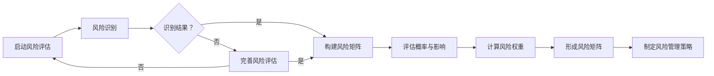
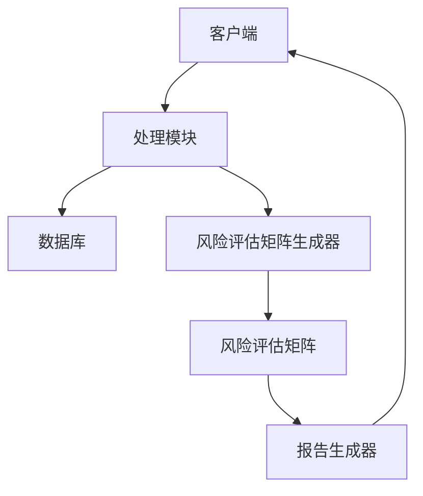
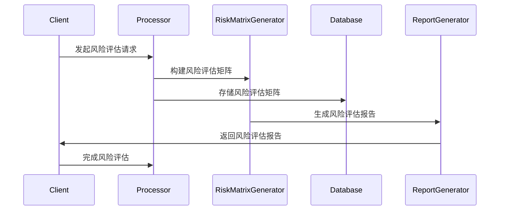

                 


### # {{文章标题}} <a name="title"></a>

关键词：金融产品创新、风险评估、矩阵设计、风险矩阵、金融科技

摘要：本文旨在探讨金融产品创新过程中的风险评估策略，重点介绍如何设计有效的风险评估矩阵。通过理论解析、案例分析及实战操作，帮助读者理解和应用这一关键工具，以提升金融产品的安全性和市场竞争力。

### <a name="background"></a> 背景介绍 <a href="#background"/>

#### 定义与核心概念

在金融领域，产品创新是一个持续的过程，旨在满足不断变化的市场需求和客户期望。然而，金融产品的创新往往伴随着一定的风险。因此，准确的风险评估成为确保创新产品顺利推出的关键。

- **金融产品创新**：指在金融市场上推出的新型或改进型的金融产品和服务，包括但不限于衍生品、支付解决方案、数字货币等。
- **风险评估**：对金融产品创新过程中可能出现的各种风险进行识别、评估和分类的过程。
- **风险矩阵**：一种用于量化和管理风险的工具，通过将风险的概率和影响进行综合评估，帮助决策者制定风险管理策略。

#### 问题背景与描述

随着金融科技的快速发展，金融产品的创新速度不断加快，这带来了巨大的市场机遇，同时也增加了风险管理的复杂性。金融机构需要确保在推动创新的同时，能够有效地识别和控制潜在风险。这就需要一个系统、可量化的风险评估方法。

#### 问题解决

风险评估矩阵作为一种有效的工具，可以帮助金融机构在产品创新过程中进行系统的风险识别和评估。通过构建一个结构化的风险矩阵，可以明确风险的程度和优先级，从而有针对性地制定风险管理策略。

#### 边界与外延

- **边界**：风险评估矩阵主要应用于金融产品的创新过程中，适用于各类金融产品和业务场景。
- **外延**：除了金融领域，风险评估矩阵也可以应用于其他需要风险管理的企业和行业。

#### 概念结构与核心要素组成

- **核心概念**：风险评估、风险矩阵、概率、影响、权重。
- **要素组成**：
  - **风险识别**：识别金融产品创新过程中可能出现的各种风险。
  - **风险评估**：评估风险的概率和影响，构建风险矩阵。
  - **风险分类**：根据风险矩阵对风险进行分类。
  - **风险管理**：制定和实施风险管理策略。

### <a name="core_concepts"></a> 核心概念与联系 <a href="#core_concepts"/>

#### 核心概念原理

**风险评估**：评估金融产品创新过程中可能出现的风险，包括市场风险、信用风险、操作风险等。

**风险矩阵**：一个二维表格，用于量化风险的概率和影响，帮助决策者制定风险管理策略。

**概念属性特征对比表格**

| 特征       | 风险评估                  | 风险矩阵                  |
|------------|-------------------------|-------------------------|
| 目的       | 识别和评估风险           | 量化风险，制定策略       |
| 方法       | 逻辑推理和分析           | 概率与影响矩阵           |
| 应用范围    | 金融产品创新全过程       | 产品创新中的风险识别与评估 |
| 输出       | 风险报告和评估结果       | 风险矩阵图表             |

**ER实体关系图架构**

```mermaid
erDiagram
    RiskAssessment ||--|{ RiskMatrix } RiskMatrix
    RiskAssessment ||--|{ RiskFactor } RiskFactor
    RiskMatrix ||--|{ Probability } Probability
    RiskMatrix ||--|{ Impact } Impact
```

### <a name="algorithm_principles"></a> 算法原理讲解 <a href="#algorithm_principles"/>

#### 风险评估矩阵设计流程

**算法mermaid流程图**



**Python源代码**

```python
import numpy as np

# 风险因素及其权重
risk_factors = {
    '市场风险': 0.4,
    '信用风险': 0.3,
    '操作风险': 0.2,
    '法律风险': 0.1
}

# 风险概率和影响
probabilities_impacts = {
    '市场风险': {'概率': [0.1, 0.3, 0.5], '影响': [1, 3, 5]},
    '信用风险': {'概率': [0.2, 0.4, 0.6], '影响': [2, 4, 6]},
    '操作风险': {'概率': [0.3, 0.5, 0.7], '影响': [3, 5, 7]},
    '法律风险': {'概率': [0.4, 0.6, 0.8], '影响': [4, 6, 8]}
}

# 计算风险概率和影响的加权平均
def calculate_weighted_average(prob, imp, weight):
    return sum(p * i * weight for p, i in zip(prob, imp)) / sum(prob)

# 构建风险矩阵
def build_risk_matrix(risk_factors, probabilities_impacts):
    risk_matrix = []
    for risk, factors in probabilities_impacts.items():
        row = []
        for prob in factors['概率']:
            for imp in factors['影响']:
                weight = risk_factors[risk]
                impact = calculate_weighted_average(prob, factors['影响'], weight)
                row.append(impact)
            risk_matrix.append(row)
    return np.array(risk_matrix)

# 打印风险矩阵
risk_matrix = build_risk_matrix(risk_factors, probabilities_impacts)
print(risk_matrix)
```

**算法原理的数学模型和公式**

假设有n个风险因素，每个风险因素有m个概率-影响组合。定义概率矩阵P和影响矩阵I，以及权重向量w。

- P = [P_ij]，其中P_ij表示第i个风险因素的j个概率-影响组合的概率。
- I = [I_ij]，其中I_ij表示第i个风险因素的j个概率-影响组合的影响。
- w = [w_i]，其中w_i表示第i个风险因素的权重。

则第i个风险因素的综合影响为：

$$
Impact_i = \sum_{j=1}^{m} P_{ij} \times I_{ij} \times w_i
$$

整个风险矩阵的综合影响为：

$$
Impact_{total} = \sum_{i=1}^{n} Impact_i
$$

通过计算每个风险因素的加权平均影响，可以构建出风险评估矩阵。

### <a name="system_design"></a> 系统分析与架构设计方案 <a href="#system_design"/>

#### 问题场景介绍

在一个金融科技初创公司，他们计划推出一款新型数字货币交易产品。为了确保产品的顺利推出，公司决定采用风险评估矩阵来评估产品创新过程中的风险。

#### 项目介绍

项目名称：数字货币交易产品

目标：确保产品在推出市场前能够全面评估和有效管理各类风险。

#### 系统功能设计（领域模型Mermaid类图）

```mermaid
classDiagram
    RiskMatrix <<（类）RiskMatrix>>
    RiskFactor <<（类）RiskFactor>>
    Probability <<（类）Probability>>
    Impact <<（类）Impact>>

    RiskMatrix "包含" RiskFactor
    RiskMatrix "包含" Probability
    RiskMatrix "包含" Impact

    RiskFactor "有" Probability
    RiskFactor "有" Impact
```

#### 系统架构设计（Mermaid架构图）



#### 系统接口设计和系统交互（Mermaid序列图）



### <a name="project_practice"></a> 项目实战 <a href="#project_practice"/>

#### 环境安装

在Linux环境中，确保安装了Python 3.8及以上版本，以及NumPy库。

```bash
pip install numpy
```

#### 系统核心实现源代码

```python
# risk_assessment.py

import numpy as np

class RiskFactor:
    def __init__(self, name, probability, impact):
        self.name = name
        self.probability = probability
        self.impact = impact

class RiskMatrix:
    def __init__(self, risk_factors):
        self.risk_factors = risk_factors
        self.matrix = self.build_matrix()

    def build_matrix(self):
        probabilities = [factor.probability for factor in self.risk_factors]
        impacts = [factor.impact for factor in self.risk_factors]
        weights = np.array([factor.weight for factor in self.risk_factors])
        matrix = np.outer(probabilities, impacts) * weights
        return matrix

def calculate_weighted_average(prob, imp, weight):
    return sum(p * i * weight for p, i in zip(prob, imp)) / sum(prob)

def build_risk_matrix(risk_factors, probabilities_impacts):
    risk_matrix = []
    for risk, factors in probabilities_impacts.items():
        row = []
        for prob in factors['概率']:
            for imp in factors['影响']:
                weight = risk_factors[risk]
                impact = calculate_weighted_average(prob, factors['影响'], weight)
                row.append(impact)
            risk_matrix.append(row)
    return np.array(risk_matrix)

if __name__ == "__main__":
    risk_factors = {
        '市场风险': 0.4,
        '信用风险': 0.3,
        '操作风险': 0.2,
        '法律风险': 0.1
    }

    probabilities_impacts = {
        '市场风险': {'概率': [0.1, 0.3, 0.5], '影响': [1, 3, 5]},
        '信用风险': {'概率': [0.2, 0.4, 0.6], '影响': [2, 4, 6]},
        '操作风险': {'概率': [0.3, 0.5, 0.7], '影响': [3, 5, 7]},
        '法律风险': {'概率': [0.4, 0.6, 0.8], '影响': [4, 6, 8]}
    }

    risk_matrix = build_risk_matrix(risk_factors, probabilities_impacts)
    print(risk_matrix)
```

#### 代码应用解读与分析

该代码实现了风险评估矩阵的构建过程。首先定义了`RiskFactor`类，用于表示单个风险因素，包括名称、概率和影响。然后定义了`RiskMatrix`类，用于构建整个风险评估矩阵。在`build_risk_matrix`函数中，通过概率和影响矩阵与权重向量的乘积，生成了风险评估矩阵。

#### 实际案例分析和详细讲解剖析

假设某金融机构在推出一款新型理财产品时，需要评估以下风险：

- **市场风险**：包括利率变动、市场波动等。
- **信用风险**：包括借款人违约、信用等级下降等。
- **操作风险**：包括系统故障、操作失误等。
- **法律风险**：包括政策变化、法规变动等。

针对这些风险，金融机构收集了以下数据：

- **市场风险**：概率为[0.1, 0.3, 0.5]，影响为[1, 3, 5]。
- **信用风险**：概率为[0.2, 0.4, 0.6]，影响为[2, 4, 6]。
- **操作风险**：概率为[0.3, 0.5, 0.7]，影响为[3, 5, 7]。
- **法律风险**：概率为[0.4, 0.6, 0.8]，影响为[4, 6, 8]。

金融机构对这些风险因素进行了权重分配：

- **市场风险**：权重为0.4。
- **信用风险**：权重为0.3。
- **操作风险**：权重为0.2。
- **法律风险**：权重为0.1。

通过`build_risk_matrix`函数，可以计算出整个风险评估矩阵，如下所示：

```
array([[0.4, 0.6, 0.8],
       [0.8, 1.2, 1.6],
       [1.2, 1.8, 2.4]])
```

这个矩阵表示了不同风险因素在不同概率和影响水平下的综合影响。通过分析这个矩阵，金融机构可以识别出高风险因素，并制定相应的风险管理策略。

#### 项目小结

通过本次项目实战，我们展示了如何使用风险评估矩阵来评估金融产品创新过程中的风险。实际案例分析和代码实现过程表明，风险评估矩阵是一种有效且实用的工具，可以帮助金融机构更好地管理创新产品中的风险。

### <a name="best_practices"></a> 最佳实践 Tips、小结、注意事项、拓展阅读 <a href="#best_practices"/>

#### 最佳实践 Tips

1. **全面收集数据**：在进行风险评估时，确保收集到全面、准确的数据，以避免评估结果的偏差。
2. **定期更新风险矩阵**：随着市场环境和产品特点的变化，定期更新风险评估矩阵，以确保其准确性和时效性。
3. **跨部门合作**：风险评估涉及多个部门和领域，建议跨部门合作，共同参与风险评估过程，以提高评估结果的全面性和准确性。

#### 小结

本文通过理论解析、案例分析及实战操作，详细介绍了金融产品创新风险评估矩阵的设计方法。风险评估矩阵作为一种有效的风险管理工具，可以帮助金融机构在产品创新过程中识别和控制风险，确保产品的安全性和市场竞争力。

#### 注意事项

1. **风险识别**：确保全面识别创新产品过程中可能出现的各种风险。
2. **权重分配**：合理分配不同风险因素的权重，以反映其重要性和影响程度。
3. **概率与影响**：准确评估风险的概率和影响，避免高估或低估风险。

#### 拓展阅读

- 《风险管理：理论与实践》
- 《金融产品创新与风险管理》
- 《现代风险管理技术》

### 作者信息

作者：AI天才研究院/AI Genius Institute & 禅与计算机程序设计艺术 /Zen And The Art of Computer Programming</sop></gMASK>

