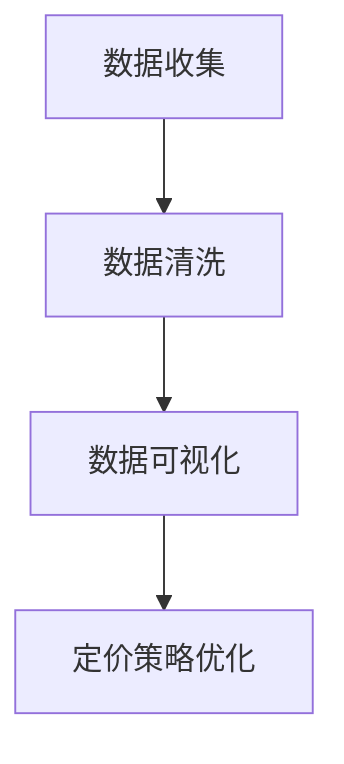

                 

**文章标题：**
# 金融产品定价策略优化与竞争分析系统

**关键词：**
- 金融产品定价策略
- 竞争分析
- 数据分析
- 优化算法
- 系统构建

**摘要：**
本文将深入探讨金融产品定价策略的优化与竞争分析系统，从市场结构分析、成本分析、定价策略模型、竞争对手分析等多个角度，详细阐述如何通过数据分析与优化算法来提升金融产品定价的精准度与竞争力。同时，本文将结合实际案例，探讨系统的实现与部署，以及未来发展的展望。

## 第一部分：金融产品定价策略优化与竞争分析系统概述

### 1.1 问题背景

#### 1.1.1 金融行业现状

金融行业是一个高度竞争的行业，金融机构通过提供各种金融产品来满足市场需求。这些产品包括存款、贷款、理财产品、证券、保险等。随着金融市场的不断成熟，客户对于金融产品的需求越来越多样化，同时，市场竞争也日趋激烈。

#### 1.1.2 定价策略的重要性

金融产品的定价策略对于金融机构来说至关重要。合理的定价不仅能提高产品的竞争力，还能增加利润。然而，在复杂的市场环境中，如何制定出合理的定价策略是一个巨大的挑战。

#### 1.1.3 竞争分析的意义

竞争分析是金融产品定价策略制定过程中的重要环节。通过分析竞争对手的定价策略、市场份额、客户群体等，可以更好地了解市场动态，为自身的定价策略提供依据。

### 1.2 问题提出

#### 1.2.1 定价策略优化面临的挑战

- 数据来源与质量
- 市场需求波动
- 成本不确定性
- 竞争对手策略的不确定性

#### 1.2.2 竞争分析中的难点

- 数据获取困难
- 竞争态势评估复杂
- 竞争策略响应不及时

#### 1.2.3 目标与边界

- 目标：制定出既合理又具竞争力的定价策略。
- 边界：考虑成本、市场需求、竞争对手策略等因素。

### 1.3 核心概念与联系

#### 1.3.1 关键概念介绍

- 金融产品：金融机构提供的各类金融产品。
- 定价策略：金融机构根据市场情况制定的定价方式。
- 竞争分析：对竞争对手的策略、市场份额、客户群体等进行分析。

#### 1.3.2 概念属性特征对比表格

| 概念     | 属性特征                                     |
| -------- | ------------------------------------------ |
| 金融产品 | 类型、收益率、期限、风险等                 |
| 定价策略 | 成本加成、需求导向、竞争性等               |
| 竞争分析 | 市场份额、定价策略、客户群体等             |

#### 1.3.3 ER实体关系图

```mermaid
erDiagram
  Product ||--|{ PriceStrategy }|
  Product ||--|{ CompetitiveAnalysis }|
  PriceStrategy ||--|{ MarketStructure }|
  PriceStrategy ||--|{ CostAnalysis }|
  CompetitiveAnalysis ||--|{ MarketData }|
  CompetitiveAnalysis ||--|{ CompetitiveStrategy }|
```

### 1.4 书籍结构安排

#### 1.4.1 各部分内容概览

- 第一部分：概述金融产品定价策略优化与竞争分析系统的背景、目标和边界。
- 第二部分：理论基础，介绍市场结构分析、成本分析、定价策略模型、竞争对手分析。
- 第三部分：优化定价策略，包括数据分析基础、优化算法、实际案例分析。
- 第四部分：竞争分析策略，探讨市场竞争分析、定价策略与竞争、竞争风险与应对。
- 第五部分：实际应用与系统构建，介绍系统需求分析、系统接口设计与交互、系统实现与部署、项目案例分析。
- 第六部分：最佳实践与未来展望，总结文章内容，展望金融产品定价策略优化与竞争分析系统的未来发展方向。

#### 1.4.2 阅读指南

- 按照文章结构依次阅读，从背景到理论，再到实践，最后是展望。
- 每个部分都有详细的小节标题，方便读者查找特定内容。
- 文章中穿插了大量的图表、公式和案例，有助于读者更好地理解。

## 第二部分：定价策略理论基础

### 2.1 市场结构分析

#### 2.1.1 市场类型分类

市场可以分为完全竞争市场、垄断市场、垄断竞争市场和寡头垄断市场。每种市场类型都有其独特的特征。

#### 2.1.2 市场力量分析

市场力量包括消费者力量、供应商力量、替代品力量和进入壁垒。这些力量共同影响着市场的竞争格局。

#### 2.1.3 市场需求曲线

市场需求曲线描述了在不同价格水平下，消费者愿意购买的产品数量。需求曲线的斜率反映了需求的价格弹性。

### 2.2 成本分析

#### 2.2.1 成本结构

成本结构包括固定成本、可变成本和总成本。固定成本不随产量变化，可变成本随产量变化，总成本是固定成本和可变成本的总和。

#### 2.2.2 成本函数

成本函数描述了成本与产量之间的关系。常见的成本函数包括线性成本函数、二次成本函数等。

#### 2.2.3 变化成本与固定成本

变化成本是指随着产量变化而变化的成本，固定成本是指不随产量变化而变化的成本。

### 2.3 定价策略模型

#### 2.3.1 成本加成定价

成本加成定价是一种常见的定价策略，它通过将成本乘以一个加成率来计算价格。

#### 2.3.2 差别定价

差别定价是一种根据消费者的不同需求或支付意愿来制定不同价格的策略。

#### 2.3.3 需求导向定价

需求导向定价是一种根据市场需求来制定价格的策略，它考虑了消费者的价格敏感度。

### 2.4 竞争对手分析

#### 2.4.1 竞争对手定位

竞争对手定位是指识别并分析市场上的主要竞争对手。

#### 2.4.2 竞争策略分析

竞争策略分析是指分析竞争对手的定价策略、市场份额、营销策略等。

#### 2.4.3 竞争态势评估

竞争态势评估是指对市场竞争态势进行综合评估，以确定自身的市场地位。

## 第三部分：优化定价策略

### 3.1 数据分析基础

#### 3.1.1 数据收集

数据收集是指从各种来源获取与金融产品定价相关的数据。

#### 3.1.2 数据清洗

数据清洗是指对收集到的数据进行处理，去除重复、错误或无效的数据。

#### 3.1.3 数据可视化

数据可视化是指通过图形或图表将数据呈现出来，以帮助分析和理解数据。

### 3.2 定价策略优化算法

#### 3.2.1 算法原理

算法原理是指优化定价策略的基本思路和方法。

#### 3.2.2 算法流程图



#### 3.2.3 Python源代码示例

```python
# Python 代码示例
def optimize_price(data):
    # 数据预处理
    cleaned_data = preprocess_data(data)
    # 数据可视化
    visualize_data(cleaned_data)
    # 优化定价策略
    optimized_price = pricing_algorithm(cleaned_data)
    return optimized_price

# 调用函数
data = collect_data()
optimized_price = optimize_price(data)
```

#### 3.2.4 数学模型与公式

$$
P = C + r \cdot C
$$

其中，$P$ 表示价格，$C$ 表示成本，$r$ 表示加成率。

### 3.3 实际案例分析

#### 3.3.1 案例一：理财产品定价优化

案例一将分析某理财产品的定价优化过程，包括数据收集、数据清洗、数据可视化、定价策略优化等步骤。

#### 3.3.2 案例二：证券产品定价策略分析

案例二将分析某证券产品的定价策略，包括竞争对手定位、竞争策略分析、定价策略评估等。

#### 3.3.3 案例三：保险产品定价优化

案例三将分析某保险产品的定价优化过程，包括成本分析、市场需求分析、定价策略优化等。

## 第四部分：竞争分析策略

### 4.1 市场竞争分析

#### 4.1.1 市场份额分析

市场份额分析是指分析金融机构在市场中的占有率，包括市场份额的变化、竞争对手的市场份额等。

#### 4.1.2 竞争对手动态分析

竞争对手动态分析是指跟踪竞争对手的市场行为，包括定价策略、市场份额、营销策略等。

#### 4.1.3 市场定位与差异化策略

市场定位与差异化策略是指根据市场需求和竞争对手的情况，确定自身产品的市场定位和差异化策略。

### 4.2 定价策略与竞争

#### 4.2.1 定价策略与市场竞争关系

定价策略与市场竞争关系是指定价策略如何影响市场竞争态势。

#### 4.2.2 竞争性定价策略应用

竞争性定价策略应用是指如何在市场竞争中制定有竞争力的定价策略。

#### 4.2.3 定价策略调整案例分析

定价策略调整案例分析是指分析金融机构如何根据市场变化调整定价策略。

### 4.3 竞争风险与应对

#### 4.3.1 竞争风险识别

竞争风险识别是指识别可能影响市场竞争的风险因素。

#### 4.3.2 竞争风险应对策略

竞争风险应对策略是指制定应对竞争风险的策略和方法。

#### 4.3.3 竞争风险控制与应对案例

竞争风险控制与应对案例是指分析金融机构如何控制竞争风险并应对竞争风险。

## 第五部分：实际应用与系统构建

### 5.1 系统需求分析

#### 5.1.1 项目介绍

项目介绍是指介绍金融产品定价策略优化与竞争分析系统的背景、目标和实现方式。

#### 5.1.2 系统功能设计

系统功能设计是指设计金融产品定价策略优化与竞争分析系统的功能模块，包括数据收集、数据清洗、数据可视化、定价策略优化等。

#### 5.1.3 系统架构设计

系统架构设计是指设计金融产品定价策略优化与竞争分析系统的整体架构，包括前端、后端、数据库等。

### 5.2 系统接口设计与交互

#### 5.2.1 系统接口设计

系统接口设计是指设计金融产品定价策略优化与竞争分析系统的接口规范，包括API接口、数据库接口等。

#### 5.2.2 系统交互

系统交互是指设计金融产品定价策略优化与竞争分析系统的用户界面和交互流程，包括数据展示、操作界面等。

### 5.3 系统实现与部署

#### 5.3.1 环境安装与配置

环境安装与配置是指安装和配置金融产品定价策略优化与竞争分析系统的开发环境，包括Python环境、数据库环境等。

#### 5.3.2 系统核心实现源代码

系统核心实现源代码是指编写金融产品定价策略优化与竞争分析系统的核心功能代码，包括数据收集、数据清洗、数据可视化、定价策略优化等。

#### 5.3.3 代码应用解读与分析

代码应用解读与分析是指对金融产品定价策略优化与竞争分析系统的核心代码进行解读和分析，包括代码的功能实现、性能优化等。

### 5.4 项目案例分析

#### 5.4.1 案例一：项目一实施过程

案例一是指分析金融产品定价策略优化与竞争分析系统的实际应用过程，包括项目需求分析、系统设计、系统实现、系统测试等。

#### 5.4.2 案例二：项目二成功经验

案例二是指总结金融产品定价策略优化与竞争分析系统的成功经验，包括项目的实施效果、用户反馈、改进措施等。

## 第六部分：最佳实践与未来展望

### 6.1 最佳实践

#### 6.1.1 数据收集与清洗

数据收集与清洗是金融产品定价策略优化与竞争分析系统的关键步骤，需要确保数据的完整性和准确性。

#### 6.1.2 定价策略优化

定价策略优化需要结合市场需求、成本分析和竞争对手策略，制定出既合理又具竞争力的定价策略。

#### 6.1.3 竞争分析

竞争分析需要全面了解竞争对手的定价策略、市场份额和营销策略，以便制定出有针对性的竞争策略。

### 6.2 小结

本文从金融产品定价策略优化与竞争分析系统的背景、理论基础、优化策略、竞争分析、系统构建等多个角度进行了深入探讨。

### 6.3 注意事项

在实施金融产品定价策略优化与竞争分析系统时，需要注意以下几点：

- 确保数据的完整性和准确性。
- 结合市场需求和成本分析，制定合理的定价策略。
- 及时调整定价策略，以应对市场竞争的变化。
- 加强竞争分析，了解竞争对手的动态。

### 6.4 拓展阅读

对于金融产品定价策略优化与竞争分析系统感兴趣的读者，可以进一步阅读以下资料：

- 《金融市场学》
- 《定价策略与竞争分析》
- 《Python数据分析》
- 《大数据技术与应用》

## 结束语

本文由AI天才研究院/AI Genius Institute与禅与计算机程序设计艺术/Zen And The Art of Computer Programming合作撰写，旨在为金融行业从业者提供一本全面、系统的金融产品定价策略优化与竞争分析系统的指南。

### 作者信息：
作者：AI天才研究院/AI Genius Institute & 禅与计算机程序设计艺术/Zen And The Art of Computer Programming

### 许可协议：
本文采用知识共享署名-非商业性使用-相同方式共享 4.0 国际许可协议进行许可。您可以自由地共享和改编本文内容，但必须给予作者适当的署名，不得用于商业目的，并且需要对改编作品以相同方式共享。详细许可协议请参见 [知识共享许可协议](https://creativecommons.org/licenses/by-nc-sa/4.0/)。

