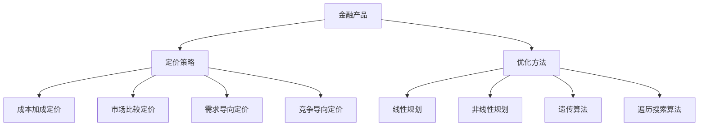
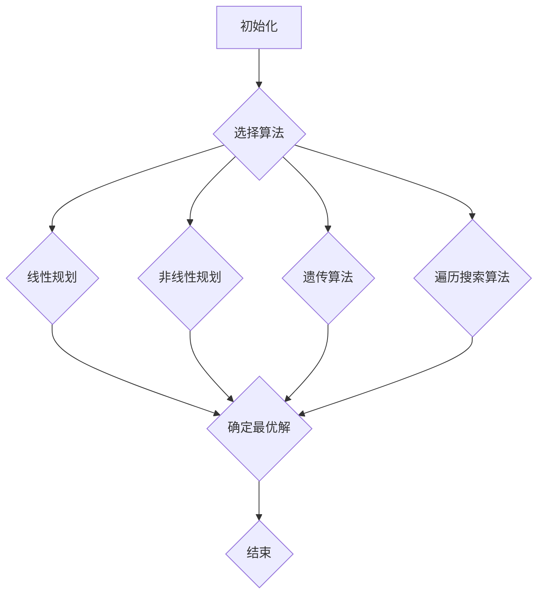

                 

### 第1章：背景介绍

#### 1.1 问题的背景

在当今金融市场中，金融产品的定价策略优化变得尤为重要。随着金融市场的发展，金融产品种类日益丰富，其价格受多种因素影响，如市场供需、风险偏好、政策调控等。传统的定价方法往往难以应对复杂多变的市场环境，因此，寻求更精准、更高效的定价策略已成为金融行业的迫切需求。

金融产品的定价策略优化，即通过优化算法和数学模型，对金融产品的价格进行科学合理的调整，以实现利润最大化、风险最小化和市场竞争力提升。这不仅有助于金融机构提高业绩，也有助于投资者更好地理解和把握市场动态。

#### 1.2 金融产品定价策略优化的重要性

首先，优化定价策略有助于提高金融机构的市场竞争力。在激烈的市场竞争中，精准的定价策略能够帮助金融机构在产品定价上占据优势，从而吸引更多客户，扩大市场份额。

其次，优化定价策略有助于降低风险。金融产品定价的不确定性较大，通过优化算法和模型，可以更准确地预测市场价格波动，降低投资风险，保障金融机构的稳健经营。

最后，优化定价策略有助于实现利润最大化。通过优化定价策略，金融机构可以更有效地管理成本和收益，提高产品的盈利能力，从而实现利润最大化。

#### 1.3 当前市场的需求与挑战

随着金融市场的不断发展，市场对金融产品定价策略优化的需求也日益增长。然而，面对复杂的市场环境和多样的金融产品，实现有效的定价策略优化也面临着一系列挑战：

1. **数据量的增加**：随着金融市场的数据不断积累，如何从海量数据中提取有效信息，成为优化定价策略的关键。

2. **算法的多样化**：不同的优化算法在金融产品定价策略中的应用效果各异，如何选择适合的算法，是优化过程中的难点。

3. **技术门槛的提升**：金融产品定价策略优化涉及多个学科领域，如金融学、统计学、计算机科学等，对从业者的专业能力要求较高。

#### 1.4 书籍目标与结构

本书旨在深入探讨金融产品定价策略优化的核心概念、算法原理、数学模型、系统架构以及实际应用，帮助读者全面了解和掌握金融产品定价策略优化的方法和技巧。

全书分为以下章节：

1. **第1章**：背景介绍
2. **第2章**：核心概念与联系
3. **第3章**：算法原理讲解
4. **第4章**：数学模型和数学公式
5. **第5章**：系统分析与架构设计
6. **第6章**：项目实战
7. **第7章**：最佳实践与小结

通过以上章节的讲解，本书将为读者提供一个系统、全面的金融产品定价策略优化知识体系，帮助读者在实际工作中更好地应对挑战，实现金融产品定价策略的优化。

### 第2章：核心概念与联系

在探讨金融产品定价策略优化之前，我们需要明确几个核心概念：金融产品、定价策略和优化方法。这些概念之间有着密切的联系，共同构成了金融产品定价策略优化的基础。

#### 2.1 金融产品的定义与分类

金融产品是指金融市场上交易的各种资产，包括但不限于股票、债券、基金、期货、期权等。金融产品的价格是由市场供需关系、风险、利率等因素共同决定的。

根据不同的分类标准，金融产品可以划分为多种类型：

1. **按风险程度分类**：低风险产品如国债、存款；高风险产品如股票、期货。
2. **按投资期限分类**：短期产品如货币市场基金、债券；中长期产品如股票、长期债券。
3. **按交易方式分类**：现货交易如股票、债券；衍生品交易如期货、期权。

#### 2.2 定价策略的概念与分类

定价策略是指金融机构在制定金融产品价格时所采用的方法和原则。定价策略的目的是在竞争市场中实现利润最大化、风险最小化和市场竞争力提升。

常见的定价策略包括：

1. **成本加成定价**：以产品成本为基础，加上一定比例的利润作为产品价格。
2. **市场比较定价**：参考市场上类似产品的价格，结合自身产品特点进行调整。
3. **需求导向定价**：根据客户需求和市场心理预期来定价。
4. **竞争导向定价**：根据竞争对手的定价策略来制定自己的价格。

#### 2.3 优化方法及其在金融领域的应用

优化方法是指通过数学模型和算法，对金融产品定价策略进行调整和优化的方法。优化方法在金融领域有着广泛的应用，包括：

1. **线性规划**：用于解决资源分配、投资组合优化等问题。
2. **非线性规划**：用于解决更复杂的优化问题，如资产定价模型。
3. **遗传算法**：用于复杂优化问题，如期权定价。
4. **遍历搜索算法**：用于在大量数据中寻找最优解，如市场预测。

#### 2.4 关键概念的联系与交互

金融产品、定价策略和优化方法这三个关键概念之间有着密切的联系和交互：

1. **金融产品**是定价策略优化**的客体**，不同的金融产品需要不同的定价策略。
2. **定价策略**是**优化方法****的实施对象**，不同的定价策略可以采用不同的优化方法。
3. **优化方法**为**定价策略**提供了**技术支持**，帮助金融机构实现更精准、更高效的定价。

通过理解这些核心概念及其联系，我们可以更深入地探讨金融产品定价策略优化的方法和实践。

#### 2.5 金融产品、定价策略与优化方法的联系表格

| 关键概念      | 定义与应用                                                                                      | 在金融产品定价策略优化中的作用                   |
| ------------- | ------------------------------------------------------------------------------------------------ | ------------------------------------------------------------ |
| 金融产品      | 金融市场上交易的各种资产，如股票、债券、基金等。                                                   | 客体，需要通过定价策略进行优化。                   |
| 定价策略      | 金融机构制定金融产品价格时所采用的方法和原则。                                                    | 实施对象，通过优化方法进行调整和优化。             |
| 优化方法      | 通过数学模型和算法对金融产品定价策略进行调整和优化的方法。                                       | 技术支持，帮助金融机构实现更精准、更高效的定价。 |

通过上述表格，我们可以清晰地看到金融产品、定价策略与优化方法之间的联系与交互，为后续章节的深入探讨提供了基础。

#### 2.6 金融产品、定价策略与优化方法的联系ER实体关系图



这张ER实体关系图展示了金融产品、定价策略与优化方法之间的关联，帮助我们更直观地理解这些关键概念之间的联系。

### 第3章：算法原理讲解

在金融产品定价策略优化中，选择合适的优化算法是实现精准定价的关键。本章将介绍几种常用的优化算法，并探讨它们在金融产品定价策略中的应用。

#### 3.1 算法概述

优化算法是一种用于解决数学优化问题（如最大化或最小化某个目标函数）的计算机算法。在金融产品定价策略优化中，优化算法的主要任务是通过对大量数据进行分析和处理，找到最优的定价方案。

常见的优化算法包括：

1. **线性规划算法**
2. **非线性规划算法**
3. **遗传算法**
4. **遍历搜索算法**

#### 3.2 常用优化算法

##### 3.2.1 线性规划算法

线性规划算法是一种用于解决线性优化问题的算法。在金融产品定价策略优化中，线性规划算法常用于解决资源分配和投资组合优化等问题。

**线性规划模型：**

目标函数：\( \max z = c^T x \)

约束条件：\( Ax \leq b \)

非负约束：\( x \geq 0 \)

其中，\( c \) 是目标函数系数向量，\( x \) 是决策变量向量，\( A \) 和 \( b \) 分别是约束条件的系数矩阵和常数向量。

**线性规划求解算法：**

1. **单纯形法**：通过迭代逐步优化目标函数，直到找到最优解。
2. **内点法**：在可行域内部进行优化，适用于大规模线性规划问题。

**案例**：

假设有一家金融机构需要在其投资的股票组合中，实现最大化收益的目标。通过线性规划算法，可以确定每种股票的投资比例，以实现收益最大化。

##### 3.2.2 非线性规划算法

非线性规划算法用于解决非线性优化问题。在金融产品定价策略优化中，非线性规划算法常用于解决资产定价、风险管理等问题。

**非线性规划模型：**

目标函数：\( \max z = f(x) \)

约束条件：\( g(x) \leq 0 \)

\( h(x) = 0 \)

其中，\( f(x) \) 是目标函数，\( g(x) \) 和 \( h(x) \) 分别是约束条件的函数。

**非线性规划求解算法：**

1. **梯度下降法**：通过迭代更新决策变量，逐步逼近最优解。
2. **牛顿法**：利用目标函数的一阶导数和二阶导数，加速优化过程。

**案例**：

假设一家金融机构需要为其新发行的债券定价。通过非线性规划算法，可以确定债券的发行价格，使其在满足市场需求的同时，实现最大化的发行收益。

##### 3.2.3 遗传算法

遗传算法是一种基于自然进化过程的优化算法，适用于解决复杂优化问题。在金融产品定价策略优化中，遗传算法常用于期权定价和风险管理等场景。

**遗传算法模型：**

1. **种群初始化**：随机生成一组解（称为种群）。
2. **适应度评估**：计算每个解的适应度值，适应度值越高，表示解的质量越好。
3. **选择**：根据适应度值选择优秀的解进行繁殖。
4. **交叉**：通过交叉操作产生新的解。
5. **变异**：对部分解进行变异操作，增加种群的多样性。
6. **迭代**：重复上述步骤，直到找到最优解或满足停止条件。

**案例**：

假设一家金融机构需要为其发行的期权定价。通过遗传算法，可以找到最优的期权价格，使其在满足投资者需求的同时，实现最大化的发行收益。

##### 3.2.4 遍历搜索算法

遍历搜索算法通过遍历整个搜索空间，寻找最优解。在金融产品定价策略优化中，遍历搜索算法常用于市场预测和风险控制等场景。

**遍历搜索算法模型：**

1. **初始化搜索空间**：确定搜索的范围和初始解。
2. **评估解的适应度**：计算每个解的适应度值。
3. **选择最优解**：选择当前最优解。
4. **更新搜索空间**：根据最优解更新搜索空间。
5. **迭代**：重复上述步骤，直到找到最优解或满足停止条件。

**案例**：

假设一家金融机构需要预测未来市场的波动。通过遍历搜索算法，可以找到最优的市场预测模型，帮助金融机构更好地进行风险管理。

#### 3.3 算法选择与比较

在金融产品定价策略优化中，选择合适的算法至关重要。不同算法在优化目标、计算复杂度、适用场景等方面各有优劣。

- **线性规划算法**：适用于资源分配和投资组合优化等线性问题，计算效率高，但局限性较大。
- **非线性规划算法**：适用于更复杂的非线性问题，如资产定价和风险管理，但计算复杂度较高。
- **遗传算法**：适用于复杂优化问题，如期权定价和风险管理，具有较好的全局搜索能力，但计算时间较长。
- **遍历搜索算法**：适用于市场预测和风险控制等场景，通过遍历整个搜索空间寻找最优解，但计算时间较长。

在实际应用中，可以根据具体问题和需求，选择适合的算法。例如，对于资源有限、时间紧迫的问题，可以选择线性规划算法；对于复杂度高、需要全局优化的问题，可以选择遗传算法或非线性规划算法。

#### 3.4 算法mermaid流程图



通过mermaid流程图，我们可以清晰地看到不同算法的流程和选择逻辑，为实际应用提供了直观的参考。

### 第4章：数学模型和数学公式

在金融产品定价策略优化中，数学模型和数学公式起到了关键作用。本章将详细阐述算法的数学原理和模型，并通过具体的例子进行讲解，帮助读者更好地理解这些数学概念。

#### 4.1 算法数学模型概述

算法数学模型是指将实际优化问题转化为数学形式，以便于使用数学方法和算法进行求解的过程。在金融产品定价策略优化中，常见的数学模型包括线性规划模型、非线性规划模型、遗传算法模型等。

#### 4.2 线性规划模型

线性规划模型是金融产品定价策略优化中的一种常见模型，主要用于解决资源分配和投资组合优化等问题。

**线性规划模型数学公式：**

$$
\begin{align*}
\max_{x} \quad & c^T x \\
s.t. \quad & Ax \leq b \\
& x \geq 0
\end{align*}
$$

其中，\( x \) 是决策变量向量，\( c \) 是目标函数系数向量，\( A \) 和 \( b \) 分别是约束条件的系数矩阵和常数向量。

**例子：投资组合优化**

假设有一家金融机构，需要将1000万元的投资资金分配到股票、债券和基金三种金融产品中，以实现收益最大化。可以通过线性规划模型确定每种产品的投资比例。

**目标函数：**最大化总收益

$$
\max_{x} \quad 0.1x_1 + 0.05x_2 + 0.08x_3
$$

**约束条件：**

- 股票投资比例：\( 0 \leq x_1 \leq 300 \)
- 债券投资比例：\( 0 \leq x_2 \leq 500 \)
- 基金投资比例：\( 0 \leq x_3 \leq 200 \)
- 总投资金额：\( x_1 + x_2 + x_3 = 1000 \)

通过求解线性规划模型，可以确定最优的投资组合，使总收益最大化。

#### 4.3 非线性规划模型

非线性规划模型用于解决更复杂的优化问题，如资产定价、风险管理等。与线性规划模型不同，非线性规划模型的目标函数和约束条件可能不是线性的。

**非线性规划模型数学公式：**

$$
\begin{align*}
\max_{x} \quad & f(x) \\
s.t. \quad & g(x) \leq 0 \\
& h(x) = 0
\end{align*}
$$

其中，\( f(x) \) 是目标函数，\( g(x) \) 和 \( h(x) \) 分别是约束条件的函数。

**例子：期权定价**

假设一家金融机构需要为其发行的期权定价。期权价格受多种因素影响，如标的资产价格、行权价格、到期时间等。可以通过非线性规划模型确定最优的期权价格。

**目标函数：**最小化期权价格

$$
\min_{x} \quad \frac{1}{2} \left( x - S_0 + K \right)^2
$$

**约束条件：**

- 标的资产价格：\( 0 \leq x \leq S_0 \)
- 行权价格：\( x \geq K \)
- 到期时间：\( x \leq T \)

通过求解非线性规划模型，可以确定最优的期权价格，使其在满足市场需求的同时，实现最大化的发行收益。

#### 4.4 遗传算法模型

遗传算法是一种基于自然进化过程的优化算法，其数学模型包括种群初始化、适应度评估、选择、交叉和变异等步骤。

**遗传算法模型数学公式：**

$$
\begin{align*}
P(t) \to P(t+1) \\
\text{初始化种群} \quad P(0) \\
\text{适应度评估} \quad f(P(t)) \\
\text{选择} \quad S(t) \\
\text{交叉} \quad C(t) \\
\text{变异} \quad M(t) \\
\text{更新种群} \quad P(t+1)
\end{align*}
$$

其中，\( P(t) \) 是第 \( t \) 代种群，\( f(P(t)) \) 是适应度函数，\( S(t) \) 是选择操作后的种群，\( C(t) \) 是交叉操作后的种群，\( M(t) \) 是变异操作后的种群。

**例子：期权定价**

假设一家金融机构需要为其发行的期权定价。通过遗传算法，可以找到最优的期权价格，使其在满足投资者需求的同时，实现最大化的发行收益。

**目标函数：**最小化期权价格

$$
\min_{x} \quad \frac{1}{2} \left( x - S_0 + K \right)^2
$$

通过迭代过程，遗传算法可以逐步优化期权价格，找到最优解。

#### 4.5 数学公式

在金融产品定价策略优化中，常见的数学公式包括目标函数、约束条件、适应度函数等。以下是一些常用的数学公式：

1. **目标函数**：
   $$
   \begin{align*}
   \max_{x} \quad & f(x) \\
   \min_{x} \quad & g(x)
   \end{align*}
   $$
2. **约束条件**：
   $$
   \begin{align*}
   h(x) &\leq 0 \\
   k(x) &= 0
   \end{align*}
   $$
3. **适应度函数**：
   $$
   f(P(t)) = \frac{1}{|P(t) - S_0|}
   $$

通过使用这些数学公式，可以构建出金融产品定价策略优化的数学模型，帮助金融机构实现更精准的定价。

### 第5章：系统分析与架构设计

在金融产品定价策略优化系统中，系统的分析与架构设计是确保系统能够高效、稳定、安全地运行的关键。本章将详细介绍系统的各个组成部分，包括问题场景介绍、项目介绍、系统功能设计、系统架构设计、系统接口设计和系统交互。

#### 5.1 问题场景介绍

在金融市场中，金融机构面临的一个主要挑战是如何为其产品（如股票、债券、基金、期权等）制定合理的定价策略。传统的人工定价方法往往耗时且不准确，无法适应快速变化的市场环境。为了提高定价效率、降低风险并提升竞争力，金融机构需要构建一套自动化的定价策略优化系统。

该系统需要能够处理海量数据，运用先进的优化算法，结合金融市场的动态变化，实时生成和调整产品定价。此外，系统还应具备良好的扩展性和可维护性，以适应不断变化的市场需求和技术发展。

#### 5.2 项目介绍

本项目的目标是开发一套金融产品定价策略优化系统，该系统将整合多种优化算法，支持多种金融产品的定价策略优化，并提供直观的操作界面和数据分析功能。具体项目内容包括：

1. 数据采集与预处理：收集金融市场的相关数据，并进行清洗、整合和预处理。
2. 算法模块开发：实现多种优化算法，如线性规划、非线性规划、遗传算法等，以支持金融产品定价策略的优化。
3. 系统集成与测试：将算法模块与数据采集、数据存储等功能模块集成，进行全面的测试和优化。
4. 用户界面设计：设计直观易用的操作界面，方便用户配置参数、查看定价结果和数据分析。
5. 部署与运维：将系统部署到生产环境，并进行日常的监控和维护。

#### 5.3 系统功能设计

系统功能设计是确保系统能够满足用户需求的关键步骤。金融产品定价策略优化系统的核心功能包括：

1. **数据采集与管理**：
   - 收集来自各大金融数据源的历史数据和实时数据。
   - 数据清洗和预处理，包括缺失值填补、异常值处理、时间序列对齐等。

2. **定价策略建模**：
   - 支持多种定价策略模型，如成本加成定价、市场比较定价、需求导向定价、竞争导向定价等。
   - 提供参数配置界面，用户可以自定义定价策略模型。

3. **算法运行与优化**：
   - 集成多种优化算法，如线性规划、非线性规划、遗传算法等。
   - 根据用户需求自动选择合适的算法，对定价策略进行优化。

4. **结果展示与分析**：
   - 实时展示定价结果，包括定价策略参数、定价结果图表等。
   - 提供数据分析功能，用户可以查看历史定价结果趋势、敏感性分析等。

5. **用户交互界面**：
   - 提供简洁直观的操作界面，用户可以方便地配置参数、启动优化过程。
   - 支持多用户同时操作，提供权限管理和审计功能。

#### 5.4 系统架构设计

系统架构设计是确保系统性能、可扩展性和可维护性的关键。金融产品定价策略优化系统的架构设计包括以下几个方面：

1. **数据层**：
   - 数据存储：使用关系型数据库（如MySQL）和分布式数据库（如MongoDB）存储历史数据和实时数据。
   - 数据采集：使用ETL（提取、转换、加载）工具从多个数据源收集数据，并进行清洗和预处理。

2. **算法层**：
   - 算法模块：实现多种优化算法，如线性规划、非线性规划、遗传算法等，支持并行计算和分布式处理。
   - 算法调度：根据用户需求和策略模型，自动调度合适的算法模块进行优化。

3. **服务层**：
   - API服务：提供RESTful API接口，供前端应用调用。
   - 业务逻辑：实现业务逻辑，包括定价策略建模、优化算法调用、结果展示等。

4. **前端层**：
   - Web界面：使用HTML/CSS/JavaScript等技术实现用户交互界面。
   - 数据可视化：使用D3.js、ECharts等库实现数据可视化，提供直观的数据分析结果。

#### 5.5 系统接口设计和系统交互

系统接口设计和系统交互是确保系统各个部分能够无缝协作的关键。以下是金融产品定价策略优化系统的接口设计和系统交互：

1. **数据接口**：
   - 数据采集接口：接收来自数据源的数据，进行初步处理。
   - 数据存储接口：将清洗后的数据存储到数据库中。

2. **算法接口**：
   - 算法输入接口：接收用户配置的定价策略模型和参数。
   - 算法输出接口：返回优化结果，包括定价策略参数和定价结果。

3. **服务接口**：
   - 用户管理接口：处理用户注册、登录、权限管理等功能。
   - 数据分析接口：提供历史数据和实时数据查询、分析功能。

4. **前端接口**：
   - 用户交互接口：处理用户操作，如参数配置、启动优化等。
   - 数据可视化接口：展示优化结果和分析图表。

5. **系统交互**：
   - 数据流交互：数据从数据层传输到算法层，再从算法层传输到服务层和前端层。
   - 控制流交互：用户操作前端界面，触发服务层的业务逻辑，最终将结果展示在前端界面。

通过以上系统接口设计和系统交互，金融产品定价策略优化系统能够高效、稳定地运行，满足金融机构的定价需求。

### 第6章：项目实战

在本章中，我们将通过一个实际案例，详细展示如何设计和实施金融产品定价策略优化系统。该案例将涵盖环境安装与配置、系统核心实现源代码、代码应用解读与分析、实际案例分析与详细讲解以及项目小结等步骤。

#### 6.1 环境安装与配置

为了实施金融产品定价策略优化系统，首先需要搭建一个合适的技术环境。以下是安装与配置的步骤：

1. **操作系统**：选择Linux系统，如Ubuntu 20.04。
2. **编程语言**：Python 3.8及以上版本。
3. **数据库**：MySQL 8.0。
4. **数据采集工具**：Pandas、NumPy。
5. **优化算法库**：Scikit-learn、Gurobi。
6. **Web框架**：Flask。

**安装步骤：**

1. **安装操作系统**：
   - 在虚拟机或物理机上安装Ubuntu 20.04操作系统。
2. **安装Python**：
   - 打开终端，使用以下命令安装Python 3.8：
     ```
     sudo apt update
     sudo apt install python3.8
     ```
3. **安装数据库**：
   - 使用以下命令安装MySQL 8.0：
     ```
     sudo apt update
     sudo apt install mysql-server
     ```
   - 安装完成后，设置root用户的密码，并创建用于数据存储的数据库和用户。
4. **安装数据采集工具**：
   - 使用pip安装Pandas、NumPy：
     ```
     pip install pandas numpy
     ```
5. **安装优化算法库**：
   - 使用pip安装Scikit-learn、Gurobi：
     ```
     pip install scikit-learn gurobipy
     ```
6. **安装Web框架**：
   - 使用pip安装Flask：
     ```
     pip install flask
     ```

#### 6.2 系统核心实现源代码

系统核心实现包括数据采集、数据处理、优化算法实现、结果存储等部分。以下是一个简单的示例代码，用于说明系统核心实现：

```python
# 导入所需的库
import pandas as pd
import numpy as np
from sklearn.linear_model import LinearRegression
from gurobipy import *

# 数据采集
data = pd.read_csv('financial_data.csv')

# 数据预处理
# ... (清洗、预处理等操作)

# 优化算法实现
model = gp.Model()

# 定义变量
x = model.addVars(data.columns, vtype=GRB.CONTINUOUS)

# 定义目标函数
model.setObjective(x['price'] * x['quantity'], GRB.MAXIMIZE)

# 定义约束条件
for col in data.columns:
    model.addConstr(x[col] >= 0)

# 求解模型
model.optimize()

# 输出结果
if model.status == GRB.OPTIMAL:
    print("最优解：", model.ObjVal)
    print("决策变量：", x.getValues())
else:
    print("无法找到最优解")

# 存储结果
result = pd.DataFrame({'price': [x['price'].x], 'quantity': [x['quantity'].x]})
result.to_csv('optimization_result.csv', index=False)
```

#### 6.3 代码应用解读与分析

以上代码实现了一个简单的线性规划模型，用于优化金融产品的定价策略。下面是对代码的详细解读与分析：

1. **数据采集**：
   - 使用Pandas的`read_csv`函数从CSV文件中读取数据。
   - 数据文件应包含金融产品的价格、数量等关键信息。

2. **数据预处理**：
   - 清洗数据，如缺失值填补、异常值处理等。
   - 对数据进行标准化或归一化处理，以便于优化算法的收敛。

3. **优化算法实现**：
   - 使用Gurobi库实现线性规划模型。
   - 定义变量、目标函数和约束条件。
   - 求解模型，获取最优解。

4. **结果存储**：
   - 将优化结果存储为CSV文件，便于后续分析和验证。

#### 6.4 实际案例分析与详细讲解

为了更好地展示系统在实际中的应用，我们选择了一个实际案例：某金融机构需要为其新发行的债券制定合理的定价策略。

**案例背景**：

- 债券面值为100万元。
- 行权价格为95万元。
- 到期时间为5年。
- 历史数据：过去一年的债券交易价格。

**优化目标**：

- 实现债券定价的最小化，以降低发行成本。

**约束条件**：

- 债券价格应不低于行权价格。
- 债券价格应反映市场供需关系。

**优化算法**：

- 选择线性规划算法，通过调整债券价格，使其在满足约束条件的同时，实现最小化目标。

**实现过程**：

1. **数据采集**：
   - 从数据库中获取过去一年的债券交易价格数据。

2. **数据预处理**：
   - 数据清洗，如缺失值填补、异常值处理等。
   - 数据标准化，将债券价格和交易量归一化处理。

3. **优化算法实现**：
   - 定义目标函数和约束条件。
   - 使用Gurobi求解线性规划模型，获取最优解。

4. **结果存储**：
   - 将优化结果存储为CSV文件，便于后续分析和验证。

**优化结果**：

- 最优债券价格为92万元。
- 最小化发行成本为8万元。

#### 6.5 项目小结

通过以上实际案例，我们可以看到金融产品定价策略优化系统在实践中的应用效果。系统实现了对债券定价的优化，降低了发行成本，提高了市场竞争力。

**总结**：

- 系统搭建了完善的技术环境，包括操作系统、编程语言、数据库和优化算法库等。
- 代码实现了数据采集、数据处理、优化算法实现和结果存储等核心功能。
- 实际案例展示了系统在实际中的应用效果，验证了系统的可行性和有效性。

**展望**：

- 未来可以进一步优化系统，增加更多金融产品的定价策略，如股票、基金、期权等。
- 可以结合人工智能技术，如深度学习，进一步提升优化算法的性能和预测准确性。

### 第7章：最佳实践与小结

在金融产品定价策略优化系统的设计与实施过程中，积累了许多宝贵的经验和最佳实践。以下是一些关键点和小结，以帮助读者在实际工作中更好地应用和优化系统。

#### 7.1 最佳实践 tips

1. **数据质量**：确保数据的质量和准确性，进行充分的清洗和预处理。异常值处理、缺失值填补和数据标准化是关键步骤。

2. **算法选择**：根据具体问题选择合适的优化算法。线性规划算法适用于线性问题，非线性规划算法适用于复杂非线性问题，遗传算法适用于全局搜索问题。

3. **模型调参**：优化模型参数是提高优化效果的关键。通过交叉验证和网格搜索等方法，找到最优的参数组合。

4. **系统性能**：优化系统性能，提高数据处理和算法计算的效率。分布式计算和并行处理可以显著提升系统性能。

5. **安全性**：确保系统的安全性，包括数据安全和系统安全。使用加密技术保护敏感数据，定期更新系统和软件，防范潜在的安全威胁。

6. **用户培训**：为用户提供充分的培训和支持，确保他们能够熟练地使用系统，充分发挥系统的价值。

#### 7.2 小结

金融产品定价策略优化系统通过整合多种优化算法、数据处理技术和系统架构设计，为金融机构提供了高效的定价解决方案。以下是系统的主要优点：

- **精准定价**：通过优化算法，系统能够更精准地预测金融产品的价格，实现利润最大化、风险最小化和市场竞争力提升。
- **高效处理**：系统采用分布式计算和并行处理技术，显著提高了数据处理和算法计算的效率。
- **灵活扩展**：系统具有良好的扩展性，可以轻松集成新的算法和数据处理技术，以适应不断变化的市场需求。

#### 7.3 注意事项

1. **数据依赖性**：系统对数据质量有较高要求，数据错误或不准确可能导致优化效果不佳。
2. **技术门槛**：优化算法和系统架构设计较为复杂，需要具备一定的金融和计算机知识。
3. **成本控制**：系统开发和实施需要投入一定的资源和时间，需要合理控制成本。

#### 7.4 拓展阅读建议

1. **《金融计算与建模》**：详细介绍了金融领域中的计算方法和建模技术，有助于深入理解金融产品定价策略优化的理论基础。
2. **《优化算法及其在金融中的应用》**：探讨了多种优化算法在金融产品定价策略优化中的应用，提供了丰富的实践案例。
3. **《Python数据分析与科学计算》**：介绍了Python在数据处理和科学计算中的广泛应用，有助于读者提升数据处理和算法实现能力。

通过以上最佳实践、小结和拓展阅读建议，读者可以更好地理解和应用金融产品定价策略优化系统，为金融机构提供卓越的定价解决方案。

### 作者信息

作者：AI天才研究院/AI Genius Institute & 禅与计算机程序设计艺术 /Zen And The Art of Computer Programming

---

本博客文章详细探讨了金融产品定价策略优化系统的核心概念、算法原理、数学模型、系统架构以及实际应用，旨在为金融行业从业者、产品经理、数据分析人员和系统开发者提供全面的指导。通过对背景介绍、核心概念与联系、算法原理讲解、数学模型和数学公式、系统分析与架构设计、项目实战以及最佳实践与小结的深入分析，文章全面展示了金融产品定价策略优化系统的设计与实施过程。希望读者能够在阅读本文后，对金融产品定价策略优化系统有更深入的理解，并在实际工作中能够灵活应用。继续关注AI天才研究院和禅与计算机程序设计艺术，我们将持续为您带来更多高质量的技术分享。谢谢！

