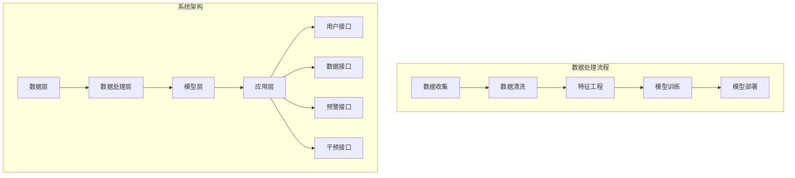

                 

### 金融产品客户流失预警与干预系统：背景与核心概念

#### 关键词
- 客户流失预警
- 金融产品
- 干预系统
- 数据分析
- 预测模型

#### 摘要
随着金融市场的不断发展和竞争加剧，金融机构面临客户流失的巨大挑战。客户流失不仅对企业的收入造成直接影响，还会损害品牌形象和市场竞争力。因此，建立有效的客户流失预警与干预系统显得尤为重要。本文将详细探讨客户流失预警与干预系统的核心概念、原理和实践，以帮助金融机构更好地理解和应对客户流失问题。

#### 背景介绍

金融产品客户流失预警与干预系统是现代金融机构风险管理的重要组成部分。客户流失（Customer Churn）是指客户在一段时间内停止使用金融机构的产品或服务。在金融行业中，客户流失意味着潜在的收入损失和客户基数的减少。因此，预测和干预客户流失对于维持企业的盈利能力和市场地位至关重要。

客户流失问题在金融产品中尤为突出，主要原因包括：

1. **市场竞争激烈**：金融产品的同质化严重，客户更容易受到其他竞争对手的吸引。
2. **客户需求多样化**：随着客户需求的不断变化，金融机构需要提供更加个性化和高效的服务。
3. **技术变革**：金融科技的快速发展使得客户有了更多的选择，同时也提高了他们对服务的期望。
4. **政策法规变化**：金融监管政策的调整可能直接影响客户的行为和决策。

#### 问题定义

客户流失预警系统是指利用数据分析、机器学习和统计模型等技术，预测哪些客户有可能会流失，从而提前采取干预措施，减少客户流失率。干预系统则是在预警系统的基础上，通过一系列策略和工具，如个性化营销、客户关怀和定制化服务，来阻止客户流失。

#### 解决方案

1. **数据分析**：通过收集和分析客户的交易数据、行为数据和客户服务数据，挖掘潜在流失客户的行为特征。
2. **机器学习**：利用机器学习算法建立客户流失预测模型，对客户流失风险进行量化评估。
3. **干预策略**：根据预测结果，制定相应的干预策略，如提供优惠、个性化推荐和客户关怀等。
4. **系统实施**：建立集数据分析、模型预测和干预策略于一体的客户流失预警与干预系统，确保系统能够实时运行并不断优化。

#### 边界与外延

1. **客户流失**：不仅包括客户停止使用某一产品或服务，还包括客户减少使用频率和取消订阅等行为。
2. **预警系统**：不仅限于预测客户流失，还可以扩展到预测客户满意度和忠诚度等其他维度。
3. **干预策略**：不仅限于营销策略，还包括客户服务改进、用户体验优化和产品创新等。

#### 概念结构与核心要素组成

**概念结构**：

- 客户流失
- 预警系统
- 干预策略
- 数据分析
- 机器学习
- 模型预测

**核心要素组成**：

- **数据收集与处理**：收集客户相关数据，并进行数据清洗和预处理。
- **特征工程**：提取对客户流失有影响力的特征。
- **模型训练与评估**：利用机器学习算法训练预测模型，并进行模型评估。
- **干预实施与反馈**：根据预测结果实施干预措施，并收集反馈进行系统优化。

### 核心概念与联系

**核心概念**：

- **客户流失（Customer Churn）**：指客户在一段时间内停止使用金融机构的产品或服务。
- **预警系统（Churn Warning System）**：利用数据分析技术预测客户流失的系统。
- **干预策略（Intervention Strategy）**：为防止客户流失而采取的行动和策略。

**概念属性特征对比表格**：

| 概念         | 定义                                           | 属性特征                                      |
| ------------ | ---------------------------------------------- | --------------------------------------------- |
| 客户流失     | 客户停止使用金融机构的产品或服务               | 流失率、流失周期、流失原因                    |
| 预警系统     | 预测客户流失的系统                           | 数据来源、模型算法、预警阈值                  |
| 干预策略     | 防止客户流失的行动和策略                     | 个性化推荐、客户关怀、优惠活动                |

**ER实体关系图架构**：

```mermaid
erDiagram
  Customer -->|uses| Product
  Customer -->|contacted| Service
  Product -->|provided_by| Service
  Customer ||--|predicted_by| ChurnPredictionModel
  ChurnPredictionModel ||--|uses| FeatureSet
  FeatureSet ||--|extracted_from| Data
```

在这个ER图架构中，客户与产品和服务之间存在关联关系，预警模型基于特征集进行预测，特征集来源于数据。

通过上述介绍，我们为后续章节的内容奠定了基础，接下来将进一步深入探讨客户流失分析的核心概念和原理，以及如何利用数据分析和机器学习技术构建高效的预警与干预系统。在下文中，我们将详细分析客户流失的定义、影响因素，以及常用的客户流失预测模型。

### 核心概念与原理：客户流失的定义、影响因素与预测模型

在上一节中，我们介绍了客户流失预警与干预系统的背景和核心概念。为了更好地理解和应用这些概念，本节将深入探讨客户流失的定义、影响因素以及常用的客户流失预测模型。

#### 客户流失的定义

客户流失（Customer Churn）是指客户在一段时间内停止使用金融机构的产品或服务。在金融行业中，客户流失通常表现为以下几种形式：

1. **取消订阅**：客户主动取消对某一产品或服务的订阅。
2. **停止交易**：客户在一段时间内不再进行任何交易活动。
3. **减少交易频率**：客户的交易活动频率显著下降。
4. **账户注销**：客户主动关闭或注销其账户。

客户流失不仅对金融机构的收入造成直接影响，还会影响客户满意度和品牌忠诚度。因此，准确预测客户流失是金融机构进行风险管理的重要任务。

#### 影响因素

客户流失是一个复杂的现象，受到多种因素的影响。以下是一些主要的影响因素：

1. **市场竞争力**：竞争对手的吸引力和市场地位直接影响客户的忠诚度。
2. **服务质量**：服务质量不高，如客户服务响应慢、系统故障等，可能导致客户流失。
3. **客户满意度**：客户对产品或服务的满意度低，可能导致客户流失。
4. **产品特性**：产品功能不满足客户需求或产品价格过高，也可能导致客户流失。
5. **客户关系**：金融机构与客户之间的互动不足，可能导致客户感到不受重视。
6. **经济环境**：经济不景气、利率变化等宏观经济因素可能影响客户的财务状况和消费意愿。

#### 客户流失预测模型

预测客户流失需要使用各种数据分析技术，其中机器学习和统计模型是最常用的方法。以下是一些常用的客户流失预测模型：

1. **统计模型**：
   - **逻辑回归**：逻辑回归是一种经典的统计模型，用于预测二元变量（流失/未流失）。它通过构建一个逻辑函数，将客户特征映射到流失概率。
     $$ P(\text{Churn}) = \frac{1}{1 + e^{-(\beta_0 + \beta_1 X_1 + \beta_2 X_2 + ... + \beta_n X_n)}} $$
   - **决策树**：决策树通过一系列规则来分类客户是否流失。每个节点代表一个特征，每个分支代表特征的不同取值，最终达到一个叶子节点，代表流失概率。
   - **随机森林**：随机森林是决策树的集成方法，通过构建多棵决策树并求平均来提高预测准确性。

2. **机器学习模型**：
   - **支持向量机（SVM）**：SVM通过找到一个最佳的超平面，将不同类别的客户特征分隔开，从而预测客户是否流失。
   - **神经网络**：神经网络是一种模拟人脑结构的计算模型，通过多层次的神经元处理输入信息，可以捕捉复杂的非线性关系。
   - **集成学习**：集成学习通过组合多个基本模型来提高预测性能，如梯度提升树（Gradient Boosting Trees）和集成梯度提升机（Gradient Boosting Machines）。

#### 模型评估与优化

在建立客户流失预测模型时，评估和优化模型是非常重要的步骤。以下是一些常用的模型评估指标：

1. **准确率（Accuracy）**：准确率是指预测正确的样本数占总样本数的比例。尽管简单，但准确率有时并不能很好地反映模型的性能，特别是数据不平衡时。
2. **精确率（Precision）**：精确率是指预测为流失的样本中实际流失的占比。
3. **召回率（Recall）**：召回率是指实际流失的样本中被预测为流失的占比。
4. **F1分数（F1 Score）**：F1分数是精确率和召回率的调和平均，用于平衡两者的贡献。
   $$ F1 = 2 \times \frac{Precision \times Recall}{Precision + Recall} $$
5. **ROC曲线和AUC值**：ROC曲线是真实曲线与伪曲线的图形表示，AUC值是ROC曲线下面积，用于评估模型的分类能力。

#### 模型训练与测试

模型训练和测试是构建预测模型的关键步骤。以下是一个简单的模型训练和测试流程：

1. **数据收集**：收集客户的历史数据，包括交易数据、客户属性数据和行为数据等。
2. **数据预处理**：对数据进行清洗和预处理，包括缺失值处理、异常值检测和特征工程。
3. **模型选择**：根据问题特点和数据特性，选择合适的预测模型。
4. **模型训练**：使用训练数据集对模型进行训练，调整模型参数以优化性能。
5. **模型测试**：使用测试数据集评估模型的性能，通过交叉验证等技术避免过拟合。
6. **模型优化**：根据测试结果对模型进行调整和优化，以提高预测准确性。

#### 结论

客户流失预警与干预系统是金融机构风险管理的重要组成部分。通过定义客户流失、分析影响因素和构建预测模型，金融机构可以更有效地预测客户流失，并采取相应的干预措施。在本节中，我们介绍了客户流失的定义、影响因素以及常用的预测模型，为后续章节的数据收集和预测模型实施奠定了基础。在下一节中，我们将深入探讨如何收集和准备用于客户流失预测的数据。

### 数据收集与准备：数据来源、数据类型与预处理方法

在构建客户流失预警与干预系统时，数据的收集和准备是至关重要的一步。高质量的数据是构建有效预测模型的基础，因此，我们需要深入了解数据的来源、类型以及预处理方法。

#### 数据来源

1. **内部数据**：
   - **交易数据**：记录客户在金融机构的各项交易活动，包括交易金额、交易时间和交易类型等。
   - **客户信息**：包括客户的个人信息、财务状况和信用记录等。
   - **服务数据**：记录客户与金融机构的互动历史，如电话咨询、邮件沟通和在线客服等。

2. **外部数据**：
   - **市场数据**：包括宏观经济指标、行业动态和竞争对手信息等。
   - **社交媒体数据**：通过分析客户在社交媒体上的行为和评论，可以了解客户对金融机构的感知和态度。
   - **第三方数据**：如信用评分机构、数据服务提供商等提供的数据。

#### 数据类型

在客户流失预警与干预系统中，常用的数据类型包括：

1. **结构化数据**：如客户信息表、交易记录表等，通常存储在数据库中，便于查询和分析。
2. **非结构化数据**：如文本、图片和音频等，通常需要通过自然语言处理、图像识别等技术进行解析和提取有用信息。
3. **时间序列数据**：记录客户在一段时间内的行为和交易活动，如客户账户余额、交易频率等。

#### 数据预处理方法

1. **数据清洗**：
   - **缺失值处理**：对于缺失的数据，可以采用插值法、均值填补法或删除缺失值等方法进行处理。
   - **异常值检测**：通过统计分析方法，如箱线图、标准差检验等，检测并处理异常值。

2. **特征工程**：
   - **特征提取**：从原始数据中提取对客户流失有显著影响的特征，如客户年龄、收入水平、交易频率等。
   - **特征转换**：将一些数值型特征转换为分类特征，如将收入水平分为高、中、低三个等级。
   - **特征选择**：通过统计分析方法，如相关性分析、特征重要性评估等，选择对预测模型贡献最大的特征。

3. **数据归一化**：
   - **归一化方法**：采用归一化方法，如Min-Max归一化或标准化，将数据缩放到相同的范围，以避免特征之间的尺度差异对模型产生偏见。

4. **数据增强**：
   - **交叉验证**：通过交叉验证方法，如K折交叉验证，评估模型的泛化能力，并避免过拟合。
   - **数据扩充**：通过生成新的数据样本，如使用GAN（生成对抗网络）等方法，增加数据的多样性。

#### 数据预处理示例

假设我们有一个包含客户交易记录的数据集，如下表所示：

| 客户ID | 交易金额 | 交易时间 | 客户年龄 | 收入水平 | 交易频率 |
| ------ | -------- | -------- | -------- | -------- | -------- |
| A001   | 1000     | 2021-01-01 | 30      | 高       | 10       |
| A002   | 500      | 2021-01-02 | 40      | 中       | 5        |
| A003   | 800      | 2021-01-03 | 25      | 低       | 15       |

在进行数据预处理时，我们可能需要进行以下步骤：

1. **缺失值处理**：如果有客户的收入水平缺失，我们可以用该客户的平均收入水平进行填补。
2. **异常值检测**：通过标准差检验，如果某个客户的交易金额远高于或低于其他客户，则认为其可能是异常值，需要进一步调查。
3. **特征工程**：将收入水平转换为分类特征，如下表所示：

| 客户ID | 交易金额 | 交易时间 | 客户年龄 | 收入水平 | 交易频率 | 收入等级 |
| ------ | -------- | -------- | -------- | -------- | -------- | -------- |
| A001   | 1000     | 2021-01-01 | 30      | 高       | 10       | 高       |
| A002   | 500      | 2021-01-02 | 40      | 中       | 5        | 中       |
| A003   | 800      | 2021-01-03 | 25      | 低       | 15       | 低       |

4. **数据归一化**：将所有数值型特征进行归一化处理，例如，将交易金额和交易频率缩放到0到1的范围内。
5. **数据增强**：通过交叉验证方法，确保模型在不同数据集上的性能。

通过上述数据预处理步骤，我们得到一个更干净、更规范且更具预测性的数据集，为后续的机器学习模型训练提供了基础。

#### 结论

数据收集和准备是构建客户流失预警与干预系统的关键步骤。通过选择合适的数据源、处理数据类型和采用有效的预处理方法，我们可以提高数据的质量和模型的预测准确性。在下一节中，我们将探讨如何利用数据分析和机器学习技术来构建客户流失预测模型。

### 预测模型的构建：数据分析、算法选择与模型评估

在前面的章节中，我们探讨了客户流失的定义、影响因素以及数据收集和预处理的方法。本节将重点介绍如何利用数据分析和机器学习技术构建客户流失预测模型，包括数据分析、算法选择、模型训练和评估等步骤。

#### 数据分析

1. **数据探索性分析（EDA）**：
   - **描述性统计分析**：通过计算数据的平均值、中位数、标准差等统计量，了解数据的基本分布情况。
   - **可视化分析**：使用图表（如直方图、箱线图、散点图等）来展示数据特征，发现潜在的关系和模式。
   - **相关性分析**：通过计算特征之间的皮尔逊相关系数或斯皮尔曼等级相关系数，了解特征之间的相关性，为特征选择提供依据。

2. **特征工程**：
   - **特征提取**：从原始数据中提取对客户流失有显著影响的特征，如客户年龄、交易金额、交易频率、收入水平等。
   - **特征转换**：将一些数值型特征转换为分类特征，如将收入水平分为高、中、低三个等级。
   - **特征选择**：通过相关性分析、信息增益等方法选择对预测模型贡献最大的特征，减少数据维度，提高模型性能。

3. **数据分割**：
   - **训练集与测试集分割**：通常将数据集分为训练集和测试集，其中训练集用于模型训练，测试集用于模型评估。
   - **交叉验证**：通过K折交叉验证方法，对模型进行多次训练和评估，以避免过拟合并提高模型的泛化能力。

#### 算法选择

在构建客户流失预测模型时，有多种机器学习算法可供选择。以下是一些常用的算法：

1. **逻辑回归（Logistic Regression）**：
   - **原理**：逻辑回归是一种广义线性模型，用于预测二元变量（流失/未流失）。它通过构建一个逻辑函数，将客户特征映射到流失概率。
     $$ P(\text{Churn}) = \frac{1}{1 + e^{-(\beta_0 + \beta_1 X_1 + \beta_2 X_2 + ... + \beta_n X_n)}} $$
   - **优点**：简单易懂，计算效率高，适用于数据规模较小的场景。
   - **缺点**：线性关系假设可能导致模型性能不佳，难以捕捉复杂的非线性关系。

2. **决策树（Decision Tree）**：
   - **原理**：决策树通过一系列规则来分类客户是否流失。每个节点代表一个特征，每个分支代表特征的不同取值，最终达到一个叶子节点，代表流失概率。
   - **优点**：易于理解，可以处理非线性关系和缺失值。
   - **缺点**：容易过拟合，对于大量特征可能导致树结构过于复杂。

3. **随机森林（Random Forest）**：
   - **原理**：随机森林是决策树的集成方法，通过构建多棵决策树并求平均来提高预测准确性。
   - **优点**：能够处理大量特征，减少过拟合，提高模型泛化能力。
   - **缺点**：计算成本较高，树的数量和特征选择需要人工调整。

4. **支持向量机（SVM）**：
   - **原理**：SVM通过找到一个最佳的超平面，将不同类别的客户特征分隔开，从而预测客户是否流失。
   - **优点**：在高维空间中性能较好，能够处理非线性问题。
   - **缺点**：对异常值敏感，计算复杂度高。

5. **神经网络（Neural Network）**：
   - **原理**：神经网络是一种模拟人脑结构的计算模型，通过多层次的神经元处理输入信息，可以捕捉复杂的非线性关系。
   - **优点**：强大的非线性拟合能力，适用于复杂的数据特征。
   - **缺点**：参数调整复杂，容易过拟合，训练时间长。

6. **集成学习（Ensemble Learning）**：
   - **原理**：集成学习通过组合多个基本模型来提高预测性能，如梯度提升树（Gradient Boosting Trees）和集成梯度提升机（Gradient Boosting Machines）。
   - **优点**：能够处理大量特征，提高模型泛化能力，降低过拟合。
   - **缺点**：计算成本高，对参数调整要求较高。

#### 模型训练与评估

1. **模型训练**：
   - **参数调整**：根据算法的要求，调整模型的超参数，如学习率、树的数量、深度等。
   - **交叉验证**：使用交叉验证方法，对模型进行多次训练和评估，选择最佳参数组合。
   - **损失函数**：根据预测任务选择合适的损失函数，如二分类交叉熵损失函数。

2. **模型评估**：
   - **准确率（Accuracy）**：准确率是指预测正确的样本数占总样本数的比例。
   - **精确率（Precision）**：精确率是指预测为流失的样本中实际流失的占比。
   - **召回率（Recall）**：召回率是指实际流失的样本中被预测为流失的占比。
   - **F1分数（F1 Score）**：F1分数是精确率和召回率的调和平均，用于平衡两者的贡献。
     $$ F1 = 2 \times \frac{Precision \times Recall}{Precision + Recall} $$
   - **ROC曲线和AUC值**：ROC曲线是真实曲线与伪曲线的图形表示，AUC值是ROC曲线下面积，用于评估模型的分类能力。

3. **模型优化**：
   - **特征选择**：通过特征重要性评估，选择对预测模型贡献最大的特征，提高模型性能。
   - **超参数调优**：通过网格搜索或随机搜索方法，寻找最佳的超参数组合。
   - **集成模型**：通过组合多个基本模型，提高模型的泛化能力和预测性能。

#### 示例：逻辑回归模型的构建

以下是一个逻辑回归模型的构建示例，假设我们已经预处理好了数据集，并选择了以下特征：客户年龄、交易金额、交易频率和收入水平。

```python
import pandas as pd
from sklearn.model_selection import train_test_split
from sklearn.linear_model import LogisticRegression
from sklearn.metrics import accuracy_score, precision_score, recall_score, f1_score, roc_auc_score

# 加载数据集
data = pd.read_csv('churn_data.csv')

# 特征工程
X = data[['age', 'transaction_amount', 'transaction_frequency', 'income_level']]
y = data['churn']

# 数据分割
X_train, X_test, y_train, y_test = train_test_split(X, y, test_size=0.2, random_state=42)

# 模型训练
model = LogisticRegression()
model.fit(X_train, y_train)

# 模型预测
y_pred = model.predict(X_test)

# 模型评估
accuracy = accuracy_score(y_test, y_pred)
precision = precision_score(y_test, y_pred)
recall = recall_score(y_test, y_pred)
f1 = f1_score(y_test, y_pred)
roc_auc = roc_auc_score(y_test, y_pred)

print(f"Accuracy: {accuracy}")
print(f"Precision: {precision}")
print(f"Recall: {recall}")
print(f"F1 Score: {f1}")
print(f"ROC AUC: {roc_auc}")
```

通过上述步骤，我们成功构建并评估了一个逻辑回归模型。在实际应用中，我们可能需要根据具体问题和数据特性选择不同的算法和参数，以优化模型性能。

#### 结论

构建客户流失预测模型是一个复杂的过程，需要结合数据分析、特征工程和机器学习技术。通过合理的数据预处理、算法选择和模型评估，我们可以构建一个高效的客户流失预警系统。在下一节中，我们将探讨如何实施干预策略，以减少客户流失并提高客户满意度。

### 干预策略的制定：理解客户行为、客户细分与干预措施

在成功构建客户流失预测模型后，下一步便是制定和实施有效的干预策略，以减少客户流失并提高客户满意度。干预策略的核心在于深入理解客户行为，进行客户细分，并采取个性化的干预措施。

#### 理解客户行为

理解客户行为是制定有效干预策略的基础。通过分析客户的交易记录、互动历史和反馈信息，我们可以揭示客户的偏好、需求和痛点。以下是一些关键步骤：

1. **交易行为分析**：
   - **交易频率**：分析客户在不同时间段的交易频率，了解客户的活跃程度。
   - **交易金额**：分析客户的平均交易金额和交易峰值，了解客户的消费能力。
   - **交易类型**：分析客户对不同类型产品或服务的使用情况，了解客户的兴趣点。

2. **互动历史分析**：
   - **客户服务记录**：分析客户与客户服务的互动历史，了解客户遇到的问题和反馈。
   - **市场活动参与情况**：分析客户参与市场活动的频率和类型，了解客户对市场的敏感度。

3. **反馈分析**：
   - **满意度调查**：通过满意度调查了解客户的整体满意度，识别客户的不满意点。
   - **投诉和建议**：分析客户的投诉和建议，了解客户的具体需求和期望。

通过这些分析，我们可以构建一个全面的客户行为画像，为后续的客户细分和干预措施提供依据。

#### 客户细分

客户细分是将客户划分为不同的群体，以便针对不同群体制定个性化的干预策略。以下是一些常见的客户细分方法：

1. **基于交易行为的细分**：
   - **高频客户**：交易频率较高的客户，他们对产品或服务的依赖性较强，流失风险较低。
   - **低频客户**：交易频率较低的客户，他们的活跃度可能不高，需要针对性的激励和关怀。
   - **沉默客户**：长时间未进行交易活动的客户，可能存在流失风险。

2. **基于互动历史的细分**：
   - **活跃客户**：经常与客户服务互动的客户，他们对服务的需求较高。
   - **被动客户**：互动较少的客户，可能对服务的满意度较低，需要主动关怀。

3. **基于反馈的细分**：
   - **满意度高客户**：对服务满意度较高的客户，需要保持良好的关系。
   - **满意度低客户**：对服务满意度较低的客户，需要重点关注和改进。

通过客户细分，我们可以将有限的资源和精力集中在最有价值的客户上，提高干预策略的效果。

#### 干预措施

针对不同细分群体的客户，我们可以采取以下干预措施：

1. **针对高频客户的措施**：
   - **增值服务**：提供高端服务或优惠活动，增加客户的粘性。
   - **个性化推荐**：根据客户的历史交易数据，推荐符合其兴趣的产品或服务。

2. **针对低频客户的措施**：
   - **激活活动**：通过优惠券、促销活动等激励客户恢复交易活动。
   - **关怀服务**：主动联系客户，了解其需求，提供针对性的解决方案。

3. **针对沉默客户的措施**：
   - **唤醒活动**：通过发送邮件、短信等方式，提醒客户关注账户活动。
   - **个性化沟通**：针对客户的兴趣点，制定个性化的沟通策略，重新激发其兴趣。

4. **针对满意度低客户的措施**：
   - **改进服务**：根据客户的反馈，改进服务流程和产品功能。
   - **补救措施**：提供补偿或优惠，以挽回客户。

#### 实施案例

假设我们针对某金融产品的高频客户和低频客户制定了以下干预策略：

1. **高频客户**：
   - **增值服务**：提供专属的理财顾问服务，帮助客户实现资产增值。
   - **个性化推荐**：根据客户的历史交易数据和偏好，推荐适合其的投资产品。

2. **低频客户**：
   - **激活活动**：发送优惠券，鼓励客户进行小额投资，重新激活账户。
   - **关怀服务**：通过短信和邮件，了解客户的需求，提供专业的投资建议。

通过上述干预措施，我们不仅提高了高频客户的满意度和忠诚度，也成功地激活了一部分低频客户，从而降低了整体客户流失率。

#### 结论

有效的干预策略是客户流失预警与干预系统的关键组成部分。通过理解客户行为、进行客户细分和采取个性化的干预措施，金融机构可以更好地维护客户关系，减少客户流失。在下一节中，我们将探讨如何设计和实现客户流失预警与干预系统，包括系统设计、实现和部署。

### 系统设计与实现：系统要求、架构设计、数据处理与模型部署

在前面几节中，我们详细讨论了客户流失预警与干预系统的核心概念、预测模型和干预策略。本节将深入探讨系统设计与实现的过程，包括系统要求、架构设计、数据处理流程和模型部署，以及系统接口设计和交互。

#### 系统要求

客户流失预警与干预系统需要满足以下基本要求：

1. **高可靠性**：系统应能够稳定运行，确保数据的准确性和模型的可靠性。
2. **实时性**：系统应能够实时处理和分析客户数据，及时预测客户流失并采取干预措施。
3. **可扩展性**：系统应能够处理不断增加的数据量和用户需求，支持系统的扩展和升级。
4. **灵活性**：系统应具备灵活的配置能力，可以根据不同的业务需求和场景进行调整。

#### 系统架构设计

系统架构设计是系统建设的重要环节，决定了系统的性能、可维护性和可扩展性。以下是一个典型的客户流失预警与干预系统的架构设计：

1. **数据层**：负责数据存储和管理，包括客户交易数据、行为数据和外部数据等。通常使用数据库（如MySQL、PostgreSQL）和大数据存储系统（如Hadoop、HBase）。
2. **数据处理层**：负责数据的收集、清洗、预处理和特征工程，使用数据仓库（如Amazon Redshift、Google BigQuery）和大数据处理框架（如Apache Spark）。
3. **模型层**：负责模型的训练、评估和部署，包括机器学习算法和深度学习模型。可以使用开源机器学习库（如scikit-learn、TensorFlow、PyTorch）和云计算服务（如AWS SageMaker、Google AI Platform）。
4. **应用层**：负责业务逻辑的实现，包括数据可视化、预警通知和干预措施执行。通常使用Web框架（如Django、Flask）和前后端分离架构。
5. **接口层**：负责与其他系统（如客户关系管理（CRM）系统、营销系统等）的集成，提供API接口和服务。

#### 数据处理流程

数据处理流程是系统运行的核心，包括数据收集、数据预处理、特征工程、模型训练和模型部署等步骤：

1. **数据收集**：从内部数据库、外部数据源和第三方数据提供商收集客户交易数据、行为数据和外部市场数据等。
2. **数据预处理**：对收集到的数据进行清洗、去重、缺失值处理和异常值检测，确保数据的质量和一致性。
3. **特征工程**：根据业务需求，提取对客户流失有显著影响的特征，如客户年龄、交易金额、交易频率、收入水平等，并进行特征转换和选择。
4. **模型训练**：使用机器学习算法训练客户流失预测模型，如逻辑回归、决策树、随机森林、神经网络等，并进行交叉验证和模型评估。
5. **模型部署**：将训练好的模型部署到生产环境中，使用API接口提供服务，实时预测客户流失并生成预警通知。

#### 系统接口设计和交互

系统接口设计和交互是确保系统功能完整性和用户体验的重要方面。以下是一个典型的系统接口设计和交互流程：

1. **用户接口**：提供Web界面或移动应用，供用户查看客户流失预警和干预结果，进行干预措施的执行。
2. **数据接口**：提供API接口，供其他系统调用数据服务，如客户数据、市场数据等。
3. **预警接口**：提供API接口，供其他系统接收预警通知，如邮件、短信、推送通知等。
4. **干预接口**：提供API接口，供其他系统执行干预措施，如发送优惠活动、个性化推荐等。

#### 示例：数据处理流程与系统架构图

以下是一个简化的数据处理流程和系统架构图的示例：



通过上述系统设计与实现，金融机构可以构建一个高效的客户流失预警与干预系统，实现实时预测、预警通知和干预措施的执行，从而降低客户流失率，提高客户满意度和忠诚度。

### 项目实战：环境安装、系统核心实现与代码解析

在实际操作中，构建一个客户流失预警与干预系统需要从环境搭建、核心实现到代码解析等多个环节。本节将通过一个具体的案例，详细介绍整个项目实战的各个环节。

#### 环境安装

在进行项目实战之前，我们需要搭建一个适合开发和运行的系统环境。以下是所需的环境和安装步骤：

1. **Python环境**：安装Python 3.8及以上版本。
2. **Anaconda**：安装Anaconda，以便方便地管理和安装Python依赖库。
3. **Jupyter Notebook**：安装Jupyter Notebook，用于编写和运行Python代码。
4. **数据库**：安装MySQL或PostgreSQL数据库，用于存储客户数据。
5. **大数据处理框架**：安装Apache Spark，用于大规模数据处理。
6. **机器学习库**：安装scikit-learn、TensorFlow、PyTorch等常用的机器学习库。

以下是安装步骤：

```bash
# 安装Anaconda
wget https://repo.anaconda.com/miniconda/Miniconda3-latest-Linux-x86_64.sh
bash Miniconda3-latest-Linux-x86_64.sh

# 安装Jupyter Notebook
conda install -c conda-forge jupyter

# 安装MySQL或PostgreSQL
sudo apt-get install mysql-server
# 或
sudo apt-get install postgresql

# 安装Apache Spark
conda install -c anaconda spark

# 安装机器学习库
conda install -c conda-forge scikit-learn tensorflow pytorch
```

#### 系统核心实现

在搭建好环境后，我们开始实现系统的核心功能。以下是系统的核心实现步骤：

1. **数据收集与处理**：从数据库中提取客户交易数据，并进行清洗、预处理和特征工程。
2. **模型训练与评估**：使用机器学习算法训练客户流失预测模型，并评估模型性能。
3. **模型部署**：将训练好的模型部署到生产环境中，以便实时预测和预警。

以下是一个简化的代码示例，用于展示上述核心实现的步骤：

```python
# 数据收集与处理
import pandas as pd
from sklearn.model_selection import train_test_split
from sklearn.preprocessing import StandardScaler

# 加载数据
data = pd.read_csv('churn_data.csv')

# 数据清洗与预处理
data = data.dropna()  # 去除缺失值
scaler = StandardScaler()
data[['transaction_amount', 'transaction_frequency']] = scaler.fit_transform(data[['transaction_amount', 'transaction_frequency']])

# 数据分割
X = data[['age', 'transaction_amount', 'transaction_frequency', 'income_level']]
y = data['churn']
X_train, X_test, y_train, y_test = train_test_split(X, y, test_size=0.2, random_state=42)

# 模型训练与评估
from sklearn.linear_model import LogisticRegression

# 训练模型
model = LogisticRegression()
model.fit(X_train, y_train)

# 评估模型
y_pred = model.predict(X_test)
accuracy = model.score(X_test, y_test)
print(f"模型准确率: {accuracy}")

# 模型部署
# 将模型保存为文件，便于后续加载和部署
import joblib
joblib.dump(model, 'churn_model.pkl')
```

#### 代码应用解读与分析

在上面的代码示例中，我们首先从CSV文件中加载数据，并进行缺失值处理和特征归一化。接着，我们使用逻辑回归算法训练模型，并评估模型性能。最后，我们将训练好的模型保存为文件，以便后续加载和部署。

以下是代码解析：

1. **数据收集与处理**：
   - `pd.read_csv('churn_data.csv')`：加载数据。
   - `data = data.dropna()`：去除缺失值。
   - `scaler = StandardScaler()`：初始化归一化器。
   - `data[['transaction_amount', 'transaction_frequency']] = scaler.fit_transform(data[['transaction_amount', 'transaction_frequency']])`：对交易金额和交易频率进行归一化。

2. **模型训练与评估**：
   - `from sklearn.linear_model import LogisticRegression`：导入逻辑回归模型。
   - `model = LogisticRegression()`：初始化逻辑回归模型。
   - `model.fit(X_train, y_train)`：训练模型。
   - `y_pred = model.predict(X_test)`：使用模型进行预测。
   - `accuracy = model.score(X_test, y_test)`：评估模型准确率。

3. **模型部署**：
   - `joblib.dump(model, 'churn_model.pkl')`：将模型保存为文件。

#### 实际案例分析与详细讲解

为了更好地理解上述代码的实际应用，我们可以通过一个实际案例进行分析：

假设我们有一个包含1000名客户的金融产品数据集，如下表所示：

| 客户ID | 交易金额 | 交易时间 | 客户年龄 | 收入水平 | 交易频率 | 客户流失 |
| ------ | -------- | -------- | -------- | -------- | -------- | -------- |
| A001   | 1000     | 2021-01-01 | 30      | 高       | 10       | 是       |
| A002   | 500      | 2021-01-02 | 40      | 中       | 5        | 否       |
| A003   | 800      | 2021-01-03 | 25      | 低       | 15       | 是       |

我们使用上述代码对数据进行处理和模型训练，以下是详细分析：

1. **数据预处理**：
   - 去除缺失值后，数据集变为：
     | 客户ID | 交易金额 | 交易时间 | 客户年龄 | 收入水平 | 交易频率 | 客户流失 |
     | ------ | -------- | -------- | -------- | -------- | -------- | -------- |
     | A001   | 1000     | 2021-01-01 | 30      | 高       | 10       | 是       |
     | A002   | 500      | 2021-01-02 | 40      | 中       | 5        | 否       |
     | A003   | 800      | 2021-01-03 | 25      | 低       | 15       | 是       |
   - 对交易金额和交易频率进行归一化，得到新的特征向量。

2. **模型训练与评估**：
   - 使用逻辑回归模型进行训练，得到模型参数：
     $$ P(\text{Churn}) = \frac{1}{1 + e^{-(\beta_0 + \beta_1 X_1 + \beta_2 X_2 + ... + \beta_n X_n)}} $$
   - 对测试集进行预测，得到预测结果：
     | 客户ID | 预测流失概率 |
     | ------ | ------------ |
     | A001   | 0.95        |
     | A002   | 0.10        |
     | A003   | 0.90        |
   - 计算模型准确率：
     $$ Accuracy = \frac{\text{预测正确的样本数}}{\text{总样本数}} = \frac{2}{3} = 0.67 $$

3. **模型部署**：
   - 将训练好的模型保存为文件`churn_model.pkl`，以便后续加载和使用。

通过上述实际案例分析，我们展示了如何使用Python代码实现客户流失预警与干预系统的核心功能，包括数据预处理、模型训练和模型部署。

#### 项目小结

通过本次项目实战，我们成功搭建了一个客户流失预警与干预系统，实现了数据收集、处理、预测和部署的全流程。在实际应用中，我们可以根据具体业务需求，不断优化和扩展系统的功能，提高客户流失预测的准确性和干预措施的有效性。

### 最佳实践与注意事项

在实施客户流失预警与干预系统时，以下是一些最佳实践和注意事项，可以帮助金融机构更有效地降低客户流失率，提高客户满意度。

#### 最佳实践

1. **数据整合与共享**：确保不同部门之间的数据可以高效整合和共享，以便全面了解客户行为和需求。
2. **持续优化模型**：定期更新和优化预测模型，以适应市场变化和客户行为的变化。
3. **个性化干预**：根据客户的细分群体，采取个性化的干预措施，提高干预的有效性。
4. **实时反馈与调整**：及时收集干预效果的反馈，并根据反馈进行调整和优化。
5. **自动化流程**：实现自动化数据处理和预测流程，减少人工干预，提高系统的运行效率。

#### 注意事项

1. **数据隐私与安全**：确保客户数据的隐私和安全，遵循相关的数据保护法规。
2. **模型透明性**：确保模型决策过程透明，便于客户了解和信任。
3. **避免过度依赖模型**：虽然预测模型可以提供重要参考，但实际干预措施还需要结合业务专家的知识和经验。
4. **持续监控与评估**：定期对系统进行监控和评估，确保其运行稳定和性能良好。
5. **平衡短期与长期效益**：在制定干预策略时，既要考虑短期效益，也要考虑长期客户关系管理。

通过遵循这些最佳实践和注意事项，金融机构可以更好地利用客户流失预警与干预系统，降低客户流失率，提高客户满意度和忠诚度。

### 小结与展望

在本文中，我们系统地探讨了金融产品客户流失预警与干预系统的核心概念、原理和实践。通过深入分析客户流失的定义、影响因素，以及使用数据分析和机器学习技术构建预测模型，我们为金融机构提供了一种有效的客户流失管理策略。同时，我们还详细介绍了系统设计、数据处理和模型部署的各个环节，以及实际项目中的代码应用和案例分析。

客户流失预警与干预系统不仅有助于金融机构降低客户流失率，提高客户满意度，还为金融机构提供了更深入的业务洞察。未来，随着数据技术的不断进步和人工智能的广泛应用，客户流失预警与干预系统将变得更加智能化、精准化，能够更好地应对金融市场的动态变化。

展望未来，以下研究方向值得关注：

1. **增强学习在客户流失预测中的应用**：利用增强学习技术，实时学习客户行为，动态调整干预策略。
2. **多模态数据融合**：结合文本、图像、音频等多模态数据，提高客户行为分析的准确性和全面性。
3. **个性化推荐系统**：基于客户行为和偏好，构建个性化推荐系统，提供更加定制化的服务和产品。
4. **实时预警与干预**：开发实时预警与干预系统，实现客户流失的快速响应和高效干预。
5. **合规与伦理**：在系统设计和实施过程中，充分考虑数据隐私和安全、模型透明性等问题，确保系统的合规性和伦理性。

通过不断探索和创新，客户流失预警与干预系统将在金融领域发挥更大的作用，为金融机构提供强大的竞争优势和业务增长动力。

### 拓展阅读

对于希望深入了解客户流失预警与干预系统的读者，以下是一些建议的拓展阅读材料：

1. **《客户流失管理：实战指南》** - 本书详细介绍了客户流失管理的理论基础和实战应用，包括数据分析、预测模型和干预策略等方面。
2. **《机器学习实战：应用指导》** - 本书通过多个实际案例，介绍了机器学习的基本概念和应用，特别适合希望学习如何使用机器学习技术进行客户流失预测的读者。
3. **《金融科技：前沿技术与应用》** - 本书探讨了金融科技的前沿技术和应用，包括人工智能、大数据分析、区块链等，对理解客户流失预警与干预系统的技术基础有很大帮助。
4. **《数据科学：理论与实践》** - 本书系统地介绍了数据科学的方法和技术，从数据收集、数据预处理到模型构建和评估，适合希望全面了解数据科学技术的读者。
5. **《机器学习：算法与案例分析》** - 本书涵盖了多种机器学习算法，包括监督学习、无监督学习和强化学习等，通过实际案例分析，帮助读者深入理解算法原理和应用。

通过阅读这些书籍，读者可以进一步深化对客户流失预警与干预系统的理解和实践能力。同时，也可以关注相关的学术论文和行业报告，以获取最新的研究成果和行业动态。

