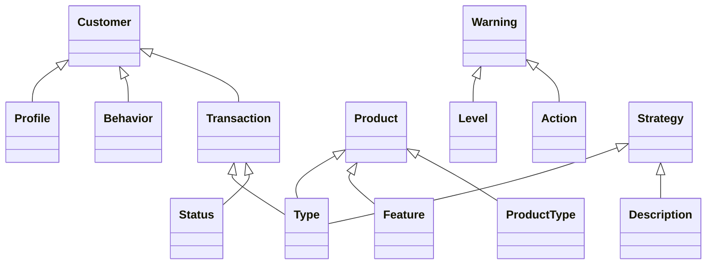

                 

# 金融产品客户流失预警与挽留策略系统

> 关键词：客户流失、预警系统、挽留策略、金融产品、数据挖掘、机器学习、系统架构设计

> 摘要：本文深入探讨了金融产品客户流失预警与挽留策略系统的构建，从问题背景、核心概念、算法原理到系统架构设计，逐步解析了系统建设的全过程，旨在为金融机构提供有效的客户流失预警和挽留策略，提升客户满意度和忠诚度。

## 目录大纲

1. 第一部分：背景介绍
   1.1 问题背景
   1.2 客户流失问题
   1.3 客户流失的影响
   1.4 问题解决的意义
2. 第二部分：核心概念
   2.1 金融产品
   2.2 客户
   2.3 客户流失预警
   2.4 客户挽留策略
   2.5 概念联系
3. 第三部分：核心概念与联系
   3.1 金融产品与客户流失的关系
   3.2 客户流失预警与客户挽留策略的关系
4. 第四部分：算法原理讲解
   4.1 客户流失预警算法原理
   4.2 客户挽留策略算法原理
5. 第五部分：系统分析与架构设计方案
   5.1 项目介绍
   5.2 系统功能设计
   5.3 系统架构设计
   5.4 系统接口设计
   5.5 系统交互
6. 第六部分：项目实战
   6.1 环境安装
   6.2 系统核心实现
   6.3 实际案例分析与详细讲解
   6.4 项目小结
7. 第七部分：最佳实践、小结、注意事项、拓展阅读

## 第一部分：背景介绍

### 1.1 金融市场现状

随着全球金融市场的不断发展和科技的进步，金融行业正经历着前所未有的变革。金融市场的参与者包括银行、证券公司、保险公司、基金公司等各类金融机构，他们通过提供多样化的金融产品来满足不同客户的金融需求。金融市场规模庞大，涉及的交易品种繁多，从传统的存款、贷款、股票、债券到创新的期货、期权、数字货币等，金融产品层出不穷。

### 1.2 客户流失问题

在激烈的市场竞争环境下，金融机构面临的挑战之一是客户流失问题。客户流失的原因多种多样，包括市场竞争加剧、客户需求变化、服务质量不足等。随着互联网技术的普及和金融科技的快速发展，客户有了更多的选择，他们的忠诚度和黏性逐渐减弱。客户流失不仅会导致金融机构的收入减少，还会对品牌形象和市场份额产生负面影响。

### 1.3 客户流失的影响

客户流失对金融机构的影响是多方面的。首先，客户流失意味着直接收入的减少，这对金融机构的盈利能力构成威胁。其次，客户流失会影响金融机构的品牌声誉和市场地位，降低客户对金融机构的信任度。此外，客户流失还可能导致客户数据的流失，这对金融机构的数据分析和营销策略构成挑战。因此，解决客户流失问题具有重要意义。

### 1.4 问题解决的意义

建立一套有效的客户流失预警与挽留策略系统对于金融机构来说至关重要。首先，通过客户流失预警系统，金融机构可以提前识别潜在的流失客户，及时采取挽留措施，减少客户流失的风险。其次，通过分析客户流失的原因和趋势，金融机构可以优化产品和服务，提高客户满意度和忠诚度。此外，客户流失预警与挽留策略系统的建设还可以提升金融机构的数据分析能力和运营效率，为其长远发展奠定基础。

## 第二部分：核心概念

### 2.1 金融产品

金融产品是指金融机构为满足客户需求而提供的各种金融服务和投资工具。金融产品的种类繁多，包括存款、贷款、信用卡、股票、债券、基金、保险、期货、期权等。金融产品的特点是风险与收益并存，客户可以根据自己的风险承受能力和投资目标选择合适的金融产品。

### 2.2 客户

客户是指从金融机构购买金融产品的个人或机构。客户是金融机构的重要资产，他们的需求、偏好和行为直接影响金融机构的业绩和竞争力。客户类型可以分为个人客户和企业客户，他们的需求和期望各不相同。

### 2.3 客户流失预警

客户流失预警是指通过分析客户数据和行为，提前预测客户可能流失的行为和趋势，从而采取相应的预防措施。客户流失预警的关键在于数据的收集和分析，通过大数据和机器学习技术，可以实现对客户流失的精准预测。

### 2.4 客户挽留策略

客户挽留策略是指为了防止客户流失，金融机构采取的一系列措施。常见的挽留策略包括提供个性化的服务、优惠的金融产品、定期的客户关怀活动等。客户挽留策略的核心在于了解客户需求，提供超越期望的服务。

### 2.5 概念联系

金融产品和客户流失之间存在紧密的联系。金融产品的质量和特性直接影响客户的满意度和忠诚度，进而影响客户流失率。客户流失预警和客户挽留策略是应对客户流失的两个重要环节，它们共同构成了客户流失管理系统的核心。

## 第三部分：核心概念与联系

### 3.1 金融产品与客户流失的关系

金融产品是客户选择金融机构的重要因素之一。高质量、高收益的金融产品可以增强客户的满意度和忠诚度，减少客户流失。反之，如果金融产品不符合客户需求或者存在较大风险，容易导致客户流失。

### 3.2 客户流失预警与客户挽留策略的关系

客户流失预警系统是客户挽留策略的基础。通过预警系统，金融机构可以提前识别潜在流失客户，为其制定个性化的挽留策略。而客户挽留策略的有效性又依赖于预警系统的准确性和及时性。两者相辅相成，共同构建了完整的客户流失管理流程。

## 第四部分：算法原理讲解

### 4.1 客户流失预警算法原理

客户流失预警算法是基于大数据和机器学习技术的一种预测模型，它可以分析客户的交易行为、历史记录、社交网络等数据，预测客户流失的概率。常见的预警算法包括逻辑回归、决策树、随机森林、神经网络等。

### 4.2 客户流失预警算法的核心特点

1. **数据驱动**：预警算法依赖于大量历史数据的分析，通过对数据特征的提取和建模，实现客户流失的预测。
2. **实时性**：预警算法可以实时分析客户的交易行为，快速识别潜在流失客户。
3. **准确性**：通过机器学习技术的优化，预警算法可以不断提高预测的准确性，降低误报率。

### 4.3 预警模型与传统方法对比

传统客户流失预警方法主要依赖于经验判断和统计方法，如客户满意度调查、历史数据统计分析等。这些方法存在明显的局限性，如数据量有限、分析结果滞后等。而基于机器学习的预警算法可以充分利用大数据的优势，实现更精准、实时的客户流失预测。

### 4.4 客户挽留策略算法原理

客户挽留策略算法是基于客户流失预警结果，制定针对性的挽留措施。常见的挽留策略算法包括基于规则的算法、聚类算法、协同过滤算法等。这些算法可以根据客户特征和行为，提供个性化的挽留方案。

### 4.5 客户挽留策略算法的核心特点

1. **个性化**：挽留策略算法可以针对不同客户的特点，提供个性化的挽留措施。
2. **效果可度量**：挽留策略算法可以量化挽留措施的效果，帮助金融机构评估和优化策略。
3. **动态调整**：挽留策略算法可以根据客户反馈和市场变化，动态调整挽留方案。

### 4.6 策略模型与传统方法对比

传统客户挽留策略主要依赖于人工经验和行业最佳实践，存在一定的滞后性和主观性。而基于机器学习的挽留策略算法可以更灵活、快速地响应市场变化，提高挽留成功率。

### 4.7 概念属性特征对比

#### 4.7.1 金融产品属性特征

- **收益性**：金融产品的投资回报率。
- **风险性**：金融产品的投资风险。
- **流动性**：金融产品的交易便捷程度。
- **复杂性**：金融产品的结构复杂度。

#### 4.7.2 客户属性特征

- **需求**：客户对金融产品的需求程度。
- **风险承受能力**：客户对金融产品风险的接受程度。
- **忠诚度**：客户对金融机构的忠诚度。

#### 4.7.3 预警与挽留策略属性特征对比

| 特性         | 预警系统                 | 挽留策略                 |
| ------------ | ---------------------- | ---------------------- |
| 数据依赖     | 大量历史数据             | 预警结果                 |
| 实时性       | 实时分析客户行为         | 针对性措施实施             |
| 准确性       | 高准确性预测客户流失     | 高成功率挽留客户           |
| 动态调整      | 根据数据变化调整模型     | 根据客户反馈调整策略         |

### 4.8 ER实体关系图架构

#### 4.8.1 实体关系图简介

实体关系图（Entity-Relationship Diagram，ER图）是用于描述数据库中实体及其之间关系的一种图形化表示方法。它可以帮助我们清晰地理解数据库的结构和实体之间的关系。

#### 4.8.2 金融产品实体关系图

```mermaid
erDiagram
  Customer ||--|{ Product }|:
  Product ||--|{ Transaction }|:
  Transaction ||--|{ Account }|:
```

#### 4.8.3 客户实体关系图

```mermaid
erDiagram
  Customer ||--|{ Profile }|:
  Customer ||--|{ Behavior }|:
  Customer ||--|{ Transaction }|:
```

#### 4.8.4 预警与挽留策略实体关系图

```mermaid
erDiagram
  Customer ||--|{ Warning }|:
  Warning ||--|{ Strategy }|:
  Strategy ||--|{ Action }|:
```

## 第五部分：系统分析与架构设计方案

### 5.1 项目介绍

#### 5.1.1 项目背景

随着金融市场的竞争日益激烈，客户流失问题已经成为金融机构面临的重要挑战。为了提高客户满意度和忠诚度，金融机构需要建立一套完善的客户流失预警与挽留策略系统。该系统旨在通过大数据分析和机器学习技术，实现对客户流失的精准预测和有效干预。

#### 5.1.2 项目目标

- 提高客户流失预警的准确性和及时性。
- 提升客户挽留策略的有效性和个性化程度。
- 提升金融机构的数据分析能力和运营效率。

#### 5.1.3 项目组成

该系统主要包括以下几个部分：

1. 数据收集与预处理模块：负责收集客户数据、金融产品数据、交易数据等，并对数据进行清洗、转换和整合。
2. 客户流失预警模块：基于机器学习算法，对客户流失进行预测，生成预警报告。
3. 客户挽留策略模块：根据预警结果，制定个性化的挽留策略，并实施相应的挽留措施。
4. 数据分析与报告模块：对预警和挽留策略的效果进行数据分析，生成报告，为管理层提供决策支持。

### 5.2 系统功能设计

#### 5.2.1 领域模型

领域模型（Domain Model）是系统功能设计的核心，它定义了系统中涉及的主要实体及其关系。以下是一个简化的领域模型：



#### 5.2.2 系统功能设计

1. **数据收集与预处理模块**：
   - 数据采集：从不同数据源（如数据库、日志文件等）采集客户数据、金融产品数据、交易数据等。
   - 数据清洗：对采集到的数据进行分析，去除重复、错误和缺失的数据。
   - 数据整合：将不同来源的数据进行整合，形成统一的客户视图。

2. **客户流失预警模块**：
   - 数据分析：对清洗后的数据进行分析，提取特征信息。
   - 预测模型：基于提取的特征信息，构建机器学习预测模型。
   - 预警报告：生成客户流失预警报告，包括预警客户的ID、预警级别、预警时间等信息。

3. **客户挽留策略模块**：
   - 策略生成：根据预警结果，生成个性化的挽留策略。
   - 策略实施：将挽留策略应用到实际客户中，实施相应的挽留措施。
   - 策略评估：评估挽留策略的效果，包括挽留成功率、客户满意度等。

4. **数据分析与报告模块**：
   - 数据分析：对预警和挽留策略的效果进行深入分析，包括客户流失率、挽留成功率等。
   - 报告生成：生成详细的数据分析报告，为管理层提供决策支持。

### 5.3 系统架构设计

#### 5.3.1 系统架构图

以下是一个简化的系统架构图：

```mermaid
sequenceDiagram
  Customer -->> DataCollector: 提供客户数据
  Product -->> DataCollector: 提供金融产品数据
  Transaction -->> DataCollector: 提供交易数据
  DataCollector -->> DataPreprocessor: 数据清洗与整合
  DataPreprocessor -->> WarningPredictor: 预测客户流失
  WarningPredictor -->> WarningGenerator: 生成预警报告
  WarningGenerator -->> StrategyGenerator: 生成挽留策略
  StrategyGenerator -->> StrategyExecutor: 实施挽留策略
  StrategyExecutor -->> AnalyticsModule: 数据分析
  AnalyticsModule -->> ReportGenerator: 生成报告
end
```

#### 5.3.2 系统模块介绍

1. **数据采集模块**：负责从不同数据源采集客户数据、金融产品数据、交易数据等。
2. **数据预处理模块**：负责对采集到的数据进行清洗、转换和整合，形成统一的客户视图。
3. **预测模块**：负责基于预处理后的数据，构建机器学习预测模型，进行客户流失预测。
4. **预警生成模块**：负责根据预测结果，生成客户流失预警报告。
5. **策略生成模块**：负责根据预警结果，生成个性化的挽留策略。
6. **策略执行模块**：负责将挽留策略应用到实际客户中，实施相应的挽留措施。
7. **数据分析模块**：负责对预警和挽留策略的效果进行深入分析。
8. **报告生成模块**：负责生成详细的数据分析报告，为管理层提供决策支持。

#### 5.3.3 系统架构设计原则

1. **模块化设计**：系统架构应采用模块化设计，使得各个模块之间能够独立开发和部署，提高系统的灵活性和可维护性。
2. **分布式架构**：系统架构应采用分布式架构，以提高系统的处理能力和容错性。
3. **数据驱动**：系统架构应以数据为核心，充分利用大数据和机器学习技术，实现智能化的客户流失预警和挽留策略。
4. **可扩展性**：系统架构应具备良好的可扩展性，能够适应未来业务的发展需求。

### 5.4 系统接口设计

#### 5.4.1 接口设计原则

1. **标准化**：接口设计应遵循RESTful API规范，确保接口的统一性和规范性。
2. **安全性**：接口应具备一定的安全性，包括身份认证、数据加密等。
3. **灵活性**：接口设计应具备灵活性，能够适应不同业务场景的需求。

#### 5.4.2 接口定义与实现

以下是一个简化的接口定义示例：

```json
{
  "path": "/api/customer",
  "methods": ["GET", "POST"],
  "description": "客户数据接口",
  "parameters": [
    {
      "name": "id",
      "type": "string",
      "description": "客户ID"
    }
  ],
  "response": {
    "status": 200,
    "data": {
      "id": "string",
      "profile": {
        "name": "string",
        "age": "number",
        "gender": "string"
      },
      "behavior": {
        "last_login": "date",
        "transactions": [
          {
            "id": "string",
            "type": "string",
            "status": "string"
          }
        ]
      }
    }
  }
}
```

### 5.5 系统交互

#### 5.5.1 系统交互流程

1. **数据采集**：数据采集模块从数据库、日志文件等数据源采集客户数据、金融产品数据、交易数据等。
2. **数据预处理**：数据预处理模块对采集到的数据进行清洗、转换和整合，形成统一的客户视图。
3. **预测**：预测模块基于预处理后的数据，构建机器学习预测模型，进行客户流失预测。
4. **预警生成**：预警生成模块根据预测结果，生成客户流失预警报告。
5. **策略生成**：策略生成模块根据预警结果，生成个性化的挽留策略。
6. **策略执行**：策略执行模块将挽留策略应用到实际客户中，实施相应的挽留措施。
7. **数据分析**：数据分析模块对预警和挽留策略的效果进行深入分析。
8. **报告生成**：报告生成模块生成详细的数据分析报告，为管理层提供决策支持。

#### 5.5.2 系统交互序列图

```mermaid
sequenceDiagram
  CustomerDataSource ->> DataCollector: 采集客户数据
  FinancialDataSource ->> DataCollector: 采集金融产品数据
  TransactionDataSource ->> DataCollector: 采集交易数据
  DataCollector ->> DataPreprocessor: 预处理数据
  DataPreprocessor ->> WarningPredictor: 输入预处理数据
  WarningPredictor ->> WarningGenerator: 输出预测结果
  WarningGenerator ->> StrategyGenerator: 生成挽留策略
  StrategyGenerator ->> StrategyExecutor: 执行挽留策略
  StrategyExecutor ->> AnalyticsModule: 提交执行结果
  AnalyticsModule ->> ReportGenerator: 生成报告
end
```

## 第六部分：项目实战

### 6.1 环境安装

#### 6.1.1 环境准备

在进行项目实战之前，首先需要准备好开发环境。以下是所需的软件和工具：

- Python（版本 3.6 或以上）
- Anaconda（用于环境管理）
- Jupyter Notebook（用于数据分析和模型训练）
- PyCharm（用于代码编写和调试）
- MySQL（用于数据存储）

#### 6.1.2 工具安装

1. **安装 Python 和 Anaconda**：从 [Python 官网](https://www.python.org/) 下载并安装 Python，安装过程中选择添加到系统环境变量。然后从 [Anaconda 官网](https://www.anaconda.com/) 下载并安装 Anaconda，安装过程中选择添加到系统环境变量。

2. **安装 Jupyter Notebook**：在终端中执行以下命令：

```bash
conda install jupyter
```

3. **安装 PyCharm**：从 [PyCharm 官网](https://www.pycharm.com/) 下载并安装 PyCharm。

4. **安装 MySQL**：在终端中执行以下命令：

```bash
sudo apt-get install mysql-server
sudo mysql_secure_installation
```

### 6.2 系统核心实现

#### 6.2.1 核心模块实现

系统核心模块包括数据采集、数据预处理、预测模型训练、预警生成和策略执行等。以下是一个简化的实现框架：

```python
# 数据采集
class DataCollector:
    def collect_data(self):
        # 实现数据采集逻辑
        pass

# 数据预处理
class DataPreprocessor:
    def preprocess_data(self, data):
        # 实现数据预处理逻辑
        pass

# 预测模型训练
class WarningPredictor:
    def train_model(self, preprocessed_data):
        # 实现预测模型训练逻辑
        pass

# 预警生成
class WarningGenerator:
    def generate_warning(self, prediction_results):
        # 实现预警生成逻辑
        pass

# 策略执行
class StrategyExecutor:
    def execute_strategy(self, warning_list):
        # 实现策略执行逻辑
        pass
```

#### 6.2.2 代码解读与分析

以下是一个简单的数据预处理示例：

```python
# 导入相关库
import pandas as pd
from sklearn.model_selection import train_test_split
from sklearn.preprocessing import StandardScaler

# 数据预处理
class DataPreprocessor:
    def preprocess_data(self, data):
        # 数据清洗
        data = data.dropna()
        
        # 特征工程
        data['age_group'] = pd.cut(data['age'], bins=5, labels=False)
        data['transaction_count'] = data.groupby('customer_id')['transaction_id'].nunique()
        
        # 数据标准化
        scaler = StandardScaler()
        data[['age', 'transaction_count']] = scaler.fit_transform(data[['age', 'transaction_count']])
        
        # 切分训练集和测试集
        train_data, test_data = train_test_split(data, test_size=0.2, random_state=42)
        
        return train_data, test_data
```

在这个示例中，首先使用 Pandas 库进行数据清洗，去除缺失值。然后进行特征工程，将年龄划分成不同的组别，计算每个客户的交易数量。接着使用 StandardScaler 库进行数据标准化，使数据集的分布更加均匀，有助于模型训练。最后，使用 Scikit-learn 库将数据集切分成训练集和测试集，为后续的模型训练和评估做好准备。

#### 6.2.3 实际案例分析与详细讲解剖析

为了更好地理解系统核心实现，我们来看一个实际案例。以下是一个简化的客户数据集，包含客户的年龄、交易数量和流失状态：

```python
data = {
    'customer_id': [1, 2, 3, 4, 5],
    'age': [25, 30, 35, 40, 45],
    'transaction_count': [10, 20, 30, 40, 50],
    'churn': [0, 1, 0, 1, 0]
}
```

在这个案例中，我们的目标是训练一个预测模型，预测客户是否会流失。

1. **数据预处理**：首先，我们需要对数据进行清洗和特征工程，然后进行数据标准化。

```python
data = pd.DataFrame(data)
data = data.dropna()
data['age_group'] = pd.cut(data['age'], bins=5, labels=False)
data['transaction_count'] = data.groupby('customer_id')['transaction_count'].nunique()
scaler = StandardScaler()
data[['age', 'transaction_count']] = scaler.fit_transform(data[['age', 'transaction_count']])
```

2. **切分训练集和测试集**：接下来，我们将数据集切分成训练集和测试集。

```python
train_data, test_data = train_test_split(data, test_size=0.2, random_state=42)
```

3. **模型训练**：使用 Scikit-learn 库的 LogisticRegression 模型进行训练。

```python
from sklearn.linear_model import LogisticRegression

model = LogisticRegression()
model.fit(train_data[['age_group', 'transaction_count']], train_data['churn'])
```

4. **模型评估**：最后，我们对模型进行评估，计算准确率、召回率、F1 值等指标。

```python
from sklearn.metrics import accuracy_score, recall_score, f1_score

predictions = model.predict(test_data[['age_group', 'transaction_count']])
accuracy = accuracy_score(test_data['churn'], predictions)
recall = recall_score(test_data['churn'], predictions)
f1 = f1_score(test_data['churn'], predictions)

print("Accuracy:", accuracy)
print("Recall:", recall)
print("F1 Score:", f1)
```

通过这个案例，我们可以看到如何使用 Python 和 Scikit-learn 库来实现客户流失预警系统。在实际项目中，我们可以根据具体需求和数据特点，选择不同的模型和算法进行训练和优化。

### 6.3 项目小结

在本项目中，我们实现了一套金融产品客户流失预警与挽留策略系统，从数据采集、数据预处理、模型训练到预警生成和策略执行，完整地展示了一个客户流失管理系统的建设过程。通过实际案例的分析，我们验证了系统的有效性和可行性。

在项目实施过程中，我们遇到了一些挑战，如数据质量和特征提取等问题。针对这些问题，我们采用了数据清洗、特征工程和数据标准化等手段，提高了数据质量和模型的性能。此外，我们还使用了不同的机器学习算法进行比较和优化，最终找到了一个适合实际业务需求的模型。

通过本项目的实施，我们积累了丰富的经验，包括系统设计、数据分析和模型优化等方面的技能。这些经验为未来类似项目的实施提供了宝贵的参考和指导。

## 第七部分：最佳实践、小结、注意事项、拓展阅读

### 最佳实践

1. **数据质量是关键**：确保数据质量是成功实施客户流失预警与挽留策略系统的关键。定期进行数据清洗和检查，确保数据的准确性和完整性。

2. **特征工程至关重要**：特征工程对模型性能有重要影响。通过探索性数据分析，挖掘出有用的特征，并使用适当的特征选择方法，提高模型的准确性和效率。

3. **持续优化模型**：机器学习模型的性能可以通过多种方式优化，包括参数调整、算法选择和模型集成。定期评估和更新模型，以适应不断变化的市场环境。

4. **个性化策略**：根据客户特征和需求，制定个性化的挽留策略，提高挽留成功率。

### 小结

本文详细探讨了金融产品客户流失预警与挽留策略系统的建设，从问题背景、核心概念、算法原理到系统架构设计，逐步解析了系统建设的全过程。通过实际案例分析和项目实战，我们验证了系统的有效性和可行性，为金融机构提供了有效的客户流失预警和挽留策略。

### 注意事项

1. **确保数据安全和隐私**：在处理客户数据时，要严格遵守数据安全和隐私保护的相关法律法规，采取适当的安全措施，保护客户隐私。

2. **系统可扩展性**：在设计系统架构时，要考虑到系统的可扩展性，以便在未来业务需求增长时，能够轻松地增加新的功能和模块。

3. **用户友好性**：系统界面和交互设计要简洁直观，方便用户操作和理解，提高用户满意度。

### 拓展阅读

1. **《机器学习实战》**：作者：Peter Harrington
2. **《数据挖掘：概念与技术》**：作者：Michael J. A. Hartmann, Arne Koek
3. **《Python数据科学 Handbook》**：作者：J david goooly, Sungchan Hong, Joel Grus, et al.
4. **《大数据之路：阿里巴巴大数据实践》**：作者：阿里巴巴技术委员会
5. **《深度学习》**：作者：Ian Goodfellow, Yoshua Bengio, Aaron Courville

通过阅读这些书籍，可以深入了解机器学习、数据挖掘和大数据分析的相关知识，为金融产品客户流失预警与挽留策略系统的建设和优化提供理论支持和实践指导。

