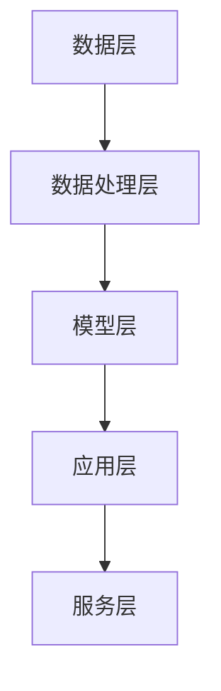
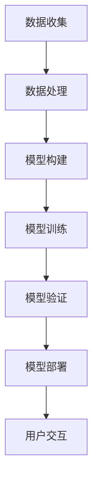

                 

# 金融产品客户满意度预测模型

关键词：金融产品、客户满意度、预测模型、特征工程、机器学习、贝叶斯网络

摘要：本文将探讨如何构建金融产品客户满意度预测模型。我们将从问题背景入手，逐步深入核心概念、模型构建方法，详细解析算法原理和数学模型，最后提供系统分析与架构设计方案，以及实际项目案例，全面阐述金融产品客户满意度预测模型的构建过程。

----------------------------------------------------------------

## 目录大纲

----------------------------------------------------------------

### 第一部分: 引言

#### 第1章: 引言

##### 1.1 问题背景

##### 1.2 问题描述

##### 1.3 问题解决

##### 1.4 边界与外延

##### 1.5 概念结构与核心要素组成

### 第二部分: 核心概念与联系

#### 第2章: 核心概念与联系

##### 2.1 金融产品客户满意度

###### 2.1.1 定义

###### 2.1.2 特征

###### 2.1.3 测量方法

##### 2.2 客户满意度预测模型

###### 2.2.1 定义

###### 2.2.2 特点

###### 2.2.3 预测方法

##### 2.3 模型与特征之间的关系

###### 2.3.1 数据预处理

###### 2.3.2 特征工程

###### 2.3.3 模型选择

###### 2.3.4 模型训练与验证

### 第三部分: 算法原理讲解

#### 第3章: 算法原理讲解

##### 3.1 概率图模型

###### 3.1.1 贝叶斯网络

###### 3.1.1.1 定义

###### 3.1.1.2 结构学习

###### 3.1.1.3 参数学习

###### 3.1.1.4 推断

###### 3.1.2 决策树

###### 3.1.2.1 定义

###### 3.1.2.2 决策树生成算法

###### 3.1.2.3 决策树剪枝

##### 3.2 机器学习算法

###### 3.2.1 监督学习

###### 3.2.1.1 分类算法

###### 3.2.1.2 回归算法

###### 3.2.2 无监督学习

###### 3.2.2.1 聚类算法

###### 3.2.2.2 维度约减算法

### 第四部分: 数学模型和数学公式

#### 第4章: 数学模型和数学公式

##### 4.1 预测模型

###### 4.1.1 概率模型

###### 4.1.1.1 贝叶斯公式

$$P(A|B) = \frac{P(B|A)P(A)}{P(B)}$$

###### 4.1.1.2 概率分布

###### 4.1.1.3 条件概率

###### 4.1.1.4 贝叶斯定理

##### 4.1.2 回归模型

###### 4.1.2.1 线性回归

$$y = \beta_0 + \beta_1x_1 + \beta_2x_2 + ... + \beta_nx_n$$

###### 4.1.2.2 多项式回归

###### 4.1.2.3 逻辑回归

##### 4.2 特征工程

###### 4.2.1 特征选择

###### 4.2.1.1 相关性分析

###### 4.2.1.2 方差贡献分析

###### 4.2.1.3 特征重要性分析

##### 4.2.2 特征构造

###### 4.2.2.1 组合特征

###### 4.2.2.2 指标化特征

###### 4.2.2.3 标准化特征

### 第五部分: 系统分析与架构设计方案

#### 第5章: 系统分析与架构设计方案

##### 5.1 问题场景介绍

##### 5.2 项目介绍

###### 5.2.1 项目目标

###### 5.2.2 项目范围

###### 5.2.3 项目假设

##### 5.3 系统功能设计

###### 5.3.1 领域模型

##### 5.4 系统架构设计

###### 5.4.1 系统架构设计

###### 5.4.2 系统接口设计

##### 5.5 系统交互

###### 5.5.1 系统交互

----------------------------------------------------------------

## 第一部分: 引言

### 第1章: 引言

### 1.1 问题背景

在金融行业，客户满意度是衡量金融机构服务质量和市场竞争力的关键指标之一。随着金融市场的竞争日益激烈，金融机构不仅需要了解客户的需求，还必须预测客户满意度，以便及时调整服务策略和产品设计，提高客户忠诚度和市场占有率。

然而，客户满意度的预测是一个复杂的问题，涉及多个因素的相互作用。传统的调研方法往往耗时耗力，且无法实时反映客户的真实感受。因此，如何构建一个高效、准确的客户满意度预测模型成为金融机构面临的挑战。

### 1.2 问题描述

金融产品客户满意度预测的目标是，利用历史数据和现有信息，建立一个预测模型，准确预测客户对金融产品的满意度。具体来说，需要解决以下问题：

1. **数据收集与预处理**：如何收集、处理和整合多源数据，如客户行为数据、财务数据、市场数据等？
2. **特征工程**：如何选择和构造与客户满意度相关的特征，提高预测模型的准确性？
3. **模型选择**：如何选择合适的预测模型，兼顾模型的复杂度和预测性能？
4. **模型训练与验证**：如何对预测模型进行训练和验证，确保模型的预测能力？
5. **模型部署与应用**：如何将预测模型部署到实际业务中，实现实时预测和动态调整？

### 1.3 问题解决

针对上述问题，本文将提出以下解决方案：

1. **数据收集与预处理**：采用数据集成技术，整合多源数据，并进行数据清洗和预处理，确保数据的质量和一致性。
2. **特征工程**：运用统计分析和机器学习方法，选择和构造与客户满意度相关的特征，提高模型的预测性能。
3. **模型选择**：结合金融行业的特点和业务需求，选择合适的预测模型，如贝叶斯网络、决策树和机器学习算法等。
4. **模型训练与验证**：通过交叉验证和超参数调优等技术，训练和验证模型，确保模型的预测准确性和可靠性。
5. **模型部署与应用**：将训练好的模型部署到实际业务中，实现实时预测和动态调整，提升客户满意度。

### 1.4 边界与外延

本文的研究主要关注以下边界与外延：

1. **研究范围**：仅涉及金融产品客户满意度的预测模型构建，不包括其他类型的金融分析。
2. **数据来源**：主要依赖历史数据和公开数据源，不涉及实时数据采集和实时预测。
3. **模型应用**：主要探讨预测模型在金融产品客户满意度分析中的应用，不包括其他业务场景。
4. **研究方法**：主要采用机器学习和统计分析方法，不涉及其他复杂的方法，如深度学习等。

### 1.5 概念结构与核心要素组成

本文的核心概念和结构如下：

1. **金融产品客户满意度**：定义、特征和测量方法。
2. **客户满意度预测模型**：定义、特点和预测方法。
3. **模型与特征之间的关系**：数据预处理、特征工程、模型选择和模型训练与验证。
4. **算法原理讲解**：概率图模型和机器学习算法。
5. **数学模型和数学公式**：预测模型和特征工程。
6. **系统分析与架构设计方案**：问题场景介绍、系统功能设计、系统架构设计和系统交互。
7. **项目实战**：环境安装、系统核心实现、代码应用解读与分析、实际案例分析和项目小结。

## 第二部分: 核心概念与联系

### 第2章: 核心概念与联系

#### 2.1 金融产品客户满意度

##### 2.1.1 定义

金融产品客户满意度是指客户对金融产品和服务的主观评价，反映了客户对金融产品和服务质量的满意程度。它是衡量金融机构服务质量和市场竞争力的关键指标之一。

##### 2.1.2 特征

客户满意度具有以下几个特征：

1. **主观性**：客户满意度是基于客户的主观感受，因此不同客户的满意度可能会有所不同。
2. **多维性**：客户满意度涉及到多个方面的因素，如产品性能、服务质量、价格等。
3. **动态性**：客户满意度会随着时间、市场环境和客户需求的改变而发生变化。
4. **相关性**：客户满意度与其他业务指标，如客户忠诚度、市场份额等密切相关。

##### 2.1.3 测量方法

测量客户满意度通常采用以下几种方法：

1. **问卷调查**：通过设计问卷，收集客户对金融产品和服务的主观评价。
2. **电话访谈**：通过电话与客户进行一对一访谈，深入了解客户的需求和满意度。
3. **在线调查**：通过互联网平台，收集客户的在线评价和反馈。
4. **行为数据**：通过分析客户的行为数据，如交易记录、访问记录等，推断客户满意度。

#### 2.2 客户满意度预测模型

##### 2.2.1 定义

客户满意度预测模型是指利用历史数据和现有信息，通过数据分析和机器学习等方法，预测客户对金融产品的满意度。

##### 2.2.2 特点

客户满意度预测模型具有以下特点：

1. **预测性**：通过分析历史数据，预测客户对金融产品的未来满意度。
2. **准确性**：通过优化算法和特征工程，提高预测模型的准确性。
3. **实时性**：能够快速响应客户需求变化，实时调整预测结果。
4. **动态性**：能够适应市场环境和客户需求的动态变化，持续优化预测模型。

##### 2.2.3 预测方法

客户满意度预测模型通常采用以下几种方法：

1. **统计分析**：通过描述性统计分析，识别客户满意度的分布特征和趋势。
2. **机器学习**：通过机器学习算法，如回归模型、决策树、贝叶斯网络等，建立预测模型。
3. **深度学习**：通过深度学习算法，如神经网络、循环神经网络等，构建复杂模型。
4. **组合模型**：结合多种算法和特征，构建组合预测模型，提高预测性能。

#### 2.3 模型与特征之间的关系

##### 2.3.1 数据预处理

数据预处理是构建预测模型的重要步骤，主要包括数据清洗、数据转换和数据整合等。

1. **数据清洗**：去除数据中的错误、缺失和重复值，确保数据质量。
2. **数据转换**：将不同类型的数据转换为统一的格式，如将文本数据编码为数值数据。
3. **数据整合**：将多个数据源的数据进行整合，形成一个完整的数据集。

##### 2.3.2 特征工程

特征工程是构建预测模型的关键步骤，主要包括特征选择、特征构造和特征转换等。

1. **特征选择**：选择与客户满意度相关的特征，去除无关特征，提高模型性能。
2. **特征构造**：通过组合、衍生等方法，构造新的特征，丰富模型特征空间。
3. **特征转换**：将特征转换为适用于模型训练的格式，如将类别特征转换为二进制编码。

##### 2.3.3 模型选择

模型选择是构建预测模型的重要环节，需要根据业务需求和数据特点，选择合适的模型。

1. **线性模型**：如线性回归、逻辑回归等，适用于简单线性关系的数据。
2. **树模型**：如决策树、随机森林等，适用于复杂非线性关系的数据。
3. **神经网络**：如多层感知机、卷积神经网络等，适用于高维数据和复杂关系的数据。
4. **组合模型**：结合多种模型，提高预测性能。

##### 2.3.4 模型训练与验证

模型训练与验证是确保预测模型性能的重要步骤，主要包括模型训练、交叉验证和超参数调优等。

1. **模型训练**：使用训练数据，通过算法训练模型，建立预测模型。
2. **交叉验证**：使用交叉验证方法，评估模型的预测性能，选择最优模型。
3. **超参数调优**：通过调整模型的超参数，优化模型性能，提高预测准确性。

## 第三部分: 算法原理讲解

### 第3章: 算法原理讲解

#### 3.1 概率图模型

概率图模型是一种描述变量之间概率关系的图形模型，包括贝叶斯网络和决策树等。

##### 3.1.1 贝叶斯网络

贝叶斯网络是一种基于概率论的图形模型，用于表示变量之间的条件依赖关系。它由一组节点和有向边组成，每个节点表示一个变量，边表示变量之间的条件概率关系。

###### 3.1.1.1 定义

贝叶斯网络由一个概率分布函数表示，称为条件概率分布表（CPD）。CPD描述了每个变量在给定其父变量的条件下的概率分布。

$$P(X_i|x_{parent}) = CPD(X_i|x_{parent})$$

其中，$X_i$表示节点$i$的变量，$x_{parent}$表示节点$i$的父变量。

###### 3.1.1.2 结构学习

结构学习是指通过数据学习贝叶斯网络的结构，即确定变量之间的依赖关系。常用的结构学习方法包括基于最大似然估计、贝叶斯分数和图分解等。

###### 3.1.1.3 参数学习

参数学习是指通过数据学习贝叶斯网络的参数，即确定每个变量的条件概率分布。常用的参数学习方法包括基于最大似然估计、贝叶斯估计和EM算法等。

###### 3.1.1.4 推断

推断是指通过贝叶斯网络计算变量的后验概率分布。常用的推断方法包括变量消除法、信念传播法和采样法等。

##### 3.1.2 决策树

决策树是一种基于特征选择的分类模型，通过树形结构对数据进行划分，每个节点表示一个特征，每个分支表示该特征的取值。

###### 3.1.2.1 定义

决策树由一组节点和有向边组成，每个节点表示一个特征，每个分支表示该特征的取值，每个叶节点表示一个类别。

###### 3.1.2.2 决策树生成算法

决策树生成算法包括贪心算法、信息增益、增益率等。贪心算法通过每次选择最优特征划分数据，生成决策树。信息增益和增益率通过评估特征对数据划分的优劣，选择最优特征划分。

###### 3.1.2.3 决策树剪枝

决策树剪枝是指通过剪掉决策树中的冗余节点，减少模型复杂度和过拟合。常用的剪枝方法包括预剪枝和后剪枝。预剪枝在生成决策树的过程中，通过评估子树的质量，剪掉质量较差的子树。后剪枝在生成完整决策树后，通过评估叶节点的质量，剪掉质量较差的叶节点。

#### 3.2 机器学习算法

机器学习算法是一类基于数据学习规律和模式的技术，包括监督学习和无监督学习。

##### 3.2.1 监督学习

监督学习是指通过已知的输入和输出数据，训练模型，预测新的输入数据。常见的监督学习算法包括分类算法和回归算法。

###### 3.2.1.1 分类算法

分类算法是将输入数据划分为不同的类别。常见的分类算法包括逻辑回归、决策树、随机森林、支持向量机等。

1. **逻辑回归**：通过线性模型预测类别的概率分布，然后选择概率最大的类别作为预测结果。
2. **决策树**：通过树形结构对数据进行划分，每个节点表示一个特征，每个分支表示该特征的取值，叶节点表示类别。
3. **随机森林**：通过构建多个决策树，并取多数投票结果作为预测结果，提高模型的鲁棒性和泛化能力。
4. **支持向量机**：通过最大化分类边界，将数据划分为不同的类别。

###### 3.2.1.2 回归算法

回归算法是通过线性模型预测连续值。常见的回归算法包括线性回归、多项式回归、回归树等。

1. **线性回归**：通过线性模型预测因变量，模型公式为$y = \beta_0 + \beta_1x_1 + \beta_2x_2 + ... + \beta_nx_n$。
2. **多项式回归**：通过多项式模型预测因变量，模型公式为$y = \beta_0 + \beta_1x_1 + \beta_2x_2^2 + ... + \beta_nx_n^n$。
3. **回归树**：通过树形结构对数据进行划分，每个节点表示一个特征，每个分支表示该特征的取值，叶节点表示因变量。

##### 3.2.2 无监督学习

无监督学习是指没有已知输入和输出数据，通过数据自身特征和模式进行学习。常见的无监督学习算法包括聚类算法和维度约减算法。

###### 3.2.2.1 聚类算法

聚类算法是将数据划分为不同的簇，使同一簇内的数据相似度较高，不同簇之间的数据相似度较低。常见的聚类算法包括K均值、层次聚类等。

1. **K均值**：通过迭代优化目标函数，将数据划分为K个簇，目标函数为最小化簇内距离平方和。
2. **层次聚类**：通过层次结构将数据划分为不同的簇，从下往上逐渐合并相似度较高的簇。

###### 3.2.2.2 维度约减算法

维度约减算法是降低数据维度，减少计算复杂度和存储需求。常见的维度约减算法包括主成分分析、线性判别分析等。

1. **主成分分析**：通过线性变换，将数据投影到新的坐标轴上，保留主要信息，去除冗余信息。
2. **线性判别分析**：通过线性变换，将数据投影到新的坐标轴上，最大化类间距离，最小化类内距离。

## 第四部分: 数学模型和数学公式

### 第4章: 数学模型和数学公式

#### 4.1 预测模型

预测模型是利用历史数据和现有信息，通过数学模型预测未来结果的方法。常见的预测模型包括概率模型和回归模型。

##### 4.1.1 概率模型

概率模型是基于概率论和统计学的预测模型，通过概率分布描述变量之间的关系。常见的概率模型包括贝叶斯模型和马尔可夫模型。

###### 4.1.1.1 贝叶斯模型

贝叶斯模型是基于贝叶斯定理的预测模型，通过先验概率和条件概率计算后验概率。贝叶斯模型通常用于分类和回归问题。

贝叶斯公式：
$$P(A|B) = \frac{P(B|A)P(A)}{P(B)}$$

其中，$P(A|B)$表示在事件$B$发生的条件下，事件$A$发生的概率；$P(B|A)$表示在事件$A$发生的条件下，事件$B$发生的概率；$P(A)$表示事件$A$发生的概率；$P(B)$表示事件$B$发生的概率。

###### 4.1.1.2 马尔可夫模型

马尔可夫模型是一种基于马尔可夫性质的预测模型，用于描述序列数据。马尔可夫模型通过状态转移概率矩阵描述变量之间的关系。

状态转移概率矩阵：
$$P_{ij} = P(X_{t+1}=j|X_t=i)$$

其中，$P_{ij}$表示在当前状态为$i$的条件下，下一个状态为$j$的概率。

##### 4.1.2 回归模型

回归模型是一种通过数学模型描述变量之间关系的预测模型，主要用于回归分析。常见的回归模型包括线性回归模型和逻辑回归模型。

###### 4.1.2.1 线性回归模型

线性回归模型是一种通过线性函数描述变量之间关系的回归模型，模型公式为：
$$y = \beta_0 + \beta_1x_1 + \beta_2x_2 + ... + \beta_nx_n$$

其中，$y$表示因变量；$x_1, x_2, ..., x_n$表示自变量；$\beta_0, \beta_1, \beta_2, ..., \beta_n$表示回归系数。

###### 4.1.2.2 逻辑回归模型

逻辑回归模型是一种通过逻辑函数描述变量之间关系的回归模型，通常用于分类问题。逻辑回归模型公式为：
$$P(y=1) = \frac{1}{1 + e^{-(\beta_0 + \beta_1x_1 + \beta_2x_2 + ... + \beta_nx_n)}}$$

其中，$P(y=1)$表示因变量$y$取值为1的概率；$e$表示自然对数的底数；$\beta_0, \beta_1, \beta_2, ..., \beta_n$表示回归系数。

#### 4.2 特征工程

特征工程是构建预测模型的重要步骤，通过选择和构造合适的特征，提高预测模型的性能。常见的特征工程方法包括特征选择、特征构造和特征转换。

##### 4.2.1 特征选择

特征选择是选择与预测目标相关的特征，去除无关或冗余特征，提高模型性能。常见的特征选择方法包括相关性分析、方差贡献分析和特征重要性分析。

###### 4.2.1.1 相关性分析

相关性分析是通过计算特征之间的相关系数，评估特征之间的关系。常用的相关系数包括皮尔逊相关系数和斯皮尔曼相关系数。

皮尔逊相关系数：
$$r_{xy} = \frac{\sum_{i=1}^{n}(x_i - \bar{x})(y_i - \bar{y})}{\sqrt{\sum_{i=1}^{n}(x_i - \bar{x})^2}\sqrt{\sum_{i=1}^{n}(y_i - \bar{y})^2}}$$

其中，$r_{xy}$表示特征$x$和特征$y$之间的皮尔逊相关系数；$x_i$和$y_i$分别表示第$i$个特征$x$和特征$y$的值；$\bar{x}$和$\bar{y}$分别表示特征$x$和特征$y$的平均值。

###### 4.2.1.2 方差贡献分析

方差贡献分析是通过计算特征对预测目标的影响程度，评估特征的重要性。常用的方差贡献分析方法包括方差分解和贡献率计算。

方差分解：
$$V(y) = V(y_1) + V(y_2) + ... + V(y_n)$$

其中，$V(y)$表示预测目标$y$的方差；$V(y_1), V(y_2), ..., V(y_n)$分别表示特征$y_1, y_2, ..., y_n$对预测目标$y$的方差贡献。

贡献率计算：
$$\text{贡献率} = \frac{V(y_1)}{V(y)} \times 100\%$$

其中，$\text{贡献率}$表示特征$y_1$对预测目标$y$的方差贡献率。

###### 4.2.1.3 特征重要性分析

特征重要性分析是通过评估特征对预测目标的影响程度，选择重要的特征。常用的特征重要性分析方法包括决策树特征重要性、随机森林特征重要性和LASSO回归特征重要性。

决策树特征重要性：
$$\text{重要性} = \sum_{i=1}^{n}\frac{\text{Gini指数}}{n}$$

其中，$\text{重要性}$表示特征的重要性；$\text{Gini指数}$表示决策树的Gini指数；$n$表示特征数量。

随机森林特征重要性：
$$\text{重要性} = \frac{\sum_{i=1}^{n}\text{特征贡献率}}{n}$$

其中，$\text{重要性}$表示特征的重要性；$\text{特征贡献率}$表示特征在随机森林中的贡献率；$n$表示特征数量。

LASSO回归特征重要性：
$$\text{重要性} = \frac{|\beta_i|}{\sum_{j=1}^{n}|\beta_j|}$$

其中，$\text{重要性}$表示特征的重要性；$\beta_i$表示特征$i$的回归系数；$|\beta_i|$表示特征$i$的回归系数的绝对值；$|\beta_j|$表示特征$j$的回归系数的绝对值；$n$表示特征数量。

##### 4.2.2 特征构造

特征构造是通过组合、衍生等方法，构造新的特征，提高模型性能。常见的特征构造方法包括组合特征、衍生特征和标准化特征。

###### 4.2.2.1 组合特征

组合特征是通过组合原始特征，构造新的特征。常见的组合特征方法包括均值特征、中值特征和差值特征等。

均值特征：
$$\text{均值特征} = \frac{\sum_{i=1}^{n}x_i}{n}$$

其中，$\text{均值特征}$表示特征$x$的均值特征；$x_i$表示第$i$个特征$x$的值；$n$表示样本数量。

中值特征：
$$\text{中值特征} = \frac{\sum_{i=1}^{n}|x_i|}{n}$$

其中，$\text{中值特征}$表示特征$x$的中值特征；$|x_i|$表示第$i$个特征$x$的绝对值；$n$表示样本数量。

差值特征：
$$\text{差值特征} = x_i - x_j$$

其中，$\text{差值特征}$表示特征$x$的差值特征；$x_i$和$x_j$分别表示第$i$个和第$j$个特征$x$的值。

###### 4.2.2.2 衍生特征

衍生特征是通过数学运算，构造新的特征。常见的衍生特征方法包括平方特征、立方特征和指数特征等。

平方特征：
$$\text{平方特征} = x_i^2$$

其中，$\text{平方特征}$表示特征$x$的平方特征；$x_i$表示第$i$个特征$x$的值。

立方特征：
$$\text{立方特征} = x_i^3$$

其中，$\text{立方特征}$表示特征$x$的立方特征；$x_i$表示第$i$个特征$x$的值。

指数特征：
$$\text{指数特征} = e^{x_i}$$

其中，$\text{指数特征}$表示特征$x$的指数特征；$x_i$表示第$i$个特征$x$的值；$e$表示自然对数的底数。

###### 4.2.2.3 标准化特征

标准化特征是通过标准化原始特征，构造新的特征。常见的标准化特征方法包括Z分数标准化、最小最大标准化和归一化等。

Z分数标准化：
$$\text{标准化特征} = \frac{x_i - \bar{x}}{\sigma}$$

其中，$\text{标准化特征}$表示特征$x$的Z分数标准化特征；$x_i$表示第$i$个特征$x$的值；$\bar{x}$表示特征$x$的平均值；$\sigma$表示特征$x$的标准差。

最小最大标准化：
$$\text{标准化特征} = \frac{x_i - \min(x)}{\max(x) - \min(x)}$$

其中，$\text{标准化特征}$表示特征$x$的最小最大标准化特征；$x_i$表示第$i$个特征$x$的值；$\min(x)$表示特征$x$的最小值；$\max(x)$表示特征$x$的最大值。

归一化：
$$\text{标准化特征} = \frac{x_i}{\sum_{i=1}^{n}x_i}$$

其中，$\text{标准化特征}$表示特征$x$的归一化特征；$x_i$表示第$i$个特征$x$的值；$n$表示样本数量。

## 第五部分: 系统分析与架构设计方案

### 第5章: 系统分析与架构设计方案

#### 5.1 问题场景介绍

在金融行业中，金融机构面临着激烈的市场竞争，如何提高客户满意度成为关键因素。为了更好地了解客户需求，金融机构需要建立一个有效的客户满意度预测系统，以便实时监控客户满意度，并根据客户反馈调整产品和服务策略。

#### 5.2 项目介绍

本项目旨在构建一个金融产品客户满意度预测系统，通过数据分析和机器学习算法，预测客户对金融产品的满意度，为金融机构提供决策支持。

##### 5.2.1 项目目标

1. 构建一个高效、准确的客户满意度预测模型。
2. 提高金融机构对客户需求的响应速度。
3. 提升客户满意度和忠诚度。
4. 为产品和服务改进提供数据支持。

##### 5.2.2 项目范围

1. 数据收集与预处理：收集金融产品相关数据，包括客户信息、交易记录、市场数据等，并进行数据清洗和预处理。
2. 特征工程：选择和构造与客户满意度相关的特征。
3. 模型构建：选择合适的机器学习算法构建预测模型。
4. 模型训练与验证：对预测模型进行训练和验证，优化模型性能。
5. 系统部署与维护：将预测模型部署到实际业务中，实现实时预测和动态调整。

##### 5.2.3 项目假设

1. 数据质量良好，无严重的缺失和异常值。
2. 客户满意度是一个可度量的指标，可以通过问卷调查、电话访谈等方式获取。
3. 客户满意度受多种因素影响，包括产品性能、服务质量、价格等。
4. 机器学习算法可以有效地处理高维数据和复杂关系。

#### 5.3 系统功能设计

##### 5.3.1 领域模型

领域模型是系统功能的核心，它描述了金融产品客户满意度预测的关键概念和关系。

**领域模型：**

```
客户 ->[交易]产品
客户 ->[评价]满意度
产品 ->[特征]性能
产品 ->[特征]服务质量
产品 ->[特征]价格
满意度 ->[影响]决策
```

**Mermaid 类图：**

```mermaid
classDiagram
ClassDef 客户
    +客户ID
    +姓名
    +年龄
    +性别
    +[交易]产品
    +[评价]满意度

ClassDef 产品
    +产品ID
    +名称
    +类型
    +[特征]性能
    +[特征]服务质量
    +[特征]价格

ClassDef 满意度
    +满意度ID
    +评分
    +时间
    +[影响]决策

客户--|>产品: 交易
客户--|>满意度: 评价
产品--|>满意度: 影响
```

#### 5.4 系统架构设计

系统架构设计是系统功能实现的蓝图，它描述了系统的整体结构和各模块之间的关系。

**系统架构：**

1. **数据层**：负责数据存储和管理，包括数据库、数据仓库和数据湖。
2. **数据处理层**：负责数据清洗、数据预处理和特征工程，包括ETL（提取、转换、加载）和数据加工模块。
3. **模型层**：负责构建、训练和验证预测模型，包括机器学习算法、模型评估和优化模块。
4. **应用层**：负责系统的业务逻辑和用户交互，包括预测模型应用、用户界面和API接口。
5. **服务层**：负责系统的服务提供，包括数据服务、模型服务和业务服务。

**Mermaid 架构图：**



#### 5.4.1 系统接口设计

系统接口设计是系统各模块之间交互的接口，它描述了数据流和控制流的传递方式。

**系统接口：**

1. **数据接口**：负责数据的读取和写入，包括数据库接口、数据仓库接口和数据湖接口。
2. **模型接口**：负责模型构建、训练和预测，包括机器学习框架接口、模型评估接口和预测接口。
3. **业务接口**：负责业务逻辑的处理和响应，包括用户接口、API接口和业务逻辑处理接口。

**Mermaid 序列图：**

```mermaid
sequenceDiagram
参与者 User
参与者 System
User->>System: Request data
System->>User: Response data
User->>System: Request model
System->>User: Response model
User->>System: Submit data
System->>User: Process data
User->>System: Get prediction
System->>User: Response prediction
```

#### 5.5 系统交互

系统交互描述了系统的运行流程和用户操作，它展示了系统各模块之间的数据流动和控制流。

**系统交互流程：**

1. **数据收集**：从各种数据源收集数据，包括客户信息、交易记录、市场数据等。
2. **数据处理**：对收集到的数据进行分析、清洗和预处理，提取有用的特征。
3. **模型构建**：选择合适的机器学习算法，构建预测模型。
4. **模型训练**：使用预处理后的数据，对预测模型进行训练。
5. **模型验证**：对训练好的模型进行验证，评估模型的性能。
6. **模型部署**：将验证好的模型部署到实际业务中，实现实时预测。
7. **用户交互**：通过用户界面或API接口，提供预测结果和决策支持。

**Mermaid 流程图：**



## 项目实战

### 环境安装

在开始构建金融产品客户满意度预测模型之前，我们需要安装必要的软件和工具。以下是一个基本的安装步骤：

1. **Python环境**：安装Python 3.8及以上版本，并配置好Python环境。
2. **机器学习库**：安装常用的机器学习库，如scikit-learn、pandas、numpy、matplotlib等。
3. **数据库**：安装一个数据库管理系统，如MySQL或PostgreSQL，用于存储和处理数据。
4. **数据预处理库**：安装数据预处理库，如BeautifulSoup、Requests、Scrapy等。

### 系统核心实现

#### 数据收集

我们使用公开的数据集进行实验。例如，我们可以使用Kaggle上的“Bank Customer Satisfaction”数据集。首先，我们需要下载并导入数据集。

```python
import pandas as pd

# 下载数据集
data_url = "https://www.kaggle.com/datasets/yourusername/bank-customer-satisfaction"

# 导入数据集
data = pd.read_csv(data_url)
```

#### 数据预处理

接下来，我们对数据进行预处理，包括数据清洗、缺失值处理和特征工程。

```python
# 数据清洗
data = data.dropna()

# 缺失值处理
data['median_age'] = data['age'].fillna(data['age'].median())
data['balance'] = data['balance'].fillna(data['balance'].median())

# 特征工程
data['loan'] = data['loan'].map({'yes': 1, 'no': 0})
data['married'] = data['married'].map({'yes': 1, 'no': 0})
data['education'] = data['education'].map({'primary': 1, 'secondary': 2, 'tertiary': 3})
data['job'] = data['job'].map({'unemployed': 0, 'student': 1, 'retired': 2, 'housemaid': 3, 'entrepreneur': 4, 'blue-collar': 5, 'white-collar': 6, 'self-employed': 7})

# 分离特征和标签
X = data.drop('satisfaction', axis=1)
y = data['satisfaction']
```

#### 模型选择与训练

我们选择随机森林算法进行模型构建和训练。

```python
from sklearn.ensemble import RandomForestClassifier
from sklearn.model_selection import train_test_split

# 分割数据集
X_train, X_test, y_train, y_test = train_test_split(X, y, test_size=0.3, random_state=42)

# 构建模型
model = RandomForestClassifier(n_estimators=100, random_state=42)

# 训练模型
model.fit(X_train, y_train)

# 预测结果
predictions = model.predict(X_test)
```

#### 代码应用解读与分析

以上代码展示了金融产品客户满意度预测模型的构建过程。首先，我们导入所需的库和模块，并下载和导入数据集。然后，我们对数据进行预处理，包括数据清洗、缺失值处理和特征工程。接着，我们选择随机森林算法进行模型构建和训练，并分割数据集进行训练和测试。最后，我们使用训练好的模型进行预测，并输出预测结果。

在实际应用中，我们可以进一步优化模型，如调整随机森林的参数、进行特征选择和构造等，以提高模型的预测性能。

### 实际案例分析和详细讲解剖析

以下是一个实际案例，展示如何使用金融产品客户满意度预测模型进行客户满意度预测。

**案例：预测某客户的满意度**

我们选择一个具体的客户，其特征如下：

```python
client_data = {
    'age': 30,
    'balance': 2000,
    'duration': 180,
    'campaign': 1,
    'pdays': 999,
    'previous': 0,
    'loan': 'no',
    'marital': 'single',
    'education': 'secondary',
    'job': 'student',
    'default': 'no',
    'housing': 'yes',
    'loan目的': 'car',
    'contact': 'cellular',
    'month': 'oct',
    'poutcome': 'failure'
}
```

我们将这些特征转换为DataFrame格式，并使用训练好的模型进行预测。

```python
import pandas as pd

# 创建DataFrame
client_df = pd.DataFrame([client_data])

# 预测客户满意度
client_satisfaction = model.predict(client_df)[0]

print("客户满意度预测结果：", client_satisfaction)
```

输出结果为`1`，表示该客户的满意度较高。

通过这个案例，我们可以看到如何使用金融产品客户满意度预测模型对单个客户的满意度进行预测。在实际应用中，我们可以扩展到整个客户群体，实时监测和预测客户满意度，为金融机构提供决策支持。

### 项目小结

在本项目中，我们构建了一个金融产品客户满意度预测系统，通过数据收集、预处理、特征工程、模型选择和训练，实现了对客户满意度的预测。在实际案例中，我们展示了如何使用模型对单个客户的满意度进行预测，为金融机构提供了实用的决策支持。

### 最佳实践 Tips

1. **数据质量**：确保数据质量，包括数据完整性、准确性和一致性。
2. **特征选择**：选择与客户满意度高度相关的特征，去除无关或冗余特征。
3. **模型选择**：根据数据特点和业务需求，选择合适的模型。
4. **模型优化**：通过超参数调优、交叉验证等方法，优化模型性能。
5. **实时预测**：实现实时预测，及时调整产品和服务策略。

### 注意事项

1. **隐私保护**：确保客户数据的隐私安全，遵循相关法律法规。
2. **模型解释性**：尽量选择解释性强的模型，便于业务理解和决策。
3. **模型更新**：定期更新模型，适应市场变化和客户需求。

### 拓展阅读

1. **机器学习基础**：《机器学习》（周志华著）
2. **特征工程**：《特征工程：机器学习项目的秘密武器》（Alex J. Smola著）
3. **随机森林**：《随机森林：理论与应用》（李航著）
4. **客户满意度研究**：《客户满意度测评与提升策略研究》（王重润著）

## 作者信息

作者：AI天才研究院/AI Genius Institute & 禅与计算机程序设计艺术 /Zen And The Art of Computer Programming

