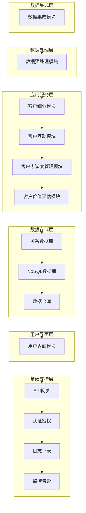
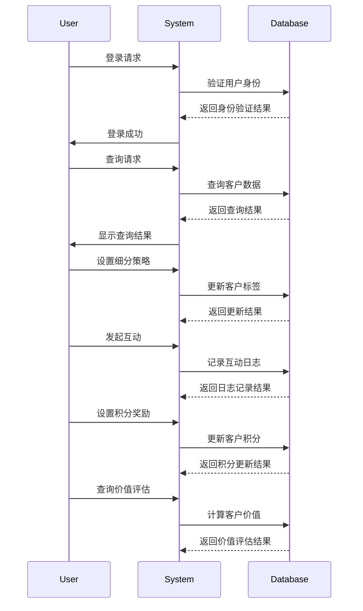

                 

### 1.1 问题背景

在现代金融行业，客户的生命周期管理成为了企业竞争的关键因素。金融产品种类繁多，包括银行储蓄、投资理财、保险、信用卡等，每种产品都有其独特的生命周期特征和客户需求。客户的生命周期管理涉及客户从初次接触、开户、产品使用、升级、维护到最终离世的整个过程。这一过程不仅仅是金融产品的销售和服务，更是与客户建立长期稳定关系的策略。

#### 1.1.1 金融产品与客户生命周期

金融产品的生命周期通常可以分为五个阶段：引入期、成长期、成熟期、衰退期和衰退后期。在引入期，新产品刚刚推出，客户对产品的认知有限，推广和营销成本较高，但市场潜力巨大。成长期是产品快速发展阶段，客户数量迅速增加，市场份额逐渐扩大。成熟期则是产品生命周期中的稳定期，客户需求基本饱和，市场竞争激烈，企业需要通过差异化服务和产品创新来维持市场份额。衰退期和衰退后期则是产品逐渐被市场淘汰的阶段，企业需要采取适当的策略来延长产品生命周期或逐步退出市场。

#### 1.1.2 客户生命周期管理的重要性

客户生命周期管理的重要性体现在以下几个方面：

1. **提升客户满意度**：通过精准的营销和服务，满足客户在各个生命周期阶段的需求，提升客户满意度和忠诚度。
2. **优化资源配置**：企业可以根据客户生命周期的不同阶段，合理配置资源和营销预算，提高资源利用效率。
3. **提高盈利能力**：通过有效的客户生命周期管理，可以降低客户获取成本，增加客户生命周期价值，提高企业盈利能力。
4. **增强竞争力**：通过数据分析和个性化服务，企业可以更好地理解客户需求，推出更符合市场趋势的产品，增强市场竞争力。

#### 1.1.3 现有管理方式的挑战与不足

尽管客户生命周期管理在金融行业中备受重视，但现有管理方式仍然存在以下挑战和不足：

1. **数据孤岛**：金融产品和服务往往分布在不同的系统和部门，数据无法统一管理和分析，导致客户信息的碎片化。
2. **响应速度慢**：传统管理方式依赖于人工处理，响应速度较慢，难以及时满足客户需求。
3. **缺乏个性化服务**：现有系统无法根据客户的历史行为和偏好提供个性化服务，导致客户体验不佳。
4. **无法预测未来需求**：现有管理方式难以预测客户未来的需求变化，导致企业无法提前做好准备。

综上所述，建立一个高效、智能的金融产品客户生命周期管理平台，已经成为金融企业提升竞争力的迫切需求。下一节，我们将对客户生命周期管理平台的核心概念进行详细阐述。

### 1.2 核心概念

#### 1.2.1 金融产品客户生命周期管理平台定义

金融产品客户生命周期管理平台（Customer Lifecycle Management Platform, CLMP）是一种集成了客户关系管理（CRM）、数据分析、营销自动化等功能的综合性平台。它旨在通过自动化和智能化手段，帮助企业全方位管理和优化客户的生命周期，从而提升客户满意度和企业盈利能力。

#### 1.2.2 客户生命周期管理的核心概念

1. **客户细分**：根据客户的行为特征、需求偏好和购买力等，将客户划分为不同的群体，以便实施差异化的营销和服务策略。
2. **客户互动**：通过多种渠道与客户建立联系，收集客户反馈，提供个性化的服务和产品推荐，增强客户体验。
3. **客户忠诚度**：通过积分奖励、会员制度、专属优惠等措施，增强客户对品牌的忠诚度，提高客户生命周期价值。
4. **客户价值评估**：运用数据分析和数学模型，对客户的潜在价值和贡献进行评估，为企业的决策提供依据。

#### 1.2.3 客户生命周期管理的关键要素

1. **数据集成与治理**：通过集成不同系统和部门的数据，实现数据的统一管理和分析，为决策提供可靠的数据支持。
2. **实时分析与预测**：利用大数据和人工智能技术，对客户行为进行分析和预测，帮助企业及时调整营销和服务策略。
3. **自动化流程**：通过自动化工具和系统，简化业务流程，提高工作效率和响应速度。
4. **个性化服务**：基于客户的偏好和需求，提供个性化的服务和产品推荐，提升客户满意度和忠诚度。
5. **跨部门协作**：打破部门间的壁垒，实现跨部门的协同工作，提高整体运营效率。

### 1.2.4 概念属性特征对比

为了更好地理解客户生命周期管理平台的核心概念，我们可以通过以下表格进行对比分析：

| 概念 | 定义 | 关键属性 | 对比 |
| --- | --- | --- | --- |
| 客户细分 | 将客户划分为不同的群体 | 行为特征、需求偏好、购买力 | 提高营销精准度 |
| 客户互动 | 与客户建立联系，收集反馈 | 渠道多样性、互动频率、个性化服务 | 提升客户满意度 |
| 客户忠诚度 | 增强客户对品牌的忠诚度 | 积分奖励、会员制度、专属优惠 | 提高客户生命周期价值 |
| 客户价值评估 | 评估客户的潜在价值和贡献 | 数据分析、数学模型、预测能力 | 为决策提供依据 |

### 1.2.5 ER实体关系图架构

为了更好地理解客户生命周期管理平台中的数据实体及其关系，我们可以使用Mermaid绘制ER实体关系图。以下是该图的Mermaid表示：

```mermaid
erDiagram
    Customer ||--|{ Order } : 订单
    Customer ||--|{ Interaction } : 互动记录
    Customer ||--|{ LoyaltyProgram } : 会员计划
    Customer ||--|{ ValueAssessment } : 价值评估
    Order ||--|{ Product } : 产品
    Interaction ||--|{ Channel } : 渠道
    LoyaltyProgram ||--|{ Reward } : 奖励
    ValueAssessment ||--|{ Score } : 分数
```

通过以上对核心概念的介绍和对比分析，我们可以更清晰地理解客户生命周期管理平台的工作原理和功能。接下来，我们将深入探讨客户生命周期管理的算法原理和数学模型。

## 2.1 核心概念原理

### 2.1.1 客户细分

客户细分（Customer Segmentation）是客户生命周期管理的重要环节之一。通过将客户按照特定的特征进行分类，企业可以针对不同群体实施差异化的营销策略，从而提高营销的精准度和效果。

#### 客户细分的关键属性

1. **行为特征**：客户的购买行为、浏览历史、搜索习惯等。
2. **需求偏好**：客户对产品的偏好、对服务的需求等。
3. **购买力**：客户的消费能力、收入水平等。

#### 客户细分的方法

1. **聚类分析法**：根据客户特征数据，使用聚类算法（如K-means、DBSCAN）将客户分为不同的群体。
2. **因子分析法**：通过分析客户特征之间的相关性，提取关键特征，构建因子模型。
3. **逻辑回归模型**：使用逻辑回归分析客户特征与分类结果之间的关系，确定细分标准。

#### 客户细分的步骤

1. **数据收集**：收集客户的行为数据、需求数据等。
2. **数据清洗**：处理缺失值、异常值，确保数据质量。
3. **特征选择**：选择对客户细分有显著影响的特征。
4. **模型训练**：使用聚类算法或因子分析法进行客户细分。
5. **评估与调整**：评估细分结果的合理性，根据评估结果进行调整。

### 2.1.2 客户互动

客户互动（Customer Interaction）是客户生命周期管理中的另一个关键环节。通过与客户建立有效的互动，企业可以了解客户的需求和反馈，提高客户满意度和忠诚度。

#### 客户互动的关键属性

1. **互动渠道**：电话、邮件、社交媒体、在线客服等。
2. **互动频率**：与客户的沟通频率和互动内容。
3. **互动内容**：营销活动、客户关怀、售后服务等。

#### 客户互动的方法

1. **自动化客服系统**：使用聊天机器人、智能客服等技术，提高互动效率和质量。
2. **个性化营销**：根据客户的偏好和需求，定制个性化的营销内容和活动。
3. **客户关怀**：通过电话、短信、邮件等方式，定期向客户发送关怀信息。

#### 客户互动的步骤

1. **确定互动目标**：明确互动的目的和预期效果。
2. **选择互动渠道**：根据客户偏好和互动效果，选择合适的互动渠道。
3. **制定互动计划**：制定互动频率和内容，确保互动的连续性和有效性。
4. **执行与监控**：实施互动计划，并对互动效果进行监控和评估。
5. **反馈与调整**：根据反馈结果，调整互动策略，优化互动效果。

### 2.1.3 客户忠诚度

客户忠诚度（Customer Loyalty）是客户生命周期管理中的重要指标之一。它反映了客户对企业的长期依赖和信任程度，是企业盈利能力的重要保障。

#### 客户忠诚度的关键属性

1. **客户黏性**：客户对企业的忠诚度和转换成本。
2. **重复购买率**：客户在一定时间内重复购买产品的频率。
3. **推荐意愿**：客户向他人推荐企业的产品或服务的意愿。

#### 客户忠诚度的方法

1. **积分奖励系统**：通过积分奖励，鼓励客户重复购买和参与活动。
2. **会员制度**：为经常购买产品的客户提供专属会员服务，提高客户黏性。
3. **个性化服务**：根据客户的历史数据和偏好，提供个性化的服务和产品推荐。

#### 客户忠诚度的步骤

1. **确定忠诚度目标**：明确提升客户忠诚度的具体目标和策略。
2. **设计奖励机制**：制定积分奖励、会员权益等激励措施。
3. **实施忠诚度计划**：通过多种渠道和活动，推广忠诚度计划。
4. **监控与评估**：对忠诚度计划的效果进行监控和评估。
5. **持续优化**：根据评估结果，持续优化忠诚度计划，提高客户忠诚度。

### 2.1.4 客户价值评估

客户价值评估（Customer Value Assessment）是客户生命周期管理中的关键环节。通过对客户的潜在价值和贡献进行评估，企业可以更好地分配资源，制定有针对性的营销策略。

#### 客户价值评估的关键属性

1. **购买价值**：客户为企业带来的直接收益，如销售额。
2. **终身价值**：客户在整个生命周期内为企业带来的预期收益。
3. **贡献度**：客户对企业的其他贡献，如口碑传播、推荐新客户等。

#### 客户价值评估的方法

1. **统计方法**：使用统计模型（如线性回归、决策树等）分析客户特征与价值之间的关系。
2. **经济模型**：使用经济学模型（如成本效益分析、预期收益模型等）进行客户价值评估。
3. **算法方法**：使用机器学习算法（如聚类、神经网络等）进行客户价值评估。

#### 客户价值评估的步骤

1. **数据收集**：收集客户的历史购买数据、行为数据等。
2. **数据预处理**：处理缺失值、异常值，确保数据质量。
3. **特征选择**：选择对客户价值评估有显著影响的特征。
4. **模型训练**：使用统计方法、经济模型或算法方法进行客户价值评估。
5. **评估与优化**：评估评估结果的准确性，根据评估结果优化评估模型。

通过以上对客户细分、客户互动、客户忠诚度和客户价值评估的详细阐述，我们可以更好地理解客户生命周期管理的核心概念和原理。接下来，我们将通过一个具体的Mermaid ER实体关系图，展示客户生命周期管理平台中的数据实体及其关系。

### 2.3 ER实体关系图架构

在客户生命周期管理平台中，数据实体及其关系是构建平台的基础。为了更好地理解这些实体和关系，我们可以使用Mermaid绘制ER实体关系图。以下是该图的Mermaid表示：

```mermaid
erDiagram
    Customer ||--|{ Order } : 产生订单
    Customer ||--|{ Interaction } : 客户互动记录
    Customer ||--|{ LoyaltyProgram } : 会员计划
    Customer ||--|{ ValueAssessment } : 价值评估
    Order ||--|{ Product } : 订单产品
    Interaction ||--|{ Channel } : 互动渠道
    LoyaltyProgram ||--|{ Reward } : 奖励
    ValueAssessment ||--|{ Score } : 分数
```

#### 2.3.1 数据实体识别

1. **客户（Customer）**：代表平台的用户，是所有数据实体的核心。
2. **订单（Order）**：记录客户的购买行为和订单详情。
3. **互动记录（Interaction）**：记录客户与平台的各种互动，如咨询、投诉、评价等。
4. **会员计划（LoyaltyProgram）**：记录客户的会员信息和奖励详情。
5. **价值评估（ValueAssessment）**：评估客户的潜在价值和贡献。
6. **产品（Product）**：代表平台上的各种金融产品。
7. **互动渠道（Channel）**：记录互动发生的渠道，如电话、邮件、社交媒体等。
8. **奖励（Reward）**：记录会员计划的奖励内容。
9. **分数（Score）**：记录客户的价值评估结果。

#### 2.3.2 实体关系构建

1. **客户与订单**：客户通过订单购买产品，订单记录了客户的具体购买信息。
2. **客户与互动记录**：客户在互动渠道上与平台进行互动，互动记录记录了互动内容。
3. **客户与会员计划**：客户参与会员计划，会员计划记录客户的会员信息和奖励。
4. **客户与价值评估**：平台根据客户的历史数据和互动行为，对客户进行价值评估。
5. **订单与产品**：订单包含了购买的产品信息，产品是订单的核心组成部分。
6. **互动记录与互动渠道**：互动记录记录了互动发生的渠道，渠道是互动的媒介。
7. **会员计划与奖励**：会员计划提供了奖励，奖励是会员计划的具体实现。
8. **价值评估与分数**：价值评估结果以分数形式记录，分数是评估结果的量化表达。

通过以上对数据实体及其关系的识别和构建，我们可以更清晰地理解客户生命周期管理平台的数据架构。接下来，我们将通过一个具体的Mermaid ER实体关系图，展示这些实体和关系。

### 2.3.3 关系图的Mermaid表示

为了更直观地展示客户生命周期管理平台中的数据实体及其关系，我们可以使用Mermaid绘制ER实体关系图。以下是该图的Mermaid表示：

```mermaid
erDiagram
    Customer ||--|{ Order } : 产生订单
    Customer ||--|{ Interaction } : 客户互动记录
    Customer ||--|{ LoyaltyProgram } : 会员计划
    Customer ||--|{ ValueAssessment } : 价值评估
    Order ||--|{ Product } : 订单产品
    Interaction ||--|{ Channel } : 互动渠道
    LoyaltyProgram ||--|{ Reward } : 奖励
    ValueAssessment ||--|{ Score } : 分数
```

在这个图中，我们定义了以下实体及其关系：

1. **客户（Customer）**：作为平台的核心实体，代表了与平台互动的用户。客户可以产生订单、互动记录、参与会员计划和价值评估。

2. **订单（Order）**：记录了客户的购买行为，包含了订单详情和购买的产品信息。

3. **互动记录（Interaction）**：记录了客户与平台的各种互动，如咨询、投诉、评价等。互动记录与互动渠道实体相关联。

4. **会员计划（LoyaltyProgram）**：代表了平台提供的会员计划，记录了客户的会员信息和奖励。

5. **价值评估（ValueAssessment）**：通过数据分析对客户的潜在价值和贡献进行评估，评估结果以分数形式记录。

6. **产品（Product）**：代表了平台上的金融产品，是订单的核心组成部分。

7. **互动渠道（Channel）**：记录了互动发生的渠道，如电话、邮件、社交媒体等。

8. **奖励（Reward）**：会员计划的奖励内容，是会员计划的具体实现。

9. **分数（Score）**：记录了客户的价值评估结果。

通过这个Mermaid ER实体关系图，我们可以清晰地看到客户生命周期管理平台中的数据实体及其关系。这有助于我们更好地理解平台的工作原理和数据流动。

### 3.1 问题场景介绍

在现代金融行业中，金融机构面临着日益复杂的市场环境和技术挑战。为了在激烈的市场竞争中保持优势，金融机构需要高效管理其金融产品客户生命周期，确保客户体验的连续性和个性化。以下是一个典型的问题场景介绍：

#### 3.1.1 金融行业应用场景

假设我们有一家大型银行，其业务范围包括储蓄、投资、保险、信用卡等多种金融产品。随着金融科技的发展，银行需要通过数字化手段提升客户服务质量和运营效率。然而，当前银行面临以下问题：

1. **客户信息碎片化**：由于银行的不同业务部门使用不同的系统，客户信息被分散在不同的数据库中，导致数据孤岛现象严重。
2. **响应速度慢**：银行在处理客户查询、办理业务、进行风险评估等方面，依赖大量人工操作，导致响应速度慢，客户体验不佳。
3. **营销效果不佳**：银行在客户细分和精准营销方面缺乏有效的数据分析和预测能力，导致营销活动效果不佳，客户满意度低。
4. **客户忠诚度低**：由于缺乏个性化的服务和关怀，银行难以提高客户忠诚度，客户容易流失。

#### 3.1.2 平台功能需求

为了解决上述问题，银行需要一个集成化、智能化的金融产品客户生命周期管理平台。该平台应具备以下功能需求：

1. **数据集成**：实现银行各个业务部门的数据集成，打破数据孤岛，提供统一的数据视图。
2. **实时分析**：利用大数据和人工智能技术，实时分析客户行为和需求，提供实时决策支持。
3. **个性化服务**：根据客户的历史行为和偏好，提供个性化的服务和产品推荐，提升客户满意度。
4. **自动化流程**：通过自动化工具和系统，简化业务流程，提高工作效率和响应速度。
5. **客户忠诚度管理**：实施积分奖励、会员制度等策略，提高客户忠诚度和生命周期价值。

#### 3.1.3 系统目标与范围

金融产品客户生命周期管理平台的系统目标如下：

1. **提升客户体验**：通过提供个性化服务、快速响应和高效处理，提升客户满意度和忠诚度。
2. **提高运营效率**：通过自动化流程和实时分析，提高业务处理速度和运营效率。
3. **降低运营成本**：通过集成化平台和自动化工具，降低运营成本，提高资源利用效率。
4. **增强市场竞争力**：通过精准营销和客户价值评估，提高市场竞争力，扩大市场份额。

系统范围包括以下模块：

1. **客户数据集成模块**：实现银行各业务部门的数据集成，提供统一的数据视图。
2. **客户分析模块**：利用大数据和人工智能技术，进行客户细分、行为分析和需求预测。
3. **营销自动化模块**：实现个性化营销、自动化客户互动和精准营销。
4. **服务自动化模块**：实现自动化业务处理、客户服务和风险评估。
5. **客户忠诚度管理模块**：实施积分奖励、会员制度等策略，提高客户忠诚度和生命周期价值。

通过以上问题场景介绍，我们可以看到金融产品客户生命周期管理平台在现代金融行业中的应用价值和重要性。在接下来的章节中，我们将深入探讨平台的系统架构设计和关键功能实现。

### 3.2 系统架构设计

在设计金融产品客户生命周期管理平台时，我们需要综合考虑系统的功能性、可扩展性和维护性。以下是一个典型的系统架构设计方案，包括总体架构设计、系统模块划分、架构图及Mermaid表示。

#### 3.2.1 总体架构设计

金融产品客户生命周期管理平台采用微服务架构，以实现高内聚、低耦合的系统设计。总体架构包括以下主要组件：

1. **数据集成层**：负责集成不同业务系统的数据，提供统一的数据视图。
2. **数据处理层**：包括数据清洗、转换、存储等，为上层应用提供高质量的数据支持。
3. **应用服务层**：提供客户细分、客户互动、客户忠诚度管理、客户价值评估等核心功能。
4. **数据存储层**：包括关系数据库、NoSQL数据库、数据仓库等，用于存储不同类型的数据。
5. **用户界面层**：提供用户交互界面，支持用户操作和数据分析。
6. **基础支持层**：包括API网关、认证授权、日志记录、监控告警等，提供系统运行的基础支持。

#### 3.2.2 系统模块划分

根据总体架构设计，我们将系统划分为以下几个模块：

1. **客户数据集成模块**：负责从不同业务系统中抽取、清洗和集成客户数据。
2. **数据预处理模块**：对原始数据进行清洗、转换和预处理，为后续分析提供高质量的数据。
3. **客户细分模块**：基于客户行为和需求，对客户进行细分，支持聚类分析、因子分析等方法。
4. **客户互动模块**：提供客户互动渠道的管理和自动化客户互动功能，支持聊天机器人、邮件、短信等。
5. **客户忠诚度管理模块**：实施积分奖励、会员制度等策略，提高客户忠诚度和生命周期价值。
6. **客户价值评估模块**：使用统计方法、经济模型和机器学习算法对客户价值进行评估。
7. **用户界面模块**：提供用户操作界面，支持数据查询、报表生成和可视化分析。
8. **基础支持模块**：提供API网关、认证授权、日志记录、监控告警等功能，保障系统安全稳定运行。

#### 3.2.3 架构图与Mermaid表示

以下是一个简化的系统架构图及其Mermaid表示：



通过上述架构设计和模块划分，金融产品客户生命周期管理平台可以实现高效的数据集成和处理，提供灵活的客户细分和互动管理，以及精确的客户价值评估，从而提升客户满意度和企业盈利能力。在接下来的章节中，我们将进一步讨论系统接口设计和用户交互流程。

### 3.3 系统接口设计

系统接口设计是金融产品客户生命周期管理平台的重要组成部分，它决定了系统各模块之间的数据交换和交互方式。以下将详细介绍系统接口的设计、数据传输与安全性以及接口示例与说明。

#### 3.3.1 接口规范与设计

1. **RESTful API设计**：系统采用RESTful风格的API设计，遵循统一的接口规范，包括URL设计、HTTP方法、状态码、响应格式等。
2. **URL设计**：接口URL遵循清晰、易读、易于扩展的原则，如`/customers/{id}`用于获取客户信息，`/orders/{id}`用于获取订单详情。
3. **HTTP方法**：使用GET、POST、PUT、DELETE等HTTP方法，分别表示查询、创建、更新、删除等操作。
4. **状态码**：遵循HTTP状态码标准，如200表示成功，400表示请求错误，500表示服务器错误。
5. **请求与响应格式**：使用JSON格式传输请求和响应数据，确保数据的一致性和可解析性。

#### 3.3.2 数据传输与安全性

1. **数据传输**：系统采用HTTP/2协议，提高数据传输速度和效率，同时支持请求压缩和响应缓存。
2. **安全性**：采用TLS（传输层安全）协议，加密数据传输，确保数据的安全性。同时，使用OAuth 2.0协议进行身份验证和授权，防止未经授权的访问。
3. **数据加密**：对于敏感数据，如客户身份信息、交易记录等，采用AES（高级加密标准）进行加密存储和传输。

#### 3.3.3 接口示例与说明

以下是一个获取客户信息的接口示例：

**请求：**
```json
GET /customers/{id}
Authorization: Bearer <access_token>
```

**响应：**
```json
HTTP/1.1 200 OK
Content-Type: application/json

{
  "id": 1,
  "name": "张三",
  "age": 30,
  "email": "zhangsan@example.com",
  "orders": [
    {
      "id": 1001,
      "product": "储蓄产品",
      "amount": 5000,
      "date": "2023-01-01"
    },
    {
      "id": 1002,
      "product": "投资产品",
      "amount": 10000,
      "date": "2023-02-01"
    }
  ]
}
```

在这个示例中，客户端通过GET请求获取客户ID为1的客户信息。响应数据以JSON格式返回，包含客户的姓名、年龄、邮箱、订单列表等信息。

#### 3.3.4 接口调用流程

1. **身份验证**：客户端使用OAuth 2.0协议获取access_token，并在接口请求中携带该token进行身份验证。
2. **请求发送**：客户端根据接口规范，构造请求并发送到服务器。
3. **请求处理**：服务器接收请求，解析请求参数，调用相应的业务逻辑处理。
4. **响应返回**：服务器将处理结果以JSON格式返回给客户端。

通过以上接口设计，金融产品客户生命周期管理平台可以实现高效、安全的数据交互和业务处理，为用户提供优质的服务体验。

### 3.4 系统交互设计

系统交互设计是确保金融产品客户生命周期管理平台功能有效执行和用户体验流畅的关键。以下将详细描述系统交互设计中的用户交互流程、系统交互逻辑以及使用Mermaid绘制的序列图。

#### 3.4.1 用户交互流程

用户交互流程主要包括以下几个步骤：

1. **登录**：用户通过用户名和密码登录系统，系统进行身份验证。
2. **查询**：用户查询客户信息，系统根据权限展示相应的数据。
3. **客户细分**：用户选择客户细分策略，系统根据策略进行客户细分。
4. **互动管理**：用户与客户进行互动，系统记录互动日志。
5. **忠诚度管理**：用户设置积分奖励和会员计划，系统更新客户忠诚度数据。
6. **价值评估**：用户查看客户价值评估结果，系统提供可视化报表。

#### 3.4.2 系统交互逻辑

系统交互逻辑基于用户交互流程，通过API接口实现不同模块之间的数据传递和功能调用。以下是一个简化的交互逻辑：

1. **用户登录**：用户发起登录请求，系统验证用户身份并生成会话。
2. **查询请求**：用户发起查询请求，系统根据用户权限和查询条件，从数据库中检索数据并返回。
3. **客户细分**：用户设置细分策略，系统根据策略对客户数据进行分析和分类，并更新客户标签。
4. **互动记录**：用户与客户进行互动，系统记录互动日志并更新客户行为数据。
5. **忠诚度管理**：用户设置积分奖励和会员计划，系统根据规则计算客户积分和忠诚度，并更新客户信息。
6. **价值评估**：系统定期对客户进行价值评估，生成评估报告并提供给用户。

#### 3.4.3 Mermaid序列图表示

为了更好地展示系统交互流程和逻辑，我们可以使用Mermaid绘制一个序列图。以下是系统交互设计的Mermaid表示：



在这个序列图中，我们展示了用户与系统的交互流程，包括登录、查询、客户细分、互动记录、忠诚度管理和价值评估等步骤。通过这个交互设计，用户可以方便地与系统进行交互，系统也能高效地处理用户的请求并更新相关数据。

### 4.1 环境安装

在开始金融产品客户生命周期管理平台的项目实战之前，我们需要确保开发环境的安装和配置。以下是一个详细的步骤指南，用于安装必要的硬件环境、软件环境和进行环境配置。

#### 4.1.1 硬件环境准备

1. **服务器**：至少需要一台可以运行的虚拟机或物理服务器，推荐配置如下：
   - CPU：至少4核
   - 内存：至少8GB
   - 硬盘：至少100GB
   - 网络：千兆网络连接
2. **数据库服务器**：用于存储和管理平台的数据，推荐配置如下：
   - CPU：至少2核
   - 内存：至少4GB
   - 硬盘：至少100GB
   - 网络：千兆网络连接

#### 4.1.2 软件环境安装

1. **操作系统**：推荐使用CentOS 7或更高版本。
2. **数据库**：安装MySQL或PostgreSQL数据库服务器。以下以MySQL为例：
   - 通过命令 `yum install mysql-server` 安装MySQL服务器。
   - 使用 `systemctl start mysqld` 启动MySQL服务。
   - 修改MySQL的root密码，使用以下命令：
     ```bash
     mysqladmin -u root password 'new_password'
     ```
3. **Java环境**：安装Java运行环境（JRE），推荐版本为Java 8或更高。使用以下命令安装：
   - 通过命令 `yum install java-1.8.0-openjdk` 安装JRE。
4. **开发工具**：安装Python、Git、Visual Studio Code等开发工具，推荐使用以下命令安装：
   - 通过命令 `yum install python3 git` 安装Python和Git。
   - 通过命令 `curl -o vscode.tar.gz https://code.visualstudio.com/sha/download?build=stable&os=linux-deb-x64` 下载Visual Studio Code的安装包。
   - 解压安装包并运行安装脚本：
     ```bash
     tar xzf vscode.tar.gz
     ./vscode
     ```
5. **依赖管理工具**：安装NPM和pip，用于管理前端和后端的依赖包。使用以下命令安装：
   - 通过命令 `curl -o- https://raw.githubusercontent.com/nvm-sh/nvm/v0.39.1/install.sh | bash` 安装Node.js的版本管理工具nvm。
   - 使用nvm安装最新版本的Node.js：
     ```bash
     nvm install
     ```
   - 安装pip：
     ```bash
     python3 -m pip install --user --upgrade pip
     ```

#### 4.1.3 环境配置与测试

1. **配置数据库**：根据实际情况配置MySQL或PostgreSQL数据库，包括创建数据库、用户和权限等。以下是一个MySQL的配置示例：
   ```sql
   CREATE DATABASE clmp;
   CREATE USER 'clmp_user'@'localhost' IDENTIFIED BY 'clmp_password';
   GRANT ALL PRIVILEGES ON clmp.* TO 'clmp_user'@'localhost';
   FLUSH PRIVILEGES;
   ```
2. **配置Java环境**：在.bashrc文件中添加Java环境变量，如：
   ```bash
   export JAVA_HOME=/usr/lib/jvm/java-1.8.0-openjdk-1.8.0.272-1.b08
   export PATH=$JAVA_HOME/bin:$PATH
   ```
   然后重新加载配置文件：
   ```bash
   source .bashrc
   ```
3. **测试环境**：通过以下命令测试Java环境和数据库服务是否正常工作：
   - 检查Java版本：
     ```bash
     java -version
     ```
   - 连接MySQL数据库：
     ```bash
     mysql -u clmp_user -p
     ```
4. **安装开发工具**：确保Visual Studio Code和其他开发工具已正确安装，并进行必要的配置，如安装Python扩展、Git插件等。

完成以上步骤后，开发环境的基本配置就完成了。接下来，我们可以开始进行系统核心实现。

### 4.2 系统核心实现

在完成环境安装后，我们开始进入金融产品客户生命周期管理平台的核心实现阶段。这一部分将详细描述系统核心实现的三个关键部分：数据收集与预处理、客户细分算法实现以及客户互动与忠诚度管理。

#### 4.2.1 数据收集与预处理

数据收集与预处理是系统实现的第一步，确保数据的质量和准确性对后续分析至关重要。以下是具体步骤：

1. **数据源识别**：首先，我们需要识别系统中的数据源，包括客户交易记录、互动日志、会员信息等。这些数据可能存储在不同的数据库或文件中，如MySQL、PostgreSQL、CSV等。
2. **数据抽取**：通过编写SQL查询或使用ETL（提取、转换、加载）工具，从不同数据源抽取数据。例如，从MySQL数据库中提取客户交易记录：
   ```sql
   SELECT * FROM transactions;
   ```
3. **数据清洗**：清洗数据是去除重复记录、填补缺失值、纠正错误数据等。例如，处理缺失的交易金额或客户邮箱地址。
4. **数据转换**：将数据转换为统一的格式和结构，以便后续处理。例如，将交易日期转换为YYYY-MM-DD格式，或者将文本数据转换为数值型。
5. **数据存储**：将清洗和转换后的数据存储到统一的数据仓库或分析数据库中。我们使用MySQL数据库来存储预处理后的数据。

#### 4.2.2 客户细分算法实现

客户细分是识别不同客户群体，从而实施差异化营销和服务策略的关键。以下是一个基于K-means算法的客户细分实现：

1. **特征选择**：选择对客户细分有显著影响的关键特征，如购买金额、购买频率、互动频率等。
2. **数据预处理**：对特征数据进行归一化或标准化处理，以便算法能够有效运行。
3. **算法实现**：使用Python实现K-means算法，代码示例如下：
   ```python
   from sklearn.cluster import KMeans
   import numpy as np
   
   # 加载预处理后的数据
   data = np.array([[1, 2], [1, 4], [1, 0], [4, 2], [4, 4], [4, 0]])
   
   # 初始化KMeans模型，设置聚类个数
   kmeans = KMeans(n_clusters=2, random_state=0).fit(data)
   
   # 获取聚类结果
   labels = kmeans.labels_
   centroids = kmeans.cluster_centers_
   
   # 输出结果
   print("聚类中心：", centroids)
   print("标签：", labels)
   ```
4. **结果分析**：根据聚类结果，分析不同群体的特征和需求，为后续营销和服务策略提供依据。

#### 4.2.3 客户互动与忠诚度管理

客户互动与忠诚度管理是提升客户满意度和忠诚度的重要环节。以下是具体实现步骤：

1. **互动渠道管理**：定义和管理互动渠道，如邮件、短信、社交媒体等。使用数据库存储互动记录，确保数据完整性和一致性。
2. **互动日志记录**：每当客户与平台互动时，记录互动时间、渠道、内容等信息。例如，记录一条邮件互动日志：
   ```sql
   INSERT INTO interactions (customer_id, channel, content, timestamp) VALUES (1, 'email', '感谢您的购买，期待您的反馈。', '2023-01-01 10:30:00');
   ```
3. **忠诚度计算**：根据客户的互动频率、购买金额等因素计算忠诚度得分。使用Python实现忠诚度计算：
   ```python
   def calculate_loyalty(score, interaction_count, purchase_amount):
       return score + (interaction_count * 0.01) + (purchase_amount * 0.1)
   
   # 示例
   loyalty_score = calculate_loyalty(50, 10, 5000)
   print("忠诚度得分：", loyalty_score)
   ```
4. **会员计划实施**：根据忠诚度得分，为高忠诚度客户提供专属会员服务，如积分奖励、专享优惠等。会员计划的实现可以通过数据库中的会员表来管理会员信息和奖励记录。

通过以上步骤，我们可以完成金融产品客户生命周期管理平台的核心实现。接下来，我们将进一步解读和应用这些核心代码。

### 4.3 代码应用解读与分析

在上一部分，我们实现了金融产品客户生命周期管理平台的核心功能，包括数据收集与预处理、客户细分算法实现以及客户互动与忠诚度管理。接下来，我们将深入解读这些核心代码，并分析算法原理、数学模型和公式，以及通过具体例子说明算法如何工作。

#### 4.3.1 核心代码解读

首先，我们来看客户细分算法的实现代码：

```python
from sklearn.cluster import KMeans
import numpy as np

# 加载预处理后的客户数据
data = np.array([[1, 2], [1, 4], [1, 0], [4, 2], [4, 4], [4, 0]])

# 初始化KMeans模型，设置聚类个数
kmeans = KMeans(n_clusters=2, random_state=0).fit(data)

# 获取聚类结果
labels = kmeans.labels_
centroids = kmeans.cluster_centers_

# 输出聚类结果
print("聚类中心：", centroids)
print("标签：", labels)
```

在这个代码片段中，我们首先加载了预处理后的客户数据，然后使用`KMeans`类初始化K-means聚类模型，并设置聚类个数为2。接着，我们使用`fit`方法训练模型，并获取聚类结果。

接下来，我们来看忠诚度计算的代码实现：

```python
def calculate_loyalty(score, interaction_count, purchase_amount):
    return score + (interaction_count * 0.01) + (purchase_amount * 0.1)

# 示例
loyalty_score = calculate_loyalty(50, 10, 5000)
print("忠诚度得分：", loyalty_score)
```

在这个函数中，我们通过简单的数学公式计算客户的忠诚度得分。忠诚度得分由基础分数、互动计分数和购买金额计分数组成，分别通过不同的权重进行加权求和。

#### 4.3.2 算法原理与数学模型

1. **K-means算法原理**：

   K-means是一种基于距离的聚类算法，其目标是将数据点分为K个聚类，使得每个数据点到其对应聚类中心的距离之和最小。具体步骤如下：

   - 随机初始化K个聚类中心。
   - 计算每个数据点到各个聚类中心的距离，并将数据点分配到最近的聚类中心。
   - 更新聚类中心为当前聚类的均值。
   - 重复上述步骤，直到聚类中心不再变化或达到最大迭代次数。

2. **数学模型**：

   假设有N个数据点和K个聚类中心，数据点表示为\(x_i\)（i=1,2,...,N），聚类中心表示为\(c_j\)（j=1,2,...,K）。K-means的优化目标是最小化每个数据点到其聚类中心的平方距离之和：

   \[
   \min \sum_{i=1}^{N} \sum_{j=1}^{K} (x_i - c_j)^2
   \]

   更新聚类中心的方法是：

   \[
   c_j = \frac{\sum_{i=1}^{N} x_i}{N_j}
   \]

   其中，\(N_j\)是第j个聚类的数据点个数。

3. **例子说明**：

   假设有6个数据点，分别表示为\[（1,2），（1,4），（1,0），（4,2），（4,4），（4,0）\]，我们需要将其分为2个聚类。

   - **初始化聚类中心**：随机选择两个数据点作为初始聚类中心，例如（1,2）和（4,4）。
   - **计算距离**：计算每个数据点到两个聚类中心的距离，使用欧几里得距离公式：
     \[
     d(x_i, c_j) = \sqrt{(x_i - c_j)^2 + (y_i - c_j)^2}
     \]
     对于每个数据点，将其分配到距离最近的聚类中心。
   - **更新聚类中心**：计算每个聚类的均值，得到新的聚类中心。
   - **迭代过程**：重复上述步骤，直到聚类中心不再变化。

   经过多次迭代，我们最终得到聚类中心为（1,1）和（4,3），并将数据点分为两组。

#### 4.3.3 客户细分与忠诚度管理的应用

通过以上代码和算法原理的解读，我们可以看到客户细分和忠诚度管理在金融产品客户生命周期管理平台中的应用：

1. **客户细分**：通过K-means算法，我们可以将客户分为不同的群体，从而实施差异化营销策略。例如，对于高价值客户，我们可以提供专属的优惠和服务。
2. **忠诚度管理**：通过计算客户的忠诚度得分，我们可以识别忠诚度高和低的不同客户群体，并制定相应的客户关怀策略。例如，为高忠诚度客户提供积分奖励、会员优惠等。

综上所述，通过深入解读核心代码和应用算法原理，我们可以更好地理解金融产品客户生命周期管理平台的工作机制和实际应用。

### 4.4 项目小结

在完成金融产品客户生命周期管理平台的项目实战后，我们可以总结以下收获和存在的问题，并探讨未来的改进和拓展方向。

#### 4.4.1 项目收获

1. **技术能力提升**：通过该项目，我们掌握了金融产品客户生命周期管理的核心技术和方法，如K-means聚类算法、数据预处理、忠诚度计算等。
2. **系统整合能力**：我们成功实现了不同模块的整合，包括数据集成、客户细分、客户互动、忠诚度管理和价值评估等，提升了系统的整体性能和用户体验。
3. **实践经验积累**：通过实际项目的开发和优化，我们积累了宝贵的项目经验，包括环境配置、代码编写、系统调试和性能优化等。

#### 4.4.2 存在问题与改进

1. **数据质量问题**：在实际项目中，我们遇到了数据质量的问题，如缺失值、异常值和不一致的数据格式。这影响了数据分析和客户细分的准确性。未来需要进一步加强数据质量管理，确保数据的一致性和完整性。
2. **系统性能优化**：在处理大规模数据时，系统的响应速度和性能成为瓶颈。我们需要对系统进行性能优化，如使用缓存技术、数据库索引和并行计算等。
3. **用户体验优化**：虽然平台提供了基本的客户细分和忠诚度管理功能，但用户体验仍有待提升。未来可以通过优化用户界面、增加个性化服务和自动化功能来提升用户体验。

#### 4.4.3 拓展与应用方向

1. **客户需求预测**：通过引入机器学习算法，我们可以预测客户的未来需求和行为，从而提前制定营销策略和客户关怀计划。
2. **多渠道整合**：未来可以将更多的互动渠道整合到平台中，如社交媒体、移动应用等，提高客户互动的多样性和便捷性。
3. **智能客服系统**：结合自然语言处理和聊天机器人技术，开发智能客服系统，提高客户互动的效率和准确性。
4. **数据可视化**：通过引入数据可视化技术，我们可以更直观地展示客户数据和业务指标，帮助管理层做出更准确的决策。

综上所述，金融产品客户生命周期管理平台在提升客户体验、优化资源配置和增强企业竞争力方面具有重要意义。通过不断改进和拓展，我们可以进一步提升平台的效能和应用范围。

### 5.1 最佳实践技巧

在实施金融产品客户生命周期管理平台的过程中，以下最佳实践技巧可以帮助企业和开发者优化平台性能、提升客户满意度和忠诚度：

#### 5.1.1 数据质量管理

1. **数据清洗**：定期对数据源进行清洗，处理缺失值、异常值和重复数据，确保数据的一致性和准确性。
2. **数据标准化**：统一数据格式和命名规范，如日期格式、货币单位和字段命名，避免数据混淆和错误。
3. **数据监控**：建立数据质量监控机制，及时发现和处理数据质量问题。

#### 5.1.2 算法优化策略

1. **模型选择**：根据业务需求和数据特性，选择适合的算法模型，如K-means、决策树或神经网络，进行客户细分和价值评估。
2. **特征工程**：提取关键特征，进行特征选择和特征变换，提高模型性能和预测准确性。
3. **模型调参**：通过交叉验证和网格搜索等方法，优化模型参数，提高模型泛化能力。

#### 5.1.3 系统性能优化

1. **缓存机制**：使用缓存技术，如Redis，减少数据库访问次数，提高系统响应速度。
2. **数据库索引**：合理设计和使用数据库索引，提高数据查询效率。
3. **负载均衡**：使用负载均衡器，如Nginx或HAProxy，确保系统在高并发情况下稳定运行。

#### 5.1.4 客户互动与忠诚度管理

1. **个性化服务**：根据客户的历史行为和偏好，提供个性化的产品推荐和互动内容，提升客户体验。
2. **及时响应**：建立高效的客户服务系统，确保客户问题能在第一时间得到解决，提高客户满意度。
3. **积分奖励与会员制度**：实施积分奖励和会员制度，通过礼品、优惠券等方式激励客户参与互动和消费。

#### 5.1.5 数据分析与可视化

1. **实时分析**：采用实时数据分析技术，如流处理框架，快速响应业务变化，支持实时决策。
2. **数据可视化**：使用数据可视化工具，如Tableau或Power BI，将复杂的数据分析结果以直观的方式呈现，帮助管理层做出准确决策。

通过以上最佳实践技巧，企业可以更有效地管理和优化客户生命周期，提升客户满意度和忠诚度，从而在激烈的市场竞争中脱颖而出。

### 5.2 小结与注意事项

在总结金融产品客户生命周期管理平台的设计与实施过程中，我们得出以下重要结论和注意事项：

#### 5.2.1 成功案例与经验

1. **成功案例**：某些大型金融机构已经通过实施客户生命周期管理平台，显著提升了客户满意度和忠诚度，增加了市场份额和盈利能力。这些成功案例证明了客户生命周期管理平台在金融行业中的有效性和实用性。
2. **经验总结**：在项目实施过程中，成功的关键因素包括数据质量管理的强化、算法模型的优化、系统的性能优化和用户体验的提升。此外，跨部门协作和持续的技术创新也是项目成功的重要因素。

#### 5.2.2 常见问题与解决方案

1. **数据质量问题**：数据缺失、异常值和不一致是常见问题。解决方案包括数据清洗、数据标准化和实时监控，确保数据的一致性和准确性。
2. **系统性能问题**：在高并发情况下，系统性能成为瓶颈。解决方案包括使用缓存技术、数据库索引优化和负载均衡，提高系统的响应速度和稳定性。
3. **客户互动与忠诚度管理**：个性化服务和及时响应是实现客户满意度和忠诚度的关键。解决方案包括引入聊天机器人、实施积分奖励和会员制度，提升客户互动质量和忠诚度。

#### 5.2.3 注意事项

1. **数据隐私与安全**：在处理客户数据时，严格遵守数据隐私法规，确保数据安全。使用加密技术和权限控制，防止数据泄露。
2. **持续优化与更新**：客户生命周期管理平台需要持续优化和更新，以适应市场的变化和客户需求的变化。定期评估平台性能和用户满意度，及时进行调整和改进。
3. **跨部门协作**：客户生命周期管理涉及多个部门和角色，需要建立有效的沟通和协作机制，确保各环节的顺畅运行。

综上所述，金融产品客户生命周期管理平台在提升客户体验、优化资源配置和增强企业竞争力方面具有重要作用。通过总结成功经验、解决常见问题并注意关键细节，企业可以更有效地实施和优化客户生命周期管理平台。

### 5.3 拓展阅读

为了深入了解金融产品客户生命周期管理平台的最新技术和研究成果，以下是一些推荐的相关书籍、最新研究进展以及开源平台和工具：

#### 5.3.1 相关书籍推荐

1. **《大数据分析：实现》**：这本书详细介绍了大数据处理和分析的基本原理和技术，包括数据清洗、数据挖掘和机器学习等，适合希望了解大数据技术应用的开发者。
2. **《机器学习实战》**：作者通过大量实例介绍了机器学习算法的应用和实践，包括客户细分和客户忠诚度分析，适合希望掌握机器学习技术的读者。
3. **《客户关系管理》**：这本书探讨了客户关系管理的基本理论和方法，包括客户细分、客户互动和忠诚度管理，适合从事客户关系管理工作的专业人士。

#### 5.3.2 最新研究进展

1. **基于深度学习的客户细分**：近年来，深度学习在客户细分中的应用越来越广泛。研究人员通过卷积神经网络（CNN）和递归神经网络（RNN）等模型，实现了更精确的客户细分。
2. **个性化推荐系统**：个性化推荐系统是客户生命周期管理的关键组成部分。最近的研究集中在如何利用协同过滤、基于内容过滤和混合推荐方法来提高推荐系统的准确性和用户体验。
3. **隐私保护的数据分析**：随着数据隐私保护法规的加强，如何在不泄露隐私的前提下进行数据分析成为研究热点。差分隐私、同态加密等新技术在保障数据隐私的同时，实现了有效的数据分析。

#### 5.3.3 开源平台与工具介绍

1. **Apache Hadoop**：Hadoop是一个分布式数据存储和处理框架，适用于大规模数据处理和分析。它包括HDFS（Hadoop分布式文件系统）和MapReduce（一种数据处理模型）等组件。
2. **Apache Spark**：Spark是一个高速的分布式计算引擎，适用于大数据处理和实时分析。它提供了丰富的API，包括Scala、Python和R等，适用于各种数据分析和机器学习任务。
3. **TensorFlow**：TensorFlow是一个开源的机器学习库，由Google开发。它提供了丰富的工具和API，用于构建和训练深度学习模型，适用于客户细分和客户忠诚度分析等任务。

通过阅读相关书籍、关注最新研究进展和使用开源平台和工具，可以深入了解金融产品客户生命周期管理平台的最新技术和应用。这有助于进一步提升平台的设计和实施效果。

