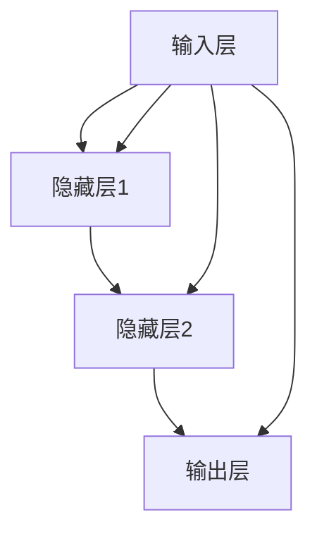

                 

### 金融产品客户终身价值概述

#### 第1章：问题背景与核心概念

##### 1.1 金融产品与客户终身价值

金融产品，如银行存款、保险、基金等，是金融机构提供给客户以实现财务目标、风险管理和资产增值的工具。而客户终身价值（Customer Lifetime Value, CLV）则是指客户在整个生命周期内为金融机构带来的总收益。理解并准确预测客户终身价值，对于金融行业的可持续发展至关重要。

##### 1.2 问题背景

在金融行业，传统的客户关系管理方法往往侧重于短期利润最大化，忽视了长期客户价值的挖掘。然而，随着市场竞争的加剧和客户需求的多样化，金融机构需要通过更精细化的客户价值管理来提升客户满意度和忠诚度，从而在激烈的市场中占据有利地位。

##### 1.2.1 金融行业的挑战与机遇

挑战：
1. **数据隐私与合规性**：金融行业面临严格的监管和数据隐私保护要求，如何在合规的前提下利用客户数据进行价值预测是一个重要挑战。
2. **客户需求的多样性**：客户需求不断变化，金融机构需要及时调整产品和策略，以满足不同客户群体的需求。
3. **成本压力**：传统方法在预测客户价值时，往往依赖大量的人力和物力，增加了运营成本。

机遇：
1. **数据技术的进步**：大数据、人工智能和机器学习等技术的快速发展，为精准预测客户终身价值提供了强有力的工具。
2. **客户体验的个性化**：通过精准的客户分析和个性化推荐，金融机构可以提供更加贴近客户需求的产品和服务，提升客户体验。

##### 1.2.2 客户终身价值的定义与重要性

客户终身价值是指一个客户在其整个生命周期内，从金融机构获得的净收益。它不仅包括客户的直接交易价值，还包括客户间接推荐带来的价值。客户终身价值的重要性体现在以下几个方面：

1. **战略决策**：准确的客户终身价值预测有助于金融机构在产品开发、市场推广和资源分配等方面做出更加明智的决策。
2. **资源优化**：通过识别高价值客户，金融机构可以集中资源提供更好的服务和产品，从而最大化客户价值。
3. **风险控制**：了解客户终身价值有助于金融机构更好地识别和评估潜在的风险，采取相应的风险控制措施。
4. **客户关系管理**：通过分析客户终身价值，金融机构可以识别出不同价值段的客户，制定差异化的客户关系管理策略，提升客户满意度和忠诚度。

在接下来的章节中，我们将深入探讨客户终身价值的构成要素、评估方法及其在客户关系管理中的应用，并介绍多种预测客户终身价值的技术手段，帮助金融行业更好地理解和利用这一关键指标。

### 1.3 核心概念

#### 1.3.1 客户终身价值的构成要素

客户终身价值由多个关键要素构成，这些要素共同决定了客户在一个金融机构中的整体价值。以下是几个主要的构成要素：

1. **交易行为**：客户的交易行为是客户终身价值的重要组成部分。包括交易频率、交易金额、交易类型等。这些数据能够反映客户对金融产品的使用情况，是预测客户终身价值的重要指标。

2. **客户忠诚度**：客户的忠诚度指的是客户重复购买产品或服务的意愿。忠诚度高的客户往往能够为金融机构带来持续的收入和利润。衡量忠诚度的指标包括客户保留率、重复购买率等。

3. **推荐价值**：推荐价值是指客户通过推荐新客户给金融机构所带来的潜在收益。一些客户具有较高的社交影响力，他们通过口碑传播吸引新客户，从而提升金融机构的整体客户终身价值。

4. **生命周期长度**：客户的生命周期长度是指客户与金融机构关系的持续时长。客户生命周期越长，潜在的价值就越高，因为金融机构有更多的时间来服务和挖掘客户的深度需求。

5. **客户满意度**：客户满意度是客户对金融机构产品和服务质量的评价。高满意度不仅能够提升客户的忠诚度，还能通过口碑传播吸引更多潜在客户。

6. **财务贡献**：财务贡献是指客户在生命周期内为金融机构带来的净收益。这包括直接收益（如交易手续费、利息收入等）和间接收益（如推荐新客户带来的收益）。

#### 1.3.2 客户终身价值评估方法

评估客户终身价值的方法多种多样，以下是几种常用的方法：

1. **统计方法**：
   - **平均生命周期收益法**：通过统计客户的平均交易频率、交易金额和生命周期长度，计算出客户的平均终身价值。
   - **回归分析法**：使用统计回归模型，分析客户的各种特征（如年龄、收入、交易行为等）与客户终身价值之间的关系，建立预测模型。

2. **机器学习方法**：
   - **基于历史数据的学习**：使用机器学习算法，如随机森林、决策树等，从历史交易数据中学习客户终身价值的规律，并建立预测模型。
   - **基于序列模型的方法**：如时间序列分析方法，利用时间序列数据来预测客户未来的交易行为和生命周期长度。

3. **深度学习方法**：
   - **循环神经网络（RNN）**：适用于处理序列数据，如客户的交易记录，可以捕捉客户行为的时间依赖性。
   - **卷积神经网络（CNN）**：虽然主要用于图像处理，但在处理具有结构化特征的客户数据时也表现出色。

4. **混合方法**：
   - **结合统计和机器学习方法**：通过结合统计方法和机器学习方法，可以综合利用不同的数据类型和特征，提高预测准确性。

#### 1.3.3 客户终身价值与客户关系管理

客户终身价值是客户关系管理（CRM）的核心指标之一。有效的客户关系管理能够最大化客户终身价值，具体包括以下几个方面：

1. **客户细分**：根据客户终身价值的评估结果，将客户划分为不同的价值段，如高价值客户、中等价值客户和低价值客户。针对不同价值段的客户，采取差异化的管理和营销策略。

2. **个性化服务**：基于客户终身价值评估结果，为高价值客户提供个性化服务，如优先客户支持、定制化产品推荐等，提升客户满意度和忠诚度。

3. **风险控制**：通过对客户终身价值的分析，金融机构可以更好地识别潜在的风险客户，采取相应的风险控制措施，如调整信贷政策、增加风险预警机制等。

4. **客户保留与扩展**：通过有效的客户关系管理策略，如定期的客户沟通、客户关怀活动等，提高客户保留率，同时通过客户推荐机制，扩大客户群体，提升整体客户终身价值。

在接下来的章节中，我们将详细探讨用于预测客户终身价值的不同技术方法，以及如何通过这些方法来制定和实施提升客户终身价值的策略。

### 第二部分：预测方法与技术

#### 第2章：客户终身价值预测基础

##### 2.1 数据预处理

在客户终身价值预测中，数据预处理是至关重要的一步。它不仅影响模型的训练效果，还直接影响预测的准确性。数据预处理包括以下几个关键步骤：

##### 2.1.1 数据质量分析

数据质量分析是数据预处理的第一步，它包括检查数据中的缺失值、异常值和重复记录等。具体步骤如下：

1. **缺失值处理**：缺失值可以采用插值法、均值填补法、中位数填补法或删除缺失值等方法进行处理。
2. **异常值检测**：异常值可能会对模型产生不利影响，常用的方法包括箱线图法、Z分数法和IQR（四分位距）法。
3. **重复记录删除**：重复记录会降低数据的代表性，应当通过去重操作予以删除。

##### 2.1.2 数据特征工程

数据特征工程是提升预测模型性能的关键步骤，它包括特征选择、特征转换和特征构造等。

1. **特征选择**：选择对预测目标有显著影响的关键特征。常用的方法有相关性分析、递归特征消除（RFE）和基于模型的特征选择等。
2. **特征转换**：包括数值特征的分类型处理、类别特征的数值化处理等。例如，使用独热编码（One-Hot Encoding）处理类别特征。
3. **特征构造**：通过组合现有特征构造新的特征，以增强模型的预测能力。例如，利用客户的交易行为数据构造客户活跃度、消费额度等新特征。

##### 2.2 统计方法

统计方法在客户终身价值预测中有着广泛的应用，特别是描述性统计方法和基于统计学的预测方法。

##### 2.2.1 描述性统计分析

描述性统计分析主要用于总结和展示数据的基本特征，如均值、中位数、标准差等。这些统计量能够帮助我们理解数据的分布和趋势，为进一步的预测提供基础。

1. **均值和标准差**：均值描述数据的中心趋势，标准差描述数据的离散程度。
2. **累积分布函数（CDF）和概率密度函数（PDF）**：用于描述数据在不同区间的分布情况。

##### 2.2.2 基于统计学的预测方法

基于统计学的预测方法主要包括回归分析、时间序列分析和因子分析等。

1. **回归分析**：回归模型通过分析自变量和因变量之间的关系，建立预测模型。常见的回归模型有线性回归、多元回归和逻辑回归等。
   - **线性回归**：假设因变量和自变量之间呈线性关系，用于预测连续值目标。
   - **逻辑回归**：用于预测二元分类目标，如客户是否流失。
2. **时间序列分析**：时间序列模型用于处理随时间变化的数据。常见的模型有ARIMA、指数平滑法和SARIMA等。
3. **因子分析**：因子分析通过减少变量数量，提取隐藏在数据背后的公共因子，从而简化数据分析过程，并提高预测精度。

##### 2.3 机器学习方法

随着机器学习技术的不断发展，其在客户终身价值预测中的应用也越来越广泛。机器学习方法能够自动从大量数据中学习复杂的模式，提高预测准确性。

##### 2.3.1 常见机器学习算法

以下是一些常用的机器学习算法及其在客户终身价值预测中的应用：

1. **决策树**：决策树通过一系列规则将数据分割成不同的子集，并在每个节点选择最优的分割方式。常见的决策树算法有ID3、C4.5和CART等。
2. **随机森林**：随机森林通过构建多个决策树，并利用集成学习（Ensemble Learning）的方法提高预测性能。随机森林在处理高维数据和避免过拟合方面表现出色。
3. **支持向量机（SVM）**：SVM通过寻找最优分隔超平面，将数据分类或回归。SVM在处理高维数据和小样本问题时效果较好。
4. **K最近邻（KNN）**：KNN通过计算样本点之间的距离，将新样本分类到最近的k个邻居的类别中。KNN在预测时间较短，但准确性依赖于参数选择。
5. **神经网络**：神经网络通过多层非线性变换，学习输入和输出之间的复杂映射关系。常见的神经网络模型有前馈神经网络和卷积神经网络（CNN）。

##### 2.3.2 基于机器学习的预测方法

基于机器学习的客户终身价值预测方法通常包括以下几个步骤：

1. **数据收集**：收集客户的交易行为、财务状况、行为数据等。
2. **数据预处理**：对数据进行清洗、特征工程等预处理操作。
3. **模型选择**：选择适合的机器学习算法，如决策树、随机森林、神经网络等。
4. **模型训练**：使用预处理后的数据训练机器学习模型。
5. **模型评估**：通过交叉验证等方法评估模型性能，调整模型参数。
6. **预测应用**：将训练好的模型应用于新的客户数据，预测客户终身价值。

通过上述步骤，金融机构可以有效地预测客户终身价值，从而制定更加精准的客户关系管理策略，提高客户满意度和忠诚度，实现持续的业务增长。

### 第3章：深度学习方法

深度学习作为一种强大的机器学习技术，近年来在客户终身价值预测中得到了广泛应用。它通过多层神经网络的结构，自动从大量数据中学习复杂的模式，从而提高预测准确性。在本章节中，我们将介绍深度学习的基础知识，并探讨深度学习在客户终身价值预测中的应用。

#### 3.1 神经网络基础

神经网络（Neural Networks）是深度学习的基础，其基本结构包括输入层、隐藏层和输出层。每个层次都包含多个神经元（或节点），神经元之间通过权重连接。

1. **基本结构**
   - **输入层**：接收外部输入数据，如客户的特征数据。
   - **隐藏层**：对输入数据进行处理，通过加权求和和激活函数（如Sigmoid、ReLU）进行非线性变换。
   - **输出层**：产生预测结果，如客户终身价值的估计值。

2. **激活函数**：激活函数用于引入非线性特性，常见的激活函数有Sigmoid、ReLU和Tanh等。

3. **反向传播算法**：反向传播算法是训练神经网络的关键，通过不断调整权重和偏置，使模型输出与实际结果之间的误差最小化。

#### 3.1.1 神经网络的基本结构

一个简单的神经网络结构如下所示：



在上述结构中，输入层接收客户的特征数据，通过隐藏层进行多层非线性变换，最终输出层产生预测结果。

#### 3.1.2 深度学习核心算法

深度学习中的核心算法包括卷积神经网络（CNN）、循环神经网络（RNN）和生成对抗网络（GAN）等。

1. **卷积神经网络（CNN）**：CNN主要用于处理具有空间结构的数据，如图像。CNN通过卷积层、池化层和全连接层等结构，能够自动提取图像中的特征。
   - **卷积层**：卷积层通过卷积操作提取图像的特征。
   - **池化层**：池化层用于减少数据维度，提高计算效率。
   - **全连接层**：全连接层将卷积层和池化层提取的特征进行整合，产生最终输出。

2. **循环神经网络（RNN）**：RNN适用于处理序列数据，如客户的交易记录。RNN通过循环结构，能够捕捉序列数据中的时间依赖关系。
   - **循环单元**：循环单元包含反馈连接，用于传递前一时间步的信息。
   - **隐藏状态**：隐藏状态用于存储序列数据的历史信息。

3. **生成对抗网络（GAN）**：GAN由生成器（Generator）和判别器（Discriminator）组成，通过对抗训练，生成器试图生成与真实数据难以区分的假数据，而判别器则试图区分真实数据和假数据。

#### 3.2 深度学习在客户终身价值预测中的应用

深度学习在客户终身价值预测中的应用主要集中在以下几个方面：

1. **客户行为特征提取**：通过CNN和RNN等深度学习模型，自动从客户的交易记录和行为数据中提取特征，提高特征提取的准确性和效率。

2. **序列建模**：利用RNN等深度学习模型，处理客户的交易记录序列，捕捉客户行为的时间依赖性，从而提高客户终身价值预测的准确性。

3. **个性化推荐**：通过深度学习模型，如GAN，生成与真实客户数据相似的高质量假数据，用于训练个性化推荐系统，提高推荐的质量和用户满意度。

在下一章中，我们将探讨如何通过深度学习方法，具体实施客户终身价值预测，并分析各种深度学习模型在预测中的应用。

#### 第3章：深度学习方法

### 3.2 深度学习在客户终身价值预测中的应用

深度学习在处理复杂数据和分析长期依赖关系方面具有显著优势，因此在客户终身价值预测中的应用也日益广泛。在这一节中，我们将详细探讨几种深度学习模型，如循环神经网络（RNN）、卷积神经网络（CNN）和生成对抗网络（GAN）在客户终身价值预测中的应用。

##### 3.2.1 循环神经网络（RNN）

循环神经网络（RNN）是一种专门设计用于处理序列数据的深度学习模型。其基本结构包括循环单元，能够保存和利用前一时间步的信息。这使得RNN非常适合用于分析客户的交易记录和行为序列。

1. **RNN的结构和工作原理**
   - **循环单元**：每个循环单元包含一个隐藏状态（h_t），用于存储和传递历史信息。
   - **输入和输出**：输入序列（x_t）和隐藏状态（h_t）通过权重矩阵（W）进行加权求和，并通过激活函数（如ReLU）进行非线性变换，得到新的隐藏状态（h_{t+1}）。
   - **时间步递推**：RNN通过递归操作，逐个处理输入序列的每个时间步。

   下图展示了RNN的基本结构：

   ```mermaid
   graph TD
   A[Input x_1] --> B[Hidden State h_1]
   B --> C[Output y_1]
   B --> D[Hidden State h_2]
   D --> E[Output y_2]
   D --> F[Hidden State h_3]
   ```

2. **在客户终身价值预测中的应用**
   - **序列建模**：RNN能够捕捉客户行为的时间依赖性，例如，客户的交易频率、金额等随时间变化的特征。
   - **长期依赖性**：RNN通过隐藏状态保存历史信息，能够处理长序列数据，有助于预测客户长期的价值。

##### 3.2.2 卷积神经网络（CNN）

卷积神经网络（CNN）最初用于图像处理，但由于其出色的特征提取能力，也在序列数据分析和客户终身价值预测中得到了应用。CNN通过卷积层和池化层，能够自动提取数据中的局部特征。

1. **CNN的结构和工作原理**
   - **卷积层**：卷积层通过卷积操作提取数据中的局部特征。卷积核在数据上滑动，生成特征图。
   - **池化层**：池化层用于减小特征图的尺寸，提高计算效率和模型的泛化能力。常用的池化方法有最大池化和平均池化。
   - **全连接层**：全连接层将卷积层和池化层提取的特征进行整合，产生最终输出。

   下图展示了CNN的基本结构：

   ```mermaid
   graph TD
   A[Input Data] --> B[Convolution Layer]
   B --> C[Pooling Layer]
   C --> D[Convolution Layer]
   D --> E[Pooling Layer]
   D --> F[Flattening]
   F --> G[Fully Connected Layer]
   ```

2. **在客户终身价值预测中的应用**
   - **特征提取**：CNN能够自动从客户的交易记录和行为数据中提取有代表性的特征，如交易频率、金额分布等。
   - **结构化数据**：CNN能够处理具有结构化特征的数据，例如，通过卷积操作提取时间序列中的周期性特征。

##### 3.2.3 生成对抗网络（GAN）

生成对抗网络（GAN）由生成器和判别器组成，通过对抗训练生成高质量的数据，可以用于增强模型的预测能力。

1. **GAN的结构和工作原理**
   - **生成器**：生成器（Generator）生成虚假数据，目标是使这些数据难以被判别器区分。
   - **判别器**：判别器（Discriminator）评估数据的真实性，目标是正确区分真实数据和虚假数据。

   GAN的训练过程是一个对抗性的过程，生成器和判别器相互竞争，生成器和判别器的损失函数分别是：

   - **生成器的损失函数**：希望判别器将生成的数据判为真实数据。
   - **判别器的损失函数**：希望判别器能够准确地区分真实数据和虚假数据。

   下图展示了GAN的基本结构：

   ```mermaid
   graph TD
   A[Input Noise] --> B[Generator]
   B --> C[Generated Data]
   C --> D[Discriminator]
   D --> E[Output Real/Fake]
   ```

2. **在客户终身价值预测中的应用**
   - **数据增强**：GAN可以生成与真实客户数据相似的高质量假数据，用于训练和增强预测模型。
   - **个性化推荐**：GAN可以生成个性化的推荐数据，提高推荐系统的质量和用户体验。

通过RNN、CNN和GAN等深度学习模型的应用，金融机构可以更准确地预测客户终身价值，从而制定更加有效的客户关系管理策略，提升客户满意度和忠诚度。在下一章中，我们将探讨如何通过客户行为分析和预测来进一步提升客户终身价值。

### 第4章：客户行为分析与预测

#### 4.1 客户行为特征提取

在客户终身价值预测中，准确提取和分析客户行为特征是至关重要的一步。这些特征可以帮助我们深入理解客户的行为模式，从而更精准地预测其终身价值。

##### 4.1.1 客户行为数据类型

客户行为数据可以分为以下几种类型：

1. **交易数据**：包括交易时间、交易金额、交易类型、交易频率等。
2. **交互数据**：包括客户与金融机构的互动数据，如在线咨询、客户服务请求等。
3. **偏好数据**：包括客户对金融产品的偏好，如基金选择、保险类型等。
4. **社交数据**：包括客户在社交媒体上的行为，如点赞、评论、分享等。

##### 4.1.2 客户行为特征工程

特征工程是将原始数据转换为能够有效提升模型性能的特征的过程。以下是几个关键的客户行为特征工程步骤：

1. **数据预处理**：
   - **缺失值处理**：缺失值可以通过插补或删除的方法处理。
   - **异常值检测**：异常值可以通过统计分析方法检测，并采取相应的处理措施。

2. **特征选择**：
   - **相关性分析**：通过计算特征之间的相关性，筛选出与目标变量高度相关的特征。
   - **特征重要性**：使用随机森林等算法计算特征的重要性，选择关键特征。

3. **特征构造**：
   - **时间特征**：根据交易时间构造特征，如客户最近一次交易时间、交易活跃时间段等。
   - **交易模式**：通过分析交易数据，提取客户的交易模式，如消费高峰期、消费低谷期等。
   - **交互频率**：通过交互数据计算客户的互动频率，如平均每月咨询次数、服务请求次数等。

#### 4.2 客户行为预测方法

预测客户行为是提升客户终身价值的关键。以下介绍几种常见的客户行为预测方法：

##### 4.2.1 基于机器学习的客户行为预测

1. **逻辑回归**：逻辑回归是一种经典的二元分类模型，通过分析客户的特征，预测客户是否会进行特定行为（如购买产品）。

2. **决策树**：决策树通过一系列规则将客户分为不同的行为类别。它直观、易于理解，但在高维数据上可能表现不佳。

3. **随机森林**：随机森林通过构建多个决策树，并利用集成学习的方法提高预测性能。它对高维数据和异常值具有较好的鲁棒性。

4. **支持向量机（SVM）**：SVM通过寻找最优分隔超平面，将客户分为不同的行为类别。它在处理高维数据和小样本问题时效果较好。

##### 4.2.2 基于深度学习的客户行为预测

深度学习在处理复杂数据和长期依赖关系方面具有显著优势。以下是几种基于深度学习的客户行为预测方法：

1. **循环神经网络（RNN）**：RNN适用于处理序列数据，如客户的交易记录。它能够捕捉客户行为的时间依赖性。

2. **长短期记忆网络（LSTM）**：LSTM是RNN的一种改进，能够更好地处理长序列数据。它通过引入记忆单元来避免梯度消失问题。

3. **卷积神经网络（CNN）**：CNN通过卷积操作提取数据中的局部特征，适用于处理具有结构化特征的数据。

4. **生成对抗网络（GAN）**：GAN通过生成器和判别器的对抗训练，可以生成高质量的假数据，用于训练和增强预测模型。

通过上述方法，金融机构可以更准确地预测客户的行为，从而制定更加个性化的营销策略，提高客户满意度和忠诚度，实现持续的业务增长。

### 第5章：客户细分与个性化推荐

#### 5.1 客户细分策略

在金融行业中，客户细分是一种重要的客户关系管理策略，通过将客户划分为不同的群体，金融机构可以更好地理解和满足客户的需求，从而提升客户满意度和忠诚度。以下是几种常见的客户细分策略：

##### 5.1.1 客户细分方法

1. **基于交易行为的细分**：
   - **交易频率**：根据客户在一段时间内的交易次数进行细分，高频率客户通常享有更多的优惠和服务。
   - **交易金额**：根据客户的平均交易金额进行细分，高价值客户可能获得更高级别的服务。
   - **交易类型**：根据客户偏好的交易类型进行细分，如股票交易、基金投资等。

2. **基于客户价值的细分**：
   - **生命周期价值**：根据客户在其生命周期内为金融机构带来的总收益进行细分，高价值客户通常享有更多的关注和资源。
   - **忠诚度**：根据客户对金融机构的忠诚度进行细分，忠诚度高的客户通常享有更多的优惠和特权。

3. **基于客户属性的细分**：
   - **年龄**：根据客户的年龄进行细分，不同年龄段的客户可能有不同的金融需求和偏好。
   - **收入水平**：根据客户的收入水平进行细分，高收入客户可能对高端金融产品更感兴趣。
   - **职业**：根据客户的职业进行细分，不同职业的客户可能有不同的金融需求。

##### 5.1.2 客户细分在客户终身价值提升中的应用

客户细分策略在提升客户终身价值方面具有重要作用：

1. **个性化营销**：通过了解不同细分群体的需求和偏好，金融机构可以制定个性化的营销策略，提高客户的参与度和满意度。
   - **高价值客户**：针对高价值客户，金融机构可以提供更高级别的服务和定制化的金融产品，增加其忠诚度和满意度。
   - **潜在高价值客户**：通过分析客户的交易行为和潜在需求，金融机构可以识别出潜在的高价值客户，并采取针对性的营销策略，促使其升级为高价值客户。

2. **资源优化**：通过客户细分，金融机构可以更好地分配资源，提高运营效率：
   - **高频率客户**：针对高频率客户，金融机构可以增加服务渠道和资源投入，提升客户体验。
   - **低价值客户**：对于低价值客户，金融机构可以减少资源投入，关注高潜力客户。

3. **风险控制**：通过客户细分，金融机构可以更好地识别和评估不同客户群体的风险水平，采取相应的风险控制措施：
   - **高风险客户**：针对高风险客户，金融机构可以采取更严格的信贷政策和风险控制措施，降低潜在损失。
   - **低风险客户**：对于低风险客户，金融机构可以提供更灵活的信贷产品和服务，降低运营成本。

通过有效的客户细分策略，金融机构不仅可以更好地满足客户需求，提高客户满意度和忠诚度，还能优化资源配置，降低运营成本，从而提升客户终身价值。

### 第5章：客户细分与个性化推荐

#### 5.2 个性化推荐系统

个性化推荐系统在提升客户满意度和忠诚度方面发挥了重要作用，它通过分析客户的兴趣和行为，为其推荐最相关的产品和服务。在金融行业，个性化推荐系统能够有效提升客户终身价值，实现精准营销。

##### 5.2.1 个性化推荐算法

个性化推荐算法主要分为基于内容的推荐、协同过滤推荐和混合推荐。

1. **基于内容的推荐**：
   - **内容分析**：分析产品或服务的特征，如产品类型、投资策略、风险等级等。
   - **用户兴趣建模**：根据用户的浏览历史、搜索记录和反馈，构建用户兴趣模型。
   - **推荐生成**：通过比较用户兴趣模型和产品特征，为用户推荐相似的产品或服务。

2. **协同过滤推荐**：
   - **用户-项目矩阵**：建立用户-项目交互矩阵，记录用户对项目的评分、购买记录等。
   - **相似度计算**：计算用户之间的相似度，常用的方法有用户基于内容的相似度（余弦相似度、皮尔逊相关系数）和基于模型的相似度（K最近邻算法）。
   - **推荐生成**：为每个用户推荐与其最相似的其他用户喜欢的项目。

3. **混合推荐**：
   - **结合内容推荐和协同过滤**：综合用户兴趣和用户行为，生成更加准确的推荐结果。
   - **加权混合**：根据不同推荐算法的优劣，对推荐结果进行加权处理，提高推荐的整体质量。

##### 5.2.2 个性化推荐在客户终身价值提升中的应用

个性化推荐系统在提升客户终身价值方面具有以下几方面的作用：

1. **提升客户满意度**：
   - **个性化体验**：通过分析客户的兴趣和行为，推荐个性化的金融产品和服务，提升用户体验。
   - **及时响应**：根据客户的偏好和历史行为，及时推荐符合其需求的产品，增强客户对金融机构的信任和满意度。

2. **增加客户忠诚度**：
   - **持续互动**：通过持续推荐客户感兴趣的产品和服务，增加客户与金融机构的互动频率，培养客户忠诚度。
   - **定制化服务**：根据客户的个性化需求，提供定制化的金融解决方案，提升客户对金融机构的依赖和信任。

3. **优化营销策略**：
   - **精准营销**：通过个性化推荐，将有限的市场资源集中在最具潜力的客户群体，提高营销效果。
   - **降低获客成本**：通过提高推荐准确率和客户转化率，降低客户获取成本，提升整体盈利能力。

4. **提升运营效率**：
   - **自动化推荐**：通过自动化推荐系统，减少人工推荐的工作量，提高运营效率。
   - **数据驱动决策**：通过分析推荐效果和客户反馈，优化推荐算法和策略，实现数据驱动决策。

通过个性化推荐系统，金融机构可以更精准地满足客户需求，提升客户满意度和忠诚度，从而实现客户终身价值的最大化。在下一章中，我们将探讨如何通过客户互动与体验优化，进一步提升客户终身价值。

### 第6章：客户互动与体验优化

#### 6.1 客户互动数据分析

在提升客户终身价值的过程中，了解和分析客户的互动数据是至关重要的。通过分析客户的互动数据，金融机构可以深入了解客户的需求、偏好和体验，从而优化服务，提升客户满意度。

##### 6.1.1 客户互动数据收集与处理

客户互动数据包括客户的交易记录、服务请求、在线咨询、社交媒体互动等多种类型的数据。以下是如何收集和处理这些数据的步骤：

1. **数据收集**：
   - **交易记录**：从金融机构的交易系统中收集客户的交易记录，包括交易时间、金额、类型等。
   - **服务请求**：从客户服务系统中收集客户提交的服务请求，包括请求类型、处理时间、请求来源等。
   - **在线咨询**：从在线客服系统收集客户与客服人员的互动记录，包括对话内容、解决方案等。
   - **社交媒体互动**：从社交媒体平台上收集客户的评论、点赞、分享等互动数据。

2. **数据处理**：
   - **数据清洗**：清洗数据中的错误、异常值和重复记录，确保数据质量。
   - **数据整合**：将来自不同渠道的数据进行整合，构建一个统一的客户互动数据集。
   - **数据标准化**：对数据进行格式统一和数值标准化，便于后续分析。

##### 6.1.2 客户互动数据分析方法

有效的客户互动数据分析需要使用多种分析方法和技术，以下介绍几种常用的分析方法：

1. **描述性统计分析**：
   - **频率分析**：分析客户在特定时间或情境下互动的频率。
   - **趋势分析**：分析客户互动数据的长期趋势和周期性变化。
   - **分布分析**：分析不同互动类型的分布情况和客户行为特征。

2. **关联分析**：
   - **关联规则挖掘**：使用关联规则算法（如Apriori算法）发现客户互动数据中的相关性，识别出潜在的关联模式。
   - **聚类分析**：使用聚类算法（如K-means、层次聚类）对客户进行分类，分析不同类别客户的行为特征。

3. **机器学习预测**：
   - **分类模型**：使用分类算法（如逻辑回归、决策树）预测客户的未来行为，如客户流失预测、客户需求预测等。
   - **回归模型**：使用回归算法（如线性回归、随机森林）预测客户互动对业务绩效的影响，如交易额预测、满意度预测等。

通过上述分析方法，金融机构可以深入了解客户的互动行为，识别出关键影响因素，从而制定更有效的客户互动优化策略。

#### 6.2 客户体验优化策略

优化客户体验是提升客户终身价值的关键。以下介绍几种常见的客户体验优化策略：

##### 6.2.1 客户体验评估指标

为了衡量客户体验的优化效果，需要设定一系列评估指标。以下是一些常用的客户体验评估指标：

1. **客户满意度（CSAT）**：
   - **定义**：通过调查问卷或直接询问客户，了解客户对金融机构产品和服务的满意程度。
   - **作用**：反映客户对当前服务的总体满意度。

2. **净推荐值（NPS）**：
   - **定义**：通过询问客户“您有多大可能向他人推荐我们的产品/服务？”来衡量客户的忠诚度和推荐意愿。
   - **作用**：评估客户对金融机构的长期信任和忠诚度。

3. **客户保留率**：
   - **定义**：指在特定时间段内，客户继续与金融机构保持业务关系的比例。
   - **作用**：衡量客户对金融机构产品和服务的持续满意度和依赖程度。

4. **交易量**：
   - **定义**：指客户在金融机构进行的交易总额。
   - **作用**：反映客户在金融机构中的活跃度和贡献价值。

##### 6.2.2 客户体验优化方法

为了提升客户体验，金融机构可以采取以下优化方法：

1. **个性化服务**：
   - **根据客户偏好推荐产品**：通过分析客户的历史行为和偏好，推荐个性化的金融产品和服务。
   - **定制化解决方案**：根据客户的特定需求，提供定制化的金融解决方案。

2. **简化流程**：
   - **优化在线服务流程**：简化在线开户、交易、咨询等流程，提高操作便捷性。
   - **减少等待时间**：通过自动化和优化服务流程，减少客户等待时间，提高服务效率。

3. **提升服务质量**：
   - **培训员工**：提升员工的专业知识和服务水平，提高客户满意度。
   - **提供全方位支持**：为客户提供全方位的支持，包括交易指导、风险管理等。

4. **增强互动体验**：
   - **实时沟通**：通过在线聊天、电话等方式，提供实时沟通渠道，及时解答客户问题。
   - **增强互动性**：通过社交媒体、在线社区等平台，增强与客户的互动，提高客户参与度。

通过以上优化策略，金融机构可以提升客户体验，增强客户满意度和忠诚度，从而实现客户终身价值的最大化。

### 第7章：综合策略与实施步骤

#### 7.1 综合策略制定

要实现有效的客户终身价值提升，金融机构需要制定一个全面的综合策略。以下是一些关键策略制定的原则和流程：

##### 7.1.1 策略制定原则

1. **以客户为中心**：所有策略应以满足客户需求和提升客户体验为核心目标。
2. **数据驱动**：利用大数据和人工智能技术，对客户行为和互动数据进行分析，驱动策略制定和实施。
3. **差异化策略**：根据客户细分结果，制定针对不同客户群体的差异化策略。
4. **持续优化**：定期评估策略效果，根据反馈进行优化和调整。

##### 7.1.2 策略制定流程

1. **需求分析**：
   - **明确目标**：确定提升客户终身价值的总体目标，如提高客户满意度、降低客户流失率等。
   - **客户调研**：通过问卷调查、访谈等方式，了解客户的需求、痛点和偏好。

2. **数据收集与分析**：
   - **数据收集**：收集客户交易记录、互动数据、行为数据等。
   - **数据清洗**：清洗数据中的错误、异常值和重复记录，确保数据质量。
   - **数据分析**：使用描述性统计、关联分析、机器学习等方法，深入分析客户行为和互动模式。

3. **策略制定**：
   - **客户细分**：根据数据分析结果，将客户划分为不同的细分群体。
   - **策略设计**：针对每个细分群体，设计个性化的营销和服务策略。
   - **资源分配**：根据客户价值和潜在增长，合理分配营销和运营资源。

4. **测试与优化**：
   - **A/B测试**：对策略进行初步测试，评估不同策略的效果。
   - **持续优化**：根据测试结果和客户反馈，不断调整和优化策略。

通过以上原则和流程，金融机构可以制定出有效的客户终身价值提升策略，从而实现持续的业务增长和客户满意度的提升。

### 7.2 实施步骤与案例分析

在实施提升客户终身价值的策略时，金融机构需要遵循一系列详细的步骤，并借助实际案例进行验证和优化。以下是具体的实施步骤：

##### 7.2.1 实施步骤

1. **数据收集与预处理**：
   - **数据源确定**：从内部系统和外部数据源收集客户交易记录、行为数据、互动记录等。
   - **数据清洗**：对收集到的数据去重、补全缺失值，处理异常值，确保数据质量。

2. **客户细分**：
   - **数据分析**：利用统计分析和机器学习技术，分析客户行为数据，识别不同细分群体。
   - **细分策略**：根据客户价值、交易行为、互动频率等，将客户划分为高价值客户、中等价值客户和低价值客户。

3. **个性化推荐系统**：
   - **内容分析**：分析金融产品的特征，构建产品内容数据库。
   - **用户兴趣建模**：根据客户的浏览记录、购买历史等，建立用户兴趣模型。
   - **推荐算法实施**：使用协同过滤、基于内容的推荐算法，为不同细分群体提供个性化推荐。

4. **个性化营销与服务**：
   - **营销策略**：根据客户细分结果，设计差异化的营销活动，如优惠促销、专属活动等。
   - **服务优化**：提升在线客服服务质量，提供24/7在线支持，增加客户满意度。

5. **客户互动与体验优化**：
   - **互动数据收集**：建立客户互动数据收集机制，包括在线咨询、服务请求、社交媒体互动等。
   - **体验评估**：定期收集客户反馈，评估客户体验，优化服务流程。

6. **A/B测试与优化**：
   - **策略测试**：对不同的营销和服务策略进行A/B测试，评估效果。
   - **持续优化**：根据测试结果和客户反馈，调整和优化策略。

##### 7.2.2 案例分析

以某大型商业银行为例，其实施提升客户终身价值的策略如下：

1. **数据收集与预处理**：
   - 该银行从客户关系管理系统（CRM）中提取了客户交易记录、互动记录等数据，确保数据质量。

2. **客户细分**：
   - 利用机器学习算法，将客户划分为高价值客户、中等价值客户和低价值客户，并根据细分结果制定差异化营销策略。

3. **个性化推荐系统**：
   - 使用协同过滤算法构建推荐模型，为高价值客户提供个性化的金融产品推荐，如高端理财产品、保险等。
   - 为中等价值客户提供标准化产品推荐，如定期存款、基金等。

4. **个性化营销与服务**：
   - 针对高价值客户，该银行定期推出专属优惠和活动，提升客户忠诚度。
   - 为所有客户提供24/7在线客服支持，提升客户满意度。

5. **客户互动与体验优化**：
   - 通过社交媒体互动和客户调研，了解客户需求和反馈，持续优化服务体验。
   - 实施客户互动数据分析，识别关键影响因素，优化客户互动策略。

6. **A/B测试与优化**：
   - 通过A/B测试，比较不同营销策略的效果，根据测试结果调整优化策略。
   - 定期评估策略效果，确保持续优化和改进。

通过上述策略的实施，该银行成功地提升了客户终身价值，客户满意度和忠诚度得到显著提高，实现了业务的持续增长。

### 第8章：总结与展望

#### 8.1 总结

本文详细探讨了金融产品客户终身价值预测与提升策略。通过分析金融行业背景、核心概念和构成要素，我们了解了客户终身价值在金融机构运营中的重要性。接着，我们深入探讨了用于预测客户终身价值的多种方法，包括统计方法和机器学习方法，特别是深度学习技术在客户终身价值预测中的应用。随后，本文介绍了如何通过客户行为分析和预测、客户细分与个性化推荐、客户互动与体验优化等策略来提升客户终身价值。通过综合策略的制定与实施步骤，以及实际案例分析，我们展示了如何将理论应用到实际业务中，实现客户终身价值的最大化。

#### 8.2 展望

未来，随着人工智能和大数据技术的不断进步，客户终身价值预测与提升策略将面临更多的发展机遇和挑战。以下是几个未来的研究方向和行业发展趋势：

1. **数据隐私与合规性**：随着数据隐私保护法规的日益严格，如何在保障数据隐私的同时，有效利用客户数据进行价值预测，将成为一个重要研究方向。

2. **个性化推荐的深化**：个性化推荐系统将继续发展，通过更精准的用户行为分析和偏好挖掘，提供更加个性化的金融产品和服务。

3. **实时预测与动态调整**：实现实时预测和动态调整，根据客户行为的实时变化，及时调整营销和服务策略，以更好地满足客户需求。

4. **跨渠道整合**：将线上线下渠道进行整合，实现数据共享和策略协同，提供无缝的客户体验。

5. **人工智能伦理与道德**：随着人工智能技术在金融行业的广泛应用，确保技术的公正性、透明性和道德性，避免对客户造成负面影响，将成为行业关注的重点。

6. **行业合作与开放平台**：金融机构将与其他行业和企业开展更多合作，共享数据和技术，共同打造开放、共享的客户终身价值管理平台。

通过不断探索和创新，金融行业将在客户终身价值预测与提升方面取得更大突破，实现业务增长和客户满意度的全面提升。

### 作者信息

作者：AI天才研究院/AI Genius Institute & 禅与计算机程序设计艺术 /Zen And The Art of Computer Programming

