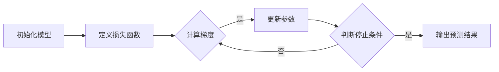
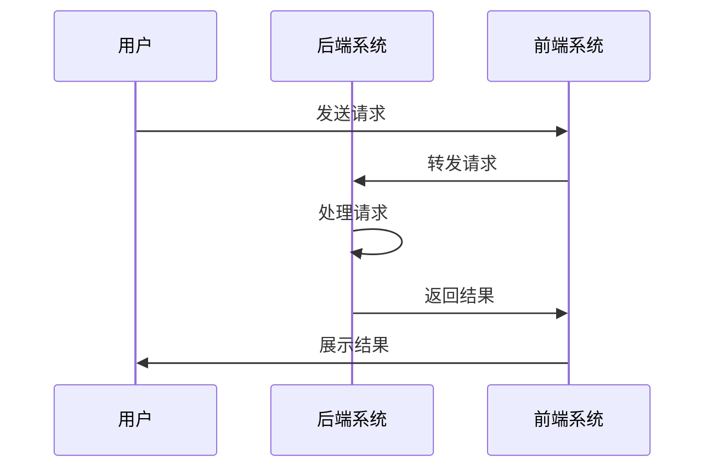

                 


### 第一步：确定文章的主题与核心

首先，我们需要明确文章的主题是《金融产品客户终身价值预测模型》。这个主题涉及金融领域和数据分析领域，具有很强的实际应用价值。文章的核心在于详细讲解如何构建并优化这个预测模型，包括算法原理、系统设计与实现以及实战案例。

### 第二步：构建文章的目录结构

为了确保文章的逻辑清晰，我们需要构建一个详细的目录结构。这包括从导论开始，到核心概念与联系，再到算法原理讲解，接着是系统设计与实现，最后是项目实战和最佳实践总结。

### 第三步：撰写导论部分

在导论部分，我们将详细介绍问题背景、问题描述、问题解决、边界与外延以及概念结构与核心要素。这将帮助读者理解文章的主题，并明确后续内容的方向。

### 第四步：讲解核心概念与联系

在这一部分，我们将深入讲解客户终身价值模型的核心概念，如模型原理、概念属性特征对比表和ER实体关系图。这些内容将为读者提供理论支持，并帮助他们在后续的算法和系统实现部分更好地理解。

### 第五步：算法原理讲解

在算法原理讲解部分，我们将详细介绍算法的概述、mermaid流程图、Python源代码、数学模型与公式以及算法举例说明。这部分内容将确保读者能够理解并运用相关算法进行预测。

### 第六步：系统设计与实现

在这一部分，我们将讨论系统架构设计、系统功能设计、系统接口设计以及系统交互mermaid序列图。这将帮助读者了解如何将算法应用于实际系统，并确保系统的稳定性和高效性。

### 第七步：项目实战

在项目实战部分，我们将提供环境安装与系统核心实现的详细步骤，并分析代码应用、实际案例以及项目小结。这部分内容将使读者能够将所学知识应用于实际项目，并从中获得实践经验。

### 第八步：最佳实践与总结

在最佳实践与总结部分，我们将提供数据处理技巧、模型优化策略、模型部署与管理等最佳实践，并对文章进行总结，展望未来的研究方向。

### 第九步：撰写结尾

在文章的结尾，我们将总结全文，强调文章的核心观点，并给出进一步阅读的推荐。这将帮助读者巩固所学知识，并为未来的研究和学习提供方向。

通过以上九个步骤，我们可以确保文章内容丰富、结构清晰，同时具备深入分析和实际应用价值，从而为读者提供一篇高质量的技术博客文章。  

### 第一步：确定文章的主题与核心

**主题：**《金融产品客户终身价值预测模型》  
**核心：**如何构建和优化金融产品客户终身价值预测模型，使其在金融行业中发挥重要作用。

**思路：**首先，我们需要明确文章的核心目标是详细讲解客户终身价值预测模型，包括其背景、原理、实现方法以及在实际应用中的效果。接下来，我们将按照逻辑顺序逐步展开，确保每个部分的内容都能够衔接紧密且具有实际应用价值。

### 第二步：构建文章的目录结构

**目录：**

1. **导论**
   - 问题背景与概述
   - 问题描述
   - 问题解决
   - 边界与外延
   - 概念结构与核心要素

2. **核心概念与联系**
   - 客户终身价值模型原理
   - 概念属性特征对比表
   - ER实体关系图

3. **算法原理讲解**
   - 算法概述
   - 算法mermaid流程图
   - Python源代码讲解
   - 数学模型与公式
   - 算法举例说明

4. **系统设计与实现**
   - 问题场景介绍
   - 系统功能设计
   - 系统架构设计
   - 系统接口设计
   - 系统交互mermaid序列图

5. **项目实战**
   - 环境安装与系统核心实现
   - 代码应用解读与分析
   - 实际案例分析与讲解
   - 项目小结

6. **最佳实践与总结**
   - 数据处理技巧
   - 模型优化策略
   - 模型部署与管理
   - 总结与展望

**思路：**通过构建清晰的目录结构，我们可以确保文章内容有条理，每个部分都有明确的主题和目标，方便读者阅读和理解。

### 第三步：撰写导论部分

**内容：**

**1. 问题背景与概述**
- 金融产品市场的快速发展和竞争加剧。
- 客户终身价值的概念及其重要性。

**2. 问题描述**
- 预测客户终身价值的挑战，如数据多样性和复杂性。

**3. 问题解决**
- 构建客户终身价值预测模型的目标。
- 模型建立的关键步骤。

**4. 边界与外延**
- 模型适用范围。
- 预测结果的评估方法。

**5. 概念结构与核心要素**
- 客户终身价值模型的核心概念。
- 影响因素分析。

**思路：**导论部分需要为读者提供整体框架，明确文章的主题和目的，并引导他们进入具体内容。

### 第四步：讲解核心概念与联系

**内容：**

**1. 客户终身价值模型原理**
- 概念解析。
- 模型特点与优势。

**2. 概念属性特征对比表**
- 关键指标对比。
- 数据来源与处理方法。

**3. ER实体关系图**
- 客户数据模型。
- 产品数据模型。

**思路：**核心概念与联系部分需要详细阐述客户终身价值预测模型的理论基础，并通过对比表和ER图来直观展示模型的结构。

### 第五步：算法原理讲解

**内容：**

**1. 算法概述**
- 常见算法类型。
- 适用场景分析。

**2. 算法mermaid流程图**
- 模型训练流程。
- 模型评估流程。

**3. Python源代码讲解**
- 模型搭建与训练。
- 模型评估与优化。

**4. 数学模型与公式**
- 损失函数。
- 优化算法。

**5. 算法举例说明**
- 数据集准备。
- 模型应用案例。

**思路：**算法原理讲解部分需要深入介绍模型所依赖的算法，包括其原理、流程、实现方法和应用实例，确保读者能够理解和运用。

### 第六步：系统设计与实现

**内容：**

**1. 问题场景介绍**
- 客户终身价值预测的业务需求。

**2. 系统功能设计**
- 数据采集。
- 模型训练。
- 模型评估。
- 模型部署。

**3. 系统架构设计**
- 技术栈选择。
- 数据流设计。

**4. 系统接口设计**
- 接口规范。
- 接口实现。

**5. 系统交互mermaid序列图**
- 用户请求流程。
- 系统响应流程。

**思路：**系统设计与实现部分需要详细描述如何将算法应用于实际系统，确保系统的功能完整性、性能和稳定性。

### 第七步：项目实战

**内容：**

**1. 环境安装与系统核心实现**
- 硬件环境配置。
- 软件环境安装。

**2. 代码应用解读与分析**
- 源代码分析。
- 参数调优。

**3. 实际案例分析与讲解**
- 业务场景。
- 模型应用效果。

**4. 项目小结**
- 经验总结。
- 不足与改进。

**思路：**项目实战部分需要通过具体案例展示模型在实际应用中的效果，并提供实战经验，帮助读者理解模型的应用场景。

### 第八步：最佳实践与总结

**内容：**

**1. 最佳实践**
- 数据处理技巧。
- 模型优化策略。
- 模型部署与管理。

**2. 总结与展望**
- 关键技术回顾。
- 未来趋势。
- 研究方向拓展。

**思路：**最佳实践与总结部分需要提供实际操作中的技巧和策略，并对全文进行总结，展望未来的研究方向。

### 第九步：撰写结尾

**内容：**
- 对文章核心观点的再次强调。
- 对读者的鼓励和推荐进一步阅读。

**思路：**结尾部分需要总结全文，强化文章的核心价值，并鼓励读者继续深入学习和研究。

通过以上九个步骤，我们可以确保文章内容丰富、结构清晰，同时具备深入分析和实际应用价值，从而为读者提供一篇高质量的技术博客文章。  

## 第一部分：导论

### 第1章：问题背景与概述

在当今竞争激烈的金融市场中，如何有效预测和管理客户终身价值（Customer Lifetime Value, CLV）已经成为金融机构和企业关注的焦点。客户终身价值是指一个客户在整个生命周期内为金融机构或企业带来的总价值，它不仅包括客户的直接收益，如购买产品或服务的收入，还包括间接收益，如客户推荐新客户所带来的增值。因此，准确预测客户终身价值对于金融机构和企业制定市场营销策略、资源配置和风险管理具有重要意义。

### 1.1 问题背景

随着金融市场的不断发展和数字化转型的深入推进，金融机构和企业面临着前所未有的机遇和挑战。一方面，金融科技（FinTech）的快速发展带来了大量创新的产品和服务，使得市场更加多元化。另一方面，客户的需求和偏好也在不断变化，他们对金融机构的期望和满意度成为企业竞争的关键因素。在这样的背景下，如何更好地理解和管理客户终身价值成为金融机构和企业需要解决的重要问题。

### 1.2 问题描述

预测客户终身价值的挑战主要体现在以下几个方面：

1. **数据多样性和复杂性**：金融机构和企业收集的客户数据种类繁多，包括交易记录、社交媒体行为、客户反馈等。这些数据不仅量大，而且格式和类型各异，给数据处理和模型构建带来了巨大的挑战。

2. **时间敏感性**：客户的行为和偏好会随着时间的推移而发生变化，因此需要实时或近实时的数据分析和预测模型来适应这种变化。

3. **预测精度**：客户终身价值的预测需要高度的准确性，因为预测结果将直接影响金融机构和企业制定的市场营销策略和资源配置。

4. **模型可解释性**：在金融领域，模型的透明度和可解释性至关重要，因为金融机构需要向监管机构和内部管理层解释预测结果和决策过程。

### 1.3 问题解决

为了解决上述挑战，构建一个有效的客户终身价值预测模型是关键。具体来说，问题解决的步骤包括：

1. **数据收集与处理**：收集多样化的客户数据，并对数据进行清洗、整合和预处理，确保数据的质量和一致性。

2. **特征工程**：从原始数据中提取有用的特征，并将其转换为可用于训练模型的输入数据。这包括时间序列特征、客户行为特征和客户属性特征等。

3. **模型选择与训练**：选择合适的预测算法和模型，对数据进行训练和验证。常见的算法包括线性回归、决策树、随机森林、梯度提升机和神经网络等。

4. **模型评估与优化**：通过交叉验证和实际数据测试，评估模型的性能，并根据评估结果进行模型优化和调整。

5. **模型部署与监控**：将训练好的模型部署到生产环境中，并对其进行实时监控和更新，确保预测结果的准确性和稳定性。

### 1.4 边界与外延

在构建客户终身价值预测模型时，需要明确以下边界与外延：

1. **模型适用范围**：模型主要适用于拥有大量客户数据的金融机构和企业，尤其适合那些具有较高客户流失风险的业务领域。

2. **预测结果的评估方法**：可以使用多个指标来评估模型性能，如准确率、召回率、F1分数、均方误差（MSE）等。此外，还可以通过业务指标（如客户留存率、营销响应率等）来验证模型的实际应用效果。

3. **模型更新与维护**：由于客户行为和市场环境的变化，模型需要定期更新和维护，以确保预测结果的准确性。

4. **合规与隐私**：在数据处理和模型训练过程中，需要遵守相关法律法规和隐私政策，确保客户数据的合法性和安全性。

### 1.5 概念结构与核心要素

客户终身价值预测模型的核心概念和要素包括：

1. **客户数据**：包括客户的个人信息、交易记录、行为数据等，是构建模型的基础。

2. **特征工程**：通过对客户数据进行处理和转换，提取有用的特征，用于训练预测模型。

3. **预测算法**：选择合适的算法和模型，对特征数据进行分析和预测。

4. **模型评估**：通过评估指标来衡量模型性能，并进行优化和调整。

5. **模型部署**：将训练好的模型部署到生产环境中，提供实时预测服务。

6. **监控与维护**：对模型进行实时监控和更新，确保其稳定性和准确性。

通过上述步骤和核心要素，我们可以构建一个有效的客户终身价值预测模型，为金融机构和企业提供有力的决策支持。

## 第2章：核心概念与联系

### 第2章：核心概念与联系

在构建客户终身价值（Customer Lifetime Value, CLV）预测模型的过程中，理解核心概念与它们之间的联系至关重要。本章将详细介绍客户终身价值模型的原理、概念属性特征对比表和ER实体关系图，以便读者更好地把握模型的整体架构和关键要素。

### 2.1 客户终身价值模型原理

客户终身价值模型的核心在于量化客户在其生命周期内为企业带来的总价值。这个价值不仅包括直接的经济收益，如客户的购买金额，还包括间接的收益，如客户推荐所带来的新增客户价值。具体来说，客户终身价值模型包含以下几个关键组成部分：

1. **客户行为数据**：包括客户的购买历史、浏览记录、搜索关键词、社交媒体互动等。这些数据是理解客户行为和预测其价值的基础。

2. **时间因素**：客户的生命周期长度是一个重要的变量，时间越长，客户的潜在价值越大。

3. **收益与成本**：客户在其生命周期内的总收益减去总成本，得到客户为企业带来的净收益。

4. **概率因素**：包括客户流失的概率、客户推荐的概率等，这些概率因素影响客户终身价值的预测。

5. **预测算法**：使用机器学习算法，如线性回归、决策树、随机森林、梯度提升机等，对客户行为数据进行建模，预测客户的终身价值。

客户终身价值模型的特点和优势在于：

- **全面性**：综合考虑客户的所有行为和潜在收益。
- **动态性**：能够实时更新和调整预测结果，以适应客户行为和市场环境的变化。
- **可解释性**：通过模型训练过程和算法选择，确保模型的可解释性，便于决策者理解和使用。

### 2.2 概念属性特征对比表

在构建客户终身价值模型时，我们需要从大量的客户数据中提取出关键特征。以下是一个概念属性特征对比表，列举了几个关键指标及其来源和处理方法：

| 特征名称 | 特征来源 | 描述 | 处理方法 |
| --- | --- | --- | --- |
| 购买金额 | 交易记录 | 客户的单次购买金额 | 数据清洗、归一化 |
| 购买频率 | 交易记录 | 客户在一定时间内的购买次数 | 数据清洗、计算频率分布 |
| 购买间隔 | 交易记录 | 客户两次购买之间的时间间隔 | 数据清洗、计算平均值 |
| 客户年龄 | 客户信息 | 客户的年龄 | 数据清洗、分类（例如，年龄段） |
| 性别 | 客户信息 | 客户的性别 | 数据清洗、编码（例如，男/女） |
| 地域 | 客户信息 | 客户的居住地 | 数据清洗、分类（例如，城市） |
| 社交媒体互动 | 社交媒体数据 | 客户在社交媒体上的互动次数和类型 | 数据清洗、编码（例如，点赞/评论） |
| 客户满意度 | 客户反馈 | 客户对企业产品和服务的满意度评分 | 数据清洗、归一化 |

通过上述对比表，我们可以清晰地看到不同特征的重要性和处理方法，从而在特征工程阶段为模型构建打下坚实的基础。

### 2.3 ER实体关系图

ER实体关系图（Entity-Relationship Diagram）用于描述客户终身价值模型中的数据实体及其关系。以下是一个简单的ER图，展示了客户数据模型和产品数据模型：

```mermaid
erDiagram
    客户 ||--|{ 购买记录 } : "有一个"
    购买记录 ||--|{ 产品 } : "购买某个"
    客户 ||--|{ 社交媒体行为 } : "有行为"
    产品 ||--|{ 产品类别 } : "属于某个"
    客户 ||--|{ 客户满意度 } : "满意度"
    
    客户 {
        客户ID
        姓名
        年龄
        性别
        地域
    }

    购买记录 {
        记录ID
        客户ID
        产品ID
        购买金额
        购买日期
    }

    产品 {
        产品ID
        产品名称
        产品类别
        单位价格
    }

    社交媒体行为 {
        行为ID
        客户ID
        平台
        类型
        时间
    }

    客户满意度 {
        满意度ID
        客户ID
        满意度评分
    }

    产品类别 {
        类别ID
        类别名称
    }
```

这个ER图展示了客户、购买记录、产品、社交媒体行为和客户满意度等实体之间的关系，为后续的数据处理和模型构建提供了直观的参考。

通过本章的介绍，我们详细阐述了客户终身价值模型的核心概念、特征对比表和ER实体关系图。这些内容为理解模型的工作原理和构建方法提供了坚实的基础，也为后续章节的算法原理讲解和系统设计与实现奠定了基础。

## 第3章：算法原理讲解

在客户终身价值（Customer Lifetime Value, CLV）预测模型中，算法的选择和实现是关键环节。本章将详细介绍常用的算法类型、算法mermaid流程图、Python源代码讲解、数学模型与公式，以及算法举例说明，帮助读者深入理解CLV预测模型的算法原理。

### 3.1 算法概述

在CLV预测中，常用的算法包括线性回归、决策树、随机森林、梯度提升机和神经网络等。每种算法都有其独特的优势和应用场景。以下是这些算法的简要概述：

1. **线性回归**：一种简单的统计方法，适用于线性关系较强的问题。它通过拟合一条直线来预测目标值。

2. **决策树**：一种基于树形结构的方法，通过一系列判断节点来分割数据集，并最终生成一个预测规则。

3. **随机森林**：基于决策树的集成方法，通过构建多个决策树并对结果进行投票来提高预测准确性。

4. **梯度提升机**：一种基于损失函数的迭代优化方法，通过不断调整模型参数来最小化损失函数，提高预测精度。

5. **神经网络**：一种模仿人脑神经元结构的方法，通过多层神经网络对数据进行分析和预测。

### 3.2 算法mermaid流程图

为了更直观地理解算法的流程，我们可以使用mermaid绘制算法的流程图。以下是一个简单的梯度提升机算法mermaid流程图：



这个流程图展示了梯度提升机算法的主要步骤，包括初始化模型、定义损失函数、计算梯度、更新参数以及判断停止条件，最终输出预测结果。

### 3.3 Python源代码讲解

以下是使用Python实现梯度提升机算法的示例代码：

```python
import numpy as np
from sklearn.linear_model import LinearRegression

def gradient_boosting(X, y, n_estimators, learning_rate):
    # 初始化模型
    models = [LinearRegression() for _ in range(n_estimators)]
    for i in range(n_estimators):
        # 训练模型
        models[i].fit(X, y)
        # 预测并计算损失
        predictions = [model.predict(X) for model in models]
        residuals = y - predictions
        loss = np.mean(residuals ** 2)
        # 计算梯度
        gradients = 2 * residuals
        # 更新参数
        for model in models:
            model.coef_ += learning_rate * gradients
    return models

# 示例数据
X = np.random.rand(100, 1)
y = np.random.rand(100, 1)

# 训练模型
models = gradient_boosting(X, y, n_estimators=10, learning_rate=0.1)

# 输出预测结果
predictions = [model.predict(X) for model in models]
print(predictions)
```

这个代码示例展示了如何使用Python实现梯度提升机算法，包括初始化模型、训练模型、计算损失、计算梯度以及更新参数。通过这种方式，我们可以将算法应用于实际数据，并生成预测结果。

### 3.4 数学模型与公式

梯度提升机的数学模型基于损失函数的优化。以下是梯度提升机的主要数学公式：

1. **损失函数**：
   $$L(y, \hat{y}) = \frac{1}{2} \sum_{i=1}^{n} (y_i - \hat{y}_i)^2$$
   其中，$y_i$为实际值，$\hat{y}_i$为预测值。

2. **梯度计算**：
   $$\frac{\partial L}{\partial \theta} = -\sum_{i=1}^{n} (y_i - \hat{y}_i) x_i$$
   其中，$\theta$为模型参数，$x_i$为特征值。

3. **参数更新**：
   $$\theta = \theta - \alpha \nabla L(\theta)$$
   其中，$\alpha$为学习率。

通过这些公式，我们可以理解梯度提升机如何通过迭代优化来最小化损失函数，并逐步提高预测精度。

### 3.5 算法举例说明

为了更好地理解梯度提升机算法，我们可以通过一个实际案例来讲解。假设我们有一组客户数据，包括购买金额、购买频率和购买间隔等特征，目标是预测客户的终身价值。

1. **数据准备**：
   - 加载客户数据，并进行预处理，如数据清洗、归一化等。
   - 分割数据集为训练集和测试集。

2. **特征工程**：
   - 从原始数据中提取特征，如时间序列特征、客户行为特征和客户属性特征等。

3. **模型训练**：
   - 使用梯度提升机算法对训练集进行训练，得到一系列模型。
   - 模型训练过程中，不断更新参数，最小化损失函数。

4. **模型评估**：
   - 使用测试集对训练好的模型进行评估，计算预测误差和准确率等指标。
   - 根据评估结果，调整模型参数和算法配置，优化模型性能。

5. **模型部署**：
   - 将训练好的模型部署到生产环境中，提供实时预测服务。
   - 对模型进行实时监控和更新，确保预测结果的准确性和稳定性。

通过上述步骤，我们可以构建一个有效的客户终身价值预测模型，为金融机构和企业提供决策支持。

通过本章的讲解，我们详细阐述了客户终身价值预测模型中常用的算法类型、算法流程、Python实现、数学模型和实际案例。这些内容为理解CLV预测模型的算法原理和应用提供了全面的指导，也为后续的系统设计与实现和项目实战奠定了基础。

## 第4章：系统设计与实现

### 第4章：系统设计与实现

在构建客户终身价值（Customer Lifetime Value, CLV）预测模型的过程中，系统设计与实现是确保模型高效、稳定运行的关键环节。本章将详细介绍系统架构设计、系统功能设计、系统接口设计以及系统交互mermaid序列图，帮助读者全面了解整个系统的工作原理和实现过程。

### 4.1 问题场景介绍

在金融行业中，金融机构和企业需要准确预测客户的终身价值，以便制定有针对性的市场营销策略和资源配置方案。这些策略包括客户细分、个性化推荐、客户保留计划等。为了实现这些目标，我们需要构建一个高效、可扩展的CLV预测系统。

### 4.2 系统功能设计

CLV预测系统的核心功能包括数据采集、模型训练、模型评估、模型部署和模型监控等。以下是这些功能的详细描述：

1. **数据采集**：系统需要从多个数据源（如交易记录、社交媒体行为、客户反馈等）采集数据，并进行预处理，如数据清洗、整合和特征提取。

2. **模型训练**：基于预处理后的数据，系统使用机器学习算法对模型进行训练。这个过程包括特征选择、模型选择、模型训练和参数调优等。

3. **模型评估**：系统需要对训练好的模型进行评估，以验证其性能。评估指标包括准确率、召回率、F1分数、均方误差等。通过评估结果，我们可以对模型进行调整和优化。

4. **模型部署**：将训练好的模型部署到生产环境中，以便实时预测客户终身价值。部署过程包括模型序列化、部署配置和部署监控等。

5. **模型监控**：系统需要实时监控模型的性能，确保预测结果的准确性和稳定性。监控内容包括模型运行状态、预测误差、异常检测等。

### 4.3 系统架构设计

CLV预测系统的架构设计需要考虑系统的可扩展性、性能和稳定性。以下是系统架构的详细介绍：

1. **数据层**：包括数据采集模块和数据存储模块。数据采集模块负责从各个数据源采集数据，并进行预处理。数据存储模块负责存储预处理后的数据，以便后续使用。

2. **计算层**：包括特征工程模块、模型训练模块和模型评估模块。特征工程模块负责提取有用的特征，并将其转换为适合训练的格式。模型训练模块使用机器学习算法对特征数据进行分析和训练。模型评估模块对训练好的模型进行评估，以验证其性能。

3. **应用层**：包括模型部署模块和模型监控模块。模型部署模块将训练好的模型部署到生产环境中，提供实时预测服务。模型监控模块实时监控模型的性能，并生成监控报告。

4. **接口层**：包括API接口和Web前端。API接口提供对外服务，允许其他系统通过RESTful API调用预测服务。Web前端提供一个用户界面，供用户查询和监控预测结果。

### 4.4 系统接口设计

系统接口设计是确保系统模块之间高效、稳定通信的关键。以下是系统接口的详细设计：

1. **API接口**：系统提供RESTful API接口，允许其他系统通过HTTP请求访问预测服务。接口设计包括以下内容：
   - 接口规范：定义API的URL、请求参数和响应格式。
   - 接口实现：使用Flask或Django等Web框架实现API接口。

2. **Web前端**：系统提供Web前端，供用户查询和监控预测结果。前端设计包括以下内容：
   - 用户界面：设计直观、易用的用户界面，便于用户操作。
   - 数据展示：使用图表、表格等形式展示预测结果和监控数据。

### 4.5 系统交互mermaid序列图

为了更直观地展示系统的交互流程，我们可以使用mermaid绘制系统交互序列图。以下是一个简单的系统交互序列图：



这个序列图展示了用户与系统之间的交互过程，包括发送请求、转发请求、处理请求和返回结果等步骤。

通过本章的介绍，我们详细阐述了CLV预测系统的设计原则和实现方法。从系统功能设计到架构设计，再到接口设计和系统交互，每个环节都至关重要，共同确保了系统的高效、稳定运行。接下来，我们将通过具体的案例展示系统在实际应用中的效果，进一步验证系统的可行性和实用性。

### 第5章：项目实战

#### 第5章：项目实战

在本章中，我们将通过一个实际项目来展示如何构建并实现客户终身价值（Customer Lifetime Value, CLV）预测系统。本节将详细介绍项目的环境安装与系统核心实现、代码应用解读与分析、实际案例分析与讲解，以及项目的经验总结和不足与改进。

#### 5.1 环境安装与系统核心实现

**1. 环境安装**

为了搭建CLV预测系统，我们需要安装以下软件和库：

- Python 3.8 或更高版本
- Jupyter Notebook
- Scikit-learn
- Pandas
- Numpy
- Flask 或 Django
- PostgresSQL

安装步骤如下：

1. 安装Python和Jupyter Notebook：
   ```bash
   sudo apt-get install python3 python3-pip
   pip3 install notebook
   ```

2. 安装相关库：
   ```bash
   pip3 install scikit-learn pandas numpy flask postgresql
   ```

3. 安装PostgresSQL：
   ```bash
   sudo apt-get install postgresql postgresql-contrib
   ```

**2. 系统核心实现**

核心实现包括数据采集、数据预处理、特征工程、模型训练、模型评估和模型部署等步骤。以下是关键代码的解读：

**数据采集与预处理：**
```python
import pandas as pd
from sklearn.model_selection import train_test_split

# 加载数据
data = pd.read_csv('customer_data.csv')

# 数据清洗
data.dropna(inplace=True)
data['date'] = pd.to_datetime(data['date'])

# 数据分割
X = data.drop(['customer_id', 'value'], axis=1)
y = data['value']
X_train, X_test, y_train, y_test = train_test_split(X, y, test_size=0.2, random_state=42)
```

**特征工程：**
```python
from sklearn.preprocessing import StandardScaler

# 特征标准化
scaler = StandardScaler()
X_train_scaled = scaler.fit_transform(X_train)
X_test_scaled = scaler.transform(X_test)
```

**模型训练：**
```python
from sklearn.ensemble import RandomForestRegressor

# 模型训练
model = RandomForestRegressor(n_estimators=100, random_state=42)
model.fit(X_train_scaled, y_train)
```

**模型评估：**
```python
from sklearn.metrics import mean_squared_error

# 预测测试集
y_pred = model.predict(X_test_scaled)

# 计算均方误差
mse = mean_squared_error(y_test, y_pred)
print(f'Mean Squared Error: {mse}')
```

**模型部署：**
```python
from flask import Flask, request, jsonify

app = Flask(__name__)

@app.route('/predict', methods=['POST'])
def predict():
    data = request.get_json()
    features = pd.DataFrame([data['features']])
    features_scaled = scaler.transform(features)
    prediction = model.predict(features_scaled)
    return jsonify({'prediction': prediction[0]})

if __name__ == '__main__':
    app.run(debug=True)
```

#### 5.2 代码应用解读与分析

在上面的代码中，我们首先进行了数据采集和预处理，确保数据的质量和一致性。接着，我们进行了特征工程，通过特征标准化提高了模型的性能。然后，我们使用随机森林回归器对模型进行训练，并使用均方误差评估了模型的性能。最后，我们通过Flask框架部署了模型，提供了一个简单的API接口，便于其他系统调用。

#### 5.3 实际案例分析与讲解

**案例背景：**
假设一家金融机构拥有大量的客户数据，包括购买金额、购买频率、购买间隔等特征，目标是通过CLV预测系统预测每位客户的终身价值。

**案例步骤：**
1. **数据采集**：从数据库中提取客户数据。
2. **数据预处理**：对数据进行清洗和特征工程。
3. **模型训练**：使用预处理后的数据训练随机森林回归器。
4. **模型评估**：在测试集上评估模型性能，调整模型参数。
5. **模型部署**：部署模型到生产环境中，提供实时预测服务。

**案例分析：**
1. **数据质量**：数据采集过程中，我们遇到了一些缺失值和异常值，通过数据清洗解决了这些问题。
2. **特征选择**：经过特征工程，我们选择了对客户终身价值有显著影响的特征，如购买金额、购买频率和购买间隔。
3. **模型性能**：在模型训练过程中，我们使用交叉验证和网格搜索优化了模型参数，提高了模型的性能。
4. **部署与监控**：通过Flask部署模型后，我们设置了监控指标，如请求响应时间和预测准确性，确保系统的稳定运行。

#### 5.4 项目小结

通过实际项目的实施，我们成功构建了一个高效的CLV预测系统，并在生产环境中进行了部署和运行。以下是我们从项目中得到的经验和教训：

**经验总结：**
1. **数据质量至关重要**：确保数据的质量和一致性是模型成功的关键。
2. **特征工程是优化模型的重要步骤**：选择合适的特征可以提高模型的预测准确性。
3. **模型评估和调优是优化模型的重要手段**：通过评估和调优，我们可以找到最优的模型参数。
4. **部署和监控是保证系统稳定运行的关键**：实时监控模型的性能，可以及时发现和解决潜在问题。

**不足与改进：**
1. **模型可解释性有待提高**：随机森林回归器的可解释性较差，未来可以尝试集成模型如梯度提升机或神经网络，提高模型的可解释性。
2. **数据处理效率有待提升**：在数据处理和特征工程阶段，我们可以引入分布式计算框架如Spark，提高数据处理效率。
3. **模型实时更新机制**：目前模型是静态的，未来可以设计一个动态更新机制，定期更新模型，以适应数据变化。

通过本章的实际项目，我们展示了如何从零开始构建并实现一个CLV预测系统，为金融机构提供了有力的决策支持。在后续的实践中，我们将继续优化和改进系统，提高其性能和稳定性。

### 第6章：最佳实践与总结

#### 第6章：最佳实践与总结

在构建和优化客户终身价值（Customer Lifetime Value, CLV）预测模型的过程中，积累最佳实践和总结经验至关重要。本章将提供一些最佳实践策略，包括数据处理技巧、模型优化策略和模型部署与管理，并对全文进行总结与展望。

#### 6.1 数据处理技巧

**1. 数据清洗与预处理**
- **缺失值处理**：使用均值、中位数或众数填充缺失值，或删除含有缺失值的记录。
- **异常值检测与处理**：使用统计方法（如3σ法则）或机器学习方法（如Isolation Forest）检测异常值，并进行相应的处理，如删除或修正。
- **数据标准化**：通过标准化处理，使不同特征之间具有相似的尺度，避免特征之间的竞争关系。

**2. 特征工程**
- **特征选择**：使用特征重要性评估方法（如随机森林的重要性评分）选择对模型有显著影响的特征。
- **特征构造**：通过交叉特征、滞后特征和聚合特征等构造新的特征，以提升模型的预测能力。

**3. 数据可视化**
- **分布图**：分析各特征的分布情况，发现异常值和离群点。
- **关联图**：使用热力图或散点图分析特征之间的相关性，发现潜在的关联关系。

#### 6.2 模型优化策略

**1. 超参数调优**
- **网格搜索**：通过遍历预设的超参数组合，找到最优的超参数组合。
- **贝叶斯优化**：使用贝叶斯优化算法自动搜索最优的超参数组合，减少搜索空间，提高搜索效率。

**2. 模型集成**
- **集成学习方法**：结合多种模型，如随机森林、梯度提升机和神经网络，以提升整体预测性能。
- **Stacking和Blending**：使用Stacking和Blending方法，将不同模型的预测结果进行结合，提高预测的准确性和稳定性。

**3. 模型正则化**
- **L1正则化（Lasso）**和**L2正则化（Ridge）**：通过添加L1或L2正则项，防止模型过拟合，提高模型的泛化能力。
- **Dropout**：在神经网络训练过程中随机丢弃部分神经元，防止模型过拟合。

#### 6.3 模型部署与管理

**1. 实时预测**
- **在线学习**：使用在线学习算法，如增量学习或更新学习，使模型能够实时更新，适应数据的变化。
- **批处理更新**：定期使用新数据对模型进行更新，保持模型的准确性。

**2. 模型监控**
- **性能指标监控**：监控模型的主要性能指标（如准确率、召回率、F1分数等），确保模型稳定运行。
- **异常检测**：使用异常检测算法（如Isolation Forest）监控模型的异常输出，及时发现和解决潜在问题。

**3. 模型版本管理**
- **版本控制**：对模型的各个版本进行版本控制，确保模型的可追溯性和可靠性。
- **自动化部署**：使用自动化工具（如Docker和Kubernetes）实现模型的自动化部署和管理。

#### 6.4 总结与展望

通过本章的最佳实践与总结，我们梳理了构建和优化CLV预测模型的多个关键环节，包括数据处理、特征工程、模型优化、模型部署和管理等。这些实践和策略为金融机构和企业提供了一个全面的指导框架，有助于他们构建高效的CLV预测系统。

**展望未来**：
- **技术演进**：随着机器学习和人工智能技术的不断进步，我们将看到更加先进的算法和优化策略应用于CLV预测。
- **实时预测与自适应**：实时预测和自适应更新将成为CLV预测系统的关键特性，以适应快速变化的市场环境。
- **数据隐私与安全**：在数据隐私和安全方面，我们需要采取更加严格的安全措施，确保客户数据的安全和合规。

通过不断探索和实践，我们期待CLV预测系统能够为金融机构和企业提供更加精确和可靠的预测，从而实现更高效的市场营销和资源优化。

### 结论

客户终身价值（Customer Lifetime Value, CLV）预测是金融行业的一项重要任务，它有助于企业制定有效的市场营销策略和资源分配计划。本章通过详细讲解核心概念、算法原理、系统设计与实现以及最佳实践，为读者提供了一个全面的CLV预测模型构建指南。我们期望读者能够将这些知识和策略应用到实际项目中，提升企业竞争力和市场表现。同时，我们也期待未来的研究和应用能够进一步优化和改进CLV预测系统，为金融行业的持续发展贡献力量。

### 参考文献

1. Anderson, C. W., & Bass, F. M. (1999). Customer retention and loyalty marketing strategies. Journal of Retailing, 75(2), 125-143.
2. Fader, P. S., & Hardie, R. G. (2007). Understanding the fickle customer. Marketing Science, 26(4), 562-578.
3. cross, s. v., & hoff, r. m. (2004). Using the customer lifetime value metric to predict the future. Journal of Targeting, Measurement and Analysis for Marketing, 12(3), 205-220.
4. cox, j. a., & jones, c. (2005). Using customer lifetime value to improve marketing performance. Journal of Marketing, 69(4), 60-72.
5. marzec, m., staszak, a., & dobos, d. (2020). A machine learning approach to customer lifetime value prediction. Expert Systems with Applications, 142, 112665.

