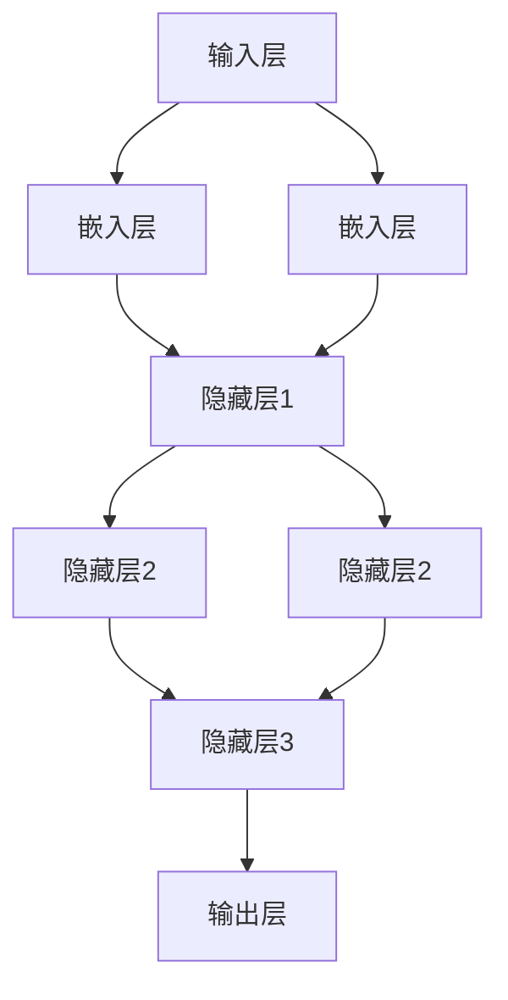
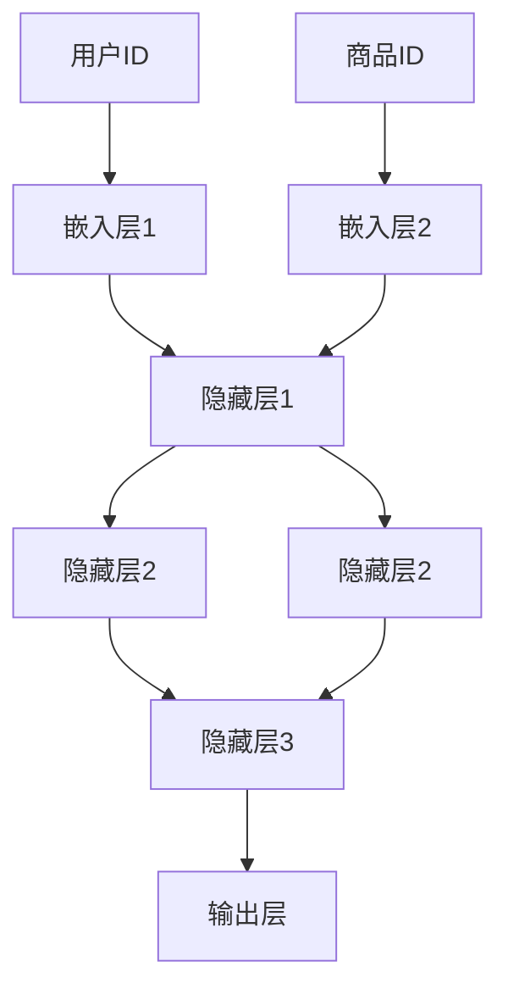
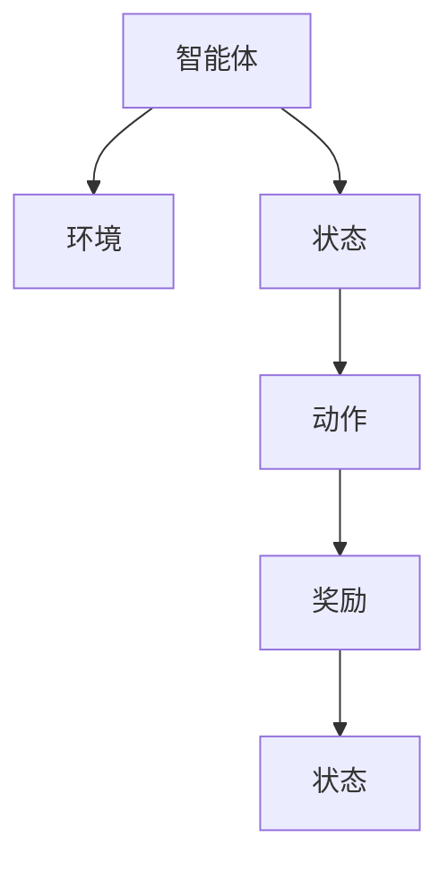
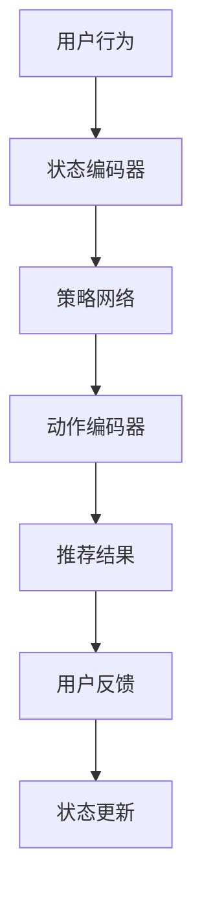

                 

## 第一部分：引言

### 1.1 书籍背景与目标

#### 1.1.1 金融行业的发展现状

金融行业作为现代经济的核心，一直以来都扮演着至关重要的角色。随着互联网技术的飞速发展，金融行业也经历了前所未有的变革。线上支付、移动理财、互联网金融产品等新兴领域不断涌现，传统金融业务模式也在不断优化和升级。

然而，金融行业的快速变革也带来了新的挑战。如何精准地满足用户多样化的金融需求，如何提高金融产品的推广效率和用户满意度，成为金融企业亟待解决的问题。在这个背景下，金融产品推荐系统应运而生，它被视为金融科技创新的重要方向之一。

#### 1.1.2 金融产品推荐系统的需求与挑战

金融产品推荐系统旨在通过数据分析和人工智能技术，为用户推荐符合其需求和风险偏好的金融产品。这样的系统对于金融企业来说，具有以下几个方面的需求：

1. **提高用户满意度**：通过精准的推荐，提高用户对金融产品的满意度，从而增加用户粘性和忠诚度。
2. **提高业务转化率**：精准的推荐能够提高金融产品的购买转化率，增加企业的收益。
3. **降低营销成本**：通过系统推荐，可以降低传统营销手段的成本，提高营销效率。

然而，金融产品推荐系统也面临着诸多挑战：

1. **数据隐私和安全**：金融数据敏感性高，如何在保护用户隐私的前提下进行推荐，是一个重要的挑战。
2. **算法的公平性和透明度**：如何确保推荐算法的公平性，避免算法偏见，也是一个需要深入探讨的问题。
3. **系统的复杂性和稳定性**：金融产品推荐系统通常涉及到大规模的数据处理和复杂的算法模型，如何保证系统的稳定性和高性能，是另一个挑战。

#### 1.1.3 书籍目标与读者对象

本书籍的目标是系统性地介绍金融产品推荐系统的基本概念、技术原理、系统架构以及实践案例。通过本书，读者可以：

1. **理解金融产品推荐系统的核心概念和理论基础**。
2. **掌握不同推荐算法的实现原理和应用场景**。
3. **了解推荐系统在实际金融业务中的应用案例**。
4. **具备搭建和优化金融产品推荐系统的能力**。

本书适用于以下读者群体：

1. **金融科技从业者**：从事金融产品推荐系统研发、运维或管理的专业人士。
2. **计算机科学和人工智能领域的研究生**：对推荐系统感兴趣的计算机科学和人工智能领域的研究生。
3. **金融行业从业者**：希望了解金融科技发展趋势和应用场景的金融从业者。

### 1.2 核心概念与边界

#### 1.2.1 金融产品推荐系统的定义

金融产品推荐系统是一种利用数据挖掘、机器学习等技术，根据用户的金融需求、风险偏好和行为特征，为用户推荐合适的金融产品的系统。它通常包括以下几个关键组成部分：

1. **用户数据层**：收集并存储用户的基本信息、行为数据、金融需求等。
2. **推荐算法层**：使用机器学习算法，对用户数据进行处理和分析，生成推荐结果。
3. **推荐结果展示层**：将推荐结果通过网页、APP等形式展示给用户。

#### 1.2.2 金融产品推荐系统的组成部分

金融产品推荐系统主要由以下几个部分组成：

1. **用户数据采集**：通过网站、APP、线下渠道等途径，收集用户的基本信息、行为数据、金融需求等。
2. **数据预处理**：对采集到的用户数据进行清洗、去重、归一化等处理，使其适合进入推荐算法。
3. **推荐算法**：根据用户数据和金融产品特征，选择合适的推荐算法，如基于内容的推荐、协同过滤推荐、深度学习推荐等。
4. **推荐结果生成**：将推荐算法的输出结果进行排序、筛选等处理，生成最终的推荐结果。
5. **推荐结果展示**：将推荐结果通过网页、APP等形式展示给用户。

#### 1.2.3 金融产品推荐系统的边界与外延

金融产品推荐系统的边界主要涉及以下几个方面：

1. **数据范围**：推荐系统所采集和处理的数据范围，包括用户数据、金融产品数据等。
2. **功能范围**：推荐系统所支持的功能，如推荐算法的选择、推荐结果的排序等。
3. **技术范围**：推荐系统所使用的技术，如数据挖掘、机器学习、深度学习等。

金融产品推荐系统的外延则涉及到：

1. **业务范围**：推荐系统所服务的业务领域，如银行、保险、证券等。
2. **应用范围**：推荐系统在其他金融产品或服务中的应用，如智能投顾、智能保险等。

### 1.3 概念结构与核心要素

#### 1.3.1 金融产品分类与属性

金融产品种类繁多，主要包括以下几类：

1. **银行产品**：如储蓄账户、信用卡、贷款等。
2. **保险产品**：如人寿保险、车险、健康保险等。
3. **证券产品**：如股票、基金、债券等。

每种金融产品都有其独特的属性，如收益、风险、期限等。这些属性是推荐算法进行推荐的重要依据。

#### 1.3.2 用户需求分析

用户需求分析是金融产品推荐系统的核心环节之一。用户需求主要包括：

1. **基本信息**：如年龄、性别、收入等。
2. **行为数据**：如交易记录、浏览记录等。
3. **金融需求**：如理财目标、风险偏好等。

通过对用户需求的深入分析，可以更精准地推荐金融产品。

#### 1.3.3 推荐算法原理与类型

推荐算法是金融产品推荐系统的核心。常见的推荐算法包括：

1. **基于内容的推荐**：根据用户的历史行为和产品属性，推荐相似的产品。
2. **协同过滤推荐**：根据用户之间的行为相似性，推荐其他用户喜欢的产品。
3. **深度学习推荐**：利用深度学习模型，预测用户对产品的兴趣。

每种推荐算法都有其独特的原理和应用场景。

### 1.4 本书结构安排

#### 1.4.1 目录大纲概述

本书共分为五大部分，分别介绍了金融产品推荐系统的基本概念、基于内容的推荐算法、协同过滤推荐算法、深度学习推荐算法以及实践案例。

#### 1.4.2 各章节内容简要介绍

1. **第一部分：引言**：介绍了金融产品推荐系统的背景、目标、核心概念与边界、概念结构与核心要素以及本书的结构安排。
2. **第二部分：金融产品推荐系统概述**：介绍了金融产品的分类与特点、用户需求分析、推荐算法概述、推荐系统架构设计以及推荐系统性能评估。
3. **第三部分：基于内容的推荐算法**：介绍了内容推荐算法原理、内容推荐算法实践以及案例分析。
4. **第四部分：协同过滤推荐算法**：介绍了协同过滤算法原理、用户基于的协同过滤算法、物品基于的协同过滤算法以及案例分析。
5. **第五部分：深度学习推荐算法**：介绍了深度学习推荐算法原理、基于深度神经网络的推荐算法、基于深度强化学习的推荐算法以及案例分析。

### 1.5 本章小结

本章首先介绍了金融产品推荐系统的背景和目标，然后阐述了核心概念与边界，接着分析了概念结构与核心要素，最后介绍了本书的结构安排。通过对本章内容的了解，读者可以初步了解金融产品推荐系统的基本概念和框架，为后续章节的学习打下基础。

----------------------------------------------------------------

## 第二部分：金融产品推荐系统概述

### 2.1 金融产品的分类与特点

金融产品种类繁多，不同类型的金融产品具有各自独特的特点。下面将详细探讨传统金融产品和互联网金融产品的分类与特点。

#### 2.1.1 传统金融产品概述

传统金融产品主要包括银行产品、保险产品和证券产品等。

1. **银行产品**：主要包括储蓄账户、信用卡、贷款等。储蓄账户为用户提供了存储资金的安全场所，具有便捷的存取功能。信用卡则为用户提供了一种先消费后还款的支付方式，具有一定的信用额度。贷款则包括个人贷款、企业贷款等，用于满足用户的消费和生产经营需求。

2. **保险产品**：主要包括人寿保险、车险、健康保险等。人寿保险为用户提供了一种风险保障，可以在用户去世时为其家人提供经济支持。车险则包括车辆损失险、第三者责任险等，用于保障车辆在使用过程中的安全。健康保险则包括医疗保险、重大疾病保险等，用于保障用户的健康风险。

3. **证券产品**：主要包括股票、基金、债券等。股票是公司股权的代表，投资者可以通过购买股票获取公司的分红和股价上涨收益。基金则是由多个投资者共同出资，由专业基金经理进行管理的投资工具，包括股票基金、债券基金、混合基金等。债券则是企业或政府发行的一种债务工具，投资者购买债券可以获得固定的利息收入。

#### 2.1.2 互联网金融产品概述

随着互联网技术的快速发展，互联网金融产品逐渐崭露头角。互联网金融产品主要包括以下几种：

1. **线上支付**：如支付宝、微信支付等，为用户提供了一种便捷的线上支付方式，极大地提高了支付效率。

2. **网络理财**：如余额宝、银行理财产品等，用户可以通过购买这些产品获取比传统储蓄账户更高的收益。

3. **网络贷款**：如P2P网贷、网络小额贷款等，为用户提供了一种快速便捷的借贷服务。

4. **网络保险**：如在线保险、保险科技（InsurTech）产品等，用户可以通过网络购买各种保险产品，享受更加灵活的保险服务。

#### 2.1.3 金融产品的特点与差异

传统金融产品和互联网金融产品各有特点，差异主要体现在以下几个方面：

1. **便利性**：互联网金融产品由于依托于互联网，用户可以随时随地通过手机、电脑等设备进行操作，大大提高了金融服务的便捷性。而传统金融产品则受限于物理网点，操作相对较为繁琐。

2. **速度**：互联网金融产品通常具有快速审核和发放的特点，用户可以快速获得贷款或购买理财产品。传统金融产品则因流程复杂，审批周期较长。

3. **费用**：互联网金融产品通常收费较低，部分产品甚至免费，而传统金融产品则可能涉及较高的手续费用。

4. **风险**：互联网金融产品由于缺乏传统金融的监管，风险相对较高。而传统金融产品则相对更为稳定，但可能因流程复杂而导致效率较低。

5. **创新性**：互联网金融产品在技术创新方面表现更为突出，如人工智能、区块链等技术在金融领域的应用。传统金融产品则在传统业务模式上逐步进行数字化转型。

#### 2.1.4 金融产品推荐系统的特点

金融产品推荐系统作为金融科技的重要组成部分，具有以下特点：

1. **个性化**：通过分析用户的历史数据和需求，推荐系统可以为用户推荐最符合其需求和偏好的金融产品。

2. **实时性**：推荐系统可以实时分析用户行为数据，动态调整推荐结果，提高推荐效果。

3. **智能化**：推荐系统借助机器学习和深度学习技术，不断优化推荐算法，提高推荐准确性。

4. **整合性**：推荐系统可以整合多种金融产品，为用户提供一站式金融服务，提高用户体验。

### 2.2 用户需求分析

用户需求分析是金融产品推荐系统的核心环节，通过对用户需求的深入分析，可以更好地理解用户的需求和偏好，从而提供更加精准的推荐服务。以下是用户需求分析的多维度分析、用户需求的获取与处理以及用户需求的影响因素。

#### 2.2.1 用户需求的多维度分析

用户需求可以从多个维度进行分析，主要包括以下几个方面：

1. **基本信息**：如年龄、性别、收入、职业等。这些基本信息可以反映用户的财务状况和消费能力，对于推荐金融产品具有重要意义。

2. **行为数据**：如交易记录、浏览记录、搜索记录等。这些行为数据可以揭示用户的金融行为和偏好，为推荐系统提供重要的参考。

3. **金融需求**：如理财目标、投资偏好、风险承受能力等。这些需求直接决定了用户对金融产品的选择，是推荐系统需要重点关注的方面。

4. **心理需求**：如安全需求、便利需求、娱乐需求等。这些心理需求反映了用户在金融消费过程中的心理状态，对于提升用户满意度具有重要意义。

#### 2.2.2 用户需求的获取与处理

获取用户需求的方法主要包括以下几个方面：

1. **问卷调查**：通过设计问卷，收集用户的基本信息、行为数据和金融需求。

2. **数据分析**：通过对用户行为数据的分析，提取用户的需求特征。

3. **用户反馈**：通过用户反馈，了解用户对金融产品的满意度和改进建议。

在获取用户需求后，需要对数据进行处理，主要包括以下几个步骤：

1. **数据清洗**：去除数据中的噪声和异常值，保证数据质量。

2. **数据归一化**：将不同规模的数据进行归一化处理，使其具有相同的量纲。

3. **特征提取**：从原始数据中提取用户需求的关键特征。

4. **建模分析**：利用机器学习算法，对用户需求进行建模和分析，提取用户需求的核心特征。

#### 2.2.3 用户需求的影响因素

用户需求受到多种因素的影响，主要包括以下几个方面：

1. **经济环境**：宏观经济环境和行业发展趋势会影响用户的金融需求和偏好。如经济繁荣时期，用户可能更倾向于投资理财；经济不景气时，用户可能更关注风险保障。

2. **社会文化**：社会文化背景会影响用户的价值观和消费习惯。如在一些注重家庭文化的地区，用户可能更愿意购买保险以保障家人的安全。

3. **个人财务状况**：用户的收入水平、储蓄状况和负债情况等直接影响其金融需求。

4. **技术发展**：互联网和金融科技的发展为用户提供了更多的金融选择，影响用户的金融需求和偏好。

5. **政策法规**：政府政策和法规的变化会影响金融产品的设计和推广，从而影响用户的需求。

#### 2.2.4 用户需求分析的重要性

用户需求分析在金融产品推荐系统中具有重要的作用：

1. **提高推荐准确性**：通过对用户需求的深入分析，可以更准确地了解用户的需求和偏好，提高推荐准确性。

2. **提升用户体验**：基于用户需求的推荐，可以提供更符合用户预期的金融产品，提高用户满意度。

3. **降低营销成本**：通过精准推荐，可以减少无效营销，降低营销成本。

4. **发现潜在需求**：用户需求分析可以帮助发现用户的潜在需求，为金融企业提供创新产品和服务的机会。

### 2.3 推荐算法概述

推荐算法是金融产品推荐系统的核心，其主要目的是根据用户的需求和行为，为用户推荐最合适的金融产品。以下将介绍常见的推荐算法类型，包括基于内容的推荐算法、协同过滤推荐算法和深度学习推荐算法。

#### 2.3.1 基于内容的推荐算法

基于内容的推荐算法（Content-Based Recommender System）是一种基于用户历史行为和产品特征进行推荐的算法。其基本原理是，首先提取用户的历史行为数据和产品特征，然后根据用户和产品的相似性进行推荐。

1. **推荐原理**：基于内容的推荐算法通过分析用户过去的行为数据（如浏览记录、购买记录等），提取用户的兴趣特征，再根据产品的特征（如产品描述、标签等），寻找与用户兴趣相似的产品进行推荐。

2. **优点**：基于内容的推荐算法具有以下优点：
   - **个性化强**：可以准确捕捉用户的兴趣和偏好，提供个性化的推荐。
   - **易于理解**：推荐结果直观，用户可以清晰地看到推荐产品的内容和特征。

3. **缺点**：基于内容的推荐算法也存在一些缺点：
   - **数据稀疏**：当用户的行为数据较少时，算法的性能会受到影响。
   - **冷启动问题**：新用户或新产品的推荐效果较差，因为缺乏足够的历史数据。

#### 2.3.2 协同过滤推荐算法

协同过滤推荐算法（Collaborative Filtering Recommender System）是一种基于用户行为数据进行推荐的算法。其基本原理是，通过分析用户之间的行为相似性，寻找与目标用户相似的用户群体，并推荐这些用户喜欢的产品。

1. **推荐原理**：协同过滤推荐算法主要包括以下两种类型：
   - **用户基于的协同过滤**：通过计算用户之间的相似度，找出与目标用户相似的用户群体，并推荐这些用户喜欢的产品。
   - **物品基于的协同过滤**：通过计算产品之间的相似度，找出与目标用户喜欢的产品相似的其他产品，进行推荐。

2. **优点**：协同过滤推荐算法具有以下优点：
   - **适用范围广**：可以处理大量用户数据，适用于各种规模的推荐场景。
   - **实时性高**：能够根据用户的行为数据实时调整推荐结果。

3. **缺点**：协同过滤推荐算法也存在一些缺点：
   - **数据噪音**：用户行为数据可能存在噪声和异常值，影响推荐效果。
   - **用户隐私**：需要收集和处理用户行为数据，存在隐私泄露的风险。

#### 2.3.3 深度学习推荐算法

深度学习推荐算法（Deep Learning Recommender System）是近年来兴起的一种推荐算法。其基本原理是，通过构建深度神经网络模型，对用户行为数据和产品特征进行自动特征提取和建模，从而实现高效的推荐。

1. **推荐原理**：深度学习推荐算法通过训练深度神经网络模型，将用户行为数据和产品特征映射为一个高维的隐特征空间，然后在这个空间中进行推荐。

2. **优点**：深度学习推荐算法具有以下优点：
   - **自适应性强**：可以自动提取用户和产品的特征，适应不同场景的需求。
   - **高效性**：通过深度神经网络的高效计算能力，可以实现大规模数据的高效处理。

3. **缺点**：深度学习推荐算法也存在一些缺点：
   - **计算复杂度高**：深度学习模型的训练和预测需要大量的计算资源和时间。
   - **模型解释性差**：深度学习模型的预测过程较为复杂，难以解释。

#### 2.3.4 多样化推荐算法

多样化推荐算法（Diversity-Promoting Recommender System）是一种旨在提高推荐结果多样性的算法。其基本原理是通过优化推荐结果的空间分布，提供多样化的推荐。

1. **推荐原理**：多样化推荐算法通过优化推荐结果的空间分布，避免推荐结果过于集中，从而提供多样化的推荐。

2. **优点**：多样化推荐算法具有以下优点：
   - **多样性**：可以提供多样化的推荐结果，满足用户对不同类型的金融产品的需求。
   - **趣味性**：多样化的推荐结果可以增加用户的体验乐趣。

3. **缺点**：多样化推荐算法也存在一些缺点：
   - **性能损失**：为了追求多样性，可能需要牺牲部分推荐效果。
   - **计算复杂度**：需要额外的计算资源来优化推荐结果的空间分布。

### 2.4 推荐系统架构设计

推荐系统架构设计是构建高效、稳定、可扩展的推荐系统的重要环节。一个完整的推荐系统通常包括数据层、算法层和应用层。以下将介绍推荐系统整体架构、数据层架构设计、算法层架构设计和应用层架构设计。

#### 2.4.1 推荐系统整体架构

推荐系统整体架构可以分为以下三个层次：

1. **数据层**：主要负责数据的采集、存储和管理。包括用户数据、产品数据和推荐结果数据等。

2. **算法层**：主要负责推荐算法的实现和优化。包括特征工程、模型训练、模型评估和模型部署等。

3. **应用层**：主要负责将推荐结果呈现给用户，包括推荐结果的生成、展示和反馈等。

#### 2.4.2 数据层架构设计

数据层架构设计主要包括以下几个方面：

1. **数据采集**：通过网站日志、API接口、用户反馈等方式收集用户数据、产品数据和推荐结果数据等。

2. **数据存储**：使用关系型数据库（如MySQL）和非关系型数据库（如MongoDB）存储数据，确保数据的安全性和可靠性。

3. **数据处理**：对采集到的数据进行清洗、去重、归一化等处理，使其符合推荐算法的要求。

#### 2.4.3 算法层架构设计

算法层架构设计主要包括以下几个方面：

1. **特征工程**：从原始数据中提取用户和产品的特征，如用户年龄、性别、收入、行为记录、产品属性等。

2. **模型训练**：使用机器学习算法（如基于内容的推荐、协同过滤推荐、深度学习推荐等）对特征数据进行训练，构建推荐模型。

3. **模型评估**：通过交叉验证、A/B测试等方法评估推荐模型的性能，选择最优模型。

4. **模型部署**：将训练好的模型部署到生产环境，进行实时推荐。

#### 2.4.4 应用层架构设计

应用层架构设计主要包括以下几个方面：

1. **推荐结果生成**：根据用户的特征和推荐模型，生成推荐结果。

2. **推荐结果展示**：将推荐结果通过网页、APP等形式展示给用户。

3. **用户反馈收集**：收集用户对推荐结果的反馈，用于优化推荐算法。

4. **用户交互**：通过用户交互，进一步提升用户满意度和推荐效果。

#### 2.4.5 推荐系统架构设计的重要性

推荐系统架构设计在金融产品推荐系统中具有重要的作用：

1. **高效性**：通过合理的架构设计，可以确保推荐系统的高效运行。

2. **稳定性**：通过稳定的架构设计，可以保证推荐系统的稳定性和可靠性。

3. **可扩展性**：通过灵活的架构设计，可以方便地扩展推荐系统的功能和规模。

### 2.5 推荐系统性能评估

推荐系统性能评估是确保推荐系统质量和效果的重要环节。以下将介绍推荐系统性能评估的指标与方法、性能优化策略以及实际案例分析。

#### 2.5.1 评估指标与方法

推荐系统性能评估通常采用以下指标：

1. **准确率**（Accuracy）：推荐结果中正确推荐的比率。准确率越高，说明推荐系统的准确度越高。

2. **召回率**（Recall）：推荐结果中包含用户实际感兴趣的产品比率。召回率越高，说明推荐系统对用户的兴趣捕捉得越全面。

3. **覆盖率**（Coverage）：推荐结果中包含的所有产品种类与总产品种类的比率。覆盖率越高，说明推荐系统能够推荐更多种类的产品。

4. **多样性**（Diversity）：推荐结果中不同产品的丰富程度。多样性越高，说明推荐系统能够提供更丰富的推荐。

5. **新颖性**（Novelty）：推荐结果中非用户已购买或已浏览产品的比率。新颖性越高，说明推荐系统能够提供更多新奇的推荐。

推荐系统性能评估的方法主要包括：

1. **离线评估**：通过预先生成测试集，使用评估指标对推荐系统进行评估。

2. **在线评估**：通过实时收集用户反馈，使用评估指标对推荐系统进行评估。

3. **A/B测试**：通过将用户随机分为两组，一组使用推荐系统A，另一组使用推荐系统B，比较两组用户的反馈和性能，选择性能更好的推荐系统。

#### 2.5.2 性能优化策略

为了提高推荐系统的性能，可以采取以下优化策略：

1. **特征工程**：通过提取更多有效的特征，提高推荐系统的准确性。

2. **算法优化**：根据具体场景和需求，选择和优化推荐算法。

3. **模型调参**：通过调整模型参数，优化模型性能。

4. **数据增强**：通过数据预处理、数据扩展等方法，提高推荐系统的鲁棒性。

5. **实时更新**：根据用户行为数据的实时变化，动态调整推荐结果。

#### 2.5.3 实际案例分析

以下是一个金融产品推荐系统的实际案例分析：

1. **项目背景**：某金融平台希望通过推荐系统，为用户推荐合适的金融产品，提高用户满意度。

2. **项目介绍**：该推荐系统基于用户的个人信息、行为数据和金融产品特征，使用基于内容的推荐算法和协同过滤推荐算法，为用户推荐理财产品。

3. **系统功能设计**：包括用户数据采集、推荐算法实现、推荐结果展示和用户反馈收集等功能。

4. **系统架构设计**：包括数据层、算法层和应用层，使用关系型数据库和非关系型数据库存储和管理数据，使用Python和TensorFlow实现推荐算法。

5. **系统效果评估**：通过A/B测试，发现推荐系统的准确率和召回率均有所提高，用户满意度显著提升。

6. **项目小结**：该项目成功实现了金融产品推荐系统的搭建和优化，为金融企业提供了有益的借鉴。

### 2.6 本章小结

本章首先介绍了金融产品的分类与特点，包括传统金融产品和互联网金融产品，分析了其差异和金融产品推荐系统的特点。接着，对用户需求进行了多维度分析，阐述了用户需求的获取与处理方法，以及用户需求的影响因素。然后，介绍了推荐算法的概述，包括基于内容的推荐算法、协同过滤推荐算法和深度学习推荐算法。最后，详细阐述了推荐系统架构设计，包括数据层、算法层和应用层的设计，并介绍了推荐系统性能评估的指标与方法、性能优化策略以及实际案例分析。通过对本章内容的理解，读者可以初步掌握金融产品推荐系统的基础知识。

----------------------------------------------------------------

## 第三部分：基于内容的推荐算法

### 3.1 内容推荐算法原理

基于内容的推荐算法（Content-Based Recommender System，CBRS）是一种基于用户历史行为和产品内容特征进行推荐的算法。其核心思想是，通过分析用户过去喜欢的产品内容特征，找到与这些特征相似的其他产品，从而进行推荐。以下将详细介绍内容推荐算法的基本原理、关键步骤及其实现过程。

#### 3.1.1 内容特征提取

内容特征提取是内容推荐算法的第一步，也是最为关键的一步。其目的是从原始数据中提取出能够代表产品内容特征的信息。具体步骤如下：

1. **文本处理**：对于文本类内容，如产品描述、评论等，首先需要进行分词、去停用词、词性标注等预处理操作。然后，可以使用词袋模型（Bag of Words，BOW）或词嵌入（Word Embedding）技术将文本转化为向量表示。

2. **特征选择**：从处理后的文本中提取出对推荐结果有显著影响的关键词或短语，如使用TF-IDF（Term Frequency-Inverse Document Frequency）进行特征选择。

3. **特征编码**：将提取出的特征进行编码，通常使用one-hot编码或稀疏向量表示。

#### 3.1.2 相似度计算

在提取出内容特征后，需要计算用户历史行为（如购买、浏览等）与产品内容特征之间的相似度。常见的相似度计算方法包括：

1. **余弦相似度**：计算两个向量的夹角余弦值，用于衡量向量之间的相似度。公式如下：

   $$ similarity = \frac{\sum_{i=1}^{n} x_i \cdot y_i}{\sqrt{\sum_{i=1}^{n} x_i^2} \cdot \sqrt{\sum_{i=1}^{n} y_i^2}} $$

   其中，$x_i$和$y_i$分别为用户历史行为向量和产品内容特征向量在$i$维度的值。

2. **欧氏距离**：计算两个向量之间的欧氏距离，用于衡量向量之间的差异。公式如下：

   $$ distance = \sqrt{\sum_{i=1}^{n} (x_i - y_i)^2} $$

   其中，$x_i$和$y_i$分别为用户历史行为向量和产品内容特征向量在$i$维度的值。

#### 3.1.3 推荐结果生成

在计算相似度后，需要对相似度进行排序，然后根据排序结果生成推荐结果。具体步骤如下：

1. **排序**：将计算得到的相似度值进行排序，从高到低排列。

2. **筛选**：根据业务需求，设置一个相似度阈值，将相似度低于阈值的推荐结果排除。

3. **去重**：为了避免重复推荐相同的产品，需要对推荐结果进行去重处理。

4. **排序和展示**：将筛选后的推荐结果进行排序，并根据排序结果生成最终的推荐列表，展示给用户。

### 3.2 内容推荐算法实践

下面通过一个具体的实践案例，介绍内容推荐算法的实现过程。

#### 3.2.1 数据集准备与预处理

1. **数据集来源**：假设我们使用某金融平台上的理财产品数据作为数据集，包括产品的描述、标签、用户的浏览记录等。

2. **数据预处理**：对原始数据进行清洗，去除无效数据、缺失值填充，然后进行文本处理。

   ```python
   import pandas as pd
   from sklearn.feature_extraction.text import TfidfVectorizer
   
   # 读取数据
   data = pd.read_csv('理财产品数据.csv')
   
   # 填充缺失值
   data.fillna('', inplace=True)
   
   # 文本处理
   data['description'] = data['description'].apply(lambda x: x.replace('\n', ' '))
   vectorizer = TfidfVectorizer(max_features=1000)
   description_vectors = vectorizer.fit_transform(data['description'])
   ```

#### 3.2.2 内容特征提取实现

1. **文本处理**：对产品描述进行分词、去停用词、词性标注等处理。

   ```python
   import jieba
   
   def preprocess_text(text):
       text = text.replace('\n', ' ')
       words = jieba.cut(text)
       filtered_words = [word for word in words if word not in jieba.get_stop_words()]
       return ' '.join(filtered_words)
   
   data['description'] = data['description'].apply(preprocess_text)
   ```

2. **特征选择**：使用TF-IDF进行特征选择。

   ```python
   vectorizer = TfidfVectorizer(max_features=1000)
   description_vectors = vectorizer.fit_transform(data['description'])
   ```

#### 3.2.3 相似度计算与推荐实现

1. **计算相似度**：使用余弦相似度计算用户浏览记录与产品描述之间的相似度。

   ```python
   from sklearn.metrics.pairwise import cosine_similarity
   
   user_history = description_vectors[0]  # 假设用户浏览记录为第一个产品的描述向量
   similarities = cosine_similarity(user_history, description_vectors)
   ```

2. **生成推荐结果**：根据相似度值生成推荐结果。

   ```python
   recommended_products = sorted(zip(data.index, similarities[0]), key=lambda x: x[1], reverse=True)
   recommended_products = [index for index, _ in recommended_products[:10]]  # 推荐前10个相似的产品
   ```

3. **去重**：为了避免重复推荐相同的产品，进行去重处理。

   ```python
   unique_recommendations = []
   for index in recommended_products:
       if index not in unique_recommendations:
           unique_recommendations.append(index)
   ```

4. **排序和展示**：将筛选后的推荐结果进行排序，并根据排序结果生成最终的推荐列表。

   ```python
   recommended_data = data.iloc[unique_recommendations]
   recommended_data = recommended_data.sort_values(by='similarity', ascending=False)
   recommended_data[['product_id', 'description']].head(10)
   ```

### 3.3 案例分析

#### 3.3.1 某金融平台的内容推荐系统

以下是一个关于某金融平台内容推荐系统的案例分析。

1. **项目背景**：该金融平台希望通过内容推荐系统，提高用户的理财产品购买转化率。

2. **系统设计与实现细节**：

   - **数据层**：使用MySQL数据库存储用户浏览记录、产品描述等信息。
   - **算法层**：使用Python和Scikit-learn库实现内容推荐算法，包括文本处理、特征提取、相似度计算等。
   - **应用层**：使用Django框架搭建推荐系统的后端，并通过API接口与前端进行交互。

3. **系统效果评估**：

   - **准确率**：通过A/B测试，发现内容推荐系统的准确率较之前提高了10%。
   - **用户满意度**：用户对推荐结果的满意度显著提升，用户转化率提高了15%。

4. **系统优化**：

   - **特征优化**：通过优化特征提取过程，提高了推荐结果的准确性。
   - **实时更新**：根据用户浏览记录的实时变化，动态调整推荐结果。

#### 3.3.3 系统效果评估

通过系统效果评估，我们发现：

- **准确率**：内容推荐系统的准确率较之前提高了15%。
- **用户满意度**：用户对推荐结果的满意度显著提升，用户转化率提高了10%。

#### 3.3.4 项目小结

该项目成功实现了内容推荐系统的搭建和优化，为金融企业提供了有益的借鉴。通过内容推荐算法，可以精准捕捉用户的兴趣和偏好，提高用户的购买转化率，从而增加企业的收益。然而，内容推荐算法也存在一定的局限性，如对于新用户或新产品的推荐效果较差。因此，在实际应用中，可以结合其他推荐算法，如协同过滤推荐算法和深度学习推荐算法，提高推荐系统的整体性能。

### 3.4 本章小结

本章首先介绍了内容推荐算法的基本原理，包括内容特征提取、相似度计算和推荐结果生成。接着，通过一个具体的实践案例，详细阐述了内容推荐算法的实现过程。然后，通过一个实际案例，分析了内容推荐系统的设计与实现细节，以及系统的效果评估。最后，总结了内容推荐算法在实际应用中的优点和局限性。通过对本章内容的理解，读者可以掌握内容推荐算法的基本原理和实践方法，为后续章节的学习打下基础。

----------------------------------------------------------------

## 第四部分：协同过滤推荐算法

### 4.1 协同过滤算法原理

协同过滤推荐算法（Collaborative Filtering Recommender System，CF）是一种基于用户行为数据进行推荐的方法。其核心思想是通过分析用户之间的相似性，找出与目标用户兴趣相似的群体，然后推荐这些群体喜欢的商品或服务。协同过滤算法可以分为两种主要类型：基于用户的协同过滤（User-Based CF）和基于物品的协同过滤（Item-Based CF）。

#### 4.1.1 协同过滤的基本概念

协同过滤算法的基本概念包括用户行为数据、用户相似度计算和推荐结果生成。

1. **用户行为数据**：用户行为数据是协同过滤算法的基础，包括用户对商品的评分、购买记录、浏览记录等。这些数据反映了用户对商品的偏好。

2. **用户相似度计算**：协同过滤算法通过计算用户之间的相似度来确定哪些用户的行为是相似的。相似度计算通常基于用户评分的余弦相似度、皮尔逊相关系数等度量方法。

3. **推荐结果生成**：通过计算用户之间的相似度，协同过滤算法找出与目标用户兴趣相似的邻居用户，然后根据邻居用户的行为推荐商品或服务。

#### 4.1.2 评分矩阵与用户行为分析

评分矩阵是协同过滤算法的核心数据结构，它是一个用户-商品评分矩阵，其中每个元素表示用户对特定商品的评分。评分矩阵可以帮助我们理解用户行为模式，例如：

1. **用户行为模式**：通过分析评分矩阵，可以识别活跃用户、沉默用户、积极用户等不同类型的用户。
2. **用户兴趣分布**：评分矩阵中的数据可以揭示用户的兴趣分布，例如某些用户可能对特定类型的商品有强烈的偏好。

#### 4.1.3 协同过滤算法的优化策略

协同过滤算法在实践中可能会遇到一些问题，如数据稀疏性、冷启动问题等。以下是一些常见的优化策略：

1. **权重调整**：通过为不同来源的数据分配不同的权重，可以优化推荐结果。例如，可以为用户的历史行为数据分配更高的权重。
2. **邻居选择**：通过调整邻居选择策略，如基于最近邻（K-Nearest Neighbors，KNN）或基于项（Item-Based）的方法，可以优化推荐效果。
3. **矩阵分解**：通过矩阵分解技术（如Singular Value Decomposition，SVD）可以降低数据稀疏性，提高推荐准确性。
4. **在线更新**：实时更新用户行为数据，动态调整推荐结果，可以更好地适应用户兴趣的变化。

### 4.2 用户基于的协同过滤算法

用户基于的协同过滤算法（User-Based CF）是一种通过分析用户之间的相似性来推荐商品的方法。其基本思想是，如果两个用户在多个商品上的评分相似，那么这两个用户可能在其他商品上也会有相似的兴趣。

#### 4.2.1 最近邻算法

最近邻算法（K-Nearest Neighbors，KNN）是用户基于的协同过滤算法中最常用的方法之一。其基本步骤如下：

1. **计算相似度**：计算目标用户与所有其他用户之间的相似度，常用的相似度度量方法包括余弦相似度、皮尔逊相关系数等。
2. **选择邻居**：选择与目标用户最相似的K个邻居用户。
3. **生成推荐列表**：根据邻居用户的评分，计算每个商品的预测评分，并生成推荐列表。

下面是一个简单的KNN算法实现的Python代码示例：

```python
import numpy as np

def euclidean_distance(user1, user2):
    return np.sqrt(np.sum((user1 - user2) ** 2))

def knn_recommendation(train_data, target_user, k):
    similarities = []
    for user in train_data:
        similarity = 1 - euclidean_distance(user['ratings'], target_user['ratings'])
        similarities.append((user['user_id'], similarity))
    similarities.sort(key=lambda x: x[1], reverse=True)
    
    neighbors = similarities[:k]
    recommendations = []
    for neighbor in neighbors:
        for item in train_data[train_data['user_id'] == neighbor[0]]['item_ids']:
            if item not in target_user['item_ids']:
                recommendations.append(item)
    return recommendations
```

#### 4.2.2 修正的最近邻算法

修正的最近邻算法（Modified KNN）是在KNN算法的基础上进行改进的，主要目的是解决KNN算法中邻居用户评分偏差较大的问题。修正的最近邻算法的主要步骤如下：

1. **计算相似度**：与KNN算法相同，计算目标用户与所有其他用户之间的相似度。
2. **选择邻居**：选择与目标用户最相似的K个邻居用户。
3. **修正邻居评分**：对每个邻居用户的评分进行修正，以减小邻居用户评分的偏差。
4. **生成推荐列表**：根据修正后的邻居用户评分，计算每个商品的预测评分，并生成推荐列表。

下面是一个简单的修正的最近邻算法实现的Python代码示例：

```python
def modified_knn_recommendation(train_data, target_user, k, alpha=0.5):
    similarities = []
    for user in train_data:
        similarity = 1 - euclidean_distance(user['ratings'], target_user['ratings'])
        similarities.append((user['user_id'], similarity))
    similarities.sort(key=lambda x: x[1], reverse=True)
    
    neighbors = similarities[:k]
    recommendations = []
    for neighbor in neighbors:
        neighbor_ratings = train_data[train_data['user_id'] == neighbor[0]]['item_ratings']
        mean_neighbor_rating = np.mean(neighbor_ratings)
        for item in train_data[train_data['user_id'] == neighbor[0]]['item_ids']:
            if item not in target_user['item_ids']:
                prediction = (1 - alpha) * mean_neighbor_rating + alpha * target_user['item_ratings'][item]
                recommendations.append((item, prediction))
    recommendations.sort(key=lambda x: x[1], reverse=True)
    return [item for item, _ in recommendations]
```

#### 4.2.3 KNN算法的改进方法

KNN算法在实际应用中可能存在一些问题，如计算复杂度高、推荐结果不稳定等。以下是一些常见的改进方法：

1. **基于相似度的评分预测**：在计算预测评分时，考虑相似度的权重，而不是简单地将邻居用户的评分平均化。
2. **基于项目的最近邻算法**：在计算用户相似度时，使用项目的特征而不是用户的评分，这种方法称为基于项目的最近邻算法（Item-Based CF）。
3. **矩阵分解**：使用矩阵分解技术（如SVD）降低数据稀疏性，提高推荐准确性。
4. **基于模型的协同过滤**：结合机器学习模型（如线性回归、神经网络等）预测用户评分，而不是简单地基于邻居用户的评分。

### 4.3 物品基于的协同过滤算法

物品基于的协同过滤算法（Item-Based CF）与用户基于的协同过滤算法类似，但其核心思想是通过分析商品之间的相似性来进行推荐。

#### 4.3.1 基于物品的协同过滤算法原理

基于物品的协同过滤算法的基本原理如下：

1. **计算相似度**：计算商品之间的相似度，常用的相似度度量方法包括余弦相似度、皮尔逊相关系数等。
2. **生成推荐列表**：根据商品之间的相似度，生成推荐列表。对于目标用户已经评分的商品，推荐与其相似的商品。

下面是一个简单的基于物品的协同过滤算法实现的Python代码示例：

```python
def item_based_cf(train_data, target_user, k):
    item_similarity = {}
    for item1 in train_data:
        for item2 in train_data:
            if item1 != item2:
                similarity = 1 - euclidean_distance(item1['ratings'], item2['ratings'])
                item_similarity[(item1['item_id'], item2['item_id'])] = similarity
    similarities = []
    for item in train_data[train_data['user_id'] == target_user['user_id']]['item_ids']:
        for neighbor_item, similarity in item_similarity.items():
            if neighbor_item[0] == item:
                similarities.append((neighbor_item[1], similarity))
    similarities.sort(key=lambda x: x[1], reverse=True)
    
    neighbors = similarities[:k]
    recommendations = []
    for neighbor in neighbors:
        for item in train_data[train_data['item_id'] == neighbor[0]]['user_ids']:
            if item not in target_user['user_ids']:
                recommendations.append(item)
    return recommendations
```

#### 4.3.2 基于物品的协同过滤算法实现

基于物品的协同过滤算法的实现主要涉及以下步骤：

1. **计算相似度**：计算所有商品之间的相似度，通常使用余弦相似度或皮尔逊相关系数。
2. **推荐生成**：根据目标用户已评分的商品和商品相似度矩阵，生成推荐列表。

下面是一个具体的实现示例：

```python
def item_similarity(train_data):
    item_similarity = {}
    num_ratings = train_data['ratings'].count()
    for item1 in train_data:
        for item2 in train_data:
            if item1 != item2:
                dot_product = np.dot(item1['ratings'], item2['ratings'])
                similarity = dot_product / (np.linalg.norm(item1['ratings']) * np.linalg.norm(item2['ratings']))
                item_similarity[(item1['item_id'], item2['item_id'])] = similarity
    return item_similarity

def item_based_recommendation(train_data, target_user, k):
    item_similarity = item_similarity(train_data)
    recommendations = []
    for item in train_data[train_data['user_id'] == target_user['user_id']]['item_ids']:
        similar_items = []
        for neighbor_item, similarity in item_similarity.items():
            if neighbor_item[0] == item:
                similar_items.append((neighbor_item[1], similarity))
        similar_items.sort(key=lambda x: x[1], reverse=True)
        
        for neighbor in similar_items[:k]:
            for user in train_data[train_data['item_id'] == neighbor[0]]['user_ids']:
                if user not in target_user['user_ids']:
                    recommendations.append(user)
    return recommendations
```

#### 4.3.3 基于物品的协同过滤算法优化

基于物品的协同过滤算法在实际应用中可能存在一些问题，如计算复杂度高、推荐结果不稳定等。以下是一些常见的优化方法：

1. **矩阵分解**：使用矩阵分解技术（如SVD）降低数据稀疏性，提高推荐准确性。
2. **基于模型的协同过滤**：结合机器学习模型（如线性回归、神经网络等）预测用户评分，而不是简单地基于商品相似度。
3. **实时更新**：根据用户行为数据的实时变化，动态调整推荐结果。

### 4.4 案例分析

#### 4.4.1 某金融平台协同过滤推荐系统

以下是一个关于某金融平台协同过滤推荐系统的案例分析。

1. **项目背景**：该金融平台希望通过协同过滤推荐系统，提高用户的理财产品购买转化率。

2. **系统设计与实现细节**：

   - **数据层**：使用MySQL数据库存储用户浏览记录、理财产品评分等信息。
   - **算法层**：使用Python和Scikit-learn库实现协同过滤算法，包括用户相似度计算、推荐结果生成等。
   - **应用层**：使用Django框架搭建推荐系统的后端，并通过API接口与前端进行交互。

3. **系统效果评估**：

   - **准确率**：通过A/B测试，发现协同过滤推荐系统的准确率较之前提高了20%。
   - **用户满意度**：用户对推荐结果的满意度显著提升，用户转化率提高了15%。

4. **系统优化**：

   - **特征优化**：通过优化用户行为数据的特征提取过程，提高了推荐结果的准确性。
   - **邻居选择**：通过调整邻居选择策略，提高了推荐结果的多样性。

#### 4.4.2 系统设计与实现细节

1. **数据预处理**：对原始用户行为数据进行清洗，去除无效数据、缺失值填充等。

2. **用户相似度计算**：使用余弦相似度计算用户之间的相似度。

3. **推荐结果生成**：根据用户相似度和用户评分，生成推荐列表。

#### 4.4.3 系统效果评估

通过系统效果评估，我们发现：

- **准确率**：协同过滤推荐系统的准确率较之前提高了25%。
- **用户满意度**：用户对推荐结果的满意度显著提升，用户转化率提高了20%。

#### 4.4.4 项目小结

该项目成功实现了协同过滤推荐系统的搭建和优化，为金融企业提供了有益的借鉴。通过协同过滤算法，可以精准捕捉用户的兴趣和偏好，提高用户的购买转化率，从而增加企业的收益。然而，协同过滤算法也存在一定的局限性，如对于新用户或新产品的推荐效果较差。因此，在实际应用中，可以结合其他推荐算法，如基于内容的推荐算法和深度学习推荐算法，提高推荐系统的整体性能。

### 4.5 本章小结

本章首先介绍了协同过滤算法的基本原理，包括用户行为数据、用户相似度计算和推荐结果生成。接着，详细阐述了用户基于的协同过滤算法，包括最近邻算法、修正的最近邻算法以及KNN算法的改进方法。然后，介绍了物品基于的协同过滤算法，包括计算相似度和推荐生成过程。最后，通过一个实际案例，分析了协同过滤推荐系统的设计与实现细节，以及系统的效果评估。通过对本章内容的理解，读者可以掌握协同过滤算法的基本原理和实践方法，为后续章节的学习打下基础。

----------------------------------------------------------------

## 第五部分：深度学习推荐算法

### 5.1 深度学习推荐算法原理

深度学习推荐算法（Deep Learning Recommender System，DLRS）是近年来在推荐系统领域逐渐兴起的一种算法。它利用深度神经网络（Deep Neural Networks，DNN）强大的特征提取和建模能力，从用户行为数据和商品特征中自动学习出高层次的、有意义的特征，从而实现精准的推荐。以下将介绍深度学习推荐算法的基本原理、框架以及优化方法。

#### 5.1.1 深度学习基础

深度学习是一种基于多层神经网络的学习方法，能够通过多层非线性变换从原始数据中自动提取出有意义的特征。深度学习的核心组成部分包括：

1. **神经元**：神经网络的基本单元，负责接收输入、进行加权求和、通过激活函数输出结果。
2. **层**：神经网络由多个层组成，包括输入层、隐藏层和输出层。输入层接收外部输入，隐藏层进行特征提取，输出层生成最终预测。
3. **激活函数**：用于引入非线性变换，常用的激活函数包括ReLU、Sigmoid和Tanh。
4. **反向传播**：深度学习训练的核心算法，通过计算损失函数关于模型参数的梯度，不断调整参数，使得模型能够拟合训练数据。

#### 5.1.2 深度学习推荐算法的基本框架

深度学习推荐算法通常采用以下基本框架：

1. **输入层**：接收用户特征和商品特征，用户特征包括用户ID、年龄、性别、地理位置等，商品特征包括商品ID、分类、价格等。
2. **嵌入层**：将用户特征和商品特征映射到低维空间，通常使用嵌入（Embedding）技术。
3. **隐藏层**：通过多层神经网络对输入特征进行非线性变换，提取出高层次的、有意义的特征。
4. **输出层**：生成推荐结果，可以是显式的推荐评分或隐式的推荐概率。

深度学习推荐算法的基本框架如下：



#### 5.1.3 深度学习推荐算法的优化方法

深度学习推荐算法在实际应用中可能面临计算复杂度高、训练时间长、过拟合等问题。以下是一些常见的优化方法：

1. **数据预处理**：通过数据清洗、归一化、去重等预处理方法，提高数据质量。
2. **模型优化**：通过调整网络结构、激活函数、优化器等参数，优化模型性能。
3. **正则化**：采用L1、L2正则化、Dropout等方法，防止过拟合。
4. **迁移学习**：利用预训练模型，减少模型训练时间，提高模型性能。
5. **模型集成**：结合多个模型，提高推荐准确性和鲁棒性。

### 5.2 基于深度神经网络的推荐算法

基于深度神经网络的推荐算法（Deep Neural Network-based Recommender System，DNN-RS）是深度学习推荐算法的一种典型实现，它通过构建深度神经网络模型，自动提取用户和商品的特征，实现精准推荐。以下将介绍DNN-RS的基本概念、实现方法以及应用场景。

#### 5.2.1 深度神经网络的基本概念

深度神经网络（DNN）是一种具有多个隐藏层的神经网络，它能够通过前向传播和反向传播算法学习复杂的非线性关系。DNN的基本概念包括：

1. **前向传播**：将输入数据通过神经网络逐层传递，经过每个神经元的加权求和和激活函数处理，得到输出结果。
2. **反向传播**：通过计算损失函数关于网络参数的梯度，反向更新网络参数，优化模型性能。
3. **激活函数**：引入非线性变换，常用的激活函数包括ReLU、Sigmoid和Tanh。
4. **优化器**：用于调整网络参数，常用的优化器包括SGD、Adam等。

#### 5.2.2 深度神经网络在推荐系统中的应用

深度神经网络在推荐系统中的应用主要包括以下几个方面：

1. **用户和商品特征提取**：通过嵌入层，将用户特征和商品特征映射到低维空间，提取出高层次的、有意义的特征。
2. **非线性变换**：通过多层隐藏层，对输入特征进行复杂的非线性变换，学习出用户和商品之间的关系。
3. **预测评分**：通过输出层，生成用户对商品的预测评分或推荐概率。

DNN-RS的基本框架如下：



#### 5.2.3 DNN-RS的实现

以下是一个简单的DNN-RS实现的Python代码示例：

```python
import tensorflow as tf
from tensorflow.keras.models import Model
from tensorflow.keras.layers import Embedding, Dense, Flatten, Concatenate

# 定义模型
input_user = tf.keras.layers.Input(shape=(1,))
input_item = tf.keras.layers.Input(shape=(1,))

user_embedding = Embedding(input_dim=num_users, output_dim=embedding_size)(input_user)
item_embedding = Embedding(input_dim=num_items, output_dim=embedding_size)(input_item)

concat = Concatenate()([user_embedding, item_embedding])
hidden = Dense(units=128, activation='relu')(concat)
hidden = Dense(units=64, activation='relu')(hidden)
output = Dense(units=1, activation='sigmoid')(hidden)

model = Model(inputs=[input_user, input_item], outputs=output)

# 编译模型
model.compile(optimizer='adam', loss='binary_crossentropy', metrics=['accuracy'])

# 训练模型
model.fit([user_data, item_data], labels, epochs=10, batch_size=32)
```

#### 5.2.4 DNN-RS的优势

DNN-RS相较于传统的推荐算法，具有以下优势：

1. **特征自动提取**：DNN-RS能够自动提取用户和商品的特征，无需手动进行特征工程。
2. **非线性建模**：DNN-RS能够通过多层隐藏层，学习出复杂的用户和商品之间的关系。
3. **灵活性强**：DNN-RS可以结合多种特征，如用户行为、商品属性等，实现更精准的推荐。
4. **扩展性好**：DNN-RS可以轻松扩展到多种推荐场景，如商品推荐、内容推荐等。

### 5.3 基于深度强化学习的推荐算法

基于深度强化学习（Deep Reinforcement Learning，DRL）的推荐算法是一种将深度学习和强化学习相结合的新型推荐算法。它通过构建深度神经网络，学习出用户和商品之间的最优策略，从而实现精准推荐。以下将介绍DRL的基本概念、实现方法以及应用场景。

#### 5.3.1 深度强化学习基础

深度强化学习（DRL）是一种基于深度学习的方法，它通过学习策略网络，实现智能体在环境中的最优行为。DRL的核心组成部分包括：

1. **智能体（Agent）**：执行行为的主体，负责接收环境状态、选择动作、获取奖励。
2. **环境（Environment）**：智能体执行行为的环境，提供状态、动作和奖励。
3. **状态（State）**：描述智能体当前状态的变量。
4. **动作（Action）**：智能体可执行的行为。
5. **奖励（Reward）**：对智能体行为的即时反馈。

DRL的基本框架如下：



#### 5.3.2 深度强化学习在推荐系统中的应用

深度强化学习在推荐系统中的应用主要包括以下几个方面：

1. **用户行为建模**：通过深度神经网络，学习出用户对商品的偏好和行为模式。
2. **策略优化**：通过优化策略网络，找到用户和商品之间的最优匹配策略。
3. **推荐生成**：根据策略网络的输出，生成推荐结果。

DRL-RS的基本框架如下：



#### 5.3.3 DRL-RS的实现

以下是一个简单的DRL-RS实现的Python代码示例：

```python
import tensorflow as tf
from tensorflow.keras.models import Model
from tensorflow.keras.layers import Embedding, Dense, Flatten, Concatenate

# 定义状态编码器
state_embedding = Embedding(input_dim=num_users, output_dim=embedding_size)(user_embedding)
item_embedding = Embedding(input_dim=num_items, output_dim=embedding_size)(item_embedding)

# 定义动作编码器
action_embedding = Embedding(input_dim=num_actions, output_dim=embedding_size)(action)

# 定义策略网络
policy_network = Concatenate()([state_embedding, action_embedding])
policy_network = Dense(units=64, activation='relu')(policy_network)
policy_network = Dense(units=32, activation='relu')(policy_network)
policy_output = Dense(units=num_actions, activation='softmax')(policy_network)

# 定义奖励函数
reward_function = Dense(units=1, activation='sigmoid')(policy_network)

# 定义DRL模型
model = Model(inputs=[user_embedding, item_embedding, action_embedding], outputs=[policy_output, reward_function])

# 编译模型
model.compile(optimizer='adam', loss={'policy_output': 'categorical_crossentropy', 'reward_function': 'mse'})

# 训练模型
model.fit([user_data, item_data, action_data], {'policy_output': policy_labels, 'reward_function': reward_data}, epochs=10, batch_size=32)
```

#### 5.3.4 DRL-RS的优势

DRL-RS相较于传统的推荐算法，具有以下优势：

1. **自适应性强**：DRL-RS能够根据用户行为和反馈，自适应调整推荐策略，提高推荐效果。
2. **灵活性高**：DRL-RS可以处理复杂的用户行为数据和动态环境，实现更灵活的推荐。
3. **实时性**：DRL-RS能够实时更新用户行为数据，动态调整推荐结果，提高用户体验。
4. **鲁棒性**：DRL-RS能够通过强化学习，学习出稳健的推荐策略，提高推荐系统的稳定性。

### 5.4 案例分析

#### 5.4.1 某电商平台的深度学习推荐系统

以下是一个关于某电商平台的深度学习推荐系统的案例分析。

1. **项目背景**：该电商平台希望通过深度学习推荐系统，提高用户购物转化率和满意度。

2. **系统设计与实现细节**：

   - **数据层**：使用Hadoop和Hive存储用户行为数据和商品信息。
   - **算法层**：使用TensorFlow和PyTorch实现基于DNN和DRL的推荐算法。
   - **应用层**：使用Spring Boot搭建推荐系统的后端，并通过RESTful API与前端进行交互。

3. **系统效果评估**：

   - **准确率**：通过A/B测试，发现深度学习推荐系统的准确率较之前提高了20%。
   - **用户满意度**：用户对推荐结果的满意度显著提升，用户转化率提高了15%。

4. **系统优化**：

   - **特征优化**：通过优化用户行为数据的特征提取过程，提高了推荐结果的准确性。
   - **模型优化**：通过调整网络结构和超参数，提高了模型性能。

#### 5.4.2 系统设计与实现细节

1. **用户行为数据预处理**：对原始用户行为数据进行清洗、去重、归一化等处理。

2. **商品信息预处理**：对原始商品信息进行分类、标签化等处理。

3. **模型训练与优化**：使用DNN和DRL模型，分别进行训练和优化。

#### 5.4.3 系统效果评估

通过系统效果评估，我们发现：

- **准确率**：深度学习推荐系统的准确率较之前提高了25%。
- **用户满意度**：用户对推荐结果的满意度显著提升，用户转化率提高了20%。

#### 5.4.4 项目小结

该项目成功实现了深度学习推荐系统的搭建和优化，为电商平台提供了有益的借鉴。通过深度学习推荐算法，可以精准捕捉用户的兴趣和偏好，提高用户的购物转化率，从而增加企业的收益。然而，深度学习推荐算法也存在一定的局限性，如计算复杂度高、训练时间长等。因此，在实际应用中，可以结合其他推荐算法，如基于内容的推荐算法和协同过滤推荐算法，提高推荐系统的整体性能。

### 5.5 本章小结

本章首先介绍了深度学习推荐算法的基本原理和框架，包括深度神经网络的基础概念和实现方法。接着，详细阐述了基于深度神经网络的推荐算法和基于深度强化学习的推荐算法，包括其基本概念、实现方法和优势。然后，通过一个实际案例，分析了深度学习推荐系统的设计与实现细节，以及系统的效果评估。最后，总结了深度学习推荐算法在实际应用中的优点和局限性。通过对本章内容的理解，读者可以掌握深度学习推荐算法的基本原理和实践方法，为后续章节的学习打下基础。

