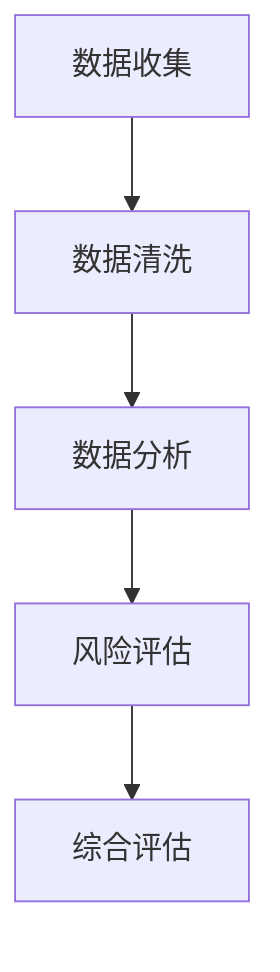
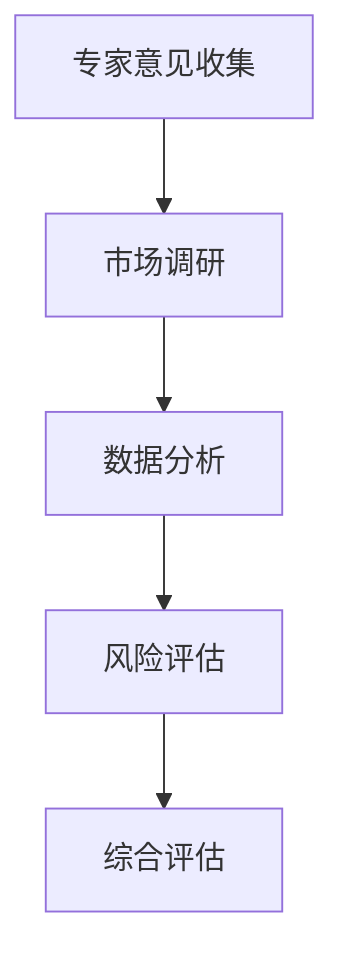

                 

### 第1章：金融产品生命周期价值评估概述

#### 1.1 问题背景

在当今复杂多变的金融市场环境中，金融产品的生命周期管理变得尤为重要。金融产品生命周期价值评估作为金融风险管理的重要组成部分，涉及到金融产品的设计、发行、运营、退出等各个阶段。随着金融市场的不断发展和金融产品的多样化，如何对金融产品的生命周期进行有效的管理和评估，已经成为金融机构和企业面临的重要课题。

金融产品生命周期价值评估的目的在于通过全面分析和评估金融产品的市场前景、风险程度、成本效益等，帮助金融机构和企业做出科学的决策，实现产品的稳健发展和企业的长期利益。例如，对于一家银行而言，如何评估一款新发行的理财产品在市场中的表现和潜在风险，以确定是否值得推广和投入更多的资源；对于一家金融科技公司，如何对一款创新型金融产品进行生命周期价值评估，以确定其商业可行性。

#### 1.2 问题描述

金融产品生命周期价值评估涉及多个方面，包括产品的设计、发行、运营、退出等各个阶段。在这个过程中，需要对产品的市场前景、风险程度、成本效益等进行全面的分析和评估。

**市场前景**：评估金融产品在市场上的接受程度和发展潜力。这包括产品的目标客户群体、市场需求、竞争对手分析等。

**风险程度**：分析金融产品在生命周期内可能面临的各种风险，如信用风险、市场风险、运营风险等。信用风险包括债务人违约风险；市场风险包括利率、汇率、股票市场波动等；运营风险包括系统故障、合规风险等。

**成本效益**：评估金融产品在生命周期内的运营成本与预期收益的对比。这包括产品的开发成本、运营成本、营销成本等，以及产品的预期收益和市场占有率。

#### 1.3 问题解决

为了有效解决金融产品生命周期价值评估问题，可以采用以下方法：

1. **定量分析**：通过数据收集和统计分析，对金融产品的各个阶段进行量化分析，评估其市场前景和风险程度。这可以包括历史数据分析和市场预测模型。

2. **定性分析**：结合专家意见和市场调研，对金融产品的市场环境和运营情况进行定性分析，以补充定量分析的不足。这可以包括专家访谈、市场调研报告等。

3. **生命周期模型**：构建金融产品生命周期模型，对产品在各个阶段的表现进行模拟和预测，为评估提供依据。这可以包括产品生命周期阶段划分、关键因素分析等。

#### 1.4 边界与外延

金融产品生命周期价值评估不仅涉及金融产品本身，还包括与产品相关的市场环境、政策法规、技术进步等因素。因此，在进行评估时，需要综合考虑这些外部因素对产品生命周期的影响。

例如，市场环境的波动（如经济周期、利率变化等）可能会影响金融产品的市场需求和风险程度；政策法规的变化（如监管政策、税收政策等）可能会影响产品的运营成本和合规性；技术进步（如金融科技的发展）可能会改变金融产品的竞争格局和商业模式。

#### 1.5 概念结构与核心要素组成

- **金融产品生命周期**：金融产品从设计、发行、运营到退出的整个过程。

  - 设计阶段：产品构思、需求分析、方案设计等。
  - 发行阶段：产品开发、测试、上线等。
  - 运营阶段：产品推广、客户服务、风险管理等。
  - 退出阶段：产品退出市场、资产处置等。

- **生命周期价值**：金融产品在整个生命周期内为投资者带来的总收益。

  - 市场前景：产品的市场需求和增长潜力。
  - 风险程度：产品面临的各种风险，如信用风险、市场风险等。
  - 成本效益：产品的运营成本与预期收益的对比。

- **关键要素**：市场需求、竞争态势、风险因素、运营成本、技术发展等。

  - 市场需求：产品在市场上的接受程度和发展潜力。
  - 竞争态势：产品面临的竞争对手和市场环境。
  - 风险因素：产品在生命周期内可能面临的各种风险。
  - 运营成本：产品的开发、运营、营销等成本。
  - 技术发展：金融科技的发展趋势和影响。

通过以上分析，我们可以看出，金融产品生命周期价值评估是一个复杂而关键的过程，涉及到多个方面和多个阶段的综合分析。有效的生命周期价值评估可以帮助金融机构和企业更好地管理产品生命周期，实现可持续发展。

### 第2章：金融产品生命周期价值评估核心概念

#### 2.1 金融产品生命周期价值

**概念**：金融产品生命周期价值（Life Cycle Value of Financial Product，简称LCV）是指金融产品在其整个生命周期内为投资者带来的总收益。它不仅包括了产品在运营阶段的收益，还包括了产品的初始开发成本、维护成本以及其他相关的成本。

**属性特征对比表**：

| 特征          | 说明                                                         |
| ------------- | ------------------------------------------------------------ |
| **市场前景**  | 产品在市场上的接受程度和发展潜力。                           |
| **风险程度**  | 产品在生命周期内可能面临的各种风险，如信用风险、市场风险、运营风险等。 |
| **成本效益**  | 产品在生命周期内的运营成本与预期收益的对比。                   |

- **市场前景**：市场前景直接关系到产品的市场需求和增长潜力。一个具有广阔市场前景的金融产品往往能够吸引更多的投资者，从而实现更高的收益。市场前景可以通过市场调研、竞争对手分析、客户需求调查等方法进行评估。
- **风险程度**：金融产品的风险程度是评估其生命周期价值的重要因素。风险程度越高，产品的生命周期价值可能越低，因为高风险可能导致收益的不确定性和投资损失。信用风险、市场风险和运营风险是金融产品面临的主要风险类型。
- **成本效益**：成本效益是衡量产品运营成本与预期收益之间关系的重要指标。一个具有良好成本效益的金融产品能够在保证收益的同时，最大限度地降低运营成本，从而提高生命周期价值。

**ER实体关系图架构**：

```mermaid
erDiagram
  FinancialProduct ||--|{ LifeCycleStage } : 包含
  FinancialProduct ||--|{ LifeCycleValue } : 对应
  LifeCycleStage ||--|{ KeyFactor } : 拥有
  KeyFactor ||--|{ Value } : 拥有
```

在这个ER图中，`FinancialProduct`（金融产品）与`LifeCycleStage`（生命周期阶段）和`LifeCycleValue`（生命周期价值）建立了一对多的关系，每个金融产品包含多个生命周期阶段，每个阶段又包含多个关键因素和相应的值。

#### 2.2 生命周期模型

**概念**：生命周期模型是对金融产品生命周期进行模拟和预测的方法。通过生命周期模型，可以分析和预测金融产品在不同阶段的表现和潜在价值，从而为评估和决策提供依据。

**ER实体关系图架构**：

```mermaid
erDiagram
  LifeCycleModel ||--|{ ProductStage } : 包括
  LifeCycleModel ||--|{ KeyFactor } : 拥有
  ProductStage ||--|{ StagePerformance } : 拥有
  KeyFactor ||--|{ FactorValue } : 拥有
```

在这个ER图中，`LifeCycleModel`（生命周期模型）与`ProductStage`（产品阶段）和`KeyFactor`（关键因素）建立了一对多的关系，每个生命周期模型包含多个产品阶段和多个关键因素，每个产品阶段又包含多个关键因素值和相应的表现。

**构建生命周期模型**：

1. **阶段划分**：根据金融产品的特点和市场环境，将产品生命周期划分为不同的阶段，如设计阶段、开发阶段、测试阶段、发行阶段、运营阶段、退出阶段等。

2. **关键因素分析**：识别每个阶段的关键因素，如市场需求、竞争态势、风险程度、成本效益等。

3. **性能预测**：基于历史数据和专家经验，对每个阶段的表现进行预测，包括收益、成本、风险等。

4. **综合评估**：通过生命周期模型，对金融产品的生命周期价值进行综合评估，为决策提供依据。

通过生命周期模型，可以更加全面和系统地分析和预测金融产品的生命周期价值，从而帮助企业更好地管理产品生命周期，实现可持续发展。

### 第3章：金融产品生命周期价值评估方法

#### 3.1 定量分析

定量分析是金融产品生命周期价值评估中常用的一种方法，其主要通过数据分析方法，对金融产品的各个阶段进行量化分析，评估其市场前景和风险程度。以下是定量分析的具体步骤：

1. **数据收集**：收集与金融产品相关的各种数据，包括历史市场数据、竞争对手数据、客户需求数据、运营成本数据等。

2. **数据清洗**：对收集到的数据进行分析和处理，去除无效和错误的数据，确保数据的准确性和可靠性。

3. **数据分析**：使用统计分析、时间序列分析等方法，对清洗后的数据进行深入分析，挖掘数据背后的规律和趋势。

4. **风险评估**：根据分析结果，评估金融产品在各个阶段可能面临的风险，如信用风险、市场风险、运营风险等。

5. **综合评估**：将数据分析结果与专家意见和市场调研结果相结合，对金融产品的生命周期价值进行综合评估。

**Mermaid流程图**：



定量分析的优势在于其客观性和精确性，能够为金融产品生命周期价值评估提供可靠的数据支持。然而，定量分析也存在一定的局限性，如数据收集的难度、数据分析方法的适用性等。因此，在实际应用中，定量分析通常需要与定性分析相结合，以弥补其不足。

#### 3.2 定性分析

定性分析是金融产品生命周期价值评估中的另一种重要方法，其主要通过专家意见和市场调研，对金融产品的市场环境和运营情况进行定性分析。以下是定性分析的具体步骤：

1. **专家意见收集**：通过专家访谈、专家问卷等形式，收集专家对金融产品生命周期价值的看法和建议。

2. **市场调研**：通过市场调研，了解市场需求、竞争对手情况、客户满意度等信息，为评估提供参考。

3. **数据分析**：对收集到的专家意见和市场调研结果进行整理和分析，挖掘数据背后的趋势和规律。

4. **风险评估**：根据分析结果，评估金融产品在各个阶段可能面临的风险，如信用风险、市场风险、运营风险等。

5. **综合评估**：将定性分析结果与定量分析结果相结合，对金融产品的生命周期价值进行综合评估。

**Mermaid流程图**：



定性分析的优势在于其灵活性和适用性，能够根据具体情况对金融产品的生命周期价值进行深入分析。然而，定性分析也存在一定的主观性，容易受到专家经验和市场环境的影响。因此，在实际应用中，定性分析通常需要与定量分析相结合，以提高评估的准确性。

#### 3.3 定量分析与定性分析的优势与不足

- **定量分析**：

  **优势**：客观性、精确性、可重复性。定量分析依赖于数据和模型，能够提供量化的结果，便于比较和评估。

  **不足**：数据收集难度大、分析方法适用性有限。定量分析需要大量准确的数据，且不同分析方法的适用性不同，可能无法完全反映金融产品的实际情况。

- **定性分析**：

  **优势**：灵活性、适用性、深入性。定性分析能够根据具体情况，灵活地调整分析方法和评估指标，深入挖掘金融产品的特点和问题。

  **不足**：主观性、不确定性、难以量化。定性分析依赖于专家经验和市场调研，容易受到主观因素的影响，且结果难以量化，难以与其他分析方法进行比较。

在实际应用中，定量分析和定性分析应相互补充，结合使用。通过定量分析提供客观的数据支持，通过定性分析深入挖掘金融产品的特点和问题，从而提高金融产品生命周期价值评估的准确性和可靠性。

### 第4章：金融产品生命周期价值评估案例分析

#### 4.1 案例背景

为了更好地理解和应用金融产品生命周期价值评估的方法，我们选择了一款实际发行的债券产品作为案例进行分析。该债券产品由某知名金融机构发行，期限为5年，年利率为4.5%，面向个人和企业投资者。该产品的发行目的是为该金融机构的长期投资项目提供融资，同时为投资者提供稳定的收益。

在分析过程中，我们将利用定量分析和定性分析的方法，对该债券产品的生命周期价值进行评估，以帮助金融机构和企业更好地管理产品生命周期，实现长期利益。

#### 4.2 案例分析

**定量分析**：

1. **数据收集**：

   我们收集了以下数据：

   - 历史市场数据：过去5年的债券市场利率、发行量、交易量等。
   - 竞争对手数据：其他金融机构发行的同类债券的利率、期限、发行量等。
   - 客户需求数据：投资者的偏好、购买意愿、投资额度等。
   - 运营成本数据：债券产品的开发成本、维护成本、营销成本等。

2. **数据分析**：

   - 市场需求分析：通过对历史市场数据的分析，我们得出了债券市场的趋势和投资者的偏好。结果表明，长期债券的发行量和交易量呈逐年上升趋势，说明市场需求较大。
   - 风险评估：通过分析竞争对手数据和客户需求数据，我们评估了该债券产品的信用风险和市场风险。结果表明，该债券产品的信用风险较低，市场风险适中。
   - 成本效益分析：通过对运营成本数据的分析，我们计算了该债券产品的成本效益。结果表明，该债券产品的成本较低，预期收益较高，具有较好的成本效益。

3. **综合评估**：

   根据定量分析的结果，我们对该债券产品的生命周期价值进行了综合评估。结果表明，该债券产品在市场前景、风险程度和成本效益方面表现良好，具有较高的生命周期价值。

**定性分析**：

1. **专家意见收集**：

   我们邀请了金融行业的专家，包括银行家、投资顾问和金融分析师等，对债券产品的生命周期价值进行了评估。专家们一致认为，该债券产品具有较好的市场前景和风险控制能力，能够为投资者提供稳定的收益。

2. **市场调研**：

   我们通过问卷调查和访谈的方式，收集了投资者的意见。大多数投资者对债券产品的收益率和安全性表示满意，认为该产品具有较好的投资价值。

3. **综合评估**：

   根据专家意见和市场调研的结果，我们对该债券产品的生命周期价值进行了综合评估。结果表明，该债券产品在市场前景、风险程度和成本效益方面均表现良好，具有较高的生命周期价值。

#### 4.3 案例小结

通过定量分析和定性分析的方法，我们对债券产品的生命周期价值进行了全面评估。结果表明，该债券产品具有较好的市场前景、风险控制和成本效益，具有较高的生命周期价值。这一分析结果对于金融机构和企业来说具有重要的指导意义，可以帮助他们更好地管理产品生命周期，实现长期利益。

此外，本案例也展示了定量分析和定性分析在金融产品生命周期价值评估中的重要作用。通过结合两种方法，可以更全面和准确地评估金融产品的生命周期价值，从而为金融机构和企业的决策提供有力支持。

### 第5章：金融产品生命周期价值评估最佳实践

#### 5.1 市场需求分析

**1. 调查方法与工具**：

市场需求分析是金融产品生命周期价值评估的重要环节。调查方法主要包括问卷调查、深度访谈、焦点小组讨论等。工具方面，可以使用专业的调查软件（如问卷星、金数据等）进行问卷设计和数据分析，提高调查效率和准确性。

**2. 实践技巧**：

- **明确调查目的**：在开展调查前，明确调查的具体目标和问题，确保调查内容具有针对性和有效性。
- **多样化调查手段**：结合问卷调查、深度访谈、焦点小组讨论等多种调查手段，获取多角度的数据，提高分析的全面性。
- **数据真实性检验**：对调查数据进行真实性检验，去除异常值和虚假数据，确保分析结果的准确性。

#### 5.2 风险评估

**1. 风险识别**：

风险评估的首要任务是识别金融产品可能面临的各种风险。风险识别的方法包括历史数据分析、专家访谈、情景分析等。

**2. 风险评估方法**：

- **定性分析**：通过专家评估、专家访谈等方法，对风险进行定性分析，判断风险的严重程度和可能性。
- **定量分析**：使用概率分布、敏感性分析等方法，对风险进行定量分析，计算风险的概率和影响程度。

**3. 实践技巧**：

- **全面性**：在识别和评估风险时，要尽可能全面地考虑各种可能的风险，避免遗漏重要风险。
- **动态调整**：随着市场环境和产品运营情况的变化，动态调整风险评估模型，确保评估结果的实时性和准确性。

#### 5.3 成本效益分析

**1. 成本构成**：

成本效益分析的核心是计算产品的运营成本和预期收益，评估产品的经济效益。成本构成主要包括开发成本、维护成本、营销成本等。

**2. 收益预测**：

收益预测的方法包括历史数据分析、市场调研、专家评估等。通过对比不同预测方法的结果，选择最合适的预测方法。

**3. 实践技巧**：

- **数据准确性**：确保成本和收益数据的准确性，避免因数据错误导致评估结果偏差。
- **敏感性分析**：进行敏感性分析，评估成本和收益的变化对生命周期价值的影响，为决策提供参考。

#### 5.4 综合评估方法

**1. 方法选择**：

根据金融产品的特点和评估需求，选择合适的评估方法。定量分析与定性分析可以相互补充，提高评估的全面性和准确性。

**2. 数据整合**：

将定量分析和定性分析的结果进行整合，形成一个综合评估报告。数据整合的方法包括数据汇总、交叉验证等。

**3. 实践技巧**：

- **平衡定量与定性**：在评估过程中，要平衡定量分析与定性分析的结果，避免过度依赖某一方法。
- **专家评审**：邀请金融专家对评估结果进行评审，确保评估结果的合理性和可靠性。

#### 5.5 案例分享

通过以下案例，我们可以更好地理解金融产品生命周期价值评估的最佳实践。

**案例1：某银行理财产品**

该银行理财产品面向个人投资者，期限为1年，预期年化收益率为4%。在评估过程中，我们采用了以下方法：

- **市场需求分析**：通过问卷调查和深度访谈，了解投资者的需求和偏好，确定产品的目标市场。
- **风险评估**：通过历史数据分析、专家评估等方法，评估产品在信用风险、市场风险等方面的表现。
- **成本效益分析**：计算产品的运营成本和预期收益，进行成本效益分析，确定产品的经济可行性。
- **综合评估**：结合定量分析和定性分析的结果，对产品的生命周期价值进行综合评估。

**案例2：某金融科技公司新产品**

该金融科技公司推出了一款创新型金融产品，旨在为中小企业提供融资服务。在评估过程中，我们采用了以下方法：

- **市场需求分析**：通过市场调研和客户访谈，了解中小企业的融资需求和挑战，确定产品的市场定位。
- **风险评估**：通过情景分析和专家评估，评估产品在信用风险、市场风险、运营风险等方面的表现。
- **成本效益分析**：计算产品的开发成本、运营成本和预期收益，进行成本效益分析，确定产品的商业可行性。
- **综合评估**：结合定量分析和定性分析的结果，对产品的生命周期价值进行综合评估。

通过以上案例，我们可以看到，金融产品生命周期价值评估是一个系统而复杂的过程，需要综合考虑市场需求、风险评估、成本效益等多个方面。通过最佳实践的方法，可以更全面和准确地评估金融产品的生命周期价值，为金融机构和企业的决策提供有力支持。

### 第6章：金融产品生命周期价值评估中的挑战与未来趋势

#### 6.1 挑战分析

在金融产品生命周期价值评估过程中，金融机构和企业可能会面临以下挑战：

1. **数据收集困难**：金融产品生命周期价值评估依赖于大量的数据，包括市场数据、运营数据、客户数据等。然而，数据收集可能面临数据源不完整、数据质量不高、数据获取难度大等问题。

2. **分析方法选择**：定量分析与定性分析各有优缺点，如何选择合适的方法进行综合评估，是一个具有挑战性的问题。此外，不同分析方法之间的数据整合和结果验证也具有一定的难度。

3. **风险评估难度**：金融产品面临的风险多样且复杂，包括信用风险、市场风险、运营风险等。如何准确评估这些风险，确保评估结果的准确性，是一个重要挑战。

4. **模型适用性**：生命周期模型需要根据金融产品的特点和市场环境进行调整，以确保模型的适用性。然而，不同的金融产品具有不同的生命周期特征，如何构建通用且有效的生命周期模型，是一个值得探讨的问题。

#### 6.2 未来趋势

随着金融科技的发展和大数据、人工智能等技术的应用，金融产品生命周期价值评估将呈现出以下趋势：

1. **大数据应用**：大数据技术的应用将大大提高金融产品生命周期价值评估的数据质量和分析效率。通过大数据分析，可以更全面地了解市场动态、客户需求等，为评估提供更准确的依据。

2. **人工智能与机器学习**：人工智能与机器学习技术的应用将进一步提升金融产品生命周期价值评估的精度和自动化程度。通过机器学习算法，可以自动分析和预测金融产品的生命周期价值，减少人为干预。

3. **实时评估与动态调整**：未来金融产品生命周期价值评估将更加注重实时性和动态性。通过实时数据监测和动态调整评估模型，可以快速响应市场变化，确保评估结果的实时性和准确性。

4. **跨界合作**：金融产品生命周期价值评估需要整合多学科的知识和技能，包括金融、科技、营销等。未来，跨界合作将成为主流趋势，通过多学科协同，提高评估的全面性和准确性。

#### 6.3 案例分析

为了更好地理解挑战与未来趋势，我们可以通过以下案例分析：

**案例1：某互联网金融平台**

该互联网金融平台通过大数据分析和人工智能技术，对金融产品的生命周期价值进行实时评估。具体实践包括：

- **数据收集**：通过线上线下渠道收集客户数据、市场数据等，确保数据质量和完整性。
- **数据分析**：使用大数据分析和机器学习算法，对金融产品的市场前景、风险程度、成本效益等进行实时分析和预测。
- **风险评估**：通过情景分析和风险建模，对金融产品面临的各种风险进行实时评估和预警。
- **动态调整**：根据市场动态和客户需求，动态调整评估模型，确保评估结果的实时性和准确性。

**案例2：某商业银行**

该商业银行通过大数据分析和人工智能技术，对金融产品的生命周期价值进行全方位评估。具体实践包括：

- **市场调研**：通过线上线下渠道收集客户需求和市场动态，确保对市场环境的全面了解。
- **风险评估**：使用大数据分析和风险建模技术，对金融产品的风险程度进行实时评估和预警。
- **成本效益分析**：通过大数据分析和机器学习算法，对金融产品的成本效益进行实时分析和预测。
- **跨界合作**：与科技公司合作，整合金融、科技、营销等领域的知识，提高评估的全面性和准确性。

通过以上案例分析，我们可以看到，大数据、人工智能等技术的应用将大大提高金融产品生命周期价值评估的精度和效率，为金融机构和企业的决策提供有力支持。同时，未来金融产品生命周期价值评估将更加注重实时性和动态性，通过多学科协同，实现更全面和准确的评估。

### 第7章：总结与展望

通过本文的详细探讨，我们系统地介绍了金融产品生命周期价值评估的核心概念、评估方法及其在实践中的应用。以下是文章的总结与展望：

#### 总结

本文首先从背景和问题出发，阐述了金融产品生命周期价值评估的必要性和重要性。接着，我们详细分析了金融产品生命周期价值的定义、属性特征，并构建了生命周期模型。随后，通过定量分析和定性分析的方法，我们展示了如何对金融产品的生命周期价值进行评估。最后，通过案例分析和最佳实践，我们提供了具体的应用方法和实践经验。

#### 展望

未来，金融产品生命周期价值评估将在以下几个方面取得进一步发展：

1. **技术进步**：随着大数据、人工智能等技术的不断进步，金融产品生命周期价值评估的精度和效率将大幅提升。特别是机器学习算法的应用，将使得风险评估和收益预测更加准确。

2. **实时性与动态性**：金融市场的变化速度日益加快，未来金融产品生命周期价值评估将更加注重实时性和动态性。通过实时数据监测和动态调整评估模型，可以更快速地响应市场变化。

3. **跨界合作**：金融产品生命周期价值评估需要整合金融、科技、营销等多领域的知识。未来，跨界合作将成为主流趋势，通过多学科协同，实现更全面和准确的评估。

4. **风险管理**：随着金融风险的日益复杂和多样化，金融产品生命周期价值评估将更加重视风险管理的应用。通过建立完善的风险评估体系，可以有效降低金融产品的风险，提高生命周期价值。

总之，金融产品生命周期价值评估在金融风险管理中具有重要的战略意义。通过本文的探讨，我们希望为金融机构和企业的决策提供有力的理论支持和实践指导，推动金融产品生命周期价值评估的深入研究和广泛应用。未来，随着技术的不断进步和应用场景的拓展，金融产品生命周期价值评估将迎来更加广阔的发展前景。作者：AI天才研究院/AI Genius Institute & 禅与计算机程序设计艺术 /Zen And The Art of Computer Programming。

