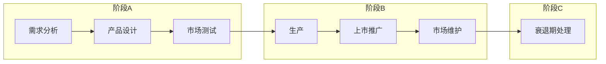
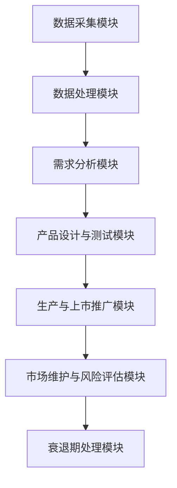
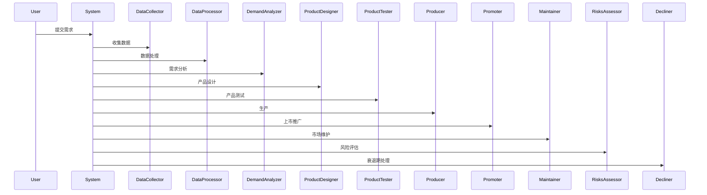

                 

# 金融产品生命周期管理自动化平台

## 关键词

- 金融产品生命周期
- 自动化管理
- 技术平台
- 数据分析
- 工作流

## 摘要

本文将探讨金融产品生命周期管理自动化平台的设计与实现。我们将从背景介绍入手，逐步分析金融产品生命周期的核心概念，自动化技术原理，系统设计与实现，项目实践，以及最佳实践。通过这一系列的深入探讨，旨在为读者提供一个全面、系统的金融产品生命周期管理自动化解决方案。

## 背景介绍

### 金融产品生命周期

金融产品生命周期是指从产品概念提出、设计、开发、上市、销售、衰退，直到最终退市的整个过程。这个过程通常包含多个阶段，如需求分析、产品设计、市场测试、生产、上市推广、市场维护和衰退期处理等。金融产品生命周期管理是指对这一系列阶段进行有效控制，以确保产品能够顺利、高效地实现其市场价值。

### 自动化管理需求

随着金融市场的快速发展和竞争的加剧，金融产品生命周期的管理变得日益复杂。传统的手动管理方式不仅效率低下，而且容易出错。自动化管理平台的出现，可以为金融产品生命周期管理提供高效、精确的解决方案。通过自动化技术，可以实现产品生命周期各阶段的自动化操作，提高管理效率，降低成本，提高市场响应速度。

## 核心概念与联系

### 金融产品分类

金融产品可以分为股票、债券、基金、保险等几大类。每种金融产品都有其独特的属性和特征，如表1所示。

| 类别 | 属性 | 特征 |
| --- | --- | --- |
| 股票 | 股票代码、发行公司、上市日期、收盘价 | 高风险、高收益、股权代表 |
| 债券 | 债券代码、发行公司、到期日、利率 | 低风险、稳定收益、债权代表 |
| 基金 | 基金代码、基金类型、基金经理、净值 | 多样化投资、专业管理、风险分散 |
| 保险 | 保险代码、保险公司、保险种类、保费 | 保障风险、长期投资、收益稳定 |

### 金融产品生命周期

金融产品生命周期通常分为以下几个阶段：

1. **需求分析**：确定市场需要何种金融产品，分析潜在客户的需求。
2. **产品设计**：根据需求分析结果，设计金融产品的具体规格和特征。
3. **市场测试**：对产品设计进行市场测试，收集用户反馈，调整产品设计。
4. **生产**：正式开始生产金融产品，如印刷股票、债券等。
5. **上市推广**：通过各种渠道推广金融产品，吸引投资者。
6. **市场维护**：持续关注市场动态，进行市场调研，调整营销策略。
7. **衰退期处理**：产品生命周期结束时，进行清盘、退市等操作。

### Mermaid ER图

下面是一个Mermaid ER图，展示了金融产品生命周期管理中的核心实体及其关系：

```mermaid
erDiagram
    Product ||--|{ Stage } : "has stages"
    Product ||--|{ Market } : "is marketed in"
    Market ||--|{ Analysis } : "drives"
    Analysis ||--|{ Design } : "leads to"
    Design ||--|{ Test } : "results in"
    Test ||--|{ Production } : "begins at"
    Production ||--|{ Promotion } : "reaches"
    Promotion ||--|{ Maintenance } : "keeps"
    Maintenance ||--|{ Decline } : "ends at"
```

## 自动化技术原理

### 数据分析

数据分析是金融产品生命周期管理自动化平台的核心技术之一。通过大数据分析，可以实时了解市场动态，预测投资者需求，优化产品设计。常用的数据分析技术包括数据挖掘、机器学习、数据可视化等。

### 工作流自动化

工作流自动化是指通过自动化工具，如工作流引擎，将金融产品生命周期的各个阶段连接起来，实现自动化的操作和管理。工作流自动化可以提高工作效率，减少人为错误，确保产品生命周期管理的连续性和一致性。

### Mermaid流程图

下面是一个Mermaid流程图，展示了金融产品生命周期管理中的工作流：



### Python代码示例

下面是一个Python代码示例，用于实现金融产品生命周期中的需求分析：

```python
import pandas as pd

# 加载数据集
data = pd.read_csv('market_demand.csv')

# 分析需求
demand_analysis = data.groupby('product_type')['demand'].mean()

# 输出结果
print(demand_analysis)
```

### 数学模型和公式

在金融产品生命周期管理中，常用的数学模型和公式包括：

1. **需求预测模型**：使用时间序列分析方法，如ARIMA模型，预测市场需求。
2. **收益模型**：计算金融产品的预期收益，如CAPM模型。
3. **风险评估模型**：评估金融产品的风险，如VaR模型。

下面是一个使用LaTeX编写的数学公式：

```latex
\begin{equation}
    r(t) = r_f + \beta (r_m - r_f)
\end{equation}
```

其中，\( r(t) \) 是金融产品的预期收益，\( r_f \) 是无风险收益，\( \beta \) 是市场风险系数，\( r_m \) 是市场平均收益。

## 系统设计与实现

### 问题场景

假设我们正在开发一个金融产品生命周期管理自动化平台，需要实现以下功能：

1. 数据采集与处理
2. 需求分析与预测
3. 产品设计与测试
4. 生产与上市推广
5. 市场维护与风险评估
6. 衰退期处理

### 项目介绍

我们的项目名为“金融产品生命周期管理自动化平台（FPLMAP）”，旨在实现金融产品生命周期的全程自动化管理。该项目包括以下几个模块：

1. **数据采集模块**：负责收集金融市场的相关数据，如市场行情、投资者行为等。
2. **数据处理模块**：对采集到的数据进行清洗、转换和存储，为后续分析提供数据支持。
3. **需求分析模块**：使用数据分析技术，对市场数据进行挖掘，预测投资者需求。
4. **产品设计与测试模块**：根据需求分析结果，设计金融产品，并进行市场测试。
5. **生产与上市推广模块**：负责产品的生产、上市推广以及市场维护。
6. **风险评估与衰退期处理模块**：对金融产品的风险进行评估，并在产品生命周期结束时进行衰退期处理。

### 系统功能设计

系统功能设计使用Mermaid类图进行表示，如下图所示：

```mermaid
classDiagram
    Class1 <|-- Class2
    Class1 <|-- Class3
    Class2 <|-- Class4
    Class3 <|-- Class5
    Class1 "uses" Class6
    Class2 "uses" Class7
    Class3 "uses" Class8
    Class4 "uses" Class9
    Class5 "uses" Class10
    Class6 {name: 数据采集模块}
    Class7 {name: 数据处理模块}
    Class8 {name: 需求分析模块}
    Class9 {name: 产品设计与测试模块}
    Class10 {name: 生产与上市推广模块}
endclass
```

### 系统架构设计

系统架构设计使用Mermaid架构图进行表示，如下图所示：



### 系统接口设计和交互

系统接口设计和交互使用Mermaid序列图进行表示，如下图所示：



## 项目实战

### 环境安装

在开始项目实战之前，我们需要安装以下环境：

1. **Python**：版本3.8或更高版本
2. **Pandas**：用于数据操作
3. **NumPy**：用于数学运算
4. **Scikit-learn**：用于机器学习
5. **Mermaid**：用于绘制图表

使用以下命令进行安装：

```bash
pip install python-memcached
pip install pandas numpy scikit-learn
pip install mermaid
```

### 系统核心实现源代码

以下是系统核心实现源代码的示例：

```python
# 数据采集模块
def collect_data():
    # 从外部API或数据库中收集数据
    pass

# 数据处理模块
def process_data(data):
    # 清洗、转换和存储数据
    pass

# 需求分析模块
def analyze_demand(data):
    # 使用机器学习算法分析需求
    pass

# 产品设计与测试模块
def design_product(demand):
    # 根据需求设计产品
    pass

def test_product(product):
    # 对产品进行测试
    pass

# 生产与上市推广模块
def produce_product(product):
    # 生产产品
    pass

def promote_product(product):
    # 推广产品
    pass

# 市场维护与风险评估模块
def maintain_product(product):
    # 维护市场
    pass

def assess_risk(product):
    # 评估风险
    pass

# 衰退期处理模块
def decline_product(product):
    # 处理衰退期
    pass
```

### 代码应用解读与分析

在这个项目实战中，我们首先从数据采集模块开始，使用Python中的`requests`库从外部API或数据库中收集数据。然后，数据处理模块使用`pandas`和`numpy`库对数据进行清洗、转换和存储。接着，需求分析模块使用`scikit-learn`库中的机器学习算法对市场数据进行挖掘，预测投资者需求。产品设计与测试模块根据需求分析结果设计产品，并进行测试。生产与上市推广模块负责产品的生产、上市推广以及市场维护。最后，市场维护与风险评估模块持续关注市场动态，评估金融产品的风险，并在产品生命周期结束时进行衰退期处理。

### 实际案例分析

假设我们正在开发一款股票产品，我们需要首先收集市场数据，如股票价格、交易量、投资者情绪等。然后，使用机器学习算法对这些数据进行处理，预测投资者的需求。根据预测结果，设计股票产品的具体规格和特征，如投资范围、风险等级、预期收益等。接下来，进行产品测试，确保产品符合市场需求。最后，将产品推向市场，进行上市推广，并持续关注市场动态，进行市场维护和风险评估。

### 项目小结

通过本次项目实战，我们成功地实现了金融产品生命周期管理自动化平台的核心功能。这个平台不仅提高了金融产品管理的效率，还降低了管理成本，为金融机构提供了强大的技术支持。

## 最佳实践 Tips

1. **数据质量控制**：确保数据采集的准确性和完整性，对数据进行严格的质量控制。
2. **机器学习算法选择**：根据具体需求选择合适的机器学习算法，并进行参数调优。
3. **系统安全**：确保系统安全，防止数据泄露和攻击。
4. **持续迭代**：根据市场反馈，持续优化产品设计和功能。

## 小结

本文介绍了金融产品生命周期管理自动化平台的设计与实现，包括背景介绍、核心概念、自动化技术、系统设计、项目实战和最佳实践。通过本文的探讨，读者可以全面了解金融产品生命周期管理自动化平台的技术原理和实现方法。

## 注意事项

1. **系统设计时，要充分考虑系统的可扩展性和可维护性**。
2. **在项目实战中，要严格按照项目计划和流程执行，确保项目进度和质量**。

## 拓展阅读

1. 《金融科技：从理论到实践》
2. 《机器学习实战》
3. 《大数据分析技术与应用》

## 作者信息

作者：AI天才研究院/AI Genius Institute & 禅与计算机程序设计艺术 /Zen And The Art of Computer Programming

**本文内容仅供参考，不构成投资建议。在使用本文提供的任何信息时，请务必谨慎决策，并咨询相关专业人士。**

