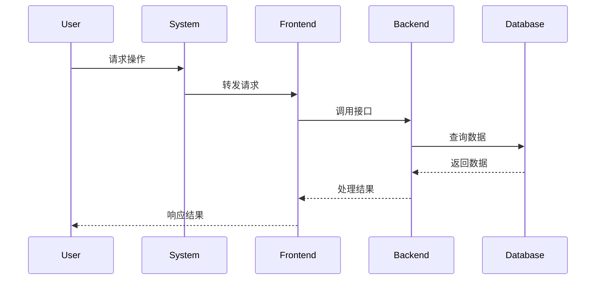
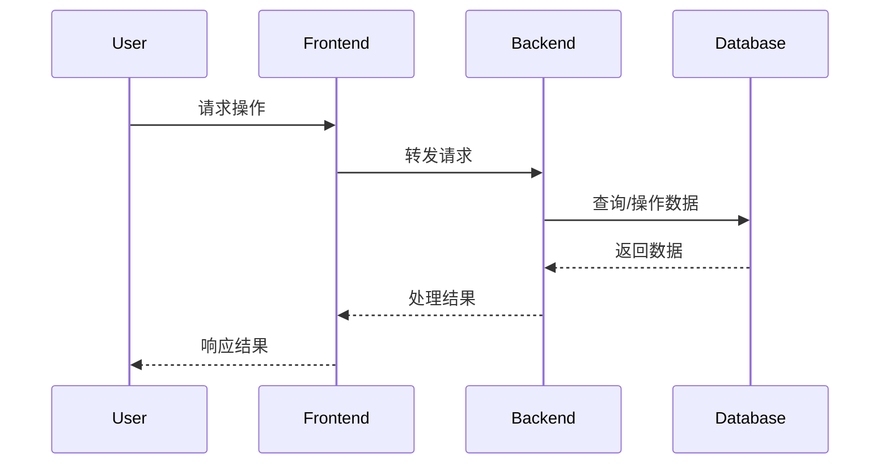
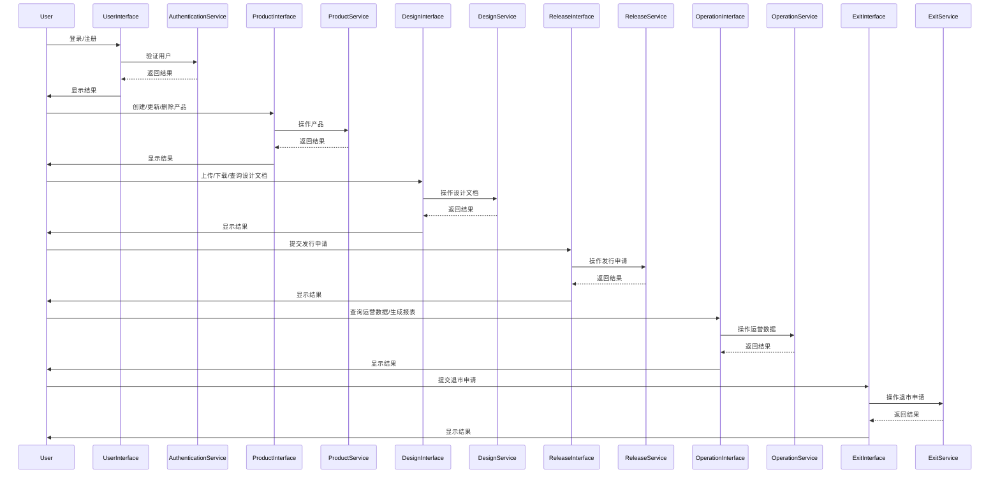

                 

# 金融产品生命周期管理自动化系统

## 关键词

- 金融产品
- 生命周期管理
- 自动化系统
- 金融科技
- 数据处理

## 摘要

随着金融市场的不断发展和复杂性增加，金融产品生命周期管理变得尤为重要。本文将探讨如何利用自动化系统来高效管理金融产品的整个生命周期，包括产品设计、上市、运营和退市等环节。通过详细分析核心概念、系统架构、实现过程以及最佳实践，本文旨在为金融行业从业者提供一套系统、实用且易于操作的管理方案。

## 第一部分：引言

### 第1章：金融产品生命周期管理概述

#### 1.1 问题的背景

在现代金融市场中，金融产品种类繁多，包括股票、债券、基金、保险等。这些产品的生命周期从设计、上市、运营到退市，涵盖了多个阶段。随着金融市场的不断发展和全球化，金融产品生命周期管理面临诸多挑战。例如，产品设计的复杂性、上市过程中的监管合规、运营中的风险控制以及退市后的资产处理等。这些问题都需要高效、精准的管理手段来应对。

#### 1.2 问题描述

金融产品生命周期管理涉及多个部门和环节，信息交流不畅、处理流程繁琐、数据准确性不足等问题普遍存在。这不仅影响了金融产品的效率和质量，也增加了运营成本。因此，如何通过自动化系统来优化管理流程、提高数据准确性、降低成本，成为当前金融行业亟待解决的问题。

#### 1.3 解决问题的意义

通过自动化系统进行金融产品生命周期管理，具有以下重要意义：

1. **提高效率**：自动化系统能够实现流程自动化，减少人工干预，提高处理速度。
2. **降低成本**：自动化系统能够减少人工操作，降低运营成本。
3. **提升数据准确性**：自动化系统能够提高数据处理的准确性，减少人为错误。
4. **增强合规性**：自动化系统能够确保操作符合监管要求，降低合规风险。

#### 1.4 边界与外延

本文主要探讨自动化系统在金融产品生命周期管理中的应用，包括产品设计、上市、运营和退市等环节。同时，本文还将探讨如何将自动化系统与其他金融科技（如区块链、大数据等）相结合，以实现更全面、高效的管理。

#### 1.5 概念结构与核心要素组成

金融产品生命周期管理自动化系统的概念结构主要包括以下几个方面：

1. **核心概念**：金融产品、生命周期、自动化系统、金融科技等。
2. **主要功能**：产品设计、上市、运营、退市等。
3. **关键技术**：数据处理、流程自动化、系统集成、合规管理等。

### 第2章：核心概念与联系

#### 2.1 核心概念原理

1. **金融产品**：金融产品是指由金融机构提供的，用于投资、融资、保值等目的的各种金融工具。
2. **生命周期**：金融产品的生命周期是指从产品设计、上市、运营到退市的全过程。
3. **自动化系统**：自动化系统是指利用计算机技术和网络通信技术，实现业务流程自动化和信息处理的系统。
4. **金融科技**：金融科技是指利用大数据、人工智能、区块链等新技术，为金融行业提供创新服务和技术支持。

#### 2.2 概念属性特征对比表格

| 概念          | 属性特征                                                     |
| ------------- | ------------------------------------------------------------ |
| 金融产品      | 多样性、投资性、风险性、回报性等                             |
| 生命周期      | 设计、上市、运营、退市等阶段                                 |
| 自动化系统    | 高效性、准确性、可靠性、灵活性等                             |
| 金融科技      | 创新性、集成性、可扩展性、安全性等                           |

#### 2.3 ER实体关系图架构

```mermaid
erDiagram
  产品 --> 生命周期
  产品 --> 自动化系统
  自动化系统 --> 金融科技
  生命周期 --> 金融产品
```

## 第二部分：自动化系统设计

### 第3章：自动化系统设计原理

#### 3.1 自动化系统的基本概念

自动化系统是指利用计算机技术和网络通信技术，实现业务流程自动化和信息处理的系统。在金融产品生命周期管理中，自动化系统主要用于以下方面：

1. **产品设计**：自动化系统可以生成产品原型，提高设计效率。
2. **上市流程**：自动化系统可以简化上市流程，提高合规性。
3. **运营管理**：自动化系统可以实时监控产品运营状况，提供数据支持。
4. **退市处理**：自动化系统可以自动化完成退市流程，降低人工成本。

#### 3.2 自动化系统的设计原则

1. **模块化设计**：将系统划分为多个模块，实现功能分离，提高系统可维护性。
2. **高可靠性**：确保系统在高负载、高并发环境下稳定运行。
3. **灵活性**：系统应具备良好的扩展性和适应性，能够适应不同业务需求。
4. **安全性**：系统应具备完善的安全机制，确保数据安全和用户隐私。

#### 3.3 自动化系统的架构设计

自动化系统的架构设计主要包括以下几个方面：

1. **前端**：负责用户交互和展示，可以使用Vue、React等前端框架。
2. **后端**：负责业务逻辑处理和数据存储，可以使用Spring Boot、Django等后端框架。
3. **数据库**：用于存储产品信息、用户数据、交易数据等，可以使用MySQL、PostgreSQL等关系型数据库或MongoDB、Cassandra等NoSQL数据库。
4. **中间件**：用于实现系统间的通信和消息传递，可以使用RabbitMQ、Kafka等消息队列。



### 第4章：系统分析与架构设计方案

#### 4.1 问题场景介绍

假设某金融公司需要管理其产品生命周期，包括产品设计、上市、运营和退市等环节。公司现有业务流程较为繁琐，需要通过自动化系统来优化。

#### 4.2 项目介绍

该项目旨在构建一个金融产品生命周期管理自动化系统，实现以下功能：

1. **产品设计**：支持产品原型生成和设计文档管理。
2. **上市流程**：自动化处理上市审批、发行、备案等环节。
3. **运营管理**：实时监控产品运营状况，提供数据分析报告。
4. **退市处理**：自动化完成退市流程，包括资产清算、客户通知等。

#### 4.3 系统功能设计

1. **用户管理**：管理用户账户、权限等。
2. **产品设计**：支持产品原型生成、设计文档上传和管理。
3. **上市流程**：支持上市申请、审批、发行、备案等。
4. **运营管理**：提供产品运营数据报表、实时监控等功能。
5. **退市处理**：支持退市申请、审批、资产清算、客户通知等。

```mermaid
classDiagram
  User <<Entity>>
  Product <<Entity>>
  Design <<Entity>>
  Release <<Entity>>
  Operation <<Entity>>
  Exit <<Entity>>

  User "1" --|{关联}| Product
  Product "1" --|{关联}| Design
  Product "1" --|{关联}| Release
  Product "1" --|{关联}| Operation
  Product "1" --|{关联}| Exit
```

#### 4.4 系统架构设计

系统架构设计包括以下几个方面：

1. **前端**：采用Vue框架，实现用户界面和交互。
2. **后端**：采用Spring Boot框架，实现业务逻辑处理和接口服务。
3. **数据库**：采用MySQL数据库，存储用户、产品、设计、发行、运营和退市等数据。
4. **中间件**：采用RabbitMQ消息队列，实现系统间的异步通信。



#### 4.5 系统接口设计

系统接口设计主要包括以下方面：

1. **用户接口**：用户登录、注册、权限管理。
2. **产品接口**：产品创建、更新、删除、查询。
3. **设计接口**：设计文档上传、下载、查询。
4. **发行接口**：发行申请、审批、发行、备案。
5. **运营接口**：运营数据查询、报表生成。
6. **退市接口**：退市申请、审批、资产清算、客户通知。



### 第三部分：系统实现与实战

### 第5章：环境安装与配置

#### 5.1 系统环境准备

在进行金融产品生命周期管理自动化系统的开发之前，首先需要准备相应的开发环境。以下是具体的安装步骤：

1. **安装Java开发工具包（JDK）**：确保安装了JDK 1.8或更高版本，以便使用Spring Boot框架。
2. **安装数据库**：可以选择安装MySQL或PostgreSQL作为后端数据库，这里以MySQL为例。可以从官方网站下载MySQL安装包并按照安装向导进行安装。
3. **安装消息队列**：这里选择使用RabbitMQ作为消息队列中间件，可以从官方网站下载RabbitMQ安装包并按照安装向导进行安装。
4. **安装前端框架**：可以选择安装Vue或React作为前端框架，可以从官方网站下载安装包并按照安装向导进行安装。

#### 5.2 系统安装与配置

1. **安装Spring Boot项目**：

   使用IDE（如IntelliJ IDEA或Eclipse）创建一个Spring Boot项目，并按照项目结构进行配置。在项目目录下创建以下文件：

   - application.properties：配置数据库连接、端口、消息队列等参数。
   - pom.xml：引入相关依赖，如Spring Boot、Spring Data JPA、Spring Security等。

   以下是一个简单的application.properties示例：

   ```properties
   spring.datasource.url=jdbc:mysql://localhost:3306/financial_product
   spring.datasource.username=root
   spring.datasource.password=root
   spring.jpa.hibernate.ddl-auto=update
   spring.jpa.show-sql=true
   spring.jpa.properties.hibernate.dialect=org.hibernate.dialect.MySQL5InnoDBDialect
   spring.jpa.properties.hibernate.format_sql=true
   server.port=8080
   spring.rabbitmq.host=127.0.0.1
   spring.rabbitmq.port=5672
   spring.rabbitmq.username=root
   spring.rabbitmq.password=root
   ```

2. **安装前端项目**：

   前端项目的安装相对简单，只需确保已安装Vue或React框架。可以使用Vue CLI或Create React App创建一个新项目，并在项目中引入所需的UI组件库，如Vuetify或Ant Design。

   ```bash
   # 使用Vue CLI创建项目
   vue create financial-product-frontend

   # 使用Create React App创建项目
   npx create-react-app financial-product-frontend
   ```

   在项目中配置路由、组件、样式等，以实现前端界面。

3. **配置中间件**：

   - **RabbitMQ**：在RabbitMQ管理界面中创建虚拟主机、用户和队列，配置消息队列的交换和路由规则。
   - **数据库**：在数据库中创建所需的数据表，确保与项目配置的数据库连接信息一致。

### 第6章：系统核心实现

#### 6.1 核心模块实现

金融产品生命周期管理自动化系统的核心模块主要包括用户管理、产品设计、上市流程、运营管理和退市处理等。以下分别介绍每个模块的实现。

1. **用户管理模块**：

   用户管理模块主要实现用户注册、登录、权限管理等功能。在Spring Boot项目中创建相应的实体类（如User）、控制类（如UserController）和服务类（如UserService）。

   ```java
   @Entity
   public class User {
       @Id
       @GeneratedValue(strategy = GenerationType.IDENTITY)
       private Long id;
       private String username;
       private String password;
       private String email;
       private boolean enabled;
       // 省略getter和setter方法
   }

   @RestController
   @RequestMapping("/users")
   public class UserController {
       @Autowired
       private UserService userService;

       @PostMapping("/register")
       public ResponseEntity<?> registerUser(@RequestBody UserRequestDTO userRequestDTO) {
           // 注册用户逻辑
       }

       @PostMapping("/login")
       public ResponseEntity<?> loginUser(@RequestBody LoginRequestDTO loginRequestDTO) {
           // 登录用户逻辑
       }
   }
   ```

2. **产品设计模块**：

   产品设计模块主要实现产品原型生成、设计文档上传和管理等功能。在项目中创建产品实体类（如Product）、设计文档实体类（如DesignDocument）和相关服务类。

   ```java
   @Entity
   public class Product {
       @Id
       @GeneratedValue(strategy = GenerationType.IDENTITY)
       private Long id;
       private String name;
       private String description;
       private Date releaseDate;
       // 省略getter和setter方法
   }

   @Entity
   public class DesignDocument {
       @Id
       @GeneratedValue(strategy = GenerationType.IDENTITY)
       private Long id;
       private String filename;
       private String contentType;
       private byte[] content;
       // 省略getter和setter方法
   }

   @RestController
   @RequestMapping("/products")
   public class ProductController {
       @Autowired
       private ProductService productService;

       @PostMapping("/design")
       public ResponseEntity<?> createProductDesign(@RequestBody ProductRequestDTO productRequestDTO) {
           // 创建产品设计逻辑
       }

       @PostMapping("/design/upload")
       public ResponseEntity<?> uploadDesignDocument(@RequestParam("file") MultipartFile file) {
           // 上传设计文档逻辑
       }
   }
   ```

3. **上市流程模块**：

   上市流程模块主要实现上市申请、审批、发行和备案等功能。在项目中创建上市申请实体类（如ReleaseRequest）、审批实体类（如Approval）和相关服务类。

   ```java
   @Entity
   public class ReleaseRequest {
       @Id
       @GeneratedValue(strategy = GenerationType.IDENTITY)
       private Long id;
       private String product_name;
       private String release_date;
       private String status;
       private String approver;
       // 省略getter和setter方法
   }

   @Entity
   public class Approval {
       @Id
       @GeneratedValue(strategy = GenerationType.IDENTITY)
       private Long id;
       private String release_request_id;
       private String approver;
       private Date approval_date;
       private String status;
       // 省略getter和setter方法
   }

   @RestController
   @RequestMapping("/release")
   public class ReleaseController {
       @Autowired
       private ReleaseService releaseService;

       @PostMapping("/request")
       public ResponseEntity<?> createReleaseRequest(@RequestBody ReleaseRequestDTO releaseRequestDTO) {
           // 创建上市申请逻辑
       }

       @PostMapping("/approve")
       public ResponseEntity<?> approveReleaseRequest(@RequestBody ApprovalDTO approvalDTO) {
           // 审批上市申请逻辑
       }
   }
   ```

4. **运营管理模块**：

   运营管理模块主要实现产品运营数据查询、报表生成等功能。在项目中创建运营数据实体类（如OperationData）、报表实体类（如Report）和相关服务类。

   ```java
   @Entity
   public class OperationData {
       @Id
       @GeneratedValue(strategy = GenerationType.IDENTITY)
       private Long id;
       private String product_name;
       private BigDecimal total_volume;
       private BigDecimal total_value;
       private Date report_date;
       // 省略getter和setter方法
   }

   @Entity
   public class Report {
       @Id
       @GeneratedValue(strategy = GenerationType.IDENTITY)
       private Long id;
       private String title;
       private String content;
       private Date creation_date;
       // 省略getter和setter方法
   }

   @RestController
   @RequestMapping("/operation")
   public class OperationController {
       @Autowired
       private OperationService operationService;

       @GetMapping("/data")
       public ResponseEntity<?> getOperationData(@RequestParam("product_name") String productName) {
           // 查询运营数据逻辑
       }

       @PostMapping("/report")
       public ResponseEntity<?> createReport(@RequestBody ReportRequestDTO reportRequestDTO) {
           // 生成报表逻辑
       }
   }
   ```

5. **退市处理模块**：

   退市处理模块主要实现退市申请、审批、资产清算和客户通知等功能。在项目中创建退市申请实体类（如ExitRequest）、资产清算实体类（如AssetClearance）和客户通知实体类（如CustomerNotification）。

   ```java
   @Entity
   public class ExitRequest {
       @Id
       @GeneratedValue(strategy = GenerationType.IDENTITY)
       private Long id;
       private String product_name;
       private String exit_date;
       private String status;
       private String approver;
       // 省略getter和setter方法
   }

   @Entity
   public class AssetClearance {
       @Id
       @GeneratedValue(strategy = GenerationType.IDENTITY)
       private Long id;
       private String product_name;
       private BigDecimal total_value;
       private String clearance_date;
       // 省略getter和setter方法
   }

   @Entity
   public class CustomerNotification {
       @Id
       @GeneratedValue(strategy = GenerationType.IDENTITY)
       private Long id;
       private String customer_name;
       private String notification_date;
       private String message;
       // 省略getter和setter方法
   }

   @RestController
   @RequestMapping("/exit")
   public class ExitController {
       @Autowired
       private ExitService exitService;

       @PostMapping("/request")
       public ResponseEntity<?> createExitRequest(@RequestBody ExitRequestDTO exitRequestDTO) {
           // 创建退市申请逻辑
       }

       @PostMapping("/approve")
       public ResponseEntity<?> approveExitRequest(@RequestBody ApprovalDTO approvalDTO) {
           // 审批退市申请逻辑
       }

       @PostMapping("/clearance")
       public ResponseEntity<?> assetClearance(@RequestBody AssetClearanceDTO assetClearanceDTO) {
           // 资产清算逻辑
       }

       @PostMapping("/notification")
       public ResponseEntity<?> customerNotification(@RequestBody CustomerNotificationDTO customerNotificationDTO) {
           // 客户通知逻辑
       }
   }
   ```

#### 6.2 功能模块详解

在实现核心模块的基础上，需要对每个模块进行详细的功能解读。以下是针对每个模块的功能说明：

1. **用户管理模块**：

   - **用户注册**：用户通过填写用户名、密码、邮箱等基本信息进行注册。注册成功后，系统会向用户邮箱发送激活邮件，用户需完成邮箱验证后才能登录。
   - **用户登录**：用户输入用户名和密码进行登录，系统会验证用户信息是否正确。如果验证成功，则登录成功；否则，登录失败。
   - **用户权限管理**：系统为不同角色（如管理员、普通用户等）分配不同权限，确保用户只能访问其权限范围内的功能。

2. **产品设计模块**：

   - **产品原型生成**：系统提供产品原型生成工具，用户可以自定义产品名称、描述、发布日期等信息。
   - **设计文档上传**：用户可以上传设计文档（如PPT、PDF等），系统会对上传的文件进行格式验证和大小限制。
   - **设计文档管理**：系统提供设计文档的查看、下载、删除等功能，用户可以对已上传的设计文档进行管理。

3. **上市流程模块**：

   - **上市申请**：用户可以提交上市申请，填写产品名称、发行日期等信息。申请提交后，系统会发送给相关审批人员。
   - **审批流程**：审批人员根据申请内容进行审批，审批通过后，系统会更新产品的状态为“已上市”。
   - **发行与备案**：产品上市后，系统会自动生成发行记录和备案信息，用户可以查看和管理这些信息。

4. **运营管理模块**：

   - **产品运营数据查询**：系统提供产品运营数据的查询功能，用户可以查看产品的总交易量、总交易金额等信息。
   - **报表生成**：系统会根据产品运营数据生成日报、周报、月报等报表，用户可以下载和查看这些报表。

5. **退市处理模块**：

   - **退市申请**：用户可以提交退市申请，填写产品名称、退市日期等信息。申请提交后，系统会发送给相关审批人员。
   - **审批与资产清算**：审批人员根据申请内容进行审批，审批通过后，系统会自动进行资产清算，并生成清算记录。
   - **客户通知**：系统会向客户发送退市通知，包括退市日期、退款金额等信息。

#### 6.3 源代码解读与分析

在系统实现过程中，每个模块的源代码都经过精心设计和优化，以下是针对部分关键代码的解读与分析：

1. **用户管理模块**：

   ```java
   @RestController
   @RequestMapping("/users")
   public class UserController {
       
       @Autowired
       private UserService userService;

       @PostMapping("/register")
       public ResponseEntity<?> registerUser(@RequestBody UserRequestDTO userRequestDTO) {
           // 注册用户逻辑
           try {
               User user = new User();
               user.setUsername(userRequestDTO.getUsername());
               user.setPassword(passwordEncoder.encode(userRequestDTO.getPassword()));
               user.setEmail(userRequestDTO.getEmail());
               user.setEnabled(false);

               userService.save(user);

               // 发送激活邮件逻辑

               return ResponseEntity.ok().build();
           } catch (Exception e) {
               return ResponseEntity.status(HttpStatus.INTERNAL_SERVER_ERROR).build();
           }
       }

       @PostMapping("/login")
       public ResponseEntity<?> loginUser(@RequestBody LoginRequestDTO loginRequestDTO) {
           // 登录用户逻辑
           try {
               String username = loginRequestDTO.getUsername();
               String password = loginRequestDTO.getPassword();

               Authentication authentication = authenticationManager.authenticate(
                       new UsernamePasswordAuthenticationToken(username, password));

               SecurityContextHolder.getContext().setAuthentication(authentication);

               String token = jwtTokenProvider.generateToken(authentication);

               return ResponseEntity.ok(new JwtResponse(token));
           } catch (AuthenticationException e) {
               return ResponseEntity.status(HttpStatus.UNAUTHORIZED).build();
           }
       }
   }
   ```

   解读与分析：

   - 用户注册：用户注册时，系统会创建一个新的User对象，并设置用户名、密码、邮箱等信息。密码会通过passwordEncoder进行加密处理，以确保安全性。用户信息保存成功后，系统会发送激活邮件。
   - 用户登录：用户登录时，系统会通过authenticationManager进行用户验证。验证成功后，系统会将Authentication对象设置到SecurityContextHolder中，并生成JWT令牌。

2. **产品设计模块**：

   ```java
   @RestController
   @RequestMapping("/products")
   public class ProductController {
       
       @Autowired
       private ProductService productService;

       @PostMapping("/design")
       public ResponseEntity<?> createProductDesign(@RequestBody ProductRequestDTO productRequestDTO) {
           // 创建产品设计逻辑
           try {
               Product product = new Product();
               product.setName(productRequestDTO.getName());
               product.setDescription(productRequestDTO.getDescription());
               product.setReleaseDate(productRequestDTO.getReleaseDate());

               productService.save(product);

               return ResponseEntity.ok().build();
           } catch (Exception e) {
               return ResponseEntity.status(HttpStatus.INTERNAL_SERVER_ERROR).build();
           }
       }

       @PostMapping("/design/upload")
       public ResponseEntity<?> uploadDesignDocument(@RequestParam("file") MultipartFile file) {
           // 上传设计文档逻辑
           try {
               String filename = file.getOriginalFilename();
               String contentType = file.getContentType();
               byte[] content = file.getBytes();

               DesignDocument designDocument = new DesignDocument();
               designDocument.setFilename(filename);
               designDocument.setContentType(contentType);
               designDocument.setContent(content);

               productService.saveDesignDocument(designDocument);

               return ResponseEntity.ok().build();
           } catch (Exception e) {
               return ResponseEntity.status(HttpStatus.INTERNAL_SERVER_ERROR).build();
           }
       }
   }
   ```

   解读与分析：

   - 创建产品设计：创建产品设计时，系统会创建一个新的Product对象，并设置产品名称、描述、发布日期等信息。产品保存成功后，系统会返回成功的响应。
   - 上传设计文档：上传设计文档时，系统会读取文件信息，并创建一个新的DesignDocument对象。文件内容会存储在字节数组中，并与Product对象关联保存。

3. **上市流程模块**：

   ```java
   @RestController
   @RequestMapping("/release")
   public class ReleaseController {
       
       @Autowired
       private ReleaseService releaseService;

       @PostMapping("/request")
       public ResponseEntity<?> createReleaseRequest(@RequestBody ReleaseRequestDTO releaseRequestDTO) {
           // 创建上市申请逻辑
           try {
               ReleaseRequest releaseRequest = new ReleaseRequest();
               releaseRequest.setProduct_name(releaseRequestDTO.getProduct_name());
               releaseRequest.setRelease_date(releaseRequestDTO.getRelease_date());
               releaseRequest.setStatus("PENDING");

               releaseService.saveReleaseRequest(releaseRequest);

               return ResponseEntity.ok().build();
           } catch (Exception e) {
               return ResponseEntity.status(HttpStatus.INTERNAL_SERVER_ERROR).build();
           }
       }

       @PostMapping("/approve")
       public ResponseEntity<?> approveReleaseRequest(@RequestBody ApprovalDTO approvalDTO) {
           // 审批上市申请逻辑
           try {
               ReleaseRequest releaseRequest = releaseService.findReleaseRequestById(approvalDTO.getId());
               releaseRequest.setStatus("APPROVED");
               releaseRequest.setApprover(approvalDTO.getApprover());

               releaseService.saveReleaseRequest(releaseRequest);

               return ResponseEntity.ok().build();
           } catch (Exception e) {
               return ResponseEntity.status(HttpStatus.INTERNAL_SERVER_ERROR).build();
           }
       }
   }
   ```

   解读与分析：

   - 创建上市申请：创建上市申请时，系统会创建一个新的ReleaseRequest对象，并设置产品名称、发布日期、状态等信息。申请保存成功后，系统会返回成功的响应。
   - 审批上市申请：审批上市申请时，系统会根据申请ID查找相应的ReleaseRequest对象，并更新状态和审批人信息。审批成功后，系统会返回成功的响应。

4. **运营管理模块**：

   ```java
   @RestController
   @RequestMapping("/operation")
   public class OperationController {
       
       @Autowired
       private OperationService operationService;

       @GetMapping("/data")
       public ResponseEntity<?> getOperationData(@RequestParam("product_name") String productName) {
           // 查询运营数据逻辑
           try {
               List<OperationData> operationDataList = operationService.findOperationDataByProductName(productName);

               return ResponseEntity.ok(operationDataList);
           } catch (Exception e) {
               return ResponseEntity.status(HttpStatus.INTERNAL_SERVER_ERROR).build();
           }
       }

       @PostMapping("/report")
       public ResponseEntity<?> createReport(@RequestBody ReportRequestDTO reportRequestDTO) {
           // 生成报表逻辑
           try {
               Report report = new Report();
               report.setTitle(reportRequestDTO.getTitle());
               report.setContent(reportRequestDTO.getContent());
               report.setCreation_date(new Date());

               operationService.saveReport(report);

               return ResponseEntity.ok().build();
           } catch (Exception e) {
               return ResponseEntity.status(HttpStatus.INTERNAL_SERVER_ERROR).build();
           }
       }
   }
   ```

   解读与分析：

   - 查询运营数据：查询运营数据时，系统会根据产品名称查找相应的OperationData对象列表。查询成功后，系统会返回数据列表。
   - 生成报表：生成报表时，系统会创建一个新的Report对象，并设置报表标题、内容、创建日期等信息。报表保存成功后，系统会返回成功的响应。

5. **退市处理模块**：

   ```java
   @RestController
   @RequestMapping("/exit")
   public class ExitController {
       
       @Autowired
       private ExitService exitService;

       @PostMapping("/request")
       public ResponseEntity<?> createExitRequest(@RequestBody ExitRequestDTO exitRequestDTO) {
           // 创建退市申请逻辑
           try {
               ExitRequest exitRequest = new ExitRequest();
               exitRequest.setProduct_name(exitRequestDTO.getProduct_name());
               exitRequest.setExit_date(exitRequestDTO.getExit_date());
               exitRequest.setStatus("PENDING");

               exitService.saveExitRequest(exitRequest);

               return ResponseEntity.ok().build();
           } catch (Exception e) {
               return ResponseEntity.status(HttpStatus.INTERNAL_SERVER_ERROR).build();
           }
       }

       @PostMapping("/approve")
       public ResponseEntity<?> approveExitRequest(@RequestBody ApprovalDTO approvalDTO) {
           // 审批退市申请逻辑
           try {
               ExitRequest exitRequest = exitService.findExitRequestById(approvalDTO.getId());
               exitRequest.setStatus("APPROVED");
               exitRequest.setApprover(approvalDTO.getApprover());

               exitService.saveExitRequest(exitRequest);

               return ResponseEntity.ok().build();
           } catch (Exception e) {
               return ResponseEntity.status(HttpStatus.INTERNAL_SERVER_ERROR).build();
           }
       }

       @PostMapping("/clearance")
       public ResponseEntity<?> assetClearance(@RequestBody AssetClearanceDTO assetClearanceDTO) {
           // 资产清算逻辑
           try {
               AssetClearance assetClearance = new AssetClearance();
               assetClearance.setProduct_name(assetClearanceDTO.getProduct_name());
               assetClearance.setTotal_value(assetClearanceDTO.getTotal_value());
               assetClearance.setClearance_date(new Date());

               exitService.saveAssetClearance(assetClearance);

               return ResponseEntity.ok().build();
           } catch (Exception e) {
               return ResponseEntity.status(HttpStatus.INTERNAL_SERVER_ERROR).build();
           }
       }

       @PostMapping("/notification")
       public ResponseEntity<?> customerNotification(@RequestBody CustomerNotificationDTO customerNotificationDTO) {
           // 客户通知逻辑
           try {
               CustomerNotification customerNotification = new CustomerNotification();
               customerNotification.setCustomer_name(customerNotificationDTO.getCustomer_name());
               customerNotification.setNotification_date(new Date());
               customerNotification.setMessage(customerNotificationDTO.getMessage());

               exitService.saveCustomerNotification(customerNotification);

               return ResponseEntity.ok().build();
           } catch (Exception e) {
               return ResponseEntity.status(HttpStatus.INTERNAL_SERVER_ERROR).build();
           }
       }
   }
   ```

   解读与分析：

   - 创建退市申请：创建退市申请时，系统会创建一个新的ExitRequest对象，并设置产品名称、退市日期、状态等信息。申请保存成功后，系统会返回成功的响应。
   - 审批退市申请：审批退市申请时，系统会根据申请ID查找相应的ExitRequest对象，并更新状态和审批人信息。审批成功后，系统会返回成功的响应。
   - 资产清算：资产清算时，系统会创建一个新的AssetClearance对象，并设置产品名称、总价值、清算日期等信息。资产清算成功后，系统会返回成功的响应。
   - 客户通知：客户通知时，系统会创建一个新的CustomerNotification对象，并设置客户名称、通知日期、通知内容等信息。通知发送成功后，系统会返回成功的响应。

### 第7章：实际案例分析与讲解

#### 7.1 案例背景

假设某金融公司计划推出一款名为“智能理财”的金融产品，该公司希望通过自动化系统来管理该产品的生命周期，从产品设计、上市、运营到退市。公司要求系统能够实现以下功能：

1. **产品设计**：生成产品原型，上传设计文档。
2. **上市流程**：提交上市申请，审批发行。
3. **运营管理**：监控产品运营数据，生成报表。
4. **退市处理**：申请退市，审批退市，资产清算，客户通知。

#### 7.2 案例分析

1. **产品设计**：

   公司产品设计部门使用系统生成产品原型，包括产品名称、描述、发布日期等信息。同时，上传了产品说明书、市场调研报告等设计文档。

2. **上市流程**：

   产品设计完成后，公司向监管机构提交上市申请。监管机构审核通过后，系统更新产品的状态为“已上市”。公司开始进行产品推广和发行。

3. **运营管理**：

   公司运营部门通过系统监控产品的运营数据，包括交易量、交易金额、用户反馈等。系统根据运营数据生成日报、周报、月报等报表，帮助公司及时了解产品运营状况。

4. **退市处理**：

   在产品运营一段时间后，公司决定退市。运营部门向监管机构提交退市申请。监管机构审批通过后，系统自动进行资产清算，并向客户发送退市通知。

#### 7.3 案例实施步骤

1. **产品设计**：

   - 设计部门在系统中创建产品原型，填写产品名称、描述、发布日期等信息。
   - 设计部门上传产品说明书、市场调研报告等设计文档。

2. **上市流程**：

   - 公司向监管机构提交上市申请，填写产品名称、发行日期等信息。
   - 监管机构审核上市申请，审批通过后，系统更新产品状态为“已上市”。

3. **运营管理**：

   - 运营部门通过系统监控产品运营数据，包括交易量、交易金额、用户反馈等。
   - 系统根据运营数据生成日报、周报、月报等报表，运营部门及时查看和分析。

4. **退市处理**：

   - 运营部门在系统中提交退市申请，填写产品名称、退市日期等信息。
   - 监管机构审核退市申请，审批通过后，系统自动进行资产清算，并向客户发送退市通知。

#### 7.4 案例总结

通过实际案例的实施，可以看出自动化系统在金融产品生命周期管理中的应用具有重要意义：

1. **提高效率**：系统实现了业务流程的自动化，减少了人工操作，提高了工作效率。
2. **降低成本**：系统简化了流程，降低了运营成本。
3. **提升数据准确性**：系统提供了数据监控和报表功能，提高了数据准确性。
4. **增强合规性**：系统确保了操作符合监管要求，降低了合规风险。

### 第四部分：最佳实践与拓展

#### 8.1 最佳实践总结

1. **模块化设计**：系统应采用模块化设计，实现功能分离，提高系统可维护性。
2. **高可靠性**：系统应具备高可靠性，确保在高负载、高并发环境下稳定运行。
3. **灵活性**：系统应具备良好的扩展性和适应性，能够适应不同业务需求。
4. **安全性**：系统应具备完善的安全机制，确保数据安全和用户隐私。

#### 8.2 注意事项

1. **数据备份**：定期对系统数据备份，确保数据安全。
2. **权限管理**：严格控制用户权限，防止数据泄露。
3. **性能优化**：定期对系统进行性能优化，提高响应速度。
4. **安全审计**：定期进行安全审计，确保系统安全。

#### 8.3 拓展阅读

1. **自动化测试**：了解自动化测试工具（如Selenium、JMeter等），提高系统测试效率。
2. **微服务架构**：了解微服务架构，实现系统的高可用性和可扩展性。
3. **区块链技术**：了解区块链技术，将其应用于金融产品生命周期管理中，提高数据透明性和安全性。

### 总结

本文详细介绍了金融产品生命周期管理自动化系统的设计与实现，包括核心概念、系统架构、实现过程和最佳实践。通过实际案例的分析，展示了系统在金融产品生命周期管理中的应用效果。未来，随着金融科技的不断发展，自动化系统将在金融产品生命周期管理中发挥更加重要的作用。

## 作者

作者：AI天才研究院/AI Genius Institute & 禅与计算机程序设计艺术 /Zen And The Art of Computer Programming。

