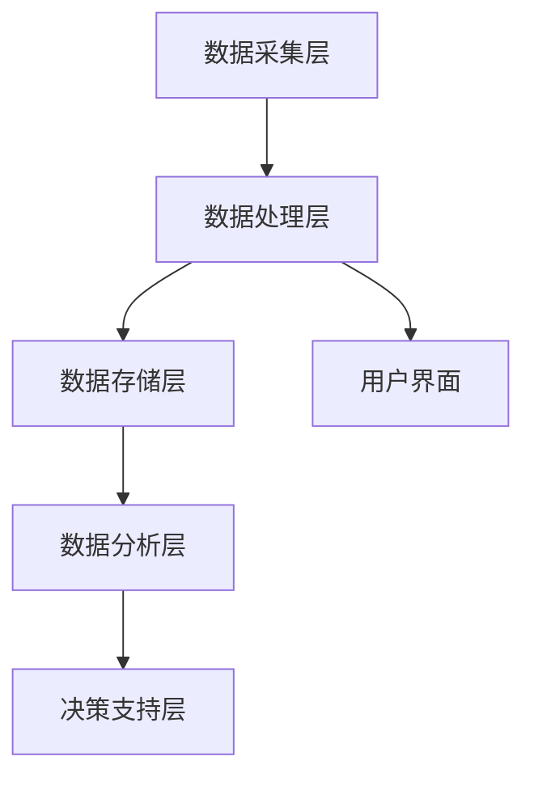

                 


## 金融大数据实时决策支持平台

### 关键词

- 金融大数据
- 实时数据流处理
- 决策支持系统
- 机器学习算法

### 摘要

本文将深入探讨金融大数据实时决策支持平台的设计与实现，包括其核心概念、技术架构、实现方法以及最佳实践。我们将逐步分析金融大数据的重要性，实时数据流处理技术，机器学习算法的应用，最终构建一个高效的金融大数据实时决策支持系统。

----------------------------------------------------------------

## 引言

在当今金融行业，数据的爆炸性增长和技术的快速发展，使得金融机构能够获取、处理和分析海量数据成为可能。然而，如何从海量数据中提取有价值的信息，并实时做出决策，成为了金融企业面临的一大挑战。实时决策支持平台应运而生，它通过高效的数据采集、处理和分析，为金融机构提供实时的决策支持。

本文将围绕以下问题展开：

- 金融大数据的特点是什么？
- 如何利用实时数据流处理技术？
- 机器学习算法在金融决策支持中有哪些应用？
- 如何设计并实现一个高效的金融大数据实时决策支持平台？

通过本文的探讨，希望能够为金融行业的技术人员提供有价值的参考和指导。

----------------------------------------------------------------

## 第一部分：金融大数据实时决策支持平台背景

### 第1章：金融大数据概述

#### 1.1 问题背景

在过去的几十年中，金融行业经历了巨大的变革，尤其是随着互联网和大数据技术的发展，金融机构能够获取和处理的金融数据规模不断扩大。然而，这些海量数据的有效利用成为了金融企业面临的一大挑战。如何从海量数据中提取有价值的信息，并为决策者提供实时的支持，成为了金融行业亟需解决的问题。

#### 1.2 问题描述

金融大数据实时决策支持平台的目标是，通过对金融数据的实时采集、处理和分析，为金融机构提供实时的决策支持。这涉及到多个方面的问题：

- **数据采集**：如何高效地采集来自不同来源的金融数据？
- **数据处理**：如何处理这些海量、多样化的金融数据？
- **数据分析**：如何从这些数据中提取有价值的信息？
- **实时决策**：如何实现实时的决策支持，为金融机构提供及时、准确的决策建议？

#### 1.3 问题解决

为了解决上述问题，金融大数据实时决策支持平台需要具备以下几个关键要素：

- **高效的数据采集系统**：能够从各种数据源（如交易所、银行、社交媒体等）实时采集数据。
- **强大的数据处理能力**：能够处理海量、多样化的金融数据，包括结构化数据和非结构化数据。
- **先进的数据分析技术**：能够从海量数据中提取有价值的信息，并支持复杂的统计分析和预测模型。
- **实时的决策支持功能**：能够实时分析数据，为金融机构提供及时的决策支持。

#### 1.4 边界与外延

金融大数据实时决策支持平台的边界主要包括：

- **数据范围**：包括各种金融数据，如交易数据、市场数据、客户数据等。
- **处理范围**：包括数据采集、处理、分析和决策支持的全过程。
- **应用范围**：包括金融市场分析、风险控制、客户管理、投资决策等。

#### 1.5 概念结构与核心要素组成

金融大数据实时决策支持平台的概念结构主要包括以下几个核心要素：

- **数据采集层**：负责从各种数据源采集数据。
- **数据处理层**：负责对采集到的数据进行处理，包括清洗、转换、存储等。
- **数据分析层**：负责对处理后的数据进行深入分析，包括统计分析、机器学习等。
- **决策支持层**：负责根据分析结果提供实时的决策支持。

#### 1.6 金融大数据的特点

金融大数据具有以下几个显著特点：

- **数据量大**：金融行业每天产生海量的交易数据、市场数据等，数据量巨大。
- **数据类型多样**：金融数据包括结构化数据（如交易记录）和非结构化数据（如新闻报道、社交媒体数据等）。
- **数据时效性强**：金融市场的变化非常迅速，实时性要求高。

这些特点对金融大数据实时决策支持平台的设计与实现提出了更高的要求。

----------------------------------------------------------------

## 第2章：实时数据流处理技术

#### 2.1 实时数据流处理概述

实时数据流处理是一种数据处理技术，它能够对实时产生的大量数据流进行实时处理和分析。在金融行业，实时数据流处理技术具有广泛的应用，如交易监控、风险管理和客户行为分析等。

实时数据流处理的流程主要包括：

1. **数据采集**：从各种数据源（如交易所、银行、社交媒体等）实时采集数据。
2. **数据预处理**：对采集到的数据（如清洗、去噪、转换等）进行预处理，使其适合进行进一步处理。
3. **实时处理**：对预处理后的数据进行实时处理，如统计分析、机器学习等。
4. **结果输出**：将处理结果输出，如实时报表、预警信息等。

#### 2.2 主流实时数据流处理框架

目前，市场上有多个主流的实时数据流处理框架，如Apache Kafka、Apache Flink、Apache Storm等。这些框架各有特点，适用于不同的应用场景。

- **Apache Kafka**：具有高吞吐量、可扩展性强、可靠性强等特点，适用于大规模实时数据处理。
- **Apache Flink**：具有流处理和批处理的能力，适用于复杂的数据分析和实时处理。
- **Apache Storm**：具有高可靠性、易部署等特点，适用于低延迟的实时数据处理。

#### 2.3 实时数据流处理原理

实时数据流处理的核心是数据流引擎，它能够对实时数据流进行实时处理。数据流引擎的主要组件包括：

- **数据源**：实时数据流的数据来源，如交易所、银行、社交媒体等。
- **数据消费者**：从数据源订阅数据，并对其进行处理。
- **数据处理器**：对数据流进行处理，如清洗、转换、统计分析等。
- **数据存储**：存储处理后的数据，如数据库、数据仓库等。

实时数据流处理的基本原理是，数据流引擎通过数据消费者从数据源订阅数据，然后对数据进行实时处理，并将处理结果输出到数据存储。

#### 2.4 实时数据流处理在金融中的应用

实时数据流处理在金融行业有广泛的应用，如：

- **交易监控**：实时监控交易数据，发现异常交易行为，进行风险控制。
- **风险管理**：实时分析风险指标，发现潜在风险，采取预防措施。
- **客户行为分析**：实时分析客户行为数据，了解客户需求，提供个性化服务。

这些应用都依赖于实时数据流处理技术，能够为金融机构提供实时的决策支持。

----------------------------------------------------------------

## 第3章：机器学习算法与决策支持

#### 3.1 机器学习算法概述

机器学习算法是人工智能领域的重要分支，它能够从数据中学习规律，并做出预测或决策。在金融行业，机器学习算法被广泛应用于风险控制、投资决策、客户管理等领域。

常见的机器学习算法包括：

- **监督学习算法**：如线性回归、决策树、随机森林、支持向量机等。
- **无监督学习算法**：如聚类算法、关联规则算法等。
- **强化学习算法**：如Q学习、SARSA等。

#### 3.2 主流机器学习算法

在金融领域，以下几种机器学习算法具有广泛的应用：

- **线性回归**：用于预测金融市场的趋势，如股票价格。
- **决策树**：用于分类和回归分析，如客户信用评估。
- **随机森林**：用于分类和回归分析，具有更强的鲁棒性。
- **支持向量机**：用于分类问题，如交易分类。
- **神经网络**：用于复杂的数据分析和预测，如时间序列预测。

#### 3.3 机器学习算法在金融决策支持中的应用

机器学习算法在金融决策支持中有多种应用，如：

- **风险控制**：使用机器学习算法预测潜在的风险，如信贷风险、市场风险等。
- **投资决策**：使用机器学习算法分析市场数据，提供投资建议。
- **客户管理**：使用机器学习算法分析客户数据，提供个性化的客户服务。

#### 3.4 机器学习算法原理讲解

下面我们以线性回归算法为例，讲解机器学习算法的原理。

**线性回归算法原理：**

线性回归是一种监督学习算法，用于预测一个连续的输出值。其基本原理是，通过拟合一条直线，将输入特征映射到输出值。

线性回归的数学模型为：

\[ y = w_1 \cdot x_1 + w_2 \cdot x_2 + \ldots + w_n \cdot x_n + b \]

其中，\( y \) 是输出值，\( x_1, x_2, \ldots, x_n \) 是输入特征，\( w_1, w_2, \ldots, w_n \) 是权重，\( b \) 是偏置。

**机器学习过程：**

1. **数据准备**：收集并准备训练数据集，包括输入特征和输出值。
2. **模型训练**：使用训练数据集，通过最小化损失函数（如均方误差），优化模型的权重和偏置。
3. **模型评估**：使用测试数据集，评估模型的预测性能。
4. **模型应用**：将训练好的模型应用于新的数据，进行预测。

**举例说明：**

假设我们要预测股票价格，输入特征包括股票的历史价格、成交量等。通过线性回归模型，我们可以拟合出股票价格与输入特征之间的关系，从而预测未来的股票价格。

----------------------------------------------------------------

## 第4章：金融大数据实时决策支持平台架构设计

#### 4.1 平台架构设计概述

金融大数据实时决策支持平台的设计需要综合考虑数据采集、数据处理、数据分析和决策支持等多个方面。平台的架构设计应具备高可用性、高扩展性和高可靠性，能够满足金融行业实时、高效的数据处理需求。

#### 4.2 数据采集与存储设计

数据采集是金融大数据实时决策支持平台的基础，需要高效、准确地采集各种金融数据。数据存储则需具备海量存储能力和高效查询性能。

- **数据采集**：使用分布式数据采集框架，如Apache Kafka，从各种数据源实时采集数据。
- **数据存储**：使用分布式存储系统，如Hadoop HDFS或分布式数据库，存储海量金融数据。

#### 4.3 数据处理与分析设计

数据处理与分析是金融大数据实时决策支持平台的核心，需要高效、准确地处理和分析金融数据。

- **数据处理**：使用实时数据流处理框架，如Apache Flink，对采集到的数据进行实时处理。
- **数据分析**：使用机器学习算法和统计分析方法，对处理后的数据进行深入分析。

#### 4.4 实时决策支持功能设计

实时决策支持功能是金融大数据实时决策支持平台的价值所在，需要为金融机构提供实时、准确的决策支持。

- **决策支持**：基于分析结果，提供实时决策建议，如交易建议、风险管理建议等。
- **用户界面**：设计友好的用户界面，方便用户查看分析结果和决策支持建议。

#### 4.5 系统架构设计

金融大数据实时决策支持平台的整体架构设计如下：

1. **数据采集层**：负责从各种数据源实时采集数据。
2. **数据处理层**：负责对采集到的数据进行实时处理。
3. **数据存储层**：负责存储海量金融数据。
4. **数据分析层**：负责对处理后的数据进行深入分析。
5. **决策支持层**：负责提供实时决策支持。

#### 4.6 系统架构设计

金融大数据实时决策支持平台的具体架构设计如下：



- **数据采集层**：使用Apache Kafka等分布式数据采集框架，从各种数据源（如交易所、银行、社交媒体等）实时采集数据。
- **数据处理层**：使用Apache Flink等实时数据流处理框架，对采集到的数据进行实时处理，包括清洗、转换、聚合等操作。
- **数据存储层**：使用Hadoop HDFS等分布式存储系统，存储海量金融数据。
- **数据分析层**：使用机器学习算法和统计分析方法，对处理后的数据进行深入分析，提取有价值的信息。
- **决策支持层**：基于分析结果，提供实时决策支持，如交易建议、风险管理建议等。
- **用户界面**：设计友好的用户界面，方便用户查看分析结果和决策支持建议。

----------------------------------------------------------------

## 第5章：金融大数据实时决策支持平台实现

#### 5.1 环境配置

实现金融大数据实时决策支持平台需要搭建一个合适的技术环境，包括操作系统、编程语言、数据库和中间件等。

- **操作系统**：Linux操作系统，如CentOS或Ubuntu。
- **编程语言**：Python、Java或Scala等。
- **数据库**：MySQL、PostgreSQL或MongoDB等。
- **中间件**：Apache Kafka、Apache Flink、Hadoop等。

#### 5.2 数据采集与处理

数据采集与处理是实现金融大数据实时决策支持平台的重要环节。

- **数据采集**：使用Apache Kafka等分布式数据采集框架，从各种数据源（如交易所、银行、社交媒体等）实时采集数据。
- **数据处理**：使用Apache Flink等实时数据流处理框架，对采集到的数据进行实时处理，包括清洗、转换、聚合等操作。

#### 5.3 数据存储与分析

数据存储与分析是实现金融大数据实时决策支持平台的另一个重要环节。

- **数据存储**：使用Hadoop HDFS等分布式存储系统，存储海量金融数据。
- **数据分析**：使用机器学习算法和统计分析方法，对处理后的数据进行深入分析，提取有价值的信息。

#### 5.4 实时决策支持实现

实时决策支持实现是实现金融大数据实时决策支持平台的核心。

- **决策支持**：基于分析结果，提供实时决策支持，如交易建议、风险管理建议等。
- **用户界面**：设计友好的用户界面，方便用户查看分析结果和决策支持建议。

#### 5.5 项目实战

本节将通过一个实际项目，详细讲解如何搭建金融大数据实时决策支持平台。

##### 5.5.1 项目介绍

本项目基于Python和Apache Kafka，搭建一个简单的金融大数据实时决策支持平台。该平台主要用于监控股票市场，实时分析股票价格和交易数据，为投资者提供交易建议。

##### 5.5.2 系统核心实现源代码

以下为系统核心实现源代码：

```python
# dataCollector.py
import json
import time
import kafka

def dataCollector():
    producer = kafka.Producer(bootstrap_servers=['localhost:9092'])
    topic_name = 'stock_data'

    while True:
        # 从交易所获取股票数据
        stock_data = getStockDataFromExchange()
        # 发送股票数据到Kafka
        producer.send(topic_name, json.dumps(stock_data).encode('utf-8'))
        time.sleep(1)

def getStockDataFromExchange():
    # 模拟从交易所获取股票数据
    return {
        'symbol': 'AAPL',
        'price': 150.5,
        'volume': 100000
    }

if __name__ == '__main__':
    dataCollector()

# dataProcessor.py
import json
import kafka

def dataProcessor():
    consumer = kafka.Consumer(bootstrap_servers=['localhost:9092'],
                               group_id='stock_data_group',
                               topic_filters=['stock_data'])

    while True:
        # 从Kafka消费股票数据
        messages = consumer.poll(timeout_ms=1000)
        for message in messages:
            stock_data = json.loads(message.value.decode('utf-8'))
            # 对股票数据进行处理
            processStockData(stock_data)

def processStockData(stock_data):
    # 模拟对股票数据进行处理
    print(f"Processing stock data: {stock_data}")

if __name__ == '__main__':
    dataProcessor()

# decisionSupport.py
import json
import kafka

def decisionSupport():
    consumer = kafka.Consumer(bootstrap_servers=['localhost:9092'],
                               group_id='decision_support_group',
                               topic_filters=['stock_data'])

    while True:
        messages = consumer.poll(timeout_ms=1000)
        for message in messages:
            stock_data = json.loads(message.value.decode('utf-8'))
            # 根据股票数据提供交易建议
            print(f"Decision support: Buy {stock_data['symbol']} at {stock_data['price']}")

if __name__ == '__main__':
    decisionSupport()
```

##### 5.5.3 代码应用解读与分析

- **dataCollector.py**：负责从交易所实时获取股票数据，并将其发送到Kafka。
- **dataProcessor.py**：负责从Kafka消费股票数据，并对数据进行处理。
- **decisionSupport.py**：负责从Kafka消费股票数据，并根据数据提供交易建议。

##### 5.5.4 实际案例分析与讲解

以下为一个实际案例：

1. **案例背景**：假设我们关注苹果公司（AAPL）的股票。
2. **案例过程**：
   - dataCollector.py从交易所获取苹果公司的股票数据，并将其发送到Kafka。
   - dataProcessor.py从Kafka消费苹果公司的股票数据，并对数据进行处理。
   - decisionSupport.py从Kafka消费苹果公司的股票数据，并根据数据提供交易建议。
3. **案例结果**：根据分析结果，我们建议在当前价格买入苹果公司的股票。

##### 5.5.5 项目小结

通过本项目的实现，我们搭建了一个简单的金融大数据实时决策支持平台，能够实时监控股票市场，为投资者提供交易建议。虽然这是一个简单的示例，但它的基本原理和实现方法可以应用于更复杂的金融大数据实时决策支持平台。

----------------------------------------------------------------

## 第6章：最佳实践与总结

#### 6.1 最佳实践

在金融大数据实时决策支持平台的搭建过程中，以下是一些最佳实践：

- **数据质量管理**：确保采集到的数据质量，进行数据清洗和去噪，减少错误和异常数据对决策支持的影响。
- **模块化设计**：将平台划分为多个模块，如数据采集、数据处理、数据分析和决策支持等，便于维护和扩展。
- **实时性能优化**：针对实时数据处理和决策支持，进行性能优化，如使用并行处理、分布式计算等技术。
- **安全与合规**：确保平台的安全性，遵守相关法规和标准，如数据隐私保护、信息安全等。

#### 6.2 小结

本文从多个角度探讨了金融大数据实时决策支持平台的设计与实现，包括背景介绍、核心概念、技术架构、实现方法以及最佳实践。通过本文的探讨，我们了解了金融大数据实时决策支持平台的重要性，以及如何搭建一个高效、可靠的平台。

#### 6.3 注意事项

在搭建金融大数据实时决策支持平台时，需要注意以下几点：

- **数据源的选择**：选择可靠、多样化的数据源，确保数据的全面性和准确性。
- **系统的可靠性**：确保系统的稳定运行，对故障进行及时处理。
- **数据的实时性**：确保数据的实时性，对数据流进行高效处理和分析。
- **安全与合规**：确保数据的安全性和合规性，遵守相关法规和标准。

#### 6.4 拓展阅读

- 《大数据时代：生活、工作与思维的大变革》
- 《实时数据流处理技术实战》
- 《机器学习实战》

通过拓展阅读，您可以更深入地了解金融大数据实时决策支持平台的各个方面。

----------------------------------------------------------------

## 作者

作者：AI天才研究院/AI Genius Institute & 禅与计算机程序设计艺术 /Zen And The Art of Computer Programming

