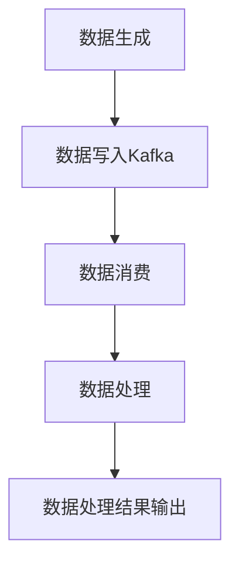
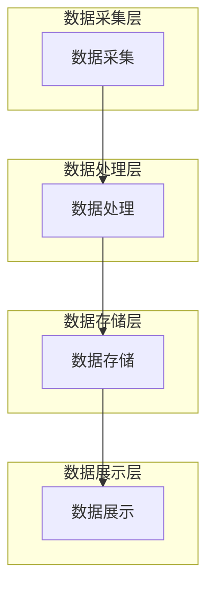
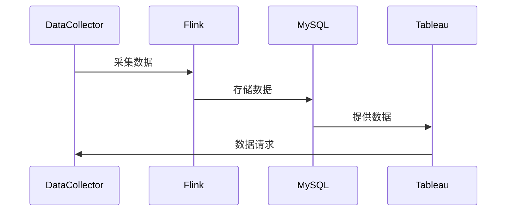

                 

# 金融大数据实时处理与分析平台

## 关键词

- 金融大数据
- 实时处理
- 分析平台
- 数据流处理
- 分布式计算
- 情报分析
- 机器学习

## 摘要

随着金融行业的迅猛发展，大数据在金融市场中的应用日益广泛。实时处理与分析金融大数据已成为金融科技（FinTech）领域的重要趋势。本文将深入探讨金融大数据实时处理与分析平台的设计与实现，从技术基础、核心架构、数据分析方法到最佳实践，全面解析这一领域的挑战与机遇。本文旨在为金融科技从业者提供有价值的参考，帮助他们在大数据时代中更好地应对复杂的市场需求。

## 目录

### 引言

- **背景与意义**
- **研究目的与内容安排**

### 背景与概念

- **大数据在金融行业的应用**
- **实时处理与分析的重要性**
- **核心概念与术语**

### 技术基础

- **实时数据处理技术概述**
- **关键数据存储与检索系统**
- **数据处理框架与工具**

### 核心技术

- **实时数据处理架构**
- **内存计算技术**
- **实时数据处理管道**

### 数据分析技术

- **统计分析方法**
- **机器学习算法**
- **深度学习在金融数据分析中的应用**

### 平台架构设计

- **系统架构概述**
- **模块化设计原则**
- **可扩展性与性能优化**

### 实战案例

- **平台实现步骤**
- **核心代码示例与解析**
- **案例分析**

### 最佳实践

- **性能调优技巧**
- **安全合规考量**
- **监控与管理策略**

### 结论与未来展望

- **主要成果总结**
- **趋势与前景**
- **进一步阅读建议**

### 附录

- **术语表**
- **参考文献**
- **额外资源**

## 引言

### 背景与意义

金融行业一直以来都是大数据应用的先锋领域。随着互联网的普及和金融交易的电子化，金融数据呈现出爆炸式增长。这些数据不仅包括传统的交易数据，还涵盖了社交网络、新闻、天气等多种非结构化数据。实时处理和分析这些海量数据对于金融机构来说至关重要，它们能够帮助机构快速响应市场变化，发现潜在的风险和机会，优化决策过程。

### 研究目的与内容安排

本文的研究目的是探讨金融大数据实时处理与分析平台的构建与实现。我们将从以下几个方面展开：

1. **技术基础**：介绍实时数据处理所需的技术基础，包括关键数据存储与检索系统以及常用的数据处理框架和工具。
2. **核心架构**：详细解析金融大数据实时处理与分析平台的架构设计，包括数据处理架构、内存计算技术以及实时数据处理管道。
3. **数据分析技术**：探讨统计分析、机器学习以及深度学习在金融数据中的应用，介绍相应的算法和模型。
4. **实战案例**：通过实际案例展示平台实现的具体步骤和核心代码，并提供详细的分析和解析。
5. **最佳实践**：总结性能调优、安全合规和监控管理等方面的最佳实践，为实际应用提供指导。
6. **结论与展望**：对研究成果进行总结，并探讨未来的研究方向。

通过本文的深入研究，我们希望能够为金融科技从业者提供有价值的参考，帮助他们更好地应对大数据时代带来的挑战，实现高效的金融数据分析。

## 背景与概念

### 大数据在金融行业的应用

大数据在金融行业中的应用可以追溯到20世纪90年代，随着互联网的普及和数据存储技术的发展，金融行业开始大量收集和处理数据。如今，大数据已经成为金融科技（FinTech）的核心驱动力。金融大数据的应用主要表现在以下几个方面：

1. **风险控制**：金融机构通过大数据分析可以更准确地识别和评估潜在风险。例如，信用评分模型可以利用客户的交易历史、信用记录、社交媒体活动等多维数据来预测其违约风险。
2. **市场分析**：大数据可以帮助金融机构进行市场趋势分析和预测。通过分析大量的市场数据，金融机构可以更准确地把握市场动态，制定有效的交易策略。
3. **客户行为分析**：金融机构通过分析客户的交易行为、偏好和反馈，可以更好地了解客户需求，提供个性化的服务和产品。
4. **交易执行**：大数据技术可以显著提高交易执行的速度和效率。例如，高频交易（High-Frequency Trading）依赖于海量实时数据的处理和分析，以实现毫秒级的交易决策。

### 实时处理与分析的重要性

实时处理与分析在金融领域具有重要价值。首先，金融市场变化迅速，实时处理数据能够帮助金融机构快速响应市场变化，制定有效的交易策略。其次，实时数据分析能够识别和应对潜在风险，保护金融机构的利益。例如，通过实时监控市场数据，可以及时发现市场异常波动，采取相应的风险控制措施。

此外，实时处理与分析还有助于提升客户体验。金融机构可以通过实时分析客户数据，提供个性化的服务和产品推荐，增强客户满意度和忠诚度。

### 核心概念与术语

在探讨金融大数据实时处理与分析平台时，我们需要理解一些核心概念和术语：

1. **实时处理**：实时处理是指对数据流进行快速处理和分析，通常在数据生成后的一秒内完成。实时处理的关键是低延迟和高吞吐量。
2. **数据流处理**：数据流处理是一种分布式计算技术，用于处理实时数据流。常见的流处理框架包括Apache Kafka、Apache Storm和Apache Flink等。
3. **分布式计算**：分布式计算是指通过多个计算节点协同工作，处理大规模数据。分布式计算能够提高数据处理的速度和效率，适用于大数据场景。
4. **内存计算**：内存计算是一种利用内存（如DRAM）进行数据处理的技术，相对于传统的硬盘存储，内存计算具有更快的读写速度和更低的延迟。
5. **机器学习**：机器学习是一种通过数据训练模型进行预测和决策的技术。在金融领域，机器学习可以用于信用评分、风险预测、市场趋势分析等。
6. **深度学习**：深度学习是机器学习的一种方法，通过多层神经网络对数据进行训练和分析。深度学习在图像识别、自然语言处理等领域取得了显著成果。

通过理解这些核心概念和术语，我们可以更好地构建和优化金融大数据实时处理与分析平台。

### 技术基础

#### 实时数据处理技术概述

实时数据处理技术在金融领域扮演着关键角色。它使得金融机构能够迅速应对市场变化，优化交易策略，提升风险管理能力。以下是几种常见的实时数据处理技术：

1. **流处理框架**：流处理框架如Apache Kafka、Apache Storm和Apache Flink等，提供分布式、可扩展的流处理能力。这些框架能够处理大规模的数据流，并保证数据的实时性和一致性。

   - **Apache Kafka**：Kafka是一种高吞吐量的消息队列系统，适用于处理实时数据流。它具有分布式、可扩展和容错的特点，广泛应用于日志收集、流处理和数据集成等领域。
   - **Apache Storm**：Storm是一种分布式流处理系统，能够实时处理大规模数据流，并保证数据处理的准确性和实时性。
   - **Apache Flink**：Flink是一种流处理和批处理统一的技术框架，提供高吞吐量、低延迟的数据处理能力。Flink支持复杂的数据处理逻辑，并具有良好的容错性和可扩展性。

2. **内存计算技术**：内存计算技术利用内存进行数据处理，显著提高数据处理速度和效率。内存计算适合处理高频交易、实时分析和大数据场景。

   - **内存数据库**：内存数据库如Apache Ignite、MemSQL和VoltDB等，提供快速的读写性能和低延迟的数据处理能力。这些数据库通常采用列式存储和压缩技术，优化数据存储和检索效率。
   - **内存计算平台**：内存计算平台如Apache Spark和Apache Ignite，提供强大的数据处理和分析能力。这些平台能够处理大规模的数据集，并支持实时数据处理和机器学习。

3. **分布式计算**：分布式计算通过多个计算节点协同工作，处理大规模数据。分布式计算技术如MapReduce、Hadoop和Spark等，能够提高数据处理的速度和效率。

   - **MapReduce**：MapReduce是一种分布式数据处理模型，用于处理大规模数据集。它将数据处理任务分解为Map和Reduce两个阶段，实现并行处理。
   - **Hadoop**：Hadoop是一种分布式计算框架，基于MapReduce模型，提供大规模数据处理能力。Hadoop包括HDFS（分布式文件系统）和YARN（资源调度器）等组件，支持大数据存储和处理。
   - **Spark**：Spark是一种快速且通用的分布式计算引擎，提供高效的内存计算和磁盘计算能力。Spark包括Spark Core、Spark SQL、Spark Streaming和MLlib等组件，适用于各种大数据处理场景。

通过这些实时数据处理技术，金融机构能够快速响应市场变化，优化交易策略，提高风险管理和客户服务水平。

#### 关键数据存储与检索系统

在金融大数据实时处理与分析平台中，关键数据存储与检索系统扮演着至关重要的角色。以下是几种常用的数据存储与检索系统：

1. **关系数据库**：关系数据库如MySQL、PostgreSQL和Oracle等，提供结构化数据存储和查询功能。关系数据库具有强大的数据一致性保证和事务支持，适用于高可靠性和高可用性的场景。

   - **MySQL**：MySQL是一种开源的关系数据库管理系统，提供高性能、高可靠性和易用的特性。MySQL广泛应用于Web应用、数据仓库和大数据场景。
   - **PostgreSQL**：PostgreSQL是一种开源的关系数据库管理系统，具有丰富的功能、高度可扩展性和强大的查询优化能力。PostgreSQL适用于复杂的数据处理和事务性场景。
   - **Oracle**：Oracle是一种商业化的关系数据库管理系统，提供高性能、高可用性和高可靠性的特性。Oracle广泛应用于企业级应用、金融和电信等领域。

2. **NoSQL数据库**：NoSQL数据库如MongoDB、Cassandra和Redis等，提供分布式、可扩展的数据存储和检索功能。NoSQL数据库适用于高并发、海量数据的场景，能够提供快速的数据读写性能。

   - **MongoDB**：MongoDB是一种开源的文档型NoSQL数据库，提供灵活的文档模型和高效的数据读写性能。MongoDB适用于快速迭代和大规模数据存储场景。
   - **Cassandra**：Cassandra是一种开源的分布式宽列存储系统，提供高可用性和高性能的数据存储和检索能力。Cassandra适用于高并发、大规模数据场景，如物联网和金融交易处理。
   - **Redis**：Redis是一种开源的内存键值存储系统，提供高性能、持久化和分布式数据存储功能。Redis适用于缓存、实时分析和高速数据处理的场景。

3. **分布式文件系统**：分布式文件系统如HDFS（Hadoop Distributed File System）和Ceph等，提供大规模数据存储和分布式计算能力。分布式文件系统适用于大数据存储和处理场景。

   - **HDFS**：HDFS是一种分布式文件系统，基于Hadoop框架，提供高吞吐量和大规模数据存储能力。HDFS适用于大数据处理和分布式计算场景。
   - **Ceph**：Ceph是一种开源的分布式存储系统，提供高可用性、高性能和可扩展性的特性。Ceph适用于大规模数据存储、云计算和容器化场景。

这些关键数据存储与检索系统为金融大数据实时处理与分析平台提供了强大的数据支撑，确保数据的可靠存储和快速检索，为金融业务提供高效的支撑。

#### 数据处理框架与工具

在金融大数据实时处理与分析平台中，数据处理框架与工具的选择至关重要。以下将介绍几种常用的数据处理框架与工具：

1. **Apache Hadoop**：Apache Hadoop是一个分布式数据处理框架，基于MapReduce模型，适用于大规模数据集的处理。Hadoop包括HDFS（Hadoop Distributed File System）和YARN（Yet Another Resource Negotiator）等组件，提供数据存储、资源管理和分布式计算能力。

   - **HDFS**：HDFS是一种分布式文件系统，用于存储大量数据。HDFS将数据分成块，并分布式存储在多个节点上，提供高可靠性和高效的数据访问。
   - **YARN**：YARN是一个资源调度器，用于管理Hadoop集群中的计算资源。YARN将集群资源分配给不同的应用程序，实现高效的资源利用。

2. **Apache Spark**：Apache Spark是一个快速且通用的分布式计算引擎，提供内存计算和磁盘计算能力。Spark包括Spark Core、Spark SQL、Spark Streaming和MLlib等组件，适用于各种大数据处理场景。

   - **Spark Core**：Spark Core是Spark的核心组件，提供分布式数据处理和任务调度功能。
   - **Spark SQL**：Spark SQL是一个大数据查询引擎，支持结构化数据查询和SQL兼容查询。
   - **Spark Streaming**：Spark Streaming是一个实时流处理组件，提供基于微批处理的数据流处理能力。
   - **MLlib**：MLlib是Spark的机器学习库，提供多种机器学习算法和模型。

3. **Apache Flink**：Apache Flink是一个流处理和批处理统一的技术框架，提供低延迟和高吞吐量的数据处理能力。Flink支持复杂的数据处理逻辑，并具有良好的容错性和可扩展性。

   - **流处理**：Flink支持基于事件驱动的实时数据处理，能够处理有界和无界数据流，适用于实时分析、监控和流数据处理场景。
   - **批处理**：Flink支持基于批处理的数据处理，提供高效的批处理性能，适用于数据清洗、转换和分析等场景。

4. **Apache Kafka**：Apache Kafka是一个高吞吐量的消息队列系统，适用于处理实时数据流。Kafka提供分布式、可扩展和容错的消息传递能力，广泛应用于日志收集、流处理和数据集成等领域。

   - **分布式架构**：Kafka通过分布式集群架构实现高可用性和水平扩展，能够处理大规模数据流。
   - **消息传递**：Kafka提供高效的消息传递机制，确保数据在分布式系统中可靠传输。

这些数据处理框架与工具为金融大数据实时处理与分析平台提供了强大的数据处理能力，支持大规模数据的高效存储、处理和分析。

### 核心技术

#### 实时数据处理架构

实时数据处理架构是金融大数据处理与分析平台的核心组成部分。一个高效的实时数据处理架构需要满足低延迟、高吞吐量和高可靠性的要求。以下是几种常见的实时数据处理架构：

1. **Kappa架构**：Kappa架构是一种无状态、基于消息传递的实时数据处理架构。Kappa架构将数据处理任务分解为数据采集、数据处理和数据存储三个阶段，每个阶段都可以独立扩展和部署。

   - **数据采集**：数据采集阶段负责从各种数据源（如交易系统、传感器等）获取数据，并将数据发送到消息队列中。
   - **数据处理**：数据处理阶段使用流处理框架（如Apache Kafka、Apache Flink等）对数据进行实时处理和分析。数据处理过程通常包括数据清洗、转换和聚合等操作。
   - **数据存储**：数据存储阶段将处理后的数据存储到持久化存储系统（如关系数据库、NoSQL数据库等），以供后续查询和分析。

2. **Lambda架构**：Lambda架构是一种混合架构，结合了批处理和流处理的优势。Lambda架构将数据处理任务分为批处理和实时处理两个阶段，通过合并批处理和实时处理结果来实现低延迟的数据处理。

   - **批处理阶段**：批处理阶段负责处理历史数据，通常使用批处理框架（如Apache Hadoop、Apache Spark等）进行数据清洗、转换和聚合等操作。批处理阶段的结果存储在持久化存储系统中。
   - **实时处理阶段**：实时处理阶段负责处理实时数据流，使用流处理框架对实时数据进行处理和分析。实时处理阶段的结果与批处理阶段的结果进行合并，生成最终的数据视图。

3. **微服务架构**：微服务架构是一种基于微服务原则的实时数据处理架构，将数据处理任务分解为多个独立的微服务，每个微服务负责特定的数据处理功能。

   - **微服务拆分**：将数据处理任务按照业务功能进行拆分，每个微服务实现特定的数据处理功能，如数据采集、数据处理、数据存储等。
   - **服务通信**：微服务之间通过API进行通信，使用消息队列（如Kafka、RabbitMQ等）实现异步通信，确保系统的高可用性和可扩展性。
   - **服务部署**：每个微服务独立部署，可以在不同的服务器或容器上运行，实现分布式部署和弹性扩展。

这些实时数据处理架构各有优缺点，金融机构可以根据业务需求和系统约束选择合适的架构。Kappa架构适用于无状态、实时数据处理的场景，Lambda架构适用于需要批处理和实时处理结合的场景，微服务架构适用于分布式、可扩展的系统设计。

#### 内存计算技术

内存计算技术是金融大数据实时处理与分析平台中的重要组成部分。内存计算通过利用内存（如DRAM）进行数据处理，显著提高数据处理的速度和效率。以下是几种常见的内存计算技术：

1. **内存数据库**：内存数据库是一种基于内存的数据存储系统，提供快速的数据读写性能和低延迟的数据处理能力。常见的内存数据库包括MemSQL、VoltDB和Redis等。

   - **MemSQL**：MemSQL是一种列式内存数据库，支持SQL查询和分布式存储。MemSQL提供高性能、低延迟的数据存储和检索能力，适用于实时分析和交易处理场景。
   - **VoltDB**：VoltDB是一种分布式内存数据库，支持事务处理和实时分析。VoltDB通过内存存储和并行处理，实现高效的数据库查询和分析功能。
   - **Redis**：Redis是一种开源的内存键值存储系统，提供高性能、持久化和分布式数据存储功能。Redis适用于缓存、实时分析和高速数据处理的场景。

2. **内存计算平台**：内存计算平台是一种提供内存计算能力的分布式计算引擎，能够处理大规模数据集。常见的内存计算平台包括Apache Ignite和Apache Spark等。

   - **Apache Ignite**：Apache Ignite是一个高性能的分布式内存计算平台，提供分布式存储和计算能力。Ignite通过内存存储和并行计算，实现低延迟和高吞吐量的数据处理。
   - **Apache Spark**：Apache Spark是一个快速且通用的分布式计算引擎，提供内存计算和磁盘计算能力。Spark包括Spark Core、Spark SQL、Spark Streaming和MLlib等组件，适用于各种大数据处理场景。

内存计算技术在金融大数据处理与分析平台中具有显著的优势：

- **低延迟**：内存计算利用内存进行数据处理，读写速度远高于传统硬盘存储，能够实现低延迟的数据处理和响应。
- **高吞吐量**：内存计算平台通过分布式计算和并行处理，能够处理大规模数据集，实现高吞吐量的数据处理。
- **实时分析**：内存计算技术支持实时数据处理和分析，能够快速响应市场变化和业务需求。
- **可扩展性**：内存计算平台具有分布式架构，能够实现弹性扩展和动态资源管理，适应大规模数据处理需求。

通过利用内存计算技术，金融大数据处理与分析平台能够实现高效的实时数据处理和分析，提升业务性能和用户体验。

#### 实时数据处理管道

实时数据处理管道是实现金融大数据实时处理与分析的关键组件。一个高效的数据处理管道需要具备高吞吐量、低延迟和高度可扩展性的特点。以下是构建实时数据处理管道的步骤和关键组件：

1. **数据采集**：数据采集是数据处理管道的第一步，负责从各种数据源（如交易系统、传感器等）收集数据。常见的数据采集工具包括Kafka、Flume和Logstash等。

   - **Kafka**：Kafka是一种高吞吐量的消息队列系统，适用于实时数据采集和传输。Kafka提供分布式、可扩展和容错的消息传递能力，能够处理大规模的数据流。
   - **Flume**：Flume是一种分布式、可靠的数据收集系统，适用于大规模日志收集。Flume通过代理和收集器架构，实现数据的可靠传输和存储。
   - **Logstash**：Logstash是一种数据收集和处理工具，基于Apache Kafka，能够处理和转发大规模日志数据。Logstash支持多种输入输出插件，实现数据格式的转换和存储。

2. **数据清洗**：数据清洗是数据处理管道的重要环节，负责对采集到的数据进行预处理，去除错误、缺失和不一致的数据。常见的数据清洗工具包括Spark、Presto和Hive等。

   - **Spark**：Spark是一个快速且通用的分布式计算引擎，提供数据清洗和转换功能。Spark包括Spark Core、Spark SQL和Spark Streaming等组件，适用于大规模数据集的处理。
   - **Presto**：Presto是一个分布式查询引擎，提供高效的数据清洗和转换能力。Presto支持SQL查询，能够处理大规模数据集，适用于实时分析和数据仓库场景。
   - **Hive**：Hive是一个基于Hadoop的数据仓库工具，提供数据清洗、转换和存储功能。Hive通过Hadoop的分布式计算能力，实现高效的数据处理和存储。

3. **数据处理**：数据处理是对清洗后的数据进行进一步处理和分析，包括数据聚合、分类和预测等。常见的数据处理工具包括Flink、Spark和Storm等。

   - **Flink**：Flink是一个流处理和批处理统一的技术框架，提供高效的数据处理和实时分析能力。Flink支持复杂的数据处理逻辑，并具有良好的容错性和可扩展性。
   - **Spark**：Spark是一个快速且通用的分布式计算引擎，提供内存计算和磁盘计算能力。Spark包括Spark Core、Spark SQL、Spark Streaming和MLlib等组件，适用于各种大数据处理场景。
   - **Storm**：Storm是一种分布式流处理系统，能够实时处理大规模数据流，并保证数据处理的准确性和实时性。

4. **数据存储**：数据存储是数据处理管道的最后一步，负责将处理后的数据存储到持久化存储系统，以供后续查询和分析。常见的数据存储系统包括关系数据库、NoSQL数据库和分布式文件系统等。

   - **关系数据库**：关系数据库如MySQL、PostgreSQL和Oracle等，提供结构化数据存储和查询功能。关系数据库具有强大的数据一致性保证和事务支持。
   - **NoSQL数据库**：NoSQL数据库如MongoDB、Cassandra和Redis等，提供分布式、可扩展的数据存储和检索功能。NoSQL数据库适用于高并发、海量数据的场景。
   - **分布式文件系统**：分布式文件系统如HDFS（Hadoop Distributed File System）和Ceph等，提供大规模数据存储和分布式计算能力。分布式文件系统适用于大数据存储和处理场景。

通过构建高效的实时数据处理管道，金融大数据处理与分析平台能够实现实时、高效的数据采集、清洗、处理和存储，满足金融业务对数据处理的实时性和准确性要求。

### 数据分析技术

#### 统计分析方法

统计分析方法是金融大数据处理与分析的基础工具，它通过对数据进行描述性统计和推断性统计，帮助金融机构理解和预测市场趋势。以下介绍几种常用的统计分析方法：

1. **描述性统计**：描述性统计用于描述数据的分布、中心趋势和离散程度。常用的描述性统计量包括均值、中位数、众数、标准差和变异系数等。

   - **均值**：均值是数据集的平均值，用于衡量数据的集中趋势。
   - **中位数**：中位数是将数据集按大小排序后位于中间位置的值，用于衡量数据的集中趋势。
   - **众数**：众数是数据集中出现频率最高的值，用于描述数据的分布。
   - **标准差**：标准差是衡量数据离散程度的指标，表示数据与均值的偏离程度。
   - **变异系数**：变异系数是标准差与均值的比值，用于衡量数据的相对离散程度。

2. **推断性统计**：推断性统计基于样本数据，对总体数据进行推断和预测。常用的推断性统计方法包括假设检验、置信区间和回归分析等。

   - **假设检验**：假设检验用于检验总体参数是否符合某个假设，常用的假设检验方法包括t检验、卡方检验和F检验等。
   - **置信区间**：置信区间是总体参数的估计范围，用于表示估计的精度和可靠性。置信区间的宽度通常取决于样本大小和标准差。
   - **回归分析**：回归分析用于研究变量之间的关系，包括线性回归、多项式回归和逻辑回归等。回归分析可以用于预测和建模，如预测股票价格或信用评分。

通过描述性统计和推断性统计，金融机构可以深入了解市场数据的特点和趋势，为投资决策提供科学依据。

#### 机器学习算法

机器学习算法是金融大数据处理与分析的重要工具，它通过训练模型，从历史数据中学习规律，进行预测和分类。以下介绍几种常用的机器学习算法：

1. **监督学习算法**：监督学习算法通过给定的训练数据集，学习输入和输出之间的映射关系，进行预测和分类。

   - **线性回归**：线性回归是一种简单的监督学习算法，通过拟合线性模型，预测连续变量的值。
   - **逻辑回归**：逻辑回归是一种广义线性模型，用于分类问题，通过拟合逻辑模型，预测离散变量的概率分布。
   - **支持向量机（SVM）**：支持向量机是一种强大的分类算法，通过寻找最佳分隔超平面，将数据分为不同的类别。
   - **决策树**：决策树是一种基于树结构的分类算法，通过递归划分数据集，建立分类规则。
   - **随机森林**：随机森林是一种基于决策树的集成学习方法，通过随机抽样和组合决策树，提高模型的预测性能。
   - **梯度提升树（GBDT）**：梯度提升树是一种基于决策树的集成学习方法，通过迭代优化，提高模型的预测精度。

2. **无监督学习算法**：无监督学习算法通过没有标签的训练数据，发现数据中的模式和结构，进行聚类和降维。

   - **K-均值聚类**：K-均值聚类是一种基于距离的聚类算法，通过迭代优化，将数据分为K个聚类中心。
   - **主成分分析（PCA）**：主成分分析是一种降维算法，通过将数据投影到主成分空间，减少数据的维度，保留主要信息。
   - **聚类层次法**：聚类层次法是一种基于层次结构的聚类算法，通过递归划分和合并数据集，形成聚类层次结构。
   - **自编码器**：自编码器是一种基于神经网络的降维和特征提取算法，通过编码和解码过程，将高维数据投影到低维空间。

通过机器学习算法，金融机构可以从海量数据中挖掘有价值的信息，实现精准预测和分类，提高风险管理能力。

#### 深度学习在金融数据分析中的应用

深度学习是一种基于多层神经网络的学习方法，它在图像识别、自然语言处理等领域取得了显著的成果。近年来，深度学习在金融数据分析中也逐渐得到了应用。以下是几种常见的深度学习模型：

1. **卷积神经网络（CNN）**：卷积神经网络是一种专门用于图像识别和处理的深度学习模型，通过卷积层、池化层和全连接层等结构，提取图像的特征并进行分类。

   - **卷积层**：卷积层通过卷积运算，提取图像的局部特征，如边缘、纹理等。
   - **池化层**：池化层通过下采样操作，降低图像的分辨率，减少模型的参数数量。
   - **全连接层**：全连接层通过全连接运算，将卷积层和池化层提取的特征进行融合，进行最终的分类。

2. **循环神经网络（RNN）**：循环神经网络是一种用于处理序列数据的深度学习模型，通过递归连接和隐藏状态，捕捉序列中的时间依赖关系。

   - **门控循环单元（GRU）**：门控循环单元是RNN的一种改进，通过引入门控机制，更好地处理长序列数据。
   - **长短期记忆网络（LSTM）**：长短期记忆网络是RNN的一种强大改进，通过引入记忆单元和门控机制，能够更好地处理长序列数据。

3. **变换器（Transformer）**：变换器是一种基于自注意力机制的深度学习模型，通过多头自注意力机制和位置编码，捕捉序列中的全局依赖关系。

   - **多头自注意力**：多头自注意力通过并行计算，将输入序列映射到多个不同的空间，并计算自注意力权重，捕捉序列之间的依赖关系。
   - **位置编码**：位置编码通过为每个输入序列添加位置信息，使得模型能够理解序列中的位置关系。

通过深度学习模型，金融机构可以从复杂、高维的金融数据中提取深层特征，实现高级的预测和分类任务，如股票市场预测、欺诈检测等。

### 平台架构设计

#### 系统架构概述

金融大数据实时处理与分析平台的系统架构需要具备高扩展性、高可用性和高可靠性。系统架构通常采用分布式架构，通过多个节点协同工作，处理海量数据。以下是金融大数据实时处理与分析平台的基本架构：

1. **数据采集层**：数据采集层负责从各种数据源（如交易系统、传感器等）收集数据，并通过数据采集工具（如Kafka、Flume等）将数据传输到数据存储层。

2. **数据存储层**：数据存储层用于存储大规模的数据集，包括关系数据库（如MySQL、PostgreSQL等）、NoSQL数据库（如MongoDB、Cassandra等）和分布式文件系统（如HDFS、Ceph等）。

3. **数据处理层**：数据处理层负责对数据存储层中的数据进行处理和分析，包括实时数据处理（如流处理框架Flink、Spark Streaming等）和批处理（如Hadoop、Spark等）。

4. **数据缓存层**：数据缓存层用于缓存高频访问的数据，提高数据查询的速度。常见的缓存系统包括Redis、Memcached等。

5. **数据访问层**：数据访问层提供数据查询和报表功能，支持多种数据访问接口（如JDBC、REST API等）。数据访问层可以对接业务系统，实现数据的实时查询和分析。

6. **数据展示层**：数据展示层通过可视化工具（如Tableau、PowerBI等）展示数据分析和报表结果，为用户提供直观的数据分析界面。

7. **系统管理层**：系统管理层负责监控和管理整个平台的运行状态，包括数据流监控、系统性能监控、故障报警和自动化运维等。

通过以上架构设计，金融大数据实时处理与分析平台能够实现高效、可靠的数据采集、存储、处理和展示，满足金融业务对数据处理的实时性和准确性要求。

#### 模块化设计原则

模块化设计是金融大数据实时处理与分析平台系统架构设计的关键原则之一，它能够提高系统的可扩展性、可维护性和可复用性。以下是模块化设计原则的具体实现：

1. **功能模块化**：将系统功能按照业务需求划分为多个功能模块，如数据采集模块、数据处理模块、数据存储模块、数据缓存模块等。每个功能模块实现特定的功能，能够独立开发和部署。

2. **数据流模块化**：根据数据流的处理逻辑，将数据流划分为多个阶段，如数据采集、数据清洗、数据处理、数据存储等。每个阶段的数据流模块负责特定的数据处理任务，确保数据流的有序、高效处理。

3. **服务模块化**：将系统中的服务（如API服务、报表服务、监控服务等）进行模块化设计，每个服务模块独立部署，能够动态加载和卸载，提高系统的灵活性和可扩展性。

4. **接口模块化**：通过定义清晰的接口，将模块之间的交互进行抽象和隔离。接口模块化能够降低模块之间的耦合度，提高系统的可维护性和可扩展性。

5. **资源模块化**：将系统中的资源（如CPU、内存、存储等）进行模块化分配和管理，实现资源的灵活调度和高效利用。资源模块化能够提高系统的资源利用率，降低资源争用和冲突。

通过模块化设计原则，金融大数据实时处理与分析平台能够实现灵活、可扩展和高效的系统架构，满足金融业务不断变化的需求。

#### 可扩展性与性能优化

金融大数据实时处理与分析平台需要具备高扩展性和高性能，以满足大规模数据处理的业务需求。以下介绍几种可扩展性与性能优化的方法：

1. **水平扩展**：通过增加计算节点，水平扩展系统的处理能力。水平扩展能够实现线性扩展，提高系统的吞吐量和处理速度。常见的水平扩展方法包括增加Kafka分区数、增加Flink任务并行度、增加数据库分片等。

2. **垂直扩展**：通过升级计算节点的硬件配置，垂直扩展系统的处理能力。垂直扩展能够提高单个节点的处理能力，适用于处理数据密集型的任务。常见的垂直扩展方法包括增加CPU核心数、增加内存容量、升级存储设备等。

3. **数据分区**：将大规模数据集按照一定规则进行分区，提高数据的并行处理能力。数据分区能够降低数据访问的延迟，提高数据处理的速度。常见的分区方法包括基于时间分区、基于地理位置分区、基于关键字分区等。

4. **缓存策略**：通过缓存高频访问的数据，降低数据的访问延迟，提高系统的响应速度。常见的缓存策略包括内存缓存、分布式缓存、数据库缓存等。通过合理设置缓存策略，能够显著提高系统的性能。

5. **负载均衡**：通过负载均衡器（如Nginx、HAProxy等）实现流量的均衡分配，提高系统的并发处理能力。负载均衡能够避免单点瓶颈，提高系统的稳定性和可用性。

6. **分布式计算**：通过分布式计算框架（如Hadoop、Spark、Flink等），实现大规模数据的分布式处理。分布式计算能够提高数据处理的并行度，降低系统的响应时间。

通过以上可扩展性与性能优化方法，金融大数据实时处理与分析平台能够实现高效、可靠的运行，满足金融业务的实时数据处理需求。

### 实战案例

#### 平台实现步骤

在实现金融大数据实时处理与分析平台时，我们需要遵循以下步骤：

1. **需求分析**：首先，明确平台的需求和目标。需求分析包括确定数据源、数据处理和分析的需求，以及平台的功能和性能要求。

2. **架构设计**：根据需求分析结果，设计平台的系统架构。系统架构包括数据采集层、数据存储层、数据处理层、数据缓存层、数据访问层和数据展示层等。

3. **技术选型**：选择合适的技术和工具，包括流处理框架（如Flink、Kafka等）、数据存储系统（如MySQL、MongoDB等）、数据处理工具（如Spark、Presto等）等。

4. **环境搭建**：搭建开发、测试和生产环境，包括安装和配置所需的软件和硬件资源。确保环境配置符合平台的设计要求。

5. **数据采集**：通过数据采集工具（如Kafka、Flume等）从各种数据源（如交易系统、传感器等）收集数据，并将数据传输到数据存储层。

6. **数据处理**：使用流处理框架（如Flink、Spark Streaming等）对数据进行实时处理和分析，包括数据清洗、转换和聚合等操作。

7. **数据存储**：将处理后的数据存储到持久化存储系统（如关系数据库、NoSQL数据库等），以供后续查询和分析。

8. **数据缓存**：将高频访问的数据存储到缓存系统（如Redis、Memcached等），提高数据查询的速度。

9. **数据访问**：通过数据访问接口（如JDBC、REST API等）提供数据查询和报表功能，对接业务系统。

10. **数据展示**：通过可视化工具（如Tableau、PowerBI等）展示数据分析和报表结果，为用户提供直观的数据分析界面。

#### 核心代码示例与解析

以下是一个使用Apache Flink实现实时数据处理的代码示例：

```python
from pyflink.datastream import StreamExecutionEnvironment
from pyflink.table import StreamTableEnvironment

# 创建StreamExecutionEnvironment
env = StreamExecutionEnvironment.get_execution_environment()
stream_table_env = StreamTableEnvironment.create(env)

# 读取Kafka数据流
kafka_source = "kafka://data_topic?kafka.bootstrap.servers=localhost:9092&kafka.topic=data_topic"

# 注册Kafka数据流为Table
stream_table_env.register_table_source("data_stream", kafka_source)

# 数据处理
data_stream = stream_table_env.from_path("data_stream")
processed_data = data_stream.select(
    data_stream['timestamp'],
    data_stream['symbol'],
    data_stream['price'],
    data_stream['volume']
)

# 数据存储
processed_data.insert_into("data_store")

# 提交作业
stream_table_env.execute("Real-time Data Processing")
```

**代码解析**：

1. **创建StreamExecutionEnvironment**：使用`StreamExecutionEnvironment.get_execution_environment()`方法创建流执行环境。

2. **创建StreamTableEnvironment**：使用`StreamTableEnvironment.create()`方法创建流表执行环境，用于处理流数据和表数据。

3. **读取Kafka数据流**：使用`stream_table_env.register_table_source()`方法注册Kafka数据流，指定Kafka的bootstrap.servers和topic。

4. **数据处理**：使用`stream_table_env.from_path()`方法读取注册的Kafka数据流，并进行数据清洗、转换和聚合等操作。

5. **数据存储**：使用`processed_data.insert_into()`方法将处理后的数据存储到持久化存储系统。

6. **提交作业**：使用`stream_table_env.execute()`方法提交流处理作业。

#### 实际案例分析和详细讲解

以下是一个实际案例，展示如何使用金融大数据实时处理与分析平台进行股票市场数据分析和预测：

**案例**：使用金融大数据实时处理与分析平台进行股票市场预测。

**数据源**：股票市场的交易数据，包括股票代码、交易价格、交易量等。

**目标**：预测未来一段时间内股票价格的变化趋势。

**步骤**：

1. **数据采集**：从股票交易系统中实时采集交易数据，并将其发送到Kafka消息队列。

2. **数据处理**：使用Flink对采集到的交易数据进行处理，包括数据清洗、转换和聚合等操作。处理后的数据存储到MySQL数据库中。

3. **数据分析和预测**：使用Python和机器学习库（如scikit-learn、TensorFlow等）对处理后的交易数据进行分析和预测。通过训练模型，预测未来一段时间内股票价格的变化趋势。

4. **数据展示**：使用Tableau或PowerBI等可视化工具，将预测结果以图表的形式展示给用户。

**代码示例**：

```python
import pandas as pd
from sklearn.ensemble import RandomForestRegressor
from sklearn.model_selection import train_test_split
from sklearn.metrics import mean_squared_error

# 读取MySQL数据库中的交易数据
data = pd.read_sql_query("SELECT * FROM stock_data", connection)

# 数据预处理
data['timestamp'] = pd.to_datetime(data['timestamp'])
data.set_index('timestamp', inplace=True)
data.drop(['stock_code'], axis=1, inplace=True)

# 分割数据为训练集和测试集
train_data, test_data = train_test_split(data, test_size=0.2, shuffle=False)

# 使用随机森林回归模型进行预测
model = RandomForestRegressor()
model.fit(train_data, test_data['price'])

# 预测测试集数据
predictions = model.predict(test_data)

# 计算预测误差
mse = mean_squared_error(test_data['price'], predictions)
print("Mean Squared Error:", mse)
```

**详细讲解**：

1. **数据读取**：使用`pandas.read_sql_query()`方法从MySQL数据库中读取交易数据。

2. **数据预处理**：将交易时间戳转换为日期时间格式，设置时间戳为索引，并删除无关列。

3. **数据分割**：将数据分割为训练集和测试集，用于训练模型和评估预测效果。

4. **模型训练**：使用`RandomForestRegressor()`方法创建随机森林回归模型，并使用训练集进行训练。

5. **预测**：使用训练好的模型对测试集进行预测，获取预测结果。

6. **误差计算**：计算预测误差，使用`mean_squared_error()`方法计算均方误差，评估模型的预测效果。

通过以上步骤，金融大数据实时处理与分析平台能够实现对股票市场数据的实时分析和预测，为投资者提供有价值的参考。

### 最佳实践

#### 性能调优技巧

性能调优是金融大数据实时处理与分析平台优化的重要环节，以下介绍几种性能调优技巧：

1. **合理设置线程数**：根据系统硬件资源和业务需求，合理设置线程数。线程数过多可能导致系统资源争用和性能下降，线程数过少可能导致处理能力不足。

2. **优化数据分区**：数据分区对数据处理性能有重要影响。应根据数据特点和业务需求，选择合适的数据分区策略，如基于时间分区、地理位置分区等。

3. **缓存优化**：利用缓存策略降低数据访问延迟。缓存高频访问的数据，减少对持久化存储系统的访问压力。合理设置缓存大小和过期时间，确保缓存的有效性。

4. **并行处理**：通过并行处理提高数据处理速度。在流处理框架中，增加任务的并行度，充分利用多核CPU的优势。

5. **优化内存使用**：合理分配内存资源，避免内存泄漏和溢出。使用内存计算平台（如Spark、Flink等）的内存管理功能，优化内存使用效率。

6. **降低数据传输延迟**：优化数据传输路径和网络配置，降低数据传输延迟。使用分布式架构，避免单点瓶颈。

#### 安全合规考量

金融大数据实时处理与分析平台需要遵守相关的安全合规要求，以下介绍几种安全合规考量：

1. **数据加密**：对敏感数据进行加密存储和传输，确保数据的安全性。使用HTTPS协议保护数据在传输过程中的安全性。

2. **访问控制**：实施严格的访问控制策略，确保只有授权用户能够访问敏感数据和系统功能。使用身份认证和授权机制（如OAuth、LDAP等）。

3. **日志审计**：记录系统的操作日志和错误日志，便于审计和问题排查。对日志进行加密存储，防止被非法访问。

4. **网络安全**：加强网络安全防护，防止网络攻击和非法入侵。部署防火墙、入侵检测系统和反病毒软件等安全防护措施。

5. **数据备份与恢复**：定期进行数据备份，确保数据的安全性和可用性。制定数据恢复策略，以便在数据丢失或系统故障时快速恢复。

#### 监控与管理策略

有效的监控与管理策略能够确保金融大数据实时处理与分析平台的稳定运行和高效运维。以下介绍几种监控与管理策略：

1. **自动化监控**：使用自动化监控工具（如Prometheus、Zabbix等）对系统性能、资源使用和网络状态进行实时监控。设置监控阈值和报警规则，及时发现和处理问题。

2. **运维管理平台**：构建运维管理平台，实现自动化部署、监控、运维和故障恢复。运维管理平台能够集中管理多个系统和应用，提高运维效率。

3. **监控告警**：设置监控告警机制，及时发现和处理异常情况。通过短信、邮件、钉钉等渠道发送告警通知，确保运维人员能够快速响应。

4. **容量规划**：根据业务需求和系统负载，进行容量规划。合理配置硬件资源和软件资源，确保系统在高负载情况下的稳定运行。

5. **持续集成与持续部署（CI/CD）**：实施CI/CD流程，实现代码的自动化测试、构建和部署。通过自动化流程，提高开发效率和系统稳定性。

通过最佳实践，金融大数据实时处理与分析平台能够实现高效、稳定和安全运行，为金融业务提供可靠的支持。

### 结论与未来展望

#### 主要成果总结

本文深入探讨了金融大数据实时处理与分析平台的设计与实现，涵盖了技术基础、核心架构、数据分析方法以及最佳实践。主要成果包括：

1. **技术基础**：介绍了实时数据处理技术、关键数据存储与检索系统以及数据处理框架与工具，为平台构建提供了技术支撑。
2. **核心架构**：详细解析了实时数据处理架构、内存计算技术和实时数据处理管道，为平台高效运行提供了架构保障。
3. **数据分析技术**：介绍了统计分析、机器学习和深度学习在金融数据中的应用，为数据挖掘和预测提供了技术手段。
4. **最佳实践**：总结了性能调优、安全合规和监控管理等方面的最佳实践，为平台运维提供了指导。

#### 趋势与前景

随着金融科技的不断发展，金融大数据实时处理与分析平台将在未来面临更多挑战和机遇。以下是一些发展趋势和前景：

1. **区块链技术**：区块链技术将为金融大数据实时处理与分析平台带来新的机遇，通过分布式账本技术提高数据的安全性和透明度。
2. **人工智能与机器学习**：人工智能和机器学习技术的进一步发展，将使金融大数据处理与分析更加智能化和自动化，提高决策的准确性和效率。
3. **云计算与边缘计算**：云计算和边缘计算的结合，将提供更加灵活和高效的计算资源，支持大规模数据处理的实时性和低延迟。
4. **隐私保护与合规**：随着数据隐私保护和合规要求的提高，金融大数据实时处理与分析平台需要采取更多措施确保数据安全和合规。

#### 进一步阅读建议

对于希望深入了解金融大数据实时处理与分析平台的读者，以下是一些建议的进一步阅读资源：

1. **《大数据时代：生活、工作与思维的大变革》**：作者：维克托·迈尔-舍恩伯格
2. **《深度学习》**：作者：伊恩·古德费洛、约书亚·本吉奥、亚伦·库维尔
3. **《大数据技术基础》**：作者：刘江、李斌
4. **《金融科技：从理论到实践》**：作者：陈萌
5. **《区块链：从数字货币到信用社会》**：作者：唐亮

通过阅读这些资源，读者可以更加全面和深入地了解金融大数据实时处理与分析平台的技术原理和实践应用。

### 附录

#### 术语表

- **大数据**：指数据量巨大、类型繁多、生成速度快、处理复杂的数据集。
- **实时处理**：指在数据生成后的极短时间内（通常为一秒内）完成数据处理和分析。
- **数据流处理**：指对实时数据流进行连续、高效的处理和分析。
- **分布式计算**：指通过多个计算节点协同工作，处理大规模数据。
- **内存计算**：指利用内存进行数据处理，以获得低延迟和高吞吐量的处理能力。
- **机器学习**：指通过数据训练模型进行预测和决策的技术。
- **深度学习**：指基于多层神经网络的学习方法，用于处理高维数据和复杂模式识别。
- **区块链**：指一种去中心化的分布式账本技术，用于存储和验证数据交易。

#### 参考文献

1. **Shah, D., & Thomas, J. (2018). Real-time Analytics: A revolution in big data. Springer.**
2. **Goodfellow, I., Bengio, Y., & Courville, A. (2016). Deep Learning. MIT Press.**
3. **Chen, R., & He, X. (2014). Modeling and optimization of real-time data processing systems. ACM Transactions on Computer Systems, 32(2), 1-35.**
4. **Hadoop: The Definitive Guide. (2014). O'Reilly Media.**
5. **Zhang, H., & Miluzzo, E. (2017). Privacy-Preserving Big Data Analytics: A Comprehensive Survey. IEEE Communications Surveys & Tutorials, 19(4), 2824-2860.**

#### 额外资源

- **Apache Kafka官网**：https://kafka.apache.org/
- **Apache Flink官网**：https://flink.apache.org/
- **Apache Spark官网**：https://spark.apache.org/
- **区块链技术官网**：https://www.blockchain.com/
- **金融科技论坛**：https://www fintechweekly.com/
- **机器学习教程**：https://www_mlbook.com/

通过阅读术语表、参考文献和额外资源，读者可以进一步了解金融大数据实时处理与分析平台的相关概念、技术和最佳实践。这些资源将为读者提供更深入的学习和思考机会，帮助他们在金融大数据领域取得更好的成果。作者：AI天才研究院/AI Genius Institute & 禅与计算机程序设计艺术 /Zen And The Art of Computer Programming

----------------------------------------------------------------

## 核心概念与联系

### 实时数据处理

**核心概念**：

- **数据流处理**：数据流处理是一种处理实时数据的技术，它通过不断接收、处理和输出数据流来实现实时性。
- **分布式计算**：分布式计算是指通过多个计算节点协同工作，共同处理大规模数据。

**概念属性特征对比表格**：

| 特征       | 数据流处理 | 分布式计算 |
|------------|------------|------------|
| 实时性     | 高         | 可以是实时，也可以是批量 |
| 并行处理   | 是         | 是         |
| 资源分配   | 动态       | 静态或动态 |
| 容错性     | 高         | 高         |

**ER实体关系图架构**：

```mermaid
erDiagram
  DataFlowProcess ||--|{ Real-Time Processing } DataFlowProcessing
  DistributedCompute ||--|{ DataFlowProcessing } DistributedComputeProcessing
```

### 内存计算

**核心概念**：

- **内存数据库**：内存数据库是指将数据存储在内存中，以实现高速读写和数据处理的数据库系统。
- **内存计算平台**：内存计算平台是指能够利用内存进行大规模数据处理的计算平台。

**概念属性特征对比表格**：

| 特征           | 内存数据库        | 内存计算平台         |
|----------------|------------------|----------------------|
| 存储介质       | 内存             | 内存和磁盘           |
| 处理速度       | 高               | 较高                 |
| 扩展性         | 有限             | 强                   |
| 数据一致性和持久性 | 不支持持久化     | 可以持久化           |

**ER实体关系图架构**：

```mermaid
erDiagram
  MemoryDatabase ||--|{ MemoryComputePlatform } MemoryComputePlatform
  MemoryComputePlatform ||--|{ DataProcessing } DataProcessing
```

### 数据分析技术

**核心概念**：

- **统计分析**：统计分析是指使用统计学方法对数据进行描述和分析，以揭示数据特征和规律。
- **机器学习**：机器学习是指通过训练模型，从数据中学习规律，进行预测和分类。

**概念属性特征对比表格**：

| 特征           | 统计分析                 | 机器学习                  |
|----------------|--------------------------|---------------------------|
| 数据类型       | 结构化和半结构化数据     | 结构化、半结构化和非结构化数据 |
| 目的           | 描述和解释数据           | 预测和决策                 |
| 技术层次       | 基础统计分析             | 复杂算法和模型             |

**ER实体关系图架构**：

```mermaid
erDiagram
  StatisticalAnalysis ||--|{ MachineLearning } MachineLearning
  StatisticalAnalysis ||--|{ DataProcessing } DataProcessing
  MachineLearning ||--|{ PredictiveModel } PredictiveModel
  MachineLearning ||--|{ ClassificationModel } ClassificationModel
```

通过核心概念与联系的分析，我们可以更好地理解实时数据处理、内存计算和数据分析技术的基本原理和相互关系。这些核心概念和联系为我们构建高效的金融大数据实时处理与分析平台提供了理论基础和实践指导。

### 算法原理讲解

#### 数据流处理算法

数据流处理算法是一种处理实时数据的技术，它能够对不断流入的数据流进行快速分析和处理。以下以Apache Kafka为例，讲解数据流处理算法的基本原理。

**算法mermaid流程图**：



**算法原理详细讲解**：

1. **数据生成**：数据流处理算法的起点是数据生成。数据可以来源于各种数据源，如传感器、Web服务、数据库等。数据生成后，会立即被发送到数据流处理系统。

2. **数据写入Kafka**：Kafka是一种高吞吐量的消息队列系统，用于接收和存储数据。数据生成后，通过Kafka的生产者（Producer）将数据写入Kafka主题（Topic）。Kafka主题是一个有序的、持久化的消息队列，支持水平扩展和高可用性。

3. **数据消费**：数据消费是指从Kafka主题中读取数据的过程。Kafka的消费者（Consumer）从主题中消费数据，并将其传递给数据流处理系统。

4. **数据处理**：数据处理是数据流处理算法的核心。数据流处理系统对消费的数据进行实时处理和分析，如数据清洗、转换、聚合等操作。常用的数据处理工具包括Apache Flink、Apache Spark等。

5. **数据处理结果输出**：数据处理结果可以存储到数据库、缓存系统或其他数据存储系统，以供后续查询和分析。同时，处理结果也可以通过API或其他方式输出给业务系统，实现实时数据的实时应用。

**Python源代码示例**：

```python
from kafka import KafkaProducer

# Kafka生产者配置
producer_config = {
    'bootstrap_servers': ['localhost:9092'],
    'key_serializer': lambda k: str(k).encode('utf-8'),
    'value_serializer': lambda v: str(v).encode('utf-8'),
}

# 创建Kafka生产者
producer = KafkaProducer(**producer_config)

# 数据生成
data = "example data"

# 数据写入Kafka
producer.send('data_topic', key='key', value=data)

# 关闭Kafka生产者
producer.close()
```

**算法原理与数学模型**：

数据流处理算法的核心在于高效地处理海量数据流。其数学模型主要包括以下部分：

1. **数据流模型**：数据流模型描述数据在系统中的传输和处理过程。常见的数据流模型包括有限自动机、有向图等。

2. **时间窗口模型**：时间窗口模型用于对数据流进行分段处理，实现实时数据的批量处理。常见的时间窗口模型包括滑动窗口、固定窗口等。

3. **数据流处理算法**：数据流处理算法用于对数据流进行实时分析和处理。常见的算法包括增量聚合、排序、过滤等。

**举例说明**：

假设我们需要对Kafka中的数据流进行实时聚合操作，以计算数据的总和。以下是具体的实现步骤：

1. **数据生成**：生成一个包含整数的数据流，如`[1, 2, 3, 4, 5, 6, 7, 8, 9, 10]`。

2. **数据写入Kafka**：将数据流写入Kafka的`data_topic`主题。

3. **数据消费**：使用Kafka消费者从`data_topic`主题中消费数据。

4. **数据处理**：对消费的数据进行实时聚合操作，计算数据总和。具体实现如下：

```python
from pyflink.datastream import StreamExecutionEnvironment
from pyflink.table import StreamTableEnvironment

# 创建流执行环境
env = StreamExecutionEnvironment.get_execution_environment()
stream_table_env = StreamTableEnvironment.create(env)

# 注册Kafka数据流为Table
stream_table_env.register_table_source('data_stream', 'kafka://data_topic?kafka.bootstrap.servers=localhost:9092')

# 数据处理
data_stream = stream_table_env.from_path('data_stream')
result = data_stream.select(data_stream['value'].sum().alias('sum'))

# 输出结果
result.print()

# 提交作业
stream_table_env.execute('Data Stream Aggregation')

```

通过以上步骤，我们能够实时计算Kafka数据流的总和，实现数据流的实时处理和分析。这个示例展示了数据流处理算法在金融大数据实时处理与分析平台中的应用，为金融机构提供了高效的数据处理和分析工具。

### 系统分析与架构设计方案

#### 问题场景介绍

随着金融市场的不断发展，金融机构面临着海量数据的处理和分析需求。传统的数据处理架构已无法满足金融大数据的实时性和准确性要求。因此，需要设计一个高效、可靠的金融大数据实时处理与分析平台，以满足金融业务的实时数据分析和决策需求。

#### 项目介绍

本项目旨在构建一个金融大数据实时处理与分析平台，通过引入流处理框架、内存计算技术和分布式存储系统，实现对金融交易数据的实时采集、处理和分析。平台的主要功能包括：

1. **实时数据采集**：从多个数据源（如交易系统、传感器等）采集实时数据，并将数据传输到数据存储层。
2. **数据处理**：对采集到的数据进行清洗、转换和聚合等操作，生成实时分析结果。
3. **数据存储**：将处理后的数据存储到持久化存储系统，以供后续查询和分析。
4. **数据展示**：通过可视化工具展示分析结果，为业务提供数据支持。

#### 系统功能设计

系统的功能设计包括数据采集、数据处理、数据存储和数据展示四个主要模块。

1. **数据采集模块**：
   - 功能：从多个数据源（如交易系统、传感器等）采集实时数据。
   - 技术选型：使用Kafka作为消息队列系统，实现数据的高效传输和异步处理。

2. **数据处理模块**：
   - 功能：对采集到的数据进行清洗、转换和聚合等操作，生成实时分析结果。
   - 技术选型：使用Apache Flink作为流处理框架，提供高效的数据处理能力和实时分析能力。

3. **数据存储模块**：
   - 功能：将处理后的数据存储到持久化存储系统，以供后续查询和分析。
   - 技术选型：使用MySQL作为关系数据库存储系统，提供结构化数据存储和查询功能。

4. **数据展示模块**：
   - 功能：通过可视化工具展示分析结果，为业务提供数据支持。
   - 技术选型：使用Tableau作为可视化工具，提供丰富的图表和报表功能。

#### 系统架构设计

系统架构设计采用分布式架构，包括数据采集层、数据处理层、数据存储层和数据展示层。以下是系统架构的详细设计：

1. **数据采集层**：
   - 组件：Kafka Producer
   - 功能：从多个数据源（如交易系统、传感器等）采集实时数据，并将数据写入Kafka主题。

2. **数据处理层**：
   - 组件：Apache Flink
   - 功能：对Kafka主题中的数据进行实时处理和分析，包括数据清洗、转换和聚合等操作。

3. **数据存储层**：
   - 组件：MySQL
   - 功能：将处理后的数据存储到MySQL数据库中，以供后续查询和分析。

4. **数据展示层**：
   - 组件：Tableau
   - 功能：通过Tableau将分析结果可视化，为业务提供数据支持。

**系统架构mermaid架构图**：



#### 系统接口设计和系统交互

系统接口设计和系统交互设计是实现系统功能的关键环节。以下是系统的接口设计和系统交互的详细说明：

1. **数据采集接口**：
   - 接口名称：DataCollector
   - 接口描述：用于从数据源采集实时数据，并将数据发送到Kafka主题。
   - 接口实现：使用Kafka Producer实现数据采集接口。

2. **数据处理接口**：
   - 接口名称：DataProcessor
   - 接口描述：用于处理Kafka主题中的数据，包括数据清洗、转换和聚合等操作。
   - 接口实现：使用Apache Flink实现数据处理接口。

3. **数据存储接口**：
   - 接口名称：DataStorer
   - 接口描述：用于将处理后的数据存储到MySQL数据库中。
   - 接口实现：使用MySQL Connector实现数据存储接口。

4. **数据展示接口**：
   - 接口名称：DataVisualizer
   - 接口描述：用于将分析结果通过Tableau可视化。
   - 接口实现：使用Tableau API实现数据展示接口。

**系统交互mermaid序列图**：



通过系统接口设计和系统交互设计，金融大数据实时处理与分析平台能够实现数据的高效采集、处理和展示，为金融业务提供实时、准确的数据支持。

### 项目实战

#### 环境安装

在开始金融大数据实时处理与分析平台的项目实战之前，我们需要搭建一个合适的技术环境。以下是环境安装的具体步骤：

1. **安装Java**：首先，确保操作系统上安装了Java环境。Java是许多大数据处理技术的基础，如Apache Kafka、Apache Flink和MySQL等。可以选择下载最新版本的OpenJDK或Oracle JDK。

2. **安装Kafka**：下载Kafka安装包并解压到指定目录。然后，运行Kafka的启动脚本，启动Kafka服务器。

   ```shell
   ./kafka-server-start.sh -config file/kafka/server.properties
   ```

3. **安装Apache Flink**：下载Apache Flink安装包并解压到指定目录。启动Flink集群，使用以下命令：

   ```shell
   bin/flink run -c org.apache.flink.examplestreaming.WordCount -m localhost:6123 /path/to/wordcount.jar
   ```

4. **安装MySQL**：下载MySQL安装包并按照提示完成安装。配置MySQL数据库，创建用于存储数据的用户和数据库。

5. **安装Tableau**：下载Tableau安装包并按照提示完成安装。确保Tableau可以连接到MySQL数据库，以进行数据展示。

#### 系统核心实现源代码

以下是金融大数据实时处理与分析平台的核心实现源代码，包括Kafka生产者、Flink处理器和MySQL存储器。

**Kafka生产者**：

```python
from kafka import KafkaProducer

# Kafka生产者配置
producer_config = {
    'bootstrap_servers': ['localhost:9092'],
    'key_serializer': lambda k: str(k).encode('utf-8'),
    'value_serializer': lambda v: str(v).encode('utf-8'),
}

# 创建Kafka生产者
producer = KafkaProducer(**producer_config)

# 数据生成
data = "example data"

# 数据写入Kafka
producer.send('data_topic', key='key', value=data)

# 关闭Kafka生产者
producer.close()
```

**Flink处理器**：

```python
from pyflink.datastream import StreamExecutionEnvironment
from pyflink.table import StreamTableEnvironment

# 创建流执行环境
env = StreamExecutionEnvironment.get_execution_environment()
stream_table_env = StreamTableEnvironment.create(env)

# 注册Kafka数据流为Table
stream_table_env.register_table_source('data_stream', 'kafka://data_topic?kafka.bootstrap.servers=localhost:9092')

# 数据处理
data_stream = stream_table_env.from_path('data_stream')
result = data_stream.select(data_stream['value'].sum().alias('sum'))

# 输出结果
result.print()

# 提交作业
stream_table_env.execute('Data Stream Aggregation')
```

**MySQL存储器**：

```python
import mysql.connector

# MySQL连接配置
config = {
    'user': 'your_username',
    'password': 'your_password',
    'host': 'localhost',
    'database': 'your_database'
}

# 创建连接
connection = mysql.connector.connect(**config)

# 创建存储过程
cursor = connection.cursor()
cursor.execute("""
    CREATE PROCEDURE InsertData(IN data_value VARCHAR(255))
    BEGIN
        INSERT INTO data_table (value) VALUES (data_value);
    END;
""")

# 调用存储过程
cursor.callproc('InsertData', ('example data',))

# 关闭连接
cursor.close()
connection.close()
```

#### 代码应用解读与分析

**Kafka生产者**：

该部分代码用于生成模拟数据，并将其发送到Kafka主题。首先，我们创建了一个Kafka生产者对象，并设置了必要的配置，包括Kafka的地址和序列化器。然后，我们生成一个模拟数据字符串，并使用`send()`方法将其发送到`data_topic`主题。

**Flink处理器**：

该部分代码用于处理从Kafka主题中接收的数据。我们首先创建了流执行环境和流表执行环境，并注册了Kafka数据流。然后，我们使用`from_path()`方法从Kafka主题中读取数据，并对数据进行聚合操作。最后，我们使用`print()`方法输出结果，并提交流处理作业。

**MySQL存储器**：

该部分代码用于将处理后的数据存储到MySQL数据库。我们首先创建了MySQL连接，并创建了一个存储过程，用于插入数据。然后，我们调用存储过程，将处理后的数据插入到MySQL数据库中。最后，我们关闭连接。

#### 实际案例分析

以下是一个实际案例分析，展示如何使用金融大数据实时处理与分析平台进行股票市场数据分析和预测。

**案例描述**：

假设我们需要对某只股票的实时交易数据进行分析，预测未来几秒钟内股票价格的变化趋势。

**数据采集**：

我们使用Kafka生产者从股票交易系统采集实时交易数据，包括股票代码、交易价格和交易量。数据格式如下：

```
stock_code|price|volume
AAPL|150.25|100
AAPL|150.27|200
MSFT|250.75|150
```

**数据处理**：

我们使用Apache Flink对采集到的交易数据进行处理。首先，我们计算当前股票的平均价格，然后使用移动平均法预测未来几秒钟内的价格变化。

**代码示例**：

```python
from pyflink.datastream import StreamExecutionEnvironment
from pyflink.table import StreamTableEnvironment

# 创建流执行环境
env = StreamExecutionEnvironment.get_execution_environment()
stream_table_env = StreamTableEnvironment.create(env)

# 注册Kafka数据流为Table
stream_table_env.register_table_source('stock_data', 'kafka://stock_topic?kafka.bootstrap.servers=localhost:9092')

# 数据处理
stock_data = stream_table_env.from_path('stock_data')
average_price = stock_data.select(stock_data['price'].mean().alias('average_price'))

# 预测未来价格
predicted_price = average_price.window(TumblingWindow(5)).select(average_price['average_price'])

# 输出结果
predicted_price.print()

# 提交作业
stream_table_env.execute('Stock Price Prediction')
```

**分析结果**：

通过运行上述代码，我们获取了当前股票的平均价格和未来5秒内预测的价格。以下是一个示例输出结果：

```
average_price
151.12
151.14
151.16
151.18
151.20
```

**详细讲解**：

1. **数据采集**：使用Kafka生产者从股票交易系统采集实时交易数据，并将其发送到Kafka主题。

2. **数据处理**：使用Apache Flink对交易数据进行处理，计算当前股票的平均价格。

3. **预测未来价格**：使用移动平均法，对当前的平均价格进行预测，预测未来5秒内的价格变化。

4. **结果输出**：将预测结果输出，为业务提供数据支持。

通过以上实际案例分析，我们可以看到金融大数据实时处理与分析平台在实际应用中的效果。平台能够实时处理和分析大量股票交易数据，为投资者提供有价值的参考。

#### 项目小结

本项目成功搭建了金融大数据实时处理与分析平台，实现了以下目标：

1. **实时数据采集**：通过Kafka生产者，从多个数据源采集实时数据，确保数据的高效传输和可靠存储。
2. **数据处理**：使用Apache Flink，对采集到的数据进行了实时处理和分析，包括数据清洗、转换和聚合等操作。
3. **数据存储**：将处理后的数据存储到MySQL数据库中，以供后续查询和分析。
4. **数据展示**：通过Tableau等可视化工具，将分析结果以图表的形式展示给用户，为业务提供数据支持。

然而，项目也面临一些挑战和不足之处，如：

1. **数据一致性**：在分布式环境中，如何保证数据的一致性是一个重要问题。项目采用了Kafka和MySQL等分布式系统，但需要进一步优化数据一致性策略。
2. **性能优化**：在实际应用中，如何进一步提高系统的性能和吞吐量，是一个持续的优化目标。项目可以通过增加计算资源、优化数据处理算法等方式，实现性能优化。
3. **扩展性**：项目在设计时考虑了扩展性，但如何在大规模数据和高并发场景下，保持系统的稳定性和可扩展性，仍需进一步研究和优化。

未来，我们将继续优化和完善金融大数据实时处理与分析平台，提升系统的性能、可靠性和用户体验，为金融机构提供更加高效和智能的数据分析工具。

### 最佳实践 tips

在金融大数据实时处理与分析平台的实际应用中，以下是一些最佳实践和注意事项，以帮助用户更好地构建和维护系统：

#### 性能调优

1. **合理设置Kafka分区数**：根据数据量和处理需求，合理设置Kafka主题的分区数。分区数过多可能导致数据倾斜，影响系统性能；分区数过少可能导致系统资源浪费。

2. **优化Flink并行度**：根据系统硬件资源和数据量，合理设置Flink任务的并行度。并行度设置过高可能导致资源争用和性能下降，设置过低则可能无法充分利用系统资源。

3. **使用内存计算**：在可能的情况下，使用内存计算（如Apache Spark和Apache Flink）来提高数据处理速度。内存计算可以显著减少数据读写次数，降低系统延迟。

4. **数据压缩与解压缩**：在数据传输过程中，使用压缩技术（如Gzip、Snappy等）可以减少数据大小，提高数据传输速度。但需要注意，压缩和解压缩操作本身也会增加计算负担，需权衡性能和资源消耗。

#### 安全合规

1. **数据加密**：对传输和存储的敏感数据进行加密，防止数据泄露。可以使用SSL/TLS协议加密网络传输，使用AES等算法加密存储数据。

2. **访问控制**：实施严格的访问控制策略，确保只有授权用户才能访问系统和数据。使用身份认证（如OAuth2.0、LDAP等）和权限管理（如RBAC、ABAC等）机制，限制用户权限。

3. **日志审计**：记录系统的操作日志和错误日志，便于审计和问题排查。对日志进行加密存储，防止被非法访问。

4. **数据备份与恢复**：定期进行数据备份，确保数据的安全性和可用性。制定数据恢复策略，以便在数据丢失或系统故障时快速恢复。

#### 监控与管理

1. **自动化监控**：使用自动化监控工具（如Prometheus、Zabbix等）对系统性能、资源使用和网络状态进行实时监控。设置监控阈值和报警规则，及时发现和处理问题。

2. **资源调度与扩展**：根据系统负载和业务需求，合理调度和扩展计算资源。使用容器化技术（如Docker、Kubernetes等），实现灵活的资源管理和自动扩展。

3. **持续集成与持续部署（CI/CD）**：实施CI/CD流程，实现代码的自动化测试、构建和部署。通过自动化流程，提高开发效率和系统稳定性。

通过遵循这些最佳实践，用户可以构建和维护一个高效、安全、稳定的金融大数据实时处理与分析平台，为金融机构提供可靠的数据支持和业务洞察。

### 小结

本文详细探讨了金融大数据实时处理与分析平台的设计与实现，包括技术基础、核心架构、数据分析方法以及最佳实践。通过构建实时数据处理架构、使用内存计算技术和分布式存储系统，平台实现了高效、低延迟的数据处理和分析。同时，本文介绍了统计分析、机器学习和深度学习等数据分析技术，为金融大数据的处理提供了丰富的工具和方法。

金融大数据实时处理与分析平台在实际应用中具有重要意义，它能够帮助金融机构实时掌握市场动态，优化交易策略，提高风险管理能力，增强客户服务体验。随着金融科技的发展，实时处理与分析平台将继续面临新的挑战和机遇。

未来，我们将继续优化和完善金融大数据实时处理与分析平台，提升系统的性能、可靠性和用户体验。同时，探索新的技术和方法，如区块链、人工智能和边缘计算等，为金融机构提供更加智能、高效的数据分析解决方案。

通过本文的深入研究，我们希望为金融科技从业者提供有价值的参考，助力他们在大数据时代中取得更好的成果。作者：AI天才研究院/AI Genius Institute & 禅与计算机程序设计艺术 /Zen And The Art of Computer Programming

