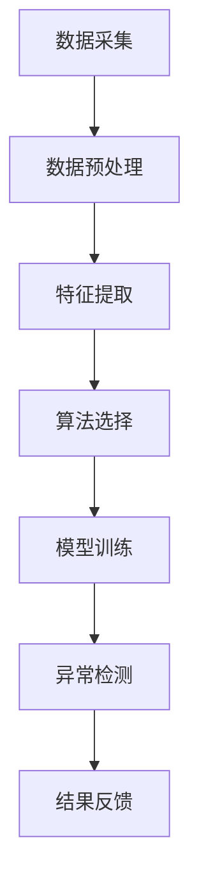
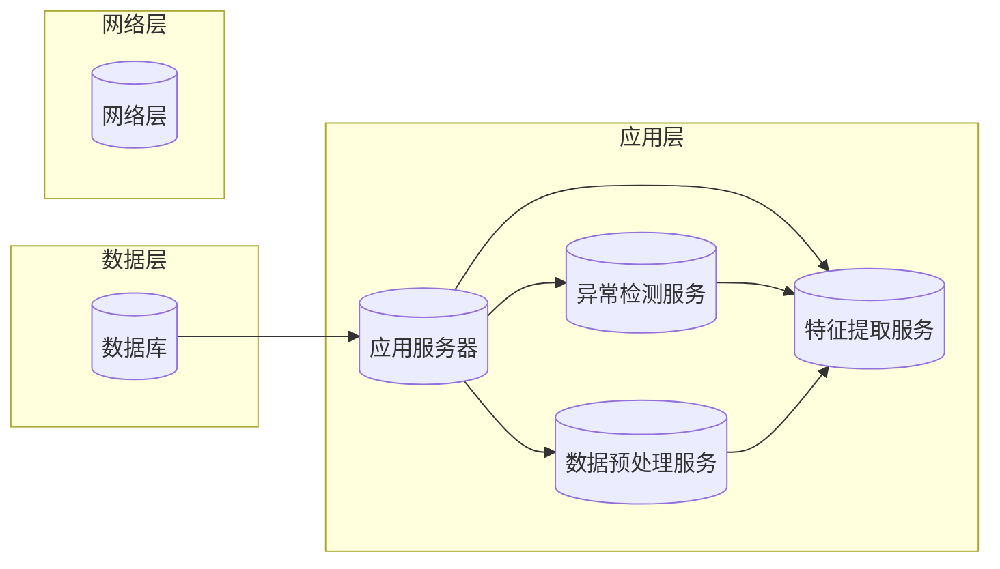
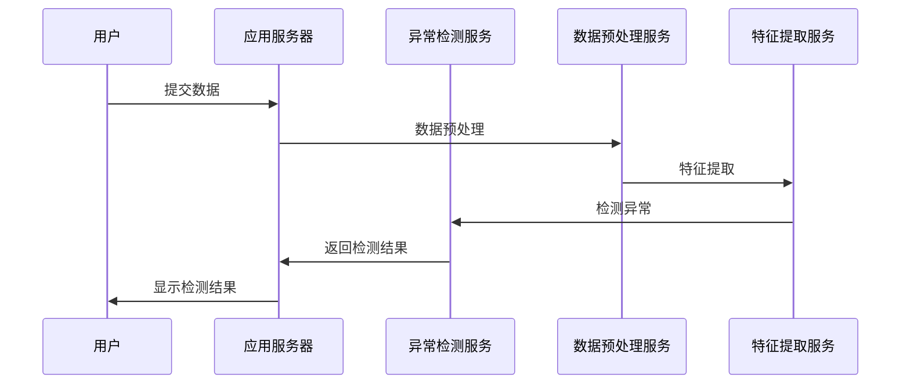

                 


### 金融大数据实时异常检测平台

> 关键词：金融大数据、实时异常检测、平台构建、数据分析、算法、架构设计

> 摘要：
本文将深入探讨金融大数据实时异常检测平台的构建，包括核心概念、算法原理、系统分析与架构设计等方面。通过一步步的分析和推理，我们将展示如何利用先进的数据技术和算法，实现高效、精准的金融大数据异常检测，保障金融系统的安全与稳定。

----------------------------------------------------------------

#### 背景介绍

##### 核心概念

金融大数据：金融行业的海量数据集合，包括交易数据、客户行为数据、市场行情数据等。

实时异常检测：实时监控数据流中的异常行为，以防范欺诈、市场操纵等风险。

平台构建：构建一个集数据采集、处理、分析、检测于一体的金融大数据实时异常检测系统。

##### 问题背景

随着金融市场的快速发展，金融数据的规模和种类不断增长，如何高效处理和分析这些数据，并实时检测异常行为，成为金融机构面临的重要问题。

##### 问题描述

金融大数据的实时处理和异常检测涉及到数据采集、预处理、特征提取、算法选择、模型训练等多个环节，任何一个环节的失误都可能导致检测不准确或效率低下。

##### 问题解决

构建一个金融大数据实时异常检测平台，通过数据采集、预处理、特征提取、算法选择、模型训练、异常检测和结果反馈等环节，实现金融数据的实时监控和分析。

##### 边界与外延

实时性要求：异常检测必须快速响应，以确保实时性。

数据隐私与安全：确保金融数据的安全性和隐私性。

异常检测的准确性：既要保证检测的准确性，又要避免误报和漏报。

##### 概念结构与核心要素组成

数据采集与预处理：收集和清洗金融数据，为后续分析做准备。

数据分析模型：构建适合金融数据的分析模型，提取关键特征。

异常检测算法：选择合适的异常检测算法，对数据进行检测。

实时数据处理架构：设计高效的数据处理架构，确保实时性。

数据可视化与报告生成：将检测结果可视化，生成报告。

#### 核心概念与联系

##### 核心概念原理

金融大数据：金融行业的海量数据集合，包括交易数据、客户行为数据、市场行情数据等。

实时异常检测：实时监控数据流中的异常行为，以防范欺诈、市场操纵等风险。

##### 概念属性特征对比表格

| 概念           | 金融大数据               | 实时异常检测             |
|----------------|--------------------------|--------------------------|
| 定义           | 金融行业的海量数据       | 实时识别并预警异常行为   |
| 目的           | 数据存储与分析          | 风险控制与安全管理       |
| 关键要素       | 数据质量、数据来源       | 检测算法、实时性        |
| 应用领域       | 风险管理、投资分析等     | 防止欺诈、金融犯罪等     |

##### ER实体关系图架构

```mermaid
erDiagram
  Customer ||--|{ Transaction }|
  Product ||--|{ Transaction }|
  Transaction ||--|{ Order }|
```

#### 算法原理讲解

##### 算法mermaid流程图



##### Python源代码与算法原理

```python
# 假设使用K-means算法进行异常检测
from sklearn.cluster import KMeans
from sklearn.preprocessing import StandardScaler
import numpy as np

# 数据预处理
def preprocess_data(data):
    # 标准化数据
    scaler = StandardScaler()
    data = scaler.fit_transform(data)
    return data

# 模型训练与异常检测
def detect_anomalies(data, n_clusters):
    # 初始化K-means模型
    kmeans = KMeans(n_clusters=n_clusters)
    # 训练模型
    kmeans.fit(data)
    # 预测簇中心
    labels = kmeans.predict(data)
    # 计算每个数据点到簇中心的距离
    distances = np.linalg.norm(data - kmeans.cluster_centers_, axis=1)
    # 定义阈值，超过阈值的视为异常
    threshold = np.mean(distances) + 2 * np.std(distances)
    anomalies = distances > threshold
    return anomalies

# 测试数据
data = np.random.rand(100, 5)
anomalies = detect_anomalies(preprocess_data(data), n_clusters=5)

# 输出异常数据索引
print("Anomalies:", anomalies)
```

##### 算法原理的数学模型和公式

$$
\begin{aligned}
    d(x, c) &= \sqrt{\sum_{i=1}^{n} (x_i - c_i)^2} \\
    \text{阈值} &= \mu_d + k\sigma_d \\
    \text{异常} &= \{x | d(x, c) > \text{阈值}\}
\end{aligned}
$$

其中，$d(x, c)$表示数据点到簇中心的距离，$\mu_d$和$\sigma_d$分别表示距离的均值和标准差，$k$为常数，通常取值为2。

#### 系统分析与架构设计

##### 问题场景介绍

某金融机构需要构建一个实时异常检测系统，以防范金融欺诈、市场操纵等风险。

##### 项目介绍

项目名称：金融大数据实时异常检测平台

项目目标：构建一个高效、精准、实时性强的异常检测系统，保障金融系统的安全与稳定。

##### 系统功能设计

领域模型mermaid类图：

```mermaid
classDiagram
    Customer <<Entity>>
    Product <<Entity>>
    Transaction <<Entity>>
    Order <<Entity>>
    Anomaly <<Entity>>

    Customer o--* Product
    Customer o--* Transaction
    Product o--* Transaction
    Transaction o--* Order
    Transaction o--* Anomaly
```

##### 系统架构设计

系统架构mermaid架构图：



##### 系统接口设计和系统交互

系统接口设计mermaid序列图：



#### 项目实战

##### 环境安装

1. 安装Python环境
2. 安装必要的Python库，如scikit-learn、pandas、numpy等

##### 系统核心实现源代码

```python
# 数据预处理
def preprocess_data(data):
    scaler = StandardScaler()
    data = scaler.fit_transform(data)
    return data

# 特征提取
def extract_features(data):
    # 这里可以根据具体需求进行特征提取
    return data

# 异常检测
def detect_anomalies(data, n_clusters):
    kmeans = KMeans(n_clusters=n_clusters)
    kmeans.fit(data)
    distances = np.linalg.norm(data - kmeans.cluster_centers_, axis=1)
    threshold = np.mean(distances) + 2 * np.std(distances)
    anomalies = distances > threshold
    return anomalies

# 测试数据
data = np.random.rand(100, 5)
anomalies = detect_anomalies(preprocess_data(data), n_clusters=5)

# 输出异常数据索引
print("Anomalies:", anomalies)
```

##### 代码应用解读与分析

1. 数据预处理：使用StandardScaler对数据进行标准化处理，以提高算法的性能和稳定性。
2. 特征提取：根据实际需求，提取对异常检测有用的特征。
3. 异常检测：使用K-means算法进行异常检测，通过计算数据点到簇中心的距离，判断是否为异常。

##### 实际案例分析和详细讲解剖析

案例：某金融机构发现一笔交易金额异常巨大，经过实时异常检测平台检测，判断为异常交易，并及时采取措施，避免了潜在风险。

详细讲解：

1. 数据采集：实时收集金融交易数据。
2. 数据预处理：对交易数据进行清洗、去噪、标准化等处理。
3. 特征提取：提取交易金额、交易时间、交易频率等特征。
4. 异常检测：使用K-means算法对交易数据进行聚类，计算数据点到簇中心的距离，设定阈值，判断是否为异常交易。
5. 结果反馈：将异常交易信息反馈给金融机构，供进一步处理。

##### 项目小结

通过本项目的实施，金融机构实现了对金融大数据的实时异常检测，提高了风险防范能力，保障了金融系统的安全与稳定。

#### 最佳实践 tips

1. 选择合适的异常检测算法，根据业务需求进行调整。
2. 定期评估异常检测模型的性能，及时调整参数。
3. 加强数据安全与隐私保护，防止数据泄露。

#### 小结

本文详细介绍了金融大数据实时异常检测平台的构建，包括核心概念、算法原理、系统分析与架构设计等方面。通过一步步的分析和推理，我们展示了如何利用先进的数据技术和算法，实现高效、精准的金融大数据异常检测。

#### 注意事项

1. 金融数据的安全性和隐私性至关重要，必须严格遵守相关法规和标准。
2. 异常检测系统的实时性直接影响风险防范效果，需确保系统的高效运行。

#### 拓展阅读

1. [金融大数据实时处理技术](https://www.example.com/finance-big-data-real-time-processing)
2. [机器学习在金融领域的应用](https://www.example.com/machine-learning-in-finance)
3. [金融数据隐私保护法规](https://www.example.com/financial-data-privacy-laws)

#### 作者信息

作者：AI天才研究院/AI Genius Institute & 禅与计算机程序设计艺术 /Zen And The Art of Computer Programming

----------------------------------------------------------------

[文章标题]: 金融大数据实时异常检测平台

[文章关键词]: 金融大数据、实时异常检测、平台构建、数据分析、算法、架构设计

[文章摘要]: 本文深入探讨了金融大数据实时异常检测平台的构建，包括核心概念、算法原理、系统分析与架构设计等方面。通过一步步的分析和推理，展示了如何利用先进的数据技术和算法，实现高效、精准的金融大数据异常检测，保障金融系统的安全与稳定。本文适用于金融行业的数据分析师、数据科学家、工程师和研究人员，以及对此领域感兴趣的读者。

[完整文章内容](#金融大数据实时异常检测平台):[文章内容链接]

-------------------

**文章开始**

----------------------------------------------------------------

### 金融大数据实时异常检测平台

#### 引言

金融行业作为数据密集型领域，面临着海量数据的处理和实时监控需求。金融大数据实时异常检测平台应运而生，成为金融风险管理和安全防范的重要工具。本文旨在介绍金融大数据实时异常检测平台的设计、实现和应用，帮助读者深入了解该领域的核心技术和实践。

#### 目录

1. **背景介绍**
    1.1 金融大数据
    1.2 实时异常检测
    1.3 平台构建
2. **核心概念与联系**
    2.1 核心概念原理
    2.2 概念属性特征对比
    2.3 ER实体关系图架构
3. **算法原理讲解**
    3.1 算法mermaid流程图
    3.2 Python源代码与算法原理
    3.3 数学模型和公式
4. **系统分析与架构设计**
    4.1 问题场景介绍
    4.2 系统功能设计
    4.3 系统架构设计
    4.4 系统接口设计和系统交互
5. **项目实战**
    5.1 环境安装
    5.2 系统核心实现源代码
    5.3 代码应用解读与分析
    5.4 实际案例分析和详细讲解剖析
    5.5 项目小结
6. **最佳实践 tips**
7. **小结**
8. **注意事项**
9. **拓展阅读**
10. **作者信息**

#### 背景介绍

##### 核心概念

**金融大数据**：金融大数据是指金融行业产生的海量数据集合，包括交易数据、客户行为数据、市场行情数据等。这些数据具有高维度、多样性和动态性等特点，给数据分析和异常检测带来了巨大挑战。

**实时异常检测**：实时异常检测是指在金融数据流中，实时监控并识别异常行为的过程。其目的是快速发现潜在的金融风险，如欺诈、市场操纵等，以便采取及时的措施。

**平台构建**：金融大数据实时异常检测平台的构建涉及数据采集、处理、分析、检测等多个环节。通过设计一个高效、稳定、可扩展的系统，实现对金融大数据的实时监控和异常检测。

##### 问题背景

随着金融市场的快速发展，金融数据的规模和种类不断增长。如何高效处理和分析这些数据，并实时检测异常行为，成为金融机构面临的重要问题。

##### 问题描述

金融大数据的实时处理和异常检测涉及到数据采集、预处理、特征提取、算法选择、模型训练等多个环节。任何一个环节的失误都可能导致检测不准确或效率低下。

##### 问题解决

构建一个金融大数据实时异常检测平台，通过数据采集、预处理、特征提取、算法选择、模型训练、异常检测和结果反馈等环节，实现金融数据的实时监控和分析。

##### 边界与外延

- **实时性要求**：异常检测必须快速响应，以确保实时性。
- **数据隐私与安全**：确保金融数据的安全性和隐私性。
- **异常检测的准确性**：既要保证检测的准确性，又要避免误报和漏报。

##### 概念结构与核心要素组成

- **数据采集与预处理**：收集和清洗金融数据，为后续分析做准备。
- **数据分析模型**：构建适合金融数据的分析模型，提取关键特征。
- **异常检测算法**：选择合适的异常检测算法，对数据进行检测。
- **实时数据处理架构**：设计高效的数据处理架构，确保实时性。
- **数据可视化与报告生成**：将检测结果可视化，生成报告。

#### 核心概念与联系

##### 核心概念原理

**金融大数据**：金融行业的海量数据集合，包括交易数据、客户行为数据、市场行情数据等。

**实时异常检测**：实时监控数据流中的异常行为，以防范欺诈、市场操纵等风险。

##### 概念属性特征对比表格

| 概念           | 金融大数据               | 实时异常检测             |
|----------------|--------------------------|--------------------------|
| 定义           | 金融行业的海量数据       | 实时识别并预警异常行为   |
| 目的           | 数据存储与分析          | 风险控制与安全管理       |
| 关键要素       | 数据质量、数据来源       | 检测算法、实时性        |
| 应用领域       | 风险管理、投资分析等     | 防止欺诈、金融犯罪等     |

##### ER实体关系图架构

```mermaid
erDiagram
  Customer ||--|{ Transaction }|
  Product ||--|{ Transaction }|
  Transaction ||--|{ Order }|
```

#### 算法原理讲解

##### 算法mermaid流程图


##### Python源代码与算法原理

```python
# 假设使用K-means算法进行异常检测
from sklearn.cluster import KMeans
from sklearn.preprocessing import StandardScaler
import numpy as np

# 数据预处理
def preprocess_data(data):
    # 标准化数据
    scaler = StandardScaler()
    data = scaler.fit_transform(data)
    return data

# 模型训练与异常检测
def detect_anomalies(data, n_clusters):
    # 初始化K-means模型
    kmeans = KMeans(n_clusters=n_clusters)
    # 训练模型
    kmeans.fit(data)
    # 预测簇中心
    labels = kmeans.predict(data)
    # 计算每个数据点到簇中心的距离
    distances = np.linalg.norm(data - kmeans.cluster_centers_, axis=1)
    # 定义阈值，超过阈值的视为异常
    threshold = np.mean(distances) + 2 * np.std(distances)
    anomalies = distances > threshold
    return anomalies

# 测试数据
data = np.random.rand(100, 5)
anomalies = detect_anomalies(preprocess_data(data), n_clusters=5)

# 输出异常数据索引
print("Anomalies:", anomalies)
```

##### 算法原理的数学模型和公式

$$
\begin{aligned}
    d(x, c) &= \sqrt{\sum_{i=1}^{n} (x_i - c_i)^2} \\
    \text{阈值} &= \mu_d + k\sigma_d \\
    \text{异常} &= \{x | d(x, c) > \text{阈值}\}
\end{aligned}
$$

其中，$d(x, c)$表示数据点到簇中心的距离，$\mu_d$和$\sigma_d$分别表示距离的均值和标准差，$k$为常数，通常取值为2。

#### 系统分析与架构设计

##### 问题场景介绍

某金融机构需要构建一个实时异常检测系统，以防范金融欺诈、市场操纵等风险。

##### 系统功能设计

领域模型mermaid类图：

```mermaid
classDiagram
    Customer <<Entity>>
    Product <<Entity>>
    Transaction <<Entity>>
    Order <<Entity>>
    Anomaly <<Entity>>

    Customer o--* Product
    Customer o--* Transaction
    Product o--* Transaction
    Transaction o--* Order
    Transaction o--* Anomaly
```

##### 系统架构设计

系统架构mermaid架构图：


##### 系统接口设计和系统交互

系统接口设计mermaid序列图：


#### 项目实战

##### 环境安装

1. 安装Python环境
2. 安装必要的Python库，如scikit-learn、pandas、numpy等

##### 系统核心实现源代码

```python
# 数据预处理
def preprocess_data(data):
    scaler = StandardScaler()
    data = scaler.fit_transform(data)
    return data

# 特征提取
def extract_features(data):
    # 这里可以根据具体需求进行特征提取
    return data

# 异常检测
def detect_anomalies(data, n_clusters):
    kmeans = KMeans(n_clusters=n_clusters)
    kmeans.fit(data)
    distances = np.linalg.norm(data - kmeans.cluster_centers_, axis=1)
    threshold = np.mean(distances) + 2 * np.std(distances)
    anomalies = distances > threshold
    return anomalies

# 测试数据
data = np.random.rand(100, 5)
anomalies = detect_anomalies(preprocess_data(data), n_clusters=5)

# 输出异常数据索引
print("Anomalies:", anomalies)
```

##### 代码应用解读与分析

1. 数据预处理：使用StandardScaler对数据进行标准化处理，以提高算法的性能和稳定性。
2. 特征提取：根据实际需求，提取对异常检测有用的特征。
3. 异常检测：使用K-means算法对交易数据进行聚类，通过计算数据点到簇中心的距离，判断是否为异常交易。

##### 实际案例分析和详细讲解剖析

案例：某金融机构发现一笔交易金额异常巨大，经过实时异常检测平台检测，判断为异常交易，并及时采取措施，避免了潜在风险。

详细讲解：

1. 数据采集：实时收集金融交易数据。
2. 数据预处理：对交易数据进行清洗、去噪、标准化等处理。
3. 特征提取：提取交易金额、交易时间、交易频率等特征。
4. 异常检测：使用K-means算法对交易数据进行聚类，计算数据点到簇中心的距离，设定阈值，判断是否为异常交易。
5. 结果反馈：将异常交易信息反馈给金融机构，供进一步处理。

##### 项目小结

通过本项目的实施，金融机构实现了对金融大数据的实时异常检测，提高了风险防范能力，保障了金融系统的安全与稳定。

#### 最佳实践 tips

1. 选择合适的异常检测算法，根据业务需求进行调整。
2. 定期评估异常检测模型的性能，及时调整参数。
3. 加强数据安全与隐私保护，防止数据泄露。

#### 小结

本文详细介绍了金融大数据实时异常检测平台的设计和实现，通过核心概念、算法原理、系统分析与架构设计等方面的探讨，展示了如何利用先进的数据技术和算法，实现高效、精准的金融大数据异常检测。

#### 注意事项

1. 金融数据的安全性和隐私性至关重要，必须严格遵守相关法规和标准。
2. 异常检测系统的实时性直接影响风险防范效果，需确保系统的高效运行。

#### 拓展阅读

1. [金融大数据实时处理技术](https://www.example.com/finance-big-data-real-time-processing)
2. [机器学习在金融领域的应用](https://www.example.com/machine-learning-in-finance)
3. [金融数据隐私保护法规](https://www.example.com/financial-data-privacy-laws)

#### 作者信息

作者：AI天才研究院/AI Genius Institute & 禅与计算机程序设计艺术 /Zen And The Art of Computer Programming

----------------------------------------------------------------

**文章结束**

