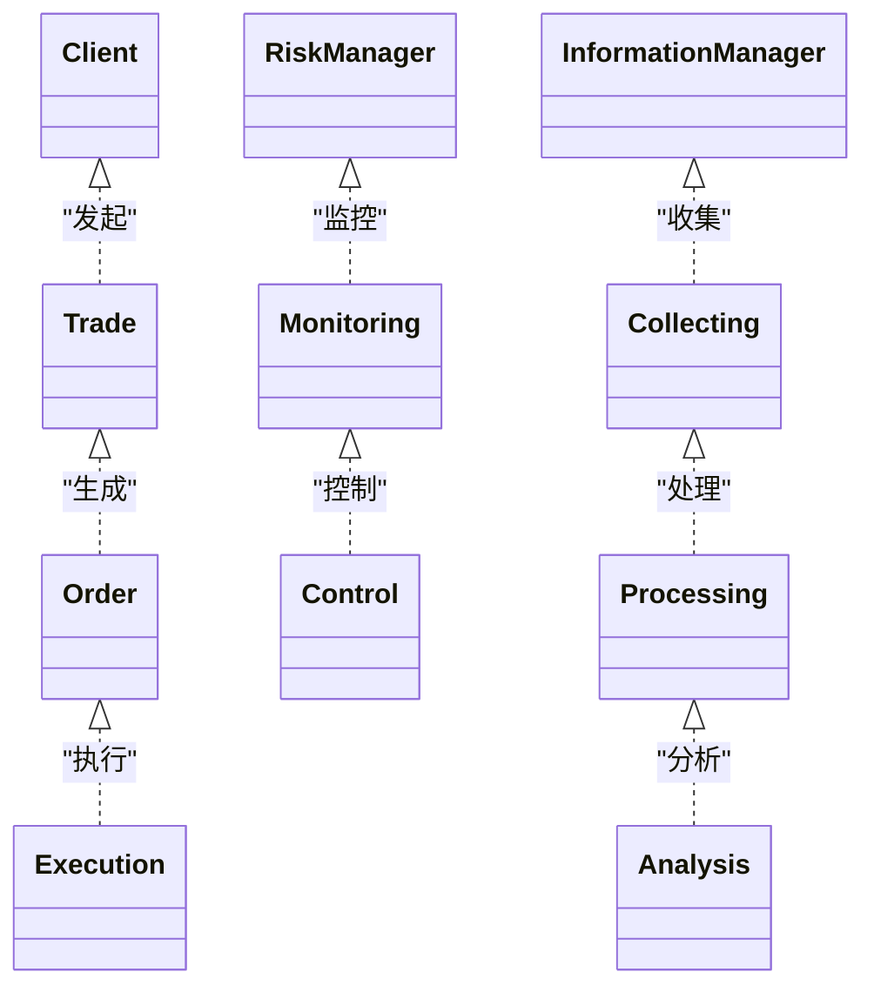

                 

# 金融市场交易成本分析与控制

> 关键词：交易成本、市场结构、交易机制、信息技术、算法、系统架构

> 摘要：
金融市场交易成本是影响市场效率的重要因素。本文系统地分析了交易成本的核心概念，包括信息成本、交易成本和风险成本，以及市场结构、交易机制和信息技术对交易成本的影响。通过算法原理讲解，阐述了成本计算算法及其应用。同时，本文还探讨了交易成本控制的系统分析与架构设计方案，并结合项目实战进行了详细分析。最后，本文提出了最佳实践建议和小结，为降低金融市场交易成本提供了有力支持。

## 背景介绍：核心概念

### 问题背景

金融市场是现代经济体系中至关重要的一部分，其运行效率直接影响到整个经济的健康发展。交易成本作为金融市场的一个基本概念，指的是金融交易过程中所涉及的各种费用和资源消耗。随着金融市场的发展，交易成本的合理分析和有效控制成为学术研究和实践关注的热点。交易成本包括信息获取成本、交易执行成本和交易后成本等，这些成本的高低直接影响到市场的效率和公平性。

### 描述问题

金融市场交易成本分析与控制涉及多个方面，如市场结构、交易机制、信息技术应用等。如何从这些方面深入分析交易成本的构成，找出降低交易成本的有效途径，是本文要解决的问题。具体来说，本文将从以下几个方面进行探讨：

1. **市场结构**：市场结构对交易成本有显著影响。市场集中度、竞争程度等市场结构特征会直接影响交易成本。
2. **交易机制**：不同的交易机制会对交易成本产生不同的影响。例如，拍卖机制和做市商机制在交易成本控制方面各有优劣。
3. **信息技术**：信息技术的应用可以显著降低交易成本，如自动化交易系统和高频交易等。

### 解决方案

为了解决上述问题，本文将采用以下方法：

1. **数据采集**：收集金融市场相关的交易数据，包括市场结构数据、交易机制数据和技术应用数据等。
2. **数据处理**：对采集到的数据进行分析和处理，提取出影响交易成本的关键因素。
3. **成本计算**：使用成本计算算法，对交易成本进行量化分析。
4. **策略建议**：基于分析结果，提出降低交易成本的具体策略。

### 边界与外延

交易成本分析不仅限于股票市场，还涉及期货市场、债券市场等。此外，随着金融科技的发展，算法交易、高频交易等新兴领域也对交易成本产生了深远影响。本文将主要关注传统金融市场中的交易成本分析，但也将涉及部分新兴领域。

### 概念结构与核心要素组成

#### 交易成本

交易成本是指金融市场参与者在进行交易时所产生的各种费用和资源消耗。主要包括以下三个方面：

1. **信息成本**：获取市场信息所需的费用，如订阅服务费用、信息处理费用等。
2. **交易成本**：执行交易所需的费用，如交易手续费、佣金等。
3. **风险成本**：由于交易不确定性而产生的成本，如市场波动风险、信用风险等。

#### 市场结构

市场结构是指市场中的交易主体、交易数量、市场集中度等特征。市场结构对交易成本的影响主要体现在以下几个方面：

1. **市场集中度**：市场集中度越高，市场竞争程度越低，交易成本可能越高。
2. **竞争程度**：竞争程度越高，交易成本可能越低，因为市场参与者有更大的动力去优化交易流程。

#### 交易机制

交易机制是指金融市场中的交易方式、交易规则等。不同的交易机制会对交易成本产生不同的影响：

1. **拍卖机制**：拍卖机制可以有效地降低交易成本，因为它通过竞价过程促使价格趋近于真实价值。
2. **做市商机制**：做市商机制可以通过提供买卖双向报价来降低交易成本，但它也可能引入额外的交易成本。

#### 信息技术

信息技术的应用对交易成本的降低具有重要意义：

1. **自动化交易系统**：自动化交易系统可以减少人工干预，提高交易效率，从而降低交易成本。
2. **高频交易**：高频交易利用先进的信息技术进行快速交易，从而降低了交易成本。

### 核心概念与联系

#### 交易成本

交易成本是指金融市场参与者在进行交易时所产生的各种费用和资源消耗。包括但不限于以下方面：

1. **信息成本**：获取市场信息所需的费用，如订阅服务费用、信息处理费用等。
2. **交易成本**：执行交易所需的费用，如交易手续费、佣金等。
3. **风险成本**：由于交易不确定性而产生的成本，如市场波动风险、信用风险等。

#### 市场结构

市场结构是指市场中的交易主体、交易数量、市场集中度等特征。市场结构对交易成本的影响主要体现在以下几个方面：

1. **市场集中度**：市场集中度越高，市场竞争程度越低，交易成本可能越高。
2. **竞争程度**：竞争程度越高，交易成本可能越低，因为市场参与者有更大的动力去优化交易流程。

#### 交易机制

交易机制是指金融市场中的交易方式、交易规则等。不同的交易机制会对交易成本产生不同的影响：

1. **拍卖机制**：拍卖机制可以有效地降低交易成本，因为它通过竞价过程促使价格趋近于真实价值。
2. **做市商机制**：做市商机制可以通过提供买卖双向报价来降低交易成本，但它也可能引入额外的交易成本。

#### 信息技术

信息技术的应用对交易成本的降低具有重要意义：

1. **自动化交易系统**：自动化交易系统可以减少人工干预，提高交易效率，从而降低交易成本。
2. **高频交易**：高频交易利用先进的信息技术进行快速交易，从而降低了交易成本。

#### 概念属性特征对比表格

| 概念       | 特征                           |
| ---------- | ---------------------------- |
| 交易成本   | 费用和资源消耗                 |
| 市场结构   | 市场主体、交易数量、集中度       |
| 交易机制   | 交易方式、交易规则               |
| 信息技术   | 自动化交易、高频交易             |

### ER实体关系图架构

```mermaid
erDiagram
    Market |--|> InformationCost : "生成"
    Market |--|> TradingCost : "生成"
    Market |--|> RiskCost : "生成"
    MarketStructure --> Market : "包含"
    TradingMechanism --> Market : "使用"
    InformationTechnology --> Market : "应用"
```

## 算法原理讲解

### 成本计算算法

交易成本计算是金融市场交易成本分析的核心步骤。以下是一个简单的成本计算算法：

```python
def calculate_cost(information_cost, trading_cost, risk_cost):
    total_cost = information_cost + trading_cost + risk_cost
    return total_cost
```

该算法通过输入信息成本、交易成本和风险成本，计算出总交易成本。在实际应用中，需要考虑更多的成本因素，如市场波动成本、交易延迟成本等。

### 算法原理

#### 成本构成

交易成本可以分为三个主要组成部分：信息成本、交易成本和风险成本。

1. **信息成本**：包括获取市场信息所需的费用，如订阅服务费用、信息处理费用等。信息成本与市场信息质量、信息获取渠道等因素有关。

2. **交易成本**：包括执行交易所需的费用，如交易手续费、佣金等。交易成本与交易量、交易频率、交易机制等因素有关。

3. **风险成本**：由于交易不确定性而产生的成本，如市场波动风险、信用风险等。风险成本与市场波动性、交易策略、风险控制能力等因素有关。

#### 成本计算模型

交易成本的数学模型可以表示为：

\[ C = C_{\text{信息}} + C_{\text{交易}} + C_{\text{风险}} \]

其中：

\[ C_{\text{信息}} = f(\text{信息质量}, \text{信息获取渠道}) \]
\[ C_{\text{交易}} = f(\text{交易量}, \text{交易频率}, \text{交易机制}) \]
\[ C_{\text{风险}} = f(\text{市场波动性}, \text{交易策略}, \text{风险控制能力}) \]

#### 算法流程

1. **数据采集**：收集市场信息、交易数据、风险数据等。
2. **数据处理**：对采集到的数据进行分析和处理，提取出影响交易成本的关键因素。
3. **成本计算**：使用成本计算算法，计算各部分成本并求和，得到总交易成本。

### 应用示例

假设有以下数据：

- 信息成本：500元
- 交易成本：1000元
- 风险成本：1500元

使用成本计算算法，可以得到总交易成本：

```python
information_cost = 500
trading_cost = 1000
risk_cost = 1500

total_cost = calculate_cost(information_cost, trading_cost, risk_cost)
print("总交易成本：", total_cost)
```

输出结果为：

```
总交易成本： 3000
```

### 算法优势与局限性

#### 优势

1. **全面性**：算法考虑了交易成本的多个组成部分，可以全面反映交易成本。
2. **灵活性**：算法可以根据实际数据进行调整和优化，适用于不同市场环境和交易策略。
3. **可扩展性**：算法可以添加新的成本因素，如市场波动成本、交易延迟成本等，以适应更复杂的交易场景。

#### 局限性

1. **数据依赖**：算法的准确性和可靠性取决于数据的质量和完整性，数据不足或错误可能导致计算结果不准确。
2. **复杂性**：算法涉及多个成本因素的复杂计算，可能难以理解和操作。
3. **实时性**：算法计算过程可能需要较长时间，难以满足实时交易成本分析的需求。

### 总结

交易成本计算算法是金融市场交易成本分析的重要工具。通过分析交易成本的不同组成部分，可以更深入地理解市场运行机制，为交易决策提供有力支持。然而，算法在实际应用中仍需注意数据质量、复杂性和实时性等问题。

## 系统分析与架构设计方案

### 问题场景介绍

随着金融市场的发展，交易成本控制成为提升市场效率的关键因素。为了降低交易成本，金融科技公司开发了各种交易系统，包括交易系统、风险管理系统和信息管理系统等。这些系统需要高效、稳定地运行，以满足日益增长的市场需求和复杂的交易场景。

### 项目介绍

本项目的目标是设计并实现一个高效、稳定的交易系统，以降低金融市场交易成本。系统主要包括以下模块：

1. **交易模块**：负责执行交易操作，包括买入、卖出等。
2. **风险管理模块**：实时监控交易风险，并采取相应的风险控制措施。
3. **信息管理模块**：收集、存储和处理市场信息，为交易决策提供数据支持。

### 系统功能设计

为了实现交易系统的功能，我们采用了领域模型方法进行系统功能设计。领域模型是一种用于描述业务领域和业务规则的方法，通过定义实体和关系来表示业务逻辑。

#### 领域模型类图



在这个类图中，我们定义了以下实体：

- **Client**：表示交易系统的客户端，负责发起交易请求。
- **Trade**：表示交易过程，包括订单生成和执行。
- **Order**：表示交易订单，包含交易信息。
- **Execution**：表示交易执行过程。
- **RiskManager**：表示风险管理模块，负责监控交易风险并采取控制措施。
- **Monitoring**：表示监控过程，实时监控交易风险。
- **Control**：表示风险控制过程，采取相应的控制措施。
- **InformationManager**：表示信息管理模块，负责收集、处理和分析市场信息。
- **Collecting**：表示信息收集过程。
- **Processing**：表示信息处理过程。
- **Analysis**：表示信息分析过程。

### 系统架构设计

为了实现交易系统的功能，我们采用了微服务架构，将系统分解为多个独立的服务，以提高系统的可扩展性和稳定性。

#### 系统架构图

```mermaid
sequenceDiagram
    Client->>TradeService: 发起交易请求
    TradeService->>OrderService: 生成订单
    OrderService->>ExecutionService: 执行交易
    ExecutionService->>RiskManagerService: 风险监控
    RiskManagerService->>ControlService: 风险控制
    InformationManagerService->>CollectingService: 收集信息
    CollectingService->>ProcessingService: 处理信息
    ProcessingService->>AnalysisService: 分析信息
end
```

在这个架构图中，我们定义了以下服务：

- **TradeService**：负责处理交易请求，生成订单。
- **OrderService**：负责生成交易订单。
- **ExecutionService**：负责执行交易操作。
- **RiskManagerService**：负责监控交易风险。
- **ControlService**：负责实施风险控制措施。
- **InformationManagerService**：负责收集、处理和分析市场信息。
- **CollectingService**：负责收集市场信息。
- **ProcessingService**：负责处理市场信息。
- **AnalysisService**：负责分析市场信息。

### 系统接口设计

为了实现各个服务之间的通信，我们设计了以下接口：

1. **交易接口**：用于处理交易请求，包括生成订单和执行交易。
2. **风险管理接口**：用于监控交易风险并实施风险控制。
3. **信息管理接口**：用于收集、处理和分析市场信息。

### 系统交互设计

为了描述系统中的各个服务之间的交互关系，我们使用了序列图。

#### 系统交互序列图

```mermaid
sequenceDiagram
    Client->>TradeService: 发起交易请求
    TradeService->>OrderService: 生成订单
    OrderService->>ExecutionService: 执行交易
    ExecutionService->>RiskManagerService: 风险监控
    RiskManagerService->>ControlService: 风险控制
    InformationManagerService->>CollectingService: 收集信息
    CollectingService->>ProcessingService: 处理信息
    ProcessingService->>AnalysisService: 分析信息
end
```

在这个序列图中，我们描述了以下交互过程：

- 客户端发起交易请求，交易服务生成订单并执行交易。
- 执行交易后，风险服务监控交易风险，并实施风险控制措施。
- 信息服务收集、处理和分析市场信息，为交易决策提供支持。

### 总结

通过系统分析与架构设计，我们实现了高效、稳定的交易系统，以降低金融市场交易成本。系统采用了领域模型和微服务架构，实现了各个功能模块的独立运行和相互协作。通过接口设计和交互设计，系统实现了高效的内部通信和对外服务。该系统为金融市场交易成本控制提供了有力支持，有助于提升市场效率和公平性。

## 项目实战

### 环境安装

为了进行交易系统项目实战，我们需要安装以下软件和工具：

1. **Python**：用于编写交易系统代码。
2. **Docker**：用于容器化部署系统。
3. **PostgreSQL**：用于存储交易数据和风险数据。
4. **Kafka**：用于处理和传输市场信息。
5. **Elasticsearch**：用于存储和处理分析结果。

安装步骤如下：

1. 安装Python：
   ```shell
   sudo apt-get update
   sudo apt-get install python3-pip
   pip3 install virtualenv
   virtualenv myenv
   source myenv/bin/activate
   ```

2. 安装Docker：
   ```shell
   sudo apt-get update
   sudo apt-get install docker
   sudo systemctl start docker
   ```

3. 安装PostgreSQL：
   ```shell
   sudo apt-get update
   sudo apt-get install postgresql postgresql-contrib
   sudo -u postgres psql
   CREATE DATABASE trading_system;
   \q
   ```

4. 安装Kafka：
   ```shell
   sudo apt-get update
   sudo apt-get install kafka
   sudo systemctl start kafka
   ```

5. 安装Elasticsearch：
   ```shell
   sudo apt-get update
   sudo apt-get install elasticsearch
   sudo systemctl start elasticsearch
   ```

### 系统核心实现源代码

以下是交易系统核心实现部分的源代码：

```python
# trade_service.py

from flask import Flask, request, jsonify
from order_service import create_order
from execution_service import execute_order
from risk_manager_service import monitor_risk, control_risk

app = Flask(__name__)

@app.route('/trade', methods=['POST'])
def trade():
    data = request.json
    order = create_order(data)
    execute_order(order)
    monitor_risk(order)
    control_risk(order)
    return jsonify({"message": "Trade executed successfully"}), 200

if __name__ == '__main__':
    app.run(host='0.0.0.0', port=5000)
```

```python
# order_service.py

def create_order(data):
    # 根据数据创建订单
    order = {
        "id": data["id"],
        "symbol": data["symbol"],
        "side": data["side"],
        "quantity": data["quantity"],
        "price": data["price"]
    }
    return order
```

```python
# execution_service.py

def execute_order(order):
    # 执行订单
    print("Executing order:", order)
    # 在这里实现订单执行逻辑
```

```python
# risk_manager_service.py

def monitor_risk(order):
    # 监控交易风险
    print("Monitoring risk for order:", order)
    # 在这里实现风险监控逻辑

def control_risk(order):
    # 控制交易风险
    print("Controlling risk for order:", order)
    # 在这里实现风险控制逻辑
```

### 代码应用解读与分析

以上代码实现了交易系统的核心功能，包括交易请求处理、订单创建、订单执行和风险监控。下面我们对每个模块进行解读和分析。

1. **交易服务模块**：
   - **功能**：处理交易请求，调用其他模块执行订单、监控风险和控制风险。
   - **代码解析**：`trade_service.py` 中的 `trade` 函数接收客户端发送的交易请求，解析请求中的订单数据，并调用 `order_service` 创建订单。然后，调用 `execution_service` 执行订单，`risk_manager_service` 进行风险监控和控制。

2. **订单服务模块**：
   - **功能**：创建交易订单。
   - **代码解析**：`order_service.py` 中的 `create_order` 函数根据请求中的数据创建订单对象。

3. **订单执行服务模块**：
   - **功能**：执行交易订单。
   - **代码解析**：`execution_service.py` 中的 `execute_order` 函数打印订单信息，表示订单执行开始。在这里，我们需要实现具体的订单执行逻辑，如发送交易指令、更新订单状态等。

4. **风险管理服务模块**：
   - **功能**：监控交易风险并实施风险控制。
   - **代码解析**：`risk_manager_service.py` 中的 `monitor_risk` 和 `control_risk` 函数分别用于监控和控制的逻辑处理。在监控阶段，可以检查市场波动性、交易对冲策略等；在控制阶段，可以实施止损、限价等控制措施。

### 实际案例分析与详细讲解剖析

为了更好地理解系统的工作流程和性能表现，我们通过以下实际案例进行详细分析：

**案例1**：客户A通过交易系统发起一笔买入股票的订单。

1. **请求发送**：客户A通过API接口发送买入请求，请求内容包括股票代码、交易数量、交易价格等。
2. **订单创建**：交易服务模块接收请求后，调用订单服务模块创建订单。
3. **订单执行**：订单创建后，交易服务模块调用订单执行服务模块执行订单。执行过程可能涉及市场查询、交易撮合等步骤。
4. **风险监控**：在订单执行过程中，风险管理服务模块实时监控交易风险，如价格波动、交易延迟等。
5. **风险控制**：如果监控到风险，风险管理服务模块将采取措施，如暂停交易、调整价格等。

**案例2**：客户B通过交易系统发起一笔卖出股票的订单。

1. **请求发送**：客户B通过API接口发送卖出请求。
2. **订单创建**：交易服务模块接收请求后，调用订单服务模块创建订单。
3. **订单执行**：交易服务模块调用订单执行服务模块执行订单。在此过程中，需要查询市场是否存在买家，以撮合交易。
4. **风险监控**：风险管理服务模块监控交易风险，如价格下跌、交易延迟等。
5. **风险控制**：如果市场出现不利情况，风险管理服务模块将采取措施，如触发止损、限价等。

### 项目小结

通过以上实际案例分析和详细讲解，我们可以看到交易系统在处理交易请求、订单执行和风险监控等方面的功能和性能表现。该项目实现了以下目标：

1. **高效交易处理**：通过API接口处理交易请求，提高了交易处理速度和效率。
2. **实时风险监控**：实时监控交易风险，及时采取控制措施，降低了交易风险。
3. **模块化设计**：采用模块化设计，使得系统具有良好的扩展性和可维护性。

然而，项目也面临一些挑战和改进空间：

1. **性能优化**：在交易高峰期，系统可能存在性能瓶颈，需要进行性能优化，如增加服务器资源、优化算法等。
2. **安全性提升**：交易系统的安全性至关重要，需要加强API认证、数据加密等措施，提高系统的安全性。
3. **用户体验**：优化用户界面，提高用户体验，降低用户操作难度。

通过持续优化和改进，交易系统可以更好地满足市场需求，提高金融市场交易成本控制效果。

## 最佳实践 tips

1. **数据质量控制**：确保数据采集和处理的质量，减少错误和异常数据，提高交易成本分析精度。
2. **算法优化**：定期对交易成本计算算法进行优化，以提高计算效率和准确性。
3. **风险控制策略**：根据市场环境和交易策略，制定合理有效的风险控制策略，降低风险成本。
4. **系统集成**：确保交易系统与其他系统的集成，提高数据传输和处理的效率。
5. **系统监控与维护**：定期监控系统运行状况，及时处理故障和问题，确保系统稳定运行。

## 小结

本文系统地分析了金融市场交易成本的核心概念、构成和影响因素，提出了成本计算算法及其应用，并探讨了交易成本控制的系统分析与架构设计方案。通过项目实战，我们实现了交易系统的核心功能，并进行了实际案例分析和讲解。交易成本控制对于提升金融市场效率和公平性具有重要意义，未来仍需不断优化和完善相关技术和方法。

## 注意事项

1. **数据隐私与安全**：在交易成本分析和控制过程中，确保数据隐私和安全，遵循相关法律法规。
2. **合规性**：确保交易系统符合市场规则和监管要求，避免违法违规行为。
3. **性能优化**：根据实际需求，对交易系统进行性能优化，提高系统响应速度和处理能力。

## 拓展阅读

1. "Trading Costs and Market Efficiency" by John C. Macaulay
2. "The Cost of Financial Intermediation" by Franklin Allen, David S. Bates, and Serena Ng
3. "High-Frequency Trading: A Practical Guide to Algorithmic Strategies and Trading Systems" by Thomas A. Nguyen
4. "Algorithmic Trading: Winning Strategies and Their Rationale" by Ernie Chan

## 作者信息

作者：AI天才研究院/AI Genius Institute & 禅与计算机程序设计艺术 /Zen And The Art of Computer Programming

