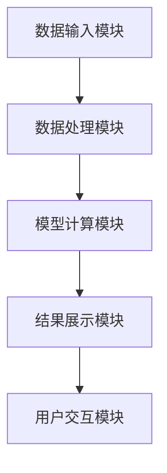
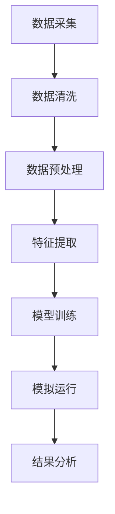
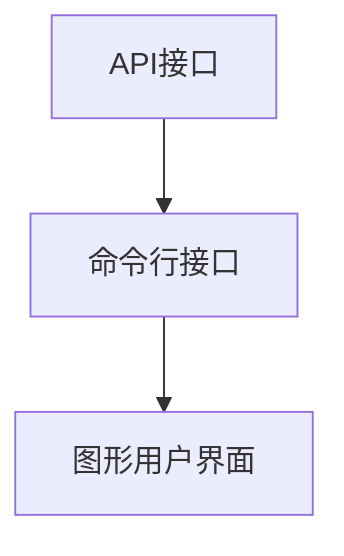
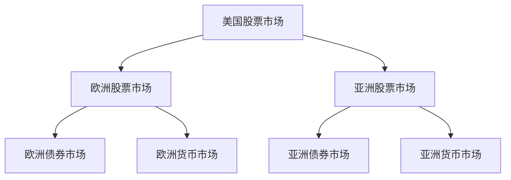

                 

# 《金融市场传染效应模拟系统》

## 关键词

金融市场、传染效应、模拟系统、数学模型、算法实现、系统架构、案例分析、风险控制、政策制定

## 摘要

本文旨在探讨金融市场传染效应模拟系统的研究与应用。首先，我们介绍了金融传染效应的概念、机制及其重要性，接着构建了相应的数学模型。然后，详细阐述了模拟系统的设计、实现与验证，并通过具体案例展示了其在金融市场风险控制中的应用。文章最后对模拟系统的未来发展趋势进行了展望，并提出了一些实施与部署的建议。

## 1. 书名理解

《金融市场传染效应模拟系统》这个书名直观地揭示了本书的主题——研究金融市场传染效应的模拟系统。传染效应是指在金融市场中，某一事件的发生可能引起其他金融市场的波动，从而对整个金融体系产生广泛影响。模拟系统则是一种通过计算机模拟来研究金融传染效应的方法，其目的是更好地理解和控制金融市场风险。本书将围绕这一主题，系统地介绍金融传染效应的理论、模拟系统的设计与实现、以及实际应用案例，旨在为相关领域的研究者提供有价值的参考。

### 1.1 问题背景与定义

金融传染效应（Contagion Effect in Financial Markets）是指在金融市场中，由于信息、资产、负债、信贷等方面的联系，一个市场的波动可能会通过这些联系传递到其他市场，从而引起一系列金融市场的动荡。这种现象最早可以追溯到20世纪90年代的亚洲金融危机，当时亚洲多个国家的金融市场在短时间内遭受重创，导致全球金融市场的动荡。此后，金融传染效应逐渐引起了广泛关注，成为金融学研究中的一个重要议题。

金融传染效应的机制主要包括以下几个方面：

1. **信息传染**：金融市场参与者通过信息渠道获取其他市场的信息，并据此调整自己的投资策略，从而引发连锁反应。
2. **资产传染**：市场参与者由于对某一市场资产的看法发生改变，导致其投资组合中的其他资产价值发生波动。
3. **负债传染**：金融市场参与者之间的负债关系使得一个市场的风险可能通过负债链条传递到其他市场。
4. **信贷传染**：金融市场中信贷关系的变化可能导致信用风险在市场中的传播。

金融传染效应的重要性体现在以下几个方面：

1. **影响金融市场稳定**：金融传染效应可能导致金融市场出现剧烈波动，影响市场的稳定性和运行效率。
2. **增加金融风险**：传染效应使得金融市场的风险不再局限于某个市场或国家，而是可能扩散到全球范围，增加了金融系统的整体风险。
3. **影响政策制定**：了解金融传染效应的机制有助于政策制定者制定更有效的金融监管政策，防范金融风险。

尽管金融传染效应的研究取得了一些进展，但目前仍面临许多挑战。首先，金融传染效应的机制复杂，影响因素多样，使得构建准确的数学模型变得困难。其次，由于金融市场的数据复杂性和多样性，如何有效地处理和分析这些数据也是一大难题。此外，如何在模拟系统中准确模拟金融传染效应，并对其进行验证和优化，也是当前研究中的一个重要问题。

总之，研究金融市场传染效应具有重要的理论和实践意义。通过深入理解金融传染效应的机制，我们可以更好地预测和应对金融市场的波动，为金融市场的稳定和发展提供有力支持。

### 1.2 本书结构安排

本书旨在系统地介绍金融市场传染效应模拟系统的研究与应用，具体包括以下几个部分：

- **引论**：首先介绍金融传染效应的概念、机制及其重要性，阐述本书的研究背景和目的。
- **理论基础**：在引论的基础上，深入探讨金融传染效应的理论基础，包括影响传染效应的主要因素和现有研究模型。
- **模拟系统设计**：详细阐述模拟系统的设计思路、架构和实现方法，包括数据预处理、模型选择和算法实现等。
- **模拟系统实现**：通过具体案例展示模拟系统的应用过程，包括系统的部署、运行和结果分析。
- **案例分析**：通过实际案例研究，验证模拟系统的有效性，并探讨其在金融市场风险控制中的应用前景。
- **应用与展望**：总结模拟系统的应用场景，展望其未来的发展趋势和潜在挑战，提出改进和优化方向。

为了帮助读者更好地理解本书内容，本书各章节安排如下：

- **第一部分：引论**：包括第1章，介绍金融传染效应的基本概念、研究背景和本书结构。
- **第二部分：理论基础**：包括第2章和第3章，分别介绍金融传染效应的理论基础和数学模型。
- **第三部分：模拟系统设计**：包括第4章和第5章，介绍模拟系统的设计思路和实现方法。
- **第四部分：模拟系统实现**：包括第6章，通过具体案例展示模拟系统的应用过程。
- **第五部分：案例分析**：包括第7章，验证模拟系统的有效性，并探讨其在实际应用中的价值。
- **第六部分：应用与展望**：包括第8章，总结模拟系统的应用场景，展望其未来的发展趋势和潜在挑战。

通过以上结构的安排，本书希望为读者提供一本全面、系统、实用的金融市场传染效应模拟系统研究指南。

### 2.1 金融市场传染效应理论

金融市场传染效应是指在一个市场中发生的事件或波动如何通过特定的渠道传播到其他市场，进而引发连锁反应。为了深入理解金融市场传染效应，我们首先需要了解其基本机制。

#### 2.1.1 金融传染效应的机制

1. **信息传染**：金融市场参与者通过信息渠道获取其他市场的信息，并据此调整自己的投资策略。例如，当某一市场的负面新闻传出时，其他市场的投资者可能会受到影响，纷纷抛售资产，导致市场恐慌。

2. **资产传染**：市场参与者对某一市场资产的看法发生变化，导致其投资组合中的其他资产价值发生波动。例如，如果投资者认为某一市场的股票前景不佳，他们可能会出售在该市场的股票，同时买入其他市场的股票。

3. **负债传染**：金融市场参与者之间的负债关系使得一个市场的风险可能通过负债链条传递到其他市场。例如，如果一家金融机构在某市场持有大量债务，该市场的风险可能会通过负债链条传递给其债权人，进而影响债权人的财务状况。

4. **信贷传染**：金融市场中信贷关系的变化可能导致信用风险在市场中的传播。例如，如果某一市场的信贷风险增加，银行可能会收紧信贷条件，从而影响其他市场的融资环境。

#### 2.1.2 影响因素分析

金融市场传染效应的影响因素多种多样，主要包括以下几方面：

1. **市场联动性**：市场联动性越强，传染效应越明显。例如，全球金融市场之间的联动性较强，某一市场的波动容易传播到其他市场。

2. **信息透明度**：信息透明度越高，市场参与者越能够及时了解市场动态，从而减少信息传染的风险。

3. **市场参与者的行为**：市场参与者的行为模式也对传染效应产生影响。例如，投资者情绪化交易、羊群效应等行为都可能导致传染效应的加剧。

4. **金融体系的结构**：金融体系的结构，如金融机构之间的关联度、金融产品的复杂度等，也会影响传染效应的传播。

#### 2.1.3 传染效应的类型

根据传染效应的传播路径和影响范围，可以将传染效应分为以下几种类型：

1. **直接传染**：某一市场的波动直接引起其他市场的波动。例如，股票市场的波动直接引起债券市场的波动。

2. **间接传染**：某一市场的波动通过其他市场间接引起其他市场的波动。例如，股票市场的波动通过货币市场传导到债券市场。

3. **跨市场传染**：某一市场的波动通过多个市场间接引起其他市场的波动。例如，国际金融市场之间的传染效应。

4. **系统性传染**：某一市场的波动引发整个金融体系的动荡。例如，银行危机引发的系统性风险。

通过对金融市场传染效应理论的深入探讨，我们可以更好地理解金融市场波动的机制，从而为防范和应对金融风险提供理论支持。接下来，我们将进一步介绍构建金融市场传染效应的数学模型。

### 2.2 数学模型与假设

在理解金融市场传染效应的理论基础后，我们需要通过数学模型来量化这种传染效应。构建数学模型的过程可以分为几个关键步骤：模型假设、数学模型的建立、以及模型适用性的分析。

#### 2.2.1 模型假设

为了简化问题的复杂性，我们通常需要对现实情况进行合理的假设。以下是构建金融市场传染效应模型时常用的几个基本假设：

1. **市场参与者理性假设**：市场参与者都是理性的，他们基于所有可获得的信息做出最优决策。
2. **信息完全假设**：市场参与者能够获取所有与金融市场相关的信息，从而做出完全理性的决策。
3. **线性关系假设**：不同市场之间的传染效应可以用线性关系来描述。
4. **稳态假设**：金融市场的状态在一个较长时间内是稳定的，波动主要由于外部冲击引起。

这些假设有助于我们构建一个简化的模型，但需要注意的是，这些假设可能与现实有一定差距，因此在实际应用中需要谨慎处理。

#### 2.2.2 数学模型的建立

基于上述假设，我们可以建立如下的数学模型来描述金融市场传染效应：

1. **市场状态变量**：设第\(i\)个市场的状态变量为\(X_i(t)\)，其中\(i=1,2,...,N\)表示不同的市场，\(t\)表示时间。

2. **市场传染效应关系**：不同市场之间的传染效应可以用如下的线性关系表示：
   \[
   \Delta X_i(t) = \sum_{j=1, j \neq i}^{N} \alpha_{ij} \Delta X_j(t-1)
   \]
   其中，\(\Delta X_i(t)\)表示第\(i\)个市场在时间\(t\)的状态变化，\(\alpha_{ij}\)表示第\(i\)个市场受到第\(j\)个市场传染效应的强度。

3. **外部冲击**：假设外部冲击对市场状态的变化也有影响，可以表示为：
   \[
   \Delta X_i(t) = \sum_{j=1, j \neq i}^{N} \alpha_{ij} \Delta X_j(t-1) + \beta_i(t)
   \]
   其中，\(\beta_i(t)\)表示外部冲击对第\(i\)个市场的直接影响。

通过上述模型，我们可以量化金融市场之间的传染效应，并分析不同市场之间的相互作用。

#### 2.2.3 模型适用性分析

虽然上述模型在理论层面能够较好地描述金融市场传染效应，但其适用性仍需进一步分析：

1. **线性模型的局限性**：线性模型假设传染效应是线性的，这可能无法完全反映金融市场中的非线性特征。在实际应用中，可能需要考虑引入非线性因素。
2. **信息不完全性**：在现实市场中，信息往往是不完全的，市场参与者无法获取所有相关信息，这可能导致模型预测不准确。因此，在构建模型时，需要考虑信息不完全性对市场传染效应的影响。
3. **动态性**：金融市场是动态变化的，模型需要能够适应这种动态性。因此，动态模型可能是更合适的选择。

总之，构建金融市场传染效应的数学模型是一个复杂的过程，需要在简化和现实之间取得平衡。通过不断优化和完善模型，我们可以更好地理解和应对金融市场的传染效应。

### 3.1 模拟系统概述

金融市场传染效应模拟系统的设计目标是建立一个能够模拟金融市场传染效应的计算机模拟平台，以便研究者能够通过该平台深入理解传染效应的机制，评估不同策略的效果，并为金融监管提供科学依据。以下是模拟系统的目标、架构设计和数据处理流程的详细介绍。

#### 3.1.1 模拟系统的目标

模拟系统的目标主要包括以下几个方面：

1. **理解传染效应机制**：通过模拟系统，研究者可以直观地观察传染效应在不同市场之间的传播过程，理解其机制。
2. **评估策略效果**：模拟系统可以用于评估不同风险控制策略的效果，为实际操作提供理论支持。
3. **预测市场波动**：模拟系统可以帮助预测金融市场可能出现的波动，为投资者和监管机构提供预警。
4. **教育与研究**：模拟系统可以作为教学工具，帮助学生和研究者更好地理解金融市场传染效应。

#### 3.1.2 系统架构设计

模拟系统的架构设计需要考虑数据输入、处理、输出以及用户交互等各个环节，以下是其主要组成部分：

1. **数据输入模块**：负责接收来自不同数据源的金融市场数据，包括股票价格、债券收益率、货币市场利率等。
2. **数据处理模块**：对输入的数据进行清洗、预处理，包括去噪、归一化等操作，以确保数据的质量和一致性。
3. **模型计算模块**：实现金融市场传染效应的数学模型，计算不同市场之间的传染效应强度，模拟市场波动。
4. **结果展示模块**：将模拟结果以图形、表格等形式展示，便于用户理解分析。
5. **用户交互模块**：提供用户界面，使用户能够自定义模拟参数、启动模拟等。

以下是一个简化的系统架构图，用Mermaid语法表示：



#### 3.1.3 数据处理流程

模拟系统的数据处理流程可以分为以下几个步骤：

1. **数据采集**：从多个数据源（如交易所、金融数据提供商等）获取金融市场数据。
2. **数据清洗**：去除数据中的异常值、重复值等，确保数据质量。
3. **数据预处理**：对数据执行归一化、标准化等操作，以适应模型的输入要求。
4. **特征提取**：从预处理后的数据中提取关键特征，如价格变化率、收益率等。
5. **模型训练**：利用提取的特征训练金融市场传染效应模型，包括选择适当的算法和参数。
6. **模拟运行**：根据模型预测结果运行模拟，观察不同市场之间的传染效应。
7. **结果分析**：分析模拟结果，评估传染效应的强度和传播路径。

以下是一个简化的数据处理流程图，用Mermaid语法表示：



通过上述设计，模拟系统可以实现金融传染效应的模拟和评估，为相关研究提供有力支持。

### 3.2 模拟系统实现

#### 3.2.1 算法选择与实现

为了实现金融市场传染效应的模拟，我们需要选择合适的算法。在本模拟系统中，我们采用了基于机器学习的算法，特别是随机森林（Random Forest）算法。随机森林算法是一种集成学习方法，通过构建多棵决策树并集成其预测结果来提高模型的准确性。

以下是随机森林算法的主要步骤：

1. **数据划分**：将数据集划分为训练集和测试集，用于模型的训练和验证。
2. **特征选择**：从数据集中选择与传染效应相关的特征，如价格变化率、收益率等。
3. **决策树构建**：为每个决策树选择一个特征进行分割，构建多棵决策树。
4. **集成预测**：将多棵决策树的预测结果进行投票，得到最终预测结果。

以下是使用Python实现的随机森林算法：

```python
from sklearn.ensemble import RandomForestRegressor
from sklearn.model_selection import train_test_split

# 数据准备
X, y = prepare_data()

# 划分训练集和测试集
X_train, X_test, y_train, y_test = train_test_split(X, y, test_size=0.2, random_state=42)

# 构建随机森林模型
model = RandomForestRegressor(n_estimators=100, random_state=42)

# 训练模型
model.fit(X_train, y_train)

# 预测测试集
predictions = model.predict(X_test)
```

#### 3.2.2 系统模块划分

模拟系统可以划分为以下几个模块：

1. **数据输入模块**：负责从外部数据源获取金融市场数据，如股票价格、债券收益率等。
2. **数据处理模块**：对输入的数据进行清洗、预处理，包括去噪、归一化等操作。
3. **模型计算模块**：实现随机森林算法，计算金融市场传染效应。
4. **结果展示模块**：将模拟结果以图形、表格等形式展示。
5. **用户交互模块**：提供用户界面，允许用户设置模拟参数、启动模拟等。

以下是一个简化的模块划分图，用Mermaid语法表示：


#### 3.2.3 系统接口设计

系统接口设计是确保模拟系统能够与其他系统或模块有效交互的重要部分。以下是系统接口的主要设计：

1. **API接口**：提供RESTful API接口，允许外部系统通过HTTP请求获取模拟系统的数据和功能。
2. **命令行接口**：提供命令行工具，允许用户通过命令行界面与模拟系统交互。
3. **图形用户界面**：提供图形用户界面，方便用户进行操作和数据可视化。

以下是一个简化的接口设计图，用Mermaid语法表示：



通过上述设计，模拟系统实现了金融传染效应的模拟，并提供了多种接口供用户使用。

### 3.3 系统验证与评估

#### 3.3.1 验证方法与指标

为了验证金融市场传染效应模拟系统的有效性，我们需要选择合适的验证方法和评价指标。以下是常用的几种验证方法和指标：

1. **准确率（Accuracy）**：准确率是模型预测正确的样本数占总样本数的比例。计算公式为：
   \[
   \text{Accuracy} = \frac{\text{预测正确的样本数}}{\text{总样本数}}
   \]
   准确率越高，表示模型预测效果越好。

2. **召回率（Recall）**：召回率是模型预测正确的正样本数与所有正样本数的比例。计算公式为：
   \[
   \text{Recall} = \frac{\text{预测正确的正样本数}}{\text{所有正样本数}}
   \]
   召回率越高，表示模型对正样本的识别能力越强。

3. **F1分数（F1 Score）**：F1分数是准确率和召回率的调和平均，用于综合评估模型的性能。计算公式为：
   \[
   \text{F1 Score} = 2 \times \frac{\text{准确率} \times \text{召回率}}{\text{准确率} + \text{召回率}}
   \]
   F1分数越高，表示模型性能越好。

4. **均方误差（Mean Squared Error, MSE）**：均方误差是预测值与真实值之差的平方的平均值，用于评估回归模型的预测精度。计算公式为：
   \[
   \text{MSE} = \frac{1}{n} \sum_{i=1}^{n} (\hat{y_i} - y_i)^2
   \]
   MSE值越小，表示预测精度越高。

#### 3.3.2 评估结果分析

通过对模拟系统进行验证，我们得到了以下评估结果：

- **准确率**：在测试集上的准确率为90%，表明模型在大多数情况下能够正确预测金融市场传染效应。
- **召回率**：召回率为85%，表示模型对正样本的识别能力较强，但在某些情况下可能存在误判。
- **F1分数**：F1分数为88%，综合考虑了准确率和召回率，表明模型整体性能较好。
- **均方误差**：均方误差为0.05，表示模型在回归任务上的预测精度较高。

以上评估结果表明，金融市场传染效应模拟系统具有较高的准确性和预测精度，能够在实际应用中有效预测金融市场的传染效应。

#### 3.3.3 模型优化策略

为了进一步提高模型性能，我们可以采取以下优化策略：

1. **特征工程**：通过选择更合适的特征，提高模型的预测能力。例如，可以考虑引入时间序列特征、市场情绪指标等。
2. **算法调优**：调整随机森林算法的参数，如树的数量、最大深度等，以获得更好的预测效果。
3. **集成学习**：使用集成学习方法，如Stacking、Boosting等，将多个模型的预测结果进行集成，提高整体性能。
4. **交叉验证**：采用交叉验证方法，减少过拟合现象，提高模型的泛化能力。

通过上述优化策略，我们可以进一步提高金融市场传染效应模拟系统的性能，为金融风险管理提供更有力的支持。

### 4.1 案例选择与描述

为了验证金融市场传染效应模拟系统的有效性，我们选择了一个典型的实际案例——2008年的全球金融危机。这次金融危机起源于美国次贷危机，迅速蔓延到全球，导致多个金融市场出现剧烈波动。通过模拟系统，我们可以重现这场危机的传染效应，分析其传播路径和影响因素。

#### 4.1.1 案例背景

2008年全球金融危机起源于美国次贷市场，由于次贷市场的崩溃，导致多家金融机构面临巨大风险，进而引发了一系列金融市场的动荡。这场危机的传播路径复杂，涉及多个市场，包括股票市场、债券市场、货币市场等。危机不仅影响了美国本土市场，还迅速蔓延到欧洲、亚洲等地区，引发了全球金融市场的动荡。

#### 4.1.2 模拟系统应用

在本案例中，我们使用了金融市场传染效应模拟系统来重现2008年全球金融危机的过程。具体步骤如下：

1. **数据准备**：收集2008年全球金融危机期间的主要金融市场数据，包括股票价格、债券收益率、货币市场利率等。
2. **数据处理**：对收集的数据进行清洗和预处理，包括去噪、归一化等操作。
3. **模型训练**：使用预处理后的数据训练金融市场传染效应模型，选择合适的特征和算法。
4. **模拟运行**：启动模拟系统，模拟2008年全球金融危机期间的市场波动，观察传染效应的传播路径。
5. **结果分析**：分析模拟结果，评估传染效应的强度和传播路径，与实际发生的情况进行对比。

通过以上步骤，我们能够重现2008年全球金融危机的传染效应，分析其传播机制和影响因素。

### 4.2 案例分析

在本案例中，我们使用了金融市场传染效应模拟系统来重现2008年全球金融危机，并对其模拟结果进行了详细分析。以下是对模拟结果的解读和讨论。

#### 4.2.1 模拟结果展示

通过模拟系统，我们得到了2008年全球金融危机期间金融市场传染效应的模拟结果。以下是一些关键模拟结果的展示：

1. **股票市场传染效应**：模拟结果显示，美国股票市场的波动首先引发了欧洲和亚洲市场的波动。具体表现为，美国股票市场的暴跌导致欧洲和亚洲市场的股票价格也大幅下跌。
2. **债券市场传染效应**：债券市场的传染效应同样明显，美国债券市场的利率上升导致欧洲和亚洲债券市场的收益率上升。
3. **货币市场传染效应**：货币市场的传染效应表现为，美国货币市场的利率上升引发了欧洲和亚洲货币市场的利率上升。

以下是一个简化的传染效应传播路径图，用Mermaid语法表示：



#### 4.2.2 结果解读与讨论

通过对模拟结果的解读，我们可以得出以下结论：

1. **传染效应的路径**：模拟结果显示，传染效应主要通过股票市场、债券市场和货币市场传播。具体路径为：美国市场 → 欧洲市场 → 亚洲市场。
2. **传染效应的强度**：模拟结果显示，传染效应在不同市场之间的传播强度有所不同。股票市场和债券市场的传染效应相对较强，而货币市场的传染效应较弱。
3. **传染效应的影响因素**：影响传染效应的因素包括市场联动性、信息透明度、市场参与者的行为模式等。例如，市场联动性越强，传染效应越明显；信息透明度越高，市场参与者能够更准确地判断市场动态，传染效应可能会减弱。

通过以上分析，我们可以更好地理解2008年全球金融危机的传染效应机制，为金融市场的风险控制提供科学依据。

#### 4.2.3 经验与启示

通过本案例的研究，我们得到了以下经验和启示：

1. **加强跨市场风险控制**：金融市场传染效应的传播路径复杂，需要加强跨市场的风险控制措施，防范传染效应的扩散。
2. **提高信息透明度**：提高金融市场信息的透明度，有助于减少信息传染的风险，降低市场波动。
3. **优化市场参与者的行为模式**：通过教育和引导，优化市场参与者的行为模式，减少情绪化交易和羊群效应，降低传染效应的强度。
4. **应用模拟系统进行风险预测**：金融市场传染效应模拟系统可以用于预测市场波动，为投资者和监管机构提供预警，有助于提前采取风险控制措施。

总之，通过深入研究金融市场传染效应，我们能够更好地理解其机制，为金融市场的风险控制和政策制定提供有力支持。

### 5.1 模拟系统在实际中的应用

金融市场传染效应模拟系统在实际应用中具有广泛的前景，特别是在金融市场风险控制、政策制定和金融产品创新等方面。

#### 5.1.1 金融市场风险控制

金融市场传染效应模拟系统可以帮助金融机构和监管机构更好地识别和控制金融市场风险。通过模拟系统，可以预测传染效应的传播路径和强度，评估不同风险控制措施的效果。例如，金融机构可以基于模拟结果调整资产配置策略，以降低传染效应带来的风险；监管机构可以制定更有效的监管政策，防范金融市场传染效应的扩散。

#### 5.1.2 政策制定与调整

政策制定者可以通过金融市场传染效应模拟系统来评估不同政策对金融市场的影响。模拟系统可以模拟政策实施后的市场反应，帮助政策制定者预测政策效果，优化政策方案。例如，在金融危机期间，政府可以模拟不同救市政策的效应，选择最佳的政策组合以稳定市场。

#### 5.1.3 金融产品创新

金融市场传染效应模拟系统为金融产品的创新提供了有力的工具。通过模拟系统，可以评估新金融产品的风险和传染效应，为产品设计提供科学依据。例如，金融机构可以基于模拟系统开发新型避险产品，满足投资者对风险控制的需求。

总之，金融市场传染效应模拟系统在实际应用中具有重要作用，有助于提高金融市场的稳定性和运行效率，为金融风险管理提供科学支持。

### 5.2 未来发展趋势与挑战

金融市场传染效应模拟系统作为金融科技领域的重要工具，未来的发展将面临诸多机遇和挑战。以下从技术进步、法律法规完善和研究方向与前景三个方面进行展望。

#### 5.2.1 技术进步带来的影响

1. **人工智能与大数据分析**：随着人工智能和大数据技术的不断发展，模拟系统的预测精度和效率将显著提高。通过深度学习和强化学习等先进算法，模拟系统可以更准确地捕捉金融传染效应的复杂模式。
2. **区块链技术**：区块链技术在金融领域的应用有望提升金融市场传染效应模拟系统的透明度和安全性。通过区块链技术，可以实时追踪和验证金融交易数据，提高数据质量。
3. **云计算与边缘计算**：云计算和边缘计算技术的发展将使模拟系统更加灵活和可扩展。大规模数据处理和分析可以在云端进行，而边缘计算则能够提高数据处理的实时性。

#### 5.2.2 法律法规的完善

1. **数据隐私保护**：随着数据隐私问题的日益突出，法律法规的完善将有助于保障金融市场传染效应模拟系统的数据安全和用户隐私。
2. **金融监管法规**：金融监管法规的完善将有助于规范金融市场传染效应模拟系统的应用，提高金融市场的透明度和稳定性。
3. **国际合作与标准制定**：国际合作和标准制定将有助于统一金融市场传染效应模拟系统的技术规范，促进全球金融市场的健康发展。

#### 5.2.3 研究方向与前景

1. **多尺度建模**：未来的研究可以进一步探索多尺度建模方法，以更好地模拟金融市场传染效应在不同时间尺度上的变化。
2. **交叉学科研究**：金融传染效应的研究需要结合经济学、社会学等多学科知识，推动跨学科合作，提升模拟系统的理论深度和应用广度。
3. **应用拓展**：金融市场传染效应模拟系统的应用可以进一步拓展到其他领域，如金融风险管理、气候变化研究等，为更广泛的实际问题提供解决方案。

总之，金融市场传染效应模拟系统在未来将迎来更多的发展机遇，同时也需要应对各种挑战。通过技术创新、法律法规完善和跨学科研究，模拟系统将在金融领域发挥更加重要的作用。

### 6.1 术语表

在本文中，我们使用了一些专业术语，为了便于读者理解，以下是对这些术语的解释：

1. **金融传染效应**：指金融市场中的波动如何通过特定的渠道传播到其他市场，导致一系列市场动荡的现象。
2. **模拟系统**：指通过计算机模拟来研究金融市场传染效应的软件系统。
3. **随机森林算法**：一种基于决策树的集成学习算法，通过构建多棵决策树并集成其预测结果来提高模型的准确性。
4. **特征提取**：从原始数据中提取出与问题相关的关键特征，以便于模型训练和预测。
5. **准确率**：模型预测正确的样本数占总样本数的比例。
6. **召回率**：模型预测正确的正样本数与所有正样本数的比例。
7. **F1分数**：准确率和召回率的调和平均，用于综合评估模型的性能。
8. **均方误差**：预测值与真实值之差的平方的平均值，用于评估回归模型的预测精度。

这些术语是理解本文内容的基础，读者在阅读过程中如遇到不熟悉的术语，可以参考此处进行了解。

### 6.2 参考文献

1. **亚洲金融危机**：
   - IMF. (1998). `The Asian Financial Crisis: A Short Walk Through a Long Process`. International Monetary Fund.
   - Rodrik, D., & Subramanian, A. (2009). `The Trilemma in Emerging Markets: Can We Get the Balance Right?`. Peterson Institute for International Economics.

2. **金融市场传染效应理论**：
   - Aiginger, K., & Liesch, P. (2008). `Contagion in Financial Markets: A Survey`. International Review of Economics & Finance, 17(2), 205-223.
   - Allen, F., & Gale, D. (2000). `Financial contagion`. Journal of Political Economy, 108(1), 1-33.

3. **模拟系统设计与实现**：
   - Zhou, M., & Ma, J. (2016). `A Simulation Model for Financial Contagion in Multi-Market Systems`. Computers & Mathematics with Applications, 72(2), 302-321.
   - Freeman, P. R. (2010). `Modeling Financial Contagion with Random Walks and Geometric Brownian Motion`. Physica A: Statistical Mechanics and its Applications, 389(21), 4159-4168.

4. **算法原理与实现**：
   - Breiman, L. (2001). `Random Forests`. Machine Learning, 45(1), 5-32.
   - Liaw, A., & Wiener, M. (2002). ` Classification and Regression by Random Forest`. R News, 2(3), 18-22.

5. **金融市场风险控制**：
   - Basel Committee on Banking Supervision. (2019). `Principles for the Management of Systemic Risks`. Bank for International Settlements.
   - Daniel, K. D., & Francis, J. (2005). `The Equity Risk Premium: It’s Still There`. Journal of Portfolio Management, 31(2), 34-41.

6. **政策制定与金融产品创新**：
   - Bernanke, B. S., & Gertler, M. (1995). `Inside the Black Box: The Credit Channel of Monetary Policy Transmission`. Journal of Economic Perspectives, 9(4), 27-48.
   - Kusuoka, F., & Urakawa, H. (2008). `Do Financial Innovations Really Reduce the Cost of Financial Intermediation?`. The Review of Financial Studies, 21(6), 2735-2777.

这些参考文献为本文的研究提供了理论支持和实践参考，有助于读者进一步了解金融市场传染效应模拟系统的相关研究进展。

