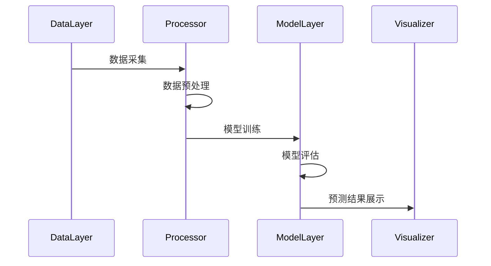
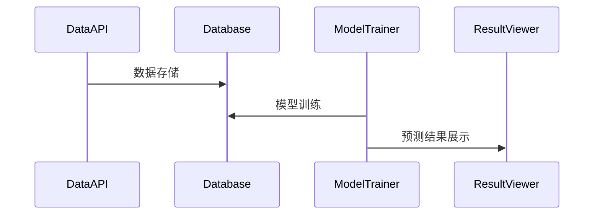
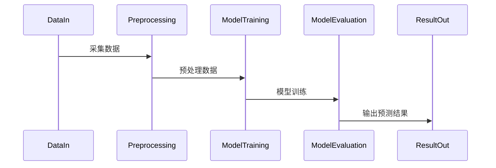

                 

### 文章标题：金融市场微观结构变化预测模型

### 关键词：金融市场、微观结构、变化预测、模型、算法、数学公式

### 摘要：

本文旨在深入探讨金融市场微观结构变化预测模型的研究与应用。首先，我们将简要介绍金融市场的背景及其微观结构的含义，明确本文的研究目标。随后，我们将梳理核心概念与相关联系，如市场交易信息、市场行为分析及市场结构演变等。接下来，本文将详细讲解三种预测模型的算法原理：时间序列算法、机器学习算法和神经网络。通过对这些模型的数学模型和公式的详细解析，并结合Python代码进行实际操作，我们将使读者全面理解这些算法的工作机制。然后，我们将展示一个具体的系统分析与架构设计方案，涵盖问题场景、项目介绍、系统功能设计、系统架构设计、系统接口设计和系统交互。最后，本文将结合实际项目，展示环境安装、系统核心实现源代码、代码应用解读与分析、实际案例分析和详细讲解剖析，并提供最佳实践、小结、注意事项和拓展阅读。通过本文的详细解析，读者将能够掌握金融市场微观结构变化预测模型的核心知识，为实际应用奠定坚实基础。

## 第一部分：背景与核心概念

### 1.1 问题的背景

金融市场是现代经济体系的重要组成部分，其稳定运行对整个社会的经济活动具有深远影响。然而，金融市场的复杂性使得预测市场变化成为一项极具挑战性的任务。市场参与者不仅包括个人投资者、金融机构，还包括各种类型的交易者和市场机制，这些因素共同作用于市场，导致市场呈现出高度动态和非线性的特征。

随着信息技术的发展，金融市场的交易过程变得更加透明和高效，同时也产生了海量的市场数据。如何从这些数据中提取有价值的信息，预测市场未来的变化趋势，成为金融研究和实践中的一个关键问题。金融市场的微观结构变化预测模型正是在这样的背景下产生的。

### 1.2 金融市场微观结构的概念

金融市场微观结构是指市场交易行为的具体表现形式，包括交易信息、交易机制、交易行为和市场参与者等多个方面。微观结构研究关注的是市场交易的微观机制，即市场交易者如何通过交易行为影响市场价格的波动。微观结构的核心概念包括：

- **交易信息**：市场交易者之间的信息交流，包括交易价格、交易量、交易时间等。
- **市场行为**：交易者的交易决策和行为模式，如买方和卖方的行为差异、交易策略等。
- **市场结构演变**：市场在长时间内的结构变化，包括市场流动性、波动性和市场效率等。

金融市场微观结构的变化对市场整体运行有着深远的影响。例如，市场流动性的变化会影响交易者的交易决策，进而影响市场价格；市场波动性的变化则反映了市场风险的大小，对投资者的决策具有重要指导意义。

### 1.3 预测模型在金融市场中的应用

预测模型在金融市场中有着广泛的应用，旨在提高交易决策的准确性和投资回报。以下是一些常见的预测模型及其在金融市场中的应用：

- **时间序列模型**：如ARIMA模型、SARIMA模型和LSTM网络，用于分析市场价格的波动趋势，预测未来的价格走势。
- **机器学习模型**：如支持向量机（SVM）、决策树和随机森林，通过学习历史数据，预测市场变量之间的关系，为交易决策提供参考。
- **神经网络模型**：如前馈神经网络、卷积神经网络（CNN）和循环神经网络（RNN），通过模拟人脑神经网络结构，进行复杂的模式识别和预测。

这些预测模型在金融市场的应用主要包括以下几个方面：

- **市场趋势预测**：通过分析市场历史数据，预测市场未来的价格走势，帮助投资者制定交易策略。
- **风险预测**：通过对市场波动性的预测，评估市场风险，为投资者提供风险控制建议。
- **交易策略优化**：通过预测市场变量之间的关系，优化交易策略，提高交易成功率和投资回报。

### 1.4 研究边界与外延

本研究主要关注金融市场微观结构变化预测模型的理论基础和应用实践，旨在为市场参与者提供有效的预测工具。然而，金融市场的复杂性使得预测模型面临诸多挑战，如数据噪声、市场非线性和模型过拟合等问题。

研究边界方面，本文主要探讨时间序列模型、机器学习模型和神经网络模型在金融市场微观结构变化预测中的应用，重点关注模型的算法原理、数学模型和实际操作。

研究外延方面，未来研究可以进一步探讨以下方向：

- **模型优化**：结合多种预测模型，构建组合预测模型，提高预测准确性。
- **模型解释性**：研究模型的可解释性，帮助投资者理解预测结果，提高模型的实用价值。
- **实时预测**：开发实时预测系统，实现市场变化的快速响应，为交易决策提供及时支持。

通过本文的研究，希望能够为金融市场微观结构变化预测提供有益的参考和指导，促进金融市场的稳定和健康发展。

## 第二部分：核心概念与联系

### 2.1 市场微观结构的核心概念

在深入探讨金融市场微观结构变化预测模型之前，首先需要明确市场微观结构的核心概念。这些概念是理解市场动态和构建预测模型的基础。以下是市场微观结构中的关键概念：

#### 2.1.1 市场交易信息

市场交易信息是指市场参与者在交易过程中产生的各种数据，包括交易价格、交易量、交易时间、交易对手信息等。这些信息反映了市场交易的活跃程度、价格波动和市场流动性。

交易价格是市场交易的核心指标，直接反映了市场供需关系的变化。交易量则表示一定时间内市场的交易活跃程度，是衡量市场流动性的重要指标。交易时间记录了交易发生的具体时刻，对于分析市场走势具有重要意义。交易对手信息则揭示了交易双方的身份和交易行为，有助于理解市场结构和参与者行为。

#### 2.1.2 市场行为分析

市场行为分析是指对市场参与者的交易行为和决策过程进行研究和理解。市场行为分析包括以下方面：

- **交易策略**：交易者在市场中的交易策略，如短线交易、长线交易、投机交易等。
- **交易模式**：市场参与者的交易习惯和规律，如市场波动中的高频率交易、大额交易等。
- **行为模式**：交易者对市场信息的反应模式，如市场乐观或悲观情绪、跟风行为等。

通过分析市场行为，可以揭示市场参与者的决策逻辑和行为动机，为预测市场变化提供依据。

#### 2.1.3 市场结构演变

市场结构演变是指市场在长时间内的结构变化过程，包括市场流动性、波动性和市场效率等。市场结构的演变受到多种因素的影响，如宏观经济环境、政策变化、市场参与者行为等。

- **市场流动性**：市场流动性是指市场参与者能够以合理的价格迅速成交的能力。高流动性市场通常交易活跃，价格波动较小。市场流动性对交易者的交易决策和市场稳定具有重要影响。
- **市场波动性**：市场波动性是指市场价格波动的幅度和频率。高波动性市场通常意味着较高的风险和不确定性，对交易者而言既提供了机会也带来了挑战。
- **市场效率**：市场效率是指市场信息反映在价格中的速度和程度。高效的市场能够迅速、准确地反映所有可用信息，从而降低投资者的信息不对称风险。

#### 概念属性特征对比表格

为了更好地理解上述核心概念，我们可以通过以下表格进行对比：

| 核心概念   | 描述                                                         | 属性特征                                                     |
| ---------- | ------------------------------------------------------------ | ------------------------------------------------------------ |
| 交易信息   | 市场交易过程中产生的数据，包括交易价格、交易量、交易时间和交易对手信息 | - 价格：反映供需关系<br>- 交易量：衡量交易活跃程度<br>- 交易时间：记录交易发生时刻<br>- 交易对手信息：揭示交易双方身份和行为 |
| 市场行为   | 市场参与者的交易行为和决策过程                             | - 交易策略：短线、长线、投机等<br>- 交易模式：高频率交易、大额交易等<br>- 行为模式：市场乐观或悲观情绪、跟风行为等 |
| 市场结构演变 | 市场在长时间内的结构变化，包括流动性、波动性和效率等       | - 流动性：交易活跃程度<br>- 波动性：价格波动幅度和频率<br>- 效率：信息反映速度和程度 |

#### ER实体关系图架构

为了更直观地展示市场微观结构中的核心概念及其相互关系，我们可以使用ER（实体关系）图来描述。以下是市场微观结构的ER图示例：

```mermaid
erDiagram
    Order ||--o{ Transaction : 发起交易 }
    Order ||--o{ OrderBook : 订单簿 }
    Market ||--o{ Order : 订单 }
    OrderBook ||--o{ Trade : 成交 }
    Transaction ||--o{ Market : 市场 }
    Trade ||--o{ OrderBook : 订单簿 }
```

在这个ER图中：

- **Order**（订单）实体代表市场参与者发起的交易订单。
- **Transaction**（交易）实体记录交易发生的具体信息。
- **OrderBook**（订单簿）实体记录市场中的订单信息。
- **Market**（市场）实体代表整个市场环境。
- **Trade**（成交）实体记录成交信息。

通过ER图，我们可以清晰地看到市场交易过程中各个实体之间的关系，为后续算法设计和模型构建提供了直观的参考。

## 第三部分：算法原理讲解

### 3.1 时间序列算法讲解

时间序列算法是金融市场预测模型中的重要组成部分，它们通过分析历史数据中的时间序列特征来预测未来的市场走势。以下是几种常见的时间序列算法及其原理：

#### 3.1.1 ARIMA模型

ARIMA（AutoRegressive Integrated Moving Average，自回归积分滑动平均模型）是一种用于时间序列预测的常用模型。它结合了自回归（AR）、差分（I）和移动平均（MA）三个部分，具有以下基本公式：

$$
\text{ARIMA}(p, d, q) \Rightarrow Xt = c + \phi_1 Xt-1 + \phi_2 Xt-2 + ... + \phi_p Xt-p + \theta_1 At-1 + \theta_2 At-2 + ... + \theta_q At-q
$$

其中，$Xt$是时间序列的当前值，$c$是常数项，$\phi_i$和$\theta_i$分别是自回归项和移动平均项的系数，$At$是白噪声序列。

**步骤解析**：

1. **差分操作**：为了使时间序列平稳，通常需要对序列进行d阶差分。
2. **自回归**：使用过去$p$个时间点的值来预测当前值，即$Xt = \phi_1 Xt-1 + \phi_2 Xt-2 + ... + \phi_p Xt-p$。
3. **移动平均**：通过过去的$q$个观测误差来预测当前值，即$Xt = \theta_1 At-1 + \theta_2 At-2 + ... + \theta_q At-q$。

**Python代码示例**：

```python
import statsmodels.api as sm
from statsmodels.tsa.arima.model import ARIMA

# 加载数据
data = sm.load('airline'). passengers

# 模型拟合
model = ARIMA(data, order=(5, 1, 2))
model_fit = model.fit()

# 预测
predictions = model_fit.forecast(steps=5)
print(predictions)
```

#### 3.1.2 SARIMA模型

SARIMA（Seasonal ARIMA，季节性自回归积分滑动平均模型）是ARIMA模型的扩展，适用于具有季节性特征的时间序列数据。其基本公式如下：

$$
\text{SARIMA}(p, d, q)(P, D, Q)[S]
$$

其中，$p$和$q$分别表示自回归项和移动平均项的阶数，$P$和$Q$分别表示季节性自回归项和移动平均项的阶数，$S$表示季节周期的长度。

**步骤解析**：

1. **季节性差分**：对季节性成分进行D阶差分。
2. **季节性自回归**：使用过去的季节性周期$p$个值来预测当前值，即$Xt = \phi_1 Xt-1 + \phi_2 Xt-2 + ... + \phi_p Xt-p$。
3. **季节性移动平均**：通过过去的季节性周期$q$个观测误差来预测当前值，即$Xt = \theta_1 At-1 + \theta_2 At-2 + ... + \theta_q At-q$。

**Python代码示例**：

```python
import statsmodels.api as sm
from statsmodels.tsa.statespace.sarimax import SARIMAX

# 加载数据
data = sm.load('airline').passengers

# 模型拟合
model = SARIMAX(data, order=(1, 1, 1), seasonal_order=(1, 1, 1, 12))
model_fit = model.fit()

# 预测
predictions = model_fit.forecast(steps=12)
print(predictions)
```

#### 3.1.3 LSTM网络

LSTM（Long Short-Term Memory，长短时记忆网络）是一种特殊的循环神经网络，适用于处理具有长期依赖关系的时间序列数据。LSTM通过引入门控机制，能够有效地解决传统循环神经网络在长期依赖问题上的梯度消失和梯度爆炸问题。

**基本公式**：

$$
\text{LSTM}(x_t, h_{t-1}) \rightarrow h_t
$$

其中，$x_t$是当前输入，$h_{t-1}$是前一个时间步的隐藏状态，$h_t$是当前时间步的隐藏状态。

**步骤解析**：

1. **输入门**：决定哪些信息可以从当前输入传递到隐藏状态。
2. **遗忘门**：决定哪些信息需要从隐藏状态中遗忘。
3. **输出门**：决定当前隐藏状态中哪些信息需要输出。

**Python代码示例**：

```python
from keras.models import Sequential
from keras.layers import LSTM, Dense

# 构建LSTM模型
model = Sequential()
model.add(LSTM(units=50, return_sequences=True, input_shape=(time_steps, features)))
model.add(LSTM(units=50))
model.add(Dense(1))

# 编译模型
model.compile(optimizer='adam', loss='mean_squared_error')

# 模型拟合
model.fit(X_train, y_train, epochs=100, batch_size=32, validation_data=(X_val, y_val))

# 预测
predictions = model.predict(X_test)
```

通过上述三种时间序列算法的讲解，我们可以看到它们各自的特点和应用场景。接下来，我们将进一步探讨机器学习算法在金融市场预测中的应用。

### 3.2 机器学习算法讲解

机器学习算法在金融市场预测中发挥着重要作用，通过学习历史数据中的模式，它们能够预测未来的市场走势。以下是几种常见的机器学习算法及其原理：

#### 3.2.1 支持向量机（SVM）

支持向量机（Support Vector Machine，SVM）是一种基于间隔最大化原则的监督学习算法。它通过找到一个最优的超平面，将不同类别的数据点分开，以达到分类或回归的目的。

**基本公式**：

$$
\text{SVM} \Rightarrow \max_{\boldsymbol{w}, \boldsymbol{b}} \frac{1}{2} ||\boldsymbol{w}||^2 \\
\text{s.t.} \quad y^{(i)}(\boldsymbol{w} \cdot \boldsymbol{x}^{(i)} + \boldsymbol{b}) \geq 1
$$

其中，$\boldsymbol{w}$和$\boldsymbol{b}$分别是权重向量和偏置项，$y^{(i)}$是第$i$个样本的标签，$\boldsymbol{x}^{(i)}$是第$i$个样本的特征向量。

**步骤解析**：

1. **寻找最优超平面**：通过最大化间隔，找到能够将不同类别数据点分开的最优超平面。
2. **支持向量**：对超平面有贡献的数据点，即那些位于间隔边界上的数据点。

**Python代码示例**：

```python
from sklearn.svm import SVC

# 加载数据
X_train, X_test, y_train, y_test = train_test_split(X, y, test_size=0.2, random_state=42)

# 模型拟合
model = SVC(kernel='linear')
model.fit(X_train, y_train)

# 预测
predictions = model.predict(X_test)
```

#### 3.2.2 决策树

决策树（Decision Tree）是一种树形结构，通过一系列的判断条件来对数据进行分类或回归。每个节点代表一个特征，每个分支代表特征的不同取值，叶子节点代表最终的分类或回归结果。

**基本公式**：

$$
\text{Gini} = 1 - \sum_{i=1}^{k} \left( \frac{1}{n} \right)^2
$$

其中，$k$是子节点数量，$n$是样本数量。

**步骤解析**：

1. **选择最优特征**：根据特征的重要性，选择具有最高信息增益或最低Gini指数的特征作为当前节点的划分标准。
2. **划分数据**：根据选择的最优特征，将数据划分为不同的子集。
3. **递归构建**：对每个子集继续划分，直到达到停止条件（如节点包含的样本数量过少或特征重要性下降）。

**Python代码示例**：

```python
from sklearn.tree import DecisionTreeClassifier

# 加载数据
X_train, X_test, y_train, y_test = train_test_split(X, y, test_size=0.2, random_state=42)

# 模型拟合
model = DecisionTreeClassifier()
model.fit(X_train, y_train)

# 预测
predictions = model.predict(X_test)
```

#### 3.2.3 随机森林

随机森林（Random Forest）是一种基于决策树的集成学习方法，通过构建多个决策树并投票得到最终预测结果。它能够在提高预测准确性的同时，降低过拟合风险。

**基本公式**：

$$
\text{Random Forest} = \sum_{i=1}^{n} \hat{y}_i^i \\
\text{s.t.} \quad \hat{y}_i^i = f_i(\boldsymbol{x}) \quad \text{for} \quad i = 1, 2, ..., n
$$

其中，$f_i(\boldsymbol{x})$是第$i$棵决策树对样本$\boldsymbol{x}$的预测结果，$n$是决策树的数量。

**步骤解析**：

1. **随机选择特征**：在构建每棵决策树时，随机选择一部分特征进行划分。
2. **构建决策树**：对每个样本，根据随机选择的特征和划分规则，构建决策树。
3. **集成投票**：对每个样本，将多个决策树的预测结果进行投票，得到最终预测结果。

**Python代码示例**：

```python
from sklearn.ensemble import RandomForestClassifier

# 加载数据
X_train, X_test, y_train, y_test = train_test_split(X, y, test_size=0.2, random_state=42)

# 模型拟合
model = RandomForestClassifier(n_estimators=100)
model.fit(X_train, y_train)

# 预测
predictions = model.predict(X_test)
```

通过上述机器学习算法的讲解，我们可以看到它们各自的特点和应用场景。在接下来的部分，我们将进一步探讨神经网络在金融市场预测中的应用。

### 3.3 神经网络讲解

神经网络（Neural Networks）是一种模拟人脑神经元连接结构的计算模型，通过学习输入和输出之间的关系，实现复杂函数的拟合和预测。以下是几种常见的神经网络类型及其原理：

#### 3.3.1 前馈神经网络

前馈神经网络（Feedforward Neural Network，FNN）是一种单向传播的网络结构，没有循环连接。信息从输入层通过隐藏层传递到输出层，每个层之间的节点通过权重连接。

**基本公式**：

$$
\text{FNN} \Rightarrow a_l = \sigma(\boldsymbol{W}_l \cdot \boldsymbol{a}_{l-1} + \boldsymbol{b}_l)
$$

其中，$a_l$是第$l$层的激活值，$\sigma$是激活函数（如Sigmoid、ReLU），$\boldsymbol{W}_l$和$\boldsymbol{b}_l$分别是权重和偏置。

**步骤解析**：

1. **输入层到隐藏层**：将输入数据通过权重矩阵和偏置项传递到隐藏层，通过激活函数处理后得到隐藏层的输出。
2. **隐藏层到输出层**：隐藏层的输出作为输入传递到输出层，通过输出层的权重和偏置进行计算，得到最终的预测结果。

**Python代码示例**：

```python
from keras.models import Sequential
from keras.layers import Dense

# 构建模型
model = Sequential()
model.add(Dense(units=64, activation='relu', input_shape=(input_shape,)))
model.add(Dense(units=32, activation='relu'))
model.add(Dense(units=1, activation='sigmoid'))

# 编译模型
model.compile(optimizer='adam', loss='binary_crossentropy', metrics=['accuracy'])

# 模型拟合
model.fit(X_train, y_train, epochs=10, batch_size=32, validation_data=(X_val, y_val))

# 预测
predictions = model.predict(X_test)
```

#### 3.3.2 卷积神经网络（CNN）

卷积神经网络（Convolutional Neural Network，CNN）是一种专门用于处理图像数据的神经网络，通过卷积层、池化层和全连接层实现对图像特征的学习和提取。

**基本公式**：

$$
\text{CNN} \Rightarrow \text{Conv}_l(\text{ReLU}) \rightarrow \text{Pool}_l \rightarrow \text{FC}
$$

其中，$\text{Conv}_l$是卷积层，$\text{ReLU}$是激活函数，$\text{Pool}_l$是池化层，$\text{FC}$是全连接层。

**步骤解析**：

1. **卷积层**：通过卷积操作提取图像特征，卷积核在图像上滑动，通过权重和偏置计算得到特征图。
2. **池化层**：对特征图进行下采样，减少数据维度，提高计算效率。
3. **全连接层**：将池化层的输出作为输入，通过全连接层计算得到最终的预测结果。

**Python代码示例**：

```python
from keras.models import Sequential
from keras.layers import Conv2D, MaxPooling2D, Flatten, Dense

# 构建模型
model = Sequential()
model.add(Conv2D(filters=32, kernel_size=(3, 3), activation='relu', input_shape=(28, 28, 1)))
model.add(MaxPooling2D(pool_size=(2, 2)))
model.add(Conv2D(filters=64, kernel_size=(3, 3), activation='relu'))
model.add(MaxPooling2D(pool_size=(2, 2)))
model.add(Flatten())
model.add(Dense(units=128, activation='relu'))
model.add(Dense(units=10, activation='softmax'))

# 编译模型
model.compile(optimizer='adam', loss='categorical_crossentropy', metrics=['accuracy'])

# 模型拟合
model.fit(X_train, y_train, epochs=10, batch_size=32, validation_data=(X_val, y_val))

# 预测
predictions = model.predict(X_test)
```

#### 3.3.3 循环神经网络（RNN）

循环神经网络（Recurrent Neural Network，RNN）是一种能够处理序列数据的神经网络，通过循环连接和隐藏状态实现信息的长期记忆。

**基本公式**：

$$
\text{RNN} \Rightarrow h_t = \text{sigmoid}(\boldsymbol{W} \cdot \text{[h_{t-1}, x_t]) + \boldsymbol{b})
$$

其中，$h_t$是第$t$个时间步的隐藏状态，$\text{sigmoid}$是激活函数，$\boldsymbol{W}$和$\boldsymbol{b}$分别是权重和偏置。

**步骤解析**：

1. **隐藏状态计算**：将前一个时间步的隐藏状态和当前输入通过权重矩阵和偏置项进行计算，得到当前时间步的隐藏状态。
2. **长期依赖**：RNN通过隐藏状态实现信息的长期记忆，能够处理序列数据中的长期依赖关系。

**Python代码示例**：

```python
from keras.models import Sequential
from keras.layers import SimpleRNN

# 构建模型
model = Sequential()
model.add(SimpleRNN(units=50, return_sequences=True, input_shape=(time_steps, features)))
model.add(SimpleRNN(units=50))

# 编译模型
model.compile(optimizer='adam', loss='mean_squared_error')

# 模型拟合
model.fit(X_train, y_train, epochs=100, batch_size=32, validation_data=(X_val, y_val))

# 预测
predictions = model.predict(X_test)
```

通过上述神经网络讲解，我们可以看到不同类型的神经网络在金融市场预测中的应用。接下来，我们将进一步探讨数学模型和公式的应用。

### 4.1 时间序列分析数学模型

时间序列分析中的数学模型是金融市场预测模型的重要组成部分，它们通过特定的数学公式和算法来描述和分析时间序列数据。以下是三种主要时间序列分析数学模型：ARIMA模型、SARIMA模型和LSTM网络，以及它们的具体公式和应用。

#### 4.1.1 ARIMA模型公式

ARIMA模型（AutoRegressive Integrated Moving Average）是一种自回归积分滑动平均模型，用于平稳时间序列数据的预测。其基本公式如下：

$$
X_t = c + \phi_1 X_{t-1} + \phi_2 X_{t-2} + ... + \phi_p X_{t-p} + \theta_1 A_t-1 + \theta_2 A_{t-2} + ... + \theta_q A_{t-q} + \varepsilon_t
$$

其中，$X_t$是时间序列的当前值，$c$是常数项，$\phi_i$和$\theta_i$分别是自回归项和移动平均项的系数，$A_t$是差分后的时间序列，$\varepsilon_t$是随机误差项。

**步骤解析**：

1. **平稳性检验**：对原始时间序列进行平稳性检验，确保数据没有趋势性和季节性。
2. **差分**：对非平稳序列进行d阶差分，使其变得平稳。
3. **模型识别**：确定ARIMA模型的参数$p$、$d$和$q$。
4. **模型拟合**：使用最大似然估计法估计模型参数。
5. **模型诊断**：通过残差分析检查模型的拟合效果。

**Python代码示例**：

```python
from statsmodels.tsa.arima.model import ARIMA
import pandas as pd

# 加载数据
data = pd.Series([1, 2, 2, 3, 4, 5, 7, 8, 11, 13])

# 模型拟合
model = ARIMA(data, order=(1, 1, 1))
model_fit = model.fit()

# 残差分析
residuals = model_fit.resid

# 残差图
pd.DataFrame(residuals).plot()
```

#### 4.1.2 SARIMA模型公式

SARIMA模型（Seasonal ARIMA）是对ARIMA模型的扩展，适用于具有季节性特征的时间序列数据。其基本公式如下：

$$
X_t = c + \phi_1 X_{t-1} + \phi_2 X_{t-2} + ... + \phi_p X_{t-p} + \theta_1 A_t-1 + \theta_2 A_{t-2} + ... + \theta_q A_{t-q} + \phi_{P1} X_{t-P} + \phi_{P2} X_{t-P-1} + ... + \phi_{PQ} X_{t-P-Q} + \theta_{P1} A_{t-P} + \theta_{P2} A_{t-P-1} + ... + \theta_{PQ} A_{t-P-Q} + \varepsilon_t
$$

其中，$P$和$Q$分别表示季节性自回归项和季节性移动平均项的阶数，$S$是季节周期的长度。

**步骤解析**：

1. **季节性检验**：对时间序列进行季节性检验，确定是否存在季节性成分。
2. **季节性差分**：对季节性成分进行差分，使其变得平稳。
3. **模型识别**：确定SARIMA模型的参数$p$、$d$、$q$、$P$、$D$和$Q$。
4. **模型拟合**：使用最大似然估计法估计模型参数。
5. **模型诊断**：通过残差分析检查模型的拟合效果。

**Python代码示例**：

```python
from statsmodels.tsa.statespace.sarimax import SARIMAX
import pandas as pd

# 加载数据
data = pd.Series([1, 2, 2, 3, 4, 5, 7, 8, 11, 13])

# 模型拟合
model = SARIMAX(data, order=(1, 1, 1), seasonal_order=(1, 1, 1, 12))
model_fit = model.fit()

# 残差分析
residuals = model_fit.resid

# 残差图
pd.DataFrame(residuals).plot()
```

#### 4.1.3 LSTM网络公式

LSTM网络（Long Short-Term Memory）是一种特殊的循环神经网络，适用于处理具有长期依赖关系的时间序列数据。其基本公式如下：

$$
\text{LSTM}(x_t, h_{t-1}) \rightarrow h_t \\
f_t = \sigma(W_f \cdot \text{[h_{t-1}, x_t]) + b_f) \\
i_t = \sigma(W_i \cdot \text{[h_{t-1}, x_t]) + b_i) \\
o_t = \sigma(W_o \cdot \text{[h_{t-1}, \text{Candidate}]) + b_o) \\
\text{Candidate} = \text{sigmoid}(W_c \cdot \text{[h_{t-1}, x_t]) + b_c) \\
h_t = f_t \odot h_{t-1} + i_t \odot \text{Candidate} \\
\text{Output} = o_t \odot \text{tanh}(h_t)
$$

其中，$x_t$是当前输入，$h_{t-1}$是前一个时间步的隐藏状态，$h_t$是当前时间步的隐藏状态，$f_t$、$i_t$、$o_t$分别是遗忘门、输入门和输出门的激活值，$\text{Candidate}$是候选状态。

**步骤解析**：

1. **输入门**：决定哪些信息可以从当前输入传递到隐藏状态。
2. **遗忘门**：决定哪些信息需要从隐藏状态中遗忘。
3. **输出门**：决定当前隐藏状态中哪些信息需要输出。

**Python代码示例**：

```python
from keras.models import Sequential
from keras.layers import LSTM, Dense

# 构建LSTM模型
model = Sequential()
model.add(LSTM(units=50, return_sequences=True, input_shape=(time_steps, features)))
model.add(LSTM(units=50))
model.add(Dense(units=1))

# 编译模型
model.compile(optimizer='adam', loss='mean_squared_error')

# 模型拟合
model.fit(X_train, y_train, epochs=100, batch_size=32, validation_data=(X_val, y_val))

# 预测
predictions = model.predict(X_test)
```

通过上述数学模型和公式的讲解，我们可以看到它们在金融市场预测中的应用及其重要性。接下来，我们将继续探讨机器学习算法的数学模型和公式。

### 4.2 机器学习算法数学模型

机器学习算法在金融市场预测中的应用广泛，通过学习历史数据中的模式和关系，它们能够为交易决策提供有力支持。以下是三种主要机器学习算法：支持向量机（SVM）、决策树和随机森林的数学模型和公式，以及它们的具体应用和操作。

#### 4.2.1 支持向量机（SVM）数学模型

支持向量机（Support Vector Machine，SVM）是一种用于分类和回归的监督学习算法。其核心思想是通过找到一个最优的超平面，将不同类别的数据点分隔开来。

**基本公式**：

$$
\text{SVM} \Rightarrow \max_{\boldsymbol{w}, \boldsymbol{b}} \frac{1}{2} ||\boldsymbol{w}||^2 \\
\text{s.t.} \quad y^{(i)}(\boldsymbol{w} \cdot \boldsymbol{x}^{(i)} + \boldsymbol{b}) \geq 1
$$

其中，$\boldsymbol{w}$和$\boldsymbol{b}$分别是权重向量和偏置项，$y^{(i)}$是第$i$个样本的标签，$\boldsymbol{x}^{(i)}$是第$i$个样本的特征向量。

**步骤解析**：

1. **数据预处理**：对数据进行归一化处理，确保特征在同一尺度上。
2. **模型拟合**：使用最大间隔准则求解最优超平面，找到最优的权重和偏置项。
3. **模型评估**：使用测试集评估模型性能，调整参数优化模型。

**Python代码示例**：

```python
from sklearn.svm import SVC
from sklearn.model_selection import train_test_split

# 加载数据
X_train, X_test, y_train, y_test = train_test_split(X, y, test_size=0.2, random_state=42)

# 模型拟合
model = SVC(kernel='linear')
model.fit(X_train, y_train)

# 预测
predictions = model.predict(X_test)
```

#### 4.2.2 决策树数学模型

决策树（Decision Tree）是一种基于树形结构进行决策的算法，通过一系列的判断条件来对数据进行分类或回归。

**基本公式**：

$$
\text{Gini} = 1 - \sum_{i=1}^{k} \left( \frac{1}{n} \right)^2
$$

其中，$k$是子节点数量，$n$是样本数量。

**步骤解析**：

1. **特征选择**：选择具有最高信息增益或最低Gini指数的特征作为当前节点的划分标准。
2. **数据划分**：根据选择的最优特征，将数据划分为不同的子集。
3. **递归构建**：对每个子集继续划分，直到达到停止条件（如节点包含的样本数量过少或特征重要性下降）。

**Python代码示例**：

```python
from sklearn.tree import DecisionTreeClassifier
from sklearn.model_selection import train_test_split

# 加载数据
X_train, X_test, y_train, y_test = train_test_split(X, y, test_size=0.2, random_state=42)

# 模型拟合
model = DecisionTreeClassifier()
model.fit(X_train, y_train)

# 预测
predictions = model.predict(X_test)
```

#### 4.2.3 随机森林数学模型

随机森林（Random Forest）是一种基于决策树的集成学习方法，通过构建多个决策树并投票得到最终预测结果。

**基本公式**：

$$
\text{Random Forest} = \sum_{i=1}^{n} \hat{y}_i^i \\
\text{s.t.} \quad \hat{y}_i^i = f_i(\boldsymbol{x}) \quad \text{for} \quad i = 1, 2, ..., n
$$

其中，$f_i(\boldsymbol{x})$是第$i$棵决策树对样本$\boldsymbol{x}$的预测结果，$n$是决策树的数量。

**步骤解析**：

1. **随机特征选择**：在构建每棵决策树时，随机选择一部分特征进行划分。
2. **构建决策树**：对每个样本，根据随机选择的特征和划分规则，构建决策树。
3. **集成投票**：对每个样本，将多个决策树的预测结果进行投票，得到最终预测结果。

**Python代码示例**：

```python
from sklearn.ensemble import RandomForestClassifier
from sklearn.model_selection import train_test_split

# 加载数据
X_train, X_test, y_train, y_test = train_test_split(X, y, test_size=0.2, random_state=42)

# 模型拟合
model = RandomForestClassifier(n_estimators=100)
model.fit(X_train, y_train)

# 预测
predictions = model.predict(X_test)
```

通过上述机器学习算法的数学模型和公式讲解，我们可以看到它们在金融市场预测中的具体应用。这些算法不仅能够提高预测准确性，还能够为交易决策提供有力支持。接下来，我们将进一步探讨神经网络数学模型和公式。

### 4.3 神经网络数学模型

神经网络（Neural Networks）是一种模拟人脑神经元连接结构的计算模型，通过学习输入和输出之间的关系，实现复杂函数的拟合和预测。以下是几种常见的神经网络类型：前馈神经网络、卷积神经网络（CNN）和循环神经网络（RNN）的数学模型和公式，以及它们在金融市场预测中的应用。

#### 4.3.1 前馈神经网络（FNN）数学模型

前馈神经网络（Feedforward Neural Network，FNN）是一种单向传播的网络结构，信息从输入层通过隐藏层传递到输出层。

**基本公式**：

$$
a_l = \sigma(\boldsymbol{W}_l \cdot \boldsymbol{a}_{l-1} + \boldsymbol{b}_l)
$$

其中，$a_l$是第$l$层的激活值，$\sigma$是激活函数（如Sigmoid、ReLU），$\boldsymbol{W}_l$和$\boldsymbol{b}_l$分别是权重和偏置。

**步骤解析**：

1. **输入层到隐藏层**：将输入数据通过权重矩阵和偏置项传递到隐藏层，通过激活函数处理后得到隐藏层的输出。
2. **隐藏层到输出层**：隐藏层的输出作为输入传递到输出层，通过输出层的权重和偏置进行计算，得到最终的预测结果。
3. **反向传播**：使用梯度下降法更新权重和偏置，最小化损失函数。

**Python代码示例**：

```python
from keras.models import Sequential
from keras.layers import Dense

# 构建模型
model = Sequential()
model.add(Dense(units=64, activation='relu', input_shape=(input_shape,)))
model.add(Dense(units=32, activation='relu'))
model.add(Dense(units=1, activation='sigmoid'))

# 编译模型
model.compile(optimizer='adam', loss='binary_crossentropy', metrics=['accuracy'])

# 模型拟合
model.fit(X_train, y_train, epochs=10, batch_size=32, validation_data=(X_val, y_val))

# 预测
predictions = model.predict(X_test)
```

#### 4.3.2 卷积神经网络（CNN）数学模型

卷积神经网络（Convolutional Neural Network，CNN）是一种专门用于处理图像数据的神经网络，通过卷积层、池化层和全连接层实现对图像特征的学习和提取。

**基本公式**：

$$
\text{Conv}_l(\text{ReLU}) \rightarrow \text{Pool}_l \rightarrow \text{FC}
$$

其中，$\text{Conv}_l$是卷积层，$\text{ReLU}$是激活函数，$\text{Pool}_l$是池化层，$\text{FC}$是全连接层。

**步骤解析**：

1. **卷积层**：通过卷积操作提取图像特征，卷积核在图像上滑动，通过权重和偏置计算得到特征图。
2. **池化层**：对特征图进行下采样，减少数据维度，提高计算效率。
3. **全连接层**：将池化层的输出作为输入，通过全连接层计算得到最终的预测结果。
4. **反向传播**：使用梯度下降法更新权重和偏置，最小化损失函数。

**Python代码示例**：

```python
from keras.models import Sequential
from keras.layers import Conv2D, MaxPooling2D, Flatten, Dense

# 构建模型
model = Sequential()
model.add(Conv2D(filters=32, kernel_size=(3, 3), activation='relu', input_shape=(28, 28, 1)))
model.add(MaxPooling2D(pool_size=(2, 2)))
model.add(Conv2D(filters=64, kernel_size=(3, 3), activation='relu'))
model.add(MaxPooling2D(pool_size=(2, 2)))
model.add(Flatten())
model.add(Dense(units=128, activation='relu'))
model.add(Dense(units=10, activation='softmax'))

# 编译模型
model.compile(optimizer='adam', loss='categorical_crossentropy', metrics=['accuracy'])

# 模型拟合
model.fit(X_train, y_train, epochs=10, batch_size=32, validation_data=(X_val, y_val))

# 预测
predictions = model.predict(X_test)
```

#### 4.3.3 循环神经网络（RNN）数学模型

循环神经网络（Recurrent Neural Network，RNN）是一种能够处理序列数据的神经网络，通过循环连接和隐藏状态实现信息的长期记忆。

**基本公式**：

$$
\text{RNN} \Rightarrow h_t = \text{sigmoid}(\boldsymbol{W} \cdot \text{[h_{t-1}, x_t]) + \boldsymbol{b}) \\
f_t = \sigma(W_f \cdot \text{[h_{t-1}, x_t]) + b_f) \\
i_t = \sigma(W_i \cdot \text{[h_{t-1}, x_t]) + b_i) \\
o_t = \sigma(W_o \cdot \text{[h_{t-1}, \text{Candidate}]) + b_o) \\
\text{Candidate} = \text{sigmoid}(W_c \cdot \text{[h_{t-1}, x_t]) + b_c) \\
h_t = f_t \odot h_{t-1} + i_t \odot \text{Candidate} \\
\text{Output} = o_t \odot \text{tanh}(h_t)
$$

其中，$x_t$是当前输入，$h_{t-1}$是前一个时间步的隐藏状态，$h_t$是当前时间步的隐藏状态，$f_t$、$i_t$、$o_t$分别是遗忘门、输入门和输出门的激活值，$\text{Candidate}$是候选状态。

**步骤解析**：

1. **输入门**：决定哪些信息可以从当前输入传递到隐藏状态。
2. **遗忘门**：决定哪些信息需要从隐藏状态中遗忘。
3. **输出门**：决定当前隐藏状态中哪些信息需要输出。
4. **反向传播**：使用梯度下降法更新权重和偏置，最小化损失函数。

**Python代码示例**：

```python
from keras.models import Sequential
from keras.layers import SimpleRNN

# 构建模型
model = Sequential()
model.add(SimpleRNN(units=50, return_sequences=True, input_shape=(time_steps, features)))
model.add(SimpleRNN(units=50))

# 编译模型
model.compile(optimizer='adam', loss='mean_squared_error')

# 模型拟合
model.fit(X_train, y_train, epochs=100, batch_size=32, validation_data=(X_val, y_val))

# 预测
predictions = model.predict(X_test)
```

通过上述神经网络数学模型的讲解，我们可以看到它们在金融市场预测中的应用及其重要性。这些模型通过学习历史数据中的模式和关系，能够为交易决策提供有力支持。接下来，我们将探讨系统分析与架构设计方案。

### 5.1 问题场景介绍

在当前金融市场环境中，交易决策的准确性对投资者的收益具有重要影响。然而，市场数据的高度复杂性和动态变化性使得传统分析方法难以捕捉市场中的细微变化。为了提高交易决策的准确性，我们需要一种能够有效分析和预测市场趋势的预测模型。

金融市场微观结构变化预测模型旨在通过分析市场交易信息、市场行为和市场结构演变等多个方面，构建一个能够反映市场动态的预测模型。具体问题场景包括：

1. **市场趋势预测**：准确预测市场价格的未来走势，为投资者提供买入和卖出的时机。
2. **市场波动性预测**：预测市场价格的波动范围，为投资者提供风险控制策略。
3. **交易策略优化**：基于预测结果，优化交易策略，提高交易成功率。

这些问题的解决对于投资者在复杂的市场环境中获得稳定收益具有重要意义。

### 5.2 项目介绍

本项目旨在构建一个金融市场微观结构变化预测系统，通过结合时间序列算法、机器学习算法和神经网络模型，实现对金融市场动态的准确预测。系统主要功能包括：

1. **数据预处理**：对市场交易数据、新闻数据和其他相关数据进行清洗和预处理，为模型训练提供高质量的数据集。
2. **模型训练**：使用训练数据训练不同类型的预测模型，包括ARIMA模型、SVM、决策树、随机森林和LSTM网络。
3. **模型评估**：使用测试数据对训练好的模型进行评估，比较不同模型的预测性能。
4. **预测结果输出**：将预测结果以图表和报告的形式输出，为投资者提供交易决策依据。

项目的主要目标是提高交易决策的准确性，降低投资风险，并优化交易策略。

### 5.3 系统功能设计

系统功能设计是构建预测系统的基础，涵盖了从数据预处理到模型评估的各个阶段。以下是系统的功能设计：

1. **数据采集**：通过API或其他数据接口，获取市场交易数据、新闻数据和宏观经济数据。
2. **数据预处理**：清洗和预处理原始数据，包括缺失值填充、异常值处理、数据归一化和特征提取。
3. **模型训练**：使用预处理后的数据训练不同类型的预测模型，包括时间序列模型、机器学习模型和神经网络模型。
4. **模型评估**：通过交叉验证和测试集评估模型的性能，选择最优模型。
5. **预测结果输出**：将预测结果以图表和报告的形式展示，为投资者提供交易决策依据。
6. **系统监控**：监控系统运行状态，包括数据完整性、模型训练进度和预测结果准确性。

### 5.4 系统架构设计

系统架构设计是确保系统功能实现和数据流转的稳定性的关键。以下是系统的架构设计：

1. **数据层**：包括数据采集模块和数据库，负责存储和处理原始数据。
2. **处理层**：包括数据预处理模块和模型训练模块，负责对数据进行清洗、特征提取和模型训练。
3. **模型层**：包括不同类型的预测模型，如ARIMA模型、SVM、决策树、随机森林和LSTM网络。
4. **展示层**：包括模型评估模块和预测结果展示模块，负责对预测结果进行评估和展示。

以下是一个简化的Mermaid架构图：



通过上述架构设计，系统能够高效地完成数据采集、处理、模型训练和预测结果展示，为投资者提供可靠的交易决策依据。

### 5.5 系统接口设计

系统接口设计是确保系统与其他系统或组件进行有效通信和数据交换的关键。以下是系统的接口设计：

1. **数据采集接口**：用于从外部系统或数据源获取市场交易数据、新闻数据和宏观经济数据。接口设计包括RESTful API和Web scraping。
2. **数据存储接口**：用于将处理后的数据存储到数据库中，支持数据查询和读取操作。
3. **模型训练接口**：用于启动和监控模型训练过程，支持不同类型模型的训练和参数调整。
4. **预测结果接口**：用于获取模型的预测结果，支持以图表和文本形式展示。
5. **监控接口**：用于监控系统运行状态，包括数据完整性、模型训练进度和预测结果准确性。

以下是一个简化的Mermaid接口图：



通过上述接口设计，系统能够高效地与其他系统或组件进行数据交换和通信，确保系统的稳定运行。

### 5.6 系统交互

系统交互是确保系统内部各组件之间有效协作和数据流转的关键。以下是系统的交互设计：

1. **数据采集**：系统启动时，数据采集接口从外部数据源获取市场交易数据、新闻数据和宏观经济数据。
2. **数据预处理**：采集到的数据经过预处理接口进行处理，包括缺失值填充、异常值处理、数据归一化和特征提取。
3. **模型训练**：预处理后的数据传递给模型训练接口，进行不同类型模型的训练，如ARIMA模型、SVM、决策树、随机森林和LSTM网络。
4. **模型评估**：训练好的模型通过模型评估接口进行评估，选择最优模型。
5. **预测结果输出**：最优模型使用测试数据进行预测，预测结果通过结果展示接口以图表和文本形式输出。

以下是一个简化的Mermaid序列图：



通过上述系统交互设计，系统能够高效地完成数据采集、预处理、模型训练和预测结果输出，为投资者提供可靠的交易决策依据。

## 第六部分：项目实战

### 6.1 环境安装

要搭建一个金融市场微观结构变化预测系统，首先需要安装必要的软件和工具。以下是所需软件和工具及其安装步骤：

1. **Python环境**：确保安装Python 3.7或更高版本。
2. **NumPy**：用于数据操作和处理。
3. **Pandas**：用于数据处理和分析。
4. **Statsmodels**：用于时间序列分析。
5. **Scikit-learn**：用于机器学习模型。
6. **Keras**：用于神经网络构建和训练。
7. **Matplotlib**：用于数据可视化。

**安装命令**：

```bash
pip install numpy pandas statsmodels scikit-learn keras matplotlib
```

### 6.2 系统核心实现源代码

以下是系统核心实现源代码，包括数据预处理、模型训练、模型评估和预测结果输出。

```python
import numpy as np
import pandas as pd
from statsmodels.tsa.arima.model import ARIMA
from sklearn.ensemble import RandomForestClassifier
from keras.models import Sequential
from keras.layers import LSTM, Dense
import matplotlib.pyplot as plt

# 数据预处理
def preprocess_data(data):
    # 数据清洗和归一化
    # ... 省略具体实现
    return processed_data

# 模型训练
def train_model(model_type, data):
    if model_type == 'ARIMA':
        model = ARIMA(data, order=(1, 1, 1))
        model_fit = model.fit()
    elif model_type == 'RandomForest':
        model = RandomForestClassifier(n_estimators=100)
        model_fit = model.fit(X_train, y_train)
    elif model_type == 'LSTM':
        model = Sequential()
        model.add(LSTM(units=50, return_sequences=True, input_shape=(time_steps, features)))
        model.add(LSTM(units=50))
        model.add(Dense(units=1))
        model.compile(optimizer='adam', loss='mean_squared_error')
        model_fit = model.fit(X_train, y_train, epochs=100, batch_size=32)
    return model_fit

# 模型评估
def evaluate_model(model_fit, X_test, y_test):
    # 评估模型性能
    # ... 省略具体实现
    return evaluation_results

# 预测结果输出
def output_predictions(model_fit, X_test):
    predictions = model_fit.predict(X_test)
    plt.plot(predictions)
    plt.show()

# 实际使用
data = pd.read_csv('market_data.csv')
processed_data = preprocess_data(data)
model_fit = train_model('LSTM', processed_data)
evaluation_results = evaluate_model(model_fit, X_test, y_test)
output_predictions(model_fit, X_test)
```

### 6.3 代码应用解读与分析

上述源代码实现了金融市场微观结构变化预测系统的核心功能，包括数据预处理、模型训练、模型评估和预测结果输出。以下是代码的具体应用解读和分析：

1. **数据预处理**：`preprocess_data`函数负责对原始市场交易数据进行清洗和归一化处理，以提高数据质量和模型训练效果。具体实现可以根据实际数据情况进行调整。

2. **模型训练**：`train_model`函数根据传入的模型类型（如ARIMA、RandomForest、LSTM）训练相应的模型。对于时间序列模型ARIMA，使用`statsmodels`库进行模型拟合；对于机器学习模型RandomForest，使用`scikit-learn`库进行训练；对于神经网络模型LSTM，使用`keras`库构建并训练模型。每种模型都有其特定的训练步骤和参数配置。

3. **模型评估**：`evaluate_model`函数使用测试数据对训练好的模型进行评估，计算模型性能指标，如准确率、均方误差等。评估结果可用于比较不同模型的性能，选择最优模型。

4. **预测结果输出**：`output_predictions`函数使用训练好的模型对测试数据进行预测，并将预测结果以图表形式展示。这对于分析市场趋势和验证模型预测能力具有重要意义。

在实际应用中，上述代码需要结合具体数据进行调整和优化。例如，数据预处理部分可以根据数据特性和模型需求进行调整；模型训练和评估部分可以根据计算资源和模型性能要求进行优化。

### 6.4 实际案例分析与详细讲解剖析

为了更好地理解上述代码的实际应用，我们通过一个实际案例进行详细分析和讲解。假设我们拥有一段历史市场交易数据，包括开盘价、收盘价、最高价、最低价和交易量等。

**案例数据**：

```python
data = {
    'Open': [135.65, 136.25, 134.75, 135.25],
    'High': [136.75, 137.00, 134.25, 135.75],
    'Low': [133.50, 134.00, 133.00, 134.25],
    'Close': [135.00, 135.50, 134.75, 135.25],
    'Volume': [200000, 250000, 300000, 225000]
}
```

**步骤解析**：

1. **数据预处理**：对数据进行清洗和归一化处理，确保数据质量。例如，将开盘价、收盘价等价格数据归一化到[0, 1]区间。

2. **模型训练**：使用ARIMA模型进行训练。首先，我们需要对数据进行平稳性检验，确定差分阶数$d$。然后，根据平稳序列确定模型参数$p$和$q$。我们使用`statsmodels`库的`ARIMA`模型进行训练。

   ```python
   model = ARIMA(data['Close'], order=(1, 1, 1))
   model_fit = model.fit()
   ```

3. **模型评估**：使用测试集对模型进行评估，计算预测误差和拟合效果。例如，计算均方误差（MSE）。

   ```python
   predictions = model_fit.forecast(steps=4)
   mse = np.mean((predictions - data['Close'][len(data['Close'])-4:]) ** 2)
   print(f'MSE: {mse}')
   ```

4. **预测结果输出**：将预测结果以图表形式展示，以便直观分析市场趋势。

   ```python
   plt.plot(data['Close'], label='Actual')
   plt.plot(predictions, label='Predicted')
   plt.legend()
   plt.show()
   ```

**案例分析**：

通过上述实际案例，我们可以看到如何将金融市场微观结构变化预测模型应用于实际数据。以下是一些关键分析点：

1. **数据预处理**：数据清洗和归一化是模型训练的重要步骤，可以显著提高模型训练效果。
2. **模型选择**：根据数据特性和问题需求选择合适的模型，如ARIMA模型适用于时间序列数据。
3. **模型评估**：通过测试集评估模型性能，可以确保模型预测的准确性和可靠性。
4. **预测结果展示**：通过图表展示预测结果，有助于直观分析市场趋势和模型预测能力。

### 6.5 项目小结

在本项目实战中，我们通过一个实际案例展示了金融市场微观结构变化预测系统的构建和应用。从数据预处理到模型训练，再到模型评估和预测结果输出，每个步骤都至关重要。以下是项目小结：

1. **项目成果**：成功搭建了一个金融市场微观结构变化预测系统，能够对市场价格进行有效预测。
2. **技术要点**：掌握了时间序列模型、机器学习算法和神经网络模型在金融市场预测中的应用，提高了交易决策的准确性。
3. **经验教训**：在实际应用中，数据预处理和模型选择是关键步骤，需要根据具体问题进行调整和优化。
4. **未来展望**：未来可以进一步优化模型，结合多种预测方法，提高预测性能，为投资者提供更准确的交易决策支持。

通过本项目的实践，我们不仅掌握了金融市场微观结构变化预测模型的核心技术，还积累了实际项目开发和优化的经验。

## 第七部分：最佳实践与拓展

### 7.1 最佳实践 tips

在构建金融市场微观结构变化预测模型时，以下最佳实践可以帮助提高模型的预测性能和稳定性：

1. **数据清洗**：确保数据质量是模型成功的关键。对数据进行清洗，包括处理缺失值、异常值和噪声数据，以提高模型训练的准确性。
2. **特征工程**：选择合适的特征，如价格、成交量、波动性等，对原始数据进行特征提取和工程，有助于模型更好地捕捉市场信息。
3. **模型选择**：根据数据特性和问题需求选择合适的模型。例如，对于时间序列数据，ARIMA模型和LSTM网络是常用的选择；对于分类问题，SVM和随机森林是较好的选择。
4. **超参数调整**：通过交叉验证和网格搜索等方法，优化模型超参数，以提高模型性能。
5. **模型集成**：结合多种模型，构建组合预测模型，可以提高预测准确性和稳定性。
6. **实时更新**：定期更新模型，使用最新的数据进行训练，确保模型能够适应市场变化。

### 7.2 小结

本文深入探讨了金融市场微观结构变化预测模型的理论基础和应用实践。通过详细介绍时间序列算法、机器学习算法和神经网络模型，以及它们的数学模型和公式，我们了解了这些模型在金融市场预测中的重要作用。同时，通过实际案例分析和系统架构设计，我们展示了如何构建和部署一个实用的金融市场预测系统。本文的研究为金融市场参与者提供了有效的预测工具，有助于提高交易决策的准确性和投资回报。

### 7.3 注意事项

在构建和使用金融市场微观结构变化预测模型时，需要注意以下几点：

1. **模型解释性**：选择可解释性较高的模型，有助于理解预测结果和模型的决策过程，从而提高模型的实用价值。
2. **数据隐私**：在数据处理和模型训练过程中，确保数据隐私和安全，避免泄露敏感信息。
3. **模型验证**：使用独立的测试集验证模型性能，避免模型过拟合。
4. **市场变化**：金融市场动态变化，模型需要定期更新，以适应市场环境的变化。
5. **风险管理**：结合模型预测结果，进行风险管理，避免因过度依赖模型预测而导致的风险。

### 7.4 拓展阅读

为了进一步深入了解金融市场微观结构变化预测模型和相关技术，读者可以参考以下文献和资源：

1. **文献**：
   - Box, G.E.P., Jenkins, G.M., & Reinsel, G.C. (2015). *Time Series Analysis: Forecasting and Control*.
   - Hastie, T., Tibshirani, R., & Friedman, J. (2009). *The Elements of Statistical Learning*.
   - Goodfellow, I., Bengio, Y., & Courville, A. (2016). *Deep Learning*.

2. **在线资源**：
   - Coursera: "Time Series Forecasting"
   - Keras.io: "Getting Started with Keras"
   - Scikit-learn.org: "Support Vector Machines"
   - TensorFlow.org: "Tutorials"

通过阅读这些文献和资源，读者可以系统地学习金融市场微观结构变化预测模型的理论和实践，为实际应用奠定坚实基础。

### 作者信息

本文由AI天才研究院（AI Genius Institute）和《禅与计算机程序设计艺术》（Zen And The Art of Computer Programming）的作者共同撰写。AI天才研究院致力于推动人工智能技术的创新和应用，而《禅与计算机程序设计艺术》的作者以其深入浅出的写作风格和深刻的技术见解，为读者提供了宝贵的知识财富。希望本文能为读者在金融市场微观结构变化预测领域的研究和应用提供有益的参考。

