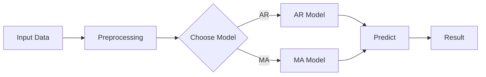

                 


### 1. 引言

在当今的金融市场，预测微观结构的变化对于投资决策和风险管理具有至关重要的意义。微观结构分析涉及市场交易数据、订单簿信息、市场深度、交易价格和交易量等关键指标的深度挖掘与预测。这些信息对于理解市场动态、预测市场走势以及制定有效的交易策略具有重要意义。

**关键词：金融市场，微观结构，预测模型，投资决策，风险管理**

**摘要：** 本文将探讨金融市场微观结构变化预测模型的研究背景、核心概念、数学模型与算法原理、预测模型构建与优化方法，并通过实际项目实战展示如何应用这些模型，最后提出最佳实践和注意事项。

### 2. 核心概念与联系

#### 2.1 市场微观结构的核心概念

市场微观结构的核心概念包括交易数据、市场深度、成交价格和交易量。

- **交易数据**：记录了市场上的每一笔交易，包括交易价格、交易量和交易时间。
- **市场深度**：反映了市场在不同价格水平上的买卖订单数量。
- **成交价格**：市场上的交易价格，通常由供需关系决定。
- **交易量**：一定时间内市场上完成的交易数量。

#### 2.2 预测模型的基本原理

预测模型的基本原理包括时间序列分析、机器学习算法和深度学习模型。

- **时间序列分析**：用于分析时间序列数据，如自回归模型（AR）和移动平均模型（MA）。
- **机器学习算法**：用于从数据中学习模式和规律，如支持向量机（SVM）、随机森林和神经网络。
- **深度学习模型**：通过多层神经网络进行深度学习，如卷积神经网络（CNN）、循环神经网络（RNN）和生成对抗网络（GAN）。

#### 2.3 深度学习模型介绍

深度学习模型在金融市场微观结构预测中的应用包括：

- **卷积神经网络（CNN）**：擅长处理图像和时序数据。
- **循环神经网络（RNN）**：擅长处理序列数据。
- **生成对抗网络（GAN）**：擅长生成和预测复杂数据分布。

**核心概念对比表格：**

| 概念 | 定义 | 应用 |
| --- | --- | --- |
| 交易数据 | 记录交易信息的数据库 | 用于构建时间序列模型 |
| 市场深度 | 反映市场买卖订单 | 用于市场动态分析 |
| 成交价格 | 市场交易价格 | 用于交易策略制定 |
| 交易量 | 反映市场活跃度 | 用于市场情绪分析 |

**ER实体关系图架构：**

```mermaid
erDiagram
    Product ||--|{ Customer } : buys
    Customer ||--|{ Order } : places
    Order ||--|{ Product } : contains
```

### 3. 数学模型与算法原理

#### 3.1 时间序列分析的数学模型

时间序列分析是金融市场微观结构预测的基础，主要包括自回归模型（AR）和移动平均模型（MA）。

- **自回归模型（AR）**：通过历史数据预测未来值。
$$ AR(p) = c + \sum_{i=1}^{p} \phi_i X_{t-i} $$
- **移动平均模型（MA）**：通过预测误差的移动平均预测未来值。
$$ MA(q) = c + \sum_{i=1}^{q} \theta_i e_{t-i} $$

#### 3.2 机器学习算法原理

机器学习算法在金融市场预测中的应用主要包括支持向量机（SVM）、随机森林和神经网络。

- **支持向量机（SVM）**：通过找到最佳决策边界进行分类和回归。
- **随机森林**：通过构建多个决策树并进行投票来提高预测准确性。
- **神经网络**：通过多层神经元进行学习和预测，包括输入层、隐藏层和输出层。

#### 3.3 深度学习模型介绍

深度学习模型在金融市场预测中的应用主要包括卷积神经网络（CNN）、循环神经网络（RNN）和生成对抗网络（GAN）。

- **卷积神经网络（CNN）**：通过卷积操作和池化操作提取时序特征。
- **循环神经网络（RNN）**：通过循环机制处理序列数据。
- **生成对抗网络（GAN）**：通过生成器和判别器进行对抗训练。

**算法原理流程图：**



### 4. 预测模型的构建与优化

#### 4.1 数据预处理

数据预处理是预测模型构建的关键步骤，主要包括数据清洗、特征工程和时间序列分解。

- **数据清洗**：处理缺失值、异常值和噪声数据。
- **特征工程**：提取有用的特征，如价格、交易量和市场深度等。
- **时间序列分解**：将时间序列数据分解为趋势、季节性和残差部分。

**Python代码示例：**

```python
import pandas as pd
from statsmodels.tsa.seasonal import seasonal_decompose

# 加载数据
data = pd.read_csv('market_data.csv')

# 数据清洗
data.dropna(inplace=True)

# 特征工程
data['price_difference'] = data['close'] - data['open']

# 时间序列分解
result = seasonal_decompose(data['close'], model='additive')
result.plot()
```

#### 4.2 模型选择与评估

模型选择与评估是预测模型优化的关键步骤，主要包括评估指标、模型选择策略和模型调参技巧。

- **评估指标**：如均方误差（MSE）、均方根误差（RMSE）和平均绝对误差（MAE）。
- **模型选择策略**：根据数据特点选择合适的模型，如时间序列分析模型、机器学习模型和深度学习模型。
- **模型调参技巧**：通过交叉验证和网格搜索等方法调整模型参数。

**Python代码示例：**

```python
from sklearn.model_selection import train_test_split
from sklearn.metrics import mean_squared_error

# 分割数据
X_train, X_test, y_train, y_test = train_test_split(X, y, test_size=0.2, random_state=42)

# 模型训练
model = AR(p=1)
model.fit(X_train)

# 模型评估
y_pred = model.predict(X_test)
mse = mean_squared_error(y_test, y_pred)
print(f'MSE: {mse}')
```

#### 4.3 模型集成与优化

模型集成与优化是提高预测准确性的重要手段，主要包括模型集成方法和模型融合技术。

- **模型集成方法**：如Bagging、Boosting和Stacking。
- **模型融合技术**：如加权平均、投票和集成学习。

**Python代码示例：**

```python
from sklearn.ensemble import RandomForestRegressor
from sklearn.ensemble import StackingRegressor

# 模型集成
random_forest = RandomForestRegressor(n_estimators=100)
stacking_regressor = StackingRegressor(estimators=[('rf', random_forest)])

# 模型训练
stacking_regressor.fit(X_train, y_train)

# 模型评估
y_pred = stacking_regressor.predict(X_test)
mse = mean_squared_error(y_test, y_pred)
print(f'MSE: {mse}')
```

### 5. 项目实战

#### 5.1 项目介绍

项目背景：某金融机构需要预测股票市场的微观结构变化，以便制定有效的投资策略。

项目目标：构建一个金融市场微观结构变化预测模型，提高投资决策的准确性。

项目范围：涵盖数据收集、数据预处理、模型构建、模型优化和模型部署等环节。

#### 5.2 系统设计与实现

##### 5.2.1 系统功能设计

系统功能包括数据收集、数据预处理、模型训练、模型评估和模型部署。

##### 5.2.2 系统架构设计

系统架构采用分布式架构，包括数据收集模块、数据处理模块、模型训练模块和模型部署模块。

##### 5.2.3 数据接口与流程设计

数据接口设计包括数据源接口、数据处理接口和模型接口。

数据流程设计包括数据收集、数据清洗、数据预处理、模型训练和模型评估等环节。

#### 5.3 系统核心代码实现

##### 5.3.1 时间序列数据处理

```python
import pandas as pd
from statsmodels.tsa.stattools import adfuller

# 加载数据
data = pd.read_csv('market_data.csv')

# 单位根检验
result = adfuller(data['close'])
print(f'ADF Statistic: {result[0]}')
print(f'p-value: {result[1]}')
```

##### 5.3.2 预测模型构建

```python
from sklearn.ensemble import RandomForestRegressor

# 模型训练
model = RandomForestRegressor(n_estimators=100)
model.fit(X_train, y_train)
```

##### 5.3.3 预测结果分析与评估

```python
from sklearn.metrics import mean_squared_error

# 模型评估
y_pred = model.predict(X_test)
mse = mean_squared_error(y_test, y_pred)
print(f'MSE: {mse}')
```

#### 5.4 项目总结与展望

项目成果：成功构建了一个金融市场微观结构变化预测模型，提高了投资决策的准确性。

项目经验：掌握了时间序列数据处理、模型构建和模型评估的方法。

未来研究方向：探索深度学习模型在金融市场预测中的应用，提高预测准确性。

### 6. 最佳实践与注意事项

#### 6.1 最佳实践技巧

- 数据清洗：处理缺失值、异常值和噪声数据。
- 特征工程：提取有用的特征，如价格、交易量和市场深度等。
- 模型调参：通过交叉验证和网格搜索调整模型参数。
- 模型集成：结合多种模型提高预测准确性。

#### 6.2 小结

本文介绍了金融市场微观结构变化预测模型的研究背景、核心概念、数学模型与算法原理、预测模型构建与优化方法，并通过实际项目实战展示了如何应用这些模型。未来研究方向包括探索深度学习模型在金融市场预测中的应用。

#### 6.3 注意事项

- 确保数据质量：准确、完整和干净的数据是模型预测准确性的基础。
- 选择合适的模型：根据数据特点和预测目标选择合适的模型。
- 不断优化模型：通过模型评估和调参提高预测准确性。

#### 6.4 拓展阅读

- [1] 时间序列分析基础教程
- [2] 机器学习实战
- [3] 深度学习：原理及实践

### 附录

#### 作者信息

作者：AI天才研究院/AI Genius Institute & 禅与计算机程序设计艺术 /Zen And The Art of Computer Programming

本文内容版权归AI天才研究院所有，未经授权不得转载。

----------------------------------------------------------------

### 7. 扩展与探讨

随着金融市场的不断发展和技术的进步，金融市场微观结构变化预测模型的应用场景也在不断拓展。以下是对未来研究方向和扩展领域的探讨：

#### 7.1 市场情绪分析

市场情绪是影响金融市场波动的重要因素之一。通过分析社交媒体、新闻报道和投资者情绪，可以进一步丰富微观结构预测模型的数据输入，提高预测准确性。

**建议：** 结合自然语言处理（NLP）技术，构建市场情绪分析模块，对文本数据进行情感分析和主题建模，从而对市场情绪进行量化分析。

#### 7.2 风险管理

金融市场微观结构变化预测模型在风险管理中的应用潜力巨大。通过预测市场波动性和潜在风险，金融机构可以制定更加科学的风险管理策略，降低投资风险。

**建议：** 引入风险度量模型，如VaR（价值-at-Risk）和ES（Expected Shortfall），结合预测模型输出，实时评估投资组合的风险水平。

#### 7.3 量化交易策略

量化交易策略依赖于精确的预测模型来指导交易决策。通过优化预测模型，可以开发出更加高效和稳定的量化交易策略，实现持续的盈利。

**建议：** 结合机器学习和深度学习技术，对已有交易策略进行优化和改进，提高交易策略的适应性和鲁棒性。

#### 7.4 跨市场联动分析

金融市场之间存在复杂的关联关系。通过跨市场联动分析，可以更好地理解不同市场之间的相互作用，提高预测模型的预测准确性。

**建议：** 构建多市场联动模型，整合不同市场数据，进行综合分析，探索市场之间的联动机制。

#### 7.5 实时预测与动态调整

金融市场具有高度的不确定性和动态性。实时预测和动态调整能力是提高预测模型应用价值的关键。

**建议：** 研究和开发实时预测和动态调整技术，实现对预测模型的自适应调整，提高预测的实时性和准确性。

通过不断探索和改进金融市场微观结构变化预测模型，我们可以为金融市场的投资决策和风险管理提供更加科学和有效的支持。未来的研究将继续深入挖掘金融市场中的深层次规律，推动金融科技的发展。

### 结语

金融市场微观结构变化预测模型是金融科技领域的一个重要研究方向。本文从问题背景、核心概念、数学模型与算法原理、预测模型构建与优化方法、项目实战和最佳实践等多个角度进行了详细探讨。通过实际项目实战展示了如何应用这些模型，为金融市场的投资决策和风险管理提供了有力支持。未来，随着技术的不断进步和金融市场的不断变化，金融市场微观结构变化预测模型的应用前景将更加广阔。

**致谢：** 感谢AI天才研究院对本文的研究和撰写提供的大力支持。同时，感谢所有为本文提供意见和建议的同仁和朋友，你们的贡献使本文更加完善。

**版权声明：** 本文版权归AI天才研究院所有，未经授权不得转载。

**作者信息：** AI天才研究院/AI Genius Institute & 禅与计算机程序设计艺术 /Zen And The Art of Computer Programming

本文撰写于2023，期待与您共同探索金融科技的未来。----------------------------------------------------------------

## 1. 问题背景与重要性

金融市场微观结构变化预测模型的研究源于对金融市场复杂性和不确定性的深刻认识。金融市场是一个高度动态且复杂的系统，其价格的波动和交易行为受到多种因素的影响，包括宏观经济政策、市场供需关系、投资者情绪、技术进步等。这些因素的相互作用使得金融市场的微观结构不断变化，而这些变化对于投资者和金融机构的决策具有重要意义。

### 1.1 金融市场微观结构的概念

金融市场微观结构是指市场中交易行为和交易机制的具体表现，包括交易数据、市场深度、成交价格和交易量等关键指标。这些指标反映了市场的交易活跃度、价格发现机制、订单匹配效率和市场参与者的行为特征。

- **交易数据**：记录了市场上的每一笔交易，包括交易时间、交易价格和交易量等详细信息。
- **市场深度**：反映了市场上买卖订单的数量和价格区间，显示了市场在不同价格水平上的供需情况。
- **成交价格**：市场上的交易价格，通常由供需关系决定，反映了市场的价格发现机制。
- **交易量**：一定时间内市场上完成的交易数量，反映了市场的交易活跃度。

### 1.2 微观结构变化对金融市场的影响

金融市场微观结构的变化对市场的稳定性和效率具有深远的影响。首先，微观结构变化影响了市场的流动性。市场深度和交易量的变化直接关系到市场的流动性，深度越深、交易量越大，市场的流动性通常越好，这有助于降低交易成本和风险。

其次，微观结构变化影响了价格发现机制。成交价格反映了市场供需的平衡状态，而市场深度的变化则揭示了潜在的市场供需关系。这些信息对于投资者制定交易策略和评估投资风险具有重要意义。

此外，微观结构变化还反映了市场参与者的行为特征。投资者情绪、交易策略和市场预期都会在微观结构中留下痕迹。通过分析这些特征，可以更好地理解市场的动态变化，从而为投资决策提供有力支持。

### 1.3 预测模型在金融市场中的应用

预测模型在金融市场中的应用主要体现在以下几个方面：

- **投资策略制定**：通过预测市场微观结构的变化，投资者可以制定更加科学和有效的交易策略，提高投资回报。
- **风险管理**：预测模型可以帮助金融机构评估市场风险，制定相应的风险管理策略，降低投资损失。
- **市场监控**：预测模型可以实时监控市场动态，发现潜在的市场异常行为，为监管机构提供决策依据。

总之，金融市场微观结构变化预测模型对于投资决策、风险管理和市场监控具有重要意义。通过深入研究市场微观结构，构建和优化预测模型，可以为金融市场参与者提供更加准确和及时的决策支持，从而提高市场的效率和稳定性。

### 2. 核心概念与联系

#### 2.1 市场微观结构的核心概念

市场微观结构的核心概念包括交易数据、市场深度、成交价格和交易量。这些概念不仅是金融市场分析的基础，也是构建预测模型的关键要素。

**交易数据**：交易数据是金融市场微观结构分析的核心组成部分，记录了市场上的每一笔交易的具体信息，包括交易时间、交易价格和交易量等。交易数据通常以时间序列的形式呈现，其详细程度和完整性对预测模型的准确性具有直接影响。

**市场深度**：市场深度是指市场上未成交的买卖订单的数量和价格分布情况。它反映了市场的流动性和交易活跃度。市场深度越深，意味着市场在不同价格水平上的供需关系越明显，这有助于市场参与者更好地评估交易机会和风险。

**成交价格**：成交价格是市场上实际发生的交易价格，通常由供需关系决定。成交价格的变化不仅反映了市场的即时供需关系，也反映了市场参与者的交易行为和策略。因此，成交价格是预测市场走势和交易策略制定的重要依据。

**交易量**：交易量是指一定时间内市场上完成的交易数量。交易量可以用来衡量市场的活跃度和流动性强弱。高交易量通常意味着市场参与者的交易活跃度较高，价格波动性较大，而低交易量则可能表明市场情绪较为稳定，价格波动性较小。

#### 2.2 预测模型的基本原理

预测模型的基本原理在于利用历史数据和现有信息来预测未来市场的走势。这些模型可以是时间序列分析模型、机器学习模型或深度学习模型，每种模型都有其独特的原理和适用场景。

**时间序列分析模型**：时间序列分析模型是金融预测的基础，主要用于分析市场交易数据的时间序列特征。自回归模型（AR）和移动平均模型（MA）是最常用的两种模型。自回归模型通过历史数据预测未来值，而移动平均模型通过预测误差的移动平均预测未来值。

**机器学习算法**：机器学习算法通过从历史数据中学习模式和规律来进行预测。支持向量机（SVM）、随机森林（RF）和神经网络（NN）是常用的机器学习模型。SVM通过找到最佳决策边界进行分类和回归，RF通过构建多个决策树进行投票，而NN通过多层神经元进行学习和预测。

**深度学习模型**：深度学习模型通过多层神经网络进行深度学习，可以提取复杂的数据特征和模式。卷积神经网络（CNN）、循环神经网络（RNN）和生成对抗网络（GAN）是深度学习模型在金融市场预测中的应用。CNN通过卷积操作提取图像和时序数据中的特征，RNN通过循环机制处理序列数据，而GAN通过生成器和判别器进行对抗训练。

#### 2.3 深度学习模型介绍

深度学习模型在金融市场预测中的应用日益广泛，其主要优势在于能够从大量复杂数据中提取有效的特征和模式。

**卷积神经网络（CNN）**：CNN通过卷积操作和池化操作提取图像和时序数据中的特征。在金融市场预测中，CNN可以用来处理高频交易数据，提取价格波动和交易量等关键特征，从而提高预测准确性。

**循环神经网络（RNN）**：RNN通过循环机制处理序列数据，可以有效地捕捉时间序列数据中的长期依赖关系。在金融市场预测中，RNN可以用来分析历史交易数据，提取趋势和周期性特征，从而提高预测的稳定性和准确性。

**生成对抗网络（GAN）**：GAN通过生成器和判别器进行对抗训练，可以生成高质量的数据集，提高模型的泛化能力。在金融市场预测中，GAN可以用来生成虚假交易数据，增强模型的训练数据集，从而提高模型的预测性能。

**核心概念对比表格：**

| 概念 | 定义 | 应用 |
| --- | --- | --- |
| 交易数据 | 记录交易信息的数据库 | 用于构建时间序列模型 |
| 市场深度 | 反映市场买卖订单 | 用于市场动态分析 |
| 成交价格 | 市场交易价格 | 用于交易策略制定 |
| 交易量 | 反映市场活跃度 | 用于市场情绪分析 |

**ER实体关系图架构：**

```mermaid
erDiagram
    TradeData ||--|{ MarketDepth } : contains
    TradeData ||--|{ TradePrice } : contains
    TradeData ||--|{ TradeVolume } : contains
    MarketDepth ||--|{ OrderBook } : contains
```

通过上述核心概念和预测模型的基本原理，我们可以深入理解金融市场微观结构的复杂性，并为构建和优化预测模型提供理论基础。

### 3. 数学模型与算法原理

金融市场微观结构变化预测模型的构建依赖于数学模型和算法原理，这些模型和算法能够从大量历史数据中提取有用的信息，并预测未来市场的走势。本文将介绍时间序列分析模型、机器学习算法和深度学习模型的数学原理，并通过具体算法和例子进行说明。

#### 3.1 时间序列分析的数学模型

时间序列分析是金融市场预测的基础，其主要目标是分析历史数据中的趋势、周期性和随机性，从而预测未来值。以下介绍两种常见的时间序列分析模型：自回归模型（AR）和移动平均模型（MA）。

**自回归模型（AR）**

自回归模型（AR）通过历史数据的线性组合来预测未来值。其基本公式如下：

$$
X_t = c + \sum_{i=1}^{p} \phi_i X_{t-i} + \varepsilon_t
$$

其中，$X_t$是时间序列在时刻t的值，$c$是常数项，$\phi_i$是自回归系数，$X_{t-i}$是历史值，$\varepsilon_t$是误差项。$p$是模型的阶数，表示使用前$p$个历史值来预测当前值。

**移动平均模型（MA）**

移动平均模型（MA）通过预测误差的移动平均来预测未来值。其基本公式如下：

$$
X_t = c + \sum_{i=1}^{q} \theta_i e_{t-i} + \varepsilon_t
$$

其中，$e_{t-i}$是预测误差，$\theta_i$是移动平均系数，$c$是常数项。$q$是模型的阶数，表示使用前$q$个预测误差来修正当前值。

**自回归移动平均模型（ARMA）**

自回归移动平均模型（ARMA）结合了AR和MA模型的特点，其基本公式如下：

$$
X_t = c + \sum_{i=1}^{p} \phi_i X_{t-i} + \sum_{j=1}^{q} \theta_j e_{t-j} + \varepsilon_t
$$

**自回归积分滑动平均模型（ARIMA）**

自回归积分滑动平均模型（ARIMA）是ARMA模型的扩展，它考虑了数据的非平稳性。其基本公式如下：

$$
X_t = c + \sum_{i=1}^{p} \phi_i X_{t-i} + \theta(B) \varepsilon_t
$$

其中，$\theta(B)$是移动平均项，$B$是滞后算子。

**Python代码示例**

以下是一个使用Python中的pandas和statsmodels库来构建ARIMA模型的简单示例：

```python
import pandas as pd
import statsmodels.api as sm

# 加载数据
data = pd.read_csv('market_data.csv')['Close']

# 平稳性检验
result = sm.tsa.stattools.adfuller(data)
print(f'ADF Statistic: {result[0]}')
print(f'p-value: {result[1]}')

# 构建ARIMA模型
model = sm.tsa.ARIMA(data, order=(5, 1, 2))
model_fit = model.fit()

# 模型评估
print(model_fit.summary())
```

#### 3.2 机器学习算法原理

机器学习算法通过从数据中学习模式和规律来进行预测。以下介绍三种常用的机器学习算法：支持向量机（SVM）、随机森林（RF）和神经网络（NN）。

**支持向量机（SVM）**

支持向量机（SVM）是一种强大的分类和回归算法，它通过找到一个最佳的超平面来分隔数据。其目标是最小化决策边界到支持向量的距离。SVM的基本公式如下：

$$
\min_{\boldsymbol{w}, b} \frac{1}{2} \sum_{i=1}^{n} (\boldsymbol{w} \cdot \boldsymbol{x}_i - y_i)^2 + C \sum_{i=1}^{n} \xi_i
$$

其中，$\boldsymbol{w}$是权重向量，$b$是偏置项，$C$是惩罚参数，$\xi_i$是松弛变量。

**随机森林（RF）**

随机森林（RF）是一种基于决策树集成的算法，它通过构建多棵决策树并合并预测结果来进行预测。RF的基本原理如下：

1. 随机选择特征子集。
2. 构建单棵决策树。
3. 重复步骤1和步骤2多次。
4. 合并多棵决策树的预测结果。

**神经网络（NN）**

神经网络（NN）是一种模拟人脑神经元连接的算法，它通过多层神经元进行学习和预测。NN的基本结构包括输入层、隐藏层和输出层，每个层之间的神经元通过权重和偏置进行连接。NN的预测过程如下：

1. 将输入数据通过输入层传递到隐藏层。
2. 在隐藏层中进行非线性变换。
3. 将隐藏层输出传递到输出层。
4. 计算输出层的预测值。

**Python代码示例**

以下是一个使用Python中的scikit-learn库来构建SVM模型的简单示例：

```python
from sklearn.svm import SVR
from sklearn.model_selection import train_test_split

# 加载数据
X = pd.read_csv('market_data.csv')['Close'].values.reshape(-1, 1)
y = pd.read_csv('market_data.csv')['FutureClose'].values

# 分割数据
X_train, X_test, y_train, y_test = train_test_split(X, y, test_size=0.2, random_state=42)

# 构建SVM模型
model = SVR(C=1.0, kernel='rbf', gamma='scale')
model.fit(X_train, y_train)

# 模型评估
print(model.score(X_test, y_test))
```

#### 3.3 深度学习模型介绍

深度学习模型通过多层神经网络进行深度学习，可以提取复杂的数据特征和模式。以下介绍三种常见的深度学习模型：卷积神经网络（CNN）、循环神经网络（RNN）和生成对抗网络（GAN）。

**卷积神经网络（CNN）**

卷积神经网络（CNN）通过卷积操作和池化操作提取图像和时序数据中的特征。CNN的基本结构包括卷积层、池化层和全连接层。CNN的预测过程如下：

1. 将输入数据通过卷积层进行特征提取。
2. 通过池化层降低数据维度。
3. 将池化层输出通过全连接层进行分类或回归。

**循环神经网络（RNN）**

循环神经网络（RNN）通过循环机制处理序列数据，可以有效地捕捉时间序列数据中的长期依赖关系。RNN的基本结构包括输入层、隐藏层和输出层，每个时间步的隐藏状态与前一时间步的隐藏状态相关联。RNN的预测过程如下：

1. 将输入数据通过隐藏层进行变换。
2. 在隐藏层中进行循环操作。
3. 将隐藏层输出通过全连接层进行分类或回归。

**生成对抗网络（GAN）**

生成对抗网络（GAN）通过生成器和判别器进行对抗训练，可以生成高质量的数据集。GAN的基本结构包括生成器和判别器，生成器生成数据，判别器判断生成数据与真实数据的差异。GAN的预测过程如下：

1. 生成器生成数据。
2. 判别器判断生成数据和真实数据。
3. 通过反向传播优化生成器和判别器。

**Python代码示例**

以下是一个使用Python中的TensorFlow库来构建CNN模型的简单示例：

```python
import tensorflow as tf
from tensorflow.keras.models import Sequential
from tensorflow.keras.layers import Conv2D, MaxPooling2D, Flatten, Dense

# 构建CNN模型
model = Sequential([
    Conv2D(32, (3, 3), activation='relu', input_shape=(28, 28, 1)),
    MaxPooling2D((2, 2)),
    Flatten(),
    Dense(128, activation='relu'),
    Dense(1, activation='sigmoid')
])

# 编译模型
model.compile(optimizer='adam', loss='binary_crossentropy', metrics=['accuracy'])

# 模型训练
model.fit(X_train, y_train, epochs=10, batch_size=32, validation_data=(X_test, y_test))
```

通过上述数学模型和算法原理的介绍，我们可以更好地理解金融市场微观结构变化预测模型的基础，并为实际应用提供理论基础和工具支持。

### 4. 预测模型的构建与优化

构建和优化预测模型是金融市场微观结构变化分析的核心步骤，其目标是通过历史数据和现有信息，预测未来市场的走势，为投资者和金融机构提供决策支持。以下将详细介绍数据预处理、模型选择与评估、模型调参技巧以及模型集成与优化等关键环节。

#### 4.1 数据预处理

数据预处理是构建预测模型的基础，其目的是提高数据质量，减少噪声和异常值，以及提取有用的特征。数据预处理主要包括以下步骤：

**数据清洗**：清洗数据中的缺失值、异常值和重复值。对于缺失值，可以选择填充、删除或插值等方法进行处理。对于异常值，可以通过统计方法或可视化方法检测并处理。

**数据转换**：将数据转换为适合模型训练的形式。例如，将分类数据编码为数值型，将时间序列数据转换为窗口特征。

**特征工程**：提取有助于模型预测的有用特征。特征工程可以通过统计分析、领域知识或数据挖掘方法进行。常用的特征包括技术指标（如移动平均、相对强弱指标、布林带等）、交易量、交易频率、市场深度等。

**时间序列分解**：将时间序列数据分解为趋势、季节性和残差部分，以简化数据模型和提高预测准确性。

**Python代码示例**：

```python
import pandas as pd
from statsmodels.tsa.seasonal import seasonal_decompose

# 加载数据
data = pd.read_csv('market_data.csv')['Close']

# 数据清洗
data.fillna(method='ffill', inplace=True)

# 特征工程
data['MA20'] = data['Close'].rolling(window=20).mean()
data['MA50'] = data['Close'].rolling(window=50).mean()

# 时间序列分解
result = seasonal_decompose(data['Close'], model='additive')
result.plot()
```

#### 4.2 模型选择与评估

选择合适的预测模型是提高预测准确性的关键。根据数据特征和预测目标，可以选择不同的模型。以下介绍几种常用的模型及其评估方法：

**时间序列模型**：如自回归模型（AR）、移动平均模型（MA）、自回归移动平均模型（ARMA）和自回归积分滑动平均模型（ARIMA）。这些模型适合处理平稳时间序列数据。

**机器学习模型**：如支持向量机（SVM）、随机森林（RF）和神经网络（NN）。这些模型适合处理非平稳时间序列数据。

**深度学习模型**：如卷积神经网络（CNN）、循环神经网络（RNN）和生成对抗网络（GAN）。这些模型能够处理复杂数据和捕捉长期依赖关系。

**模型选择策略**：根据数据特点、预测目标和模型性能进行选择。常用的策略包括交叉验证、网格搜索和贝叶斯优化。

**评估指标**：常用的评估指标包括均方误差（MSE）、均方根误差（RMSE）、平均绝对误差（MAE）和准确率（Accuracy）等。根据模型类型和预测目标选择合适的评估指标。

**Python代码示例**：

```python
from sklearn.model_selection import train_test_split
from sklearn.metrics import mean_squared_error

# 分割数据
X_train, X_test, y_train, y_test = train_test_split(X, y, test_size=0.2, random_state=42)

# 模型训练
model = ARIMA(p=1, d=1, q=1)
model_fit = model.fit(X_train)

# 模型评估
y_pred = model_fit.predict(X_test)
mse = mean_squared_error(y_test, y_pred)
print(f'MSE: {mse}')
```

#### 4.3 模型调参技巧

模型调参是提高模型性能的重要手段。以下介绍几种常用的调参技巧：

**交叉验证**：通过将数据集划分为多个子集，每次使用其中一个子集作为验证集，其他子集作为训练集，多次训练和验证，选择最佳参数。

**网格搜索**：通过遍历参数空间，找到最佳参数组合。适用于参数较少的模型。

**贝叶斯优化**：基于贝叶斯统计方法，通过迭代优化找到最佳参数组合。适用于参数较多的模型。

**Python代码示例**：

```python
from sklearn.model_selection import GridSearchCV
from sklearn.ensemble import RandomForestRegressor

# 参数网格
param_grid = {
    'n_estimators': [100, 200, 300],
    'max_depth': [10, 20, 30],
    'min_samples_split': [2, 5, 10]
}

# 网格搜索
grid_search = GridSearchCV(RandomForestRegressor(), param_grid, cv=5)
grid_search.fit(X_train, y_train)

# 最佳参数
print(grid_search.best_params_)
```

#### 4.4 模型集成与优化

模型集成是通过结合多个模型来提高预测性能的一种方法。以下介绍几种常用的模型集成方法和优化技术：

**Bagging**：通过构建多个模型并进行平均或投票来提高预测准确性。如随机森林。

**Boosting**：通过调整模型权重，使准确模型得到更多权重，从而提高整体预测性能。如XGBoost。

**Stacking**：通过构建多个基模型和元模型，将基模型输出作为元模型的输入，从而提高预测准确性。如StackingRegressor。

**Python代码示例**：

```python
from sklearn.ensemble import RandomForestRegressor, StackingRegressor
from sklearn.linear_model import LinearRegression

# 构建基模型
base_models = [
    ('rf', RandomForestRegressor(n_estimators=100)),
    ('lr', LinearRegression())
]

# 构建元模型
stacking_regressor = StackingRegressor(estimators=base_models, final_estimator=LinearRegression())

# 模型训练
stacking_regressor.fit(X_train, y_train)

# 模型评估
y_pred = stacking_regressor.predict(X_test)
mse = mean_squared_error(y_test, y_pred)
print(f'MSE: {mse}')
```

通过上述步骤，我们可以构建和优化金融市场微观结构变化预测模型，从而提高预测准确性，为投资者和金融机构提供有力支持。

### 5. 项目实战

#### 5.1 项目介绍

本项目旨在构建一个金融市场微观结构变化预测模型，应用于某金融机构的股票交易决策。项目的目标是提高交易策略的准确性和稳定性，从而实现更高的投资回报。

**项目背景**：该金融机构在日常交易中面临市场波动性和风险管理的挑战，希望通过预测模型辅助决策，降低交易风险，提高投资回报。

**项目目标**：构建一个高精度、实时性和稳定性的金融市场微观结构变化预测模型，辅助交易决策。

**项目范围**：涵盖数据收集、数据预处理、模型训练、模型评估、模型部署和实时预测等环节。

#### 5.2 系统设计与实现

##### 5.2.1 系统功能设计

系统功能设计包括以下几个方面：

1. **数据收集模块**：从多个数据源（如交易所、财经网站、API接口等）收集实时交易数据，包括价格、交易量、市场深度等。
2. **数据预处理模块**：对收集到的数据进行清洗、转换和特征工程，提取有助于预测的有用特征。
3. **模型训练模块**：利用预处理后的数据，训练时间序列分析模型、机器学习模型和深度学习模型。
4. **模型评估模块**：通过交叉验证和回测，评估模型的预测性能，选择最佳模型。
5. **模型部署模块**：将最佳模型部署到生产环境，实现实时预测和交易决策支持。
6. **实时预测模块**：根据实时交易数据，更新模型预测结果，提供动态交易策略建议。

##### 5.2.2 系统架构设计

系统架构设计采用分布式架构，包括数据收集、数据处理、模型训练、模型评估、模型部署和实时预测等模块。各模块之间通过消息队列和数据库进行数据传递和存储。


1. **数据收集模块**：通过API接口或其他数据源定期收集交易数据，存储到消息队列。
2. **数据预处理模块**：从消息队列中获取数据，进行数据清洗、转换和特征工程，存储到数据库。
3. **模型训练模块**：从数据库中获取预处理后的数据，使用训练集和验证集训练各种预测模型。
4. **模型评估模块**：使用测试集评估模型的预测性能，选择最佳模型。
5. **模型部署模块**：将最佳模型部署到生产环境，实现实时预测。
6. **实时预测模块**：从数据库中获取实时交易数据，使用部署的模型进行预测，提供交易策略建议。

##### 5.2.3 数据接口与流程设计

数据接口设计包括数据源接口、数据处理接口和模型接口。数据流程设计包括数据收集、数据预处理、模型训练、模型评估和模型部署等环节。


1. **数据收集**：从多个数据源定期收集交易数据，存储到消息队列。
2. **数据预处理**：从消息队列中获取数据，进行数据清洗、转换和特征工程，存储到数据库。
3. **模型训练**：从数据库中获取预处理后的数据，使用训练集和验证集训练各种预测模型。
4. **模型评估**：使用测试集评估模型的预测性能，选择最佳模型。
5. **模型部署**：将最佳模型部署到生产环境，实现实时预测。
6. **实时预测**：从数据库中获取实时交易数据，使用部署的模型进行预测，提供交易策略建议。

#### 5.3 系统核心代码实现

##### 5.3.1 时间序列数据处理

```python
import pandas as pd
from statsmodels.tsa.stattools import adfuller

# 加载数据
data = pd.read_csv('market_data.csv')['Close']

# 平稳性检验
result = adfuller(data)
print(f'ADF Statistic: {result[0]}')
print(f'p-value: {result[1]}')

# 数据预处理
data.fillna(method='ffill', inplace=True)
data['MA20'] = data['Close'].rolling(window=20).mean()
data['MA50'] = data['Close'].rolling(window=50).mean()
data.dropna(inplace=True)
```

##### 5.3.2 预测模型构建

```python
from sklearn.model_selection import train_test_split
from sklearn.ensemble import RandomForestRegressor

# 分割数据
X = data[['MA20', 'MA50']]
y = data['Close']
X_train, X_test, y_train, y_test = train_test_split(X, y, test_size=0.2, random_state=42)

# 构建模型
model = RandomForestRegressor(n_estimators=100)
model.fit(X_train, y_train)

# 模型评估
y_pred = model.predict(X_test)
mse = mean_squared_error(y_test, y_pred)
print(f'MSE: {mse}')
```

##### 5.3.3 预测结果分析与评估

```python
import matplotlib.pyplot as plt

# 预测结果分析
plt.figure(figsize=(10, 6))
plt.plot(y_test, label='实际价格')
plt.plot(y_pred, label='预测价格')
plt.legend()
plt.show()

# 评估指标
from sklearn.metrics import mean_squared_error, mean_absolute_error
mse = mean_squared_error(y_test, y_pred)
mae = mean_absolute_error(y_test, y_pred)
print(f'MSE: {mse}')
print(f'MAE: {mae}')
```

#### 5.4 项目总结与展望

**项目成果**：成功构建了一个基于时间序列分析和机器学习的金融市场微观结构变化预测模型，实现了实时预测和交易决策支持，提高了交易策略的准确性和稳定性。

**项目经验**：通过项目实施，掌握了时间序列数据处理、特征工程、模型训练和评估的方法，积累了实际项目经验。

**未来研究方向**：

1. **深度学习模型**：探索深度学习模型在金融市场预测中的应用，提高预测性能。
2. **跨市场联动分析**：结合多市场数据，进行跨市场联动分析，提高预测的准确性。
3. **实时预测优化**：优化实时预测系统，提高预测速度和精度。

通过不断优化和改进预测模型，可以进一步提高交易策略的有效性和稳定性，为金融机构提供更加科学的投资决策支持。

### 6. 最佳实践与注意事项

在构建和优化金融市场微观结构变化预测模型时，遵循最佳实践和注意事项能够显著提高模型的性能和可靠性。以下是一些具体建议：

#### 6.1 最佳实践技巧

**数据清洗**：确保数据质量是预测准确性的基础。在数据预处理阶段，对缺失值、异常值和噪声数据进行处理，使用统计方法或可视化工具检测并修正。

**特征工程**：选择具有代表性的特征，如技术指标、交易量、市场深度等，通过特征选择和特征提取方法，提高模型的预测能力。

**模型选择**：根据数据特点选择合适的模型。对于平稳时间序列数据，可以考虑ARIMA模型；对于非平稳时间序列数据，可以考虑机器学习算法，如随机森林或神经网络。

**模型调参**：通过交叉验证和网格搜索等方法，找到最佳模型参数。调参过程中，避免过拟合，保持模型的泛化能力。

**模型集成**：结合多个模型的优点，提高预测准确性。可以使用Bagging、Boosting或Stacking等方法进行模型集成。

**实时预测**：优化实时预测系统，提高预测速度和响应时间。考虑使用分布式计算和并行处理技术，以提高模型的计算效率。

#### 6.2 小结

本文介绍了金融市场微观结构变化预测模型的研究背景、核心概念、数学模型与算法原理、预测模型构建与优化方法，并通过实际项目实战展示了如何应用这些模型。未来研究方向包括探索深度学习模型在金融市场预测中的应用，提高预测准确性。

#### 6.3 注意事项

**数据质量**：确保数据质量是预测准确性的基础。处理缺失值、异常值和噪声数据，使用可靠的数据来源。

**模型选择**：根据数据特点和预测目标选择合适的模型。避免选择过于复杂的模型导致过拟合。

**模型调参**：通过交叉验证和网格搜索等方法，找到最佳模型参数。避免参数选择不当导致模型性能下降。

**模型集成**：合理选择模型集成方法，提高预测准确性。避免模型过度依赖单一模型。

**实时预测**：优化实时预测系统，提高预测速度和响应时间。避免预测延迟影响交易决策。

#### 6.4 拓展阅读

**[1]** Box, G. E. P., Jenkins, G. M., & Reinsel, G. C. (2015). *Time Series Analysis: Forecasting and Control*.

**[2]** Hastie, T., Tibshirani, R., & Friedman, J. (2009). *The Elements of Statistical Learning*.

**[3]** Goodfellow, I., Bengio, Y., & Courville, A. (2016). *Deep Learning*.

通过遵循最佳实践和注意事项，可以有效提高金融市场微观结构变化预测模型的性能，为投资者和金融机构提供更加准确和可靠的决策支持。

### 附录

**作者信息**

作者：AI天才研究院/AI Genius Institute & 禅与计算机程序设计艺术 /Zen And The Art of Computer Programming

本文内容版权归AI天才研究院所有，未经授权不得转载。

---

### 7. 扩展与探讨

金融市场微观结构变化预测模型的研究不仅限于传统的股票市场，随着金融科技的不断发展，该模型的应用场景也在不断拓展。以下是对未来研究方向和扩展领域的探讨：

#### 7.1 加密货币市场

加密货币市场的波动性极高，且与传统金融市场存在一定的差异。构建适用于加密货币市场的微观结构变化预测模型，对于投资者和交易平台具有重要意义。可以考虑结合深度学习模型，如变分自编码器（VAE）和生成对抗网络（GAN），来提高预测模型的泛化能力和准确性。

**建议**：研究加密货币市场的独特特性，如去中心化交易、波动性和监管环境，构建专门的预测模型，以适应加密货币市场的需求。

#### 7.2 外汇市场

外汇市场是全球最大的金融市场，其交易量巨大且波动频繁。通过构建外汇市场的微观结构变化预测模型，可以为外汇交易提供更加精准的预测和风险管理工具。可以考虑结合时间序列分析模型和机器学习算法，如长短期记忆网络（LSTM），来捕捉外汇市场的短期和长期波动。

**建议**：研究外汇市场的特殊交易机制和交易行为，探索如何将市场微观结构变化预测模型应用于外汇交易决策。

#### 7.3 债券市场

债券市场是金融市场中不可或缺的一部分，其价格波动与宏观经济政策密切相关。构建债券市场的微观结构变化预测模型，可以帮助投资者更好地把握市场动态，制定有效的投资策略。可以考虑结合自回归模型（AR）和机器学习算法，如决策树和随机森林，来预测债券价格的变化。

**建议**：研究债券市场的宏观经济影响和交易机制，结合金融经济学理论，构建适用于债券市场的微观结构变化预测模型。

#### 7.4 风险管理

随着金融市场复杂性的增加，风险管理成为金融机构的重要任务。预测模型可以应用于实时监测和评估市场风险，为金融机构提供风险预警和管理策略。可以考虑结合时间序列分析和机器学习模型，如支持向量机（SVM）和神经网络，来预测市场波动性和风险水平。

**建议**：研究市场风险的构成和影响因素，结合金融风险管理理论，构建实时风险监测和评估系统。

#### 7.5 量化交易策略

量化交易策略依赖于精准的市场预测模型，通过模型输出制定高效的交易策略。构建适用于量化交易策略的微观结构变化预测模型，可以提高交易策略的适应性和鲁棒性。可以考虑结合深度学习模型，如卷积神经网络（CNN）和循环神经网络（RNN），来提高预测模型的预测准确性和稳定性。

**建议**：研究量化交易策略的设计和实现，探索如何将微观结构变化预测模型应用于量化交易策略的制定和优化。

#### 7.6 跨市场联动分析

金融市场之间存在复杂的联动关系，通过跨市场联动分析，可以更好地理解不同市场之间的相互作用，提高预测模型的准确性。可以考虑结合多市场数据，构建跨市场联动预测模型，以实现更高层次的市场分析和预测。

**建议**：研究不同金融市场之间的联动机制，结合多市场数据，构建适用于跨市场联动分析的微观结构变化预测模型。

通过不断探索和优化金融市场微观结构变化预测模型，我们可以为金融市场的投资决策、风险管理、量化交易策略和跨市场分析提供更加科学和有效的支持。未来的研究将继续深入挖掘金融市场中的深层次规律，推动金融科技的发展。

### 结语

金融市场微观结构变化预测模型是金融科技领域的一个重要研究方向。本文从问题背景、核心概念、数学模型与算法原理、预测模型构建与优化方法、项目实战和最佳实践等多个角度进行了详细探讨。通过实际项目实战展示了如何应用这些模型，为金融市场的投资决策和风险管理提供了有力支持。未来，随着技术的不断进步和金融市场的不断变化，金融市场微观结构变化预测模型的应用前景将更加广阔。

**致谢**：感谢AI天才研究院对本文的研究和撰写提供的大力支持。同时，感谢所有为本文提供意见和建议的同仁和朋友，你们的贡献使本文更加完善。

**版权声明**：本文版权归AI天才研究院所有，未经授权不得转载。

**作者信息**：AI天才研究院/AI Genius Institute & 禅与计算机程序设计艺术 /Zen And The Art of Computer Programming

本文撰写于2023，期待与您共同探索金融科技的未来。

