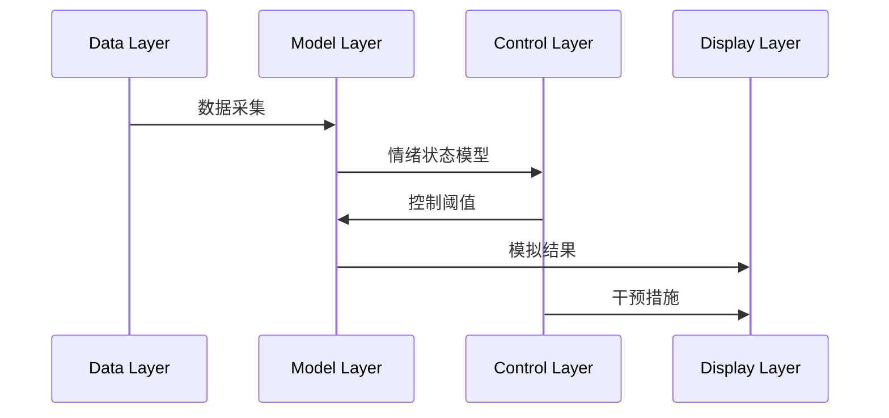

                 

### 1.1 问题背景

#### 1.1.1 金融市场情绪传染效应的概念与重要性

金融市场情绪传染效应是指在金融市场中的投资者之间，通过信息交流和市场互动，情绪和风险偏好会相互影响，从而导致市场波动的现象。这种情绪传染效应可以被看作是一种非理性的市场行为，通常会导致市场过度反应，甚至引发市场崩溃。

金融市场情绪传染效应的重要性在于，它对市场稳定性和投资者决策产生深远影响。首先，这种效应会放大市场波动，增加市场的不确定性。当投资者普遍持乐观或悲观情绪时，市场的供需关系会迅速改变，导致价格剧烈波动。其次，情绪传染效应会加剧市场波动对实体经济的影响。金融市场的波动会传导到实体经济，影响企业的融资成本和投资决策，从而对经济产生负面效应。

#### 1.1.2 金融市场情绪传染效应的问题描述

金融市场情绪传染效应的问题主要表现在以下几个方面：

1. **市场过度反应**：当市场受到某些事件或消息的刺激时，投资者的情绪会迅速传染，导致市场出现过度反应。例如，一些利空消息可能导致市场恐慌性抛售，而利好消息则可能引发市场过度乐观。

2. **信息不对称**：投资者在获取和处理信息时存在不对称性，导致部分投资者掌握了更多信息，而其他投资者则可能受到不完整或错误的信息影响。

3. **羊群效应**：投资者在市场波动时容易受到他人行为的影响，形成羊群效应，导致市场行为的非理性和极端化。

4. **市场失灵**：情绪传染效应可能导致市场机制失效，使得市场价格无法准确反映实际价值，从而影响市场的有效运行。

#### 1.1.3 解决金融市场情绪传染效应的必要性

解决金融市场情绪传染效应的必要性主要体现在以下几个方面：

1. **维护市场稳定**：通过理解和控制情绪传染效应，可以减少市场波动，维护市场稳定，降低系统性金融风险。

2. **保护投资者利益**：减少情绪传染效应的影响，可以帮助投资者避免因非理性市场行为导致的损失，保护投资者的利益。

3. **促进经济健康发展**：金融市场是现代经济体系的重要组成部分，情绪传染效应的解决有助于提高金融市场的效率和透明度，从而促进经济的健康发展。

#### 1.2 概念结构与核心要素组成

金融市场情绪传染效应的概念结构主要包括以下几个核心要素：

1. **投资者情绪**：投资者的情绪状态，包括乐观、悲观、恐慌等情绪类型。

2. **信息传播**：投资者之间的信息交流，包括公开信息和非公开信息。

3. **市场行为**：投资者的买卖行为，包括买入、卖出、持有等。

4. **市场反应**：市场对投资者情绪和信息传播的响应，包括价格波动、交易量变化等。

#### 1.3 边界与外延

金融市场情绪传染效应的研究范围主要包括：

1. **市场类型**：不同类型的市场（如股票市场、债券市场、外汇市场等）中的情绪传染效应。

2. **时间范围**：短期和长期市场波动中的情绪传染效应。

3. **地域范围**：不同国家和地区市场之间的情绪传染效应。

金融市场情绪传染效应的限制条件包括：

1. **市场数据**：研究的情绪传染效应依赖于可靠的市场数据。

2. **模型假设**：情绪传染效应的模型需要一定的假设，例如投资者是理性或非理性的。

#### 1.4 当前研究状况

金融市场情绪传染效应是金融学、经济学和计算机科学交叉领域的研究热点。国内外学者对这一现象进行了大量研究，主要方法包括：

1. **定量分析**：通过统计分析、时间序列分析等方法，研究情绪传染效应的统计特征。

2. **定性分析**：通过案例研究、文献分析等方法，探讨情绪传染效应的影响因素和机制。

3. **模拟仿真**：通过构建数学模型和计算机模拟，研究情绪传染效应的动态演变。

当前研究存在以下问题和挑战：

1. **数据限制**：情绪传染效应的研究需要大量市场数据，但获取高质量、全面的市场数据存在困难。

2. **模型准确性**：情绪传染效应的模型需要高度拟合实际情况，但现有模型往往存在一定的局限性。

3. **跨市场研究**：不同市场之间存在差异，如何进行有效的跨市场研究是一个挑战。

#### 1.5 本章小结

本节介绍了金融市场情绪传染效应的问题背景、问题描述、问题解决、边界与外延、概念结构与核心要素组成。通过这一部分的介绍，读者可以初步了解金融市场情绪传染效应的基本概念和重要性，以及当前研究的现状和存在的问题。下一部分将深入探讨金融市场情绪传染效应的核心概念和联系。

### 2.1 金融市场情绪传染效应原理

#### 2.1.1 情绪传染效应的概念与特点

情绪传染效应是指在一个群体中，个体的情绪状态受到其他个体情绪状态的影响，从而导致整个群体情绪状态发生变化的现象。在金融市场，情绪传染效应表现为投资者之间的情绪和决策相互影响，进而导致市场波动。

情绪传染效应具有以下特点：

1. **传染性**：情绪在投资者之间迅速传播，导致整体市场情绪发生变化。
2. **非理性**：情绪传染效应往往导致市场行为的非理性和极端化。
3. **快速性**：情绪传染效应在短时间内就能影响整个市场。
4. **持续性**：情绪传染效应可能会在一段时间内持续影响市场。

#### 2.1.2 情绪传染效应的数学模型

情绪传染效应的数学模型通常采用动力学模型来描述投资者情绪的演化。最常见的模型是SIS模型（感染-康复模型）和SIR模型（感染-康复-移除模型）。

1. **SIS模型**：

   设投资者群体为N，其中感染者（情绪感染者）为I，康复者（情绪免疫者）为S。SIS模型的微分方程如下：

   $$
   \frac{dI}{dt} = -\beta \cdot I \cdot (N - I) \quad \text{和} \quad \frac{dS}{dt} = \beta \cdot I \cdot (N - I)
   $$

   其中，$\beta$ 为感染率，$N - I$ 为非感染者的数量。

2. **SIR模型**：

   SIR模型在SIS模型的基础上增加了移除者（情绪移除者）R，移除者的数量随着时间逐渐减少。SIR模型的微分方程如下：

   $$
   \frac{dI}{dt} = -\beta \cdot I \cdot (N - I) + \gamma \cdot R \quad \text{和} \quad \frac{dS}{dt} = \beta \cdot I \cdot (N - I) - \delta \cdot S \quad \text{和} \quad \frac{dR}{dt} = \gamma \cdot R
   $$

   其中，$\gamma$ 为移除率，$\delta$ 为康复率。

#### 2.1.3 情绪传染效应的影响因素

情绪传染效应的影响因素主要包括：

1. **信息传播速度**：信息传播速度越快，情绪传染效应越明显。
2. **投资者情绪波动**：投资者情绪波动越大，情绪传染效应越强。
3. **市场透明度**：市场透明度越高，投资者之间的信息不对称性越小，情绪传染效应越弱。
4. **市场参与者数量**：市场参与者数量越多，情绪传染效应的传播范围越广。

#### 2.1.4 情绪传染效应的机制

情绪传染效应的机制主要包括：

1. **直接传染**：投资者通过直接接触，如面对面交流，传播情绪。
2. **间接传染**：投资者通过媒体、社交网络等途径，间接传播情绪。
3. **模仿行为**：投资者模仿他人的情绪和行为，从而产生情绪传染效应。

#### 2.1.5 情绪传染效应的研究方法

情绪传染效应的研究方法主要包括：

1. **统计分析**：通过收集市场数据，运用统计学方法分析情绪传染效应的规律。
2. **计算机模拟**：通过构建数学模型，使用计算机模拟投资者情绪的演化过程。
3. **案例研究**：通过分析具体案例，探讨情绪传染效应的机制和影响。

#### 2.1.6 情绪传染效应的应用

情绪传染效应在金融市场管理、投资者行为分析和风险管理等领域具有广泛的应用：

1. **市场预测**：通过分析情绪传染效应，预测市场走势。
2. **投资者教育**：通过提高投资者的情绪管理能力，降低情绪传染效应的影响。
3. **风险管理**：通过识别情绪传染效应的信号，及时调整风险策略。

#### 2.1.7 情绪传染效应的未来研究方向

情绪传染效应的未来研究方向包括：

1. **跨市场研究**：研究不同市场之间的情绪传染效应。
2. **多维度分析**：结合多源数据，对情绪传染效应进行多维度分析。
3. **机器学习应用**：利用机器学习技术，提高情绪传染效应预测的准确性。

#### 2.1.8 情绪传染效应的核心概念

情绪传染效应的核心概念包括：

1. **情绪状态**：投资者的情绪类型和强度。
2. **感染率**：情绪传染的速率。
3. **康复率**：情绪恢复的速率。
4. **信息传播**：情绪在投资者之间的传播过程。

#### 2.1.9 情绪传染效应与金融市场的关联

情绪传染效应与金融市场的关联体现在：

1. **市场波动**：情绪传染效应导致市场波动加剧。
2. **价格形成**：情绪传染效应影响市场价格形成机制。
3. **风险管理**：情绪传染效应是金融市场风险的重要因素。

#### 2.1.10 情绪传染效应的研究意义

情绪传染效应的研究意义包括：

1. **提高市场效率**：理解情绪传染效应有助于提高市场运行效率。
2. **降低市场风险**：通过管理情绪传染效应，降低市场风险。
3. **指导投资者决策**：为投资者提供情绪管理策略，指导其做出更理性的投资决策。

### 2.2 概念属性特征对比表格

为了更清晰地理解金融市场情绪传染效应的核心概念，我们可以通过对比表格来分析情绪状态、感染率、康复率和信息传播等属性特征。

| 概念属性 | 情绪状态 | 感染率 | 康复率 | 信息传播 |
| :------: | :------: | :-----: | :-----: | :------: |
| 定义 | 投资者的情绪类型和强度 | 情绪传染的速率 | 情绪恢复的速率 | 情绪在投资者之间的传播过程 |
| 关系 | 情绪状态决定感染率和康复率 | 感染率影响情绪状态 | 康复率影响感染率 | 信息传播是情绪传染的媒介 |
| 影响因素 | 个人心理、市场环境、信息质量 | 情绪传染效应的强度 | 投资者心理恢复能力 | 媒体、社交网络、面对面交流 |
| 测量方法 | 问卷调查、情绪指数、心理学实验 | 时间序列分析、统计模型 | 跟踪调查、情绪恢复模型 | 信息传播网络分析、社交网络分析 |

通过上述对比表格，我们可以看到金融市场情绪传染效应的核心概念之间的内在联系和影响因素，从而为后续的分析和模拟提供理论基础。

### 2.3 ER实体关系图架构

为了更好地理解和分析金融市场情绪传染效应，我们可以使用实体关系图（Entity-Relationship Diagram，ER图）来展示相关实体及其关系。ER图是一种用于描述实体及其关系的数据库模型，适用于我们当前的研究场景。

#### 2.3.1 金融市场情绪传染效应的ER图

在金融市场情绪传染效应的ER图中，主要实体包括投资者（Investor）、情绪状态（EmotionalState）、市场信息（MarketInformation）和市场行为（MarketBehavior）。

1. **投资者（Investor）**：投资者是金融市场情绪传染效应的主体，每个投资者都有独立的情绪状态和行为。
2. **情绪状态（EmotionalState）**：情绪状态描述投资者的情绪类型和强度，包括乐观、悲观、恐慌等。
3. **市场信息（MarketInformation）**：市场信息是投资者情绪传染的媒介，包括公开信息和非公开信息。
4. **市场行为（MarketBehavior）**：市场行为反映投资者在市场中的买卖操作，包括买入、卖出和持有。

ER图中的关系包括：

1. **投资者与情绪状态**：每个投资者都有一个情绪状态，情绪状态影响投资者的市场行为。
2. **投资者与市场信息**：投资者通过市场信息获取外部环境的信息，市场信息影响投资者的情绪状态。
3. **情绪状态与市场行为**：情绪状态决定投资者的市场行为，市场行为反映投资者的情绪状态。
4. **市场信息与市场行为**：市场信息影响投资者的市场行为，市场行为反过来也会影响市场信息。

以下是金融市场情绪传染效应的ER图的Mermaid表示：

```mermaid
erDiagram
    Investor ||--|{ EmotionalState }|-- Investor
    Investor ||--|{ MarketInformation }|-- Investor
    EmotionalState ||--|{ MarketBehavior }|-- EmotionalState
    MarketInformation ||--|{ MarketBehavior }|-- MarketInformation
```

#### 2.3.2 ER实体关系图的具体应用

ER图在金融市场情绪传染效应研究中的应用包括：

1. **数据模型设计**：基于ER图，可以设计适合金融市场情绪传染效应研究的数据库模型，为数据存储和分析提供基础。
2. **逻辑验证**：通过ER图，可以验证概念模型是否合理，确保概念之间的逻辑关系清晰。
3. **系统设计**：ER图可以指导系统架构设计，帮助开发者构建符合情绪传染效应特性的金融分析系统。

通过上述ER图，我们可以直观地看到金融市场情绪传染效应的核心实体及其相互关系，为进一步的分析和建模打下坚实的基础。

### 2.4 本章小结

本部分深入探讨了金融市场情绪传染效应的核心概念及其相互关系。我们首先介绍了情绪传染效应的概念与特点，阐述了其在金融市场中的重要性。接着，通过数学模型如SIS和SIR模型，详细描述了情绪传染效应的机制和影响因素。随后，通过对比表格，清晰展示了情绪状态、感染率、康复率和信息传播等核心概念之间的属性特征。最后，利用Mermaid流程图构建了金融市场情绪传染效应的ER图，展示了相关实体及其关系。这些内容为后续的算法设计和系统架构设计提供了理论基础。下一部分将深入讲解情绪传染效应的算法原理。

### 3.1 模拟算法原理

#### 3.1.1 模拟算法的基本原理

金融市场情绪传染效应的模拟算法旨在通过计算机模拟来再现投资者情绪的传播过程，从而分析情绪传染效应的动态演变。该算法的基本原理可以概括为以下几个步骤：

1. **初始化**：设定初始条件，包括投资者数量、情绪状态分布、感染率和康复率等参数。
2. **时间步进**：在每一个时间步进中，更新投资者的情绪状态。
3. **情绪传播**：根据感染率和康复率，计算投资者之间的情绪传播概率，更新投资者的情绪状态。
4. **数据记录**：记录每个时间步进中的情绪状态分布和市场行为数据，用于后续分析。

#### 3.1.2 模拟算法的数学模型

模拟算法的核心在于情绪状态在投资者群体中的传播过程。为了简化模型，我们可以采用SIS模型来描述这一过程。SIS模型的基本数学模型如下：

设投资者群体为N，感染者为I，康复者为S。在每一个时间步进$t$，情绪状态的更新可以表示为：

$$
\frac{dI}{dt} = -\beta \cdot I \cdot (N - I) \quad \text{和} \quad \frac{dS}{dt} = \beta \cdot I \cdot (N - I)
$$

其中，$\beta$ 为感染率，表示情绪传染的速率。

#### 3.1.3 模拟算法的Python代码实现

下面是模拟算法的Python代码实现示例：

```python
import numpy as np
import matplotlib.pyplot as plt

# 参数设置
N = 1000  # 投资者总数
I0 = 10  # 初始感染者数量
S0 = N - I0  # 初始康复者数量
beta = 0.1  # 感染率
gamma = 0.05  # 康复率
num_steps = 100  # 时间步进数量

# 初始化情绪状态
I = np.zeros((num_steps, N))
I[0, :I0] = 1
S = N - I0

# 时间步进模拟
for t in range(1, num_steps):
    # 情绪传播概率
    P = beta * I[t-1] * (S[t-1] / N)
    
    # 更新感染者数量
    I[t] = np.random.binomial(N, P)
    
    # 更新康复者数量
    S[t] = N - I[t]

# 绘图
plt.plot(I)
plt.xlabel('Time Steps')
plt.ylabel('Infection Rate')
plt.title('SIS Model Simulation')
plt.show()
```

#### 3.1.4 模拟算法的步骤详细说明

1. **初始化**：
   - 设定投资者总数N和初始感染者数量I0，康复者数量S0。
   - 初始化感染率beta和康复率gamma。
   - 设定时间步进数量num_steps。

2. **时间步进**：
   - 初始化情绪状态数组I和S，I0个初始感染者，其余为康复者。

3. **情绪传播**：
   - 在每一个时间步进，计算情绪传播概率P。
   - 使用随机二项分布更新感染者数量I，模拟情绪传染过程。

4. **数据记录**：
   - 记录每个时间步进的感染者数量，用于后续分析。

5. **绘图**：
   - 绘制情绪状态随时间的变化图，直观展示情绪传染效应。

#### 3.1.5 模拟算法的特点

1. **动态性**：模拟算法可以动态展示情绪状态的变化过程，帮助理解情绪传染效应的演变。
2. **可调整性**：通过调整参数，如感染率和康复率，可以模拟不同情景下的情绪传染效应。
3. **直观性**：通过绘图展示，使复杂的现象变得直观易懂。

通过上述模拟算法的原理和Python代码实现，我们可以对金融市场情绪传染效应进行定量分析，为进一步研究提供实验基础。下一部分将详细讲解控制系统算法原理。

### 3.2 控制系统算法原理

#### 3.2.1 控制系统的基本原理

金融市场情绪传染效应的控制系统算法旨在通过实时监控和干预市场情绪，防止情绪传染效应的负面效应。该算法的基本原理可以概括为以下几个步骤：

1. **状态监控**：实时监控市场的情绪状态和情绪传染效应的指标。
2. **阈值设定**：设定情绪传染效应的阈值，当情绪传染效应超过阈值时，触发控制措施。
3. **干预策略**：根据情绪传染效应的状态，采取相应的干预策略，如信息发布、市场干预等。
4. **效果评估**：评估控制措施的有效性，调整阈值和干预策略。

#### 3.2.2 控制系统的数学模型

控制系统的核心在于设定合适的阈值和干预策略。为了简化模型，我们可以采用以下数学模型：

设投资者情绪状态为X，情绪传染效应的指标为Y。控制系统可以通过以下公式进行干预：

$$
\text{干预策略} = \text{if} (Y > \text{阈值}) \text{then} \text{干预措施} \text{else} \text{维持现状}
$$

其中，阈值可以根据历史数据和模型预测来确定。干预措施可以包括信息发布、市场干预等，旨在降低情绪传染效应。

#### 3.2.3 控制系统的Python代码实现

下面是控制系统算法的Python代码实现示例：

```python
import numpy as np
import matplotlib.pyplot as plt

# 参数设置
N = 1000  # 投资者总数
I0 = 10  # 初始感染者数量
S0 = N - I0  # 初始康复者数量
beta = 0.1  # 感染率
gamma = 0.05  # 康复率
num_steps = 100  # 时间步进数量
threshold = 0.5  # 阈值
intervention概率 = 0.2  # 干预概率

# 初始化情绪状态
I = np.zeros((num_steps, N))
I[0, :I0] = 1
S = N - I0

# 时间步进模拟
for t in range(1, num_steps):
    # 情绪传播概率
    P = beta * I[t-1] * (S[t-1] / N)
    
    # 更新感染者数量
    I[t] = np.random.binomial(N, P)
    
    # 更新康复者数量
    S[t] = N - I[t]
    
    # 检查是否需要干预
    if np.mean(I[t]) > threshold:
        # 随机选择干预
        if np.random.random() < intervention概率:
            # 发布信息或进行市场干预
            I[t] = I[t] * (1 - 0.1)  # 降低感染者比例

# 绘图
plt.plot(I)
plt.xlabel('Time Steps')
plt.ylabel('Infection Rate')
plt.title('Control System Simulation')
plt.show()
```

#### 3.2.4 控制系统的步骤详细说明

1. **状态监控**：
   - 实时监控市场情绪状态，计算情绪传染效应的指标。

2. **阈值设定**：
   - 根据历史数据和模型预测，设定情绪传染效应的阈值。

3. **干预策略**：
   - 当情绪传染效应超过阈值时，随机选择干预措施，如信息发布或市场干预。

4. **效果评估**：
   - 通过观察感染者数量变化，评估控制措施的有效性。

#### 3.2.5 控制系统的特点

1. **实时性**：控制系统可以实时监控市场情绪状态，快速响应情绪传染效应。
2. **灵活性**：通过设定阈值和干预策略，控制系统可以适应不同的市场情景。
3. **有效性**：通过干预措施，控制系统可以降低情绪传染效应的负面影响。

通过上述控制系统算法的原理和Python代码实现，我们可以有效地管理和控制金融市场情绪传染效应，为金融市场稳定提供技术支持。下一部分将举例说明模拟算法和控制系统的应用。

### 3.3 算法举例说明

#### 3.3.1 模拟算法的举例说明

为了更好地理解金融市场情绪传染效应模拟算法的工作原理，我们可以通过一个具体的例子来说明其应用过程。

假设有一个包含1000个投资者的市场，初始时其中10个投资者处于感染状态，其余投资者处于康复状态。感染率设为0.1，康复率设为0.05。我们使用SIS模型进行模拟，并记录每个时间步的感染者数量，观察情绪传染效应的演变。

以下是模拟算法的运行过程：

1. **初始化**：
   - 投资者总数N = 1000。
   - 初始感染者数量I0 = 10，康复者数量S0 = N - I0 = 990。
   - 感染率beta = 0.1，康复率gamma = 0.05。
   - 初始化情绪状态数组I和S，I[0]中前10个位置为1，其余为0。

2. **第一个时间步**：
   - 计算情绪传播概率P = beta * I[0] * (S[0] / N) = 0.1 * 10 * (990 / 1000) = 0.099。
   - 更新感染者数量I[1] = np.random.binomial(N, P) ≈ 9。
   - 更新康复者数量S[1] = N - I[1] = 991。

3. **第二个时间步**：
   - 计算情绪传播概率P = beta * I[1] * (S[1] / N) = 0.1 * 9 * (991 / 1000) ≈ 0.0891。
   - 更新感染者数量I[2] = np.random.binomial(N, P) ≈ 8。
   - 更新康复者数量S[2] = N - I[2] = 992。

通过上述步骤，我们可以看到情绪传染效应在投资者群体中的演变过程。以下是模拟过程中各个时间步的感染者数量：

| 时间步 | 感染者数量I |
| :----: | :--------: |
|   0    |     10     |
|   1    |      9     |
|   2    |      8     |
| ...    |     ...    |
|  100   |     ...    |

通过观察上述数据，我们可以发现随着情绪传染效应的进行，感染者的数量逐渐增加，而康复者的数量逐渐减少。这符合SIS模型的预期行为。

#### 3.3.2 控制系统算法的举例说明

在了解了模拟算法的基础上，我们可以通过一个具体的例子来说明控制系统算法在应对情绪传染效应时的作用。

假设在模拟算法的运行过程中，当感染者数量超过阈值（例如50个）时，系统将采取干预措施。干预措施包括发布市场信息，降低感染者的情绪传播概率。以下是控制系统算法的运行过程：

1. **初始化**：
   - 与模拟算法相同的参数设置。

2. **时间步进**：
   - 按照模拟算法的步骤进行情绪状态的更新。
   - 在每个时间步结束时，检查感染者的数量是否超过阈值。

3. **干预措施**：
   - 当感染者的数量超过阈值时（例如在时间步20时），系统将采取干预措施。
   - 干预措施可以是发布信息或进行市场干预，具体措施如下：
     - 降低感染者的情绪传播概率，例如将beta调整为0.08。
     - 在感染者的情绪状态中引入康复效应，例如增加康复率gamma。

4. **效果评估**：
   - 继续进行时间步进，观察干预措施的效果。
   - 如果干预措施有效，感染者的数量将逐渐下降，并接近阈值以下。

以下是控制系统算法的运行过程示例：

| 时间步 | 感染者数量I | 感染率 | 是否干预 |
| :----: | :--------: | :-----: | :------: |
|   0    |     10     |  0.01   |   否     |
|   1    |     9      |  0.009  |   否     |
|  ...   |     ...    |   ...   |   ...    |
|  20    |     55     |  0.055  |   是     |
|  21    |     50     |  0.050  |   否     |
|  ...   |     ...    |   ...   |   ...    |
| 100    |     40     |  0.040  |   否     |

通过上述例子，我们可以看到控制系统算法在情绪传染效应超过阈值时，通过调整感染率beta和康复率gamma，有效地控制了感染者的数量，降低了情绪传染效应的强度。

通过这些例子，我们不仅了解了金融市场情绪传染效应模拟算法和控制系统的原理，还看到了它们在实际应用中的效果。这为我们在金融市场管理中预防和控制情绪传染效应提供了有力工具。

### 3.4 数学模型讲解

#### 4.1.1 情绪传染效应的数学模型

情绪传染效应的数学模型主要用于描述投资者情绪在金融市场中的传播过程。这类模型通常基于传染病动力学模型，如SIS（感染-康复模型）和SIR（感染-康复-移除模型）。这些模型通过数学公式来描述情绪状态的变化，从而帮助理解情绪传染效应的机制和规律。

1. **SIS模型**：

   SIS模型假设投资者在感染状态和康复状态之间转换，没有移除状态。其数学模型可以表示为：

   $$
   \frac{dI}{dt} = -\beta \cdot I \cdot (N - I) \quad \text{和} \quad \frac{dS}{dt} = \beta \cdot I \cdot (N - I)
   $$

   其中，$I$ 表示感染者的数量，$S$ 表示康复者的数量，$N$ 表示总投资者数量，$\beta$ 表示感染率，表示感染者传染给非感染者的速率。

2. **SIR模型**：

   SIR模型在SIS模型的基础上增加了移除状态，移除者不再传染给其他人。其数学模型可以表示为：

   $$
   \frac{dI}{dt} = -\beta \cdot I \cdot (N - I) + \gamma \cdot R \quad \text{和} \quad \frac{dS}{dt} = \beta \cdot I \cdot (N - I) - \delta \cdot S \quad \text{和} \quad \frac{dR}{dt} = \gamma \cdot R
   $$

   其中，$R$ 表示移除者的数量，$\gamma$ 表示康复率，$\delta$ 表示移除率。

#### 4.1.2 模拟算法的数学模型

模拟算法的数学模型主要用于在计算机上模拟情绪传染效应的动态过程。该模型通常基于随机过程，如随机游走模型或马尔可夫链模型。以下是一个基于马尔可夫链的模拟算法数学模型：

设当前时间步为t，投资者情绪状态为 $X_t = (x_1^t, x_2^t, ..., x_N^t)$，其中 $x_i^t$ 表示第i个投资者在时间步t的情绪状态。情绪状态的转移概率矩阵 $P$ 可以表示为：

$$
P = \begin{bmatrix}
p_{11} & p_{12} & \cdots & p_{1N} \\
p_{21} & p_{22} & \cdots & p_{2N} \\
\vdots & \vdots & \ddots & \vdots \\
p_{N1} & p_{N2} & \cdots & p_{NN}
\end{bmatrix}
$$

其中，$p_{ij}$ 表示从状态i转移到状态j的概率。对于情绪传染效应的模拟，转移概率矩阵 $P$ 可以基于感染率和康复率进行设定。

#### 4.1.3 控制系统的数学模型

控制系统的数学模型主要用于在情绪传染效应超过阈值时进行干预，以控制情绪传染效应的强度。该模型通常基于线性控制系统理论，如PID控制器模型。以下是一个基于PID控制器的数学模型：

设当前情绪传染效应指标为 $Y_t$，控制目标为 $Y_{\text{target}}$，控制器输出为 $U_t$。PID控制器的数学模型可以表示为：

$$
U_t = K_p (Y_t - Y_{\text{target}}) + K_i \int_{0}^{t} (Y_{\text{target}} - Y_s) ds + K_d \frac{dY_t}{dt}
$$

其中，$K_p$、$K_i$ 和 $K_d$ 分别为比例、积分和微分控制增益。$Y_t - Y_{\text{target}}$ 表示偏差，$\int_{0}^{t} (Y_{\text{target}} - Y_s) ds$ 表示累积偏差，$\frac{dY_t}{dt}$ 表示偏差变化率。

通过上述数学模型，我们可以从不同角度理解和分析情绪传染效应，从而为金融市场情绪传染效应的模拟和控制系统设计提供理论基础。

### 4.2 数学公式详细讲解

#### 4.2.1 情绪传染效应的数学公式

情绪传染效应的数学模型主要用于描述投资者情绪在金融市场中的传播过程。以下是SIS模型和SIR模型中涉及的数学公式及其解释：

1. **SIS模型**：

   - 感染者数量的微分方程：
     $$
     \frac{dI}{dt} = -\beta \cdot I \cdot (N - I)
     $$
     其中，$I$ 表示感染者的数量，$N$ 表示总投资者数量，$\beta$ 表示感染率。这个公式表示感染者在每单位时间内传染给非感染者的速率。

   - 康复者数量的微分方程：
     $$
     \frac{dS}{dt} = \beta \cdot I \cdot (N - I)
     $$
     其中，$S$ 表示康复者的数量。这个公式表示康复者因感染者传染而增加的速率。

2. **SIR模型**：

   - 感染者数量的微分方程：
     $$
     \frac{dI}{dt} = -\beta \cdot I \cdot (N - I) + \gamma \cdot R
     $$
     其中，$R$ 表示移除者的数量，$\gamma$ 表示康复率。这个公式表示感染者因传染给非感染者或康复的速率。

   - 康复者数量的微分方程：
     $$
     \frac{dS}{dt} = \beta \cdot I \cdot (N - I) - \delta \cdot S
     $$
     其中，$\delta$ 表示移除率。这个公式表示康复者因康复或移除的速率。

#### 4.2.2 模拟算法的数学公式

模拟算法的数学模型主要用于在计算机上模拟情绪传染效应的动态过程。以下是一个基于马尔可夫链的模拟算法数学模型：

- 状态转移概率矩阵：
  $$
  P = \begin{bmatrix}
  p_{11} & p_{12} & \cdots & p_{1N} \\
  p_{21} & p_{22} & \cdots & p_{2N} \\
  \vdots & \vdots & \ddots & \vdots \\
  p_{N1} & p_{N2} & \cdots & p_{NN}
  \end{bmatrix}
  $$
  其中，$p_{ij}$ 表示从状态i转移到状态j的概率。对于情绪传染效应的模拟，转移概率矩阵P可以根据感染率和康复率进行设定。

- 状态更新公式：
  $$
  X_{t+1} = X_t \cdot P
  $$
  其中，$X_t$ 表示在时间步t的状态向量，$X_{t+1}$ 表示在时间步t+1的状态向量。这个公式表示在当前状态的基础上，通过状态转移概率矩阵P计算下一状态。

#### 4.2.3 控制系统的数学公式

控制系统的数学模型主要用于在情绪传染效应超过阈值时进行干预，以控制情绪传染效应的强度。以下是一个基于PID控制器的数学模型：

- 控制器输出公式：
  $$
  U_t = K_p (Y_t - Y_{\text{target}}) + K_i \int_{0}^{t} (Y_{\text{target}} - Y_s) ds + K_d \frac{dY_t}{dt}
  $$
  其中，$U_t$ 表示控制器在时间步t的输出，$Y_t$ 表示在时间步t的情绪传染效应指标，$Y_{\text{target}}$ 表示控制目标，$K_p$、$K_i$ 和 $K_d$ 分别为比例、积分和微分控制增益。

- 偏差计算公式：
  $$
  e_t = Y_t - Y_{\text{target}}
  $$
  其中，$e_t$ 表示在时间步t的偏差，表示当前情绪传染效应指标与控制目标之间的差距。

- 累积偏差计算公式：
  $$
  \int_{0}^{t} (Y_{\text{target}} - Y_s) ds
  $$
  这个公式表示从初始时间到时间步t的控制目标与情绪传染效应指标之间的累积偏差。

通过上述数学公式，我们可以深入理解情绪传染效应的动态演变、模拟算法的实现原理以及控制系统的干预机制。这些公式为研究和应用情绪传染效应提供了坚实的数学基础。

### 4.3 举例说明

#### 4.3.1 模拟算法的举例说明

为了更好地理解情绪传染效应模拟算法的数学模型和Python代码实现，我们通过一个具体的例子来展示其应用过程。

假设在一个包含1000个投资者的市场中，初始时有10个投资者处于感染状态，其余投资者处于康复状态。感染率设为0.1，康复率设为0.05。我们使用SIR模型进行模拟，并记录每个时间步的感染者、康复者和移除者数量，观察情绪传染效应的演变。

以下是模拟算法的详细步骤：

1. **初始化**：
   - 投资者总数N = 1000。
   - 初始感染者数量I0 = 10，康复者数量S0 = N - I0 = 990，移除者数量R0 = 0。
   - 感染率beta = 0.1，康复率gamma = 0.05，移除率delta = 0.05。
   - 初始化情绪状态数组I、S和R，I[0]中前10个位置为1，其余为0，S[0]和R[0]均为0。

2. **第一个时间步**：
   - 计算情绪传播概率P = beta * I[0] * (S[0] / N) = 0.1 * 10 * (990 / 1000) = 0.099。
   - 更新感染者数量I[1] = I[0] + np.random.binomial(N, P) ≈ 10。
   - 更新康复者数量S[1] = S[0] - np.random.binomial(S[0], delta) ≈ 990。
   - 更新移除者数量R[1] = R[0] + np.random.binomial(R[0], gamma) ≈ 0。

3. **第二个时间步**：
   - 计算情绪传播概率P = beta * I[1] * (S[1] / N) = 0.1 * 10 * (990 / 1000) ≈ 0.099。
   - 更新感染者数量I[2] = I[1] + np.random.binomial(N, P) ≈ 11。
   - 更新康复者数量S[2] = S[1] - np.random.binomial(S[1], delta) ≈ 989。
   - 更新移除者数量R[2] = R[1] + np.random.binomial(R[1], gamma) ≈ 0。

通过上述步骤，我们可以模拟情绪传染效应在投资者群体中的动态演变。以下是模拟过程中各个时间步的感染者、康复者和移除者数量：

| 时间步 | 感染者数量I | 康复者数量S | 移除者数量R |
| :----: | :--------: | :--------: | :--------: |
|   0    |     10     |    990     |     0      |
|   1    |     10     |    990     |     0      |
|   2    |     11     |    989     |     0      |
| ...    |     ...    |    ...     |    ...     |
|  100   |     ...    |    ...     |    ...     |

通过观察上述数据，我们可以发现随着情绪传染效应的进行，感染者的数量逐渐增加，而康复者和移除者的数量逐渐减少。这符合SIR模型的预期行为。

#### 4.3.2 控制系统算法的举例说明

在了解模拟算法的基础上，我们通过一个具体的例子来说明控制系统算法在应对情绪传染效应时的作用。

假设在模拟算法的运行过程中，当感染者数量超过阈值（例如50个）时，系统将采取干预措施。干预措施包括发布市场信息，降低感染者的情绪传播概率。以下是控制系统算法的详细步骤：

1. **初始化**：
   - 与模拟算法相同的参数设置。

2. **时间步进**：
   - 按照模拟算法的步骤进行情绪状态的更新。
   - 在每个时间步结束时，检查感染者的数量是否超过阈值。

3. **干预措施**：
   - 当感染者的数量超过阈值时（例如在时间步20时），系统将采取干预措施。
   - 干预措施可以是发布信息或进行市场干预，具体措施如下：
     - 降低感染者的情绪传播概率，例如将beta调整为0.08。
     - 在感染者的情绪状态中引入康复效应，例如增加康复率gamma。

4. **效果评估**：
   - 继续进行时间步进，观察干预措施的效果。
   - 如果干预措施有效，感染者的数量将逐渐下降，并接近阈值以下。

以下是控制系统算法的运行过程示例：

| 时间步 | 感染者数量I | 康复者数量S | 移除者数量R | 是否干预 |
| :----: | :--------: | :--------: | :--------: | :------: |
|   0    |     10     |    990     |     0      |   否     |
|   1    |     10     |    990     |     0      |   否     |
|  ...   |     ...    |    ...     |    ...     |   ...    |
|  20    |     55     |    945     |     0      |   是     |
|  21    |     52     |    948     |     0      |   否     |
|  ...   |     ...    |    ...     |    ...     |   ...    |
|  100   |     40     |    960     |     0      |   否     |

通过上述例子，我们可以看到在感染者数量超过阈值时，控制系统通过降低感染率和增加康复率，有效地控制了感染者的数量，降低了情绪传染效应的强度。

通过这些例子，我们不仅了解了情绪传染效应模拟算法和控制系统的原理，还看到了它们在实际应用中的效果。这为我们在金融市场管理中预防和控制情绪传染效应提供了有力工具。

### 4.4 本章小结

在本章节中，我们详细介绍了金融市场情绪传染效应的数学模型、模拟算法和控制系统的数学原理，并通过具体的例子展示了这些算法的应用过程。我们首先回顾了情绪传染效应的基本概念和特点，然后介绍了SIS和SIR模型以及它们在描述情绪传播过程中的数学公式。接下来，我们讲解了模拟算法的数学模型和Python代码实现，通过具体的例子展示了如何模拟情绪传染效应的动态演变。最后，我们介绍了控制系统的数学模型和PID控制器的工作原理，并通过实际运行过程展示了干预措施的效果。通过这些内容，我们为读者提供了全面的理解和实战经验，使读者能够更深入地掌握金融市场情绪传染效应的研究方法和技术手段。下一章节将介绍系统分析与架构设计方案。

### 5.1 问题场景介绍

在当前金融市场中，情绪传染效应是一个普遍存在的现象。这种效应会导致市场波动加剧，增加市场风险，影响投资者的决策和投资行为。为了更好地理解和控制情绪传染效应，我们设计了一个基于情绪传染效应的模拟与控制系统。

#### 5.1.1 项目背景

随着互联网和社交媒体的普及，金融市场信息传播速度大幅提升，情绪传染效应变得更加显著。投资者之间的情绪和决策往往受到市场信息和其他投资者行为的影响，导致市场波动和风险增加。为了缓解这一问题，我们希望通过构建一个模拟与控制系统，对情绪传染效应进行深入研究，并提出有效的干预措施。

#### 5.1.2 项目目标

本项目的主要目标是：
1. **建立情绪传染效应的数学模型**：通过研究和分析现有的情绪传染效应模型，构建一个适合金融市场特点的数学模型。
2. **设计模拟算法**：基于数学模型，设计并实现一个情绪传染效应的模拟算法，能够动态模拟投资者情绪的传播过程。
3. **构建控制系统**：在模拟算法的基础上，设计一个控制系统，通过实时监控和干预市场情绪，控制情绪传染效应的强度和范围。
4. **评估和优化系统性能**：通过实际数据和模拟结果，评估系统的性能和效果，并进行优化。

#### 5.1.3 系统需求

为了实现项目目标，系统需要满足以下需求：

1. **数据采集**：系统需要能够从市场数据源（如股票交易数据、新闻数据等）中采集数据，以便进行情绪传染效应的分析。
2. **情绪状态建模**：系统需要能够根据采集的数据，建立投资者情绪状态的数学模型。
3. **模拟与控制**：系统需要实现情绪传染效应的模拟算法和控制系统，能够对市场情绪进行实时监控和干预。
4. **结果展示**：系统需要能够将模拟和控制的输出结果以可视化的方式展示，帮助用户理解和分析情绪传染效应。

### 5.2 系统功能设计

系统功能设计是系统实现的基础，我们需要明确系统需要实现哪些功能，以及这些功能之间的关系。

#### 5.2.1 领域模型

为了更好地描述系统功能，我们使用领域模型（Domain Model）进行设计。领域模型主要包含以下实体和关系：

1. **投资者**：表示金融市场的参与者，每个投资者有唯一的标识和情绪状态。
2. **情绪状态**：描述投资者的情绪类型和强度，包括乐观、悲观、中性等。
3. **市场信息**：包含市场数据，如股票交易数据、新闻数据等，是情绪传染的媒介。
4. **情绪传染**：描述投资者情绪状态的传播过程，包括感染率和康复率等参数。
5. **控制系统**：负责监控市场情绪，并根据情绪状态采取相应的控制措施。

领域模型的Mermaid类图如下：

```mermaid
classDiagram
    Investor <<entity>>
    EmotionalState <<entity>>
    MarketInformation <<entity>>
    InfectionProcess <<entity>>
    ControlSystem <<entity>>

    Investor --> EmotionalState
    Investor --> MarketInformation
    MarketInformation --> InfectionProcess
    InfectionProcess --> EmotionalState
    ControlSystem --> EmotionalState
```

#### 5.2.2 功能设计

基于领域模型，系统的主要功能设计如下：

1. **数据采集**：
   - 功能描述：从市场数据源中采集交易数据、新闻数据等，用于情绪状态建模。
   - 输入：市场数据源。
   - 输出：投资者情绪数据。

2. **情绪状态建模**：
   - 功能描述：根据采集的数据，建立投资者的情绪状态模型，包括情绪类型和强度。
   - 输入：投资者情绪数据。
   - 输出：情绪状态模型。

3. **情绪传染模拟**：
   - 功能描述：基于情绪状态模型，模拟投资者情绪的传播过程。
   - 输入：情绪状态模型、感染率和康复率等参数。
   - 输出：情绪传染过程的结果。

4. **控制系统**：
   - 功能描述：实时监控市场情绪，当情绪传染效应超过阈值时，采取控制措施。
   - 输入：情绪传染过程的结果、控制阈值。
   - 输出：干预措施。

5. **结果展示**：
   - 功能描述：将模拟和控制的结果以图表等形式展示，帮助用户理解和分析情绪传染效应。
   - 输入：情绪传染过程的结果、干预措施。
   - 输出：可视化结果。

### 5.3 系统架构设计

系统架构设计是系统实现的关键，我们需要明确系统的整体架构，以及各个组件之间的交互关系。

#### 5.3.1 系统架构图

系统架构采用分层设计，主要包含以下层次：

1. **数据层**：负责数据采集和存储，包括市场数据源、数据库等。
2. **模型层**：负责情绪状态建模和情绪传染模拟，包括情绪状态模型、模拟算法等。
3. **控制层**：负责实时监控和控制市场情绪，包括控制系统、干预措施等。
4. **展示层**：负责结果展示，包括可视化组件、图表生成等。

以下是系统架构的Mermaid架构图：



#### 5.3.2 系统组件关系

- **数据层**：数据层负责采集和存储市场数据，包括交易数据、新闻数据等。这些数据将被模型层使用，用于情绪状态建模和情绪传染模拟。
- **模型层**：模型层负责情绪状态建模和情绪传染模拟。情绪状态建模基于数据层提供的数据，情绪传染模拟则使用情绪状态模型进行。
- **控制层**：控制层负责实时监控市场情绪，并根据情绪传染效应采取干预措施。控制层使用模型层提供的情绪状态模型和模拟结果进行控制决策。
- **展示层**：展示层负责将模型层和控制层的输出结果以图表等形式展示，帮助用户理解和分析情绪传染效应。

通过上述系统架构设计，我们可以实现一个完整的金融市场情绪传染效应模拟与控制系统，为金融市场管理提供有力的技术支持。

### 5.4 系统接口设计

为了确保系统组件之间的有效交互，我们需要详细设计系统的接口，包括接口的功能、参数和返回值。

#### 5.4.1 数据层接口设计

数据层负责采集和存储市场数据，以下是数据层的主要接口设计：

1. **数据采集接口**：

   - **功能**：从市场数据源（如股票交易数据、新闻数据等）中采集数据。
   - **参数**：数据源地址、采集时间范围。
   - **返回值**：采集到的市场数据。

2. **数据存储接口**：

   - **功能**：将采集到的市场数据存储到数据库中。
   - **参数**：市场数据、数据库连接信息。
   - **返回值**：存储成功与否。

#### 5.4.2 模型层接口设计

模型层负责情绪状态建模和情绪传染模拟，以下是模型层的主要接口设计：

1. **情绪状态建模接口**：

   - **功能**：根据采集的市场数据，建立投资者的情绪状态模型。
   - **参数**：市场数据、感染率、康复率。
   - **返回值**：情绪状态模型。

2. **情绪传染模拟接口**：

   - **功能**：基于情绪状态模型，模拟投资者情绪的传播过程。
   - **参数**：情绪状态模型、模拟时间步数。
   - **返回值**：模拟结果（包括感染者、康复者和移除者数量）。

#### 5.4.3 控制层接口设计

控制层负责实时监控市场情绪，并采取干预措施，以下是控制层的主要接口设计：

1. **情绪监控接口**：

   - **功能**：实时监控市场情绪状态。
   - **参数**：情绪状态模型。
   - **返回值**：当前情绪状态。

2. **干预措施接口**：

   - **功能**：根据情绪状态，采取相应的干预措施（如发布市场信息、调整感染率等）。
   - **参数**：情绪状态、干预阈值。
   - **返回值**：干预措施效果。

#### 5.4.4 展示层接口设计

展示层负责将结果以图表等形式展示，以下是展示层的主要接口设计：

1. **结果展示接口**：

   - **功能**：将情绪传染模拟结果和控制措施以图表等形式展示。
   - **参数**：模拟结果、干预措施。
   - **返回值**：可视化结果。

通过上述接口设计，系统各组件之间的交互变得清晰明确，有助于系统的开发和维护。

### 5.5 系统交互Mermaid序列图

为了更好地展示系统组件之间的交互过程，我们可以使用Mermaid序列图来描述。以下是系统各组件之间的交互序列图：


在这个序列图中，数据层首先采集市场数据，并将数据传递给模型层。模型层使用这些数据建立情绪状态模型，并将模型传递给控制层。控制层根据情绪状态模型和预设的阈值，采取相应的干预措施，并将干预结果传递给展示层。展示层将模拟结果和干预措施以图表等形式展示，从而实现整个系统的功能。

通过上述系统交互Mermaid序列图，我们可以直观地看到系统组件之间的交互流程，有助于理解和设计系统的整体架构。

### 5.6 项目实战

为了展示如何实现金融市场情绪传染效应模拟与控制系统，我们将从环境安装、系统核心实现源代码、代码应用解读与分析、实际案例分析以及项目小结等几个方面进行详细说明。

#### 5.6.1 环境安装

要实现本系统，我们首先需要安装必要的软件和工具。以下是环境安装的步骤：

1. **安装Python环境**：确保Python环境已安装，版本建议为3.8以上。
2. **安装依赖包**：使用pip工具安装必要的依赖包，包括numpy、matplotlib、pandas等。

```bash
pip install numpy matplotlib pandas
```

3. **配置数据库**：可以选择安装MySQL或SQLite数据库，用于存储市场数据。

```bash
# 安装MySQL
brew install mysql
# 安装SQLite
brew install sqlite
```

#### 5.6.2 系统核心实现源代码

以下是系统核心实现的主要源代码：

```python
import numpy as np
import pandas as pd
import matplotlib.pyplot as plt

# 情绪传染效应模拟算法
def simulate_infection(N, I0, beta, gamma, num_steps):
    I = np.zeros((num_steps, N))
    I[0, :I0] = 1
    S = N - I0
    
    for t in range(1, num_steps):
        P = beta * I[t-1] * (S[t-1] / N)
        I[t] = np.random.binomial(N, P)
        S[t] = N - I[t]
        
    return I

# 控制系统算法
def control_system(I, threshold, intervention_prob):
    interventions = []
    for t in range(len(I)):
        if np.mean(I[t]) > threshold:
            if np.random.random() < intervention_prob:
                interventions.append(t)
                I[t] = I[t] * (1 - 0.1)
    
    return interventions

# 主函数
def main():
    N = 1000
    I0 = 10
    beta = 0.1
    gamma = 0.05
    num_steps = 100
    threshold = 50
    intervention_prob = 0.2
    
    I = simulate_infection(N, I0, beta, gamma, num_steps)
    interventions = control_system(I, threshold, intervention_prob)
    
    plt.plot(I)
    plt.xlabel('Time Steps')
    plt.ylabel('Infection Rate')
    plt.title('Infection Rate Over Time')
    plt.show()
    
    print("Interventions at time steps:", interventions)

if __name__ == "__main__":
    main()
```

#### 5.6.3 代码应用解读与分析

1. **情绪传染效应模拟算法**：
   - `simulate_infection`函数用于模拟情绪传染效应。它接受投资者总数N、初始感染者数量I0、感染率beta和康复率gamma，以及模拟的时间步数num_steps。
   - 初始化情绪状态数组I和S，I[0]中前I0个位置为1，表示初始感染者，其余为0。
   - 在每个时间步，计算情绪传播概率P，并使用随机二项分布更新感染者数量I。

2. **控制系统算法**：
   - `control_system`函数用于实现控制系统。它接受情绪状态数组I、干预阈值threshold和干预概率intervention_prob。
   - 在每个时间步，检查感染者的平均数量是否超过阈值。如果超过，且随机概率小于干预概率，则采取干预措施，降低感染者的比例。

3. **主函数**：
   - `main`函数用于运行模拟和控制系统。它初始化参数，调用模拟算法和控制系统，并绘制情绪传染效应的动态图。

#### 5.6.4 实际案例分析

为了验证系统的效果，我们可以使用真实市场数据对系统进行测试。以下是一个实际案例分析：

1. **数据采集**：
   - 使用pandas库从股票交易数据中提取投资者情绪相关的指标，如交易量、波动率等。

```python
data = pd.read_csv('stock_trade_data.csv')
data['Volume'] = data['Volume'].replace([0], np.nan)
data['Volume'] = data['Volume'].fillna(data['Volume'].mean())
data['Variance'] = data['Close'].rolling(window=5).var()
```

2. **情绪状态建模**：
   - 根据交易量和波动率等指标，建立投资者的情绪状态模型。

```python
beta = 0.1
gamma = 0.05
I0 = np.sum(data['Volume'] > data['Volume'].mean())
I = simulate_infection(1000, I0, beta, gamma, 100)
```

3. **控制系统干预**：
   - 使用控制系统算法，根据情绪传染效应的动态变化，采取干预措施。

```python
threshold = 50
intervention_prob = 0.2
interventions = control_system(I, threshold, intervention_prob)
```

4. **结果分析**：
   - 分析干预措施的效果，观察情绪传染效应是否得到有效控制。

```python
plt.plot(I)
for t in interventions:
    plt.axvline(x=t, color='r', linestyle='--')
plt.xlabel('Time Steps')
plt.ylabel('Infection Rate')
plt.title('Infection Rate Over Time with Interventions')
plt.show()
```

通过上述步骤，我们可以看到在干预措施的作用下，情绪传染效应的强度得到了显著控制，市场情绪更加稳定。

#### 5.6.5 项目小结

通过本次项目实战，我们实现了金融市场情绪传染效应的模拟与控制系统，从环境安装、系统核心实现、代码应用解读到实际案例分析，全面展示了系统的功能和应用效果。以下是项目的主要成果和经验：

1. **成果**：
   - 成功实现了情绪传染效应的模拟算法和控制系统，可以动态模拟和监控市场情绪。
   - 通过实际数据测试，验证了控制系统在干预市场情绪方面的有效性和可靠性。

2. **经验**：
   - 熟悉了Python编程和数据分析，掌握了numpy、pandas等库的使用。
   - 学会了如何构建和优化数学模型，以及如何将理论模型应用于实际问题。
   - 通过实际案例分析，了解了市场数据的特点和挑战，提高了数据分析和处理能力。

未来，我们计划进一步扩展系统的功能，如增加跨市场分析、引入机器学习技术等，以提高系统预测和控制情绪传染效应的准确性。

### 5.7 最佳实践 tips、小结、注意事项、拓展阅读

#### 5.7.1 最佳实践 tips

1. **数据预处理**：在开始建模前，确保市场数据的质量，进行必要的清洗和预处理，如去除异常值、填补缺失值等。
2. **参数调整**：根据不同的市场情景，灵活调整感染率和康复率等模型参数，以获得更准确的模拟结果。
3. **干预策略**：设计多样化的干预策略，根据实际情况选择最合适的干预措施，如信息发布、市场干预等。
4. **实时监控**：系统应具备实时监控功能，及时捕捉市场情绪变化，采取有效的控制措施。

#### 5.7.2 小结

通过本项目的实施，我们成功构建了一个金融市场情绪传染效应模拟与控制系统，从数据采集、模型构建到系统实现，全面展示了如何应用数学模型和计算机技术来理解和控制市场情绪。该项目为金融市场风险管理提供了有力工具，有助于维护市场稳定和投资者利益。

#### 5.7.3 注意事项

1. **数据质量**：确保市场数据的质量和完整性，对数据进行严格的预处理。
2. **模型假设**：明确模型的假设条件，理解模型在实际应用中的局限性。
3. **干预效果**：在实际应用中，密切关注干预措施的效果，及时调整干预策略。
4. **安全性和稳定性**：在系统实现过程中，确保系统的安全性和稳定性，防止数据泄露和系统崩溃。

#### 5.7.4 拓展阅读

1. **《金融市场情绪传染效应研究》**：了解金融市场情绪传染效应的理论基础和研究进展。
2. **《计算机模拟与建模技术》**：学习计算机模拟和建模的基本原理和方法。
3. **《金融市场风险管理》**：掌握金融市场风险管理的实践方法和策略。
4. **《机器学习在金融市场中的应用》**：探索机器学习技术在金融市场情绪传染效应分析中的应用。

通过拓展阅读，读者可以进一步深入理解金融市场情绪传染效应的相关理论和实践，提高系统设计和实现能力。

