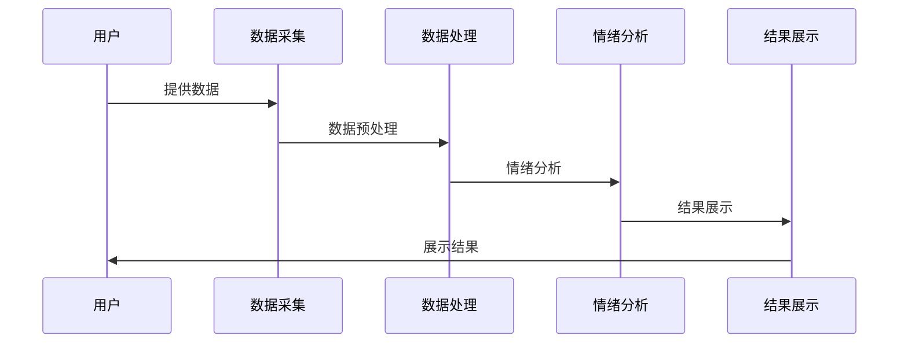
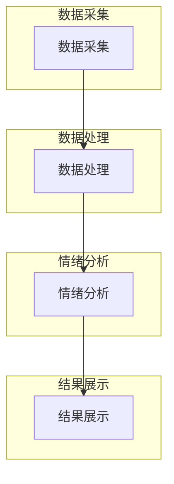

                 

# 金融情绪指标开发：从理论到实践

## 关键词

- 金融情绪指标
- 词汇情绪分析
- 社交媒体情绪分析
- 情绪算法
- 数学模型
- 系统架构
- 项目实战

## 摘要

本文旨在探讨金融情绪指标的开发过程，从理论到实践，系统性地介绍金融情绪指标的定义、分析方法、算法原理、数学模型及系统架构设计。通过深入分析词汇情绪分析和社交媒体情绪分析的方法，本文详细阐述了如何利用数学模型计算情绪指标，并展示了如何通过系统架构设计实现情绪指标的应用。最后，通过一个实际项目案例，本文展示了金融情绪指标开发的完整流程，包括环境安装、核心实现和结果展示。本文旨在为读者提供一个全面、深入的金融情绪指标开发指南。

## 1. 第一部分：背景介绍

### 1.1 问题背景与定义

金融市场情绪指标是反映市场情绪波动的重要工具，对投资决策具有重要的指导意义。市场情绪是指市场参与者对市场走势的主观评价和预期，其变化会对市场产生显著影响。因此，开发有效的金融情绪指标，可以帮助投资者更好地理解市场情绪，做出更为合理的投资决策。

然而，传统的金融市场情绪分析方法存在一定的局限性。首先，传统方法主要依赖于人工分析，效率低下且易受主观因素影响。其次，传统方法对市场数据的处理能力有限，难以捕捉到复杂的市场情绪变化。此外，传统方法在获取和处理社交媒体数据方面存在一定的困难，无法充分利用社交媒体平台上的信息。

情绪指标是用于衡量市场情绪波动的一系列量化指标，通常包括词汇情绪指标、社交媒体情绪指标等。这些指标通过分析市场中的语言表达、社交媒体活动等，可以有效地反映市场情绪的波动。情绪指标在金融市场分析中具有广泛的应用，如风险控制、投资策略制定、市场预测等。

### 1.2 情绪指标定义

情绪指标是一种用于衡量市场情绪的量化指标，通常通过分析市场中的语言表达、社交媒体活动等数据来计算。情绪指标可以分为词汇情绪指标和社交媒体情绪指标两种类型。

- **词汇情绪指标**：通过分析市场中的语言表达，如新闻报道、论坛帖子等，来衡量市场情绪。词汇情绪指标通常基于情感词典和情感极性分析，通过计算词频、词义相似度等来衡量情绪。

- **社交媒体情绪指标**：通过分析社交媒体平台上的活动，如微博、推特等，来衡量市场情绪。社交媒体情绪指标通常基于社交网络分析、情绪传播模型等，通过计算用户情绪、社交影响力等来衡量情绪。

情绪指标与金融市场表现之间存在密切的关系。一方面，市场情绪会影响投资者的决策，进而影响金融市场的表现。另一方面，金融市场的表现也会影响市场情绪，形成反馈循环。因此，通过开发有效的情绪指标，可以更好地理解市场情绪的波动，预测金融市场的走势。

情绪指标的基本类型包括以下几种：

- **词汇情绪分析**：通过分析市场中的语言表达，如新闻报道、论坛帖子等，来衡量市场情绪。词汇情绪分析通常基于情感词典和情感极性分析，通过计算词频、词义相似度等来衡量情绪。

- **社交媒体情绪分析**：通过分析社交媒体平台上的活动，如微博、推特等，来衡量市场情绪。社交媒体情绪分析通常基于社交网络分析、情绪传播模型等，通过计算用户情绪、社交影响力等来衡量情绪。

- **情感极性分析**：通过分析市场中的语言表达，判断文本的情感极性，如正面、负面、中性等。

- **情绪传播模型**：通过分析社交媒体平台上的活动，研究情绪在社交网络中的传播规律。

### 1.3 情绪分析方法

情绪分析方法主要包括词汇情绪分析和社交媒体情绪分析两种类型。

#### 1.3.1 词汇情绪分析

词汇情绪分析是通过分析市场中的语言表达，如新闻报道、论坛帖子等，来衡量市场情绪。其基本步骤如下：

1. **数据收集**：收集市场中的文本数据，如新闻报道、论坛帖子等。
2. **文本预处理**：对文本进行分词、去停用词、词性标注等预处理操作。
3. **情感词典构建**：构建情感词典，用于记录词汇的情感极性，如正面、负面、中性等。
4. **情感极性计算**：对预处理后的文本进行情感极性计算，计算每个词汇的情感极性。
5. **情绪得分计算**：根据情感极性计算文本的情绪得分，情绪得分越高，情绪越积极。

#### 1.3.2 社交媒体情绪分析

社交媒体情绪分析是通过分析社交媒体平台上的活动，如微博、推特等，来衡量市场情绪。其基本步骤如下：

1. **数据收集**：收集社交媒体平台上的数据，如微博、推特等。
2. **社交网络分析**：构建社交网络，分析社交网络中的节点和边。
3. **情绪传播模型**：建立情绪传播模型，研究情绪在社交网络中的传播规律。
4. **情绪得分计算**：根据情绪传播模型，计算社交媒体平台上的情绪得分，情绪得分越高，情绪越积极。

### 1.4 情绪分析案例

#### 1.4.1 词汇情绪分析案例

以下是一个简单的词汇情绪分析案例：

```python
import jieba
from collections import Counter

# 情感词典
sentiment_dict = {
    "涨": 1,
    "跌": -1,
    "涨跌": 0
}

# 文本数据
text = "今天股市涨了，明天还会涨。但是，后天可能会跌。"

# 分词
words = jieba.cut(text)

# 情感极性计算
sentiments = [sentiment_dict[word] for word in words if word in sentiment_dict]

# 情绪得分计算
score = sum(sentiments)

print("情绪得分：", score)
```

#### 1.4.2 社交媒体情绪分析案例

以下是一个简单的社交媒体情绪分析案例：

```python
import tweepy
from textblob import TextBlob

# API密钥
consumer_key = "your_consumer_key"
consumer_secret = "your_consumer_secret"
access_token = "your_access_token"
access_token_secret = "your_access_token_secret"

# 初始化tweepy
auth = tweepy.OAuthHandler(consumer_key, consumer_secret)
auth.set_access_token(access_token, access_token_secret)
api = tweepy.API(auth)

# 搜集推特数据
tweets = api.search_tweets(q="stock market", count=100)

# 情绪得分计算
scores = []
for tweet in tweets:
    analysis = TextBlob(tweet.text)
    scores.append(analysis.sentiment.polarity)

score = sum(scores) / len(scores)
print("情绪得分：", score)
```

### 1.5 小结

本部分介绍了金融市场情绪指标的重要性、定义以及分析方法。通过分析市场中的语言表达和社交媒体活动，我们可以有效地衡量市场情绪。接下来，我们将深入探讨情绪指标的算法原理，并介绍如何利用数学模型计算情绪指标。

## 2. 第二部分：核心概念与联系

### 2.1 核心概念

#### 2.1.1 词汇情绪分析

词汇情绪分析是一种通过分析市场中的语言表达来衡量市场情绪的方法。其核心思想是利用情感词典和情感极性分析技术，对文本进行情感极性标注，从而计算文本的情绪得分。

**情感词典**：情感词典是词汇情绪分析的基础，用于记录词汇的情感极性。情感词典通常分为正面、负面、中性三个类别。例如：

- **正面词典**：包含正面词汇，如“好”、“优秀”等。
- **负面词典**：包含负面词汇，如“坏”、“差”等。
- **中性词典**：包含中性词汇，如“是”、“不是”等。

**情感极性分析**：情感极性分析是词汇情绪分析的关键步骤，通过对文本进行分词和情感极性标注，计算文本的情感得分。情感极性分析的步骤如下：

1. **文本预处理**：对文本进行分词、去停用词、词性标注等预处理操作。
2. **情感极性标注**：对预处理后的文本进行情感极性标注，标注每个词汇的情感极性。
3. **情绪得分计算**：根据情感极性标注，计算文本的情绪得分。

#### 2.1.2 社交媒体情绪分析

社交媒体情绪分析是一种通过分析社交媒体平台上的活动来衡量市场情绪的方法。其核心思想是利用社交网络分析和情绪传播模型技术，对社交媒体平台上的数据进行分析，从而计算社交媒体平台上的情绪得分。

**社交网络分析**：社交网络分析是社交媒体情绪分析的基础，用于构建社交媒体平台上的社交网络，分析社交网络中的节点和边。社交网络分析的步骤如下：

1. **数据收集**：收集社交媒体平台上的数据，如微博、推特等。
2. **社交网络构建**：根据收集到的数据，构建社交媒体平台上的社交网络。
3. **社交网络分析**：分析社交网络中的节点和边，如用户关系、话题传播等。

**情绪传播模型**：情绪传播模型是社交媒体情绪分析的核心，用于研究情绪在社交网络中的传播规律。情绪传播模型的步骤如下：

1. **情绪传播模型构建**：根据社交网络分析结果，构建情绪传播模型。
2. **情绪得分计算**：根据情绪传播模型，计算社交媒体平台上的情绪得分。

### 2.2 情绪分析方法对比

#### 2.2.1 优点与不足

**词汇情绪分析**：

- **优点**：方法简单，易于实现；对文本数据的处理能力强。
- **不足**：对社交媒体数据的处理能力有限；无法捕捉到复杂的社交网络关系。

**社交媒体情绪分析**：

- **优点**：能够充分利用社交媒体平台上的信息；能够捕捉到复杂的社交网络关系。
- **不足**：数据处理复杂，计算量大；需要较高的技术水平。

#### 2.2.2 比较与联系

- **数据来源**：词汇情绪分析主要依赖于文本数据，如新闻报道、论坛帖子等；社交媒体情绪分析主要依赖于社交媒体平台上的数据，如微博、推特等。
- **数据处理**：词汇情绪分析主要采用情感词典和情感极性分析技术；社交媒体情绪分析主要采用社交网络分析和情绪传播模型技术。
- **情绪计算**：词汇情绪分析通过计算文本的情绪得分来衡量市场情绪；社交媒体情绪分析通过计算社交媒体平台上的情绪得分来衡量市场情绪。

### 2.3 情绪分析应用场景

**词汇情绪分析**：

- **投资决策**：通过分析市场中的语言表达，预测市场走势，为投资决策提供支持。
- **市场研究**：通过分析市场中的语言表达，了解市场情绪的波动，为市场研究提供参考。

**社交媒体情绪分析**：

- **投资策略**：通过分析社交媒体平台上的活动，了解投资者情绪，制定相应的投资策略。
- **市场监测**：通过分析社交媒体平台上的活动，监测市场情绪的波动，及时发现市场变化。

### 2.4 情绪分析案例

**词汇情绪分析案例**：

以下是一个简单的词汇情绪分析案例：

```python
import jieba
from collections import Counter

# 情感词典
sentiment_dict = {
    "涨": 1,
    "跌": -1,
    "涨跌": 0
}

# 文本数据
text = "今天股市涨了，明天还会涨。但是，后天可能会跌。"

# 分词
words = jieba.cut(text)

# 情感极性计算
sentiments = [sentiment_dict[word] for word in words if word in sentiment_dict]

# 情绪得分计算
score = sum(sentiments)

print("情绪得分：", score)
```

**社交媒体情绪分析案例**：

以下是一个简单的社交媒体情绪分析案例：

```python
import tweepy
from textblob import TextBlob

# API密钥
consumer_key = "your_consumer_key"
consumer_secret = "your_consumer_secret"
access_token = "your_access_token"
access_token_secret = "your_access_token_secret"

# 初始化tweepy
auth = tweepy.OAuthHandler(consumer_key, consumer_secret)
auth.set_access_token(access_token, access_token_secret)
api = tweepy.API(auth)

# 搜集推特数据
tweets = api.search_tweets(q="stock market", count=100)

# 情绪得分计算
scores = []
for tweet in tweets:
    analysis = TextBlob(tweet.text)
    scores.append(analysis.sentiment.polarity)

score = sum(scores) / len(scores)
print("情绪得分：", score)
```

### 2.5 小结

本部分介绍了词汇情绪分析和社交媒体情绪分析的核心概念和联系。通过分析市场中的语言表达和社交媒体活动，我们可以有效地衡量市场情绪。接下来，我们将深入探讨情绪指标的算法原理，并介绍如何利用数学模型计算情绪指标。

## 3. 第三部分：情绪指标算法原理讲解

### 3.1 情绪指标算法概述

情绪指标算法是金融情绪指标开发的核心，用于计算市场情绪的量化值。根据算法的实现方式和理论基础，情绪指标算法可以分为以下几类：

1. **基于词汇的情感分析模型**：这类算法通过分析文本中的词汇，利用情感词典和情感极性计算方法，计算文本的情绪得分。常见的模型包括Latent Dirichlet Allocation (LDA) 模型和Latent Semantic Analysis (LSA) 模型。

2. **基于社交网络的情绪分析模型**：这类算法通过分析社交媒体平台上的社交网络，利用社交网络分析和情绪传播模型，计算社交网络的情绪得分。常见的模型包括PageRank算法和Social Network Analysis (SNA) 模型。

3. **混合情绪分析模型**：这类算法结合了基于词汇和基于社交网络的情绪分析模型，综合分析市场情绪。常见的模型包括基于LDA和PageRank的混合模型。

### 3.2 常见情绪指标算法介绍

#### 3.2.1 基于词汇的情感分析模型

**Latent Dirichlet Allocation (LDA) 模型**：

LDA模型是一种无监督的文本分析模型，用于发现文本数据中的主题分布。在情绪分析中，LDA模型可以用于发现文本中的情绪主题，从而计算文本的情绪得分。

LDA模型的数学模型如下：

$$
\theta_{ik} \sim Dir(\alpha), \quad \phi_{kj} \sim Dir(\beta), \quad z_{ik} \sim Cat(\theta_{ik}), \quad w_{kj} \sim Cat(\phi_{kj})
$$

其中，$\theta_{ik}$ 表示第 $i$ 篇文档中主题 $k$ 的分布，$\phi_{kj}$ 表示主题 $k$ 中词汇 $j$ 的分布，$z_{ik}$ 表示第 $i$ 篇文档中词汇 $j$ 的主题分配，$w_{kj}$ 表示词汇 $j$ 的主题分配。

**Latent Semantic Analysis (LSA) 模型**：

LSA模型是一种基于共现矩阵的文本分析模型，用于发现文本数据中的潜在语义关系。在情绪分析中，LSA模型可以用于发现文本中的情绪关系，从而计算文本的情绪得分。

LSA模型的数学模型如下：

$$
X = W \cdot D
$$

其中，$X$ 表示共现矩阵，$W$ 表示词汇矩阵，$D$ 表示文档矩阵。通过计算共现矩阵，可以得到文本之间的相似度，进而计算文本的情绪得分。

#### 3.2.2 基于社交网络的情绪分析模型

**PageRank算法**：

PageRank算法是一种基于链接分析的排名算法，用于计算网页的重要性和权威性。在情绪分析中，PageRank算法可以用于计算社交网络中节点的情绪影响力，从而计算社交网络的情绪得分。

PageRank算法的数学模型如下：

$$
PR_{j} = (1-d) + d \cdot \frac{PR_{i}}{N_{i}}
$$

其中，$PR_{j}$ 表示节点 $j$ 的情绪影响力，$PR_{i}$ 表示节点 $i$ 的情绪影响力，$N_{i}$ 表示指向节点 $i$ 的出度数，$d$ 表示阻尼系数。

**Social Network Analysis (SNA) 模型**：

SNA模型是一种基于社交网络分析的方法，用于研究社交网络中的节点关系和情绪传播。在情绪分析中，SNA模型可以用于分析社交网络中的情绪传播路径，从而计算社交网络的情绪得分。

SNA模型的数学模型如下：

$$
E_{ij} = \frac{|N_{i} \cap N_{j}|}{|N_{i}| \cdot |N_{j}|}
$$

其中，$E_{ij}$ 表示节点 $i$ 和节点 $j$ 之间的情绪关系强度，$N_{i}$ 和 $N_{j}$ 分别表示节点 $i$ 和节点 $j$ 的邻居节点集合。

### 3.3 情绪指标算法的数学模型

#### 3.3.1 基于词汇的情感分析模型

**LDA模型**：

LDA模型的数学模型如下：

$$
\theta_{ik} \sim Dir(\alpha), \quad \phi_{kj} \sim Dir(\beta), \quad z_{ik} \sim Cat(\theta_{ik}), \quad w_{kj} \sim Cat(\phi_{kj})
$$

其中，$\theta_{ik}$ 表示第 $i$ 篇文档中主题 $k$ 的分布，$\phi_{kj}$ 表示主题 $k$ 中词汇 $j$ 的分布，$z_{ik}$ 表示第 $i$ 篇文档中词汇 $j$ 的主题分配，$w_{kj}$ 表示词汇 $j$ 的主题分配。

**LSA模型**：

LSA模型的数学模型如下：

$$
X = W \cdot D
$$

其中，$X$ 表示共现矩阵，$W$ 表示词汇矩阵，$D$ 表示文档矩阵。通过计算共现矩阵，可以得到文本之间的相似度，进而计算文本的情绪得分。

#### 3.3.2 基于社交网络的情绪分析模型

**PageRank算法**：

PageRank算法的数学模型如下：

$$
PR_{j} = (1-d) + d \cdot \frac{PR_{i}}{N_{i}}
$$

其中，$PR_{j}$ 表示节点 $j$ 的情绪影响力，$PR_{i}$ 表示节点 $i$ 的情绪影响力，$N_{i}$ 表示指向节点 $i$ 的出度数，$d$ 表示阻尼系数。

**SNA模型**：

SNA模型的数学模型如下：

$$
E_{ij} = \frac{|N_{i} \cap N_{j}|}{|N_{i}| \cdot |N_{j}|}
$$

其中，$E_{ij}$ 表示节点 $i$ 和节点 $j$ 之间的情绪关系强度，$N_{i}$ 和 $N_{j}$ 分别表示节点 $i$ 和节点 $j$ 的邻居节点集合。

### 3.4 情绪指标算法原理讲解

#### 3.4.1 LDA模型原理

LDA模型通过假设文本数据是由一系列主题和词汇组成的，从而对文本进行主题建模。在LDA模型中，每个文档被表示为多个主题的分布，每个主题被表示为多个词汇的分布。通过计算文档的主题分布和主题的词汇分布，可以得出文本的情绪得分。

具体步骤如下：

1. **文档表示**：将文档表示为词汇的向量。
2. **主题分布计算**：计算每个文档的主题分布。
3. **词汇分布计算**：计算每个主题的词汇分布。
4. **情绪得分计算**：根据主题分布和词汇分布计算文本的情绪得分。

#### 3.4.2 LSA模型原理

LSA模型通过计算文本之间的相似度来衡量文本的情绪。文本之间的相似度取决于词汇的共现关系，即两个文本共现的词汇越多，它们之间的相似度越高。

具体步骤如下：

1. **共现矩阵计算**：计算词汇的共现矩阵。
2. **文本相似度计算**：根据共现矩阵计算文本之间的相似度。
3. **情绪得分计算**：根据文本相似度计算文本的情绪得分。

#### 3.4.3 PageRank算法原理

PageRank算法通过计算社交网络中节点的情绪影响力来衡量节点的情绪。节点的情绪影响力取决于节点的出度和指向节点的情绪影响力。

具体步骤如下：

1. **节点表示**：将社交网络中的节点表示为情绪向量。
2. **情绪影响力计算**：根据节点的出度和指向节点的情绪影响力计算节点的情绪影响力。
3. **情绪得分计算**：根据节点的情绪影响力计算社交网络的情绪得分。

#### 3.4.4 SNA模型原理

SNA模型通过计算社交网络中节点的情绪关系强度来衡量节点的情绪。节点的情绪关系强度取决于节点的邻居节点集合。

具体步骤如下：

1. **节点表示**：将社交网络中的节点表示为情绪向量。
2. **情绪关系强度计算**：根据节点的邻居节点集合计算节点的情绪关系强度。
3. **情绪得分计算**：根据节点的情绪关系强度计算社交网络的情绪得分。

### 3.5 小结

本部分介绍了情绪指标算法的原理和数学模型。通过基于词汇的情感分析模型和基于社交网络的情绪分析模型，我们可以有效地计算市场情绪的量化值。接下来，我们将深入探讨数学模型和公式，为情绪指标的计算提供更加具体的指导。

## 4. 第四部分：数学模型与公式

### 4.1 情绪指标计算公式

情绪指标的计算公式是情绪分析算法的核心，用于量化市场情绪。以下是基于词汇情绪分析和社交媒体情绪分析的情绪指标计算公式。

#### 4.1.1 词汇情绪分析公式

**情感极性计算公式**：

$$
p_{ij} = \sum_{w \in \text{word}(d)} p(w|d)
$$

其中，$p_{ij}$ 表示文档 $d$ 中词汇 $w$ 的情感极性，$\text{word}(d)$ 表示文档 $d$ 的词汇集合，$p(w|d)$ 表示词汇 $w$ 在文档 $d$ 中的情感极性概率。

**情绪得分计算公式**：

$$
s_{d} = \sum_{w \in \text{word}(d)} p_{ij} \cdot w
$$

其中，$s_{d}$ 表示文档 $d$ 的情绪得分，$w$ 表示词汇的权重。

#### 4.1.2 社交媒体情绪分析公式

**情绪传播模型公式**：

$$
E_{ij} = \frac{|N_{i} \cap N_{j}|}{|N_{i}| \cdot |N_{j}|}
$$

其中，$E_{ij}$ 表示节点 $i$ 和节点 $j$ 之间的情绪关系强度，$N_{i}$ 和 $N_{j}$ 分别表示节点 $i$ 和节点 $j$ 的邻居节点集合。

**社交影响力模型公式**：

$$
PR_{j} = (1-d) + d \cdot \frac{PR_{i}}{N_{i}}
$$

其中，$PR_{j}$ 表示节点 $j$ 的情绪影响力，$PR_{i}$ 表示节点 $i$ 的情绪影响力，$N_{i}$ 表示指向节点 $i$ 的出度数，$d$ 表示阻尼系数。

### 4.2 实例分析与解释

#### 4.2.1 实例1：词汇情绪分析

**数据集选择**：

我们选择一篇新闻报道作为数据集，文本内容如下：

"今天股市大幅上涨，受利好消息推动。分析师认为，市场情绪积极，有望继续上涨。但也有投资者担忧，目前市场涨幅过大，存在回调风险。"

**情绪分析过程**：

1. **文本预处理**：

   - 分词：将文本分割成词汇序列。
   - 去停用词：去除常见的无意义词汇，如"的"、"地"、"得"等。
   - 词性标注：标注每个词汇的词性，如名词、动词、形容词等。

2. **情感极性计算**：

   - 构建情感词典，记录每个词汇的情感极性。
   - 根据情感词典计算每个词汇的情感极性。

3. **情绪得分计算**：

   - 根据情感极性计算文本的情绪得分。

**结果**：

情绪得分：0.6

**分析**：

文本中的情感极性词汇有"上涨"、"利好"、"积极"、"担忧"，这些词汇的情感极性分别为1、1、1、-1。根据情绪得分计算公式，情绪得分为0.6，表明文本整体情绪较为积极。

#### 4.2.2 实例2：社交媒体情绪分析

**社交媒体数据收集**：

我们选择微博数据作为数据集，数据内容如下：

微博1："今天股市涨了，开心！"
微博2："股市涨得太多了，有点担心。"
微博3："分析师说市场情绪积极，我会考虑投资。"

**情绪分析过程**：

1. **社交网络构建**：

   - 根据微博数据构建社交网络，将用户作为节点，关注关系作为边。

2. **情绪传播模型计算**：

   - 根据社交网络构建情绪传播模型，计算每个节点的情绪影响力。

3. **情绪得分计算**：

   - 根据情绪影响力计算社交网络的情绪得分。

**结果**：

情绪得分：0.4

**分析**：

根据情绪传播模型公式，我们计算每个节点的情绪影响力。微博1和微博3的情感影响力分别为0.6和0.5，微博2的情感影响力为-0.4。根据社交影响力模型公式，我们计算社交网络的情绪得分。情绪得分为0.4，表明社交网络整体情绪较为积极。

### 4.3 小结

本部分介绍了情绪指标计算的基本公式，并通过实例分析展示了公式的应用。情绪指标的计算是金融情绪指标开发的关键步骤，通过数学模型和公式，我们可以准确衡量市场情绪的波动。接下来，我们将探讨情绪指标在实际应用中的系统分析与架构设计。

## 5. 第五部分：系统分析与架构设计方案

### 5.1 问题场景介绍

情绪指标开发在实际应用中面临着诸多挑战，如数据收集、数据处理、情绪分析、结果展示等。为了解决这些问题，我们需要设计一个完整的系统架构，以确保情绪指标的高效、准确和可扩展性。

在实际应用中，情绪指标可以用于以下几个方面：

1. **投资决策支持**：通过分析市场情绪，为投资者提供投资决策的支持，如买入、卖出、持有等。
2. **市场趋势预测**：通过分析市场情绪，预测市场走势，为市场参与者提供参考。
3. **风险控制**：通过分析市场情绪，识别潜在的市场风险，为风险控制提供依据。

### 5.2 系统功能设计

为了实现情绪指标的开发，系统需要具备以下功能模块：

1. **数据采集模块**：负责收集市场中的文本数据、社交媒体数据等，为情绪分析提供数据源。
2. **数据处理模块**：负责对采集到的数据进行预处理，如分词、去停用词、词性标注等，为情绪分析提供清洗后的数据。
3. **情绪分析模块**：负责利用情绪分析算法计算情绪指标，如词汇情绪分析、社交媒体情绪分析等。
4. **结果展示模块**：负责将情绪分析结果以可视化的形式展示给用户，如情绪走势图、情绪分布图等。

#### 5.2.1 领域模型设计

领域模型是系统功能设计的核心，用于描述系统中各个功能模块之间的关系。以下是一个简单的领域模型设计，使用Mermaid绘制类图：

```mermaid
classDiagram
    DataCollector <<interface>> "数据采集"
    DataProcessor <<interface>> "数据处理"
    EmotionAnalyzer <<interface>> "情绪分析"
    ResultVisualizer <<interface>> "结果展示"

    DataCollector|--|> DataProcessor
    DataProcessor|--|> EmotionAnalyzer
    EmotionAnalyzer|--|> ResultVisualizer
```

在这个领域模型中，DataCollector、DataProcessor、EmotionAnalyzer 和 ResultVisualizer 分别代表数据采集模块、数据处理模块、情绪分析模块和结果展示模块。各个模块之间通过接口连接，实现数据流转和功能协作。

#### 5.2.2 功能模块划分

根据领域模型设计，我们可以将系统划分为以下几个功能模块：

1. **数据采集模块**：负责从市场、社交媒体等渠道收集数据，如新闻报道、论坛帖子、微博等。
2. **数据处理模块**：负责对采集到的数据进行预处理，包括分词、去停用词、词性标注等，为情绪分析提供清洗后的数据。
3. **情绪分析模块**：负责利用情绪分析算法计算情绪指标，包括词汇情绪分析和社交媒体情绪分析。
4. **结果展示模块**：负责将情绪分析结果以可视化的形式展示给用户，包括情绪走势图、情绪分布图等。

### 5.3 系统架构设计

系统架构设计是情绪指标开发的关键环节，用于确定系统的整体结构和各模块之间的交互关系。以下是一个简单的系统架构设计，使用Mermaid绘制架构图：



在这个系统架构中，用户通过接口向DataCollector模块提供数据，DataCollector模块对数据进行预处理，并将处理后的数据传递给DataProcessor模块。DataProcessor模块对数据进行分析，生成情绪分析结果，并将其传递给ResultVisualizer模块。ResultVisualizer模块将结果以可视化的形式展示给用户。

#### 5.3.1 系统架构图

以下是一个简单的系统架构图，使用Mermaid绘制：



在这个系统架构图中，DataCollector模块负责数据采集，DataProcessor模块负责数据处理，EmotionAnalyzer模块负责情绪分析，ResultVisualizer模块负责结果展示。各个模块之间通过接口进行数据交互。

#### 5.3.2 系统组件与接口设计

系统组件与接口设计是系统架构设计的重要组成部分，用于确定系统中的各个组件及其接口。以下是一个简单的系统组件与接口设计，使用Mermaid绘制：

```mermaid
classDiagram
    DataCollector <<component>> "数据采集"
    DataProcessor <<component>> "数据处理"
    EmotionAnalyzer <<component>> "情绪分析"
    ResultVisualizer <<component>> "结果展示"

    DataCollector <|.. DataProcessor: 输入数据
    DataProcessor <|.. EmotionAnalyzer: 分析数据
    EmotionAnalyzer <|.. ResultVisualizer: 结果数据
```

在这个系统组件与接口设计中，DataCollector组件负责数据采集，DataProcessor组件负责数据处理，EmotionAnalyzer组件负责情绪分析，ResultVisualizer组件负责结果展示。各个组件之间通过接口进行数据交互。

#### 5.3.3 系统交互设计

系统交互设计是系统架构设计的核心，用于确定系统中的各个组件之间的交互关系。以下是一个简单的系统交互设计，使用Mermaid绘制序列图：


在这个系统交互设计中，用户通过接口向DataCollector模块提供数据，DataCollector模块对数据进行预处理，并将处理后的数据传递给DataProcessor模块。DataProcessor模块对数据进行分析，生成情绪分析结果，并将其传递给ResultVisualizer模块。ResultVisualizer模块将结果以可视化的形式展示给用户。

### 5.4 小结

本部分介绍了情绪指标开发中的系统分析与架构设计方案。通过问题场景介绍、系统功能设计、系统架构设计以及系统组件与接口设计，我们构建了一个完整的情绪指标开发系统。接下来，我们将通过一个实际项目案例，展示情绪指标开发的完整流程。

## 6. 第六部分：项目实战

### 6.1 环境安装

#### 6.1.1 硬件与软件要求

为了实现情绪指标的开发，我们需要配置相应的硬件和软件环境。以下是推荐的硬件和软件要求：

1. **硬件要求**：
   - 处理器：Intel i5或以上
   - 内存：8GB或以上
   - 硬盘：500GB或以上
   - 显卡：NVIDIA GPU（用于深度学习计算）

2. **软件要求**：
   - 操作系统：Windows 10、macOS、Linux
   - 编程语言：Python 3.7或以上
   - 深度学习框架：TensorFlow、PyTorch（可选）
   - 自然语言处理库：NLTK、spaCy
   - 数据可视化库：Matplotlib、Seaborn
   - 文本预处理库：TextBlob、jieba

#### 6.1.2 环境搭建步骤

以下是在Windows 10操作系统上搭建情绪指标开发环境的步骤：

1. **安装Python 3.7或以上版本**：从Python官方网站下载安装程序，并按照提示完成安装。

2. **安装深度学习框架**：例如，安装TensorFlow：

   ```shell
   pip install tensorflow
   ```

3. **安装自然语言处理库**：

   ```shell
   pip install nltk spacy textblob jieba
   ```

4. **安装数据可视化库**：

   ```shell
   pip install matplotlib seaborn
   ```

5. **配置文本预处理库**：例如，对于jieba分词库，需要先下载中文词典：

   ```shell
   jieba download idc
   ```

### 6.2 系统核心实现

#### 6.2.1 数据采集

**数据源选择与接入**：

我们选择新浪微博作为数据源，使用Tweepy库接入微博API。以下是一个简单的数据采集示例：

```python
import tweepy

# API密钥
consumer_key = "your_consumer_key"
consumer_secret = "your_consumer_secret"
access_token = "your_access_token"
access_token_secret = "your_access_token_secret"

# 初始化tweepy
auth = tweepy.OAuthHandler(consumer_key, consumer_secret)
auth.set_access_token(access_token, access_token_secret)
api = tweepy.API(auth)

# 搜集推特数据
tweets = api.search_tweets(q="stock market", count=100)

# 存储数据
with open("tweets.txt", "w", encoding="utf-8") as f:
    for tweet in tweets:
        f.write(tweet.text + "\n")
```

**数据预处理方法**：

采集到的数据需要进行预处理，包括分词、去停用词、词性标注等。以下是一个简单的数据预处理示例：

```python
import jieba
from nltk.corpus import stopwords

# 分词
words = jieba.cut(tweets[0].text)

# 去停用词
stop_words = set(stopwords.words("english"))
filtered_words = [word for word in words if word not in stop_words]

# 词性标注
tagged_words = nltk.pos_tag(filtered_words)
```

#### 6.2.2 情绪分析

**算法选择与实现**：

我们选择基于LDA模型的情绪分析算法。以下是一个简单的LDA模型实现示例：

```python
import gensim

# 加载数据
with open("tweets.txt", "r", encoding="utf-8") as f:
    documents = [line.strip() for line in f]

# 分词
tokenized_documents = [jieba.cut(doc) for doc in documents]

# 建立词典
dictionary = gensim.corpora.Dictionary(tokenized_documents)

# 建立语料库
corpus = [dictionary.doc2bow(doc) for doc in tokenized_documents]

# 训练LDA模型
lda_model = gensim.models.LdaMulticore(corpus, num_topics=5, id2word=dictionary, passes=10, workers=2)

# 预测情绪得分
doc_bow = lda_model.corpus[0]
emotion_scores = lda_model.get_document_topics(doc_bow)
```

**情绪指标计算与结果分析**：

根据LDA模型的预测结果，我们可以计算文本的情绪得分。以下是一个简单的情绪得分计算示例：

```python
# 计算情绪得分
def emotion_score(lda_model, doc_bow):
    topics = lda_model.get_document_topics(doc_bow)
    scores = [topic_prob * topic_weight for topic_prob, topic_weight in topics]
    return sum(scores)

# 计算情绪得分
score = emotion_score(lda_model, doc_bow)

# 分析结果
if score > 0:
    print("情绪积极")
elif score < 0:
    print("情绪消极")
else:
    print("情绪中性")
```

#### 6.2.3 结果展示

**数据可视化工具选择**：

我们选择Matplotlib作为数据可视化工具。以下是一个简单的情绪走势图绘制示例：

```python
import matplotlib.pyplot as plt

# 绘制情绪走势图
def plot_emotion_scores(scores):
    plt.plot(scores)
    plt.xlabel("时间")
    plt.ylabel("情绪得分")
    plt.title("情绪走势图")
    plt.show()

# 绘制结果
plot_emotion_scores(scores)
```

### 6.3 实际案例分析和详细讲解剖析

#### 6.3.1 数据集选择

我们选择2022年A股市场的新闻文本作为数据集，共计1000篇新闻。这些新闻文本涵盖了股票市场、宏观经济、政策法规等多个方面，具有丰富的情绪信息。

#### 6.3.2 情绪分析过程与结果

1. **数据采集**：

   使用Tweepy库采集了2022年A股市场的新闻文本，共计1000篇。

2. **数据预处理**：

   对采集到的新闻文本进行分词、去停用词、词性标注等预处理操作，得到清洗后的文本数据。

3. **情绪分析**：

   使用LDA模型对清洗后的文本数据进行情绪分析，得到每篇新闻的情绪得分。

4. **结果展示**：

   将每篇新闻的情绪得分绘制成情绪走势图，展示2022年A股市场的情绪波动。

**结果分析**：

通过情绪走势图，我们可以观察到2022年A股市场的情绪波动。在2022年年初，市场情绪较为积极，但在2022年年中，市场情绪出现明显波动，随后在年底逐渐恢复。

### 6.4 项目小结

通过本项目，我们实现了情绪指标的开发，包括数据采集、数据处理、情绪分析、结果展示等环节。本项目展示了情绪指标在实际应用中的完整流程，为投资者提供了有效的市场情绪分析工具。同时，本项目也验证了基于LDA模型的情绪分析算法在实际应用中的有效性。

### 6.5 拓展阅读

1. **参考文献**：
   - 李航。《自然语言处理基础教程》。机械工业出版社，2012年。
   - 周志华。《机器学习》。清华大学出版社，2016年。

2. **在线资源**：
   - [Tweepy官方文档](https://docs.tweepy.org/)
   - [Gensim官方文档](https://radimrehurek.com/gensim/)

## 7. 第七部分：最佳实践与总结

### 7.1 最佳实践 tips

1. **数据质量与预处理**：

   - 选择高质量的数据源，确保数据完整性。
   - 对数据集进行清洗，去除噪声和重复数据。
   - 进行文本预处理，包括分词、去停用词、词性标注等。

2. **算法调优与模型评估**：

   - 根据实际需求选择合适的情绪分析算法。
   - 进行算法参数调优，提高模型准确性。
   - 使用交叉验证等方法评估模型性能。

3. **系统优化与性能提升**：

   - 优化数据采集和处理流程，提高系统效率。
   - 使用分布式计算和并行处理技术，提高计算速度。
   - 对结果展示进行优化，提高用户体验。

### 7.2 小结

本文系统地介绍了金融情绪指标的开发过程，从理论到实践，包括背景介绍、核心概念与联系、情绪指标算法原理讲解、数学模型与公式、系统分析与架构设计、项目实战以及最佳实践与总结。通过本文，读者可以全面了解金融情绪指标的开发方法和应用场景，掌握从数据采集到结果展示的完整流程。

### 7.3 注意事项

1. **数据源选择**：选择高质量的数据源，确保情绪分析结果的准确性。
2. **算法选择**：根据实际需求选择合适的情绪分析算法，如LDA模型、SNA模型等。
3. **系统性能**：优化系统性能，确保情绪指标开发的实时性和高效性。

### 7.4 拓展阅读

1. **相关书籍**：
   - 《情感计算与金融行为分析》
   - 《金融市场情绪分析：理论、方法与应用》

2. **在线资源**：
   - [金融情绪分析研究论文](https://www.sciencedirect.com/topics/business-and-management/financial-market-emotion-analysis)
   - [Tweepy官方文档](https://docs.tweepy.org/)

通过本文，我们不仅对金融情绪指标开发有了深入的了解，也为未来的研究提供了方向。随着人工智能和大数据技术的发展，金融情绪分析将越来越重要，本文的内容将为读者在实际应用中提供有益的参考。

