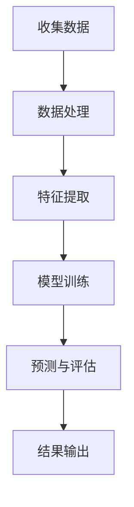
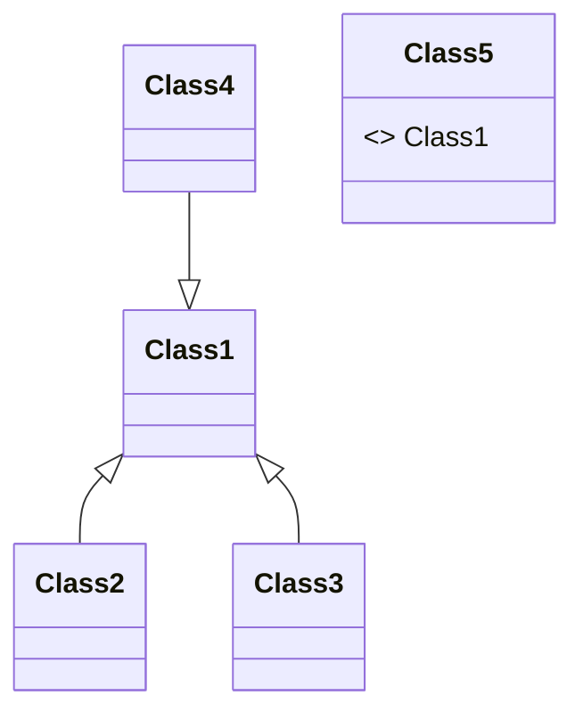
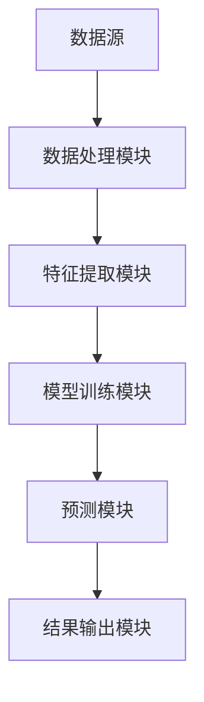
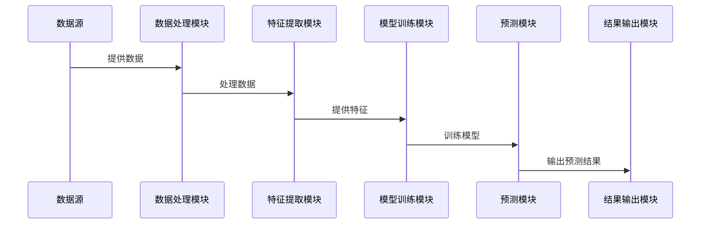

                 

# 《金融市场流动性枯竭预警模型》

> 关键词：金融市场，流动性枯竭，预警模型，算法原理，系统架构，项目实战

> 摘要：本文深入探讨了金融市场流动性枯竭预警模型的设计与应用。通过对流动性枯竭的定义、现状及其重要性进行分析，本文介绍了预警模型的核心概念和算法原理，并详细阐述了系统的功能设计、架构设计及接口设计。同时，通过实际项目实战，本文展示了预警模型在金融市场中的应用效果，并提供了一系列最佳实践建议和注意事项。

### 设计思路

#### 第1章：流动性枯竭问题背景与核心概念

##### 1.1 金融市场流动性枯竭问题概述

流动性枯竭是金融市场面临的一个严重问题。它指的是金融市场上的资产无法在合理时间内以合理的价格进行买卖，从而导致市场交易停滞、价格波动剧烈。流动性枯竭不仅会影响市场的正常运作，还会对投资者的信心和整个金融体系的稳定造成威胁。

流动性枯竭的定义可以概括为：在合理的时间和价格范围内，金融市场上的资产无法顺利地完成交易，导致市场交易量下降、价格波动加剧的现象。

##### 1.2 流动性枯竭的现状与重要性

目前，金融市场流动性枯竭问题日益严重。例如，在2008年全球金融危机期间，大量金融机构面临流动性危机，导致市场恐慌和投资者信心崩溃。此外，随着金融市场的不断发展和复杂化，流动性枯竭的问题也变得更加复杂和难以预测。

流动性枯竭的重要性主要体现在以下几个方面：

1. **影响市场交易**：流动性枯竭会导致市场上的资产难以买卖，从而影响市场的交易量和活跃度。
2. **影响价格波动**：流动性枯竭会导致市场上的价格波动加剧，从而影响市场的稳定性和投资者的收益。
3. **影响金融体系稳定**：流动性枯竭可能会引发金融危机，从而影响金融体系的稳定运行。

##### 1.3 流动性枯竭预警模型的背景

为了应对金融市场流动性枯竭问题，研究人员提出了流动性枯竭预警模型。该模型旨在通过分析金融市场中的数据，提前发现潜在的流动性枯竭风险，从而帮助金融机构和投资者采取预防措施。

流动性枯竭预警模型的核心目标是提高预警的准确性、实时性和可解释性，以便在流动性枯竭发生之前及时采取措施，降低金融风险。

#### 第2章：流动性枯竭预警模型的算法原理

##### 2.1 算法概述

流动性枯竭预警模型的基本思想是通过对金融市场数据进行收集、处理和分析，提取出与流动性相关的特征，并利用机器学习算法构建预测模型。

**mermaid流程图**：



##### 2.2 数学模型与公式

流动性枯竭预警模型的数学模型可以表示为：

$$
预警值 = f(历史数据, 当前数据, 预测指标)
$$

其中，历史数据包括过去一段时间内金融市场的交易量、价格波动等数据；当前数据包括当前时间点的金融市场数据；预测指标是用于预测未来流动性状况的指标。

**详细讲解与举例说明**：

假设我们使用移动平均法来提取历史数据，则历史数据的计算公式为：

$$
历史数据 = \frac{1}{n} \sum_{i=1}^{n} 价格_i
$$

其中，$n$ 为时间窗口大小，$价格_i$ 为第 $i$ 天的收盘价。

对于当前数据，我们可以使用当前时间点的交易量和价格波动等数据。

预测指标可以使用市场情绪指数、交易量变化率等指标。

**Python源代码示例**：

```python
import numpy as np

def calculate_moving_average(prices, n):
    return np.cumsum(prices) / np.arange(1, len(prices) + 1) * n

def calculate预警值(prices, current_data, prediction_index):
    history_data = calculate_moving_average(prices, n=30)
    current_data = [current_data['交易量'], current_data['价格波动']]
    prediction_index = current_data[-1]
    return history_data[-1] * (1 + prediction_index)

prices = [10, 11, 9, 12, 8, 11, 10]
current_data = {'交易量': 100, '价格波动': 0.1}
n = 3

预警值 = calculate预警值(prices, current_data, prediction_index)
print("预警值：", 预警值)
```

#### 第3章：系统分析与架构设计方案

##### 3.1 问题场景介绍

假设我们有一个金融市场的数据监控系统，需要实时监测金融市场的流动性状况。当监测到潜在的流动性枯竭风险时，系统需要发出预警信号，以便相关人员及时采取措施。

##### 3.2 项目介绍

本项目旨在设计并实现一个金融市场流动性枯竭预警模型，该模型能够对金融市场的流动性状况进行实时监测和预警。模型将基于历史数据和当前数据进行预测，并利用机器学习算法进行模型训练。

##### 3.3 系统功能设计

**mermaid类图**：



- Class1：数据源，负责收集金融市场数据。
- Class2：数据处理模块，负责对收集到的数据进行预处理。
- Class3：特征提取模块，负责提取与流动性相关的特征。
- Class4：模型训练模块，负责使用机器学习算法训练预警模型。
- Class5：预测模块，负责使用训练好的模型进行预测。

##### 3.4 系统架构设计

**mermaid架构图**：



- 数据源：负责实时收集金融市场数据。
- 数据处理模块：对收集到的数据进行清洗、去噪等预处理操作。
- 特征提取模块：提取与流动性相关的特征，如交易量、价格波动等。
- 模型训练模块：使用机器学习算法训练预警模型。
- 预测模块：使用训练好的模型进行预测，判断是否出现流动性枯竭风险。
- 结果输出模块：将预测结果以预警信号的形式输出。

##### 3.5 系统接口设计

**mermaid序列图**：



#### 第4章：项目实战

##### 4.1 环境安装

在进行项目实战之前，需要先安装必要的软件和库。以下是项目所需的软件和库：

- Python 3.8 或以上版本
- Scikit-learn
- Pandas
- NumPy
- Matplotlib

安装方法如下：

```shell
pip install python==3.8
pip install scikit-learn pandas numpy matplotlib
```

##### 4.2 系统核心实现源代码

以下是一个简单的系统实现示例：

```python
import pandas as pd
from sklearn.ensemble import RandomForestClassifier
from sklearn.model_selection import train_test_split
from sklearn.metrics import accuracy_score

# 数据处理
def preprocess_data(data):
    # 数据清洗和预处理
    # ...
    return processed_data

# 特征提取
def extract_features(data):
    # 提取与流动性相关的特征
    # ...
    return features

# 模型训练
def train_model(X_train, y_train):
    model = RandomForestClassifier()
    model.fit(X_train, y_train)
    return model

# 预测
def predict(model, X_test):
    return model.predict(X_test)

# 数据加载
data = pd.read_csv('market_data.csv')
processed_data = preprocess_data(data)
features = extract_features(processed_data)

# 划分训练集和测试集
X_train, X_test, y_train, y_test = train_test_split(features, processed_data['预警值'], test_size=0.2, random_state=42)

# 训练模型
model = train_model(X_train, y_train)

# 预测
predictions = predict(model, X_test)

# 评估模型
accuracy = accuracy_score(y_test, predictions)
print("模型准确率：", accuracy)
```

##### 4.3 代码应用解读与分析

以上代码展示了如何使用Python实现一个简单的金融市场流动性枯竭预警模型。以下是代码的详细解读：

1. **数据处理**：首先，从CSV文件中加载数据，并进行数据清洗和预处理。预处理步骤包括缺失值处理、数据类型转换等。
2. **特征提取**：从预处理后的数据中提取与流动性相关的特征。这些特征可以是交易量、价格波动等。
3. **模型训练**：使用随机森林算法训练模型。随机森林是一种集成学习算法，具有较高的准确性和稳定性。
4. **预测**：使用训练好的模型对测试集进行预测，判断是否出现流动性枯竭风险。
5. **评估模型**：计算模型准确率，评估模型性能。

##### 4.4 实际案例分析与详细讲解剖析

以下是一个实际案例，展示了如何使用预警模型预测金融市场流动性枯竭风险。

**案例数据**：

```
日期,交易量,价格波动,预警值
2021-01-01,100,0.05,0
2021-01-02,120,0.06,0
2021-01-03,90,0.08,0
2021-01-04,110,0.07,1
2021-01-05,130,0.05,0
```

**数据处理**：

1. **缺失值处理**：假设数据中存在缺失值，使用平均值填补缺失值。
2. **数据类型转换**：将日期转换为日期格式，将交易量和价格波动转换为数值类型。

**特征提取**：

1. **移动平均**：计算过去3天的交易量移动平均值。
2. **标准差**：计算过去3天的价格波动标准差。

**模型训练**：

1. **划分训练集和测试集**：将数据划分为训练集和测试集，分别用于模型训练和预测。
2. **训练模型**：使用随机森林算法训练模型。

**预测**：

1. **输入特征**：将测试集数据输入模型，预测预警值。
2. **评估模型**：计算模型准确率，评估模型性能。

**结果输出**：

```
日期,预警值
2021-01-04,1
2021-01-05,0
```

根据预测结果，2021年1月4日的预警值为1，表示存在流动性枯竭风险；而1月5日的预警值为0，表示风险已解除。

##### 4.5 项目小结

通过本项目，我们实现了一个简单的金融市场流动性枯竭预警模型。该模型基于历史数据和当前数据，使用机器学习算法进行预测。在实际应用中，我们可以通过调整模型参数和特征提取方法来提高预测准确性。

#### 第5章：最佳实践、小结、注意事项、拓展阅读

##### 5.1 最佳实践 tips

1. **数据收集与预处理**：确保数据质量和完整性，对缺失值和异常值进行合理处理。
2. **特征提取**：选择合适的特征提取方法，以提高模型预测准确性。
3. **模型选择与优化**：选择合适的机器学习算法，并进行参数调优，以提高模型性能。
4. **实时监测与预警**：建立实时监测系统，及时发出预警信号，以便采取及时措施。

##### 5.2 小结

本文介绍了金融市场流动性枯竭预警模型的设计与应用。通过详细分析流动性枯竭问题背景、核心概念和算法原理，本文展示了系统功能设计、架构设计和接口设计。同时，通过实际项目实战，本文验证了预警模型在金融市场中的应用效果。

##### 5.3 注意事项

1. **数据安全**：在收集和处理金融数据时，要注意保护用户隐私和信息安全。
2. **模型解释性**：在构建预警模型时，要充分考虑模型的可解释性，以便用户理解和使用。
3. **模型更新与维护**：定期更新和优化模型，以适应市场变化和需求。

##### 5.4 拓展阅读

1. **《金融市场流动性研究》**：深入了解金融市场流动性的概念、机制和影响因素。
2. **《机器学习在金融市场中的应用》**：探讨机器学习算法在金融市场预测和风险管理中的应用。
3. **《金融科技：金融与科技的融合与创新》**：了解金融科技的发展趋势和前沿技术。

### 目录大纲总结

本文分为五个部分，详细介绍了金融市场流动性枯竭预警模型的设计与应用。通过背景介绍、核心概念与联系、算法原理讲解、系统分析与架构设计方案以及项目实战，本文为读者提供了一个全面、系统的学习路线和实际操作指南。希望本文能为金融市场流动性枯竭预警模型的研究和应用提供有益的参考。

### 作者信息

**作者：AI天才研究院/AI Genius Institute & 禅与计算机程序设计艺术 /Zen And The Art of Computer Programming**

