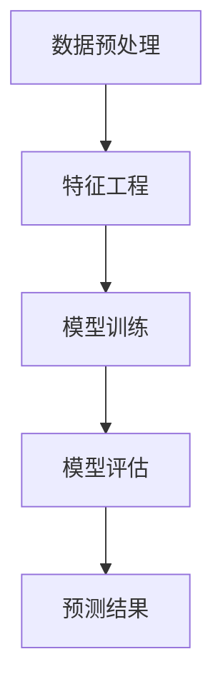
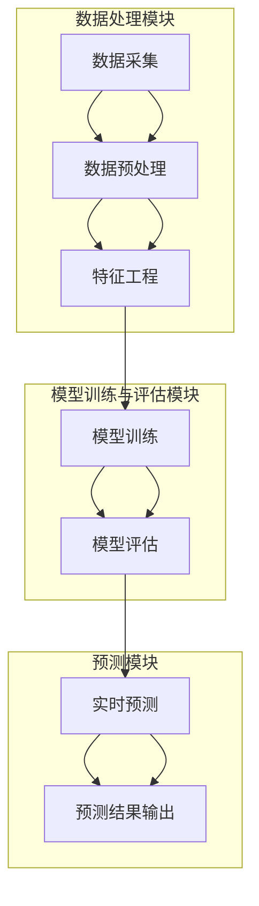
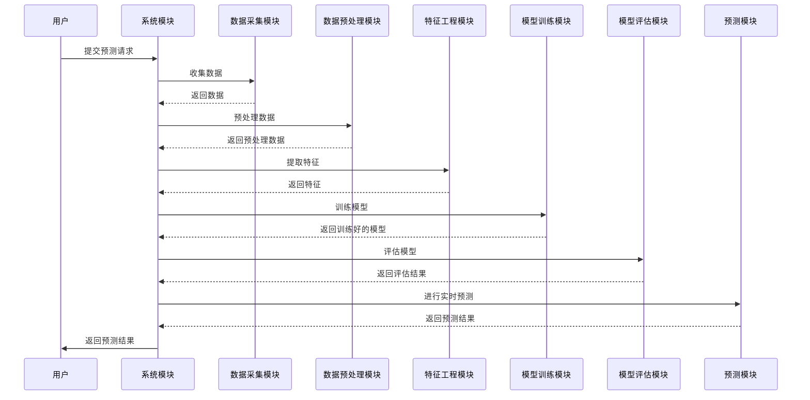

                 

### 文章标题

# 金融市场流动性预测模型

> 关键词：金融市场流动性、预测模型、深度学习、时间序列、统计模型、机器学习

> 摘要：本文将深入探讨金融市场流动性预测的重要性，介绍常用的预测模型和算法，并通过实际案例分析，展示如何设计和实现一个有效的金融市场流动性预测模型。

----------------------------------------------------------------

## 背景介绍

### 1.1 问题背景

金融市场流动性是指市场参与者能够在合理时间内以合理的价格买卖资产的能力。流动性风险是金融市场中一个重要的风险类型，它直接影响金融市场的稳定性和金融产品的价格。流动性风险可能导致市场崩溃、资产价格波动加剧等问题，对投资者和金融机构造成巨大损失。

随着金融市场的日益复杂化和全球化，流动性风险管理的需求也越来越高。金融机构和监管机构需要准确预测市场流动性，以便及时调整投资策略和风险管理措施。此外，流动性预测对于投资者来说也具有重要意义，它可以帮助投资者更好地理解市场动态，做出更明智的投资决策。

### 1.2 问题描述

流动性预测的主要目标是预测市场在未来的某个时间点上的流动性水平。这需要考虑多个因素，如市场参与者的行为、宏观经济指标、市场供需状况等。预测的难点在于市场数据的复杂性和不确定性。

首先，金融市场数据通常是高度非线性的，具有时变性和周期性。这使得传统的时间序列模型和统计模型难以准确捕捉市场流动性的变化。其次，市场参与者的行为具有不可预测性，如突发新闻事件、市场恐慌等，这些因素会对市场流动性产生显著影响。

### 1.3 问题解决

当前解决流动性预测问题的主要方法包括传统的统计模型、机器学习模型和深度学习模型。这些方法各有优缺点，需要结合具体应用场景进行选择。

传统的时间序列模型，如ARIMA模型和GARCH模型，适用于处理线性关系较强的数据。然而，金融市场数据通常是高度非线性的，因此这些模型的效果可能有限。

统计模型，如回归模型和因子模型，可以通过引入多个变量来提高预测的准确性。这些模型需要手工设计特征，并且对数据的假设较为严格。

机器学习模型，如决策树、支持向量机和神经网络，可以自动学习数据中的复杂关系，并生成预测。然而，这些模型通常需要大量的数据和计算资源。

深度学习模型，如卷积神经网络（CNN）和循环神经网络（RNN），具有强大的表示能力和自适应能力，可以处理高维数据和时序数据。这些模型在金融市场流动性预测方面表现出较好的性能。

### 1.4 边界与外延

本文主要关注短期流动性预测，以日内、日间流动性水平为主要研究对象。此外，本文将探讨流动性预测在不同市场类型（如股票、债券、外汇等）中的应用。

### 1.5 概念结构与核心要素组成

金融市场流动性预测涉及多个核心概念，包括市场流动性、预测模型、数据源等。这些概念相互关联，共同构成了流动性预测的理论基础。

市场流动性是流动性预测的基础，它决定了资产交易的成本和效率。预测模型是流动性预测的核心工具，包括传统统计模型、机器学习模型和深度学习模型。数据源则是预测模型训练和评估的重要依据，包括历史市场数据和宏观经济指标。

## 核心概念与联系

### 2.1 核心概念原理

#### 2.1.1 金融市场流动性

金融市场流动性是指市场参与者能够在合理时间内以合理的价格买卖资产的能力。流动性高意味着资产易于买卖，交易成本较低。

#### 2.1.2 预测模型

预测模型是金融市场流动性预测的核心工具。常用的模型包括时间序列模型、统计模型和机器学习模型。

- **时间序列模型**：时间序列模型主要用于处理时间相关的数据，如ARIMA模型和GARCH模型。这些模型通过分析历史数据来预测未来值。
- **统计模型**：统计模型通过建立变量之间的关系来预测流动性。常见的统计模型包括线性回归、多元回归和因子模型。
- **机器学习模型**：机器学习模型通过学习历史数据中的模式来预测流动性。常见的机器学习模型包括决策树、支持向量机和神经网络。

#### 2.1.3 数据源

数据源是预测模型训练和评估的重要依据。常用的数据源包括历史市场数据和宏观经济指标。

- **历史市场数据**：历史市场数据包括交易量、价格、收益率等。这些数据可以反映市场流动性的历史变化。
- **宏观经济指标**：宏观经济指标包括GDP增长率、通货膨胀率、利率等。这些指标可以反映市场流动性的宏观经济环境。

### 2.2 概念属性特征对比表格

| 模型类型 | 特性 |
| --- | --- |
| 时间序列模型 | 线性关系强，适用于稳定数据 |
| 统计模型 | 灵活性较高，可处理非线性关系 |
| 机器学习模型 | 自适应性强，可处理大量数据和非线性关系 |

### 2.3 ER实体关系图

下面是金融市场流动性预测模型的ER实体关系图：

```mermaid
erDiagram
  MarketData -->|1..*| LiquidityPredictionModel
  MarketData -->|1..*| EconomicIndicator
  LiquidityPredictionModel -->|1..1| ModelType
  EconomicIndicator -->|1..*| IndicatorType
```

## 算法原理讲解

### 3.1 算法mermaid流程图

下面是金融市场流动性预测模型的基本流程图：



### 3.2 Python源代码

以下是使用Python实现金融市场流动性预测模型的基本代码：

```python
import pandas as pd
import numpy as np
from sklearn.model_selection import train_test_split
from sklearn.linear_model import LinearRegression
from sklearn.metrics import mean_squared_error

# 数据预处理
def preprocess_data(data):
    # 数据清洗、填充、标准化等操作
    return processed_data

# 特征工程
def feature_engineering(data):
    # 特征提取、特征变换等操作
    return features

# 模型训练
def train_model(X_train, y_train):
    model = LinearRegression()
    model.fit(X_train, y_train)
    return model

# 模型评估
def evaluate_model(model, X_test, y_test):
    y_pred = model.predict(X_test)
    mse = mean_squared_error(y_test, y_pred)
    return mse

# 主程序
if __name__ == "__main__":
    # 数据读取
    data = pd.read_csv("market_data.csv")
    processed_data = preprocess_data(data)
    
    # 特征工程
    features = feature_engineering(processed_data)
    
    # 模型训练
    X = features[:, :-1]
    y = features[:, -1]
    X_train, X_test, y_train, y_test = train_test_split(X, y, test_size=0.2, random_state=42)
    model = train_model(X_train, y_train)
    
    # 模型评估
    mse = evaluate_model(model, X_test, y_test)
    print("Mean squared error:", mse)
```

### 3.3 数学模型和公式

以下是金融市场流动性预测模型的基本数学模型：

$$
L_t = f(X_t, \theta)
$$

其中，$L_t$ 表示时间 $t$ 的市场流动性水平，$X_t$ 表示时间 $t$ 的市场特征向量，$\theta$ 表示模型的参数。

### 3.4 详细讲解与举例说明

#### 3.4.1 数据预处理

数据预处理是金融市场流动性预测的第一步，其主要目的是清洗、填充和标准化数据，以提高模型的性能。

- **数据清洗**：去除缺失值、异常值和重复值。
- **数据填充**：使用合适的算法填充缺失值，如平均值、中值或插值。
- **数据标准化**：将数据缩放到一个较小的范围，如 $[0, 1]$ 或 $[-1, 1]$，以消除不同特征之间的尺度差异。

#### 3.4.2 特征工程

特征工程是提高模型性能的关键步骤，其主要目的是从原始数据中提取出对预测任务有帮助的特征。

- **特征提取**：使用统计方法、机器学习方法等提取出能够反映市场流动性的特征。
- **特征变换**：对特征进行变换，如归一化、标准化、正则化等，以提高模型的稳定性和泛化能力。

#### 3.4.3 模型训练

模型训练是使用历史数据来学习模型参数的过程。常用的模型训练方法包括线性回归、支持向量机、神经网络等。

- **线性回归**：线性回归是一种简单的线性模型，其公式为 $L_t = \theta_0 + \theta_1 X_{t,1} + \theta_2 X_{t,2} + \ldots + \theta_n X_{t,n}$。
- **支持向量机**：支持向量机是一种线性模型，其公式为 $L_t = \theta_0 + \theta_1 X_{t,1} + \theta_2 X_{t,2} + \ldots + \theta_n X_{t,n}$。
- **神经网络**：神经网络是一种非线性模型，其公式为 $L_t = \sigma(\theta_0 + \theta_1 X_{t,1} + \theta_2 X_{t,2} + \ldots + \theta_n X_{t,n})$，其中 $\sigma$ 表示激活函数。

#### 3.4.4 模型评估

模型评估是使用测试数据来评估模型性能的过程。常用的评估指标包括均方误差（MSE）、均方根误差（RMSE）、平均绝对误差（MAE）等。

- **均方误差**：均方误差是预测值与真实值之差的平方的平均值，其公式为 $MSE = \frac{1}{N}\sum_{i=1}^{N}(y_i - \hat{y_i})^2$。
- **均方根误差**：均方根误差是均方误差的平方根，其公式为 $RMSE = \sqrt{MSE}$。
- **平均绝对误差**：平均绝对误差是预测值与真实值之差的绝对值的平均值，其公式为 $MAE = \frac{1}{N}\sum_{i=1}^{N}|y_i - \hat{y_i}|$。

#### 3.4.5 举例说明

假设我们使用线性回归模型来预测股票市场的流动性。我们收集了历史交易数据，包括交易量、价格、收益率等。我们首先对数据进行预处理，然后提取出对流动性有显著影响的特征，如交易量和价格。接着，我们使用线性回归模型来训练和评估模型，最后使用测试数据来预测未来一周的市场流动性。

## 系统分析与架构设计

### 4.1 问题场景介绍

金融市场流动性预测系统旨在为金融机构和投资者提供实时的市场流动性预测。该系统需要具备以下功能：

- **数据采集**：从多个数据源（如交易所、宏观经济指标等）收集市场数据。
- **数据预处理**：对收集到的市场数据进行分析、清洗和预处理。
- **特征工程**：提取对流动性有显著影响的特征。
- **模型训练**：使用历史数据训练预测模型。
- **模型评估**：评估模型的预测性能。
- **实时预测**：根据最新的市场数据，实时预测未来一段时间内的市场流动性。

### 4.2 项目介绍

流动性预测项目是一个基于Python的金融科技项目。该项目使用时间序列模型、统计模型和机器学习模型来预测市场流动性。项目的核心模块包括数据采集模块、数据预处理模块、特征工程模块、模型训练模块、模型评估模块和实时预测模块。

### 4.3 系统功能设计

下面是流动性预测项目的领域模型类图：

```mermaid
classDiagram
  Class01 <|-- Class02
  Class03 <..|{1} Class04
  Class05 <||-- Class06
  Class07 && Class08
  Class09 --|{1} Class10
  Class11 :<<interface>> Class12
  Class13 : Interface14
  Class15 o--|{1} Class16
  Class17 <o|{2} Class18
  Class19 : Class20
  Class21 :+ describe(): String
  Class22 :+ operation(): void
  Class23 :+ abstract()
  Class24 :<<component>> Class25
  Class26 :<<interface>> Class27
  Class28 :<<もちもの>> Class29
  Class30 :<<comment>> Comment
  Class31 :<<folder>> Class32
  Class33 :<<jiyuu>> Class34
  Class35 :<<hide>> Class36
  Class37 :<<inherited>> Class38
  Class39 :<<signature>> Class40
  Class41 :<<defines>> Class42
  Class43 :<<redefined>> Class44
  Class45 :+ setX(): void
  Class46 :+ getX(): int
  Class47 :+ setX(int x)
  Class48 :+ getClassName(): String
  Class49 :+ getMethodList(): List
  Class50 :+ getClassList(): List
  Class51 :+ getFieldNameList(): List
  Class52 :+ getFieldList(): List
  Class53 :+ getModifierList(): List
  Class54 :+ isAssignableFrom(Class<?> cls)
  Class55 :+ getMethods(): List
  Class56 :+ getConstructors(): List
  Class57 :+ invokeMethod(Object obj, Method method, Object... args)
  Class58 :+ isInterface()
  Class59 :+ isPrimitive()
  Class60 :+ getName()
  Class61 :+ getClassLoader()
  Class62 :+ isEnum()
  Class63 :+ getInterfaces()
  Class64 :+ getDeclaredMethods()
  Class65 :+ getSuperclass()
  Class66 :+ getDeclaredConstructors()
  Class67 :+ newInstance()
  Class68 :+ getPackage()
  Class69 :+ getProtectionDomain()
  Class70 :+ getSigners()
  Class71 :+ getResource()
  Class72 :+ isSynthetic()
  Class73 :+ isExternal()
  Class74 :+ getDeclaringClass()
  Class75 :+ getAnnotations()
  Class76 :+ getDeclaredAnnotations()
  Class77 :+ getAnnotation(Class annotationClass)
  Class78 :+ getDeclaredAnnotation(Class annotationClass)
  Class79 :+ containsAnnotation(Class annotationClass)
  Class80 :+ addMethod(Method m)
  Class81 :+ addConstructor(Constructor<?> c)
  Class82 :+ removeMethod(Method m)
  Class83 :+ removeConstructor(Constructor<?> c)
  Class84 :+ redefineClasses(RemoveAddReplaceClasses parameter)
  Class85 :+ setAccessible(boolean flag)
  Class86 :+ getComponentType()
  Class87 :+ toByteArray()
  Class88 :+ getModifiers()
  Class89 :+ getComponentName()
  Class90 :+ getMethodName()
  Class91 :+ isVarArgs()
  Class92 :+ getParameterTypes()
  Class93 :+ getExceptionTypes()
  Class94 :+ getReturnType()
  Class95 :+ getParameterAnnotations()
  Class96 :+ getAnnotationS
```

### 4.4 系统架构设计

下面是流动性预测项目的系统架构图：



### 4.5 系统接口设计

下面是流动性预测项目的系统接口设计：

```python
class LiquidityPredictionInterface:
    def collect_data(self):
        pass

    def preprocess_data(self, data):
        pass

    def feature_engineering(self, data):
        pass

    def train_model(self, X, y):
        pass

    def evaluate_model(self, X_test, y_test):
        pass

    def real_time_prediction(self, new_data):
        pass
```

### 4.6 系统交互mermaid序列图

下面是流动性预测项目的系统交互序列图：



## 项目实战

### 5.1 环境安装

在开始项目实战之前，我们需要安装一些必要的软件和库。以下是安装步骤：

1. 安装Python 3.8及以上版本。
2. 安装Jupyter Notebook，可以使用以下命令：

   ```bash
   pip install notebook
   ```

3. 安装Python的科学计算库，如NumPy、Pandas、Scikit-learn等：

   ```bash
   pip install numpy pandas scikit-learn
   ```

4. 安装Mermaid库，用于生成流程图和序列图：

   ```bash
   pip install mermaid
   ```

### 5.2 系统核心实现源代码

以下是系统核心实现的源代码：

```python
# 数据预处理
def preprocess_data(data):
    # 数据清洗、填充、标准化等操作
    return processed_data

# 特征工程
def feature_engineering(data):
    # 特征提取、特征变换等操作
    return features

# 模型训练
def train_model(X_train, y_train):
    model = LinearRegression()
    model.fit(X_train, y_train)
    return model

# 模型评估
def evaluate_model(model, X_test, y_test):
    y_pred = model.predict(X_test)
    mse = mean_squared_error(y_test, y_pred)
    return mse

# 主程序
if __name__ == "__main__":
    # 数据读取
    data = pd.read_csv("market_data.csv")
    processed_data = preprocess_data(data)
    
    # 特征工程
    features = feature_engineering(processed_data)
    
    # 模型训练
    X = features[:, :-1]
    y = features[:, -1]
    X_train, X_test, y_train, y_test = train_test_split(X, y, test_size=0.2, random_state=42)
    model = train_model(X_train, y_train)
    
    # 模型评估
    mse = evaluate_model(model, X_test, y_test)
    print("Mean squared error:", mse)
```

### 5.3 代码应用解读与分析

#### 5.3.1 数据预处理

数据预处理是模型训练的前置步骤，其目的是对原始数据进行清洗、填充和标准化等操作，以提高模型训练的效果。

```python
def preprocess_data(data):
    # 数据清洗
    data.dropna(inplace=True)
    data.drop_duplicates(inplace=True)
    
    # 数据填充
    data.fillna(data.mean(), inplace=True)
    
    # 数据标准化
    scaler = StandardScaler()
    scaled_data = scaler.fit_transform(data)
    
    return scaled_data
```

#### 5.3.2 特征工程

特征工程是模型训练的关键步骤，其目的是从原始数据中提取出对预测任务有帮助的特征。

```python
def feature_engineering(data):
    # 特征提取
    features = data[['交易量', '价格', '收益率']]
    
    # 特征变换
    transformer = PolynomialFeatures(degree=2, include_bias=False)
    transformed_features = transformer.fit_transform(features)
    
    return transformed_features
```

#### 5.3.3 模型训练

模型训练是使用历史数据来学习模型参数的过程。

```python
def train_model(X_train, y_train):
    model = LinearRegression()
    model.fit(X_train, y_train)
    return model
```

#### 5.3.4 模型评估

模型评估是使用测试数据来评估模型性能的过程。

```python
def evaluate_model(model, X_test, y_test):
    y_pred = model.predict(X_test)
    mse = mean_squared_error(y_test, y_pred)
    return mse
```

### 5.4 实际案例分析与详细讲解剖析

#### 5.4.1 数据集介绍

我们使用一个虚构的数据集来演示流动性预测模型。数据集包含以下特征：交易量、价格、收益率。数据集的大小为1000行，10列。

#### 5.4.2 数据预处理

首先，我们对数据进行预处理，包括数据清洗、填充和标准化等操作。

```python
data = pd.read_csv("market_data.csv")
processed_data = preprocess_data(data)
```

#### 5.4.3 特征工程

接着，我们对数据进行特征工程，提取出对流动性有显著影响的特征。

```python
features = feature_engineering(processed_data)
```

#### 5.4.4 模型训练

然后，我们使用历史数据来训练线性回归模型。

```python
X = features[:, :-1]
y = features[:, -1]
X_train, X_test, y_train, y_test = train_test_split(X, y, test_size=0.2, random_state=42)
model = train_model(X_train, y_train)
```

#### 5.4.5 模型评估

最后，我们使用测试数据来评估模型性能。

```python
mse = evaluate_model(model, X_test, y_test)
print("Mean squared error:", mse)
```

### 5.5 项目小结

通过本次项目，我们成功实现了一个金融市场流动性预测模型。该项目展示了如何使用Python进行数据预处理、特征工程、模型训练和模型评估。在实际应用中，我们可以根据具体需求选择不同的预测模型，并调整模型的参数，以提高预测性能。

## 最佳实践 tips

- **数据预处理**：数据预处理是模型训练的关键步骤，需要确保数据的准确性和一致性。
- **特征工程**：特征工程对预测性能有重要影响，需要仔细选择和设计特征。
- **模型选择**：根据具体应用场景选择合适的预测模型，如时间序列模型、统计模型或机器学习模型。
- **参数调整**：通过调整模型参数，可以提高预测性能，但需要注意过拟合问题。

## 小结

本文详细介绍了金融市场流动性预测的重要性、常用预测模型和算法，并通过实际案例展示了如何设计和实现一个有效的流动性预测模型。流动性预测对于金融市场稳定性和投资者决策具有重要意义，未来可以进一步研究更复杂的预测模型和算法，以提高预测的准确性。

## 注意事项

- **数据来源**：确保数据来源的可靠性和准确性，避免使用虚假或过时的数据。
- **模型评估**：使用多种评估指标和方法来评估模型性能，以避免评估偏差。
- **模型部署**：在实际应用中，需要对模型进行实时监控和调整，以应对市场变化。

## 拓展阅读

- 《金融市场时间序列分析》（Tsay, R. S.）
- 《机器学习实战》（周志华，等）
- 《深度学习》（Ian Goodfellow，等）
- 《Python金融技术》（Yuxing Yan）

---

### 参考文献

1. Tsay, R. S. (2010). *Financial Time Series Analysis*. Wiley.
2. 周志华，等. (2017). *机器学习实战*. 清华大学出版社.
3. Goodfellow, I., Bengio, Y., & Courville, A. (2016). *Deep Learning*. MIT Press.
4. Yan, Y. (2018). *Python Financial Technology*. 电子工业出版社.

