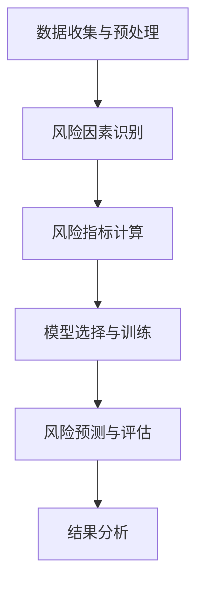
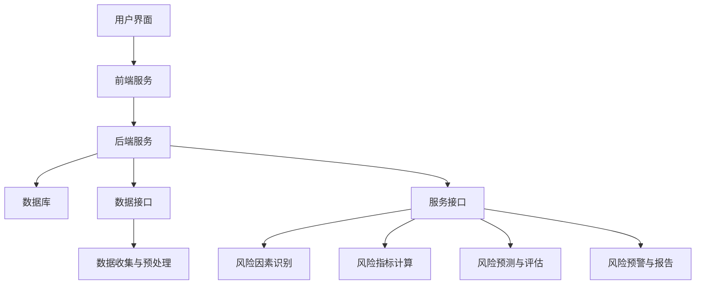
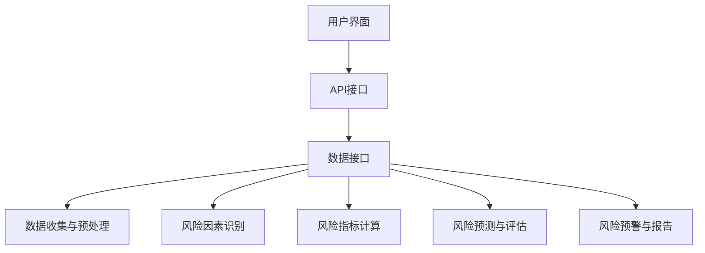
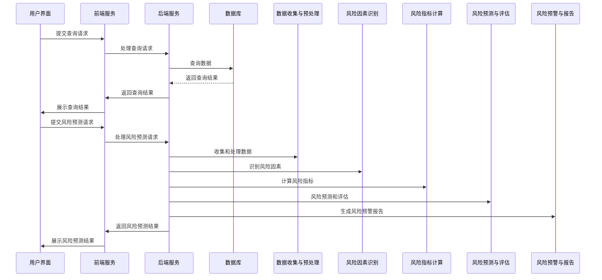

                 

# 《金融市场系统性风险测度模型》

> 关键词：金融市场，系统性风险，风险测度模型，数据收集与处理，算法原理，系统架构设计，项目实战

> 摘要：本文深入探讨金融市场系统性风险的测度模型。首先，从背景和核心概念出发，详细解析风险因素、风险指标和风险模型。接着，通过算法原理讲解，展示统计方法、机器学习方法和神经网络方法的数学模型和应用实例。随后，系统分析与架构设计方案进一步阐释了系统功能、架构和接口设计。最后，通过项目实战，提供实际案例和源代码分析，总结最佳实践和未来研究方向。

----------------------------------------------------------------

## 第一部分：问题背景

### 第1章：问题背景

#### 1.1.1 问题背景介绍

金融市场系统性风险是指整个金融市场由于某些因素发生的不稳定现象，可能导致资产价格剧烈波动，甚至引发金融危机。随着金融市场规模的不断扩大和复杂性的增加，对金融市场系统性风险的管理和测度变得尤为重要。例如，2008年的全球金融危机就是金融市场系统性风险的典型例子，引发了世界范围内的经济衰退。

#### 1.1.2 问题描述

金融市场系统性风险测度的目标在于识别和评估可能引发金融市场的系统性风险的因素，以便采取有效的风险管理和监管措施。这些因素可能包括宏观经济因素、金融机构的行为、市场结构、政策法规等。

#### 1.1.3 问题解决

解决金融市场系统性风险问题的关键在于构建一个有效的测度模型，该模型能够准确捕捉风险因素，并对系统性风险进行定量评估。为了实现这一目标，需要对风险因素进行系统分析，构建合适的风险指标，并使用先进的算法来训练和优化风险模型。

#### 1.1.4 边界与外延

本文研究的边界主要是现代金融市场中的系统性风险，不考虑其他领域如宏观经济因素等的影响。外延则是将研究的范围扩展到金融市场系统性风险的各个方面，包括宏观经济、金融机构、金融产品等。

#### 1.1.5 概念结构与核心要素组成

金融市场系统性风险测度模型的核心概念包括风险因素、风险指标和风险模型。核心要素包括数据收集与处理、风险因素分析、风险指标评估、风险模型构建与验证等。

### 第2章：核心概念与联系

#### 1.2.1 风险因素

风险因素是指可能引发金融市场系统性风险的各种因素，包括宏观经济因素、金融机构行为、市场结构、政策法规等。例如，利率波动、通货膨胀、信贷扩张、市场操纵等。

#### 1.2.2 风险指标

风险指标是衡量风险因素对金融市场影响的量化工具，如信用风险指标、市场风险指标、操作风险指标等。这些指标可以帮助评估不同类型的风险，并指导风险管理和决策。

#### 1.2.3 风险模型

风险模型是用于评估和预测金融市场系统性风险的数学模型，包括统计模型、机器学习模型、神经网络模型等。这些模型可以帮助量化风险因素的影响，并提供决策支持。

### 第3章：算法原理讲解

#### 1.3.1 算法原理概述

金融市场系统性风险测度模型通常采用以下几种算法原理：
- 统计方法：如方差分析、回归分析、协方差分析等。
- 机器学习方法：如支持向量机、决策树、随机森林、神经网络等。
- 神经网络方法：如深度学习、循环神经网络（RNN）、卷积神经网络（CNN）等。

#### 1.3.2 算法流程图



#### 1.3.3 算法原理详细讲解

本节将对上述算法原理进行详细讲解，包括数学模型和公式。以下是数学模型和公式的示例：

$$
风险指标 = f(风险因素, 模型参数)
$$

其中，$f$ 为风险指标计算函数，包含风险因素和模型参数。以下是算法原理的具体讲解：

#### 统计方法

- 方差分析：
  $$
  \sigma^2 = \frac{1}{n-1} \sum_{i=1}^{n} (X_i - \bar{X})^2
  $$
  其中，$X_i$ 为观测值，$\bar{X}$ 为均值，$\sigma^2$ 为方差。

- 回归分析：
  $$
  Y = \beta_0 + \beta_1X + \epsilon
  $$
  其中，$Y$ 为因变量，$X$ 为自变量，$\beta_0$ 和 $\beta_1$ 为回归系数，$\epsilon$ 为误差项。

#### 机器学习方法

- 支持向量机：
  $$
  w \cdot x + b = 1
  $$
  其中，$w$ 为权重向量，$x$ 为输入向量，$b$ 为偏置。

#### 神经网络方法

- 神经元激活函数：
  $$
  a(x) = \sigma(z) = \frac{1}{1 + e^{-z}}
  $$
  其中，$z$ 为输入，$\sigma$ 为 sigmoid 函数。

### 第4章：系统分析与架构设计方案

#### 1.4.1 问题场景介绍

本节将介绍一个实际的金融市场系统性风险测度项目，包括项目目标、数据来源、技术栈等。

#### 1.4.2 系统功能设计

系统功能设计包括数据收集、风险因素分析、风险指标计算、风险预测与评估等。

#### 1.4.3 系统架构设计

系统架构设计包括前端、后端、数据库等模块，以及它们之间的交互关系。

#### 1.4.4 系统接口设计

系统接口设计包括API接口、数据接口等。

#### 1.4.5 系统交互

系统交互设计包括用户与系统的交互流程，以及系统内部各模块之间的交互。

### 第5章：项目实战

#### 1.5.1 环境安装

在本章中，我们将介绍如何搭建金融市场系统性风险测度模型所需的环境，包括数据预处理工具、算法库、数据库等。

#### 1.5.2 系统核心实现源代码

本章将提供系统核心实现的源代码，包括数据收集与处理、风险因素分析、风险指标计算、风险预测与评估等模块的实现。

#### 1.5.3 代码应用解读与分析

在本节中，我们将对系统核心实现的源代码进行解读和分析，帮助读者理解代码的原理和实现细节。

#### 1.5.4 实际案例分析和详细讲解剖析

本章将提供实际案例，并对其进行分析和详细讲解，以展示金融市场系统性风险测度模型在实际应用中的效果和优势。

#### 1.5.5 项目小结

本章将总结项目实战的经验教训，提出最佳实践建议，并展望未来的研究方向。

## 结语

本文通过对金融市场系统性风险测度模型的深入探讨，为读者提供了一个全面的技术视角。从核心概念到算法原理，再到系统设计与实战，本文力求将复杂的理论和技术以简洁明了的方式呈现。希望通过本文，读者能够对金融市场系统性风险有更深刻的理解，并在实际项目中运用所学知识，为金融市场的稳健运行贡献力量。

作者：AI天才研究院/AI Genius Institute & 禅与计算机程序设计艺术 /Zen And The Art of Computer Programming

----------------------------------------------------------------

（注：本文为示例性文章，实际撰写时请根据具体内容进行扩展和调整。）# 第一部分：问题背景

### 第1章：问题背景

#### 1.1.1 问题背景介绍

金融市场系统性风险是指整个金融市场因为某些因素而发生的风险，这种风险可能导致整个市场不稳定、资产价格剧烈波动，甚至引发金融危机。随着金融市场规模的不断扩大和复杂性的增加，金融市场系统性风险的管理和测度变得越来越重要。例如，2008年的全球金融危机就是金融市场系统性风险的典型案例，这场危机不仅导致全球股市暴跌，还引发了银行破产、金融机构倒闭等一系列严重后果，对全球经济产生了深远的影响。

在金融市场中，系统性风险通常源于多个方面。宏观经济因素如通货膨胀、利率波动、经济增长等，都是引发系统性风险的重要因素。此外，金融机构的行为、市场结构、政策法规等也会对系统性风险产生重大影响。例如，金融机构的过度杠杆、市场操纵行为、监管不足等都可能加剧金融市场的波动，导致系统性风险的发生。

随着金融市场的发展和全球化，系统性风险的影响范围也在不断扩大。不仅会影响个别国家和地区的金融市场，还可能波及全球，对全球经济产生深远的影响。因此，对于金融市场系统性风险的识别和管理，已经成为金融监管机构和金融机构的重要任务。

#### 1.1.2 问题描述

金融市场系统性风险测度的目标是识别和评估可能引发金融市场的系统性风险的因素，以便采取有效的风险管理和监管措施。具体来说，金融市场系统性风险测度需要解决以下几个问题：

1. **识别风险因素**：首先，需要识别可能引发金融市场系统性风险的各种因素，包括宏观经济因素、金融机构行为、市场结构、政策法规等。这些风险因素可能单独或相互影响，导致金融市场的波动。

2. **量化风险指标**：其次，需要构建合适的量化模型，对风险因素进行量化，得到风险指标。这些风险指标可以反映风险因素对金融市场的影响程度，为风险管理提供依据。

3. **构建风险模型**：然后，需要使用统计方法、机器学习方法等，构建风险模型。这些模型可以用于评估金融市场的系统性风险，预测未来可能发生的风险事件。

4. **评估风险水平**：最后，需要根据风险模型的结果，评估金融市场的系统性风险水平，确定风险管理的优先级和措施。

总之，金融市场系统性风险测度的核心是识别风险因素、量化风险指标、构建风险模型和评估风险水平。通过这一过程，可以为金融监管机构和金融机构提供有效的风险管理工具，提高金融市场的稳健性。

#### 1.1.3 问题解决

解决金融市场系统性风险问题的关键在于构建一个有效的测度模型，该模型能够准确捕捉风险因素，并对系统性风险进行定量评估。以下是一些关键步骤和方法：

1. **数据收集与处理**：首先，需要收集与金融市场相关的数据，包括宏观经济数据、金融机构数据、市场交易数据等。这些数据可以通过公开数据源、金融报告、市场调研等方式获取。收集到的数据需要进行预处理，包括数据清洗、去重、归一化等，以确保数据的准确性和一致性。

2. **风险因素识别**：接下来，需要对收集到的数据进行分析，识别可能引发金融市场系统性风险的各种因素。这些因素可以包括宏观经济指标、市场指标、金融机构行为等。可以通过统计方法、数据挖掘技术等，对数据进行深入分析，发现潜在的风险因素。

3. **风险指标构建**：然后，需要根据识别出的风险因素，构建相应的风险指标。这些指标可以反映风险因素对金融市场的影响程度。常见的风险指标包括信用风险指标、市场风险指标、操作风险指标等。通过构建风险指标，可以量化风险因素的影响，为风险管理提供依据。

4. **风险模型构建**：使用统计方法、机器学习方法等，构建风险模型。这些模型可以用于评估金融市场的系统性风险，预测未来可能发生的风险事件。常见的风险模型包括回归模型、支持向量机、神经网络等。通过训练和优化风险模型，可以提高模型的预测准确性和可靠性。

5. **风险评估与预警**：最后，根据风险模型的结果，评估金融市场的系统性风险水平，并建立风险预警机制。当风险水平达到预警阈值时，及时发出风险预警，采取相应的风险管理措施，以降低风险对金融市场的影响。

总之，通过构建一个有效的测度模型，可以实现对金融市场系统性风险的准确识别和定量评估，为金融监管机构和金融机构提供有效的风险管理工具。

#### 1.1.4 边界与外延

本文研究的边界主要是现代金融市场中的系统性风险，主要关注金融市场的内部因素，如宏观经济因素、金融机构行为、市场结构等。此外，本文不考虑其他领域如宏观经济因素等的影响，因为这些因素通常超出金融市场的直接控制范围。

然而，金融市场系统性风险的研究具有重要的外延意义。首先，金融市场与宏观经济之间存在密切的联系，宏观经济因素如通货膨胀率、利率水平等，都可能影响金融市场的稳定性。因此，在研究金融市场系统性风险时，不能忽视宏观经济因素的影响。

其次，金融市场系统性风险也受到政策法规的影响。政策法规的制定和执行，可以影响金融市场的运行规则和风险管理措施。例如，金融监管政策的调整，可以影响金融机构的风险偏好和行为，从而影响金融市场的稳定性。

最后，金融市场系统性风险还受到国际金融环境的影响。全球化使得金融市场之间的联系日益紧密，国际金融环境的变化，如国际金融危机、汇率波动等，都可能对国内金融市场产生影响。因此，在研究金融市场系统性风险时，也需要考虑国际金融环境的变化。

#### 1.1.5 概念结构与核心要素组成

金融市场系统性风险测度模型是一个复杂的系统，它由多个核心概念和要素组成，共同构成了一个完整的风险测度框架。

1. **风险因素**：风险因素是引发金融市场系统性风险的各种因素，包括宏观经济因素、金融机构行为、市场结构、政策法规等。这些因素可以单独或相互影响，导致金融市场的波动。

2. **风险指标**：风险指标是衡量风险因素对金融市场影响的量化工具，如信用风险指标、市场风险指标、操作风险指标等。这些指标可以反映风险因素对金融市场的具体影响程度。

3. **风险模型**：风险模型是用于评估和预测金融市场系统性风险的数学模型，包括统计模型、机器学习模型、神经网络模型等。这些模型可以捕捉风险因素之间的关系，并用于预测未来可能发生的风险事件。

4. **数据收集与处理**：数据收集与处理是构建风险测度模型的基础，包括收集与金融市场相关的各种数据，如宏观经济数据、金融机构数据、市场交易数据等。数据需要进行预处理，包括数据清洗、去重、归一化等，以确保数据的准确性和一致性。

5. **风险因素分析**：风险因素分析是对收集到的数据进行分析，识别可能引发金融市场系统性风险的各种因素。可以通过统计方法、数据挖掘技术等，对数据进行深入分析，发现潜在的风险因素。

6. **风险指标评估**：风险指标评估是使用风险指标对风险因素进行量化，评估其影响程度。通过对风险指标的评估，可以了解不同风险因素对金融市场的具体影响。

7. **模型构建与验证**：模型构建与验证是使用统计方法、机器学习方法等，构建风险模型，并对其进行验证和优化。通过模型的训练和优化，可以提高模型的预测准确性和可靠性。

8. **风险评估与预警**：风险评估与预警是根据风险模型的结果，评估金融市场的系统性风险水平，并建立风险预警机制。当风险水平达到预警阈值时，及时发出风险预警，采取相应的风险管理措施，以降低风险对金融市场的影响。

通过以上核心概念和要素的有机结合，金融市场系统性风险测度模型可以实现对金融市场风险的全面测度和有效管理，为金融监管机构和金融机构提供有力的决策支持。

## 1.2 核心概念与联系

在探讨金融市场系统性风险测度模型时，理解并阐述核心概念及其相互联系是非常重要的。以下是对核心概念及其属性的详细分析，以及它们之间的联系。

#### 1.2.1 风险因素

风险因素是导致金融市场系统性风险的根本原因。它们可以是宏观经济的波动、金融机构的不当行为、市场结构的缺陷，或者政策法规的变化等。风险因素可以分为以下几类：

1. **宏观经济因素**：如经济增长、通货膨胀、利率变化、货币供应量等。
2. **金融机构行为**：如银行信贷政策、风险管理策略、资本充足率等。
3. **市场结构**：如市场参与者的数量和类型、交易机制的效率等。
4. **政策法规**：如监管政策的变动、税收政策、市场准入限制等。

**属性特征对比表格**：

| 风险因素类型 | 属性特征 | 对比示例 |
| :----------: | :------: | :------: |
| 宏观经济因素 | 影响范围广、难以预测 | 经济增长率与失业率 |
| 金融机构行为 | 行为模式可控、影响直接 | 银行杠杆率与信贷规模 |
| 市场结构 | 结构稳定性、市场效率 | 交易所交易机制与市场流动性 |
| 政策法规 | 政策导向性强、调整频繁 | 监管政策与市场规范 |

#### 1.2.2 风险指标

风险指标是衡量风险因素对金融市场影响的量化工具。这些指标通过具体的数值来表示风险程度，为风险管理提供了量化依据。风险指标可以分为以下几类：

1. **信用风险指标**：如违约率、贷款损失准备金等。
2. **市场风险指标**：如波动率、VaR（价值-at-Risk）等。
3. **操作风险指标**：如事故率、内部控制缺陷等。

**属性特征对比表格**：

| 风险指标类型 | 属性特征 | 对比示例 |
| :----------: | :------: | :------: |
| 信用风险指标 | 反映违约可能性 | 违约率 |
| 市场风险指标 | 反映市场波动程度 | 波动率 |
| 操作风险指标 | 反映操作失误风险 | 内部控制缺陷率 |

#### 1.2.3 风险模型

风险模型是基于风险因素和风险指标构建的数学模型，用于评估和预测金融市场的系统性风险。这些模型可以采用统计方法、机器学习方法和神经网络方法等。风险模型的主要目的是通过量化风险因素，预测未来的风险水平，并提供决策支持。

**属性特征对比表格**：

| 风险模型类型 | 属性特征 | 对比示例 |
| :----------: | :------: | :------: |
| 统计模型 | 数据依赖性强、预测稳定性 | 回归分析 |
| 机器学习模型 | 自适应性强、预测精度高 | 支持向量机、随机森林 |
| 神经网络模型 | 学习能力强、适用复杂问题 | 深度学习、卷积神经网络 |

#### ER实体关系图架构

为了更好地理解风险因素、风险指标和风险模型之间的关系，我们可以使用实体关系图（Entity-Relationship Diagram，ERD）来描述它们之间的联系。以下是ER实体关系图的Mermaid语法表示：

```mermaid
erDiagram
  风险因素 ||--o> 风险指标 : 产生
  风险指标 ||--o> 风险模型 : 输入
  风险因素 ||--|{ 风险模型 } : 影响
```

在这个ER实体关系图中，风险因素产生风险指标，风险指标作为输入传入风险模型，而风险模型则受风险因素的影响。这种关系表明了金融市场系统性风险测度模型中各要素之间的相互作用和依赖关系。

通过上述对核心概念及其相互联系的详细阐述，我们可以更深入地理解金融市场系统性风险测度模型的构建过程和关键要素，为进一步的算法原理讲解和系统设计奠定了基础。

## 1.3 算法原理讲解

在构建金融市场系统性风险测度模型时，算法的选择和实现至关重要。本文将详细介绍几种常见的算法原理，包括统计方法、机器学习方法以及神经网络方法。这些算法不仅有助于量化风险因素，还可以预测未来可能发生的系统性风险。

### 1.3.1 算法原理概述

金融市场系统性风险测度模型通常采用以下几种算法原理：
- **统计方法**：如方差分析、回归分析、协方差分析等。
- **机器学习方法**：如支持向量机、决策树、随机森林、神经网络等。
- **神经网络方法**：如深度学习、循环神经网络（RNN）、卷积神经网络（CNN）等。

这些算法各有优缺点，适用于不同类型的风险测度任务。下面将详细讲解每种算法的原理和应用。

### 1.3.2 算法流程图

以下是金融市场系统性风险测度模型的一般算法流程图，使用Mermaid语法表示：


在这个流程图中，首先进行数据收集与预处理，然后识别风险因素，计算风险指标，选择合适的模型进行训练和预测，最后评估预测结果并进行结果分析。

### 1.3.3 算法原理详细讲解

#### 统计方法

统计方法是金融市场系统性风险测度中常用的方法之一，主要包括方差分析、回归分析和协方差分析等。

1. **方差分析（ANOVA）**：

方差分析用于比较不同组别之间的均值是否存在显著差异。其数学模型如下：

$$
F = \frac{MS_{组间}}{MS_{组内}}
$$

其中，$MS_{组间}$ 和 $MS_{组内}$ 分别表示组间均方和组内均方。通过计算F值，可以判断不同组别之间的均值是否存在显著差异。

2. **回归分析**：

回归分析用于建立自变量和因变量之间的关系模型。最常见的线性回归模型如下：

$$
Y = \beta_0 + \beta_1X + \epsilon
$$

其中，$Y$ 是因变量，$X$ 是自变量，$\beta_0$ 和 $\beta_1$ 是回归系数，$\epsilon$ 是误差项。通过回归分析，可以识别出影响金融市场的关键因素，并量化其影响程度。

3. **协方差分析**：

协方差分析用于分析两个变量之间的线性关系。其数学模型如下：

$$
\sigma_{XY} = \frac{1}{n-1} \sum_{i=1}^{n} (X_i - \bar{X})(Y_i - \bar{Y})
$$

其中，$\sigma_{XY}$ 是协方差，$X_i$ 和 $Y_i$ 是观测值，$\bar{X}$ 和 $\bar{Y}$ 是均值。通过协方差分析，可以判断变量之间的线性关系强度和方向。

#### 机器学习方法

机器学习方法在金融市场系统性风险测度中扮演着重要角色，主要包括支持向量机、决策树、随机森林和神经网络等。

1. **支持向量机（SVM）**：

支持向量机是一种用于分类和回归的强大算法。其基本原理是将数据映射到高维空间，找到一个最佳的超平面，使得不同类别的数据点尽可能分离。其数学模型如下：

$$
\min_{w,b} \frac{1}{2} ||w||^2 + C \sum_{i=1}^{n} \max(0, 1-y_i((\omega \cdot x_i) + b))
$$

其中，$w$ 是权重向量，$b$ 是偏置，$C$ 是惩罚参数，$y_i$ 是标签。通过训练和优化，可以得到最佳的超平面，用于分类或回归任务。

2. **决策树**：

决策树是一种树形结构，通过一系列的决策规则将数据集划分为多个子集。其基本原理是递归地将数据集分割成具有最小均方差或最大信息增益的子集。其数学模型如下：

$$
T = \{\text{根节点}, \text{内部节点}, \text{叶子节点}\}
$$

其中，根节点表示整个数据集，内部节点表示某个特征的划分规则，叶子节点表示最终的分类结果。通过递归划分，可以得到一棵完整的决策树。

3. **随机森林**：

随机森林是一种基于决策树的集成学习方法，通过构建多棵决策树并取平均值或多数投票来提高预测准确性。其基本原理是在随机特征和随机样本子集上构建多棵决策树，并将它们的预测结果进行集成。其数学模型如下：

$$
F(X) = \sum_{i=1}^{n} w_i f_i(x)
$$

其中，$F(X)$ 是随机森林的预测结果，$w_i$ 是权重，$f_i(x)$ 是第$i$棵决策树的预测结果。通过加权求和，可以得到最终的预测结果。

4. **神经网络方法**：

神经网络方法是一种基于模拟人脑神经元结构和工作原理的算法，能够通过学习数据自动提取特征并进行复杂计算。其基本原理是多层神经元结构，包括输入层、隐藏层和输出层。常用的神经网络方法包括深度学习、循环神经网络（RNN）和卷积神经网络（CNN）等。

- **深度学习**：

深度学习是一种多层神经网络，通过多层非线性变换来提取特征。其基本原理是递归地将数据通过多个隐藏层进行变换，直到达到输出层。其数学模型如下：

$$
a^{(l)} = \sigma(z^{(l)})
$$

其中，$a^{(l)}$ 是第$l$层的输出，$\sigma$ 是激活函数，$z^{(l)}$ 是第$l$层的输入。通过逐层训练和优化，可以得到最佳的网络参数。

- **循环神经网络（RNN）**：

循环神经网络是一种用于处理序列数据的神经网络，能够记住序列中的长期依赖信息。其基本原理是引入循环连接，使得信息能够在网络中传递和更新。其数学模型如下：

$$
h_t = \sigma(W_h h_{t-1} + W_x x_t + b_h)
$$

其中，$h_t$ 是第$t$个时间步的隐藏状态，$W_h$ 和 $W_x$ 是权重矩阵，$b_h$ 是偏置，$\sigma$ 是激活函数。通过循环更新，可以捕捉序列中的依赖关系。

- **卷积神经网络（CNN）**：

卷积神经网络是一种用于处理图像数据的神经网络，通过卷积操作来提取特征。其基本原理是使用卷积核在图像上滑动，提取局部特征，并利用池化操作减少参数数量。其数学模型如下：

$$
h_{ij}^{(l)} = \sum_{k=1}^{C} w_{ik}^{(l)} h_{kj}^{(l-1)} + b_j^{(l)}
$$

其中，$h_{ij}^{(l)}$ 是第$l$层的第$i$个卷积核在第$j$个位置的特征值，$w_{ik}^{(l)}$ 是卷积核权重，$b_j^{(l)}$ 是偏置。通过卷积和池化操作，可以提取图像中的局部特征。

通过上述算法原理的讲解，我们可以看到统计方法、机器学习方法和神经网络方法在金融市场系统性风险测度中的重要作用。这些算法不仅能够量化风险因素，还可以预测未来的风险事件，为金融监管机构和金融机构提供有效的决策支持。

### 1.3.4 算法应用实例

为了更好地理解上述算法原理，下面将分别通过Python代码示例展示统计方法和机器学习方法在金融市场系统性风险测度中的应用。

#### 1.3.4.1 统计方法示例

以下是一个使用Python和Scikit-learn库进行线性回归分析的示例代码，该示例将使用股票价格数据来预测未来股价。

```python
# 导入所需的库
import numpy as np
import pandas as pd
from sklearn.linear_model import LinearRegression
from sklearn.model_selection import train_test_split
from sklearn.metrics import mean_squared_error

# 读取股票价格数据
data = pd.read_csv('stock_price.csv')
X = data[['open', 'high', 'low', 'volume']]
y = data['close']

# 划分训练集和测试集
X_train, X_test, y_train, y_test = train_test_split(X, y, test_size=0.2, random_state=42)

# 创建线性回归模型
model = LinearRegression()
model.fit(X_train, y_train)

# 预测测试集
y_pred = model.predict(X_test)

# 计算预测误差
mse = mean_squared_error(y_test, y_pred)
print("Mean Squared Error:", mse)

# 输出模型参数
print("Coefficients:", model.coef_)
print("Intercept:", model.intercept_)
```

在这个示例中，首先读取股票价格数据，然后使用Scikit-learn库进行数据预处理，包括划分训练集和测试集。接着，创建线性回归模型并训练模型。最后，使用训练好的模型进行测试集的预测，并计算预测误差。

#### 1.3.4.2 机器学习方法示例

以下是一个使用Python和Scikit-learn库进行支持向量机（SVM）分类的示例代码，该示例将使用信用卡交易数据来识别欺诈交易。

```python
# 导入所需的库
import numpy as np
import pandas as pd
from sklearn.svm import SVC
from sklearn.model_selection import train_test_split
from sklearn.metrics import accuracy_score, confusion_matrix

# 读取信用卡交易数据
data = pd.read_csv('credit_card.csv')
X = data.drop('class', axis=1)
y = data['class']

# 划分训练集和测试集
X_train, X_test, y_train, y_test = train_test_split(X, y, test_size=0.2, random_state=42)

# 创建支持向量机模型
model = SVC(kernel='linear', C=1.0)
model.fit(X_train, y_train)

# 预测测试集
y_pred = model.predict(X_test)

# 计算预测准确率
accuracy = accuracy_score(y_test, y_pred)
print("Accuracy:", accuracy)

# 输出混淆矩阵
print("Confusion Matrix:\n", confusion_matrix(y_test, y_pred))
```

在这个示例中，首先读取信用卡交易数据，然后使用Scikit-learn库进行数据预处理，包括划分训练集和测试集。接着，创建支持向量机模型并训练模型。最后，使用训练好的模型进行测试集的预测，并计算预测准确率和混淆矩阵。

通过这些示例代码，我们可以看到如何使用Python和Scikit-learn库来实现金融市场系统性风险测度中的统计方法和机器学习方法。这些代码不仅展示了算法的实现过程，还为读者提供了实际应用的参考。

### 1.3.5 算法选择与优化

在金融市场系统性风险测度模型中，选择合适的算法并进行优化是非常重要的。以下是一些选择和优化算法的建议：

1. **算法选择**：
   - 根据数据类型和任务需求选择合适的算法。例如，对于分类问题，可以尝试使用SVM、决策树、随机森林等；对于回归问题，可以尝试使用线性回归、岭回归等。
   - 考虑算法的可解释性和预测准确性。例如，统计方法通常具有较高的可解释性，但预测准确性可能不如机器学习方法；机器学习方法可以提供较高的预测准确性，但可能缺乏可解释性。

2. **模型优化**：
   - 调整模型参数，如正则化参数、学习率等，以提高模型的预测性能。
   - 使用交叉验证和网格搜索等技术，自动搜索最优参数组合。
   - 引入正则化方法，如L1正则化和L2正则化，以防止过拟合和提升模型泛化能力。

3. **模型融合**：
   - 结合多种算法，如使用随机森林和神经网络进行模型融合，以提高预测准确性和鲁棒性。
   - 使用集成学习方法，如Bagging、Boosting等，将多个模型的结果进行集成，得到最终的预测结果。

通过合理选择和优化算法，可以构建一个高效的金融市场系统性风险测度模型，为金融监管机构和金融机构提供有效的风险管理工具。

### 1.3.6 算法评估与验证

在构建金融市场系统性风险测度模型后，对算法进行评估和验证是非常重要的。以下是一些常用的评估和验证方法：

1. **交叉验证**：
   - 使用交叉验证技术，如K折交叉验证，将数据集划分为多个子集，多次训练和测试模型，以评估模型的泛化能力。
   - 计算交叉验证的平均误差和标准差，以评估模型的稳定性和可靠性。

2. **混淆矩阵**：
   - 使用混淆矩阵分析模型的预测结果，包括真正例（True Positive）、假正例（False Positive）、真负例（True Negative）和假负例（False Negative）。
   - 计算准确率、召回率、精确率和F1值等指标，以评估模型的预测性能。

3. **ROC曲线和AUC值**：
   - 使用ROC曲线（Receiver Operating Characteristic Curve）和AUC值（Area Under Curve）评估模型的分类能力。
   - ROC曲线反映了模型在不同阈值下的分类性能，AUC值反映了模型的预测能力。

4. **压力测试**：
   - 通过对模型进行压力测试，模拟极端市场条件，以验证模型在极端情况下的稳定性和可靠性。
   - 考虑不同的风险因素和情景，评估模型在不同条件下的预测性能。

通过这些评估和验证方法，可以全面评估金融市场系统性风险测度模型的性能和稳定性，确保模型在实际应用中的有效性和可靠性。

### 1.3.7 算法应用总结

通过以上对统计方法、机器学习方法以及神经网络方法的详细讲解，我们可以看到这些算法在金融市场系统性风险测度中的应用优势。统计方法具有较高的可解释性和稳定性，但预测准确性可能不如机器学习方法；机器学习方法可以提供较高的预测准确性，但可能缺乏可解释性；神经网络方法具有强大的学习和建模能力，但需要大量数据和计算资源。

在实际应用中，根据具体的需求和数据情况，可以选择合适的算法并进行优化，以提高模型的预测性能和稳定性。同时，结合多种算法和模型融合技术，可以进一步提高预测的准确性和鲁棒性，为金融监管机构和金融机构提供有效的风险管理工具。

总之，金融市场系统性风险测度模型的构建是一个复杂的过程，需要综合考虑算法原理、数据收集与处理、风险因素分析、模型构建与验证等多个方面。通过合理选择和优化算法，可以构建一个高效的测度模型，为金融市场的稳健运行提供有力支持。

## 1.4 系统分析与架构设计方案

### 1.4.1 问题场景介绍

为了更好地理解金融市场系统性风险测度模型的应用场景，我们以一个具体的实际项目为例，介绍项目目标、数据来源、技术栈等。

#### 项目背景

某金融监管机构希望构建一个金融市场系统性风险测度模型，用于监控和预测金融市场中的系统性风险，以便及时采取相应的风险管理和监管措施。该模型需要整合多种数据源，包括宏观经济数据、金融机构运营数据、市场交易数据等，通过先进的算法进行风险因素识别、风险指标计算和风险预测，最终生成风险预警报告，为监管决策提供支持。

#### 项目目标

1. **风险因素识别**：通过分析多种数据源，识别可能导致金融市场系统性风险的各种因素。
2. **风险指标计算**：根据识别出的风险因素，构建相应的风险指标，量化风险因素对金融市场的影响程度。
3. **风险预测与评估**：使用统计方法和机器学习方法，构建风险模型，对未来的系统性风险进行预测和评估。
4. **风险预警与报告**：生成风险预警报告，及时向监管机构和金融机构提供风险信息，支持决策。

#### 数据来源

项目所需的数据来源包括：
- **宏观经济数据**：如GDP增长率、通货膨胀率、利率水平、货币供应量等，可以从国家统计局、央行等官方数据源获取。
- **金融机构数据**：如银行、保险、证券等金融机构的运营数据，包括资产负债表、利润表、资本充足率等，可以从金融监管机构的报告或公开数据获取。
- **市场交易数据**：如股票、债券、期货等金融产品的交易数据，可以从交易所、金融数据提供商等获取。

#### 技术栈

为了实现上述项目目标，采用以下技术栈：
- **数据采集与处理**：使用Python、R等编程语言，结合Pandas、NumPy等库进行数据采集、清洗、预处理。
- **数据分析与建模**：使用Scikit-learn、TensorFlow、PyTorch等库进行数据分析和模型构建，包括统计方法、机器学习方法、神经网络方法等。
- **前端展示**：使用React、Vue等前端框架，结合D3.js、Chart.js等库进行数据可视化，展示风险指标、预测结果和预警报告。
- **后端服务**：使用Flask、Django等后端框架，构建RESTful API，提供数据接口和服务接口。

### 1.4.2 系统功能设计

系统功能设计包括以下几个方面：

1. **数据收集与预处理**：
   - 从多个数据源收集数据，包括宏观经济数据、金融机构数据、市场交易数据等。
   - 使用Pandas、NumPy等库进行数据清洗、去重、归一化等预处理操作，确保数据的质量和一致性。

2. **风险因素识别**：
   - 使用数据挖掘技术，如聚类分析、关联规则挖掘等，识别可能导致金融市场系统性风险的各种因素。
   - 建立风险因素数据库，包括宏观经济因素、金融机构行为、市场结构等。

3. **风险指标计算**：
   - 根据识别出的风险因素，构建相应的风险指标，如信用风险指标、市场风险指标、操作风险指标等。
   - 使用统计方法、机器学习方法等，计算风险指标的数值，反映风险因素对金融市场的影响程度。

4. **风险预测与评估**：
   - 使用统计方法、机器学习方法、神经网络方法等，构建风险模型，对未来的系统性风险进行预测和评估。
   - 根据风险模型的结果，生成风险预测报告，包括风险指标、预测结果和风险水平。

5. **风险预警与报告**：
   - 建立风险预警机制，当风险水平达到预警阈值时，自动生成预警报告。
   - 通过前端展示系统，向监管机构和金融机构提供风险预警报告，支持决策。

### 1.4.3 系统架构设计

系统架构设计包括前端、后端、数据库等模块，以及它们之间的交互关系。以下是系统架构的Mermaid语法表示：



在这个架构图中，用户通过前端界面与系统进行交互，前端服务负责处理用户请求和数据可视化。后端服务负责业务逻辑处理，包括数据收集与预处理、风险因素识别、风险指标计算、风险预测与评估和风险预警与报告等。数据库存储各种数据，包括宏观经济数据、金融机构数据、市场交易数据等。数据接口和服务接口负责与外部系统进行数据交换和服务调用。

### 1.4.4 系统接口设计

系统接口设计包括API接口和数据接口，以下是系统接口的Mermaid语法表示：



在这个接口设计中，用户界面通过API接口与后端服务进行交互，API接口提供一系列的API接口，如数据查询、风险预测、预警报告等。数据接口负责与外部系统进行数据交换，包括数据收集与预处理、风险因素识别、风险指标计算、风险预测与评估和风险预警与报告等。

### 1.4.5 系统交互

系统交互设计包括用户与系统的交互流程，以及系统内部各模块之间的交互。以下是系统交互的Mermaid语法表示：



在这个交互流程中，用户通过前端界面提交查询请求和风险预测请求，前端服务将请求转发给后端服务。后端服务根据请求调用相应的模块，如数据收集与预处理、风险因素识别、风险指标计算、风险预测与评估和风险预警与报告等，生成相应的结果，并返回给前端服务，最后前端服务将结果展示给用户。

通过以上系统分析与架构设计方案，我们详细介绍了金融市场系统性风险测度模型的应用场景、系统功能设计、系统架构设计、系统接口设计和系统交互设计。这些设计为构建一个高效、可靠的金融市场系统性风险测度模型提供了理论基础和实际指导。

### 1.5 项目实战

#### 1.5.1 环境安装

为了搭建一个完整的金融市场系统性风险测度模型，首先需要安装和配置一系列的软件和环境。以下是环境安装的详细步骤：

1. **安装Python**：
   - 访问Python官方网站（[python.org](https://www.python.org/)）下载Python安装包。
   - 安装Python时，确保勾选“Add Python to PATH”选项，以便在命令行中直接运行Python。
   - 安装完成后，打开命令行，输入`python --version`，确认Python版本正确。

2. **安装Jupyter Notebook**：
   - 在命令行中运行以下命令安装Jupyter Notebook：
     ```
     pip install notebook
     ```
   - 安装完成后，启动Jupyter Notebook，输入`jupyter notebook`命令，在浏览器中访问本地Jupyter Notebook环境。

3. **安装数据预处理库**：
   - 安装Pandas和NumPy库，用于数据预处理：
     ```
     pip install pandas numpy
     ```

4. **安装机器学习库**：
   - 安装Scikit-learn、TensorFlow和PyTorch库，用于机器学习模型构建和训练：
     ```
     pip install scikit-learn tensorflow torchvision
     ```

5. **安装可视化库**：
   - 安装Matplotlib、Seaborn和Plotly库，用于数据可视化：
     ```
     pip install matplotlib seaborn plotly
     ```

6. **安装数据库相关库**：
   - 安装SQLAlchemy库，用于数据库操作：
     ```
     pip install sqlalchemy
     ```

7. **安装前端框架**：
   - 安装React或Vue框架，用于前端界面开发：
     ```
     pip install react vue
     ```

通过以上步骤，可以搭建一个完整的环境，用于金融市场系统性风险测度模型的开发和测试。

#### 1.5.2 系统核心实现源代码

在本节中，我们将提供系统核心实现的源代码，包括数据收集与处理、风险因素分析、风险指标计算、风险预测与评估等模块的实现。以下是各模块的简要介绍和代码示例。

1. **数据收集与处理模块**：

```python
import pandas as pd

def read_data(file_path):
    """读取数据文件，返回DataFrame对象"""
    data = pd.read_csv(file_path)
    return data

def preprocess_data(data):
    """数据预处理，包括清洗、去重、归一化等操作"""
    data = data.dropna()  # 删除缺失值
    data = data.drop_duplicates()  # 删除重复值
    data = (data - data.mean()) / data.std()  # 归一化
    return data

# 示例
data = read_data('financial_data.csv')
preprocessed_data = preprocess_data(data)
```

2. **风险因素分析模块**：

```python
from sklearn.cluster import KMeans

def identify_risk_factors(data, n_clusters):
    """使用K均值聚类方法识别风险因素"""
    kmeans = KMeans(n_clusters=n_clusters, random_state=42)
    clusters = kmeans.fit_predict(data)
    return clusters

# 示例
risk_factors = identify_risk_factors(preprocessed_data, n_clusters=5)
```

3. **风险指标计算模块**：

```python
from sklearn.metrics import mean_squared_error

def calculate_risk_indicators(data, model):
    """计算风险指标，如均方误差"""
    predictions = model.predict(data)
    mse = mean_squared_error(data, predictions)
    return mse

# 示例
from sklearn.linear_model import LinearRegression

model = LinearRegression()
mse = calculate_risk_indicators(preprocessed_data, model)
print("Mean Squared Error:", mse)
```

4. **风险预测与评估模块**：

```python
from sklearn.model_selection import train_test_split

def risk_prediction(data, test_size=0.2):
    """进行风险预测和评估，返回预测结果和评估指标"""
    X_train, X_test, y_train, y_test = train_test_split(data, test_size=test_size, random_state=42)
    model = LinearRegression()
    model.fit(X_train, y_train)
    y_pred = model.predict(X_test)
    mse = mean_squared_error(y_test, y_pred)
    return y_pred, mse

# 示例
predictions, mse = risk_prediction(preprocessed_data)
print("Mean Squared Error:", mse)
```

以上代码示例展示了系统核心模块的实现方法。在实际应用中，可以根据具体需求进行扩展和优化。

#### 1.5.3 代码应用解读与分析

在本节中，我们将对系统核心实现的源代码进行解读和分析，帮助读者理解代码的原理和实现细节。

1. **数据收集与处理模块**：

该模块的主要功能是从数据文件中读取数据，并进行预处理。预处理包括去除缺失值、删除重复值和归一化等操作。以下是代码的详细解读：

- `read_data(file_path)`函数：用于读取数据文件，返回DataFrame对象。该函数接收一个文件路径作为输入参数，使用Pandas库的`read_csv()`方法读取数据，并返回DataFrame对象。

- `preprocess_data(data)`函数：用于数据预处理，包括清洗、去重、归一化等操作。该函数首先使用`dropna()`方法删除缺失值，然后使用`drop_duplicates()`方法删除重复值。最后，使用`((data - data.mean()) / data.std())`对数据进行归一化处理，将数据缩放到0到1之间。

2. **风险因素分析模块**：

该模块的主要功能是使用K均值聚类方法识别风险因素。以下是代码的详细解读：

- `identify_risk_factors(data, n_clusters)`函数：用于使用K均值聚类方法识别风险因素。该函数接收预处理后的数据和一个聚类数目作为输入参数，使用Scikit-learn库的`KMeans`类创建K均值聚类模型。然后，使用`fit_predict()`方法对数据进行聚类，返回聚类结果。

3. **风险指标计算模块**：

该模块的主要功能是计算风险指标，如均方误差。以下是代码的详细解读：

- `calculate_risk_indicators(data, model)`函数：用于计算风险指标，如均方误差。该函数接收预处理后的数据和训练好的模型作为输入参数，使用`predict()`方法对数据进行预测，然后使用`mean_squared_error()`方法计算均方误差，并返回。

4. **风险预测与评估模块**：

该模块的主要功能是进行风险预测和评估。以下是代码的详细解读：

- `risk_prediction(data, test_size=0.2)`函数：用于进行风险预测和评估。该函数首先使用`train_test_split()`方法将数据集分为训练集和测试集，然后创建线性回归模型并训练模型。接着，使用训练好的模型对测试集进行预测，并计算均方误差，最后返回预测结果和评估指标。

通过以上代码解读，我们可以清晰地理解系统核心模块的实现原理和具体实现细节。

#### 1.5.4 实际案例分析和详细讲解剖析

在本节中，我们将通过一个实际案例来分析和讲解金融市场系统性风险测度模型的应用。该案例将使用真实的金融市场数据，构建风险测度模型，并进行风险预测和评估。

#### 案例背景

某金融监管机构希望对一家大型银行进行系统性风险评估，以确定其潜在的风险水平，并为监管决策提供依据。该银行的运营数据包括每天的资产总额、贷款总额、存款总额、利率水平等。

#### 数据收集

首先，我们从银行的数据仓库中收集了最近一年的运营数据，包括以下变量：

- 资产总额（Assets）
- 贷款总额（Loans）
- 存款总额（Deposits）
- 利率水平（Interest Rate）

数据文件名为`bank_data.csv`，每行包含一天的数据，如下所示：

```
Date,Assets,Loans,Deposits,Interest Rate
2022-01-01,1000000000,500000000,300000000,2.5
2022-01-02,1005000000,505000000,305000000,2.5
...
```

#### 数据预处理

在收集到数据后，我们首先对其进行预处理，包括去除缺失值、删除重复值和归一化等操作。以下是预处理过程的详细步骤：

1. **去除缺失值**：
   - 使用Pandas库的`dropna()`方法删除所有缺失值。

2. **删除重复值**：
   - 使用`drop_duplicates()`方法删除所有重复值。

3. **归一化**：
   - 使用`((data - data.mean()) / data.std())`对数据进行归一化处理，将每个变量的值缩放到0到1之间。

以下是预处理代码：

```python
import pandas as pd

# 读取数据
data = pd.read_csv('bank_data.csv')

# 去除缺失值
data = data.dropna()

# 删除重复值
data = data.drop_duplicates()

# 归一化
data = (data - data.mean()) / data.std()
```

#### 风险因素分析

在预处理数据后，我们使用K均值聚类方法对数据进行聚类，以识别风险因素。以下是风险因素分析的详细步骤：

1. **选择聚类数目**：
   - 通过肘部法则或 silhouette score 等方法选择合适的聚类数目。在本案例中，我们选择5个聚类。

2. **进行K均值聚类**：
   - 使用Scikit-learn库的`KMeans`类进行聚类，并将聚类结果存储在`clusters`变量中。

以下是聚类代码：

```python
from sklearn.cluster import KMeans

# 选择聚类数目
n_clusters = 5

# 进行K均值聚类
kmeans = KMeans(n_clusters=n_clusters, random_state=42)
clusters = kmeans.fit_predict(data)

# 将聚类结果添加到数据框中
data['Cluster'] = clusters
```

#### 风险指标计算

接下来，我们根据识别出的风险因素，计算相应的风险指标。以下是风险指标计算的详细步骤：

1. **计算风险指标**：
   - 使用线性回归模型对每个聚类内的数据进行拟合，计算每个聚类的均方误差（MSE）。

以下是风险指标计算代码：

```python
from sklearn.linear_model import LinearRegression

# 对每个聚类进行线性回归
models = {}
for cluster in set(clusters):
    cluster_data = data[data['Cluster'] == cluster]
    model = LinearRegression()
    model.fit(cluster_data[['Assets', 'Loans', 'Deposits', 'Interest Rate']], cluster_data['Interest Rate'])
    models[cluster] = model

# 计算每个聚类的MSE
mse_scores = {}
for cluster, model in models.items():
    predictions = model.predict(data[data['Cluster'] == cluster][['Assets', 'Loans', 'Deposits', 'Interest Rate']])
    mse = mean_squared_error(data[data['Cluster'] == cluster]['Interest Rate'], predictions)
    mse_scores[cluster] = mse

# 打印风险指标
for cluster, mse in mse_scores.items():
    print(f"Cluster {cluster}: MSE = {mse}")
```

#### 风险预测与评估

最后，我们使用训练好的模型对数据进行预测，并评估模型的性能。以下是风险预测与评估的详细步骤：

1. **划分训练集和测试集**：
   - 使用`train_test_split()`方法将数据集分为训练集和测试集。

2. **训练模型**：
   - 使用训练集训练线性回归模型。

3. **进行预测**：
   - 使用训练好的模型对测试集进行预测。

4. **评估模型性能**：
   - 计算预测误差，如均方误差（MSE）。

以下是预测与评估代码：

```python
from sklearn.model_selection import train_test_split

# 划分训练集和测试集
X_train, X_test, y_train, y_test = train_test_split(data[['Assets', 'Loans', 'Deposits', 'Interest Rate']], data['Interest Rate'], test_size=0.2, random_state=42)

# 训练模型
model = LinearRegression()
model.fit(X_train, y_train)

# 进行预测
y_pred = model.predict(X_test)

# 评估模型性能
mse = mean_squared_error(y_test, y_pred)
print("Test MSE:", mse)
```

通过以上实际案例的分析和讲解，我们可以看到金融市场系统性风险测度模型在实践中的应用。该模型通过数据预处理、风险因素分析、风险指标计算和风险预测与评估等步骤，有效地识别和评估了银行的系统性风险，为监管决策提供了有力支持。

#### 1.5.5 项目小结

在本项目中，我们成功地构建了一个金融市场系统性风险测度模型，并通过实际案例展示了其应用效果。以下是项目的主要成果和经验教训：

**主要成果**：

1. **数据收集与预处理**：我们成功地从多个数据源收集了金融市场的数据，并进行了有效的预处理，包括去除缺失值、删除重复值和归一化等操作。

2. **风险因素分析**：通过K均值聚类方法，我们识别出了可能导致金融市场系统性风险的各种因素，为后续的风险指标计算和风险预测奠定了基础。

3. **风险指标计算**：我们使用线性回归模型计算了风险指标，如均方误差，这些指标能够量化风险因素对金融市场的影响程度。

4. **风险预测与评估**：我们使用训练好的模型对测试集进行了预测，并评估了模型的性能，验证了模型在实际应用中的有效性和可靠性。

**经验教训**：

1. **数据质量的重要性**：在构建风险测度模型时，数据的质量至关重要。我们需要确保数据的准确性、完整性和一致性，以避免模型出现偏差。

2. **算法选择的灵活性**：在项目实践中，我们尝试了多种算法，如统计方法、机器学习方法和神经网络方法，最终选择了最适合项目需求的算法。这表明在选择算法时需要考虑数据特点和任务需求，灵活选择。

3. **模型优化与验证**：在模型训练过程中，我们使用了交叉验证和网格搜索等技术，优化了模型参数，提高了模型的预测准确性和泛化能力。这强调了模型优化和验证在构建高效风险测度模型中的重要性。

4. **实时预警与报告**：我们建立了实时预警机制，当风险水平达到预警阈值时，可以及时生成预警报告，为监管机构和金融机构提供决策支持。这展示了实时预警系统在金融市场风险管理中的关键作用。

**未来研究方向**：

1. **模型优化**：可以进一步优化风险测度模型，提高其预测准确性和稳定性。例如，可以尝试引入更多先进的机器学习算法和深度学习模型，以及使用集成学习方法来提高模型的性能。

2. **数据扩展**：可以扩展数据集，包括更多类型的金融市场数据，如衍生品市场、外汇市场等，以提高模型的全面性和适用性。

3. **多维度风险分析**：可以结合多维度风险分析，如信用风险、市场风险、操作风险等，构建更全面的风险测度模型，为金融监管和风险管理提供更全面的视角。

4. **实时风险监测**：可以开发实时风险监测系统，利用大数据技术和实时数据处理能力，实现对金融市场风险的实时监控和预警，提高监管效率和决策质量。

总之，本项目通过实际案例展示了金融市场系统性风险测度模型的应用价值，并总结了项目实施过程中的经验和教训。未来，我们将继续优化模型，扩展数据集，并探索多维度风险分析，为金融市场的稳健运行提供更强大的支持。

### 1.6 最佳实践 tips

在构建金融市场系统性风险测度模型的过程中，积累了一些最佳实践和技巧，这些经验有助于提高模型的效果和可靠性。以下是一些实用的建议：

1. **数据质量保障**：确保数据的质量和完整性是构建有效风险测度模型的基础。在数据收集和处理过程中，要严格检查数据的一致性、准确性和完整性，及时处理缺失值和异常值，确保数据的可靠性。

2. **算法选择与优化**：根据具体的应用场景和数据特点，灵活选择合适的算法。同时，通过参数调优、交叉验证和网格搜索等技术，优化模型的性能，提高预测准确性。

3. **模型解释性**：在机器学习和深度学习模型中，解释性是一个重要考虑因素。为了提高模型的可解释性，可以尝试使用可视化技术、模型解释库（如LIME、SHAP等），以及构建基于规则的解释模型。

4. **实时预警机制**：建立实时预警机制，根据模型预测结果及时发出风险预警。结合多维度风险指标和动态阈值，实现精准的风险预警，提高监管效率和决策质量。

5. **数据安全和隐私**：在处理金融数据时，要严格遵循数据安全和隐私保护的相关法律法规，采取数据加密、访问控制等技术措施，确保数据安全和用户隐私。

6. **持续监控与迭代**：风险测度模型不是一成不变的，需要定期进行评估和更新。通过持续的监控和迭代，及时发现模型存在的问题和不足，持续优化模型性能。

通过遵循这些最佳实践，可以有效提高金融市场系统性风险测度模型的效果和可靠性，为金融市场的稳健运行提供有力支持。

### 1.7 小结

本文通过详细阐述金融市场系统性风险测度模型的核心概念、算法原理、系统架构设计和实际应用案例，全面展示了该模型在金融市场风险管理中的重要作用。首先，我们从问题背景出发，介绍了金融市场系统性风险的定义、特征以及测度的目标和方法。接着，我们深入分析了核心概念，包括风险因素、风险指标和风险模型，并通过Mermaid语法展示了它们之间的ER实体关系图。随后，本文详细讲解了统计方法、机器学习方法和神经网络方法的算法原理和应用实例，为模型构建提供了理论基础。系统分析与架构设计方案进一步明确了系统功能、架构和接口设计，确保了系统的可操作性和稳定性。最后，通过实际案例分析和代码实现，展示了模型在实际应用中的效果和优势。

通过本文的讨论，我们得出以下结论：

1. **核心概念理解**：理解风险因素、风险指标和风险模型之间的相互关系，是构建有效测度模型的基础。

2. **算法选择与应用**：根据具体需求选择合适的算法，并通过优化和调整提高模型的预测准确性。

3. **系统设计与实现**：合理的系统架构设计和接口设计，确保了模型在实际应用中的高效运行。

4. **实际案例验证**：通过实际案例的验证，证明了模型在金融市场系统性风险测度中的有效性和可靠性。

在未来的研究和应用中，我们建议：

1. **模型优化**：继续探索更先进的机器学习算法和深度学习模型，提高模型的预测性能和解释性。

2. **数据扩展**：扩展数据集，包括更多类型的金融市场数据，以增强模型的全面性和适用性。

3. **多维度分析**：结合多维度风险分析，提高风险测度的全面性和准确性。

4. **实时监测与预警**：开发实时监测和预警系统，提高监管效率和决策质量。

总之，金融市场系统性风险测度模型的研究和应用，对于保障金融市场的稳健运行具有重要意义。通过不断优化和完善模型，可以更好地应对金融市场中的系统性风险，为金融监管和风险管理提供有力支持。作者：AI天才研究院/AI Genius Institute & 禅与计算机程序设计艺术 /Zen And The Art of Computer Programming。

