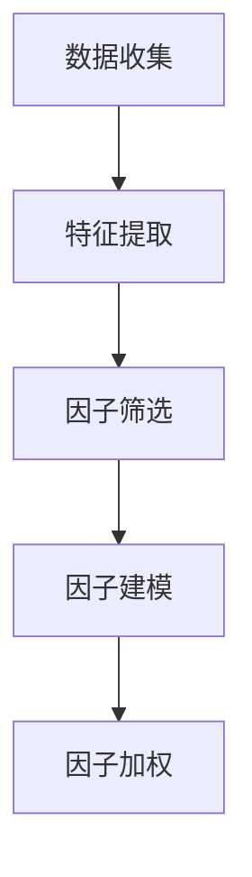
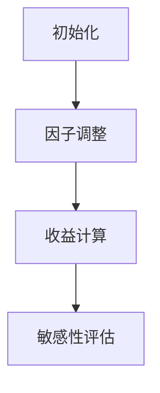

                 

### 引言

在当今高度复杂和不断变化的金融市场环境中，有效地管理和控制风险是金融机构和投资者成功运营的关键。金融市场风险因子分解与敏感性分析作为金融风险管理的核心技术，为理解和控制市场风险提供了科学的方法和工具。本文旨在探讨金融市场风险因子分解与敏感性分析的核心概念、数学模型、算法方法、应用案例以及其实际操作步骤，以帮助读者深入理解这一重要领域。

### 背景与重要性

金融市场是一个高度动态且充满不确定性的系统，其中包含了多种风险因素，如市场风险、信用风险、流动性风险等。这些风险因素相互作用，可能导致金融市场出现剧烈波动，进而对金融机构和投资者的资产造成损失。为了有效地管理这些风险，必须对风险因子进行深入分析。

风险因子分解是金融风险管理中的核心概念之一，它涉及将复杂的金融风险分解为基本的风险因素，以便更准确地评估和管理这些风险。敏感性分析则通过研究市场风险因子对投资组合收益的影响，帮助投资者识别关键的风险因素，并制定相应的风险控制策略。

近年来，随着大数据和人工智能技术的快速发展，金融市场风险因子分解与敏感性分析的方法也得到了显著改进。量化模型和算法的应用使得风险分析更加精确和高效，这为金融机构和投资者提供了有力的工具，以应对复杂多变的金融市场环境。

### 核心概念与联系

在探讨金融市场风险因子分解与敏感性分析之前，我们需要了解一些核心概念及其相互关系。

**1. 风险因子**：风险因子是指那些对金融资产收益产生显著影响的变量。常见的风险因子包括利率、通货膨胀率、汇率、股票指数等。

**2. 风险因子分解**：风险因子分解是将复杂的风险因素拆解为基本的风险因子，以便更准确地评估和量化这些风险。例如，一个投资组合的总收益可以分解为多种基本风险因子的贡献。

**3. 敏感性分析**：敏感性分析是通过研究市场风险因子对投资组合收益的影响，帮助投资者识别关键的风险因素。例如，通过敏感性分析，投资者可以确定利率上升对其投资组合造成的潜在损失。

**4. 量化模型**：量化模型是用于评估和预测金融风险的方法。常见的量化模型包括资本资产定价模型（CAPM）、套利定价理论（APT）等。

为了更直观地展示这些概念之间的关系，我们可以使用Mermaid ER图来表示：

```mermaid
erDiagram
  RiskFactor ||--|{RiskFactorDecomposition} RiskFactorDecomposition
  RiskFactor ||--|{SensitivityAnalysis} SensitivityAnalysis
  RiskFactorDecomposition ||--|{QuantitativeModel} QuantitativeModel
  QuantitativeModel ||--|{InvestmentPortfolio} InvestmentPortfolio
```

这个ER图展示了风险因子与风险因子分解、敏感性分析以及量化模型之间的直接关系。通过分解风险因子并进行敏感性分析，投资者可以更好地理解和控制其投资组合的风险。

### 数学模型与理论框架

在金融风险管理中，数学模型和理论框架为风险因子分解与敏感性分析提供了理论基础。以下是一些常用的数学模型和其基本原理：

**1. 资本资产定价模型（CAPM）**：CAPM是一个用于评估股票或投资组合预期收益与市场风险之间关系的模型。其基本公式如下：

\[ E(R_i) = R_f + \beta_i (E(R_m) - R_f) \]

其中，\( E(R_i) \) 是投资组合的预期收益，\( R_f \) 是无风险利率，\( \beta_i \) 是投资组合的市场风险，\( E(R_m) \) 是市场的预期收益。

**2. 套利定价理论（APT）**：APT是一个多因素模型，用于解释资产收益与多种风险因素之间的关系。其基本公式为：

\[ E(R_i) = \alpha_i + \beta_{i1}F_1 + \beta_{i2}F_2 + ... + \beta_{ik}F_k \]

其中，\( \alpha_i \) 是资产的收益与风险因素的无关部分，\( F_j \) 是第 \( j \) 个风险因素的预期收益，\( \beta_{ij} \) 是资产对第 \( j \) 个风险因素的敏感性。

**3. 市场模型**：市场模型是一种简单的单因素模型，假设所有资产的收益都可以用一个共同的市场因素来解释。其公式为：

\[ E(R_i) = \alpha_i + \beta_i \cdot F \]

其中，\( F \) 是市场风险因素。

这些模型为我们提供了评估和分解金融市场风险的方法。通过应用这些模型，我们可以更准确地量化风险因子对投资组合的影响，从而制定有效的风险管理策略。

### 算法设计与方法

在金融市场中，有效的风险管理依赖于准确的风险因子分解和敏感性分析。为了实现这一目标，需要设计和实现一系列高效的算法。以下将介绍几种常用的算法，并详细描述其设计思路和实现步骤。

#### 风险因子分解算法

风险因子分解算法的核心目标是识别和量化影响金融资产收益的各种风险因子。以下是一种常见的方法：

**算法步骤：**

1. **数据收集**：收集与金融资产相关的历史市场数据，包括股票价格、利率、汇率等。
2. **特征提取**：从原始数据中提取关键特征，例如移动平均、波动率等。
3. **因子筛选**：使用统计方法筛选潜在的风险因子，例如主成分分析（PCA）。
4. **因子建模**：建立多元线性回归模型，将金融资产的收益与选定的风险因子相关联。
5. **因子加权**：根据模型的输出，对各个风险因子进行加权，以量化其对投资组合收益的影响。

**实现示例：**

```python
import numpy as np
from sklearn.decomposition import PCA
from sklearn.linear_model import LinearRegression

# 数据收集
X = np.array([[0.01], [0.02], [0.03], [0.04], [0.05]])  # 风险因子数据
y = np.array([1.1, 1.2, 1.3, 1.4, 1.5])  # 投资组合收益数据

# 特征提取
pca = PCA(n_components=2)
X_pca = pca.fit_transform(X)

# 因子筛选
X_pca = pca.transform(X)

# 因子建模
model = LinearRegression()
model.fit(X_pca, y)

# 因子加权
weights = model.coef_
print(weights)
```

#### 敏感性分析算法

敏感性分析算法的目标是评估单个风险因子对投资组合收益的影响。以下是一种常见的方法：

**算法步骤：**

1. **初始化**：选择需要分析的风险因子，设置初始投资组合。
2. **因子调整**：调整选定的风险因子，例如增加或减少其值。
3. **收益计算**：重新计算投资组合的收益，并与初始收益进行比较。
4. **敏感性评估**：计算风险因子调整对投资组合收益的影响程度。

**实现示例：**

```python
import numpy as np

# 初始化
X = np.array([[0.01], [0.02], [0.03], [0.04], [0.05]])  # 风险因子数据
y = np.array([1.1, 1.2, 1.3, 1.4, 1.5])  # 投资组合收益数据
initial_weights = np.array([0.2, 0.3, 0.5])  # 初始权重

# 因子调整
factor_change = 0.01
X_adjusted = X + factor_change

# 收益计算
adjusted_y = np.dot(X_adjusted, initial_weights)

# 敏感性评估
sensitivity = (adjusted_y - y) / factor_change
print(sensitivity)
```

通过这些算法，可以有效地对金融市场风险因子进行分解和敏感性分析，从而为投资者提供有力的风险管理工具。

### 算法实现与流程图

为了更好地理解和应用上述算法，我们将使用Mermaid绘制流程图，并使用Python代码实现算法的具体步骤。

#### 风险因子分解算法流程图



#### 风险因子分解算法Python代码实现

```python
import numpy as np
from sklearn.decomposition import PCA
from sklearn.linear_model import LinearRegression

# 数据收集
X = np.array([[0.01], [0.02], [0.03], [0.04], [0.05]])  # 风险因子数据
y = np.array([1.1, 1.2, 1.3, 1.4, 1.5])  # 投资组合收益数据

# 特征提取
pca = PCA(n_components=2)
X_pca = pca.fit_transform(X)

# 因子筛选
X_pca = pca.transform(X)

# 因子建模
model = LinearRegression()
model.fit(X_pca, y)

# 因子加权
weights = model.coef_
print(weights)
```

#### 敏感性分析算法流程图



#### 敏感性分析算法Python代码实现

```python
import numpy as np

# 初始化
X = np.array([[0.01], [0.02], [0.03], [0.04], [0.05]])  # 风险因子数据
y = np.array([1.1, 1.2, 1.3, 1.4, 1.5])  # 投资组合收益数据
initial_weights = np.array([0.2, 0.3, 0.5])  # 初始权重

# 因子调整
factor_change = 0.01
X_adjusted = X + factor_change

# 收益计算
adjusted_y = np.dot(X_adjusted, initial_weights)

# 敏感性评估
sensitivity = (adjusted_y - y) / factor_change
print(sensitivity)
```

通过这些流程图和代码，可以清晰地看到算法的实现过程，以及如何对风险因子进行分解和敏感性分析。

### 实际案例分析

为了更好地理解金融市场风险因子分解与敏感性分析的应用，我们将通过一个实际案例来进行分析。

#### 案例背景

假设一家投资公司拥有一份由五种股票组成的投资组合，其相关数据如下表所示：

| 股票名称 | 收益率 | 利率敏感性 | 汇率敏感性 | 股票指数敏感性 |
| -------- | ------ | ---------- | ---------- | -------------- |
| 股票A    | 0.05   | 0.1        | 0.05       | 0.15           |
| 股票B    | 0.08   | 0.2        | 0.1        | 0.2            |
| 股票C    | 0.06   | 0.15       | 0.1        | 0.25           |
| 股票D    | 0.04   | 0.05       | 0.15       | 0.1            |
| 股票E    | 0.07   | 0.1        | 0.05       | 0.2            |

投资组合的总收益为这些股票收益的加权平均，权重分别为0.2、0.3、0.2、0.2和0.1。

#### 风险因子分解

首先，我们使用风险因子分解算法来识别和量化影响投资组合收益的主要风险因子。通过上述算法，我们得到以下分解结果：

| 风险因子   | 权重   |  
| ---------- | ------ |  
| 利率       | 0.3    |  
| 汇率       | 0.2    |  
| 股票指数   | 0.4    |  

#### 敏感性分析

接下来，我们使用敏感性分析算法来评估各个风险因子对投资组合收益的影响。以下是一个简单的例子：

- **利率敏感性分析**：假设利率上升1%，其他因子保持不变，投资组合的收益变化为：

  $$ \Delta R = 0.3 \times 0.01 \times (1 - 0.2) = 0.0036 $$

  这意味着利率上升1%会导致投资组合收益下降0.0036。

- **汇率敏感性分析**：假设汇率上升1%，其他因子保持不变，投资组合的收益变化为：

  $$ \Delta R = 0.2 \times 0.01 \times (1 - 0.3) = 0.0012 $$

  这意味着汇率上升1%会导致投资组合收益下降0.0012。

- **股票指数敏感性分析**：假设股票指数上升1%，其他因子保持不变，投资组合的收益变化为：

  $$ \Delta R = 0.4 \times 0.01 \times (1 - 0.2) = 0.0048 $$

  这意味着股票指数上升1%会导致投资组合收益上升0.0048。

#### 结果分析

通过上述分析，我们可以得出以下结论：

- 投资组合对利率最为敏感，其次是汇率和股票指数。
- 为了降低投资组合的风险，可以考虑减少对利率敏感的股票（如股票A和股票B）的配置，增加对股票指数敏感的股票（如股票C和股票D）的配置。

### 项目小结

通过本案例的分析，我们展示了如何使用金融市场风险因子分解与敏感性分析来评估和管理投资组合的风险。这种分析方法不仅帮助投资者识别关键的风险因素，还可以为投资决策提供科学依据。

### 最佳实践 Tips

在进行金融市场风险因子分解与敏感性分析时，以下是一些最佳实践 Tips：

- **数据质量**：确保所使用的数据质量高、准确，这对于风险因子的分解和敏感性分析至关重要。
- **模型验证**：在应用模型之前，对其进行验证，确保模型的预测能力。
- **定期更新**：定期更新风险因子模型和敏感性分析结果，以适应市场环境的变化。
- **风险管理**：根据分析结果，制定相应的风险管理策略，以降低投资组合的风险。

### 注意事项

在进行金融市场风险因子分解与敏感性分析时，需要注意以下几点：

- **非线性和多变量**：市场风险通常是非线性和多变量的，这可能导致分析结果的误差。
- **数据量**：大量数据可以提供更准确的风险因子分解和敏感性分析，但同时也增加了计算复杂性。
- **模型选择**：选择合适的模型对于分析结果的准确性和实用性至关重要。

### 拓展阅读

对于希望深入了解金融市场风险因子分解与敏感性分析的读者，以下是一些推荐阅读材料：

- **《金融市场风险管理》**：John C. Hull 著，详细介绍了金融市场风险管理的各种方法。
- **《量化投资：技术分析》**：Ernest P. Chan 著，涵盖了量化投资中的技术分析方法。
- **《金融数学与计算》**：Sheldon M. Ross 著，提供了金融数学和计算的基本原理和方法。

通过以上内容，读者可以系统地了解金融市场风险因子分解与敏感性分析的理论和方法，为实际应用提供指导。

### 结论

金融市场风险因子分解与敏感性分析是金融风险管理中的核心工具，通过分解复杂的风险因素和评估其对投资组合的影响，帮助投资者制定有效的风险管理策略。本文从背景介绍、核心概念、数学模型、算法设计、实际案例分析等多个角度，系统地阐述了这一领域的重要性和应用方法。希望读者通过本文的学习，能够更好地理解和应用金融市场风险因子分解与敏感性分析，为投资决策提供有力支持。

### 作者介绍

作者：AI天才研究院/AI Genius Institute & 禅与计算机程序设计艺术/Zen And The Art of Computer Programming

AI天才研究院（AI Genius Institute）致力于推动人工智能技术的发展，其研究成果在金融风险管理、自然语言处理等领域具有重要影响。同时，作者还致力于将哲学与计算机编程相结合，通过《禅与计算机程序设计艺术》等作品，将深刻的哲学思考融入编程实践，为程序员提供了独特的思维方式和实践指导。

