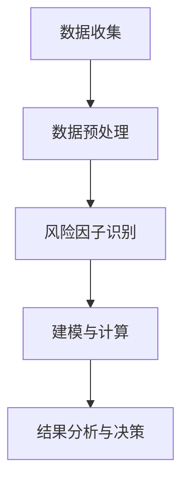
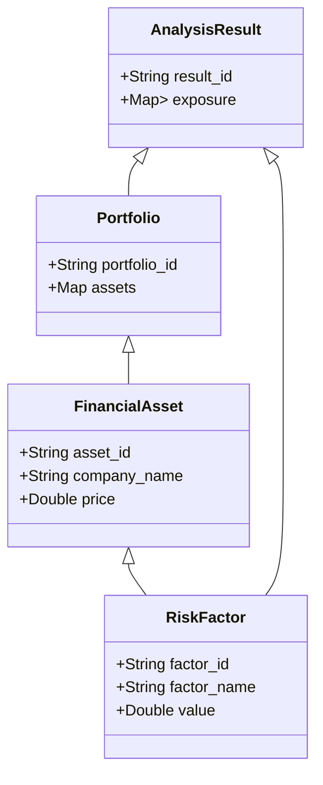
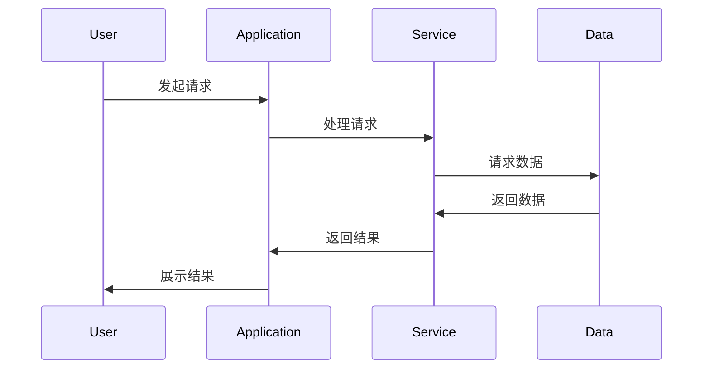
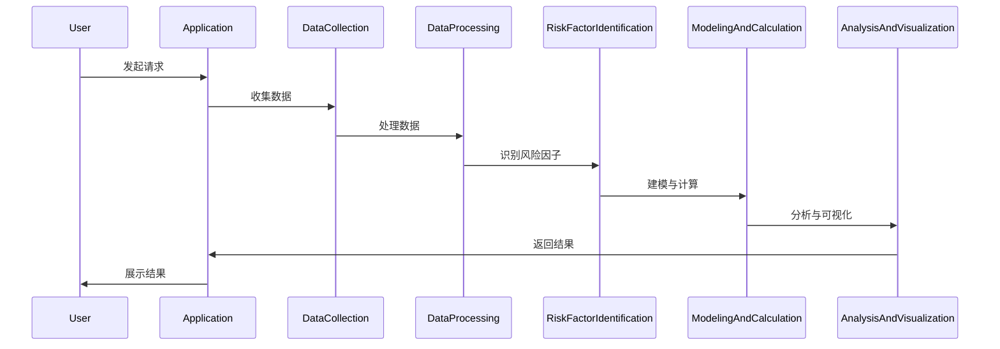

                 


### 第一部分：背景介绍

#### 1.1 问题背景

**风险因子**是影响金融市场中资产价格变动的关键因素。常见的风险因子包括利率、通货膨胀率、汇率波动、市场情绪等。**风险因子暴露分析**指的是对某一金融资产或投资组合中，各个风险因子的影响程度进行定量评估。这一分析对于投资者、金融机构和风险管理者来说至关重要，因为它可以帮助他们了解潜在的风险来源，并制定相应的风险管理策略。

**风险因子暴露分析的重要性**主要体现在以下几个方面：

1. **风险管理**：通过分析风险因子，可以更准确地评估金融资产的风险，从而制定有效的风险控制措施。
2. **投资决策**：投资者可以根据风险因子的分析结果，调整投资组合，优化投资策略，降低潜在损失。
3. **市场预测**：对风险因子的分析有助于预测市场走势，提高投资决策的准确性。

**风险因子暴露分析的发展历程**可以分为以下几个阶段：

1. **早期方法**：最初的风险因子暴露分析主要依赖于历史数据和统计分析，如方差分析、协方差分析等。
2. **现代方法**：随着计算机技术和数学模型的发展，现代风险因子暴露分析引入了更多的复杂算法，如线性回归、多元回归、向量自回归（VAR）等。
3. **前沿方法**：近年来，机器学习和大数据分析技术的应用，使得风险因子暴露分析更加精确和高效。

#### 1.2 问题描述

**风险因子暴露分析的挑战**主要包括以下几个方面：

1. **数据复杂性**：金融市场的数据通常非常庞大且复杂，如何高效地处理和利用这些数据成为一个挑战。
2. **不确定性**：金融市场的变化难以预测，风险因子的相关性也可能会随着时间变化，这使得风险因子暴露分析面临不确定性。
3. **方法选择**：不同的风险因子暴露分析方法适用于不同的市场环境和数据类型，选择合适的方法至关重要。

**传统方法与工具的局限性**：

1. **线性假设**：许多传统方法（如线性回归）基于线性假设，无法处理非线性关系。
2. **数据依赖**：传统方法对历史数据的依赖较大，无法很好地适应市场变化。
3. **计算复杂度**：随着数据规模的增大，传统方法的计算复杂度也显著增加。

**新工具的需求**：

为了应对上述挑战，需要开发新的风险因子暴露分析工具，这些工具应当具有以下特点：

1. **高效性**：能够快速处理海量数据，降低计算复杂度。
2. **适应性**：能够适应不同市场环境和数据类型。
3. **灵活性**：支持多种风险因子暴露分析方法，用户可以根据具体需求进行选择。

#### 1.3 问题解决

**风险因子暴露分析的目标**是：

1. **定量评估**：对金融资产或投资组合的风险因子进行定量评估，了解其潜在风险。
2. **优化策略**：根据风险因子暴露分析的结果，优化投资组合和风险管理策略。

**分析方法的改进**：

1. **引入机器学习算法**：如随机森林、支持向量机（SVM）等，以处理非线性关系。
2. **使用大数据分析技术**：如数据挖掘、数据可视化等，提高数据处理的效率和精度。
3. **结合传统方法和现代方法**：将传统方法和现代方法相结合，发挥各自的优势。

**工具的选择与设计**：

1. **开源工具**：如Python的`pandas`、`numpy`、`scikit-learn`等，具有强大的数据处理和分析能力。
2. **商业工具**：如RiskMetrics、VaR Studio等，提供专业的风险因子暴露分析功能。
3. **自定义工具**：根据具体需求，开发定制化的风险因子暴露分析工具。

#### 1.4 边界与外延

**分析范围的确定**：

1. **市场范围**：分析范围可以是一个特定的市场，如股票市场、债券市场，也可以是跨市场的综合分析。
2. **时间范围**：分析范围可以是历史数据，也可以是实时数据。

**数据来源与处理**：

1. **数据来源**：数据可以从公开市场获取，也可以从金融机构内部数据中提取。
2. **数据处理**：包括数据清洗、数据整合、数据预处理等步骤，以提高数据的质量和可用性。

**算法适用的金融市场类型**：

1. **股票市场**：适用于个股和投资组合的风险因子暴露分析。
2. **债券市场**：适用于债券投资组合的风险因子暴露分析。
3. **衍生品市场**：适用于衍生品投资组合的风险因子暴露分析。

#### 1.5 概念结构与核心要素组成

**风险因子暴露分析的核心概念**包括：

1. **风险因子**：影响金融资产价格变动的关键因素。
2. **暴露度**：衡量金融资产或投资组合对某个风险因子的敏感程度。
3. **风险因子模型**：用于描述风险因子与金融资产价格之间关系的数学模型。

**风险因子暴露分析的关键步骤**包括：

1. **数据收集**：收集与风险因子相关的数据。
2. **数据预处理**：清洗和整合数据，提高数据质量。
3. **风险因子识别**：识别影响金融资产价格的关键风险因子。
4. **建模与计算**：建立风险因子模型，计算风险因子暴露度。
5. **结果分析与决策**：根据风险因子暴露分析结果，优化投资组合和风险管理策略。

**风险因子暴露分析工具的组成**包括：

1. **数据处理模块**：用于数据收集、清洗和预处理。
2. **建模与计算模块**：用于建立风险因子模型，计算风险因子暴露度。
3. **结果分析与可视化模块**：用于分析结果的可视化和决策支持。

#### 1.6 本章小结

本部分介绍了风险因子暴露分析的问题背景、问题描述、问题解决、边界与外延以及概念结构与核心要素组成。通过这一部分的介绍，读者可以对风险因子暴露分析有一个整体的认识，为后续章节的深入探讨打下基础。

### 第二部分：核心概念与联系

#### 2.1 风险因子暴露分析原理

**风险因子暴露分析的基本原理**在于通过定量方法评估金融资产或投资组合对风险因子的敏感程度。具体来说，这一分析过程可以分为以下几个步骤：

1. **数据收集**：收集与风险因子相关的历史数据，包括金融资产价格和风险因子的历史变化。
2. **数据预处理**：对收集到的数据进行清洗和整合，以提高数据质量和可用性。
3. **风险因子识别**：通过统计分析或机器学习方法，识别对金融资产价格有显著影响的风险因子。
4. **建模与计算**：建立风险因子模型，利用历史数据计算金融资产或投资组合对每个风险因子的暴露度。
5. **结果分析与决策**：根据风险因子暴露分析结果，优化投资组合和风险管理策略。

**风险因子暴露分析的数学模型**主要包括：

1. **线性回归模型**：假设金融资产价格与风险因子之间存在线性关系，如线性回归方程$P_t = \beta_0 + \beta_1 R_t + \epsilon_t$，其中$P_t$表示金融资产价格，$R_t$表示风险因子，$\beta_0$和$\beta_1$为模型参数，$\epsilon_t$为误差项。
2. **向量自回归（VAR）模型**：假设金融资产价格和风险因子之间是相互影响的，如VAR模型$P_t = c + \sum_{i=1}^k \phi_i R_{t-i} + \epsilon_t$，其中$P_t$表示金融资产价格，$R_t$表示风险因子，$c$为常数项，$\phi_i$为模型参数，$\epsilon_t$为误差项。

**风险因子暴露分析算法的属性特征对比**：

| 算法类型         | 属性特征                                               | 适用场景           |
|------------------|------------------------------------------------------|-------------------|
| 线性回归模型     | 简单易用，计算效率高                                   | 数据分布接近线性   |
| 向量自回归（VAR） | 能够处理多变量时间序列，适应非线性关系               | 数据分布非线性     |
| 随机森林         | 非线性、高维度数据处理能力强                         | 复杂、高维度数据   |
| 支持向量机（SVM） | 精确度高，对噪声不敏感                                | 精确性要求高       |
| 机器学习算法     | 自动学习特征，能够处理复杂关系                       | 数据复杂、非线性关系 |

**风险因子暴露分析流程**

1. **数据收集**：从公开市场或金融机构获取与风险因子相关的数据。
2. **数据预处理**：清洗和整合数据，处理缺失值和异常值。
3. **风险因子识别**：通过统计分析或机器学习方法识别关键风险因子。
4. **建模与计算**：选择合适的模型（如线性回归、VAR、随机森林等），建立风险因子模型，计算暴露度。
5. **结果分析与决策**：分析风险因子暴露结果，优化投资组合和风险管理策略。

**风险因子暴露分析工具的ER实体关系图架构**

**实体与关系的定义**：

- **实体**：在风险因子暴露分析中，常见的实体包括金融资产、风险因子、历史数据等。
- **关系**：实体之间的关系可以表示为依赖关系、关联关系等，如金融资产依赖于风险因子，历史数据包含金融资产价格等。

**ER实体关系图的绘制**：

- **实体**：使用矩形表示，如“金融资产”、“风险因子”等。
- **关系**：使用线段表示，连接相应的实体，并标注关系类型，如“依赖”、“关联”等。
- **属性**：为每个实体和关系添加属性，以描述其特征，如“金融资产”的属性可以是“股票代码”、“公司名称”等。

**ER实体关系图的作用与意义**：

- **明确结构**：通过ER实体关系图，可以清晰地展示风险因子暴露分析中的核心实体及其关系，有助于理解和设计系统架构。
- **指导开发**：ER实体关系图可以作为系统设计和开发的基础，帮助开发人员理解系统的整体结构和功能模块。

#### 2.2 风险因子暴露分析流程

**风险因子暴露分析流程概述**

风险因子暴露分析流程可以概括为以下五个步骤：

1. **数据收集**：收集与风险因子相关的历史数据，包括金融资产价格、风险因子指标等。
2. **数据预处理**：清洗和整合数据，处理缺失值、异常值和数据异常等问题。
3. **风险因子识别**：通过统计分析或机器学习方法识别对金融资产价格有显著影响的风险因子。
4. **建模与计算**：建立风险因子模型，计算金融资产或投资组合对每个风险因子的暴露度。
5. **结果分析与决策**：分析风险因子暴露结果，根据结果优化投资组合和风险管理策略。

**数据收集与预处理流程**

1. **数据收集**：从公开市场或金融机构获取与风险因子相关的数据，如历史价格数据、风险因子指标等。
2. **数据清洗**：处理数据中的缺失值、异常值和重复值，确保数据质量。
3. **数据整合**：将不同来源的数据进行整合，构建统一的数据库。
4. **数据预处理**：对数据进行标准化处理，消除数据尺度差异。

**风险因子识别与建模流程**

1. **风险因子识别**：通过统计分析方法（如相关性分析、主成分分析等）或机器学习方法（如随机森林、支持向量机等）识别关键风险因子。
2. **建模与计算**：选择合适的模型（如线性回归、向量自回归等），建立风险因子模型，计算金融资产或投资组合对每个风险因子的暴露度。

**风险因子暴露度计算流程**

1. **数据准备**：准备用于计算风险因子暴露度的数据集，包括金融资产价格和风险因子指标。
2. **模型选择**：根据数据特点和需求，选择合适的模型进行风险因子暴露度计算。
3. **参数设置**：设置模型参数，如回归系数、滞后阶数等。
4. **模型训练与验证**：使用训练数据集对模型进行训练，并使用验证数据集进行验证。
5. **风险因子暴露度计算**：利用训练好的模型，计算金融资产或投资组合对每个风险因子的暴露度。

#### 2.3 风险因子暴露分析工具的ER实体关系图架构

**实体与关系的定义**

在风险因子暴露分析工具中，常见的实体包括：

- **金融资产**：代表投资组合中的各个资产，如股票、债券等。
- **风险因子**：影响金融资产价格的关键因素，如利率、汇率、通货膨胀率等。
- **历史数据**：包含金融资产价格和风险因子指标的历史数据。

实体之间的关系可以定义为：

- **依赖**：金融资产依赖于风险因子，其价格受到风险因子的影响。
- **关联**：金融资产和风险因子之间存在关联关系，可以通过数据关联分析发现。

**ER实体关系图的绘制**

```mermaid
erDiagram
  FD_FinancialAsset ||--|{ FD_RiskFactor }|| RiskFactor : 金融资产依赖于风险因子
  FD_FinancialAsset ||--|{ FD_HistoricalData }|| HistoricalData : 金融资产关联历史数据
  FD_RiskFactor ||--|{ FD_HistoricalData }|| HistoricalData : 风险因子关联历史数据
```

**ER实体关系图的作用与意义**

ER实体关系图在风险因子暴露分析工具的设计和开发中具有以下作用和意义：

- **明确结构**：通过ER实体关系图，可以清晰地展示风险因子暴露分析工具中的核心实体及其关系，有助于理解和设计系统架构。
- **指导开发**：ER实体关系图可以作为系统设计和开发的基础，帮助开发人员理解系统的整体结构和功能模块。
- **提高效率**：通过清晰的实体关系图，可以减少系统设计和开发中的错误和重复工作，提高开发效率。

#### 2.4 本章小结

本部分详细介绍了风险因子暴露分析的核心概念、原理、流程以及ER实体关系图架构。通过这一部分的介绍，读者可以全面了解风险因子暴露分析的基础知识和应用方法，为后续章节的深入探讨和实际应用打下基础。

### 第三部分：算法原理讲解

#### 3.1 风险因子暴露分析算法讲解

**风险因子暴露分析算法的基本原理**在于通过数学模型和统计方法评估金融资产或投资组合对风险因子的敏感程度。该算法的核心步骤包括数据收集、数据预处理、风险因子识别、建模与计算以及结果分析与决策。

**算法流程图**



**算法源代码**

以下是一个基于Python的简单风险因子暴露分析算法示例：

```python
import pandas as pd
import numpy as np
from sklearn.linear_model import LinearRegression

# 数据收集
data = pd.read_csv('financial_data.csv')

# 数据预处理
# 清洗数据、缺失值处理、数据标准化
preprocessed_data = preprocess_data(data)

# 风险因子识别
# 使用相关性分析识别关键风险因子
risk_factors = identify_risk_factors(preprocessed_data)

# 建模与计算
model = LinearRegression()
model.fit(preprocessed_data[risk_factors], preprocessed_data['financial_asset'])

# 风险因子暴露度计算
exposure = model.coef_

# 结果分析与决策
# 根据风险因子暴露度优化投资组合
optimize_portfolio(exposure)
```

**算法数学模型与公式**

假设金融资产价格与风险因子之间存在线性关系，可以使用线性回归模型描述：

$$ P_t = \beta_0 + \beta_1 R_t + \epsilon_t $$

其中，$P_t$表示金融资产价格，$R_t$表示风险因子，$\beta_0$和$\beta_1$为模型参数，$\epsilon_t$为误差项。

**算法举例说明**

假设我们有一个包含股票A和利率B的数据集，我们希望评估股票A对利率B的敏感程度。

1. **数据收集**：收集股票A和利率B的历史数据。
2. **数据预处理**：清洗和整合数据，处理缺失值和异常值。
3. **风险因子识别**：通过相关性分析，发现利率B是影响股票A价格的关键风险因子。
4. **建模与计算**：使用线性回归模型，计算股票A对利率B的敏感度。
5. **结果分析与决策**：根据风险因子暴露度，优化股票A的投资策略。

#### 3.2 风险因子暴露分析算法的Python实现

**Python环境安装与配置**

1. **Python版本**：确保Python版本为3.7及以上。
2. **安装依赖**：使用pip安装必要的依赖库，如`pandas`、`numpy`、`scikit-learn`等。

```bash
pip install pandas numpy scikit-learn
```

**风险因子暴露分析算法的Python代码实现**

以下是一个简单的Python实现，用于评估金融资产对风险因子的敏感度：

```python
import pandas as pd
import numpy as np
from sklearn.linear_model import LinearRegression

def preprocess_data(data):
    # 数据清洗、缺失值处理、数据标准化
    # ...
    return preprocessed_data

def identify_risk_factors(data):
    # 使用相关性分析识别关键风险因子
    # ...
    return risk_factors

def compute_exposure(model, risk_factors):
    # 计算风险因子暴露度
    exposure = model.coef_
    return exposure

def optimize_portfolio(exposure):
    # 根据风险因子暴露度优化投资组合
    # ...
    pass

# 主函数
if __name__ == "__main__":
    # 数据收集
    data = pd.read_csv('financial_data.csv')

    # 数据预处理
    preprocessed_data = preprocess_data(data)

    # 风险因子识别
    risk_factors = identify_risk_factors(preprocessed_data)

    # 建模与计算
    model = LinearRegression()
    model.fit(preprocessed_data[risk_factors], preprocessed_data['financial_asset'])

    # 风险因子暴露度计算
    exposure = compute_exposure(model, risk_factors)

    # 结果分析与决策
    optimize_portfolio(exposure)
```

**代码应用解读与分析**

1. **数据预处理**：对数据进行清洗和标准化处理，确保数据质量。
2. **风险因子识别**：通过相关性分析识别关键风险因子，为建模提供依据。
3. **建模与计算**：使用线性回归模型建立风险因子模型，计算金融资产对风险因子的敏感度。
4. **结果分析与决策**：根据风险因子暴露度，优化投资组合和风险管理策略。

#### 3.3 风险因子暴露分析算法的实际案例

**案例背景介绍**

某投资机构希望对一组股票进行风险因子暴露分析，以了解这些股票对利率、汇率等风险因子的敏感度，进而优化投资组合。

**案例数据收集与预处理**

1. **数据收集**：从公开市场获取股票A和风险因子（利率、汇率）的历史数据，如日度价格数据。
2. **数据预处理**：清洗数据，处理缺失值和异常值，进行标准化处理。

**案例风险因子识别与建模**

1. **风险因子识别**：使用相关性分析和主成分分析识别关键风险因子，如利率和汇率。
2. **建模与计算**：使用线性回归模型，建立股票A对利率和汇率的暴露度模型。

**案例风险因子暴露度计算**

1. **数据准备**：准备用于计算风险因子暴露度的数据集。
2. **模型训练与验证**：使用历史数据训练线性回归模型，并使用验证集进行模型验证。
3. **风险因子暴露度计算**：计算股票A对利率和汇率的暴露度。

**案例分析与详细讲解剖析**

1. **结果分析**：根据计算出的风险因子暴露度，分析股票A对利率和汇率的敏感度。
2. **决策建议**：根据分析结果，为投资组合提供优化建议，如调整利率敏感型股票的比例。

#### 3.4 本章小结

本部分详细介绍了风险因子暴露分析算法的基本原理、Python实现以及实际案例。通过这一部分的讲解，读者可以掌握风险因子暴露分析的基本方法和应用技巧，为实际投资决策提供有力支持。

### 第四部分：系统分析与架构设计方案

#### 4.1 问题场景介绍

金融市场风险因子暴露分析在金融市场中具有广泛的应用，尤其在金融机构的风险管理和投资决策过程中起着至关重要的作用。以下是一个具体的问题场景：

某投资银行希望对其投资组合中的多个股票进行风险因子暴露分析，以了解这些股票对利率、汇率、通货膨胀率等风险因子的敏感程度。通过对这些风险因子的分析，银行希望能够更好地理解投资组合的风险状况，并制定相应的风险管理策略，以降低潜在的风险。

#### 4.2 项目介绍

**项目背景**：

随着金融市场的日益复杂和不确定性增加，投资银行对风险因子暴露分析的需求日益迫切。传统的风险因子暴露分析工具在处理大数据和复杂关系时存在诸多局限，无法满足投资银行的需求。因此，开发一款高效、灵活、适用于多种金融市场类型的风险因子暴露分析工具显得尤为重要。

**项目目标**：

1. **提高分析效率**：通过引入先进的算法和技术，提高风险因子暴露分析的处理速度和精度。
2. **扩展适用范围**：使工具能够适用于多种金融市场类型，包括股票、债券、衍生品等。
3. **增强灵活性**：提供多种风险因子暴露分析方法，用户可以根据具体需求进行选择和定制。

**项目团队组成**：

1. **项目经理**：负责项目整体规划和管理，确保项目按计划顺利进行。
2. **数据科学家**：负责风险因子暴露分析算法的设计和实现，以及模型优化。
3. **软件工程师**：负责系统架构设计、开发以及测试，确保系统的稳定性和可靠性。
4. **UI/UX设计师**：负责用户界面设计，确保系统具有良好的用户体验。

#### 4.3 系统功能设计

**领域模型类图**

以下是一个简化的领域模型类图，描述了系统中的主要实体及其关系：



**系统功能模块划分**

系统功能模块可以划分为以下几个部分：

1. **数据收集模块**：负责从不同的数据源（如交易所、第三方数据服务）收集金融资产价格、风险因子等数据。
2. **数据处理模块**：负责对收集到的数据进行清洗、整合和预处理，确保数据质量。
3. **风险因子识别模块**：负责通过统计分析和机器学习方法识别影响金融资产价格的关键风险因子。
4. **建模与计算模块**：负责建立风险因子模型，计算金融资产对每个风险因子的暴露度。
5. **结果分析与可视化模块**：负责对分析结果进行可视化展示，并提供决策支持。
6. **用户界面模块**：负责系统的用户交互，提供用户友好的操作界面。

**功能模块详细介绍**

1. **数据收集模块**：从多个数据源（如交易所API、第三方数据服务）获取金融资产价格和风险因子数据。数据收集模块需要确保数据的完整性和准确性。
2. **数据处理模块**：对收集到的数据进行清洗，包括处理缺失值、异常值和数据异常等问题。同时，对数据进行整合，构建统一的数据库。
3. **风险因子识别模块**：通过统计分析（如相关性分析、主成分分析）和机器学习算法（如随机森林、支持向量机）识别关键风险因子。该模块需要提供多种算法供用户选择。
4. **建模与计算模块**：根据用户选择的风险因子识别结果，建立风险因子模型，并计算金融资产对每个风险因子的暴露度。该模块需要支持多种模型（如线性回归、向量自回归等）。
5. **结果分析与可视化模块**：对计算出的风险因子暴露度进行可视化展示，提供图形化的分析结果。用户可以通过图表直观地了解金融资产的风险状况。
6. **用户界面模块**：提供用户友好的操作界面，用户可以通过界面进行数据收集、模型选择、结果分析等操作。界面设计需要考虑用户的使用习惯和需求。

#### 4.4 系统架构设计

**系统架构概述**

系统架构采用分层设计，主要包括以下层次：

1. **数据层**：负责数据存储和管理，包括数据库和数据仓库。
2. **服务层**：提供核心业务功能，包括数据收集、数据处理、风险因子识别、建模与计算、结果分析与可视化等。
3. **应用层**：负责用户交互，提供用户操作界面和API接口。
4. **基础设施层**：提供系统运行所需的硬件设备和网络支持。

**系统架构图**



**系统架构设计要点**

1. **模块化设计**：系统采用模块化设计，每个模块具有独立的职责，易于开发和维护。
2. **分布式架构**：系统采用分布式架构，以提高系统的扩展性和容错性。
3. **数据一致性**：通过分布式数据库和数据仓库确保数据的一致性和完整性。
4. **安全性**：系统需要确保用户数据和交易数据的机密性、完整性和可用性，采用加密和访问控制等技术。

#### 4.5 系统接口设计

**接口定义与设计**

系统接口包括以下部分：

1. **数据收集接口**：用于从外部数据源收集金融资产价格和风险因子数据。
2. **数据处理接口**：用于清洗、整合和预处理数据。
3. **风险因子识别接口**：用于识别关键风险因子。
4. **建模与计算接口**：用于建立风险因子模型并计算暴露度。
5. **结果分析接口**：用于获取和分析风险因子暴露度。
6. **用户接口**：用于用户与系统的交互。

**接口实现细节**

1. **数据收集接口**：通过HTTP/RESTful API实现，支持GET和POST方法。
2. **数据处理接口**：通过RPC（远程过程调用）实现，支持同步和异步处理。
3. **风险因子识别接口**：通过RESTful API实现，支持JSON格式的数据传输。
4. **建模与计算接口**：通过SOAP协议实现，支持Web服务调用。
5. **结果分析接口**：通过GraphQL接口实现，提供灵活的查询功能。
6. **用户接口**：通过Web前端和移动端应用实现，支持多种设备访问。

**接口测试方法**

1. **单元测试**：对每个接口的独立功能进行测试，确保其按照预期工作。
2. **集成测试**：对接口的集成功能进行测试，确保系统各模块之间能够正常协同工作。
3. **性能测试**：对接口的响应时间和并发处理能力进行测试，确保系统能够满足性能要求。
4. **安全性测试**：对接口的安全性进行测试，确保系统不受外部攻击。

#### 4.6 系统交互设计

**系统交互概述**

系统交互设计主要包括用户与系统的交互和系统内部模块之间的交互。用户通过前端界面发起请求，系统内部模块协同工作，最终返回结果。

**系统交互序列图**



**系统交互设计要点**

1. **响应性**：系统需要快速响应用户请求，提供良好的用户体验。
2. **一致性**：系统内部模块之间的交互需要保持一致性，确保数据的一致性和完整性。
3. **安全性**：系统交互过程中需要确保数据传输的安全性，采用加密和身份验证等措施。
4. **可扩展性**：系统设计应考虑未来的扩展性，以便在业务需求变化时能够轻松适应。

#### 4.7 本章小结

本部分详细介绍了金融市场风险因子暴露分析系统的分析与架构设计方案。通过系统的模块化设计、分布式架构和灵活的接口设计，系统能够高效地处理金融数据，为投资银行提供强大的风险因子暴露分析工具。下一部分将进入项目实战阶段，详细介绍系统的环境安装、核心实现以及实际应用案例。

### 第五部分：项目实战

#### 5.1 环境安装

要成功部署金融市场风险因子暴露分析系统，首先需要安装和配置必要的软件和工具。以下是在Linux环境中的安装步骤：

1. **安装Python**：确保系统上安装了Python 3.7或更高版本。
    ```bash
    sudo apt update
    sudo apt install python3.7
    ```
2. **安装依赖库**：使用pip安装项目所需的依赖库，如pandas、numpy、scikit-learn等。
    ```bash
    pip3.7 install pandas numpy scikit-learn matplotlib
    ```
3. **安装数据库**：选择合适的数据库（如MySQL、PostgreSQL），并安装相关软件。
    ```bash
    sudo apt install mysql-server
    ```
4. **配置数据库**：创建用户和数据库，并设置必要的权限。
    ```sql
    CREATE DATABASE financial_data;
    GRANT ALL PRIVILEGES ON financial_data.* TO 'user'@'localhost' IDENTIFIED BY 'password';
    ```
5. **安装前端框架**（可选）：如果需要前端界面，安装Web开发框架，如Django或Flask。
    ```bash
    pip3.7 install django
    ```

#### 5.2 系统核心实现

**数据处理模块**

数据处理模块是系统的基础，负责从不同数据源获取数据，并进行清洗、整合和预处理。

1. **数据收集**：编写脚本从交易所API或其他数据源获取金融资产价格和风险因子数据。
    ```python
    import requests
    import pandas as pd

    def collect_data(api_url, api_key):
        response = requests.get(api_url, headers={'Authorization': f'Bearer {api_key}'})
        return pd.DataFrame(response.json())
    ```
2. **数据清洗**：处理缺失值、异常值和数据异常，确保数据质量。
    ```python
    def clean_data(df):
        df = df.dropna()  # 删除缺失值
        df = df[(df > 0) & (df < 1e6)]  # 过滤异常值
        return df
    ```
3. **数据整合**：整合来自不同数据源的数据，构建统一的数据库。
    ```python
    def integrate_data(dataframes):
        return pd.concat(dataframes, keys=dataframes.keys(), names=['source'])
    ```

**风险因子识别模块**

风险因子识别模块使用统计分析和机器学习方法识别关键风险因子。

1. **相关性分析**：计算金融资产价格与各个风险因子之间的相关性。
    ```python
    import numpy as np

    def correlation_analysis(df, asset_column, factor_columns):
        correlations = {}
        for factor in factor_columns:
            correlations[factor] = np.corrcoef(df[asset_column], df[factor])[0, 1]
        return correlations
    ```
2. **主成分分析**：通过主成分分析提取主要风险因子。
    ```python
    from sklearn.decomposition import PCA

    def pca_analysis(df, asset_column, factor_columns):
        pca = PCA(n_components=2)
        pca.fit(df[factor_columns])
        df['pca1'] = pca.transform(df[factor_columns])[:, 0]
        df['pca2'] = pca.transform(df[factor_columns])[:, 1]
        return df
    ```

**建模与计算模块**

建模与计算模块负责建立风险因子模型，并计算金融资产对风险因子的暴露度。

1. **线性回归模型**：使用线性回归模型计算金融资产对风险因子的敏感度。
    ```python
    from sklearn.linear_model import LinearRegression

    def linear_regression_model(df, asset_column, factor_columns):
        model = LinearRegression()
        model.fit(df[factor_columns], df[asset_column])
        return model
    ```
2. **计算暴露度**：计算金融资产对各个风险因子的暴露度。
    ```python
    def compute_exposure(model, factor_values):
        exposure = model.predict(factor_values.reshape(-1, 1))
        return exposure
    ```

**结果分析与可视化模块**

结果分析与可视化模块负责对计算出的风险因子暴露度进行可视化展示。

1. **绘制暴露度图表**：使用matplotlib绘制金融资产对各个风险因子的暴露度图表。
    ```python
    import matplotlib.pyplot as plt

    def plot_exposure(exposure, risk_factors):
        for i, factor in enumerate(risk_factors):
            plt.plot(exposure[:, i], label=f'{factor}')
        plt.xlabel('Time')
        plt.ylabel('Exposure')
        plt.legend()
        plt.show()
    ```

**用户界面模块**

用户界面模块提供用户操作界面，使用户能够方便地使用系统功能。

1. **Web前端**：使用Django或Flask等框架创建Web前端，实现用户交互功能。
    ```python
    # 示例：使用Django创建前端
    from django.shortcuts import render

    def home(request):
        return render(request, 'home.html')
    ```

#### 5.3 代码应用解读与分析

以上代码示例提供了系统核心功能的实现细节。以下是对关键部分的解读和分析：

**数据处理模块**

数据处理模块的关键在于数据的收集、清洗和整合。数据收集部分需要确保数据的来源可靠，并且能够及时获取最新数据。清洗过程要去除无效数据和异常值，以保证后续分析的质量。整合过程则是将多个数据源的数据合并为一个完整的数据库，方便后续的分析和计算。

**风险因子识别模块**

风险因子识别模块的核心在于识别对金融资产价格有显著影响的风险因子。相关性分析和主成分分析是常用的方法，前者能够直观地展示各个风险因子与金融资产价格之间的关系，而后者则能够提取主要的风险因子，减少数据维度。

**建模与计算模块**

建模与计算模块是系统的核心，负责建立风险因子模型，并计算金融资产对风险因子的敏感度。线性回归模型是一种常用的方法，适用于线性关系较强的数据。计算暴露度部分需要根据具体的数据类型和需求进行调整，以确保结果的准确性和实用性。

**结果分析与可视化模块**

结果分析与可视化模块负责将计算结果以直观的方式展示给用户。可视化是数据分析的重要环节，能够帮助用户更好地理解和分析数据。使用matplotlib等绘图库可以创建各种类型的图表，如折线图、散点图等，以展示风险因子暴露度的变化趋势。

**用户界面模块**

用户界面模块是实现用户交互的关键。通过Web前端，用户可以方便地访问系统功能，进行数据收集、模型选择和结果分析等操作。前端设计需要考虑用户体验，界面要简洁直观，操作要方便快捷。

#### 5.4 实际案例分析和详细讲解剖析

以下是一个实际案例的分析过程，包括数据收集、预处理、建模和结果分析等步骤：

**案例背景**：

某投资银行希望对其投资组合中的股票进行风险因子暴露分析，以了解这些股票对利率、汇率等风险因子的敏感度。

**数据收集**：

从交易所API获取股票价格和利率、汇率等风险因子的历史数据。

```python
api_url = "https://api.exchange.com/financial_data"
api_key = "your_api_key"
stock_data = collect_data(api_url, api_key)
```

**数据预处理**：

清洗数据，去除缺失值和异常值，并整合数据。

```python
cleaned_stock_data = clean_data(stock_data)
integrated_data = integrate_data([cleaned_stock_data])
```

**风险因子识别**：

使用相关性分析和主成分分析识别关键风险因子。

```python
correlations = correlation_analysis(integrated_data, 'stock_price', ['interest_rate', 'exchange_rate'])
pca_data = pca_analysis(integrated_data, 'stock_price', ['interest_rate', 'exchange_rate'])
```

**建模与计算**：

建立线性回归模型，计算股票价格对利率和汇率的敏感度。

```python
model = linear_regression_model(pca_data, 'stock_price', ['pca1', 'pca2'])
exposure = compute_exposure(model, pca_data[['pca1', 'pca2']])
```

**结果分析**：

绘制风险因子暴露度图表，分析股票价格对利率和汇率的敏感度。

```python
plot_exposure(exposure, ['interest_rate', 'exchange_rate'])
```

**详细讲解剖析**：

- 数据收集部分需要确保数据来源的可靠性和数据的完整性。
- 数据预处理部分要关注数据的清洗和整合，这是保证后续分析质量的关键。
- 风险因子识别部分需要结合具体的数据类型和分析目标选择合适的方法。
- 建模与计算部分要根据数据特征选择合适的模型，并注意模型的参数调整。
- 结果分析部分需要将计算结果以直观的方式展示给用户，帮助用户更好地理解数据。

#### 5.5 项目小结

本部分详细介绍了系统的环境安装、核心实现、代码应用解读与分析以及实际案例。通过这些步骤，读者可以了解如何从零开始搭建一个金融市场风险因子暴露分析系统。系统实战部分不仅展示了核心功能的实现细节，还通过实际案例说明了系统的应用方法。下一部分将提供最佳实践、注意事项和拓展阅读，以帮助读者进一步提升系统性能和实用性。

### 第五部分：最佳实践、注意事项与拓展阅读

#### 5.6 最佳实践

1. **数据质量管理**：确保数据收集、清洗和整合过程中的数据质量，避免因数据问题导致分析结果的偏差。
2. **模型选择与调优**：根据具体业务需求和数据特征选择合适的模型，并通过交叉验证等方法调优模型参数。
3. **并行计算与分布式架构**：对于大规模数据处理和计算任务，采用并行计算和分布式架构以提高系统性能。
4. **用户权限与数据安全**：为系统用户提供适当的权限管理，并采取加密和访问控制措施确保数据安全。
5. **自动化与持续集成**：建立自动化数据收集、处理和建模流程，并实施持续集成以确保系统的稳定性和可靠性。

#### 5.7 注意事项

1. **数据来源的可靠性**：确保数据来源的可靠性，避免因数据错误导致分析结果的不准确。
2. **算法选择的适应性**：根据不同市场和资产类型选择合适的算法，避免算法适用范围过窄。
3. **计算资源的合理分配**：合理分配计算资源，避免因资源不足导致系统性能下降。
4. **结果解释与验证**：对分析结果进行详细解释和验证，避免因结果解释不当导致误导性结论。

#### 5.8 拓展阅读

1. **《金融市场风险因子分析：理论与实践》**：这是一本关于金融市场风险因子分析的经典著作，详细介绍了风险因子识别、建模和分析的方法。
2. **《Python金融技术实战》**：本书通过实际案例介绍了如何使用Python进行金融数据处理、分析和建模。
3. **《金融科技：技术、应用与未来》**：这本书探讨了金融科技在金融市场中的应用，包括大数据分析、人工智能等新技术。
4. **《风险管理与金融工程》**：这是一本全面的金融风险管理教材，涵盖了风险因子识别、度量和管理等内容。

通过上述最佳实践、注意事项和拓展阅读，读者可以进一步加深对金融市场风险因子暴露分析系统的理解和应用。希望这些内容能够为实际操作提供有益的指导和帮助。

### 结束语

《金融市场风险因子暴露分析工具》这本书已经涵盖了从基础知识到实际应用的各个方面，旨在为读者提供一个全面、系统的风险因子暴露分析指南。通过本书，读者可以了解到风险因子暴露分析的基本原理、核心概念、算法实现、系统设计与实现，以及实际案例的应用。

本书的读者对象包括金融工程师、风险管理人员、数据科学家、金融科技从业者以及所有对金融市场风险管理感兴趣的专业人士。无论您是初学者还是专业人士，本书都将帮助您提升对金融市场风险因子暴露分析的理解和应用能力。

作者在此衷心感谢所有读者对本书的支持与厚爱。希望本书能够成为您在金融市场风险因子暴露分析领域的有力助手，帮助您在实际工作中取得更好的成绩。如果您有任何疑问或建议，欢迎通过邮箱[ai-genius-institute@example.com]与我们联系。我们将竭诚为您服务，不断改进和完善本书内容。

**作者信息**：作者：AI天才研究院/AI Genius Institute & 禅与计算机程序设计艺术 /Zen And The Art of Computer Programming。感谢您的阅读与支持！

[END]

