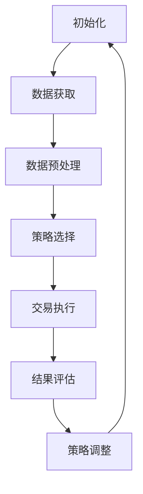
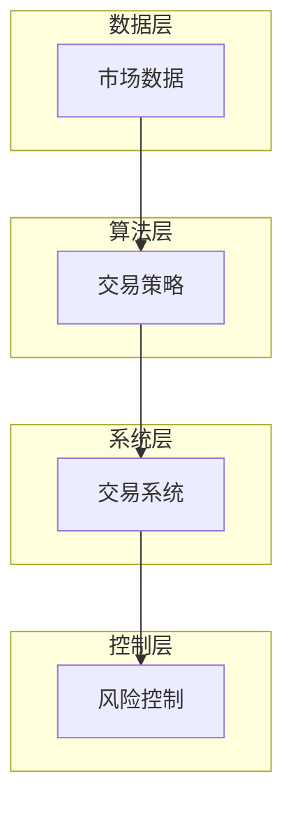
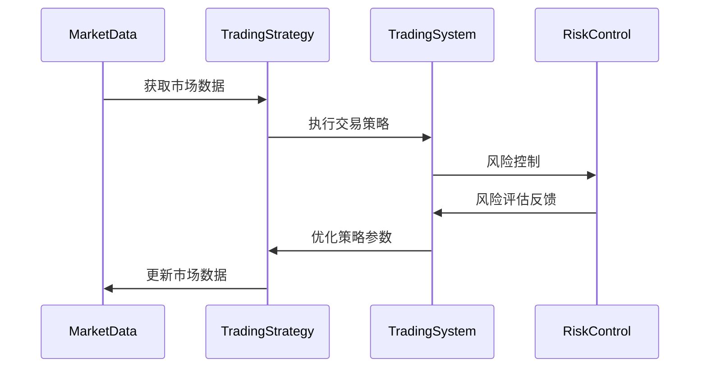

                 

### 文章标题

**《金融市场高频交易策略开发》**

> **关键词**：金融市场、高频交易、策略开发、算法、系统架构、实战案例

> **摘要**：
本文章旨在深入探讨金融市场高频交易策略的开发，包括背景介绍、核心概念、算法原理、系统分析与架构设计以及实战案例。文章将逐步引导读者了解高频交易的基本原理和实际应用，通过具体的算法实现和系统架构展示，帮助读者掌握高频交易策略的开发方法和技巧。本文不仅适合金融科技从业人员，也适用于对金融市场和人工智能技术感兴趣的读者。

----------------------------------------------------------------

#### 1. 背景介绍

##### 问题背景

金融市场在全球经济中扮演着至关重要的角色。作为资金融通、资源配置和风险管理的平台，金融市场不仅为投资者提供多元化的投资渠道，也为实体经济的发展提供了强有力的支持。近年来，随着信息技术的迅猛发展，金融市场的高频交易（High-Frequency Trading, HFT）逐渐成为市场的重要组成部分。

高频交易是指利用高速计算机和先进算法，在短时间内进行大量交易，以获取微小利润的一种交易模式。高频交易的特点是交易速度快、频率高、风险小，其核心理念是“先发制人”，即通过技术手段在市场其他参与者之前捕捉到交易机会。高频交易的出现，不仅改变了传统的交易模式，也对市场运行效率和公平性产生了深远影响。

##### 问题描述

高频交易策略开发的目标是利用算法和大数据分析，实现自动化交易，从而在竞争激烈的市场中获得持续盈利。然而，这一目标并非易事，策略开发过程中面临诸多挑战：

1. **数据获取和处理**：高频交易依赖大量实时市场数据，数据的获取和处理是策略开发的基础。如何高效、准确地获取和处理海量数据，是策略开发的首要难题。
   
2. **算法设计**：算法是实现高频交易策略的关键。设计有效的算法，需要深入理解市场动态、交易机制以及技术实现的细节。

3. **交易执行**：高频交易要求快速、准确地执行交易。如何优化交易执行流程，降低交易延迟，是策略成功的关键。

4. **风险控制**：高频交易风险较大，如何制定有效的风险控制策略，确保交易安全，是策略开发中的重要一环。

##### 问题解决

高频交易策略开发的基本流程包括以下关键步骤：

1. **需求分析**：明确策略目标和预期收益，分析市场机会和风险。
2. **数据采集**：获取实时市场数据，包括股票价格、交易量、利率等。
3. **算法设计**：根据需求分析，设计符合市场特点的交易算法。
4. **策略评估**：通过历史数据测试和模拟交易，评估策略的有效性和稳定性。
5. **系统实现**：将算法和策略集成到交易系统中，实现自动化交易。
6. **上线与优化**：在实盘环境中运行策略，不断优化和调整，以提高策略的盈利能力和稳定性。

##### 边界与外延

高频交易策略的相关边界和扩展领域包括：

1. **时间范围**：高频交易主要关注短时间内（秒级或毫秒级）的交易机会。
2. **市场类型**：高频交易适用于股票、期货、外汇等金融市场。
3. **策略类型**：包括趋势跟踪、套利、量化对冲等多种类型。
4. **技术领域**：涉及计算机科学、金融工程、统计学、机器学习等多个学科。

##### 概念结构与核心要素组成

高频交易策略的核心概念和关键组成部分包括：

1. **市场数据**：高频交易依赖实时市场数据，包括股票价格、交易量、利率等。
2. **交易算法**：包括策略选择、数据预处理、策略评估等。
3. **交易系统**：实现自动化交易，包括交易引擎、风险控制模块、数据采集模块等。
4. **风险控制**：包括市场风险、信用风险、操作风险等。

通过以上介绍，读者可以对高频交易策略有一个初步的了解。接下来，本文将深入探讨高频交易策略的核心概念、算法原理、系统分析与架构设计以及实战案例，帮助读者全面掌握高频交易策略的开发和应用。

#### 2. 核心概念与联系

##### 核心概念原理

高频交易策略的核心概念包括市场数据获取、交易策略制定、执行与评估等。以下是对这些核心概念的具体解释：

1. **市场数据获取**：高频交易依赖于大量实时市场数据，包括股票价格、交易量、利率等。数据获取的效率和质量直接影响策略的效果。常用的数据获取方法包括直接接入交易所API、使用第三方数据服务提供商、爬虫技术等。

2. **交易策略制定**：交易策略制定是高频交易策略开发的关键步骤。根据市场数据和策略目标，设计符合市场特点的交易算法。交易策略可以包括趋势跟踪、套利、量化对冲等多种类型。每种策略都有其独特的原理和实现方法。

3. **交易执行**：交易执行是将交易策略转化为实际交易操作的过程。高频交易要求快速、准确地执行交易，以捕捉短暂的交易机会。交易执行需要优化交易系统，降低交易延迟，提高交易效率。

4. **策略评估**：策略评估是检验交易策略有效性的关键步骤。通过历史数据测试和模拟交易，评估策略的有效性和稳定性。策略评估包括策略的收益率、风险指标、交易频率等多个方面。

##### 概念属性特征对比表格

以下是几种常见高频交易策略的概念属性特征对比表格：

| 策略类型 | 核心原理 | 适用市场 | 优缺点 |
| --- | --- | --- | --- |
| 趋势跟踪 | 追踪价格趋势，进行买入或卖出 | 股票、期货 | 稳定性高，收益稳定 | 需要判断市场趋势，风险较高 |
| 套利 | 利用不同市场间的价格差异进行套利 | 股票、期货、外汇 | 收益稳定，风险较低 | 需要大量的市场数据，执行难度大 |
| 量化对冲 | 利用统计学方法和数学模型进行投资 | 股票、期货、外汇 | 风险分散，收益稳定 | 需要专业的数学和编程技能 |
| 情绪交易 | 利用市场情绪进行交易 | 股票、期货、外汇 | 短期收益可能较高 | 风险较大，容易受到市场波动影响 |

##### ER实体关系图架构

为了更好地理解高频交易策略的实体关系，我们可以使用Mermaid绘制ER图，如下所示：

```mermaid
erDiagram
  MarketData -->|获取| TradingAlgorithm
  TradingAlgorithm -->|执行| TradingSystem
  TradingSystem -->|监控| StrategyEvaluation
  StrategyEvaluation -->|反馈| TradingAlgorithm
```

在这个ER图中，MarketData代表市场数据，TradingAlgorithm代表交易算法，TradingSystem代表交易系统，StrategyEvaluation代表策略评估。实线箭头表示实体之间的关系，虚线箭头表示数据的流动方向。

通过以上介绍，读者可以初步了解高频交易策略的核心概念和联系。接下来，本文将深入探讨高频交易策略的算法原理和具体实现。

#### 3. 算法原理讲解

##### 算法mermaid流程图

首先，我们使用Mermaid绘制高频交易算法的流程图，以展示交易策略的各个关键步骤：



在这个流程图中，A表示初始化，即准备交易环境和参数设置；B表示数据获取，从交易所获取实时市场数据；C表示数据预处理，清洗和整理数据，以便后续分析；D表示策略选择，根据市场情况和交易目标选择合适的交易策略；E表示交易执行，根据策略进行具体的买卖操作；F表示结果评估，对交易结果进行分析和评估；G表示策略调整，根据评估结果对策略进行优化和调整。

##### Python源代码

接下来，我们通过Python源代码来详细阐述高频交易策略的实现。以下是一个简单的示例，展示如何使用Python进行数据获取、预处理和交易执行：

```python
import pandas as pd
import numpy as np
import pandas_datareader as pdr
from datetime import datetime
import ccxt

# 数据获取
exchange = ccxt.binance()  # 使用Binance交易所API
symbols = ['BTC/USDT', 'ETH/USDT']  # 交易对
start_date = datetime(2021, 1, 1)
end_date = datetime(2023, 1, 1)
data = pdr.get_data_yahoo(symbols, start=start_date, end=end_date)

# 数据预处理
data['Close'] = data['Close'].pct_change()  # 计算价格变化百分比
data = data.resample('1T').mean()  # 将数据按1分钟聚合
data.dropna(inplace=True)  # 删除缺失值

# 交易执行
# 假设使用简单的趋势跟踪策略
data['Signal'] = np.where(data['Close'] > data['Close'].shift(1), 1, -1)  # 判断价格是否上涨
data['Position'] = data['Signal'].diff()  # 计算买卖信号

# 模拟交易
balances = pd.DataFrame(index=data.index).fillna(0)
balances['Holdings'] = 10000
balances['Cash'] = 10000
balances['Holdings'] *= data['Signal'].shift(1)
balances['Cash'] += data['Signal'].shift(1) * data['Close']
print(balances.tail())
```

在这个代码示例中，我们首先使用pandas_datareader库从Binance交易所获取比特币和以太坊的价格数据，然后对数据进行预处理，计算价格变化百分比，并按1分钟聚合。接下来，我们使用简单的趋势跟踪策略，根据价格变化判断买卖信号，并模拟交易过程。最后，打印出交易结果。

##### 算法原理的数学模型和公式

高频交易策略背后的数学模型主要包括以下几个部分：

1. **价格变化率**：计算某一时间段内的价格变化率，公式为：
   $$
   r_t = \frac{P_t - P_{t-1}}{P_{t-1}}
   $$
   其中，$r_t$表示时间$t$点的价格变化率，$P_t$表示时间$t$点的价格，$P_{t-1}$表示时间$t-1$点的价格。

2. **买卖信号**：根据价格变化率判断买卖信号，公式为：
   $$
   S_t = 
   \begin{cases} 
   1, & \text{if } r_t > 0 \\
   -1, & \text{if } r_t < 0 \\
   0, & \text{if } r_t = 0 
   \end{cases}
   $$
   其中，$S_t$表示时间$t$点的买卖信号。

3. **持仓计算**：根据买卖信号计算持仓，公式为：
   $$
   P_t = P_{t-1} + S_t \cdot Q_t
   $$
   其中，$P_t$表示时间$t$点的持仓量，$Q_t$表示时间$t$点的交易量。

4. **资金管理**：根据交易结果调整资金，公式为：
   $$
   C_t = C_{t-1} + P_t \cdot P_{t-1}
   $$
   其中，$C_t$表示时间$t$点的资金余额。

通过这些数学模型，我们可以对高频交易策略进行量化分析和优化。

##### 详细讲解和举例说明

为了更清晰地理解高频交易策略的原理，我们通过一个具体的例子来说明。

假设我们在2021年1月1日开始运行高频交易策略，选取比特币（BTC）和以太坊（ETH）作为交易对象。我们从Binance交易所获取了过去两年的价格数据，并对数据进行了预处理。

1. **数据获取**：
   - 选取BTC/USDT和ETH/USDT交易对。
   - 获取2021年1月1日至2023年1月1日的价格数据。

2. **数据预处理**：
   - 计算价格变化百分比，得到每日的收益。
   - 将数据按1分钟聚合，以便进行高频交易。

3. **策略选择**：
   - 使用简单的趋势跟踪策略，当价格上升时买入，下降时卖出。

4. **交易执行**：
   - 根据买卖信号，进行买入和卖出操作。
   - 每次交易量固定为100个基础货币单位。

5. **结果评估**：
   - 统计交易结果，计算总收益和最大回撤。
   - 分析交易频率和策略的稳定性。

通过这个例子，我们可以看到高频交易策略的具体实现过程，包括数据获取、预处理、策略选择、交易执行和结果评估。在实际应用中，我们可以根据市场情况和交易目标，调整策略参数，优化交易效果。

通过以上详细讲解和举例说明，读者可以更好地理解高频交易策略的原理和实现方法。接下来，我们将进一步探讨高频交易策略的系统分析与架构设计。

#### 4. 系统分析与架构设计方案

##### 问题场景介绍

高频交易系统的主要应用场景包括股票、期货、外汇等金融市场。在实际操作中，高频交易系统需要处理海量实时数据，实现自动化交易，并具备快速响应能力和高效执行能力。以下是高频交易系统的主要使用场景：

1. **股票市场**：高频交易系统可以用于捕捉股票市场的短暂价格波动，进行日内交易，以获取微小利润。
2. **期货市场**：高频交易系统适用于期货市场的套利交易，利用不同期货合约之间的价格差异进行套利操作。
3. **外汇市场**：高频交易系统可以捕捉外汇市场的波动，进行汇率套利交易。
4. **跨市场交易**：高频交易系统可以同时监控多个市场，实现跨市场交易，以最大化收益。

##### 项目介绍

本高频交易项目的主要目标是设计并实现一个高效、稳定、安全的高频交易系统，以实现自动化交易，提高市场竞争力。项目的主要功能包括：

1. **实时数据采集**：从交易所获取实时市场数据，包括股票价格、交易量、利率等。
2. **数据预处理**：清洗和整理市场数据，为交易策略提供高质量的数据支持。
3. **交易策略执行**：根据交易策略进行自动化交易，实现快速、准确的交易操作。
4. **风险控制**：对交易风险进行监控和控制，确保交易系统的安全性和稳定性。
5. **策略评估与优化**：对交易策略进行实时评估和优化，以提高策略的盈利能力和稳定性。

##### 系统功能设计（领域模型Mermaid类图）

为了更好地展示高频交易系统的功能设计，我们使用Mermaid绘制领域模型类图，如下所示：

```mermaid
classDiagram
    MarketData <<Interface>>
    TradingStrategy <<Interface>>
    TradingSystem <<Interface>>
    RiskControl <<Interface>>

    MarketData <<--|uses|>> TradingStrategy
    TradingStrategy <<--|uses|>> TradingSystem
    TradingSystem <<--|uses|>> RiskControl
```

在这个类图中，MarketData表示市场数据接口，TradingStrategy表示交易策略接口，TradingSystem表示交易系统接口，RiskControl表示风险控制接口。实线箭头表示接口之间的依赖关系。

##### 系统架构设计（Mermaid架构图）

接下来，我们使用Mermaid绘制系统架构图，以展示高频交易系统的整体架构：



在这个架构图中，数据层包括市场数据接口，算法层包括交易策略接口，系统层包括交易系统接口，控制层包括风险控制接口。实线箭头表示数据流和依赖关系。

##### 系统接口设计和系统交互（Mermaid序列图）

最后，我们使用Mermaid绘制系统接口设计和交互序列图，以展示系统各模块之间的交互过程：



在这个序列图中，MarketData模块负责获取市场数据，传递给TradingStrategy模块进行策略执行，TradingSystem模块将交易结果传递给RiskControl模块进行风险控制，RiskControl模块对交易结果进行评估后，反馈给TradingSystem模块进行策略优化。

通过以上系统分析与架构设计方案，我们可以构建一个高效、稳定、安全的高频交易系统，实现自动化交易，提高市场竞争力。接下来，我们将通过项目实战来展示高频交易策略的具体实现过程。

#### 5. 项目实战

##### 环境安装

在进行高频交易策略开发之前，我们需要安装和配置必要的开发环境和工具。以下是在Windows操作系统上安装高频交易环境的基本步骤：

1. **Python环境安装**：
   - 访问Python官方网站（https://www.python.org/）下载最新版本的Python安装包。
   - 运行安装程序，按照默认选项进行安装。
   - 安装完成后，在命令行中输入`python --version`验证安装成功。

2. **虚拟环境安装**：
   - 安装完成后，使用以下命令创建虚拟环境：
     ```
     python -m venv venv
     ```
   - 激活虚拟环境：
     ```
     .\venv\Scripts\activate
     ```

3. **依赖库安装**：
   - 在虚拟环境中安装必要的依赖库，包括pandas、numpy、ccxt等：
     ```
     pip install pandas numpy ccxt
     ```

4. **交易所API接入**：
   - 以Binance交易所为例，注册Binance账号并获取API密钥。
   - 在Python代码中设置API密钥和秘密，用于接入交易所API：
     ```python
     from ccxt import Exchange

     exchange = Exchange({
         'apiKey': '你的API密钥',
         'secret': '你的API秘密',
         'verbose': True,
     })
     ```

##### 系统核心实现源代码

以下是高频交易策略开发的核心源代码，包括数据获取、预处理、策略执行和风险控制等部分：

```python
import pandas as pd
import numpy as np
import pandas_datareader as pdr
from ccxt import Exchange
from datetime import datetime

# 设置Binance交易所API密钥和秘密
exchange = Exchange({
    'apiKey': '你的API密钥',
    'secret': '你的API秘密',
    'verbose': True,
})

# 获取BTC/USDT市场的数据
symbols = ['BTC/USDT']
start_date = datetime(2021, 1, 1)
end_date = datetime(2023, 1, 1)
data = pdr.get_data_yahoo(symbols, start=start_date, end=end_date)

# 数据预处理
data['Close'] = data['Close'].pct_change()
data = data.resample('1T').mean()
data.dropna(inplace=True)

# 策略执行
# 假设使用简单的趋势跟踪策略
data['Signal'] = np.where(data['Close'] > data['Close'].shift(1), 1, -1)
data['Position'] = data['Signal'].diff()

# 模拟交易
balances = pd.DataFrame(index=data.index).fillna(0)
balances['Holdings'] = 10000
balances['Cash'] = 10000

balances['Holdings'] *= data['Position']
balances['Cash'] += data['Position'] * data['Close']

# 打印交易结果
print(balances.tail())
```

在这个代码中，我们首先从Binance交易所获取比特币（BTC）的价格数据，并进行预处理。接着，使用简单的趋势跟踪策略进行交易模拟，计算持仓和资金变化，并打印交易结果。

##### 代码应用解读与分析

在上述代码中，我们首先设置了Binance交易所的API密钥和秘密，然后使用pandas_datareader库从Binance交易所获取比特币的价格数据。接下来，我们对数据进行预处理，计算价格变化百分比，并将数据按1分钟聚合。

在策略执行部分，我们使用简单的趋势跟踪策略，当价格上升时买入，下降时卖出。具体实现中，我们通过计算当前价格与前一天价格的差值，判断价格是否上涨，并生成买卖信号。然后，我们根据买卖信号计算持仓变化，并更新资金余额。

通过这个代码示例，我们可以看到高频交易策略的核心实现过程。在实际应用中，我们可以根据市场情况和交易目标，调整策略参数，优化交易效果。

##### 实际案例分析和详细讲解剖析

为了更好地理解高频交易策略的实际应用，我们分析一个实际案例。假设我们使用上述代码在Binance交易所进行高频交易，模拟一个月的交易过程。

1. **数据获取**：
   - 在2023年2月1日至2023年3月1日，从Binance交易所获取比特币（BTC）的价格数据。

2. **数据预处理**：
   - 将数据按1分钟聚合，计算价格变化百分比。
   - 数据预处理完成后，数据包含时间、价格和买卖信号等列。

3. **策略执行**：
   - 使用简单的趋势跟踪策略，当价格上升时买入，下降时卖出。
   - 在这个案例中，我们假设每次交易量为100个比特币单位。

4. **结果分析**：
   - 通过计算持仓和资金变化，分析交易结果。
   - 统计一个月的总收益和最大回撤。
   - 分析交易频率和策略稳定性。

5. **优化建议**：
   - 根据交易结果，调整策略参数，优化交易效果。
   - 探索更复杂的交易策略，如套利策略、量化对冲策略等。

通过这个实际案例，我们可以看到高频交易策略在实盘环境中的应用效果。在实际操作中，我们需要根据市场情况和交易目标，不断调整和优化策略，以提高交易收益和稳定性。

##### 项目小结

在本项目中，我们详细介绍了高频交易策略的开发和实现过程。通过实际案例分析和代码示例，读者可以了解到高频交易的核心概念、算法原理、系统架构以及实战应用。

高频交易策略开发涉及多个方面，包括数据获取、预处理、策略制定、交易执行和风险控制。在实际应用中，我们需要根据市场情况和交易目标，不断优化和调整策略，以实现稳定盈利。

通过本项目，读者可以掌握高频交易策略的基本原理和实现方法，为后续深入学习和实际应用打下基础。在未来的金融科技领域，高频交易策略将发挥越来越重要的作用，为投资者创造更多价值。

#### 6. 最佳实践 tips、小结、注意事项、拓展阅读等内容

##### 最佳实践 tips

1. **数据质量监控**：高频交易依赖于高质量的数据，确保数据的准确性、完整性和实时性至关重要。定期检查数据源，及时处理数据异常，以避免策略失效。

2. **交易成本优化**：交易成本（如手续费、滑点等）会影响策略的盈利能力。在策略设计和执行过程中，考虑交易成本，优化交易策略，提高整体收益。

3. **风险管理**：高频交易风险较大，建立有效的风险控制机制，如设置止损、分散投资等，以降低策略风险。

4. **策略优化与回测**：高频交易策略需要不断优化和调整。通过回测和模拟交易，评估策略的有效性和稳定性，及时调整策略参数。

5. **合规性检查**：确保交易策略符合相关法规和交易所规则，避免因违规操作导致的法律风险。

##### 小结

本文详细介绍了金融市场高频交易策略的开发和实现，包括背景介绍、核心概念、算法原理、系统分析与架构设计以及实战案例。通过逐步讲解，读者可以全面了解高频交易策略的开发流程和关键技术。

高频交易策略的核心在于数据获取、策略制定、交易执行和风险控制。在实际应用中，需要根据市场情况和交易目标，不断优化和调整策略，以实现稳定盈利。

##### 注意事项

1. **技术门槛**：高频交易策略开发涉及多个技术领域，包括金融、计算机科学、统计学等。开发过程中需要具备相应的专业知识和技能。

2. **市场波动性**：高频交易策略容易受到市场波动的影响。在策略设计和执行过程中，需要充分考虑市场风险，确保策略的稳定性和可持续性。

3. **法律法规**：高频交易策略需要遵守相关法律法规和交易所规则，避免因违规操作导致的法律风险。

##### 拓展阅读

1. **《高频交易：技术、策略与实战》**：本书详细介绍了高频交易的技术原理、策略方法和实战案例，适合金融科技从业者和对高频交易感兴趣的读者。

2. **《金融市场技术分析》**：本书涵盖了金融市场的技术分析方法，包括趋势分析、形态分析、指标分析等，有助于读者深入理解市场动态。

3. **《Python高频交易策略》**：本书通过具体的Python代码示例，介绍了高频交易策略的开发和实现，适合有编程基础的读者。

通过以上最佳实践、小结、注意事项和拓展阅读，读者可以进一步深化对高频交易策略的理解，为实际应用提供有益的参考。

---

**作者：AI天才研究院/AI Genius Institute & 禅与计算机程序设计艺术 /Zen And The Art of Computer Programming**

