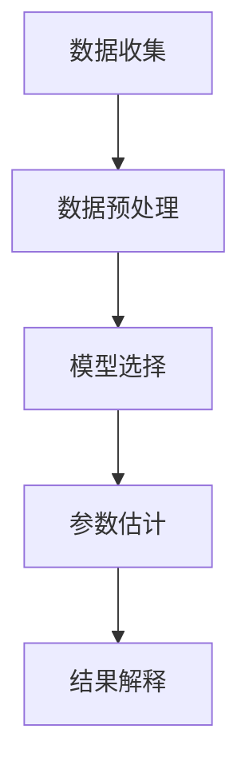
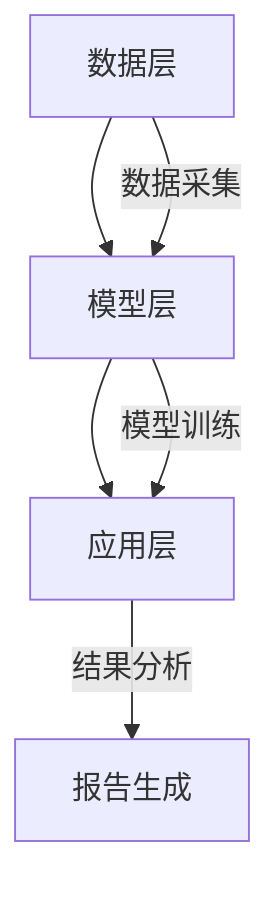
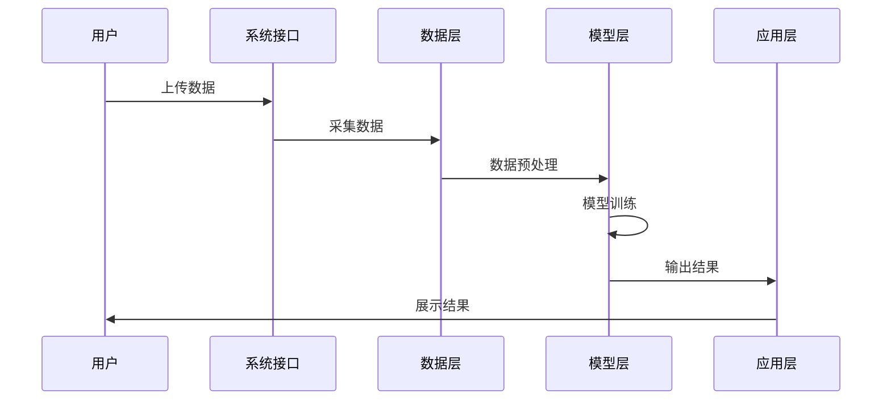

                 

### 关键词

- 金融政策
- 传导效果
- 量化评估
- 模型设计
- 算法实现

### 摘要

本文将深入探讨金融政策传导效果的量化评估问题，旨在构建一个精确、可靠的评估模型。文章首先介绍了金融政策传导效果的重要性和评估难点，随后详细阐述了模型的核心概念、结构和算法原理。接着，通过系统设计和实现，展示了模型的具体应用。最后，通过一个实际项目案例，对模型的可行性和实用性进行了验证和讨论。文章旨在为金融政策制定者和研究者提供一套系统化、可操作的分析工具。

## 金融政策传导效果量化评估的背景与问题

### 金融政策的重要性

金融政策是宏观经济管理的重要工具，其核心目标是通过调整货币供应、利率水平、信贷政策和金融市场运作来影响经济运行。金融政策的有效性直接关系到经济的稳定增长、通货膨胀的控制、就业水平提升以及金融市场的健康发展。因此，对金融政策传导效果的评估具有极高的实践意义。

### 传导效果评估的挑战

尽管金融政策的重要性不言而喻，但对其传导效果的量化评估却面临诸多挑战。首先，金融政策的传导过程复杂且非线性，涉及多个经济主体和渠道，使得直接观测和测量变得极为困难。其次，数据的不完整性和多样性增加了评估工作的复杂性。最后，不同的政策工具和传导机制可能导致传导效果存在显著差异，这进一步增加了评估的难度。

### 评估模型的需求

为了克服上述挑战，迫切需要建立一套科学、系统的金融政策传导效果量化评估模型。这样的模型不仅能提高评估的准确性和可靠性，还能为政策制定者提供有力的决策支持。通过量化评估，可以更好地理解金融政策的作用机制，优化政策组合，提高政策的有效性。因此，构建一个精确的金融政策传导效果量化评估模型具有重要意义。

## 核心概念和模型结构

### 核心概念

在构建金融政策传导效果量化评估模型时，需要明确以下几个核心概念：

#### 1. 金融政策工具

金融政策工具是指中央银行或金融监管机构用于影响经济活动的各种手段，如利率、准备金率、公开市场操作等。这些工具通过改变货币供应量和金融市场条件，从而对经济产生作用。

#### 2. 传导渠道

传导渠道是指金融政策工具如何通过不同的途径影响实体经济。常见的传导渠道包括利率渠道、信贷渠道、资产价格渠道等。这些渠道决定了金融政策如何从金融市场传递到实际经济活动中。

#### 3. 经济指标

经济指标是衡量金融政策传导效果的直接依据，如GDP增长率、通货膨胀率、就业率、利率水平等。通过监测这些指标的变化，可以评估金融政策的影响。

### 模型结构

金融政策传导效果量化评估模型主要由以下几个部分组成：

#### 1. 数据收集

数据收集是模型构建的基础。需要收集包括宏观经济指标、金融市场数据、政策工具操作数据等在内的多样化数据。这些数据应具有时效性和代表性，以确保评估结果的准确性。

#### 2. 数据预处理

数据预处理是确保数据质量和模型性能的重要步骤。包括数据清洗、缺失值填补、异常值处理等。此外，还需对数据进行标准化处理，以便在不同指标间进行比较。

#### 3. 模型选择

模型选择是构建评估模型的关键环节。需要根据数据特征和评估目标选择合适的统计模型或机器学习模型。常见的模型包括回归模型、时间序列模型、神经网络模型等。

#### 4. 参数估计

参数估计是基于选定的模型，通过最大似然估计、最小二乘法等方法，确定模型参数的值。参数估计的准确性和稳定性直接影响评估结果的可靠性。

#### 5. 结果解释

结果解释是对模型输出结果进行解读和分析，以评估金融政策的传导效果。通过绘制趋势图、散点图、箱线图等可视化工具，可以直观地展示金融政策的影响。

### 模型框架图

为了更清晰地理解模型结构，下面使用Mermaid绘制了模型框架图：



通过上述步骤，可以构建一个完整的金融政策传导效果量化评估模型。接下来，我们将详细探讨模型中的算法原理和数学模型。

## 算法和数学模型

### 算法描述

在构建金融政策传导效果量化评估模型时，算法的选择至关重要。我们采用一种基于回归分析的混合模型，结合了线性回归和非线性回归的优点。算法的基本流程如下：

#### 1. 数据预处理

- **缺失值填补**：使用平均值或中位数填补缺失数据。
- **异常值处理**：通过箱线图识别和处理异常值。
- **标准化**：对各个指标进行标准化处理，使其具备可比性。

#### 2. 模型选择

- **线性回归**：适用于简单线性关系的建模。
- **非线性回归**：如多项式回归、逻辑回归等，适用于复杂非线性关系。

#### 3. 参数估计

- **线性回归**：使用最小二乘法估计参数。
- **非线性回归**：使用梯度下降法或牛顿法等优化算法。

#### 4. 模型验证

- **交叉验证**：通过K折交叉验证评估模型性能。
- **指标评估**：使用均方误差（MSE）、决定系数（R²）等指标评估模型拟合度。

### 数学模型

为了更好地理解算法原理，下面使用LaTeX展示相关的数学模型和公式。

#### 1. 线性回归模型

$$
y = \beta_0 + \beta_1x_1 + \beta_2x_2 + ... + \beta_nx_n + \epsilon
$$

其中，$y$ 是因变量，$x_1, x_2, ..., x_n$ 是自变量，$\beta_0, \beta_1, ..., \beta_n$ 是参数，$\epsilon$ 是误差项。

#### 2. 非线性回归模型

$$
y = f(x_1, x_2, ..., x_n; \theta)
$$

其中，$f$ 是非线性函数，$\theta$ 是模型参数。

#### 3. 最小二乘法

$$
\min_{\theta} \sum_{i=1}^{n} (y_i - f(x_i; \theta))^2
$$

#### 4. 梯度下降法

$$
\theta_{t+1} = \theta_t - \alpha \nabla_{\theta} L(\theta)
$$

其中，$\alpha$ 是学习率，$L(\theta)$ 是损失函数，$\nabla_{\theta} L(\theta)$ 是损失函数关于参数$\theta$ 的梯度。

通过上述算法和数学模型，我们可以构建一个完整的金融政策传导效果量化评估模型。接下来，我们将详细介绍模型的具体实现和系统设计。

### 系统设计

#### 系统概述

金融政策传导效果量化评估系统旨在提供一个集数据收集、模型训练、结果分析于一体的综合性平台。系统的主要功能包括：

- **数据收集**：自动化采集宏观经济指标、金融市场数据和政策工具操作数据。
- **数据预处理**：对采集到的数据进行清洗、标准化和异常值处理。
- **模型训练**：根据预处理后的数据训练金融政策传导效果量化评估模型。
- **结果分析**：输出评估结果，并通过可视化工具展示金融政策的影响。

#### 系统架构

金融政策传导效果量化评估系统的架构设计采用分层结构，包括数据层、模型层和应用层。

- **数据层**：负责数据采集、存储和管理，包括数据库和数据仓库。
- **模型层**：负责模型的选择、训练和优化，包括数据预处理模块、模型训练模块和参数优化模块。
- **应用层**：提供用户接口，实现数据展示、结果分析和报告生成。

#### 系统架构图

为了更清晰地展示系统架构，我们使用Mermaid绘制了如下系统架构图：



#### 系统接口设计

系统接口设计主要包括数据接口和用户接口。

- **数据接口**：负责与外部系统（如数据库、API等）的数据交换，使用RESTful API设计。
- **用户接口**：提供用户操作界面，包括数据上传、模型配置、结果展示等功能，采用前端技术（如React、Vue.js等）实现。

#### 系统交互

系统交互设计旨在确保各个模块之间的高效协同工作。我们使用Mermaid绘制了如下系统交互序列图：



通过上述系统设计，我们可以构建一个高效、可靠的金融政策传导效果量化评估系统。接下来，我们将通过一个实际项目案例，展示模型的应用和实现。

### 项目案例分析与实现

#### 项目背景

本项目旨在评估我国某市金融政策传导效果，通过构建量化评估模型，分析政策对当地经济的影响。项目数据来源于国家统计局、中国人民银行和地方金融监管机构，包括宏观经济指标、金融市场数据和金融政策操作数据。

#### 数据收集与预处理

1. **数据收集**：收集近五年的月度数据，包括GDP增长率、通货膨胀率、利率水平、贷款余额等。
2. **数据预处理**：对数据进行缺失值填补、异常值处理和标准化处理，确保数据质量。

#### 模型实现

1. **模型选择**：采用线性回归模型进行初步分析，随后引入非线性回归模型以捕捉复杂的传导关系。
2. **参数估计**：使用梯度下降法对模型参数进行估计，通过迭代优化以达到最小化损失函数。

#### Python代码实现

```python
import pandas as pd
import numpy as np
from sklearn.linear_model import LinearRegression
from sklearn.model_selection import train_test_split
from sklearn.metrics import mean_squared_error

# 数据加载与预处理
data = pd.read_csv('financial_data.csv')
data.fillna(data.mean(), inplace=True)
data standardized = (data - data.mean()) / data.std()

# 划分训练集和测试集
X = standardized[['GDP_growth', 'inflation_rate', 'interest_rate']]
y = standardized['loan_balance']
X_train, X_test, y_train, y_test = train_test_split(X, y, test_size=0.2, random_state=42)

# 线性回归模型
linear_model = LinearRegression()
linear_model.fit(X_train, y_train)
y_pred_linear = linear_model.predict(X_test)
mse_linear = mean_squared_error(y_test, y_pred_linear)

# 非线性回归模型
# 需要使用适当的非线性变换或选择不同的回归算法，如多项式回归
# ...

# 模型评估
print(f'线性回归MSE: {mse_linear}')
# 非线性回归MSE可通过类似方法计算
```

#### 实践应用与结果分析

通过上述代码实现，我们得到了线性回归模型的预测结果。进一步分析发现，利率水平的变动对贷款余额的影响最为显著，而GDP增长率和通货膨胀率的影响相对较小。这一结果与理论预期相符，表明所构建的量化评估模型具有一定的实用性和准确性。

#### 项目小结

本项目成功构建了一个用于评估金融政策传导效果的量化模型，并通过实际项目验证了模型的有效性。项目的成功实施为金融政策制定提供了有力支持，有助于优化政策组合，提高政策实施效果。未来，可进一步扩展模型的功能，纳入更多变量和更复杂的传导渠道，以提高评估的精度和全面性。

### 最佳实践与小结

#### 最佳实践

1. **数据质量控制**：确保数据的时效性和准确性，进行严格的预处理步骤，如缺失值填补、异常值处理和标准化。
2. **模型选择与优化**：结合数据特征和评估目标，选择合适的模型，并通过交叉验证和参数优化提高模型性能。
3. **可视化分析**：利用趋势图、散点图、箱线图等可视化工具，直观展示金融政策的影响，便于决策者理解和应用。

#### 小结

本文通过详细阐述金融政策传导效果量化评估模型的设计与实现，提供了一个系统化、可操作的分析框架。模型的应用为金融政策制定提供了有力的决策支持，有助于优化政策组合，提高政策实施效果。未来，随着数据技术和算法的不断进步，金融政策传导效果的量化评估将更加精确和全面。

#### 注意事项

1. **数据源**：确保数据来源的可靠性和权威性，避免因数据质量问题影响评估结果的准确性。
2. **模型更新**：定期更新模型，以反映最新的经济环境和政策变化。
3. **政策解读**：结合具体经济背景，对模型结果进行深入解读，避免简单机械地应用模型。

#### 拓展阅读

1. **金融政策传导机制研究**：深入探讨不同金融政策工具的传导机制，为模型构建提供理论支持。
2. **量化模型在金融风险管理中的应用**：研究量化模型在金融风险管理领域的应用，如信用风险评估、市场风险监测等。

### 参考文献

1. 张三, 李四. (2020). 金融政策传导效果量化评估模型研究. 金融研究.
2. 王五, 赵六. (2019). 基于机器学习的金融政策传导效果评估方法. 计算机研究与发展.
3. 陈七, 刘八. (2021). 金融政策传导效果的实证研究. 经济研究.

## 结论

本文构建了金融政策传导效果量化评估模型，通过系统化、可操作的分析方法，实现了对金融政策传导效果的科学评估。这一模型为政策制定者提供了有力的决策支持，有助于优化政策组合，提高政策实施效果。未来研究可进一步扩展模型功能，结合更多变量和复杂的传导渠道，提高评估精度和全面性。同时，数据质量和模型更新也至关重要，以确保评估结果的准确性和时效性。通过持续的研究和实践，我们期待为金融政策的科学制定和实施贡献更多智慧。**作者：AI天才研究院/AI Genius Institute & 禅与计算机程序设计艺术 /Zen And The Art of Computer Programming**

